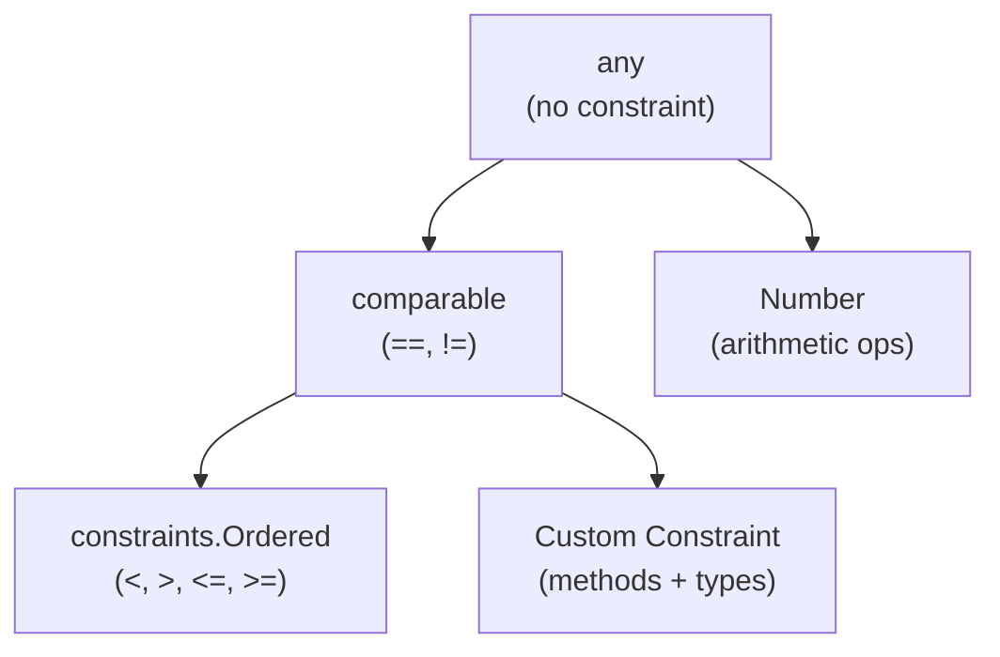

## Learning Objectives

- Understand type parameters and how they enable type-safe generic code
- Define and use constraints to restrict type parameters
- Build generic data structures (stacks, sets, result types)
- Know when to use generics vs interfaces vs code generation
- Apply generics idiomatically without over-engineering

## Prerequisites

- Deep understanding of Go interfaces
- Familiarity with Go's type system (structs, methods, embedding)
- Understanding of the `comparable` built-in constraint

## Core Concepts

### Type Parameters

Generics (introduced in Go 1.18) allow functions and types to be parameterized over types. Type parameters appear in square brackets after the function/type name.

```go
package main

import "fmt"

// Generic function: works with any comparable type
func Contains[T comparable](slice []T, item T) bool {
    for _, v := range slice {
        if v == item {
            return true
        }
    }
    return false
}

// Generic function with multiple type parameters
func Map[In, Out any](slice []In, fn func(In) Out) []Out {
    result := make([]Out, len(slice))
    for i, v := range slice {
        result[i] = fn(v)
    }
    return result
}

func Filter[T any](slice []T, predicate func(T) bool) []T {
    var result []T
    for _, v := range slice {
        if predicate(v) {
            result = append(result, v)
        }
    }
    return result
}

func Reduce[T, R any](slice []T, initial R, fn func(R, T) R) R {
    result := initial
    for _, v := range slice {
        result = fn(result, v)
    }
    return result
}

func main() {
    numbers := []int{1, 2, 3, 4, 5, 6, 7, 8, 9, 10}

    evens := Filter(numbers, func(n int) bool { return n%2 == 0 })
    doubled := Map(evens, func(n int) int { return n * 2 })
    sum := Reduce(doubled, 0, func(acc, n int) int { return acc + n })

    fmt.Println("Evens:", evens)     // [2 4 6 8 10]
    fmt.Println("Doubled:", doubled) // [4 8 12 16 20]
    fmt.Println("Sum:", sum)         // 60

    fmt.Println(Contains(numbers, 5))  // true
    fmt.Println(Contains([]string{"go", "rust"}, "go")) // true
}
```

### Constraints

Constraints specify what operations a type parameter must support. They're defined as interfaces.

```go
package main

import (
    "fmt"
    "golang.org/x/exp/constraints"
)

// Built-in constraints
// comparable — supports == and !=
// any — no constraint (alias for interface{})

// Custom constraint using interface with type terms
type Number interface {
    ~int | ~int8 | ~int16 | ~int32 | ~int64 |
    ~uint | ~uint8 | ~uint16 | ~uint32 | ~uint64 |
    ~float32 | ~float64
}

// The ~ prefix allows underlying types (type aliases)
type Celsius float64
type Fahrenheit float64

// Both Celsius and Fahrenheit satisfy Number due to ~float64

func Sum[T Number](values []T) T {
    var total T
    for _, v := range values {
        total += v
    }
    return total
}

func Max[T constraints.Ordered](values []T) (T, bool) {
    if len(values) == 0 {
        var zero T
        return zero, false
    }
    max := values[0]
    for _, v := range values[1:] {
        if v > max {
            max = v
        }
    }
    return max, true
}

// Constraint with method requirement
type Stringer interface {
    String() string
}

func JoinStrings[T Stringer](items []T, sep string) string {
    if len(items) == 0 {
        return ""
    }
    result := items[0].String()
    for _, item := range items[1:] {
        result += sep + item.String()
    }
    return result
}

// Combining type terms and methods
type NumericStringer interface {
    Number
    String() string
}
```



### Generic Data Structures

```go
package collections

import "sync"

// Generic Set
type Set[T comparable] struct {
    items map[T]struct{}
}

func NewSet[T comparable](initial ...T) *Set[T] {
    s := &Set[T]{items: make(map[T]struct{})}
    for _, item := range initial {
        s.Add(item)
    }
    return s
}

func (s *Set[T]) Add(item T)          { s.items[item] = struct{}{} }
func (s *Set[T]) Remove(item T)       { delete(s.items, item) }
func (s *Set[T]) Contains(item T) bool { _, ok := s.items[item]; return ok }
func (s *Set[T]) Len() int            { return len(s.items) }

func (s *Set[T]) Union(other *Set[T]) *Set[T] {
    result := NewSet[T]()
    for item := range s.items {
        result.Add(item)
    }
    for item := range other.items {
        result.Add(item)
    }
    return result
}

func (s *Set[T]) Intersection(other *Set[T]) *Set[T] {
    result := NewSet[T]()
    for item := range s.items {
        if other.Contains(item) {
            result.Add(item)
        }
    }
    return result
}

// Generic Stack
type Stack[T any] struct {
    items []T
}

func (s *Stack[T]) Push(item T)       { s.items = append(s.items, item) }
func (s *Stack[T]) Pop() (T, bool) {
    if len(s.items) == 0 {
        var zero T
        return zero, false
    }
    item := s.items[len(s.items)-1]
    s.items = s.items[:len(s.items)-1]
    return item, true
}
func (s *Stack[T]) Peek() (T, bool) {
    if len(s.items) == 0 {
        var zero T
        return zero, false
    }
    return s.items[len(s.items)-1], true
}
func (s *Stack[T]) Len() int { return len(s.items) }

// Generic Result type (like Rust's Result<T, E>)
type Result[T any] struct {
    value T
    err   error
    ok    bool
}

func Ok[T any](value T) Result[T] {
    return Result[T]{value: value, ok: true}
}

func Err[T any](err error) Result[T] {
    return Result[T]{err: err, ok: false}
}

func (r Result[T]) Unwrap() (T, error) {
    if !r.ok {
        var zero T
        return zero, r.err
    }
    return r.value, nil
}

func (r Result[T]) OrElse(fallback T) T {
    if !r.ok {
        return fallback
    }
    return r.value
}

// Thread-safe generic map
type SyncMap[K comparable, V any] struct {
    mu    sync.RWMutex
    items map[K]V
}

func NewSyncMap[K comparable, V any]() *SyncMap[K, V] {
    return &SyncMap[K, V]{items: make(map[K]V)}
}

func (m *SyncMap[K, V]) Get(key K) (V, bool) {
    m.mu.RLock()
    defer m.mu.RUnlock()
    v, ok := m.items[key]
    return v, ok
}

func (m *SyncMap[K, V]) Set(key K, value V) {
    m.mu.Lock()
    defer m.mu.Unlock()
    m.items[key] = value
}

func (m *SyncMap[K, V]) Delete(key K) {
    m.mu.Lock()
    defer m.mu.Unlock()
    delete(m.items, key)
}
```

### When to Use Generics vs Interfaces

```go
// USE GENERICS when:
// 1. Type safety matters and you'd otherwise use interface{}/any
// 2. You're building data structures or utility functions
// 3. The function's logic is identical across types

// Good use of generics: type-safe utility
func Keys[K comparable, V any](m map[K]V) []K {
    keys := make([]K, 0, len(m))
    for k := range m {
        keys = append(keys, k)
    }
    return keys
}

// USE INTERFACES when:
// 1. You need runtime polymorphism (different behaviors at runtime)
// 2. You're defining a contract/capability
// 3. The caller provides the implementation

// Good use of interfaces: behavior abstraction
type Storage interface {
    Save(ctx context.Context, key string, data []byte) error
    Load(ctx context.Context, key string) ([]byte, error)
}

// DON'T use generics when:
// 1. An interface would be simpler and clearer
// 2. You only have one or two concrete types
// 3. The generic code is harder to read than duplicated code
```

| Criterion | Use Generics | Use Interfaces |
|-----------|-------------|----------------|
| Same algorithm, different types | Yes | No |
| Different behavior per type | No | Yes |
| Need compile-time type safety | Yes | Partial |
| Building collections/containers | Yes | No |
| Defining API contracts | No | Yes |
| Return type depends on input type | Yes | No |

### Advanced: Generic Constraints with Methods

```go
// Constraint requiring a method
type Validator interface {
    Validate() error
}

func ValidateAll[T Validator](items []T) error {
    for i, item := range items {
        if err := item.Validate(); err != nil {
            return fmt.Errorf("item %d: %w", i, err)
        }
    }
    return nil
}

// Constraint with both type terms and methods
type OrderedStringer interface {
    ~int | ~string | ~float64
    String() string
}

// Self-referencing constraint pattern (for fluent APIs)
type Builder[T any] interface {
    Build() T
}

func BuildAll[B Builder[T], T any](builders []B) []T {
    results := make([]T, len(builders))
    for i, b := range builders {
        results[i] = b.Build()
    }
    return results
}
```

## Best Practices

1. **Start without generics** — only introduce them when you find yourself duplicating identical logic for different types
2. **Keep constraints as narrow as possible** — use `comparable` instead of `any` if you need equality
3. **Prefer named constraints over inline type lists** — improves readability
4. **Don't make everything generic** — generics add cognitive overhead; use them where they provide real value
5. **Generic types should be simple** — complex generic types are hard to understand and maintain

## Common Pitfalls

```go
// PITFALL: can't use operators without constraints
func Add[T any](a, b T) T {
    return a + b // COMPILE ERROR: operator + not defined on any
}

// FIX: constrain to numeric types
func Add[T Number](a, b T) T {
    return a + b // OK
}

// PITFALL: methods can't have type parameters (Go limitation)
type Cache[K comparable, V any] struct{}

// This is INVALID:
// func (c *Cache[K, V]) Transform[R any](fn func(V) R) []R { ... }

// WORKAROUND: use a top-level function
func TransformCache[K comparable, V, R any](c *Cache[K, V], fn func(V) R) []R {
    // ...
}

// PITFALL: zero value with generics
func First[T any](slice []T) T {
    if len(slice) == 0 {
        var zero T // correct way to get zero value
        return zero
    }
    return slice[0]
}
```

## Hands-On Exercises

### Exercise 1: Generic Priority Queue

Implement a generic priority queue that works with any ordered type, supporting Push, Pop, Peek, and Len.

<details>
<summary>Solution</summary>

```go
package main

import (
    "fmt"
    "golang.org/x/exp/constraints"
)

type PriorityQueue[T constraints.Ordered] struct {
    items []T
}

func NewPriorityQueue[T constraints.Ordered]() *PriorityQueue[T] {
    return &PriorityQueue[T]{}
}

func (pq *PriorityQueue[T]) Push(item T) {
    pq.items = append(pq.items, item)
    pq.siftUp(len(pq.items) - 1)
}

func (pq *PriorityQueue[T]) Pop() (T, bool) {
    if len(pq.items) == 0 {
        var zero T
        return zero, false
    }
    min := pq.items[0]
    last := len(pq.items) - 1
    pq.items[0] = pq.items[last]
    pq.items = pq.items[:last]
    if len(pq.items) > 0 {
        pq.siftDown(0)
    }
    return min, true
}

func (pq *PriorityQueue[T]) Peek() (T, bool) {
    if len(pq.items) == 0 {
        var zero T
        return zero, false
    }
    return pq.items[0], true
}

func (pq *PriorityQueue[T]) Len() int { return len(pq.items) }

func (pq *PriorityQueue[T]) siftUp(i int) {
    for i > 0 {
        parent := (i - 1) / 2
        if pq.items[i] < pq.items[parent] {
            pq.items[i], pq.items[parent] = pq.items[parent], pq.items[i]
            i = parent
        } else {
            break
        }
    }
}

func (pq *PriorityQueue[T]) siftDown(i int) {
    n := len(pq.items)
    for {
        smallest := i
        left := 2*i + 1
        right := 2*i + 2

        if left < n && pq.items[left] < pq.items[smallest] {
            smallest = left
        }
        if right < n && pq.items[right] < pq.items[smallest] {
            smallest = right
        }
        if smallest == i {
            break
        }
        pq.items[i], pq.items[smallest] = pq.items[smallest], pq.items[i]
        i = smallest
    }
}

func main() {
    pq := NewPriorityQueue[int]()
    pq.Push(5)
    pq.Push(1)
    pq.Push(3)
    pq.Push(2)
    pq.Push(4)

    for pq.Len() > 0 {
        val, _ := pq.Pop()
        fmt.Println(val) // 1, 2, 3, 4, 5
    }
}
```

</details>

### Exercise 2: Generic Pipeline Builder

Create a generic pipeline builder that chains transformation functions with type-safe stage connections.

<details>
<summary>Solution</summary>

```go
package main

import "fmt"

type Pipeline[In, Out any] struct {
    fn func(In) Out
}

func NewPipeline[In, Out any](fn func(In) Out) Pipeline[In, Out] {
    return Pipeline[In, Out]{fn: fn}
}

func Then[In, Mid, Out any](p Pipeline[In, Mid], next func(Mid) Out) Pipeline[In, Out] {
    return Pipeline[In, Out]{
        fn: func(in In) Out {
            return next(p.fn(in))
        },
    }
}

func (p Pipeline[In, Out]) Execute(input In) Out {
    return p.fn(input)
}

func (p Pipeline[In, Out]) ExecuteAll(inputs []In) []Out {
    results := make([]Out, len(inputs))
    for i, input := range inputs {
        results[i] = p.fn(input)
    }
    return results
}

func main() {
    // string → int → string pipeline
    parseLen := NewPipeline(func(s string) int { return len(s) })
    pipeline := Then(parseLen, func(n int) string {
        return fmt.Sprintf("length=%d", n)
    })

    results := pipeline.ExecuteAll([]string{"hello", "go", "generics"})
    fmt.Println(results) // [length=5 length=2 length=8]
}
```

</details>

## Key Takeaways

- Type parameters enable type-safe generic code without sacrificing compile-time checks
- Constraints restrict what operations are available on type parameters
- The `~` prefix in constraints allows types with matching underlying types
- Use generics for data structures and utility functions; interfaces for behavioral contracts
- Don't over-genericize — only add type parameters when they provide real value
- Methods cannot have their own type parameters (Go limitation); use top-level functions as workaround

## External Resources

- [Go Blog: Intro to Generics](https://go.dev/blog/intro-generics)
- [Go Blog: When to Use Generics](https://go.dev/blog/when-generics)
- [Type Parameters Proposal](https://go.googlesource.com/proposal/+/refs/heads/master/design/43651-type-parameters.md)
- [golang.org/x/exp/constraints](https://pkg.go.dev/golang.org/x/exp/constraints)
- [Go Generics Tutorial](https://go.dev/doc/tutorial/generics)
