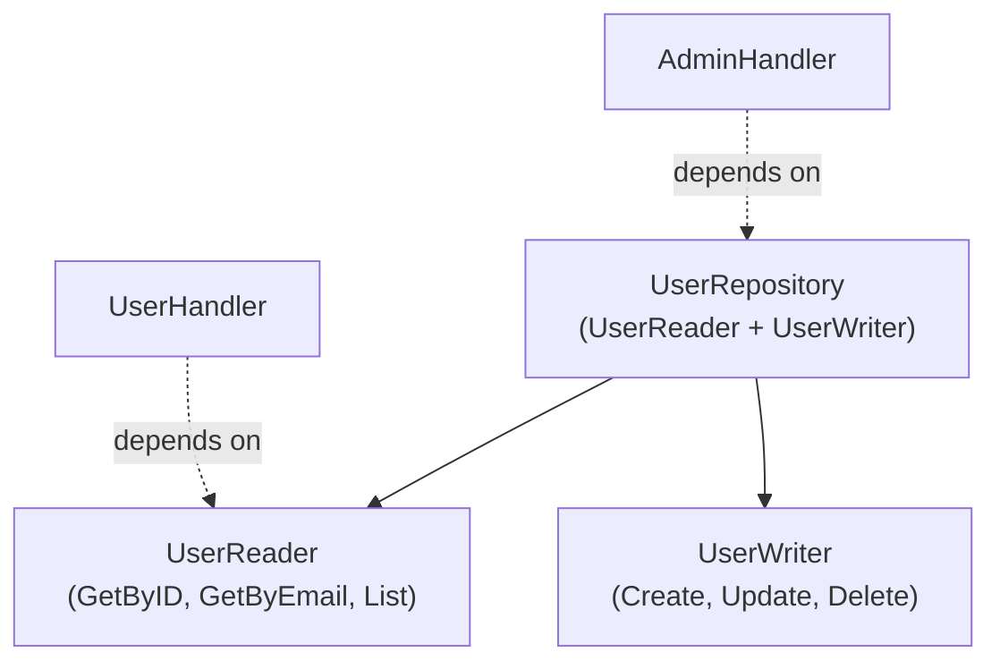
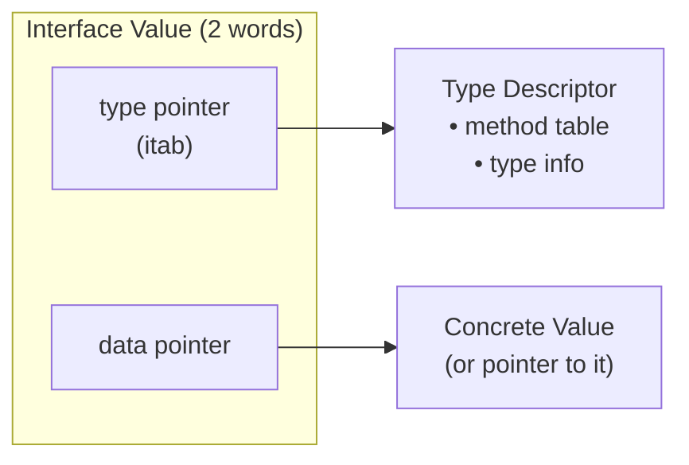

## Learning Objectives

- Understand implicit interface satisfaction and its design implications
- Compose interfaces from smaller, focused contracts
- Use the empty interface correctly and understand its trade-offs
- Perform type assertions safely with the comma-ok idiom
- Implement type switches for polymorphic behavior
- Design interfaces the Go way: small, consumer-defined, behavior-focused

## Prerequisites

- Strong understanding of Go structs and methods
- Familiarity with pointer vs value receivers
- Basic understanding of Go's type system

## Core Concepts

### Implicit Interface Satisfaction

Unlike Java or C#, Go interfaces are satisfied implicitly — a type implements an interface simply by having the right methods. No `implements` keyword needed.

```go
package main

import "fmt"

type Writer interface {
    Write(p []byte) (n int, err error)
}

type ConsoleWriter struct{}

func (cw ConsoleWriter) Write(p []byte) (n int, err error) {
    return fmt.Print(string(p))
}

// ConsoleWriter satisfies Writer without declaring it
func writeGreeting(w Writer) {
    w.Write([]byte("Hello, World!\n"))
}

func main() {
    cw := ConsoleWriter{}
    writeGreeting(cw) // works: ConsoleWriter has Write method
}
```

**Why implicit satisfaction matters:**
- Types from different packages can satisfy your interfaces without modification
- You can define interfaces that standard library types already implement
- Decoupling: the implementer doesn't need to know about your interface

### Interface Composition

Go encourages small, focused interfaces composed into larger ones. This is the foundation of Go's standard library design.

```go
type Reader interface {
    Read(p []byte) (n int, err error)
}

type Writer interface {
    Write(p []byte) (n int, err error)
}

type Closer interface {
    Close() error
}

// Composed interfaces
type ReadWriter interface {
    Reader
    Writer
}

type ReadWriteCloser interface {
    Reader
    Writer
    Closer
}

type ReadCloser interface {
    Reader
    Closer
}
```

**Real-world example: Repository pattern with composed interfaces**

```go
type UserReader interface {
    GetByID(ctx context.Context, id string) (*User, error)
    GetByEmail(ctx context.Context, email string) (*User, error)
    List(ctx context.Context, filter UserFilter) ([]*User, error)
}

type UserWriter interface {
    Create(ctx context.Context, user *User) error
    Update(ctx context.Context, user *User) error
    Delete(ctx context.Context, id string) error
}

type UserRepository interface {
    UserReader
    UserWriter
}

// Handlers only need read access
func NewUserHandler(repo UserReader) *UserHandler {
    return &UserHandler{repo: repo}
}

// Admin handlers need full access
func NewAdminHandler(repo UserRepository) *AdminHandler {
    return &AdminHandler{repo: repo}
}
```



### The Empty Interface and `any`

The empty interface `interface{}` (aliased as `any` since Go 1.18) is satisfied by every type. Use it sparingly — it sacrifices type safety.

```go
// Before Go 1.18
func PrintAnything(v interface{}) {
    fmt.Println(v)
}

// Go 1.18+: any is an alias for interface{}
func PrintAnything(v any) {
    fmt.Println(v)
}
```

**When `any` is acceptable:**
- Generic containers (before Go had generics)
- Reflection-based code (JSON marshaling, ORM)
- Truly polymorphic storage (event systems, plugin architectures)

**When `any` is a code smell:**
- When you immediately type-assert back to a concrete type
- When all callers pass the same type
- When generics would provide compile-time safety

### Type Assertions

Type assertions extract the concrete type from an interface value. Always use the comma-ok form to avoid panics.

```go
func processMessage(msg any) error {
    // Unsafe: panics if msg is not a string
    // s := msg.(string)

    // Safe: comma-ok idiom
    s, ok := msg.(string)
    if !ok {
        return fmt.Errorf("expected string, got %T", msg)
    }
    fmt.Println("Message:", s)
    return nil
}

// Asserting to an interface (check behavior, not type)
func tryClose(v any) error {
    if closer, ok := v.(io.Closer); ok {
        return closer.Close()
    }
    return nil // not closeable, that's fine
}
```

### Type Switches

Type switches provide clean polymorphic dispatch based on the underlying type of an interface value.

```go
type Event interface {
    Timestamp() time.Time
}

type UserCreated struct {
    UserID    string
    Email     string
    CreatedAt time.Time
}
func (e UserCreated) Timestamp() time.Time { return e.CreatedAt }

type OrderPlaced struct {
    OrderID   string
    Amount    float64
    PlacedAt  time.Time
}
func (e OrderPlaced) Timestamp() time.Time { return e.PlacedAt }

type PaymentFailed struct {
    OrderID  string
    Reason   string
    FailedAt time.Time
}
func (e PaymentFailed) Timestamp() time.Time { return e.FailedAt }

func HandleEvent(event Event) {
    switch e := event.(type) {
    case UserCreated:
        log.Printf("New user %s (%s)", e.UserID, e.Email)
        sendWelcomeEmail(e.Email)
    case OrderPlaced:
        log.Printf("Order %s for $%.2f", e.OrderID, e.Amount)
        notifyWarehouse(e.OrderID)
    case PaymentFailed:
        log.Printf("Payment failed for order %s: %s", e.OrderID, e.Reason)
        alertOps(e.OrderID, e.Reason)
    default:
        log.Printf("Unknown event type: %T at %v", e, event.Timestamp())
    }
}
```

### Interface Design Principles

**Accept interfaces, return structs:**

```go
// Good: function accepts an interface (flexible)
func SaveUser(store UserWriter, user *User) error {
    return store.Create(context.Background(), user)
}

// Good: function returns a concrete type (informative)
func NewPostgresStore(dsn string) *PostgresStore {
    // ...
}
```

**Define interfaces at the consumer, not the implementer:**

```go
// BAD: interface defined next to implementation (Java-style)
package storage

type Storer interface { // don't do this
    Save(data []byte) error
}

type DiskStore struct{}
func (d *DiskStore) Save(data []byte) error { /* ... */ }

// GOOD: interface defined where it's used
package handler

type DataSaver interface {
    Save(data []byte) error
}

func NewHandler(saver DataSaver) *Handler {
    return &Handler{saver: saver}
}
```

**Keep interfaces small (1-3 methods):**

```go
// The Go Proverb: "The bigger the interface, the weaker the abstraction"

// Good: single-method interfaces are powerful
type Stringer interface {
    String() string
}

type Handler interface {
    ServeHTTP(ResponseWriter, *Request)
}

type Marshaler interface {
    MarshalJSON() ([]byte, error)
}
```

### Interface Internals

An interface value holds two words: a pointer to a type descriptor and a pointer to the data.



**Nil interface vs nil concrete value:**

```go
var w io.Writer        // nil interface (both pointers nil)
fmt.Println(w == nil)  // true

var buf *bytes.Buffer  // nil pointer
w = buf                // interface holds (*bytes.Buffer, nil)
fmt.Println(w == nil)  // false! interface is NOT nil

// This is a common bug in error handling
func getError() error {
    var err *MyError = nil
    return err // returns non-nil error interface!
}
```

## Best Practices

1. **Keep interfaces to 1-3 methods** — large interfaces are hard to implement and mock
2. **Define interfaces where they're consumed** — not next to the implementation
3. **Accept interfaces, return concrete types** — maximizes flexibility for callers
4. **Use type assertions on interfaces, not concrete types** — assert behavior, not identity
5. **Nil interface != interface holding nil** — be explicit about nil returns with error interfaces

## Common Pitfalls

```go
// PITFALL: returning typed nil as interface
func FindUser(id string) error {
    var err *NotFoundError
    if !exists(id) {
        err = &NotFoundError{ID: id}
    }
    return err // ALWAYS non-nil if err is declared as *NotFoundError!
}

// FIX: return nil explicitly
func FindUser(id string) error {
    if !exists(id) {
        return &NotFoundError{ID: id}
    }
    return nil
}

// PITFALL: pointer receiver doesn't satisfy interface via value
type Sizer interface {
    Size() int
}

type File struct{ size int }
func (f *File) Size() int { return f.size } // pointer receiver

var s Sizer = File{100}   // COMPILE ERROR: File doesn't implement Sizer
var s Sizer = &File{100}  // OK: *File implements Sizer
```

## Hands-On Exercises

### Exercise 1: Plugin System

Design a plugin system using interfaces:
1. Define a `Plugin` interface with `Name()`, `Init(config map[string]string) error`, and `Execute(ctx context.Context) error`
2. Create a `PluginRegistry` that stores and runs plugins
3. Implement two plugins: `LoggerPlugin` and `MetricsPlugin`
4. The registry should run plugins concurrently with a timeout

<details>
<summary>Solution</summary>

```go
package main

import (
    "context"
    "fmt"
    "log"
    "sync"
    "time"
)

type Plugin interface {
    Name() string
    Init(config map[string]string) error
    Execute(ctx context.Context) error
}

type PluginRegistry struct {
    mu      sync.RWMutex
    plugins []Plugin
}

func (r *PluginRegistry) Register(p Plugin) {
    r.mu.Lock()
    defer r.mu.Unlock()
    r.plugins = append(r.plugins, p)
}

func (r *PluginRegistry) RunAll(ctx context.Context, timeout time.Duration) map[string]error {
    r.mu.RLock()
    plugins := make([]Plugin, len(r.plugins))
    copy(plugins, r.plugins)
    r.mu.RUnlock()

    results := make(map[string]error)
    var mu sync.Mutex
    var wg sync.WaitGroup

    for _, p := range plugins {
        wg.Add(1)
        go func(plugin Plugin) {
            defer wg.Done()
            execCtx, cancel := context.WithTimeout(ctx, timeout)
            defer cancel()

            err := plugin.Execute(execCtx)
            mu.Lock()
            results[plugin.Name()] = err
            mu.Unlock()
        }(p)
    }

    wg.Wait()
    return results
}

type LoggerPlugin struct{ level string }

func (p *LoggerPlugin) Name() string { return "logger" }
func (p *LoggerPlugin) Init(config map[string]string) error {
    p.level = config["level"]
    if p.level == "" {
        p.level = "info"
    }
    return nil
}
func (p *LoggerPlugin) Execute(ctx context.Context) error {
    log.Printf("[%s] Logger plugin executed", p.level)
    return nil
}

type MetricsPlugin struct{ endpoint string }

func (p *MetricsPlugin) Name() string { return "metrics" }
func (p *MetricsPlugin) Init(config map[string]string) error {
    p.endpoint = config["endpoint"]
    if p.endpoint == "" {
        return fmt.Errorf("metrics endpoint required")
    }
    return nil
}
func (p *MetricsPlugin) Execute(ctx context.Context) error {
    select {
    case <-time.After(100 * time.Millisecond):
        log.Printf("Metrics pushed to %s", p.endpoint)
        return nil
    case <-ctx.Done():
        return ctx.Err()
    }
}

func main() {
    registry := &PluginRegistry{}

    logger := &LoggerPlugin{}
    logger.Init(map[string]string{"level": "debug"})
    registry.Register(logger)

    metrics := &MetricsPlugin{}
    metrics.Init(map[string]string{"endpoint": "http://localhost:9090"})
    registry.Register(metrics)

    ctx := context.Background()
    results := registry.RunAll(ctx, 5*time.Second)
    for name, err := range results {
        if err != nil {
            fmt.Printf("Plugin %s failed: %v\n", name, err)
        } else {
            fmt.Printf("Plugin %s: OK\n", name)
        }
    }
}
```

</details>

## Key Takeaways

- Go interfaces are implicitly satisfied — decoupling implementation from contract
- Compose small interfaces into larger ones; prefer 1-3 method interfaces
- Define interfaces at the consumer, return concrete types from constructors
- Use comma-ok type assertions to safely extract concrete types
- Type switches enable clean polymorphic dispatch
- Nil interface != interface holding a nil concrete value — a subtle but critical distinction

## External Resources

- [Effective Go: Interfaces](https://go.dev/doc/effective_go#interfaces)
- [Go Blog: Errors are Values](https://go.dev/blog/errors-are-values)
- [Go Proverbs](https://go-proverbs.github.io/)
- [Russ Cox: Go Data Structures: Interfaces](https://research.swtch.com/interfaces)
- [Dave Cheney: SOLID Go Design](https://dave.cheney.net/2016/08/20/solid-go-design)
