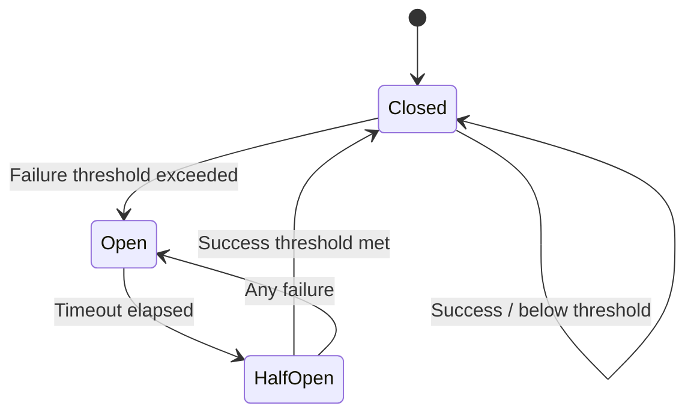

## Learning Objectives

- Implement service discovery for dynamic microservice topologies
- Build circuit breakers to prevent cascade failures
- Apply rate limiting to protect services from overload
- Integrate distributed tracing for observability across services
- Design health checks for orchestration and load balancing

## Prerequisites

- Experience building gRPC and HTTP services
- Understanding of concurrency patterns (context, goroutines, channels)
- Familiarity with microservice architecture concepts

## Core Concepts

### Service Discovery

In dynamic environments (Kubernetes, cloud), service addresses change. Service discovery abstracts away the physical location of services.

```go
package discovery

import (
    "context"
    "fmt"
    "math/rand"
    "sync"
    "time"
)

type ServiceInstance struct {
    ID       string
    Address  string
    Port     int
    Metadata map[string]string
    Health   HealthStatus
    LastSeen time.Time
}

type HealthStatus int

const (
    HealthUnknown HealthStatus = iota
    HealthHealthy
    HealthUnhealthy
    HealthDraining
)

type Registry interface {
    Register(ctx context.Context, instance ServiceInstance) error
    Deregister(ctx context.Context, instanceID string) error
    Discover(ctx context.Context, serviceName string) ([]ServiceInstance, error)
    Watch(ctx context.Context, serviceName string) (<-chan []ServiceInstance, error)
}

// In-memory registry (for development/testing)
type InMemoryRegistry struct {
    mu       sync.RWMutex
    services map[string][]ServiceInstance
    watchers map[string][]chan []ServiceInstance
}

func NewInMemoryRegistry() *InMemoryRegistry {
    return &InMemoryRegistry{
        services: make(map[string][]ServiceInstance),
        watchers: make(map[string][]chan []ServiceInstance),
    }
}

func (r *InMemoryRegistry) Register(ctx context.Context, instance ServiceInstance) error {
    r.mu.Lock()
    defer r.mu.Unlock()

    instance.LastSeen = time.Now()
    instance.Health = HealthHealthy

    serviceName := instance.Metadata["service"]
    r.services[serviceName] = append(r.services[serviceName], instance)
    r.notifyWatchers(serviceName)
    return nil
}

func (r *InMemoryRegistry) Discover(ctx context.Context, serviceName string) ([]ServiceInstance, error) {
    r.mu.RLock()
    defer r.mu.RUnlock()

    instances := r.services[serviceName]
    healthy := make([]ServiceInstance, 0)
    for _, inst := range instances {
        if inst.Health == HealthHealthy {
            healthy = append(healthy, inst)
        }
    }
    return healthy, nil
}

// Client-side load balancing
type LoadBalancer interface {
    Pick(instances []ServiceInstance) *ServiceInstance
}

type RoundRobinLB struct {
    mu      sync.Mutex
    counter uint64
}

func (lb *RoundRobinLB) Pick(instances []ServiceInstance) *ServiceInstance {
    if len(instances) == 0 {
        return nil
    }
    lb.mu.Lock()
    idx := lb.counter % uint64(len(instances))
    lb.counter++
    lb.mu.Unlock()
    return &instances[idx]
}

type RandomLB struct{}

func (lb *RandomLB) Pick(instances []ServiceInstance) *ServiceInstance {
    if len(instances) == 0 {
        return nil
    }
    return &instances[rand.Intn(len(instances))]
}
```

### Circuit Breaker

The circuit breaker pattern prevents cascade failures by stopping requests to a failing service, giving it time to recover.

```go
package circuitbreaker

import (
    "context"
    "errors"
    "sync"
    "time"
)

type State int

const (
    StateClosed   State = iota // Normal operation
    StateOpen                   // Blocking requests
    StateHalfOpen              // Testing if service recovered
)

var (
    ErrCircuitOpen    = errors.New("circuit breaker is open")
    ErrTooManyRequests = errors.New("too many requests in half-open state")
)

type CircuitBreaker struct {
    mu              sync.Mutex
    state           State
    failureCount    int
    successCount    int
    failureThreshold int
    successThreshold int
    timeout         time.Duration
    lastFailure     time.Time
    halfOpenMax     int
    halfOpenCount   int
    onStateChange   func(from, to State)
}

type Config struct {
    FailureThreshold int
    SuccessThreshold int
    Timeout          time.Duration
    HalfOpenMax      int
    OnStateChange    func(from, to State)
}

func New(cfg Config) *CircuitBreaker {
    return &CircuitBreaker{
        state:            StateClosed,
        failureThreshold: cfg.FailureThreshold,
        successThreshold: cfg.SuccessThreshold,
        timeout:          cfg.Timeout,
        halfOpenMax:      cfg.HalfOpenMax,
        onStateChange:    cfg.OnStateChange,
    }
}

func (cb *CircuitBreaker) Execute(ctx context.Context, fn func(ctx context.Context) error) error {
    if err := cb.beforeRequest(); err != nil {
        return err
    }

    err := fn(ctx)
    cb.afterRequest(err)
    return err
}

func (cb *CircuitBreaker) beforeRequest() error {
    cb.mu.Lock()
    defer cb.mu.Unlock()

    switch cb.state {
    case StateClosed:
        return nil
    case StateOpen:
        if time.Since(cb.lastFailure) > cb.timeout {
            cb.setState(StateHalfOpen)
            cb.halfOpenCount = 1
            return nil
        }
        return ErrCircuitOpen
    case StateHalfOpen:
        if cb.halfOpenCount >= cb.halfOpenMax {
            return ErrTooManyRequests
        }
        cb.halfOpenCount++
        return nil
    }
    return nil
}

func (cb *CircuitBreaker) afterRequest(err error) {
    cb.mu.Lock()
    defer cb.mu.Unlock()

    if err != nil {
        cb.onFailure()
    } else {
        cb.onSuccess()
    }
}

func (cb *CircuitBreaker) onFailure() {
    switch cb.state {
    case StateClosed:
        cb.failureCount++
        if cb.failureCount >= cb.failureThreshold {
            cb.setState(StateOpen)
            cb.lastFailure = time.Now()
        }
    case StateHalfOpen:
        cb.setState(StateOpen)
        cb.lastFailure = time.Now()
    }
}

func (cb *CircuitBreaker) onSuccess() {
    switch cb.state {
    case StateClosed:
        cb.failureCount = 0
    case StateHalfOpen:
        cb.successCount++
        if cb.successCount >= cb.successThreshold {
            cb.setState(StateClosed)
        }
    }
}

func (cb *CircuitBreaker) setState(new State) {
    old := cb.state
    cb.state = new
    cb.failureCount = 0
    cb.successCount = 0
    cb.halfOpenCount = 0
    if cb.onStateChange != nil {
        go cb.onStateChange(old, new)
    }
}

func (cb *CircuitBreaker) State() State {
    cb.mu.Lock()
    defer cb.mu.Unlock()
    return cb.state
}
```



### Rate Limiting

```go
package ratelimit

import (
    "context"
    "sync"
    "time"
)

// Token bucket rate limiter
type TokenBucket struct {
    mu         sync.Mutex
    tokens     float64
    maxTokens  float64
    refillRate float64 // tokens per second
    lastRefill time.Time
}

func NewTokenBucket(maxTokens float64, refillRate float64) *TokenBucket {
    return &TokenBucket{
        tokens:     maxTokens,
        maxTokens:  maxTokens,
        refillRate: refillRate,
        lastRefill: time.Now(),
    }
}

func (tb *TokenBucket) Allow() bool {
    return tb.AllowN(1)
}

func (tb *TokenBucket) AllowN(n float64) bool {
    tb.mu.Lock()
    defer tb.mu.Unlock()

    tb.refill()
    if tb.tokens >= n {
        tb.tokens -= n
        return true
    }
    return false
}

func (tb *TokenBucket) refill() {
    now := time.Now()
    elapsed := now.Sub(tb.lastRefill).Seconds()
    tb.tokens += elapsed * tb.refillRate
    if tb.tokens > tb.maxTokens {
        tb.tokens = tb.maxTokens
    }
    tb.lastRefill = now
}

// Per-client rate limiter (e.g., per API key)
type PerClientLimiter struct {
    mu       sync.Mutex
    limiters map[string]*TokenBucket
    rate     float64
    burst    float64
    cleanup  time.Duration
}

func NewPerClientLimiter(rate, burst float64) *PerClientLimiter {
    pcl := &PerClientLimiter{
        limiters: make(map[string]*TokenBucket),
        rate:     rate,
        burst:    burst,
        cleanup:  10 * time.Minute,
    }
    go pcl.cleanupLoop()
    return pcl
}

func (pcl *PerClientLimiter) Allow(clientID string) bool {
    pcl.mu.Lock()
    limiter, ok := pcl.limiters[clientID]
    if !ok {
        limiter = NewTokenBucket(pcl.burst, pcl.rate)
        pcl.limiters[clientID] = limiter
    }
    pcl.mu.Unlock()
    return limiter.Allow()
}

func (pcl *PerClientLimiter) cleanupLoop() {
    ticker := time.NewTicker(pcl.cleanup)
    for range ticker.C {
        pcl.mu.Lock()
        for id, limiter := range pcl.limiters {
            limiter.mu.Lock()
            if time.Since(limiter.lastRefill) > pcl.cleanup {
                delete(pcl.limiters, id)
            }
            limiter.mu.Unlock()
        }
        pcl.mu.Unlock()
    }
}

// Rate limiting middleware for HTTP
func RateLimitMiddleware(limiter *PerClientLimiter) func(http.Handler) http.Handler {
    return func(next http.Handler) http.Handler {
        return http.HandlerFunc(func(w http.ResponseWriter, r *http.Request) {
            clientID := r.Header.Get("X-API-Key")
            if clientID == "" {
                clientID = r.RemoteAddr
            }

            if !limiter.Allow(clientID) {
                w.Header().Set("Retry-After", "1")
                http.Error(w, "rate limit exceeded", http.StatusTooManyRequests)
                return
            }

            next.ServeHTTP(w, r)
        })
    }
}
```

### Distributed Tracing

```go
package tracing

import (
    "context"
    "net/http"

    "go.opentelemetry.io/otel"
    "go.opentelemetry.io/otel/attribute"
    "go.opentelemetry.io/otel/exporters/otlp/otlptrace/otlptracehttp"
    "go.opentelemetry.io/otel/propagation"
    "go.opentelemetry.io/otel/sdk/resource"
    sdktrace "go.opentelemetry.io/otel/sdk/trace"
    semconv "go.opentelemetry.io/otel/semconv/v1.21.0"
    "go.opentelemetry.io/otel/trace"
)

func InitTracer(ctx context.Context, serviceName, version string) (func(), error) {
    exporter, err := otlptracehttp.New(ctx)
    if err != nil {
        return nil, err
    }

    tp := sdktrace.NewTracerProvider(
        sdktrace.WithBatcher(exporter),
        sdktrace.WithResource(resource.NewWithAttributes(
            semconv.SchemaURL,
            semconv.ServiceName(serviceName),
            semconv.ServiceVersion(version),
            attribute.String("environment", "production"),
        )),
        sdktrace.WithSampler(sdktrace.TraceIDRatioBased(0.1)), // sample 10%
    )

    otel.SetTracerProvider(tp)
    otel.SetTextMapPropagator(propagation.NewCompositeTextMapPropagator(
        propagation.TraceContext{},
        propagation.Baggage{},
    ))

    cleanup := func() {
        tp.Shutdown(context.Background())
    }
    return cleanup, nil
}

// Tracing in service methods
func (s *OrderService) CreateOrder(ctx context.Context, req CreateOrderRequest) (*Order, error) {
    ctx, span := otel.Tracer("order-service").Start(ctx, "CreateOrder",
        trace.WithAttributes(
            attribute.String("customer_id", req.CustomerID),
            attribute.Int("item_count", len(req.Items)),
        ),
    )
    defer span.End()

    // Check inventory (propagates trace context)
    span.AddEvent("checking inventory")
    available, err := s.inventory.Check(ctx, req.Items)
    if err != nil {
        span.RecordError(err)
        return nil, err
    }

    // Process payment
    span.AddEvent("processing payment")
    chargeID, err := s.payments.Charge(ctx, req.Amount)
    if err != nil {
        span.RecordError(err)
        return nil, err
    }

    span.SetAttributes(attribute.String("charge_id", chargeID))
    return &Order{ID: generateID()}, nil
}

// HTTP middleware for trace propagation
func TracingMiddleware(serviceName string) func(http.Handler) http.Handler {
    return func(next http.Handler) http.Handler {
        return http.HandlerFunc(func(w http.ResponseWriter, r *http.Request) {
            ctx := otel.GetTextMapPropagator().Extract(r.Context(), propagation.HeaderCarrier(r.Header))

            tracer := otel.Tracer(serviceName)
            ctx, span := tracer.Start(ctx, r.Method+" "+r.URL.Path,
                trace.WithSpanKind(trace.SpanKindServer),
            )
            defer span.End()

            span.SetAttributes(
                semconv.HTTPMethod(r.Method),
                semconv.HTTPURL(r.URL.String()),
            )

            next.ServeHTTP(w, r.WithContext(ctx))
        })
    }
}
```

### Health Checks

```go
package health

import (
    "context"
    "encoding/json"
    "net/http"
    "sync"
    "time"
)

type Status string

const (
    StatusUp      Status = "UP"
    StatusDown    Status = "DOWN"
    StatusDegraded Status = "DEGRADED"
)

type Check struct {
    Name    string        `json:"name"`
    Status  Status        `json:"status"`
    Details any           `json:"details,omitempty"`
    Latency time.Duration `json:"latency_ms"`
}

type HealthResponse struct {
    Status  Status  `json:"status"`
    Checks  []Check `json:"checks"`
    Version string  `json:"version"`
}

type Checker func(ctx context.Context) Check

type HealthService struct {
    mu       sync.RWMutex
    checkers []Checker
    version  string
}

func NewHealthService(version string) *HealthService {
    return &HealthService{version: version}
}

func (hs *HealthService) AddCheck(checker Checker) {
    hs.mu.Lock()
    defer hs.mu.Unlock()
    hs.checkers = append(hs.checkers, checker)
}

func (hs *HealthService) Check(ctx context.Context) HealthResponse {
    hs.mu.RLock()
    checkers := make([]Checker, len(hs.checkers))
    copy(checkers, hs.checkers)
    hs.mu.RUnlock()

    checks := make([]Check, len(checkers))
    var wg sync.WaitGroup

    for i, checker := range checkers {
        wg.Add(1)
        go func(idx int, c Checker) {
            defer wg.Done()
            checks[idx] = c(ctx)
        }(i, checker)
    }

    wg.Wait()

    overall := StatusUp
    for _, check := range checks {
        if check.Status == StatusDown {
            overall = StatusDown
            break
        }
        if check.Status == StatusDegraded {
            overall = StatusDegraded
        }
    }

    return HealthResponse{Status: overall, Checks: checks, Version: hs.version}
}

// Common health check implementations
func DatabaseCheck(db *sql.DB) Checker {
    return func(ctx context.Context) Check {
        start := time.Now()
        err := db.PingContext(ctx)
        latency := time.Since(start)

        if err != nil {
            return Check{Name: "database", Status: StatusDown, Latency: latency, Details: err.Error()}
        }
        return Check{Name: "database", Status: StatusUp, Latency: latency}
    }
}

func RedisCheck(client *redis.Client) Checker {
    return func(ctx context.Context) Check {
        start := time.Now()
        err := client.Ping(ctx).Err()
        latency := time.Since(start)

        if err != nil {
            return Check{Name: "redis", Status: StatusDown, Latency: latency, Details: err.Error()}
        }
        return Check{Name: "redis", Status: StatusUp, Latency: latency}
    }
}

// HTTP handlers
func (hs *HealthService) LivenessHandler() http.HandlerFunc {
    return func(w http.ResponseWriter, r *http.Request) {
        w.WriteHeader(http.StatusOK)
        json.NewEncoder(w).Encode(map[string]string{"status": "alive"})
    }
}

func (hs *HealthService) ReadinessHandler() http.HandlerFunc {
    return func(w http.ResponseWriter, r *http.Request) {
        resp := hs.Check(r.Context())
        status := http.StatusOK
        if resp.Status == StatusDown {
            status = http.StatusServiceUnavailable
        }
        w.Header().Set("Content-Type", "application/json")
        w.WriteHeader(status)
        json.NewEncoder(w).Encode(resp)
    }
}
```

## Best Practices

1. **Circuit breakers at every inter-service call** — prevent cascade failures
2. **Health checks should be fast** — Kubernetes probes have strict timeouts
3. **Propagate trace context across all boundaries** — HTTP headers, gRPC metadata, message queues
4. **Rate limit at the edge AND per-service** — defense in depth
5. **Use exponential backoff with jitter for retries** — prevents thundering herd

## Common Pitfalls

```go
// PITFALL: Circuit breaker too sensitive
cb := New(Config{FailureThreshold: 1}) // opens after 1 failure!
// FIX: Set realistic thresholds (e.g., 5 failures in 10 seconds)

// PITFALL: Health check that tests everything
// Database slow → readiness fails → pod killed → more DB pressure
// FIX: Separate liveness (am I running?) from readiness (can I serve?)

// PITFALL: Not propagating context to downstream calls
func handler(ctx context.Context) {
    go doBackgroundWork() // loses trace context!
}
// FIX: Always pass ctx to downstream calls
```

## Key Takeaways

- Service discovery enables dynamic microservice topologies without hardcoded addresses
- Circuit breakers prevent cascade failures by failing fast when dependencies are down
- Rate limiting protects services from overload — implement at multiple layers
- Distributed tracing provides end-to-end visibility across service boundaries
- Health checks enable orchestrators to route traffic away from unhealthy instances
- All patterns require proper context propagation for cancellation and tracing

## External Resources

- [OpenTelemetry Go SDK](https://opentelemetry.io/docs/languages/go/)
- [Microsoft: Circuit Breaker Pattern](https://learn.microsoft.com/en-us/azure/architecture/patterns/circuit-breaker)
- [Google SRE: Handling Overload](https://sre.google/sre-book/handling-overload/)
- [Kubernetes Health Checks](https://kubernetes.io/docs/tasks/configure-pod-container/configure-liveness-readiness-startup-probes/)
- [sony/gobreaker](https://github.com/sony/gobreaker)
