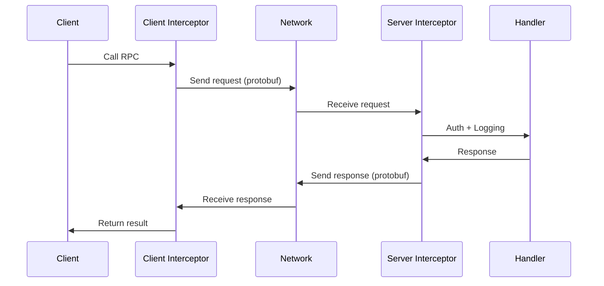

## Learning Objectives

- Define service contracts with Protocol Buffers (proto3)
- Implement unary and streaming gRPC services in Go
- Build server and client interceptors for cross-cutting concerns
- Handle errors with proper gRPC status codes
- Implement bidirectional streaming for real-time communication
- Configure gRPC for production (TLS, health checks, reflection)

## Prerequisites

- Experience building HTTP APIs in Go
- Understanding of interface-based design and middleware patterns
- Familiarity with client-server architecture

## Core Concepts

### Protocol Buffers (Proto3)

Protocol Buffers define your API schema in `.proto` files — a language-neutral, binary-efficient serialization format.

```protobuf
// proto/order/v1/order.proto
syntax = "proto3";

package order.v1;

option go_package = "myapp/gen/order/v1;orderv1";

import "google/protobuf/timestamp.proto";
import "google/protobuf/empty.proto";

service OrderService {
    // Unary RPCs
    rpc CreateOrder(CreateOrderRequest) returns (CreateOrderResponse);
    rpc GetOrder(GetOrderRequest) returns (Order);
    rpc ListOrders(ListOrdersRequest) returns (ListOrdersResponse);
    rpc CancelOrder(CancelOrderRequest) returns (google.protobuf.Empty);

    // Server streaming: real-time order status updates
    rpc WatchOrder(WatchOrderRequest) returns (stream OrderEvent);

    // Client streaming: batch import
    rpc BatchCreateOrders(stream CreateOrderRequest) returns (BatchCreateResponse);

    // Bidirectional streaming: real-time chat/notifications
    rpc OrderChat(stream ChatMessage) returns (stream ChatMessage);
}

message Order {
    string id = 1;
    string customer_id = 2;
    repeated OrderItem items = 3;
    OrderStatus status = 4;
    Money total_amount = 5;
    google.protobuf.Timestamp created_at = 6;
    google.protobuf.Timestamp updated_at = 7;
}

message OrderItem {
    string product_id = 1;
    string product_name = 2;
    int32 quantity = 3;
    Money unit_price = 4;
}

message Money {
    string currency_code = 1; // ISO 4217
    int64 units = 2;          // whole units
    int32 nanos = 3;          // nano units (10^-9)
}

enum OrderStatus {
    ORDER_STATUS_UNSPECIFIED = 0;
    ORDER_STATUS_PENDING = 1;
    ORDER_STATUS_CONFIRMED = 2;
    ORDER_STATUS_SHIPPED = 3;
    ORDER_STATUS_DELIVERED = 4;
    ORDER_STATUS_CANCELLED = 5;
}

message CreateOrderRequest {
    string customer_id = 1;
    repeated OrderItem items = 2;
    string idempotency_key = 3;
}

message CreateOrderResponse {
    Order order = 1;
}

message GetOrderRequest {
    string id = 1;
}

message ListOrdersRequest {
    string customer_id = 1;
    int32 page_size = 2;
    string page_token = 3;
    OrderStatus status_filter = 4;
}

message ListOrdersResponse {
    repeated Order orders = 1;
    string next_page_token = 2;
    int32 total_count = 3;
}
```

```bash
# Generate Go code from proto
protoc --go_out=. --go_opt=paths=source_relative \
       --go-grpc_out=. --go-grpc_opt=paths=source_relative \
       proto/order/v1/order.proto
```

### Implementing a gRPC Server

```go
package main

import (
    "context"
    "fmt"
    "log/slog"
    "net"
    "sync"
    "time"

    "google.golang.org/grpc"
    "google.golang.org/grpc/codes"
    "google.golang.org/grpc/status"
    "google.golang.org/protobuf/types/known/timestamppb"

    orderv1 "myapp/gen/order/v1"
)

type OrderServer struct {
    orderv1.UnimplementedOrderServiceServer
    mu     sync.RWMutex
    orders map[string]*orderv1.Order
    logger *slog.Logger
}

func NewOrderServer(logger *slog.Logger) *OrderServer {
    return &OrderServer{
        orders: make(map[string]*orderv1.Order),
        logger: logger,
    }
}

func (s *OrderServer) CreateOrder(ctx context.Context, req *orderv1.CreateOrderRequest) (*orderv1.CreateOrderResponse, error) {
    if req.CustomerId == "" {
        return nil, status.Error(codes.InvalidArgument, "customer_id is required")
    }
    if len(req.Items) == 0 {
        return nil, status.Error(codes.InvalidArgument, "at least one item is required")
    }

    order := &orderv1.Order{
        Id:         generateID(),
        CustomerId: req.CustomerId,
        Items:      req.Items,
        Status:     orderv1.OrderStatus_ORDER_STATUS_PENDING,
        CreatedAt:  timestamppb.Now(),
        UpdatedAt:  timestamppb.Now(),
    }

    s.mu.Lock()
    s.orders[order.Id] = order
    s.mu.Unlock()

    s.logger.Info("order created", "order_id", order.Id, "customer_id", req.CustomerId)

    return &orderv1.CreateOrderResponse{Order: order}, nil
}

func (s *OrderServer) GetOrder(ctx context.Context, req *orderv1.GetOrderRequest) (*orderv1.Order, error) {
    if req.Id == "" {
        return nil, status.Error(codes.InvalidArgument, "id is required")
    }

    s.mu.RLock()
    order, ok := s.orders[req.Id]
    s.mu.RUnlock()

    if !ok {
        return nil, status.Errorf(codes.NotFound, "order %s not found", req.Id)
    }

    return order, nil
}

// Server streaming: push order status changes
func (s *OrderServer) WatchOrder(req *orderv1.WatchOrderRequest, stream orderv1.OrderService_WatchOrderServer) error {
    ctx := stream.Context()
    ticker := time.NewTicker(2 * time.Second)
    defer ticker.Stop()

    for {
        select {
        case <-ctx.Done():
            return status.Error(codes.Canceled, "client disconnected")
        case <-ticker.C:
            s.mu.RLock()
            order, ok := s.orders[req.GetOrderId()]
            s.mu.RUnlock()

            if !ok {
                return status.Errorf(codes.NotFound, "order %s not found", req.GetOrderId())
            }

            event := &orderv1.OrderEvent{
                OrderId:   order.Id,
                Status:    order.Status,
                Timestamp: timestamppb.Now(),
            }

            if err := stream.Send(event); err != nil {
                return err
            }
        }
    }
}

func main() {
    logger := slog.Default()

    lis, err := net.Listen("tcp", ":50051")
    if err != nil {
        logger.Error("failed to listen", "error", err)
        return
    }

    srv := grpc.NewServer(
        grpc.ChainUnaryInterceptor(
            loggingInterceptor(logger),
            recoveryInterceptor(logger),
        ),
    )
    orderv1.RegisterOrderServiceServer(srv, NewOrderServer(logger))

    logger.Info("gRPC server starting", "addr", ":50051")
    if err := srv.Serve(lis); err != nil {
        logger.Error("server failed", "error", err)
    }
}
```

### Interceptors (Middleware)

Interceptors are gRPC's equivalent of HTTP middleware — they wrap RPC calls for logging, auth, metrics, and recovery.

```go
func loggingInterceptor(logger *slog.Logger) grpc.UnaryServerInterceptor {
    return func(
        ctx context.Context,
        req any,
        info *grpc.UnaryServerInfo,
        handler grpc.UnaryHandler,
    ) (any, error) {
        start := time.Now()
        resp, err := handler(ctx, req)
        duration := time.Since(start)

        code := codes.OK
        if err != nil {
            code = status.Code(err)
        }

        logger.Info("gRPC call",
            "method", info.FullMethod,
            "code", code.String(),
            "duration_ms", duration.Milliseconds(),
        )

        return resp, err
    }
}

func recoveryInterceptor(logger *slog.Logger) grpc.UnaryServerInterceptor {
    return func(
        ctx context.Context,
        req any,
        info *grpc.UnaryServerInfo,
        handler grpc.UnaryHandler,
    ) (resp any, err error) {
        defer func() {
            if r := recover(); r != nil {
                logger.Error("panic in gRPC handler",
                    "method", info.FullMethod,
                    "panic", r,
                )
                err = status.Errorf(codes.Internal, "internal error")
            }
        }()
        return handler(ctx, req)
    }
}

func authInterceptor(tokenValidator TokenValidator) grpc.UnaryServerInterceptor {
    return func(
        ctx context.Context,
        req any,
        info *grpc.UnaryServerInfo,
        handler grpc.UnaryHandler,
    ) (any, error) {
        // Skip auth for health check
        if info.FullMethod == "/grpc.health.v1.Health/Check" {
            return handler(ctx, req)
        }

        md, ok := metadata.FromIncomingContext(ctx)
        if !ok {
            return nil, status.Error(codes.Unauthenticated, "missing metadata")
        }

        tokens := md.Get("authorization")
        if len(tokens) == 0 {
            return nil, status.Error(codes.Unauthenticated, "missing authorization token")
        }

        claims, err := tokenValidator.Validate(tokens[0])
        if err != nil {
            return nil, status.Error(codes.Unauthenticated, "invalid token")
        }

        ctx = context.WithValue(ctx, userClaimsKey, claims)
        return handler(ctx, req)
    }
}
```

### gRPC Error Codes

```go
// Map domain errors to gRPC status codes
func domainToGRPC(err error) error {
    if err == nil {
        return nil
    }

    switch {
    case errors.Is(err, domain.ErrNotFound):
        return status.Error(codes.NotFound, err.Error())
    case errors.Is(err, domain.ErrAlreadyExists):
        return status.Error(codes.AlreadyExists, err.Error())
    case errors.Is(err, domain.ErrInvalidInput):
        return status.Error(codes.InvalidArgument, err.Error())
    case errors.Is(err, domain.ErrUnauthorized):
        return status.Error(codes.Unauthenticated, err.Error())
    case errors.Is(err, domain.ErrForbidden):
        return status.Error(codes.PermissionDenied, err.Error())
    case errors.Is(err, context.DeadlineExceeded):
        return status.Error(codes.DeadlineExceeded, "operation timed out")
    case errors.Is(err, context.Canceled):
        return status.Error(codes.Canceled, "operation canceled")
    default:
        return status.Error(codes.Internal, "internal error")
    }
}

// Rich error details
import "google.golang.org/genproto/googleapis/rpc/errdetails"

func validationError(field, description string) error {
    st := status.New(codes.InvalidArgument, "validation failed")
    detailed, _ := st.WithDetails(&errdetails.BadRequest{
        FieldViolations: []*errdetails.BadRequest_FieldViolation{
            {Field: field, Description: description},
        },
    })
    return detailed.Err()
}
```

### Client Implementation

```go
func NewOrderClient(addr string) (orderv1.OrderServiceClient, func(), error) {
    conn, err := grpc.Dial(addr,
        grpc.WithTransportCredentials(insecure.NewCredentials()),
        grpc.WithChainUnaryInterceptor(
            clientLoggingInterceptor(),
            clientRetryInterceptor(3),
        ),
        grpc.WithDefaultCallOptions(
            grpc.MaxCallRecvMsgSize(10*1024*1024), // 10MB
        ),
    )
    if err != nil {
        return nil, nil, fmt.Errorf("connecting to order service: %w", err)
    }

    client := orderv1.NewOrderServiceClient(conn)
    cleanup := func() { conn.Close() }

    return client, cleanup, nil
}

// Client-side retry interceptor
func clientRetryInterceptor(maxRetries int) grpc.UnaryClientInterceptor {
    return func(
        ctx context.Context,
        method string,
        req, reply any,
        cc *grpc.ClientConn,
        invoker grpc.UnaryInvoker,
        opts ...grpc.CallOption,
    ) error {
        var lastErr error
        for attempt := 0; attempt <= maxRetries; attempt++ {
            lastErr = invoker(ctx, method, req, reply, cc, opts...)
            if lastErr == nil {
                return nil
            }

            code := status.Code(lastErr)
            if !isRetryable(code) {
                return lastErr
            }

            backoff := time.Duration(attempt*attempt) * 100 * time.Millisecond
            select {
            case <-time.After(backoff):
            case <-ctx.Done():
                return ctx.Err()
            }
        }
        return lastErr
    }
}

func isRetryable(code codes.Code) bool {
    switch code {
    case codes.Unavailable, codes.DeadlineExceeded, codes.ResourceExhausted:
        return true
    default:
        return false
    }
}
```



## Best Practices

1. **Use proto3 field numbers wisely** — never reuse deleted field numbers; reserve them
2. **Implement health checks** — use `grpc.health.v1.Health` for load balancer integration
3. **Set deadlines on every RPC** — prevent requests from hanging forever
4. **Use interceptors for cross-cutting concerns** — auth, logging, metrics, tracing
5. **Enable server reflection for debugging** — allows tools like `grpcurl` to introspect
6. **Version your APIs** — use package names like `order.v1`, `order.v2`

## Common Pitfalls

```go
// PITFALL: Not setting deadlines
resp, err := client.GetOrder(context.Background(), req)
// FIX: Always use context with timeout
ctx, cancel := context.WithTimeout(ctx, 5*time.Second)
defer cancel()
resp, err := client.GetOrder(ctx, req)

// PITFALL: Returning raw errors instead of status errors
return nil, err // client gets codes.Unknown
// FIX: Always return status.Error
return nil, status.Errorf(codes.Internal, "database error: %v", err)

// PITFALL: Large messages without streaming
// Sending 100MB response in unary call
// FIX: Use server streaming for large result sets
```

## Hands-On Exercises

### Exercise 1: Bidirectional Chat Service

Implement a bidirectional streaming gRPC service for real-time chat between users. The server should broadcast messages from one client to all connected clients in the same room.

<details>
<summary>Solution</summary>

```go
type ChatServer struct {
    chatv1.UnimplementedChatServiceServer
    mu    sync.RWMutex
    rooms map[string]map[string]chan *chatv1.ChatMessage
}

func (s *ChatServer) JoinRoom(stream chatv1.ChatService_JoinRoomServer) error {
    // First message contains room info
    msg, err := stream.Recv()
    if err != nil {
        return err
    }

    roomID := msg.RoomId
    userID := msg.UserId
    ch := make(chan *chatv1.ChatMessage, 100)

    // Register client
    s.mu.Lock()
    if s.rooms[roomID] == nil {
        s.rooms[roomID] = make(map[string]chan *chatv1.ChatMessage)
    }
    s.rooms[roomID][userID] = ch
    s.mu.Unlock()

    defer func() {
        s.mu.Lock()
        delete(s.rooms[roomID], userID)
        s.mu.Unlock()
        close(ch)
    }()

    // Send messages to this client
    go func() {
        for msg := range ch {
            if err := stream.Send(msg); err != nil {
                return
            }
        }
    }()

    // Receive and broadcast
    for {
        msg, err := stream.Recv()
        if err != nil {
            return err
        }
        s.broadcast(roomID, userID, msg)
    }
}

func (s *ChatServer) broadcast(roomID, senderID string, msg *chatv1.ChatMessage) {
    s.mu.RLock()
    defer s.mu.RUnlock()
    for uid, ch := range s.rooms[roomID] {
        if uid == senderID {
            continue
        }
        select {
        case ch <- msg:
        default: // drop if buffer full
        }
    }
}
```

</details>

## Key Takeaways

- Protocol Buffers provide efficient, backward-compatible serialization with schema evolution
- gRPC supports unary, server streaming, client streaming, and bidirectional streaming
- Interceptors are the middleware pattern for gRPC — use them for auth, logging, and metrics
- Map domain errors to proper gRPC status codes at the handler boundary
- Always set context deadlines on RPC calls to prevent hanging
- Use streaming for large data sets and real-time communication

## External Resources

- [gRPC Go Documentation](https://grpc.io/docs/languages/go/)
- [Protocol Buffers Language Guide](https://protobuf.dev/programming-guides/proto3/)
- [gRPC Error Handling](https://grpc.io/docs/guides/error/)
- [Go gRPC Middleware](https://github.com/grpc-ecosystem/go-grpc-middleware)
- [buf.build: Modern Protobuf Management](https://buf.build/docs/)
