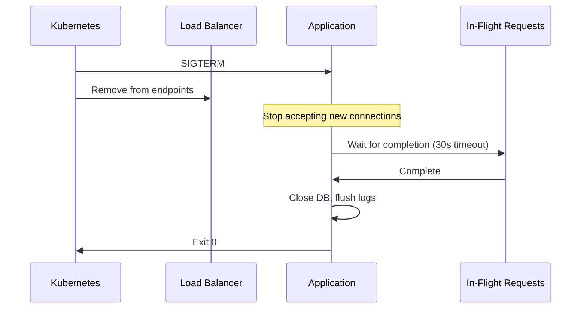

## Learning Objectives

- Implement graceful shutdown for zero-downtime deployments
- Design configuration management for multiple environments
- Use structured logging with `log/slog` for production observability
- Build comprehensive observability with metrics, logs, and traces
- Apply production hardening patterns for reliability

## Prerequisites

- Experience building gRPC and HTTP services
- Understanding of distributed systems patterns (circuit breakers, health checks)
- Familiarity with deployment environments (containers, Kubernetes)

## Core Concepts

### Graceful Shutdown

Graceful shutdown ensures in-flight requests complete before the process exits, enabling zero-downtime deployments.

```go
package main

import (
    "context"
    "errors"
    "log/slog"
    "net"
    "net/http"
    "os"
    "os/signal"
    "sync"
    "syscall"
    "time"

    "google.golang.org/grpc"
)

type App struct {
    httpServer *http.Server
    grpcServer *grpc.Server
    grpcLis    net.Listener
    logger     *slog.Logger
    cleanup    []func(context.Context) error
}

func (app *App) Run() error {
    // Start servers
    errCh := make(chan error, 2)

    go func() {
        app.logger.Info("HTTP server starting", "addr", app.httpServer.Addr)
        if err := app.httpServer.ListenAndServe(); err != nil && !errors.Is(err, http.ErrServerClosed) {
            errCh <- err
        }
    }()

    go func() {
        app.logger.Info("gRPC server starting", "addr", app.grpcLis.Addr())
        if err := app.grpcServer.Serve(app.grpcLis); err != nil {
            errCh <- err
        }
    }()

    // Wait for shutdown signal
    quit := make(chan os.Signal, 1)
    signal.Notify(quit, syscall.SIGINT, syscall.SIGTERM)

    select {
    case sig := <-quit:
        app.logger.Info("shutdown signal received", "signal", sig)
    case err := <-errCh:
        app.logger.Error("server error", "error", err)
    }

    return app.shutdown()
}

func (app *App) shutdown() error {
    app.logger.Info("initiating graceful shutdown")

    // Give load balancer time to drain connections
    // (Kubernetes sends SIGTERM, then removes from endpoints)
    time.Sleep(5 * time.Second)

    ctx, cancel := context.WithTimeout(context.Background(), 30*time.Second)
    defer cancel()

    var wg sync.WaitGroup

    // Shutdown HTTP server (stops accepting, waits for active requests)
    wg.Add(1)
    go func() {
        defer wg.Done()
        if err := app.httpServer.Shutdown(ctx); err != nil {
            app.logger.Error("HTTP shutdown error", "error", err)
        }
        app.logger.Info("HTTP server stopped")
    }()

    // Shutdown gRPC server (gracefully finishes streaming RPCs)
    wg.Add(1)
    go func() {
        defer wg.Done()
        app.grpcServer.GracefulStop()
        app.logger.Info("gRPC server stopped")
    }()

    wg.Wait()

    // Run cleanup functions (close DB, flush logs, etc.)
    for _, fn := range app.cleanup {
        if err := fn(ctx); err != nil {
            app.logger.Error("cleanup error", "error", err)
        }
    }

    app.logger.Info("shutdown complete")
    return nil
}
```



### Configuration Management

Production services need configuration from multiple sources with proper validation and hot-reload capability.

```go
package config

import (
    "fmt"
    "os"
    "strconv"
    "strings"
    "time"
)

type Config struct {
    Server   ServerConfig
    Database DatabaseConfig
    Redis    RedisConfig
    Auth     AuthConfig
    Features FeatureFlags
}

type ServerConfig struct {
    HTTPPort     int           `env:"HTTP_PORT" default:"8080"`
    GRPCPort     int           `env:"GRPC_PORT" default:"50051"`
    ReadTimeout  time.Duration `env:"READ_TIMEOUT" default:"15s"`
    WriteTimeout time.Duration `env:"WRITE_TIMEOUT" default:"15s"`
    IdleTimeout  time.Duration `env:"IDLE_TIMEOUT" default:"60s"`
    Environment  string        `env:"ENVIRONMENT" default:"development"`
}

type DatabaseConfig struct {
    Host            string        `env:"DB_HOST" required:"true"`
    Port            int           `env:"DB_PORT" default:"5432"`
    User            string        `env:"DB_USER" required:"true"`
    Password        string        `env:"DB_PASSWORD" required:"true" sensitive:"true"`
    Name            string        `env:"DB_NAME" required:"true"`
    SSLMode         string        `env:"DB_SSL_MODE" default:"require"`
    MaxOpenConns    int           `env:"DB_MAX_OPEN_CONNS" default:"25"`
    MaxIdleConns    int           `env:"DB_MAX_IDLE_CONNS" default:"10"`
    ConnMaxLifetime time.Duration `env:"DB_CONN_MAX_LIFETIME" default:"5m"`
}

func (d DatabaseConfig) DSN() string {
    return fmt.Sprintf(
        "host=%s port=%d user=%s password=%s dbname=%s sslmode=%s",
        d.Host, d.Port, d.User, d.Password, d.Name, d.SSLMode,
    )
}

type RedisConfig struct {
    Addr     string `env:"REDIS_ADDR" default:"localhost:6379"`
    Password string `env:"REDIS_PASSWORD" sensitive:"true"`
    DB       int    `env:"REDIS_DB" default:"0"`
}

type AuthConfig struct {
    JWTSecret      string        `env:"JWT_SECRET" required:"true" sensitive:"true"`
    TokenExpiry    time.Duration `env:"TOKEN_EXPIRY" default:"24h"`
    RefreshExpiry  time.Duration `env:"REFRESH_EXPIRY" default:"168h"`
}

type FeatureFlags struct {
    EnableNewUI     bool `env:"FF_NEW_UI" default:"false"`
    EnableBetaAPI   bool `env:"FF_BETA_API" default:"false"`
    MaxUploadSizeMB int  `env:"FF_MAX_UPLOAD_MB" default:"10"`
}

func Load() (*Config, error) {
    cfg := &Config{}

    if err := loadStruct(&cfg.Server); err != nil {
        return nil, fmt.Errorf("server config: %w", err)
    }
    if err := loadStruct(&cfg.Database); err != nil {
        return nil, fmt.Errorf("database config: %w", err)
    }
    if err := loadStruct(&cfg.Redis); err != nil {
        return nil, fmt.Errorf("redis config: %w", err)
    }
    if err := loadStruct(&cfg.Auth); err != nil {
        return nil, fmt.Errorf("auth config: %w", err)
    }
    if err := loadStruct(&cfg.Features); err != nil {
        return nil, fmt.Errorf("feature flags: %w", err)
    }

    return cfg, nil
}

// Validate checks business rules beyond basic field presence
func (c *Config) Validate() error {
    if c.Server.Environment == "production" {
        if c.Database.SSLMode == "disable" {
            return fmt.Errorf("SSL must be enabled in production")
        }
        if c.Server.HTTPPort == 8080 {
            return fmt.Errorf("use standard ports in production")
        }
    }
    if c.Database.MaxOpenConns < c.Database.MaxIdleConns {
        return fmt.Errorf("max_open_conns must be >= max_idle_conns")
    }
    return nil
}

// Print non-sensitive config for startup logging
func (c *Config) LogSafe(logger *slog.Logger) {
    logger.Info("configuration loaded",
        "environment", c.Server.Environment,
        "http_port", c.Server.HTTPPort,
        "grpc_port", c.Server.GRPCPort,
        "db_host", c.Database.Host,
        "db_name", c.Database.Name,
        "max_conns", c.Database.MaxOpenConns,
    )
}
```

### Structured Logging with slog

Go 1.21 introduced `log/slog` as the standard structured logging package, replacing the older `log` package for production use.

```go
package main

import (
    "context"
    "log/slog"
    "os"
    "time"
)

func SetupLogger(environment string) *slog.Logger {
    var handler slog.Handler

    switch environment {
    case "production":
        handler = slog.NewJSONHandler(os.Stdout, &slog.HandlerOptions{
            Level:     slog.LevelInfo,
            AddSource: true,
        })
    default:
        handler = slog.NewTextHandler(os.Stdout, &slog.HandlerOptions{
            Level: slog.LevelDebug,
        })
    }

    logger := slog.New(handler)
    slog.SetDefault(logger)
    return logger
}

// Context-aware logging with request-scoped fields
type contextKey string

const requestIDKey contextKey = "request_id"

func LoggerWithContext(ctx context.Context, logger *slog.Logger) *slog.Logger {
    if reqID, ok := ctx.Value(requestIDKey).(string); ok {
        return logger.With("request_id", reqID)
    }
    return logger
}

// Structured logging in handlers
func (h *OrderHandler) CreateOrder(ctx context.Context, req *CreateOrderRequest) (*Order, error) {
    logger := LoggerWithContext(ctx, h.logger)

    logger.Info("creating order",
        "customer_id", req.CustomerID,
        "item_count", len(req.Items),
        "total_amount", req.TotalAmount,
    )

    start := time.Now()
    order, err := h.service.Create(ctx, req)
    duration := time.Since(start)

    if err != nil {
        logger.Error("order creation failed",
            "error", err,
            "duration_ms", duration.Milliseconds(),
        )
        return nil, err
    }

    logger.Info("order created",
        "order_id", order.ID,
        "duration_ms", duration.Milliseconds(),
    )

    return order, nil
}

// Custom slog handler for sensitive data redaction
type RedactingHandler struct {
    inner      slog.Handler
    sensitiveKeys map[string]bool
}

func NewRedactingHandler(inner slog.Handler, keys []string) *RedactingHandler {
    sensitiveKeys := make(map[string]bool)
    for _, k := range keys {
        sensitiveKeys[k] = true
    }
    return &RedactingHandler{inner: inner, sensitiveKeys: sensitiveKeys}
}

func (h *RedactingHandler) Handle(ctx context.Context, r slog.Record) error {
    var redacted []slog.Attr
    r.Attrs(func(a slog.Attr) bool {
        if h.sensitiveKeys[a.Key] {
            redacted = append(redacted, slog.String(a.Key, "***REDACTED***"))
        }
        return true
    })
    // Replace sensitive attrs...
    return h.inner.Handle(ctx, r)
}

func (h *RedactingHandler) Enabled(ctx context.Context, level slog.Level) bool {
    return h.inner.Enabled(ctx, level)
}

func (h *RedactingHandler) WithAttrs(attrs []slog.Attr) slog.Handler {
    return &RedactingHandler{inner: h.inner.WithAttrs(attrs), sensitiveKeys: h.sensitiveKeys}
}

func (h *RedactingHandler) WithGroup(name string) slog.Handler {
    return &RedactingHandler{inner: h.inner.WithGroup(name), sensitiveKeys: h.sensitiveKeys}
}
```

### Observability: Metrics with Prometheus

```go
package metrics

import (
    "net/http"
    "time"

    "github.com/prometheus/client_golang/prometheus"
    "github.com/prometheus/client_golang/prometheus/promauto"
    "github.com/prometheus/client_golang/prometheus/promhttp"
)

var (
    httpRequestsTotal = promauto.NewCounterVec(
        prometheus.CounterOpts{
            Name: "http_requests_total",
            Help: "Total number of HTTP requests",
        },
        []string{"method", "path", "status"},
    )

    httpRequestDuration = promauto.NewHistogramVec(
        prometheus.HistogramOpts{
            Name:    "http_request_duration_seconds",
            Help:    "HTTP request duration in seconds",
            Buckets: []float64{.005, .01, .025, .05, .1, .25, .5, 1, 2.5, 5},
        },
        []string{"method", "path"},
    )

    activeConnections = promauto.NewGauge(
        prometheus.GaugeOpts{
            Name: "active_connections",
            Help: "Number of active connections",
        },
    )

    dbQueryDuration = promauto.NewHistogramVec(
        prometheus.HistogramOpts{
            Name:    "db_query_duration_seconds",
            Help:    "Database query duration",
            Buckets: prometheus.DefBuckets,
        },
        []string{"query_type", "table"},
    )
)

func MetricsMiddleware(next http.Handler) http.Handler {
    return http.HandlerFunc(func(w http.ResponseWriter, r *http.Request) {
        start := time.Now()
        activeConnections.Inc()
        defer activeConnections.Dec()

        wrapped := &statusWriter{ResponseWriter: w, status: 200}
        next.ServeHTTP(wrapped, r)

        duration := time.Since(start).Seconds()
        statusStr := fmt.Sprintf("%d", wrapped.status)

        httpRequestsTotal.WithLabelValues(r.Method, r.URL.Path, statusStr).Inc()
        httpRequestDuration.WithLabelValues(r.Method, r.URL.Path).Observe(duration)
    })
}

type statusWriter struct {
    http.ResponseWriter
    status int
}

func (sw *statusWriter) WriteHeader(code int) {
    sw.status = code
    sw.ResponseWriter.WriteHeader(code)
}

func MetricsHandler() http.Handler {
    return promhttp.Handler()
}
```

### Production Hardening Checklist

```go
// main.go — production-grade service entry point
package main

import (
    "context"
    "log/slog"
    "os"
    "runtime"
)

func main() {
    // 1. Set GOMAXPROCS for containerized environments
    runtime.GOMAXPROCS(runtime.NumCPU())

    // 2. Load and validate configuration
    cfg, err := config.Load()
    if err != nil {
        slog.Error("failed to load config", "error", err)
        os.Exit(1)
    }
    if err := cfg.Validate(); err != nil {
        slog.Error("invalid configuration", "error", err)
        os.Exit(1)
    }

    // 3. Setup structured logging
    logger := SetupLogger(cfg.Server.Environment)
    cfg.LogSafe(logger)

    // 4. Initialize tracing
    traceCleanup, err := tracing.Init(context.Background(), "order-service", cfg.Server.Environment)
    if err != nil {
        logger.Error("failed to init tracing", "error", err)
        os.Exit(1)
    }

    // 5. Connect to dependencies with timeouts
    db, err := database.Connect(cfg.Database)
    if err != nil {
        logger.Error("failed to connect to database", "error", err)
        os.Exit(1)
    }

    // 6. Run migrations
    if err := database.Migrate(db); err != nil {
        logger.Error("migration failed", "error", err)
        os.Exit(1)
    }

    // 7. Build application (dependency injection)
    app := NewApp(cfg, logger, db)
    app.AddCleanup(func(ctx context.Context) error {
        traceCleanup()
        return db.Close()
    })

    // 8. Run with graceful shutdown
    if err := app.Run(); err != nil {
        logger.Error("application error", "error", err)
        os.Exit(1)
    }
}
```

## Best Practices

1. **Graceful shutdown with timeout** — always bound the shutdown duration (30s is common)
2. **Pre-stop sleep for Kubernetes** — 5s delay lets endpoints update propagate
3. **Validate config at startup, fail fast** — don't discover misconfig at 3 AM
4. **Structured JSON logs in production** — enables log aggregation and querying
5. **Use RED metrics** — Rate, Errors, Duration for every service endpoint
6. **Set resource limits** — GOMAXPROCS, connection pools, request body sizes

## Common Pitfalls

```go
// PITFALL: Not draining connections before shutdown
server.Close() // immediately kills all connections!
// FIX: Use server.Shutdown(ctx) which waits for active requests

// PITFALL: Logging sensitive data
logger.Info("user authenticated", "password", req.Password)
// FIX: Use a redacting handler or sanitize manually

// PITFALL: No timeout on shutdown
app.shutdown() // may hang forever waiting for stuck requests
// FIX: context.WithTimeout(context.Background(), 30*time.Second)

// PITFALL: Health check depends on external service
func healthCheck() bool {
    return externalAPI.Ping() == nil // if external is slow, pod gets killed
}
// FIX: Liveness = "am I alive", Readiness = "can I serve traffic"
```

## Hands-On Exercises

### Exercise 1: Production-Ready Service

Build a complete production-ready HTTP service that includes:
1. Graceful shutdown handling SIGTERM and SIGINT
2. Configuration from environment variables with validation
3. Structured JSON logging with request IDs
4. Prometheus metrics endpoint
5. Liveness and readiness health checks
6. Request timeout middleware

<details>
<summary>Solution</summary>

```go
package main

import (
    "context"
    "encoding/json"
    "fmt"
    "log/slog"
    "net/http"
    "os"
    "os/signal"
    "syscall"
    "time"

    "github.com/google/uuid"
)

func main() {
    logger := slog.New(slog.NewJSONHandler(os.Stdout, &slog.HandlerOptions{
        Level: slog.LevelInfo,
    }))

    port := os.Getenv("PORT")
    if port == "" {
        port = "8080"
    }

    mux := http.NewServeMux()
    mux.HandleFunc("GET /healthz", func(w http.ResponseWriter, r *http.Request) {
        json.NewEncoder(w).Encode(map[string]string{"status": "alive"})
    })
    mux.HandleFunc("GET /readyz", func(w http.ResponseWriter, r *http.Request) {
        json.NewEncoder(w).Encode(map[string]string{"status": "ready"})
    })
    mux.HandleFunc("GET /api/data", func(w http.ResponseWriter, r *http.Request) {
        time.Sleep(100 * time.Millisecond)
        json.NewEncoder(w).Encode(map[string]string{"message": "hello"})
    })

    handler := requestIDMiddleware(
        loggingMW(logger,
            timeoutMW(10*time.Second, mux)))

    srv := &http.Server{
        Addr:         ":" + port,
        Handler:      handler,
        ReadTimeout:  15 * time.Second,
        WriteTimeout: 15 * time.Second,
        IdleTimeout:  60 * time.Second,
    }

    go func() {
        logger.Info("server starting", "port", port)
        if err := srv.ListenAndServe(); err != http.ErrServerClosed {
            logger.Error("server error", "error", err)
            os.Exit(1)
        }
    }()

    quit := make(chan os.Signal, 1)
    signal.Notify(quit, syscall.SIGINT, syscall.SIGTERM)
    sig := <-quit
    logger.Info("shutdown signal received", "signal", sig)

    ctx, cancel := context.WithTimeout(context.Background(), 30*time.Second)
    defer cancel()

    if err := srv.Shutdown(ctx); err != nil {
        logger.Error("shutdown error", "error", err)
    }
    logger.Info("server stopped")
}

func requestIDMiddleware(next http.Handler) http.Handler {
    return http.HandlerFunc(func(w http.ResponseWriter, r *http.Request) {
        id := r.Header.Get("X-Request-ID")
        if id == "" {
            id = uuid.New().String()
        }
        w.Header().Set("X-Request-ID", id)
        ctx := context.WithValue(r.Context(), "request_id", id)
        next.ServeHTTP(w, r.WithContext(ctx))
    })
}

func loggingMW(logger *slog.Logger, next http.Handler) http.Handler {
    return http.HandlerFunc(func(w http.ResponseWriter, r *http.Request) {
        start := time.Now()
        next.ServeHTTP(w, r)
        reqID, _ := r.Context().Value("request_id").(string)
        logger.Info("request",
            "method", r.Method,
            "path", r.URL.Path,
            "duration_ms", time.Since(start).Milliseconds(),
            "request_id", reqID,
        )
    })
}

func timeoutMW(timeout time.Duration, next http.Handler) http.Handler {
    return http.HandlerFunc(func(w http.ResponseWriter, r *http.Request) {
        ctx, cancel := context.WithTimeout(r.Context(), timeout)
        defer cancel()
        next.ServeHTTP(w, r.WithContext(ctx))
    })
}
```

</details>

## Key Takeaways

- Graceful shutdown is mandatory for zero-downtime deployments in orchestrated environments
- Validate all configuration at startup — fail fast with clear error messages
- `log/slog` (Go 1.21+) is the standard for structured, leveled logging in production
- Observability requires all three pillars: metrics (Prometheus), logs (slog), traces (OpenTelemetry)
- Production services need timeouts everywhere: HTTP, gRPC, database, shutdown
- Health checks should be cheap: liveness = "am I running?", readiness = "can I serve?"

## External Resources

- [log/slog package](https://pkg.go.dev/log/slog)
- [Prometheus Client Go](https://github.com/prometheus/client_golang)
- [Kubernetes: Pod Lifecycle](https://kubernetes.io/docs/concepts/workloads/pods/pod-lifecycle/)
- [Google SRE Book: Monitoring Distributed Systems](https://sre.google/sre-book/monitoring-distributed-systems/)
- [Peter Bourgon: Logging v. Instrumentation](https://peter.bourgon.org/blog/2016/02/07/logging-v-instrumentation.html)
