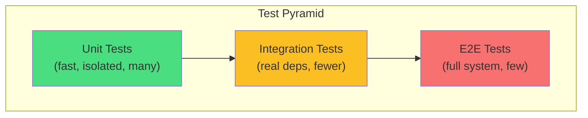

## Learning Objectives

- Design interfaces specifically for testability
- Create manual mocks and use mock generation tools
- Write integration tests with real dependencies using testcontainers
- Implement test doubles: fakes, stubs, mocks, and spies
- Structure test suites for fast unit tests and slower integration tests

## Prerequisites

- Experience writing unit tests with the testing package
- Deep understanding of Go interfaces
- Familiarity with database operations and HTTP clients

## Core Concepts

### Designing for Testability

The key to testable Go code is depending on interfaces rather than concrete types. Define interfaces at the consumer (not the producer).

```go
// service.go
package order

import (
    "context"
    "time"
)

type PaymentProcessor interface {
    Charge(ctx context.Context, amount float64, currency, token string) (string, error)
    Refund(ctx context.Context, chargeID string) error
}

type InventoryChecker interface {
    CheckAvailability(ctx context.Context, productID string, quantity int) (bool, error)
    Reserve(ctx context.Context, productID string, quantity int) (string, error)
    Release(ctx context.Context, reservationID string) error
}

type NotificationSender interface {
    SendOrderConfirmation(ctx context.Context, userEmail string, order *Order) error
}

type OrderService struct {
    payments     PaymentProcessor
    inventory    InventoryChecker
    notifications NotificationSender
    repo         OrderRepository
}

func NewOrderService(
    payments PaymentProcessor,
    inventory InventoryChecker,
    notifications NotificationSender,
    repo OrderRepository,
) *OrderService {
    return &OrderService{
        payments:     payments,
        inventory:    inventory,
        notifications: notifications,
        repo:         repo,
    }
}

func (s *OrderService) PlaceOrder(ctx context.Context, input PlaceOrderInput) (*Order, error) {
    available, err := s.inventory.CheckAvailability(ctx, input.ProductID, input.Quantity)
    if err != nil {
        return nil, fmt.Errorf("checking inventory: %w", err)
    }
    if !available {
        return nil, ErrOutOfStock
    }

    reservationID, err := s.inventory.Reserve(ctx, input.ProductID, input.Quantity)
    if err != nil {
        return nil, fmt.Errorf("reserving inventory: %w", err)
    }

    chargeID, err := s.payments.Charge(ctx, input.TotalAmount, "USD", input.PaymentToken)
    if err != nil {
        s.inventory.Release(ctx, reservationID)
        return nil, fmt.Errorf("charging payment: %w", err)
    }

    order := &Order{
        ID:            generateID(),
        ProductID:     input.ProductID,
        Quantity:      input.Quantity,
        Amount:        input.TotalAmount,
        ChargeID:      chargeID,
        ReservationID: reservationID,
        Status:        OrderStatusConfirmed,
        CreatedAt:     time.Now(),
    }

    if err := s.repo.Save(ctx, order); err != nil {
        s.payments.Refund(ctx, chargeID)
        s.inventory.Release(ctx, reservationID)
        return nil, fmt.Errorf("saving order: %w", err)
    }

    // Fire-and-forget notification (non-critical)
    go s.notifications.SendOrderConfirmation(context.Background(), input.UserEmail, order)

    return order, nil
}
```

### Manual Mocks

For simple interfaces, hand-written mocks give you full control:

```go
// order_test.go
package order

import (
    "context"
    "errors"
    "testing"
)

type mockPayments struct {
    chargeFunc func(ctx context.Context, amount float64, currency, token string) (string, error)
    refundFunc func(ctx context.Context, chargeID string) error
    charges    []chargeCall
    refunds    []string
}

type chargeCall struct {
    Amount   float64
    Currency string
    Token    string
}

func (m *mockPayments) Charge(ctx context.Context, amount float64, currency, token string) (string, error) {
    m.charges = append(m.charges, chargeCall{amount, currency, token})
    if m.chargeFunc != nil {
        return m.chargeFunc(ctx, amount, currency, token)
    }
    return "charge_123", nil
}

func (m *mockPayments) Refund(ctx context.Context, chargeID string) error {
    m.refunds = append(m.refunds, chargeID)
    if m.refundFunc != nil {
        return m.refundFunc(ctx, chargeID)
    }
    return nil
}

type mockInventory struct {
    available bool
    err       error
}

func (m *mockInventory) CheckAvailability(ctx context.Context, productID string, qty int) (bool, error) {
    return m.available, m.err
}

func (m *mockInventory) Reserve(ctx context.Context, productID string, qty int) (string, error) {
    if !m.available {
        return "", ErrOutOfStock
    }
    return "reservation_123", nil
}

func (m *mockInventory) Release(ctx context.Context, reservationID string) error {
    return nil
}

type mockNotifications struct {
    sent []string
}

func (m *mockNotifications) SendOrderConfirmation(ctx context.Context, email string, order *Order) error {
    m.sent = append(m.sent, email)
    return nil
}

func TestPlaceOrder_Success(t *testing.T) {
    payments := &mockPayments{}
    inventory := &mockInventory{available: true}
    notifications := &mockNotifications{}
    repo := NewInMemoryRepo()

    svc := NewOrderService(payments, inventory, notifications, repo)

    order, err := svc.PlaceOrder(context.Background(), PlaceOrderInput{
        ProductID:    "prod_1",
        Quantity:     2,
        TotalAmount:  99.99,
        PaymentToken: "tok_test",
        UserEmail:    "user@example.com",
    })

    if err != nil {
        t.Fatalf("unexpected error: %v", err)
    }
    if order.Status != OrderStatusConfirmed {
        t.Errorf("got status %v, want %v", order.Status, OrderStatusConfirmed)
    }
    if len(payments.charges) != 1 {
        t.Errorf("expected 1 charge, got %d", len(payments.charges))
    }
    if payments.charges[0].Amount != 99.99 {
        t.Errorf("charged %v, want 99.99", payments.charges[0].Amount)
    }
}

func TestPlaceOrder_PaymentFailure_ReleasesInventory(t *testing.T) {
    payments := &mockPayments{
        chargeFunc: func(ctx context.Context, amount float64, currency, token string) (string, error) {
            return "", errors.New("card declined")
        },
    }
    inventory := &mockInventory{available: true}
    notifications := &mockNotifications{}
    repo := NewInMemoryRepo()

    svc := NewOrderService(payments, inventory, notifications, repo)

    _, err := svc.PlaceOrder(context.Background(), PlaceOrderInput{
        ProductID:    "prod_1",
        Quantity:     1,
        TotalAmount:  50.00,
        PaymentToken: "tok_bad",
        UserEmail:    "user@example.com",
    })

    if err == nil {
        t.Fatal("expected error for declined card")
    }
    // Verify inventory was released (compensation)
}
```

### Mock Generation with mockgen

For larger interfaces, use `mockgen` to auto-generate mocks:

```bash
# Install mockgen
go install go.uber.org/mock/mockgen@latest

# Generate mocks from interface
mockgen -source=service.go -destination=mocks/mock_service.go -package=mocks

# Or from a specific interface
mockgen -destination=mocks/mock_payment.go -package=mocks myapp/order PaymentProcessor
```

```go
// Using generated mocks with gomock
func TestPlaceOrder_WithGoMock(t *testing.T) {
    ctrl := gomock.NewController(t)
    defer ctrl.Finish()

    mockPayments := mocks.NewMockPaymentProcessor(ctrl)
    mockInventory := mocks.NewMockInventoryChecker(ctrl)

    // Set expectations
    mockInventory.EXPECT().
        CheckAvailability(gomock.Any(), "prod_1", 2).
        Return(true, nil)

    mockInventory.EXPECT().
        Reserve(gomock.Any(), "prod_1", 2).
        Return("res_123", nil)

    mockPayments.EXPECT().
        Charge(gomock.Any(), 99.99, "USD", "tok_test").
        Return("charge_456", nil)

    svc := NewOrderService(mockPayments, mockInventory, nil, NewInMemoryRepo())
    order, err := svc.PlaceOrder(context.Background(), PlaceOrderInput{
        ProductID:    "prod_1",
        Quantity:     2,
        TotalAmount:  99.99,
        PaymentToken: "tok_test",
    })

    if err != nil {
        t.Fatalf("unexpected error: %v", err)
    }
    if order.ChargeID != "charge_456" {
        t.Errorf("unexpected charge ID: %s", order.ChargeID)
    }
}
```

### Integration Tests with Testcontainers

Testcontainers spins up real Docker containers for integration tests, ensuring your code works with actual databases.

```go
//go:build integration

package repository_test

import (
    "context"
    "testing"
    "time"

    "github.com/testcontainers/testcontainers-go"
    "github.com/testcontainers/testcontainers-go/modules/postgres"
    "github.com/testcontainers/testcontainers-go/wait"
)

func setupPostgres(t *testing.T) (string, func()) {
    ctx := context.Background()

    container, err := postgres.Run(ctx,
        "postgres:16-alpine",
        postgres.WithDatabase("testdb"),
        postgres.WithUsername("test"),
        postgres.WithPassword("test"),
        testcontainers.WithWaitStrategy(
            wait.ForLog("database system is ready to accept connections").
                WithOccurrence(2).
                WithStartupTimeout(30*time.Second),
        ),
    )
    if err != nil {
        t.Fatalf("starting postgres container: %v", err)
    }

    connStr, err := container.ConnectionString(ctx, "sslmode=disable")
    if err != nil {
        t.Fatalf("getting connection string: %v", err)
    }

    cleanup := func() {
        container.Terminate(ctx)
    }

    return connStr, cleanup
}

func TestUserRepository_Integration(t *testing.T) {
    if testing.Short() {
        t.Skip("skipping integration test in short mode")
    }

    connStr, cleanup := setupPostgres(t)
    defer cleanup()

    db, err := sql.Open("postgres", connStr)
    if err != nil {
        t.Fatalf("connecting to database: %v", err)
    }
    defer db.Close()

    // Run migrations
    runMigrations(t, db)

    repo := NewPostgresUserRepo(db)
    ctx := context.Background()

    t.Run("Create and Get", func(t *testing.T) {
        user := &User{Email: "integration@test.com", Name: "Integration Test"}
        err := repo.Create(ctx, user)
        if err != nil {
            t.Fatalf("creating user: %v", err)
        }
        if user.ID == "" {
            t.Fatal("expected ID to be set")
        }

        fetched, err := repo.GetByID(ctx, user.ID)
        if err != nil {
            t.Fatalf("fetching user: %v", err)
        }
        if fetched.Email != user.Email {
            t.Errorf("email mismatch: got %q, want %q", fetched.Email, user.Email)
        }
    })

    t.Run("List with pagination", func(t *testing.T) {
        for i := 0; i < 25; i++ {
            repo.Create(ctx, &User{
                Email: fmt.Sprintf("user%d@test.com", i),
                Name:  fmt.Sprintf("User %d", i),
            })
        }

        users, err := repo.List(ctx, 10, 0)
        if err != nil {
            t.Fatalf("listing users: %v", err)
        }
        if len(users) != 10 {
            t.Errorf("got %d users, want 10", len(users))
        }
    })
}
```

### HTTP Integration Tests

```go
func TestAPI_Integration(t *testing.T) {
    if testing.Short() {
        t.Skip("skipping integration test")
    }

    // Setup test server with real dependencies
    app := setupTestApp(t)
    srv := httptest.NewServer(app.Handler())
    defer srv.Close()

    client := srv.Client()

    t.Run("create and fetch user", func(t *testing.T) {
        body := `{"email": "api@test.com", "name": "API Test"}`
        resp, err := client.Post(srv.URL+"/api/users", "application/json",
            strings.NewReader(body))
        if err != nil {
            t.Fatalf("POST failed: %v", err)
        }
        defer resp.Body.Close()

        if resp.StatusCode != http.StatusCreated {
            t.Fatalf("got status %d, want 201", resp.StatusCode)
        }

        var created map[string]any
        json.NewDecoder(resp.Body).Decode(&created)
        userID := created["data"].(map[string]any)["id"].(string)

        // Fetch the created user
        resp, err = client.Get(srv.URL + "/api/users/" + userID)
        if err != nil {
            t.Fatalf("GET failed: %v", err)
        }
        defer resp.Body.Close()

        if resp.StatusCode != http.StatusOK {
            t.Errorf("got status %d, want 200", resp.StatusCode)
        }
    })
}
```



### Build Tags for Test Separation

```go
// file: repo_integration_test.go
//go:build integration

package repo_test
// ... integration tests that need Docker

// file: repo_test.go (no build tag = always runs)
package repo_test
// ... unit tests with mocks
```

```bash
# Run only unit tests (fast, no Docker needed)
go test ./...

# Run integration tests
go test -tags=integration ./...

# Run with short flag to skip slow tests
go test -short ./...
```

## Best Practices

1. **Keep interfaces small** — small interfaces are easy to mock
2. **Prefer manual mocks for simple interfaces** — they're easier to understand and debug
3. **Use testcontainers for database tests** — real databases catch bugs that mocks miss
4. **Separate fast and slow tests** — build tags or `-short` flag for CI optimization
5. **Test behavior at boundaries** — test the contract, not internal implementation details

## Common Pitfalls

```go
// PITFALL: Mocking too much — testing implementation, not behavior
// If you mock everything, you're testing nothing

// PITFALL: Integration tests without cleanup
func TestDB(t *testing.T) {
    // Creates data but never cleans up
    // Next test run may fail due to stale data
}
// FIX: Use t.Cleanup or transactions that rollback

// PITFALL: Shared state between tests
var globalDB *sql.DB // tests affect each other!
// FIX: Each test gets its own database or runs in a transaction
```

## Hands-On Exercises

### Exercise 1: Test a Service with Multiple Dependencies

Given a `NotificationService` that depends on `UserStore`, `TemplateRenderer`, and `EmailSender` interfaces, write tests that verify:
1. Correct template is selected based on notification type
2. Email is sent to the correct address
3. Failure in one step doesn't leave partial state

<details>
<summary>Solution</summary>

```go
package notification

import (
    "context"
    "errors"
    "testing"
)

type spyEmailSender struct {
    sentTo   []string
    sentBody []string
    err      error
}

func (s *spyEmailSender) Send(ctx context.Context, to, subject, body string) error {
    if s.err != nil {
        return s.err
    }
    s.sentTo = append(s.sentTo, to)
    s.sentBody = append(s.sentBody, body)
    return nil
}

type stubUserStore struct {
    users map[string]*User
}

func (s *stubUserStore) GetByID(ctx context.Context, id string) (*User, error) {
    u, ok := s.users[id]
    if !ok {
        return nil, ErrNotFound
    }
    return u, nil
}

type stubTemplateRenderer struct {
    templates map[string]string
}

func (s *stubTemplateRenderer) Render(name string, data any) (string, error) {
    tmpl, ok := s.templates[name]
    if !ok {
        return "", errors.New("template not found")
    }
    return tmpl, nil
}

func TestNotificationService_Send(t *testing.T) {
    users := &stubUserStore{users: map[string]*User{
        "user_1": {ID: "user_1", Email: "alice@example.com", Name: "Alice"},
    }}
    templates := &stubTemplateRenderer{templates: map[string]string{
        "welcome": "Welcome, Alice!",
        "reset":   "Reset your password",
    }}
    sender := &spyEmailSender{}

    svc := NewNotificationService(users, templates, sender)

    t.Run("sends welcome email", func(t *testing.T) {
        err := svc.Notify(context.Background(), "user_1", "welcome")
        if err != nil {
            t.Fatalf("unexpected error: %v", err)
        }
        if len(sender.sentTo) != 1 || sender.sentTo[0] != "alice@example.com" {
            t.Errorf("sent to %v, want [alice@example.com]", sender.sentTo)
        }
    })

    t.Run("user not found", func(t *testing.T) {
        err := svc.Notify(context.Background(), "unknown", "welcome")
        if !errors.Is(err, ErrNotFound) {
            t.Errorf("got %v, want ErrNotFound", err)
        }
    })

    t.Run("email failure doesn't corrupt state", func(t *testing.T) {
        failSender := &spyEmailSender{err: errors.New("SMTP error")}
        failSvc := NewNotificationService(users, templates, failSender)

        err := failSvc.Notify(context.Background(), "user_1", "welcome")
        if err == nil {
            t.Fatal("expected error from email sender")
        }
    })
}
```

</details>

## Key Takeaways

- Design with interfaces at consumption points for natural testability
- Use manual mocks for simple interfaces; mockgen for complex ones
- Testcontainers provide real-database confidence without manual Docker setup
- Separate unit tests (fast, no deps) from integration tests (real deps, slower)
- Test doubles spectrum: stubs (fixed returns) → mocks (verify calls) → fakes (working in-memory implementation)
- Build tags and `-short` flag enable flexible CI test strategies

## External Resources

- [go.uber.org/mock (mockgen)](https://github.com/uber-go/mock)
- [Testcontainers for Go](https://golang.testcontainers.org/)
- [Go Wiki: Test Comments](https://go.dev/wiki/TestComments)
- [Mitchell Hashimoto: Advanced Testing in Go](https://www.youtube.com/watch?v=8hQG7QlcLBk)
- [net/http/httptest package](https://pkg.go.dev/net/http/httptest)
