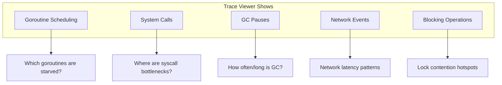

## Learning Objectives

- Profile CPU and memory usage with pprof
- Use the execution tracer for concurrency analysis
- Detect data races with Go's race detector
- Debug applications with Delve (dlv)
- Interpret flame graphs and allocation profiles
- Identify and fix common performance bottlenecks

## Prerequisites

- Experience writing and running Go tests and benchmarks
- Understanding of goroutines and concurrency
- Familiarity with Go's memory model (stack vs heap)

## Core Concepts

### CPU Profiling with pprof

Go's built-in profiler samples the call stack at regular intervals to identify where CPU time is spent.

```go
// Option 1: Profile during benchmarks
// go test -bench=. -cpuprofile=cpu.prof
// go tool pprof cpu.prof

// Option 2: In-program profiling
package main

import (
    "os"
    "runtime/pprof"
)

func main() {
    f, _ := os.Create("cpu.prof")
    pprof.StartCPUProfile(f)
    defer pprof.StopCPUProfile()

    // ... application code ...
}

// Option 3: HTTP endpoint for live profiling (production)
import _ "net/http/pprof"

func main() {
    go func() {
        http.ListenAndServe(":6060", nil) // pprof handlers auto-registered
    }()
    // ... main application ...
}
```

**Analyzing CPU profiles:**

```bash
# Interactive terminal
go tool pprof cpu.prof
(pprof) top 10         # top 10 functions by CPU
(pprof) list myFunc    # source code annotated with timing
(pprof) web            # open flame graph in browser

# One-liner for web UI
go tool pprof -http=:8081 cpu.prof

# Profile a running server
go tool pprof http://localhost:6060/debug/pprof/profile?seconds=30
```

### Memory Profiling

Memory profiles show allocation patterns — which functions allocate the most and where objects escape to the heap.

```go
// In benchmarks
// go test -bench=. -memprofile=mem.prof -memprofilerate=1
// go tool pprof -alloc_space mem.prof

// Programmatic heap profile
func dumpMemProfile() {
    f, _ := os.Create("mem.prof")
    defer f.Close()
    runtime.GC() // get up-to-date statistics
    pprof.WriteHeapProfile(f)
}
```

```bash
# View allocations
go tool pprof -alloc_space mem.prof   # total bytes allocated
go tool pprof -alloc_objects mem.prof # number of allocations
go tool pprof -inuse_space mem.prof   # currently live bytes

# Common pprof commands
(pprof) top 20 -cum    # sort by cumulative allocations
(pprof) list processRequest  # see line-by-line allocations
```

**Understanding escape analysis:**

```bash
# See what escapes to the heap
go build -gcflags="-m -m" ./...

# Common output:
# ./main.go:15:2: moved to heap: result   (variable escapes)
# ./main.go:20:9: &Config{} escapes to heap  (pointer returned)
```

```go
// Escapes to heap: returned pointer
func NewConfig() *Config {
    c := Config{} // escapes because we return &c
    return &c
}

// Stays on stack: value type, no pointers escape
func processData(data [100]byte) int {
    sum := 0
    for _, b := range data {
        sum += int(b)
    }
    return sum
}
```

### Execution Tracer

The execution tracer records goroutine scheduling, system calls, GC events, and more with nanosecond precision.

```go
// Trace in tests
// go test -trace=trace.out
// go tool trace trace.out

// Programmatic tracing
import "runtime/trace"

func main() {
    f, _ := os.Create("trace.out")
    trace.Start(f)
    defer trace.Stop()

    // ... application code ...
}

// HTTP endpoint
// curl http://localhost:6060/debug/pprof/trace?seconds=5 > trace.out
// go tool trace trace.out
```



### Race Detector

Go's race detector instruments memory accesses to find concurrent data races at runtime.

```bash
# Run with race detection
go test -race ./...
go run -race main.go
go build -race -o myapp .
```

```go
// Example: race detector catches this
package main

import "sync"

type Stats struct {
    mu     sync.Mutex
    counts map[string]int
}

func (s *Stats) Record(key string) {
    // BUG: forgot to lock!
    s.counts[key]++
}

// Race detector output:
// WARNING: DATA RACE
// Write at 0x00c0000b4000 by goroutine 7:
//   main.(*Stats).Record()
//       /path/main.go:12 +0x...
// Previous write at 0x00c0000b4000 by goroutine 6:
//   main.(*Stats).Record()
//       /path/main.go:12 +0x...
```

**Race detector performance:**
- ~5-10x CPU overhead
- ~5-10x memory overhead
- Run in tests and staging, not production
- Zero false positives — every report is a real bug

### Debugging with Delve

Delve (dlv) is Go's purpose-built debugger, understanding goroutines, interfaces, and Go's runtime internals.

```bash
# Install
go install github.com/go-delve/delve/cmd/dlv@latest

# Debug a program
dlv debug ./cmd/server

# Attach to running process
dlv attach <pid>

# Debug a test
dlv test ./pkg/mypackage -- -test.run TestSpecific
```

**Common Delve commands:**

```
(dlv) break main.go:42           # set breakpoint
(dlv) break mypackage.MyFunc     # break at function
(dlv) condition 1 x > 100       # conditional breakpoint
(dlv) continue                    # run until breakpoint
(dlv) next                        # step over
(dlv) step                        # step into
(dlv) stepout                     # step out of function
(dlv) print myVar                 # inspect variable
(dlv) locals                      # list local variables
(dlv) goroutines                  # list all goroutines
(dlv) goroutine 5                 # switch to goroutine 5
(dlv) stack                       # print stack trace
(dlv) whatis myVar               # show type of variable
```

**Debugging goroutine issues:**

```
(dlv) goroutines
  Goroutine 1 - User: main.go:15 main.main (0x...)
  Goroutine 2 - User: runtime/proc.go:... runtime.gopark
* Goroutine 5 - User: server.go:42 handleRequest (0x...) [current]
  Goroutine 6 - User: worker.go:28 processJob (0x...) [chan receive]
  Goroutine 7 - User: worker.go:28 processJob (0x...) [chan receive]

(dlv) goroutine 6
Switched to goroutine 6
(dlv) stack
0  runtime.gopark
1  runtime.chanrecv
2  worker.processJob (worker.go:28)
3  main.startWorkerPool.func1 (main.go:55)
```

### Practical Profiling Workflow

```go
package main

import (
    "log"
    "net/http"
    _ "net/http/pprof"
    "runtime"
    "time"
)

func init() {
    // Profile endpoint for production (protect with auth in real apps)
    go func() {
        log.Println(http.ListenAndServe(":6060", nil))
    }()
}

// Real-world profiling scenario: finding memory leaks
func findMemoryLeak() {
    // Step 1: Take baseline heap profile
    // curl http://localhost:6060/debug/pprof/heap > base.prof

    // Step 2: Run load for a while
    // Step 3: Take another heap profile
    // curl http://localhost:6060/debug/pprof/heap > after.prof

    // Step 4: Compare
    // go tool pprof -base=base.prof after.prof
    // (pprof) top  -- shows what grew

    // Step 5: Check goroutine count (leak indicator)
    // curl http://localhost:6060/debug/pprof/goroutine?debug=1
    log.Printf("Goroutines: %d", runtime.NumGoroutine())
}
```

**Profiling checklist for production issues:**

| Symptom | Profile | Command |
|---------|---------|---------|
| High CPU | CPU profile | `go tool pprof /debug/pprof/profile?seconds=30` |
| Memory growing | Heap profile | `go tool pprof /debug/pprof/heap` |
| Goroutine leak | Goroutine profile | `curl /debug/pprof/goroutine?debug=2` |
| High latency | Trace | `curl /debug/pprof/trace?seconds=5` |
| Lock contention | Mutex profile | `go tool pprof /debug/pprof/mutex` |
| Blocking | Block profile | `go tool pprof /debug/pprof/block` |

## Best Practices

1. **Profile before optimizing** — don't guess where the bottleneck is
2. **Run benchmarks with `-benchmem`** — allocation count often matters more than CPU
3. **Enable race detector in CI** — catches bugs that only manifest under load
4. **Use `runtime.SetMutexProfileFraction`** — enable mutex profiling for contention analysis
5. **Compare profiles with `pprof -base`** — find regressions between versions

## Common Pitfalls

```go
// PITFALL: Profiling optimized-away code
func BenchmarkDeadCode(b *testing.B) {
    for i := 0; i < b.N; i++ {
        result := compute(i) // compiler may optimize away
        _ = result
    }
}
// FIX: Use a package-level variable to prevent elimination
var sink int
func BenchmarkCorrect(b *testing.B) {
    for i := 0; i < b.N; i++ {
        sink = compute(i)
    }
}

// PITFALL: Profiling with race detector enabled
// Race detector changes allocation patterns — profile without it

// PITFALL: Not calling runtime.GC() before heap profile
// Old garbage inflates the profile
```

## Hands-On Exercises

### Exercise 1: Profile and Optimize

Given this intentionally slow function, use pprof to identify the bottleneck and optimize it:

```go
func SlowProcess(data []string) map[string]int {
    result := make(map[string]int)
    for _, s := range data {
        for _, other := range data {
            if strings.Contains(s, other) {
                result[s]++
            }
        }
    }
    return result
}
```

<details>
<summary>Solution</summary>

```go
// After profiling: O(n²) string comparison is the bottleneck
// Optimize based on what the code actually needs

func OptimizedProcess(data []string) map[string]int {
    result := make(map[string]int, len(data))

    // If we just need substring counts, use a trie or sort + binary search
    // But if the logic truly requires pairwise comparison, parallelize:
    type kv struct {
        key   string
        count int
    }

    ch := make(chan kv, len(data))
    var wg sync.WaitGroup

    // Fan out work across goroutines
    workers := runtime.NumCPU()
    chunkSize := (len(data) + workers - 1) / workers

    for i := 0; i < len(data); i += chunkSize {
        end := i + chunkSize
        if end > len(data) {
            end = len(data)
        }
        chunk := data[i:end]

        wg.Add(1)
        go func(items []string) {
            defer wg.Done()
            for _, s := range items {
                count := 0
                for _, other := range data {
                    if strings.Contains(s, other) {
                        count++
                    }
                }
                ch <- kv{s, count}
            }
        }(chunk)
    }

    go func() {
        wg.Wait()
        close(ch)
    }()

    for item := range ch {
        result[item.key] = item.count
    }
    return result
}
```

</details>

### Exercise 2: Find the Goroutine Leak

Debug this HTTP server that leaks goroutines over time:

```go
func handleRequest(w http.ResponseWriter, r *http.Request) {
    ch := make(chan string)
    go func() {
        result := fetchFromService(r.URL.Query().Get("id"))
        ch <- result
    }()
    
    select {
    case result := <-ch:
        fmt.Fprint(w, result)
    case <-time.After(2 * time.Second):
        http.Error(w, "timeout", http.StatusGatewayTimeout)
    }
}
```

<details>
<summary>Solution</summary>

The goroutine leaks when the timeout fires — the goroutine blocks forever trying to send on `ch` because nobody reads it after the handler returns.

```go
func handleRequest(w http.ResponseWriter, r *http.Request) {
    ch := make(chan string, 1) // buffered: allows send even after timeout
    
    ctx, cancel := context.WithTimeout(r.Context(), 2*time.Second)
    defer cancel()
    
    go func() {
        result := fetchFromServiceWithContext(ctx, r.URL.Query().Get("id"))
        select {
        case ch <- result:
        case <-ctx.Done():
            // context cancelled, discard result
        }
    }()
    
    select {
    case result := <-ch:
        fmt.Fprint(w, result)
    case <-ctx.Done():
        http.Error(w, "timeout", http.StatusGatewayTimeout)
    }
}
```

Key fixes:
1. Buffer the channel so the goroutine can send even if nobody reads
2. Use context for cancellation so the fetch itself can be cancelled
3. Select on ctx.Done() in the goroutine to prevent blocking

</details>

## Key Takeaways

- Profile before optimizing — intuition is often wrong about bottlenecks
- CPU profiles identify hot functions; memory profiles find allocation-heavy code
- The execution tracer reveals scheduling, GC, and contention at nanosecond resolution
- Race detector has zero false positives — always run it in CI
- Delve understands goroutines natively — use it for concurrent debugging
- Monitor `runtime.NumGoroutine()` in production to catch leaks early

## External Resources

- [Go Blog: Profiling Go Programs](https://go.dev/blog/pprof)
- [pprof documentation](https://pkg.go.dev/runtime/pprof)
- [Delve debugger](https://github.com/go-delve/delve)
- [Practical Go: Diagnostics](https://go.dev/doc/diagnostics)
- [Felix Geisendörfer: Go's Execution Tracer](https://www.youtube.com/watch?v=V74JnrGTwKA)
