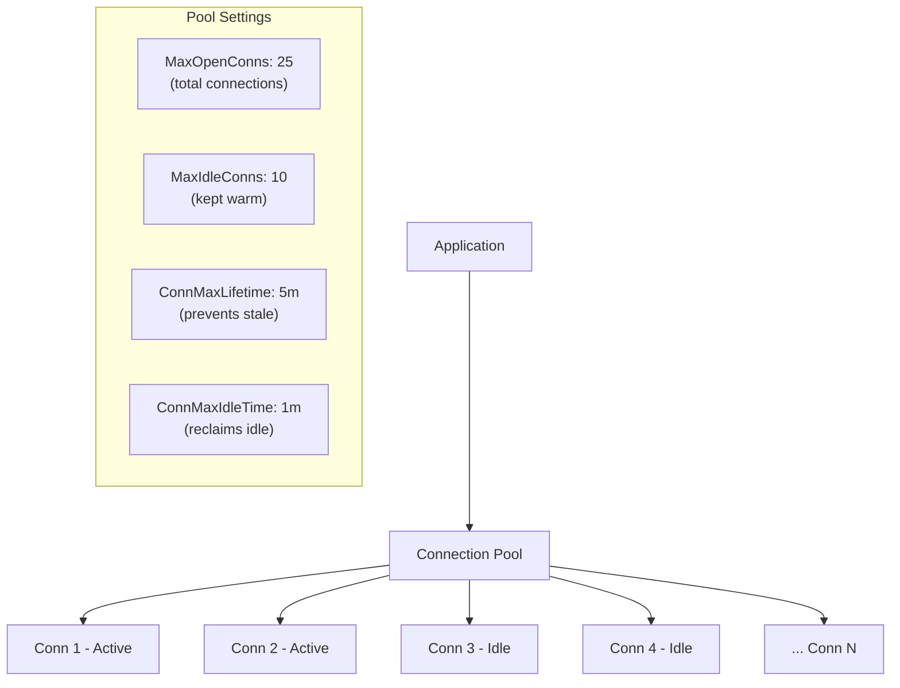

## Learning Objectives

- Use `database/sql` for direct, efficient database interactions
- Implement GORM for rapid development with ORM patterns
- Integrate MongoDB using the official Go driver
- Configure connection pooling for production workloads
- Manage schema migrations safely
- Apply the Repository pattern for clean data access abstraction

## Prerequisites

- Experience building REST APIs in Go
- Understanding of SQL fundamentals (PostgreSQL preferred)
- Basic familiarity with NoSQL concepts

## Core Concepts

### database/sql: The Standard Interface

Go's `database/sql` package provides a generic interface around SQL databases with built-in connection pooling, prepared statements, and transaction support.

```go
package main

import (
    "context"
    "database/sql"
    "fmt"
    "time"

    _ "github.com/lib/pq" // PostgreSQL driver
)

type User struct {
    ID        int64
    Email     string
    Name      string
    CreatedAt time.Time
    UpdatedAt time.Time
}

func NewDB(dsn string) (*sql.DB, error) {
    db, err := sql.Open("postgres", dsn)
    if err != nil {
        return nil, fmt.Errorf("opening database: %w", err)
    }

    // Connection pool settings
    db.SetMaxOpenConns(25)
    db.SetMaxIdleConns(10)
    db.SetConnMaxLifetime(5 * time.Minute)
    db.SetConnMaxIdleTime(1 * time.Minute)

    ctx, cancel := context.WithTimeout(context.Background(), 5*time.Second)
    defer cancel()

    if err := db.PingContext(ctx); err != nil {
        return nil, fmt.Errorf("pinging database: %w", err)
    }

    return db, nil
}

type UserRepository struct {
    db *sql.DB
}

func (r *UserRepository) GetByID(ctx context.Context, id int64) (*User, error) {
    var u User
    err := r.db.QueryRowContext(ctx,
        `SELECT id, email, name, created_at, updated_at 
         FROM users WHERE id = $1`, id,
    ).Scan(&u.ID, &u.Email, &u.Name, &u.CreatedAt, &u.UpdatedAt)

    if err == sql.ErrNoRows {
        return nil, nil
    }
    if err != nil {
        return nil, fmt.Errorf("querying user %d: %w", id, err)
    }
    return &u, nil
}

func (r *UserRepository) Create(ctx context.Context, u *User) error {
    err := r.db.QueryRowContext(ctx,
        `INSERT INTO users (email, name, created_at, updated_at) 
         VALUES ($1, $2, NOW(), NOW()) 
         RETURNING id, created_at, updated_at`,
        u.Email, u.Name,
    ).Scan(&u.ID, &u.CreatedAt, &u.UpdatedAt)

    if err != nil {
        return fmt.Errorf("creating user: %w", err)
    }
    return nil
}

func (r *UserRepository) List(ctx context.Context, limit, offset int) ([]User, error) {
    rows, err := r.db.QueryContext(ctx,
        `SELECT id, email, name, created_at, updated_at 
         FROM users ORDER BY created_at DESC LIMIT $1 OFFSET $2`,
        limit, offset,
    )
    if err != nil {
        return nil, fmt.Errorf("listing users: %w", err)
    }
    defer rows.Close()

    var users []User
    for rows.Next() {
        var u User
        if err := rows.Scan(&u.ID, &u.Email, &u.Name, &u.CreatedAt, &u.UpdatedAt); err != nil {
            return nil, fmt.Errorf("scanning user: %w", err)
        }
        users = append(users, u)
    }
    return users, rows.Err()
}

// Transaction support
func (r *UserRepository) Transfer(ctx context.Context, fromID, toID int64, amount float64) error {
    tx, err := r.db.BeginTx(ctx, &sql.TxOptions{Isolation: sql.LevelSerializable})
    if err != nil {
        return fmt.Errorf("beginning transaction: %w", err)
    }
    defer tx.Rollback()

    _, err = tx.ExecContext(ctx,
        `UPDATE accounts SET balance = balance - $1 WHERE user_id = $2 AND balance >= $1`,
        amount, fromID,
    )
    if err != nil {
        return fmt.Errorf("deducting from sender: %w", err)
    }

    _, err = tx.ExecContext(ctx,
        `UPDATE accounts SET balance = balance + $1 WHERE user_id = $2`,
        amount, toID,
    )
    if err != nil {
        return fmt.Errorf("crediting receiver: %w", err)
    }

    return tx.Commit()
}
```

### GORM: Object-Relational Mapping

GORM provides a higher-level abstraction for database operations with auto-migration, associations, hooks, and query builders.

```go
package main

import (
    "context"
    "time"

    "gorm.io/driver/postgres"
    "gorm.io/gorm"
    "gorm.io/gorm/logger"
)

type Product struct {
    ID          uint           `gorm:"primaryKey" json:"id"`
    Name        string         `gorm:"size:255;not null;index" json:"name"`
    Description string         `gorm:"type:text" json:"description"`
    Price       float64        `gorm:"not null;check:price > 0" json:"price"`
    SKU         string         `gorm:"size:50;uniqueIndex" json:"sku"`
    CategoryID  uint           `json:"category_id"`
    Category    Category       `gorm:"foreignKey:CategoryID" json:"category,omitempty"`
    Tags        []Tag          `gorm:"many2many:product_tags" json:"tags,omitempty"`
    Stock       int            `gorm:"default:0" json:"stock"`
    Active      bool           `gorm:"default:true" json:"active"`
    CreatedAt   time.Time      `json:"created_at"`
    UpdatedAt   time.Time      `json:"updated_at"`
    DeletedAt   gorm.DeletedAt `gorm:"index" json:"-"` // soft delete
}

type Category struct {
    ID       uint      `gorm:"primaryKey" json:"id"`
    Name     string    `gorm:"size:100;not null;uniqueIndex" json:"name"`
    Products []Product `json:"products,omitempty"`
}

type Tag struct {
    ID   uint   `gorm:"primaryKey" json:"id"`
    Name string `gorm:"size:50;not null;uniqueIndex" json:"name"`
}

func NewGormDB(dsn string) (*gorm.DB, error) {
    db, err := gorm.Open(postgres.Open(dsn), &gorm.Config{
        Logger: logger.Default.LogMode(logger.Warn),
    })
    if err != nil {
        return nil, err
    }

    sqlDB, _ := db.DB()
    sqlDB.SetMaxOpenConns(25)
    sqlDB.SetMaxIdleConns(10)
    sqlDB.SetConnMaxLifetime(5 * time.Minute)

    // Auto-migrate schema
    db.AutoMigrate(&Category{}, &Product{}, &Tag{})

    return db, nil
}

type ProductRepo struct {
    db *gorm.DB
}

func (r *ProductRepo) FindByID(ctx context.Context, id uint) (*Product, error) {
    var product Product
    err := r.db.WithContext(ctx).
        Preload("Category").
        Preload("Tags").
        First(&product, id).Error

    if err == gorm.ErrRecordNotFound {
        return nil, nil
    }
    return &product, err
}

func (r *ProductRepo) Search(ctx context.Context, query string, minPrice, maxPrice float64, page, perPage int) ([]Product, int64, error) {
    var products []Product
    var total int64

    db := r.db.WithContext(ctx).Model(&Product{}).Where("active = ?", true)

    if query != "" {
        db = db.Where("name ILIKE ? OR description ILIKE ?",
            "%"+query+"%", "%"+query+"%")
    }
    if minPrice > 0 {
        db = db.Where("price >= ?", minPrice)
    }
    if maxPrice > 0 {
        db = db.Where("price <= ?", maxPrice)
    }

    db.Count(&total)

    err := db.Preload("Category").
        Order("created_at DESC").
        Offset((page - 1) * perPage).
        Limit(perPage).
        Find(&products).Error

    return products, total, err
}

func (r *ProductRepo) Create(ctx context.Context, p *Product) error {
    return r.db.WithContext(ctx).Create(p).Error
}

func (r *ProductRepo) Update(ctx context.Context, p *Product) error {
    return r.db.WithContext(ctx).Save(p).Error
}

func (r *ProductRepo) SoftDelete(ctx context.Context, id uint) error {
    return r.db.WithContext(ctx).Delete(&Product{}, id).Error
}
```

### MongoDB Integration

```go
package main

import (
    "context"
    "fmt"
    "time"

    "go.mongodb.org/mongo-driver/bson"
    "go.mongodb.org/mongo-driver/bson/primitive"
    "go.mongodb.org/mongo-driver/mongo"
    "go.mongodb.org/mongo-driver/mongo/options"
)

type Event struct {
    ID        primitive.ObjectID `bson:"_id,omitempty" json:"id"`
    Type      string             `bson:"type" json:"type"`
    Source    string             `bson:"source" json:"source"`
    Data      bson.M             `bson:"data" json:"data"`
    Metadata  Metadata           `bson:"metadata" json:"metadata"`
    CreatedAt time.Time          `bson:"created_at" json:"created_at"`
}

type Metadata struct {
    UserID    string `bson:"user_id" json:"user_id"`
    SessionID string `bson:"session_id" json:"session_id"`
    IP        string `bson:"ip" json:"ip"`
}

func NewMongoClient(uri string) (*mongo.Client, error) {
    ctx, cancel := context.WithTimeout(context.Background(), 10*time.Second)
    defer cancel()

    opts := options.Client().
        ApplyURI(uri).
        SetMaxPoolSize(50).
        SetMinPoolSize(5).
        SetMaxConnIdleTime(30 * time.Second).
        SetServerSelectionTimeout(5 * time.Second)

    client, err := mongo.Connect(ctx, opts)
    if err != nil {
        return nil, fmt.Errorf("connecting to MongoDB: %w", err)
    }

    if err := client.Ping(ctx, nil); err != nil {
        return nil, fmt.Errorf("pinging MongoDB: %w", err)
    }

    return client, nil
}

type EventStore struct {
    collection *mongo.Collection
}

func NewEventStore(client *mongo.Client, database string) *EventStore {
    coll := client.Database(database).Collection("events")

    // Create indexes
    ctx, cancel := context.WithTimeout(context.Background(), 30*time.Second)
    defer cancel()

    coll.Indexes().CreateMany(ctx, []mongo.IndexModel{
        {Keys: bson.D{{Key: "type", Value: 1}, {Key: "created_at", Value: -1}}},
        {Keys: bson.D{{Key: "metadata.user_id", Value: 1}}},
        {Keys: bson.D{{Key: "created_at", Value: 1}},
            Options: options.Index().SetExpireAfterSeconds(7776000)}, // 90 day TTL
    })

    return &EventStore{collection: coll}
}

func (s *EventStore) Insert(ctx context.Context, event *Event) error {
    event.CreatedAt = time.Now()
    result, err := s.collection.InsertOne(ctx, event)
    if err != nil {
        return fmt.Errorf("inserting event: %w", err)
    }
    event.ID = result.InsertedID.(primitive.ObjectID)
    return nil
}

func (s *EventStore) FindByType(ctx context.Context, eventType string, since time.Time, limit int64) ([]Event, error) {
    filter := bson.M{
        "type":       eventType,
        "created_at": bson.M{"$gte": since},
    }

    opts := options.Find().
        SetSort(bson.D{{Key: "created_at", Value: -1}}).
        SetLimit(limit)

    cursor, err := s.collection.Find(ctx, filter, opts)
    if err != nil {
        return nil, fmt.Errorf("finding events: %w", err)
    }
    defer cursor.Close(ctx)

    var events []Event
    if err := cursor.All(ctx, &events); err != nil {
        return nil, fmt.Errorf("decoding events: %w", err)
    }
    return events, nil
}

func (s *EventStore) Aggregate(ctx context.Context, eventType string, groupBy string) ([]bson.M, error) {
    pipeline := mongo.Pipeline{
        {{Key: "$match", Value: bson.M{"type": eventType}}},
        {{Key: "$group", Value: bson.M{
            "_id":   "$" + groupBy,
            "count": bson.M{"$sum": 1},
            "last":  bson.M{"$max": "$created_at"},
        }}},
        {{Key: "$sort", Value: bson.M{"count": -1}}},
        {{Key: "$limit", Value: 20}},
    }

    cursor, err := s.collection.Aggregate(ctx, pipeline)
    if err != nil {
        return nil, fmt.Errorf("aggregating events: %w", err)
    }
    defer cursor.Close(ctx)

    var results []bson.M
    if err := cursor.All(ctx, &results); err != nil {
        return nil, fmt.Errorf("decoding aggregation: %w", err)
    }
    return results, nil
}
```

### Connection Pool Tuning



| Setting | Default | Production Recommendation |
|---------|---------|--------------------------|
| MaxOpenConns | Unlimited | 25-50 (match DB max_connections / num_instances) |
| MaxIdleConns | 2 | 10-25 (reduce connection creation overhead) |
| ConnMaxLifetime | Unlimited | 5 minutes (handle DB restarts gracefully) |
| ConnMaxIdleTime | Unlimited | 1 minute (reclaim unused connections) |

### Repository Pattern

The Repository pattern abstracts data access behind an interface, enabling testability and backend swapping.

```go
type UserRepository interface {
    GetByID(ctx context.Context, id string) (*User, error)
    GetByEmail(ctx context.Context, email string) (*User, error)
    List(ctx context.Context, filter UserFilter, pagination Pagination) ([]User, int, error)
    Create(ctx context.Context, user *User) error
    Update(ctx context.Context, user *User) error
    Delete(ctx context.Context, id string) error
}

type UserFilter struct {
    Status *string
    Role   *string
    Search *string
}

type Pagination struct {
    Page    int
    PerPage int
}

// PostgreSQL implementation
type pgUserRepo struct {
    db *sql.DB
}

func NewPGUserRepo(db *sql.DB) UserRepository {
    return &pgUserRepo{db: db}
}

// MongoDB implementation
type mongoUserRepo struct {
    coll *mongo.Collection
}

func NewMongoUserRepo(client *mongo.Client, db string) UserRepository {
    return &mongoUserRepo{
        coll: client.Database(db).Collection("users"),
    }
}

// Service depends on interface, not implementation
type UserService struct {
    repo UserRepository
}

func NewUserService(repo UserRepository) *UserService {
    return &UserService{repo: repo}
}
```

### Schema Migrations

```go
// Using golang-migrate
package main

import (
    "database/sql"
    "log"

    "github.com/golang-migrate/migrate/v4"
    "github.com/golang-migrate/migrate/v4/database/postgres"
    _ "github.com/golang-migrate/migrate/v4/source/file"
)

func RunMigrations(db *sql.DB) error {
    driver, err := postgres.WithInstance(db, &postgres.Config{})
    if err != nil {
        return err
    }

    m, err := migrate.NewWithDatabaseInstance(
        "file://migrations",
        "postgres", driver,
    )
    if err != nil {
        return err
    }

    if err := m.Up(); err != nil && err != migrate.ErrNoChange {
        return err
    }

    log.Println("migrations applied successfully")
    return nil
}
```

## Best Practices

1. **Always use context for database calls** — enables timeout and cancellation propagation
2. **Close rows and cursors** — use `defer rows.Close()` immediately after Query calls
3. **Tune connection pools** — defaults are rarely optimal for production
4. **Use prepared statements for repeated queries** — reduces parsing overhead
5. **Implement migrations as versioned files** — never modify production schema manually

## Common Pitfalls

```go
// PITFALL: Not closing rows (connection leak)
rows, _ := db.QueryContext(ctx, "SELECT ...")
for rows.Next() { /* ... */ }
// rows.Close() never called if loop breaks early!

// FIX: Always defer Close
rows, err := db.QueryContext(ctx, "SELECT ...")
if err != nil { return err }
defer rows.Close()

// PITFALL: Ignoring rows.Err()
for rows.Next() {
    rows.Scan(&item)
    results = append(results, item)
}
// Must check for iteration errors
if err := rows.Err(); err != nil { return err }

// PITFALL: Opening too many connections in tests
// Each test creates its own DB connection
func TestSomething(t *testing.T) {
    db, _ := sql.Open(...) // no pool config = unlimited connections
}
```

## Hands-On Exercises

### Exercise 1: Multi-Database Service

Build a service that:
1. Stores user profiles in PostgreSQL (relational, ACID)
2. Stores user activity events in MongoDB (flexible schema, high write throughput)
3. Uses the Repository pattern with separate interfaces
4. Implements graceful shutdown for all connections

<details>
<summary>Solution</summary>

```go
package main

import (
    "context"
    "database/sql"
    "log/slog"
    "os"
    "os/signal"
    "syscall"
    "time"

    _ "github.com/lib/pq"
    "go.mongodb.org/mongo-driver/mongo"
    "go.mongodb.org/mongo-driver/mongo/options"
)

type App struct {
    pgDB    *sql.DB
    mongoDB *mongo.Client
    logger  *slog.Logger
}

func NewApp(pgDSN, mongoURI string) (*App, error) {
    logger := slog.New(slog.NewJSONHandler(os.Stdout, nil))

    pgDB, err := sql.Open("postgres", pgDSN)
    if err != nil {
        return nil, err
    }
    pgDB.SetMaxOpenConns(25)
    pgDB.SetMaxIdleConns(10)
    pgDB.SetConnMaxLifetime(5 * time.Minute)

    ctx, cancel := context.WithTimeout(context.Background(), 10*time.Second)
    defer cancel()

    if err := pgDB.PingContext(ctx); err != nil {
        return nil, err
    }
    logger.Info("PostgreSQL connected")

    mongoClient, err := mongo.Connect(ctx, options.Client().ApplyURI(mongoURI))
    if err != nil {
        return nil, err
    }
    if err := mongoClient.Ping(ctx, nil); err != nil {
        return nil, err
    }
    logger.Info("MongoDB connected")

    return &App{pgDB: pgDB, mongoDB: mongoClient, logger: logger}, nil
}

func (a *App) Shutdown(ctx context.Context) error {
    a.logger.Info("shutting down database connections")

    if err := a.pgDB.Close(); err != nil {
        a.logger.Error("closing PostgreSQL", "error", err)
    }

    if err := a.mongoDB.Disconnect(ctx); err != nil {
        a.logger.Error("closing MongoDB", "error", err)
    }

    return nil
}

func main() {
    app, err := NewApp(
        os.Getenv("POSTGRES_DSN"),
        os.Getenv("MONGO_URI"),
    )
    if err != nil {
        slog.Error("failed to initialize app", "error", err)
        os.Exit(1)
    }

    quit := make(chan os.Signal, 1)
    signal.Notify(quit, syscall.SIGINT, syscall.SIGTERM)
    <-quit

    ctx, cancel := context.WithTimeout(context.Background(), 10*time.Second)
    defer cancel()
    app.Shutdown(ctx)
}
```

</details>

## Key Takeaways

- `database/sql` provides production-grade connection pooling out of the box
- GORM accelerates development but understand the generated SQL for performance
- MongoDB's Go driver supports rich queries, aggregations, and TTL indexes
- Always tune connection pool settings — defaults leave performance on the table
- The Repository pattern decouples business logic from storage implementation
- Run migrations as versioned, immutable files in CI/CD

## External Resources

- [database/sql tutorial](https://go.dev/doc/database/)
- [GORM Documentation](https://gorm.io/docs/)
- [MongoDB Go Driver](https://www.mongodb.com/docs/drivers/go/current/)
- [golang-migrate](https://github.com/golang-migrate/migrate)
- [Connection Pooling Explained](https://go.dev/doc/database/manage-connections)
