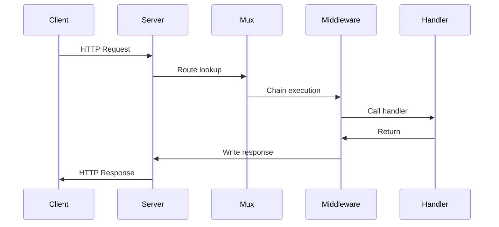

## Learning Objectives

- Build HTTP servers using Go's standard `net/http` package
- Implement handlers with proper request/response lifecycle management
- Use multiplexers (mux) for routing including Go 1.22's enhanced patterns
- Build composable middleware for cross-cutting concerns
- Understand the request lifecycle from connection to response

## Prerequisites

- Understanding of Go interfaces (particularly `http.Handler`)
- Familiarity with HTTP protocol basics (methods, status codes, headers)
- Knowledge of context package for request-scoped values

## Core Concepts

### The `net/http` Foundation

Go's `net/http` package provides a production-grade HTTP server out of the box — no external framework required.

```go
package main

import (
    "encoding/json"
    "log/slog"
    "net/http"
    "os"
    "time"
)

func main() {
    logger := slog.New(slog.NewJSONHandler(os.Stdout, nil))

    mux := http.NewServeMux()
    mux.HandleFunc("GET /health", handleHealth)
    mux.HandleFunc("GET /api/users/{id}", handleGetUser)
    mux.HandleFunc("POST /api/users", handleCreateUser)

    srv := &http.Server{
        Addr:         ":8080",
        Handler:      mux,
        ReadTimeout:  15 * time.Second,
        WriteTimeout: 15 * time.Second,
        IdleTimeout:  60 * time.Second,
    }

    logger.Info("server starting", "addr", srv.Addr)
    if err := srv.ListenAndServe(); err != http.ErrServerClosed {
        logger.Error("server failed", "error", err)
        os.Exit(1)
    }
}

func handleHealth(w http.ResponseWriter, r *http.Request) {
    w.Header().Set("Content-Type", "application/json")
    json.NewEncoder(w).Encode(map[string]string{"status": "ok"})
}

func handleGetUser(w http.ResponseWriter, r *http.Request) {
    id := r.PathValue("id") // Go 1.22+ path parameters
    if id == "" {
        http.Error(w, "missing user id", http.StatusBadRequest)
        return
    }
    // fetch user...
    json.NewEncoder(w).Encode(map[string]string{"id": id, "name": "Alice"})
}

func handleCreateUser(w http.ResponseWriter, r *http.Request) {
    var req struct {
        Name  string `json:"name"`
        Email string `json:"email"`
    }
    if err := json.NewDecoder(r.Body).Decode(&req); err != nil {
        http.Error(w, "invalid request body", http.StatusBadRequest)
        return
    }
    w.Header().Set("Content-Type", "application/json")
    w.WriteHeader(http.StatusCreated)
    json.NewEncoder(w).Encode(map[string]string{"id": "new-id", "name": req.Name})
}
```

### The Handler Interface

Everything in `net/http` revolves around the `http.Handler` interface:

```go
type Handler interface {
    ServeHTTP(ResponseWriter, *Request)
}
```

Any type satisfying this interface can handle HTTP requests. `http.HandlerFunc` is an adapter that lets ordinary functions serve as handlers.

```go
// Function adapter
type HandlerFunc func(ResponseWriter, *Request)

func (f HandlerFunc) ServeHTTP(w ResponseWriter, r *Request) {
    f(w, r)
}
```



### Go 1.22 Enhanced Routing

Go 1.22 added method-based routing and path parameters to the standard mux:

```go
mux := http.NewServeMux()

// Method matching
mux.HandleFunc("GET /articles", listArticles)
mux.HandleFunc("POST /articles", createArticle)

// Path parameters with {name} syntax
mux.HandleFunc("GET /articles/{id}", getArticle)
mux.HandleFunc("PUT /articles/{id}", updateArticle)
mux.HandleFunc("DELETE /articles/{id}", deleteArticle)

// Wildcard for catch-all (must be at end)
mux.HandleFunc("GET /files/{path...}", serveFile)

// Exact match vs prefix
mux.HandleFunc("GET /api/", apiHandler)     // prefix: matches /api/anything
mux.HandleFunc("GET /api/v1", exactHandler) // exact: only /api/v1
```

### Middleware Pattern

Middleware wraps handlers to add cross-cutting behavior. The pattern is a function that takes a handler and returns a handler.

```go
type Middleware func(http.Handler) http.Handler

func LoggingMiddleware(logger *slog.Logger) Middleware {
    return func(next http.Handler) http.Handler {
        return http.HandlerFunc(func(w http.ResponseWriter, r *http.Request) {
            start := time.Now()

            // Wrap ResponseWriter to capture status code
            wrapped := &responseWriter{ResponseWriter: w, statusCode: http.StatusOK}

            next.ServeHTTP(wrapped, r)

            logger.Info("request completed",
                "method", r.Method,
                "path", r.URL.Path,
                "status", wrapped.statusCode,
                "duration_ms", time.Since(start).Milliseconds(),
                "remote_addr", r.RemoteAddr,
            )
        })
    }
}

type responseWriter struct {
    http.ResponseWriter
    statusCode int
    written    bool
}

func (rw *responseWriter) WriteHeader(code int) {
    if !rw.written {
        rw.statusCode = code
        rw.written = true
    }
    rw.ResponseWriter.WriteHeader(code)
}

func RecoveryMiddleware(logger *slog.Logger) Middleware {
    return func(next http.Handler) http.Handler {
        return http.HandlerFunc(func(w http.ResponseWriter, r *http.Request) {
            defer func() {
                if err := recover(); err != nil {
                    logger.Error("panic recovered",
                        "error", err,
                        "path", r.URL.Path,
                    )
                    http.Error(w, "Internal Server Error", http.StatusInternalServerError)
                }
            }()
            next.ServeHTTP(w, r)
        })
    }
}

func RequestIDMiddleware() Middleware {
    return func(next http.Handler) http.Handler {
        return http.HandlerFunc(func(w http.ResponseWriter, r *http.Request) {
            requestID := r.Header.Get("X-Request-ID")
            if requestID == "" {
                requestID = generateUUID()
            }
            ctx := context.WithValue(r.Context(), requestIDKey, requestID)
            w.Header().Set("X-Request-ID", requestID)
            next.ServeHTTP(w, r.WithContext(ctx))
        })
    }
}

func TimeoutMiddleware(timeout time.Duration) Middleware {
    return func(next http.Handler) http.Handler {
        return http.HandlerFunc(func(w http.ResponseWriter, r *http.Request) {
            ctx, cancel := context.WithTimeout(r.Context(), timeout)
            defer cancel()
            next.ServeHTTP(w, r.WithContext(ctx))
        })
    }
}

// Chain applies middleware in order (first applied = outermost)
func Chain(handler http.Handler, middlewares ...Middleware) http.Handler {
    for i := len(middlewares) - 1; i >= 0; i-- {
        handler = middlewares[i](handler)
    }
    return handler
}

// Usage
func main() {
    logger := slog.Default()
    mux := http.NewServeMux()
    mux.HandleFunc("GET /api/data", handleData)

    handler := Chain(mux,
        RecoveryMiddleware(logger),
        RequestIDMiddleware(),
        LoggingMiddleware(logger),
        TimeoutMiddleware(30*time.Second),
    )

    http.ListenAndServe(":8080", handler)
}
```

### Request/Response Lifecycle

```go
func handleComplexRequest(w http.ResponseWriter, r *http.Request) {
    // 1. Read and validate request
    if r.Method != http.MethodPost {
        w.Header().Set("Allow", "POST")
        http.Error(w, "method not allowed", http.StatusMethodNotAllowed)
        return
    }

    // 2. Parse body with size limit
    r.Body = http.MaxBytesReader(w, r.Body, 1<<20) // 1MB limit
    var payload CreateRequest
    if err := json.NewDecoder(r.Body).Decode(&payload); err != nil {
        http.Error(w, "invalid JSON", http.StatusBadRequest)
        return
    }

    // 3. Validate
    if err := payload.Validate(); err != nil {
        writeJSON(w, http.StatusUnprocessableEntity, ErrorResponse{
            Error:   "validation_failed",
            Details: err.Error(),
        })
        return
    }

    // 4. Process (respecting context cancellation)
    ctx := r.Context()
    result, err := processWithContext(ctx, payload)
    if err != nil {
        if ctx.Err() == context.DeadlineExceeded {
            writeJSON(w, http.StatusGatewayTimeout, ErrorResponse{Error: "timeout"})
            return
        }
        writeJSON(w, http.StatusInternalServerError, ErrorResponse{Error: "internal_error"})
        return
    }

    // 5. Write response
    writeJSON(w, http.StatusCreated, result)
}

func writeJSON(w http.ResponseWriter, status int, data any) {
    w.Header().Set("Content-Type", "application/json")
    w.WriteHeader(status)
    json.NewEncoder(w).Encode(data)
}
```

### Structured JSON API Response

```go
type APIResponse[T any] struct {
    Data    T        `json:"data,omitempty"`
    Error   *APIError `json:"error,omitempty"`
    Meta    *Meta    `json:"meta,omitempty"`
}

type APIError struct {
    Code    string `json:"code"`
    Message string `json:"message"`
    Details any    `json:"details,omitempty"`
}

type Meta struct {
    Page       int `json:"page,omitempty"`
    PerPage    int `json:"per_page,omitempty"`
    TotalCount int `json:"total_count,omitempty"`
}

func respondOK[T any](w http.ResponseWriter, data T) {
    writeJSON(w, http.StatusOK, APIResponse[T]{Data: data})
}

func respondError(w http.ResponseWriter, status int, code, message string) {
    writeJSON(w, status, APIResponse[any]{
        Error: &APIError{Code: code, Message: message},
    })
}

func respondList[T any](w http.ResponseWriter, items []T, page, perPage, total int) {
    writeJSON(w, http.StatusOK, APIResponse[[]T]{
        Data: items,
        Meta: &Meta{Page: page, PerPage: perPage, TotalCount: total},
    })
}
```

## Best Practices

1. **Always set timeouts** — ReadTimeout, WriteTimeout, IdleTimeout prevent resource exhaustion
2. **Limit request body size** — use `http.MaxBytesReader` to prevent memory exhaustion attacks
3. **Write headers before body** — once you call `Write()`, the status defaults to 200
4. **Respect client cancellation** — check `r.Context()` in long operations
5. **Use `http.Error` for error responses** — it sets Content-Type and writes the status code atomically

## Common Pitfalls

```go
// PITFALL: Writing status after body
func badHandler(w http.ResponseWriter, r *http.Request) {
    w.Write([]byte("hello")) // implicitly sends 200
    w.WriteHeader(201)       // too late! headers already sent
}

// PITFALL: Goroutine outliving the request
func leakyHandler(w http.ResponseWriter, r *http.Request) {
    go func() {
        time.Sleep(5 * time.Second)
        // r.Context() is already cancelled!
        doWork(r.Context()) // may fail unexpectedly
    }()
    w.Write([]byte("accepted"))
}

// FIX: Use background context for fire-and-forget work
func fixedHandler(w http.ResponseWriter, r *http.Request) {
    bgCtx := context.WithoutCancel(r.Context()) // Go 1.21+
    go func() {
        doWork(bgCtx)
    }()
    w.WriteHeader(http.StatusAccepted)
}
```

## Hands-On Exercises

### Exercise 1: RESTful API Server

Build a complete REST API for a bookstore with:
- `GET /books` — list all books (with pagination)
- `GET /books/{id}` — get a specific book
- `POST /books` — create a new book
- `PUT /books/{id}` — update a book
- `DELETE /books/{id}` — delete a book
- Proper error handling, JSON responses, and request validation

<details>
<summary>Solution</summary>

```go
package main

import (
    "encoding/json"
    "log/slog"
    "net/http"
    "os"
    "strconv"
    "sync"
    "time"
)

type Book struct {
    ID     string `json:"id"`
    Title  string `json:"title"`
    Author string `json:"author"`
    Year   int    `json:"year"`
}

type BookStore struct {
    mu    sync.RWMutex
    books map[string]Book
    nextID int
}

func NewBookStore() *BookStore {
    return &BookStore{books: make(map[string]Book)}
}

func (bs *BookStore) List(page, perPage int) ([]Book, int) {
    bs.mu.RLock()
    defer bs.mu.RUnlock()
    
    all := make([]Book, 0, len(bs.books))
    for _, b := range bs.books {
        all = append(all, b)
    }
    
    total := len(all)
    start := (page - 1) * perPage
    if start >= total {
        return nil, total
    }
    end := start + perPage
    if end > total {
        end = total
    }
    return all[start:end], total
}

func (bs *BookStore) Get(id string) (Book, bool) {
    bs.mu.RLock()
    defer bs.mu.RUnlock()
    b, ok := bs.books[id]
    return b, ok
}

func (bs *BookStore) Create(b Book) Book {
    bs.mu.Lock()
    defer bs.mu.Unlock()
    bs.nextID++
    b.ID = strconv.Itoa(bs.nextID)
    bs.books[b.ID] = b
    return b
}

func (bs *BookStore) Update(id string, b Book) (Book, bool) {
    bs.mu.Lock()
    defer bs.mu.Unlock()
    if _, ok := bs.books[id]; !ok {
        return Book{}, false
    }
    b.ID = id
    bs.books[id] = b
    return b, true
}

func (bs *BookStore) Delete(id string) bool {
    bs.mu.Lock()
    defer bs.mu.Unlock()
    if _, ok := bs.books[id]; !ok {
        return false
    }
    delete(bs.books, id)
    return true
}

func main() {
    store := NewBookStore()
    logger := slog.New(slog.NewJSONHandler(os.Stdout, nil))
    mux := http.NewServeMux()

    mux.HandleFunc("GET /books", func(w http.ResponseWriter, r *http.Request) {
        page, _ := strconv.Atoi(r.URL.Query().Get("page"))
        if page < 1 { page = 1 }
        perPage, _ := strconv.Atoi(r.URL.Query().Get("per_page"))
        if perPage < 1 { perPage = 20 }

        books, total := store.List(page, perPage)
        w.Header().Set("Content-Type", "application/json")
        json.NewEncoder(w).Encode(map[string]any{
            "data": books, "meta": map[string]int{
                "page": page, "per_page": perPage, "total": total,
            },
        })
    })

    mux.HandleFunc("GET /books/{id}", func(w http.ResponseWriter, r *http.Request) {
        book, ok := store.Get(r.PathValue("id"))
        if !ok {
            http.Error(w, `{"error":"not found"}`, http.StatusNotFound)
            return
        }
        w.Header().Set("Content-Type", "application/json")
        json.NewEncoder(w).Encode(book)
    })

    mux.HandleFunc("POST /books", func(w http.ResponseWriter, r *http.Request) {
        var book Book
        if err := json.NewDecoder(r.Body).Decode(&book); err != nil {
            http.Error(w, `{"error":"invalid body"}`, http.StatusBadRequest)
            return
        }
        created := store.Create(book)
        w.Header().Set("Content-Type", "application/json")
        w.WriteHeader(http.StatusCreated)
        json.NewEncoder(w).Encode(created)
    })

    mux.HandleFunc("PUT /books/{id}", func(w http.ResponseWriter, r *http.Request) {
        var book Book
        if err := json.NewDecoder(r.Body).Decode(&book); err != nil {
            http.Error(w, `{"error":"invalid body"}`, http.StatusBadRequest)
            return
        }
        updated, ok := store.Update(r.PathValue("id"), book)
        if !ok {
            http.Error(w, `{"error":"not found"}`, http.StatusNotFound)
            return
        }
        w.Header().Set("Content-Type", "application/json")
        json.NewEncoder(w).Encode(updated)
    })

    mux.HandleFunc("DELETE /books/{id}", func(w http.ResponseWriter, r *http.Request) {
        if !store.Delete(r.PathValue("id")) {
            http.Error(w, `{"error":"not found"}`, http.StatusNotFound)
            return
        }
        w.WriteHeader(http.StatusNoContent)
    })

    srv := &http.Server{
        Addr:    ":8080",
        Handler: mux,
        ReadTimeout: 10 * time.Second,
        WriteTimeout: 10 * time.Second,
    }
    logger.Info("starting server", "addr", ":8080")
    srv.ListenAndServe()
}
```

</details>

## Key Takeaways

- Go's `net/http` is production-ready — many services don't need an external framework
- Go 1.22 added method-based routing and path parameters to the standard mux
- Middleware is a function `func(http.Handler) http.Handler` — compose them for cross-cutting concerns
- Always configure server timeouts to prevent resource exhaustion
- Use `http.MaxBytesReader` to limit request body sizes
- Check `r.Context()` to respect client cancellation in long-running handlers

## External Resources

- [net/http package documentation](https://pkg.go.dev/net/http)
- [Go Blog: HTTP/2 Server Push](https://go.dev/blog/h2push)
- [Go 1.22 Routing Enhancements](https://go.dev/blog/routing-enhancements)
- [Eli Bendersky: REST Servers in Go](https://eli.thegreenplace.net/2021/rest-servers-in-go-part-1-standard-library/)
- [Mat Ryer: How I Write HTTP Services](https://pace.dev/blog/2018/05/09/how-I-write-http-services-after-eight-years.html)
