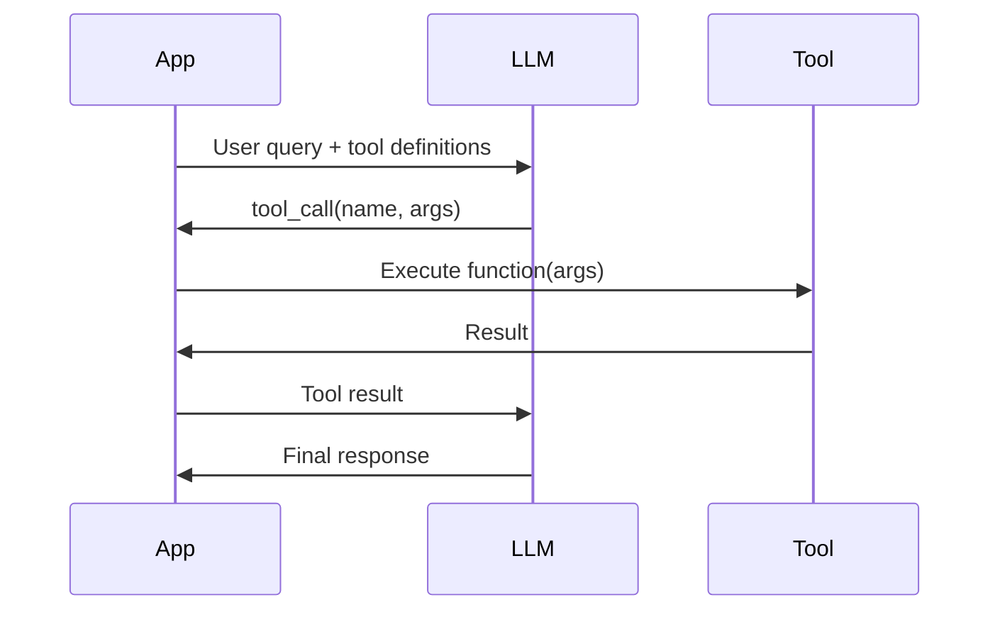

## Learning Objectives

- Implement OpenAI function calling with proper tool definitions and schemas
- Handle parallel tool calls and sequential tool execution
- Design robust error handling and retry strategies for tool calls
- Use structured outputs to enforce type-safe responses from LLMs
- Build composable tool registries for production agent systems

## Prerequisites

- Understanding of LLM agents and the tool-use paradigm
- Familiarity with JSON Schema
- Experience with Python type hints and Pydantic

## Core Concepts

### How Function Calling Works

Function calling allows LLMs to generate structured arguments for predefined functions instead of free-form text. The model doesn't execute the function — it produces the function name and arguments, and your code handles execution.



### Defining Tools with JSON Schema

```python
from openai import OpenAI

client = OpenAI()

tools = [
    {
        "type": "function",
        "function": {
            "name": "get_weather",
            "description": "Get the current weather for a location. "
                           "Use this when the user asks about weather conditions.",
            "parameters": {
                "type": "object",
                "properties": {
                    "location": {
                        "type": "string",
                        "description": "City and state/country, e.g., 'San Francisco, CA'"
                    },
                    "unit": {
                        "type": "string",
                        "enum": ["celsius", "fahrenheit"],
                        "description": "Temperature unit"
                    }
                },
                "required": ["location"],
                "additionalProperties": False
            },
            "strict": True
        }
    },
    {
        "type": "function",
        "function": {
            "name": "search_products",
            "description": "Search the product catalog by query, category, and price range.",
            "parameters": {
                "type": "object",
                "properties": {
                    "query": {
                        "type": "string",
                        "description": "Search keywords"
                    },
                    "category": {
                        "type": "string",
                        "enum": ["electronics", "clothing", "books", "home", "sports"]
                    },
                    "max_price": {
                        "type": "number",
                        "description": "Maximum price in USD"
                    },
                    "in_stock_only": {
                        "type": "boolean",
                        "description": "Only return in-stock items"
                    }
                },
                "required": ["query"],
                "additionalProperties": False
            },
            "strict": True
        }
    }
]
```

### Complete Function Calling Loop

```python
import json
from typing import Any

# Tool implementations
def get_weather(location: str, unit: str = "celsius") -> dict:
    # In production, call a real weather API
    return {
        "location": location,
        "temperature": 22 if unit == "celsius" else 72,
        "unit": unit,
        "conditions": "partly cloudy",
        "humidity": 65
    }

def search_products(
    query: str, 
    category: str | None = None, 
    max_price: float | None = None,
    in_stock_only: bool = True
) -> list[dict]:
    return [
        {"name": f"Product matching '{query}'", "price": 29.99, "in_stock": True},
        {"name": f"Premium {query}", "price": 59.99, "in_stock": True},
    ]

TOOL_REGISTRY: dict[str, callable] = {
    "get_weather": get_weather,
    "search_products": search_products,
}

def process_with_tools(user_message: str) -> str:
    """Complete function calling loop with tool execution."""
    messages = [
        {
            "role": "system",
            "content": "You are a helpful assistant with access to weather and product search tools."
        },
        {"role": "user", "content": user_message}
    ]
    
    response = client.chat.completions.create(
        model="gpt-4o",
        messages=messages,
        tools=tools,
    )
    
    message = response.choices[0].message
    
    if not message.tool_calls:
        return message.content
    
    messages.append(message.model_dump())
    
    for tool_call in message.tool_calls:
        func_name = tool_call.function.name
        func_args = json.loads(tool_call.function.arguments)
        
        if func_name in TOOL_REGISTRY:
            try:
                result = TOOL_REGISTRY[func_name](**func_args)
                result_str = json.dumps(result)
            except Exception as e:
                result_str = json.dumps({"error": str(e)})
        else:
            result_str = json.dumps({"error": f"Unknown tool: {func_name}"})
        
        messages.append({
            "role": "tool",
            "tool_call_id": tool_call.id,
            "content": result_str,
        })
    
    final_response = client.chat.completions.create(
        model="gpt-4o",
        messages=messages,
        tools=tools,
    )
    
    return final_response.choices[0].message.content
```

### Parallel Tool Calls

GPT-4o can request multiple tool calls in a single response when the calls are independent. Your code must handle all of them before continuing.

```python
import asyncio
import aiohttp

async def execute_tools_parallel(tool_calls: list) -> list[dict]:
    """Execute multiple tool calls concurrently."""
    
    async def execute_single(tool_call) -> dict:
        func_name = tool_call.function.name
        func_args = json.loads(tool_call.function.arguments)
        
        try:
            if asyncio.iscoroutinefunction(TOOL_REGISTRY.get(func_name)):
                result = await TOOL_REGISTRY[func_name](**func_args)
            else:
                loop = asyncio.get_event_loop()
                result = await loop.run_in_executor(
                    None, lambda: TOOL_REGISTRY[func_name](**func_args)
                )
            return {"tool_call_id": tool_call.id, "content": json.dumps(result)}
        except Exception as e:
            return {"tool_call_id": tool_call.id, "content": json.dumps({"error": str(e)})}
    
    results = await asyncio.gather(
        *[execute_single(tc) for tc in tool_calls]
    )
    return results

async def agent_loop_async(user_message: str, max_iterations: int = 5) -> str:
    """Async agent loop with parallel tool execution."""
    messages = [
        {"role": "system", "content": "You are a helpful assistant."},
        {"role": "user", "content": user_message}
    ]
    
    for _ in range(max_iterations):
        response = client.chat.completions.create(
            model="gpt-4o",
            messages=messages,
            tools=tools,
            parallel_tool_calls=True,
        )
        
        message = response.choices[0].message
        messages.append(message.model_dump())
        
        if not message.tool_calls:
            return message.content
        
        results = await execute_tools_parallel(message.tool_calls)
        
        for result in results:
            messages.append({"role": "tool", **result})
    
    return "Max iterations reached."
```

### Robust Error Handling

```python
from dataclasses import dataclass
from enum import Enum

class ToolErrorType(Enum):
    TIMEOUT = "timeout"
    INVALID_ARGS = "invalid_arguments"
    RATE_LIMIT = "rate_limit"
    NOT_FOUND = "not_found"
    INTERNAL = "internal_error"

@dataclass
class ToolResult:
    success: bool
    data: Any = None
    error: str | None = None
    error_type: ToolErrorType | None = None
    retryable: bool = False

def execute_with_retry(
    func_name: str, 
    func_args: dict, 
    max_retries: int = 3,
    timeout: float = 30.0
) -> ToolResult:
    """Execute a tool call with retry logic and timeout."""
    import time
    
    if func_name not in TOOL_REGISTRY:
        return ToolResult(
            success=False,
            error=f"Unknown tool: {func_name}",
            error_type=ToolErrorType.NOT_FOUND
        )
    
    for attempt in range(max_retries):
        try:
            import signal
            
            def timeout_handler(signum, frame):
                raise TimeoutError(f"Tool execution exceeded {timeout}s")
            
            result = TOOL_REGISTRY[func_name](**func_args)
            return ToolResult(success=True, data=result)
            
        except TimeoutError:
            if attempt < max_retries - 1:
                time.sleep(2 ** attempt)
                continue
            return ToolResult(
                success=False,
                error=f"Timed out after {timeout}s",
                error_type=ToolErrorType.TIMEOUT,
                retryable=True
            )
        except TypeError as e:
            return ToolResult(
                success=False,
                error=f"Invalid arguments: {e}",
                error_type=ToolErrorType.INVALID_ARGS,
                retryable=False
            )
        except Exception as e:
            if attempt < max_retries - 1:
                time.sleep(2 ** attempt)
                continue
            return ToolResult(
                success=False,
                error=str(e),
                error_type=ToolErrorType.INTERNAL,
                retryable=True
            )
    
    return ToolResult(success=False, error="Max retries exceeded")
```

### Building a Tool Registry with Pydantic

```python
from pydantic import BaseModel, Field
from typing import Callable, get_type_hints
import inspect

class ToolRegistry:
    """Auto-generate tool schemas from Python functions with type hints."""
    
    def __init__(self):
        self.tools: dict[str, Callable] = {}
        self.schemas: list[dict] = []
    
    def register(self, func: Callable) -> Callable:
        """Decorator to register a function as a tool."""
        hints = get_type_hints(func)
        sig = inspect.signature(func)
        
        properties = {}
        required = []
        
        for name, param in sig.parameters.items():
            if name == "return":
                continue
            
            hint = hints.get(name, str)
            prop = {"description": ""}
            
            if hint == str:
                prop["type"] = "string"
            elif hint == int:
                prop["type"] = "integer"
            elif hint == float:
                prop["type"] = "number"
            elif hint == bool:
                prop["type"] = "boolean"
            else:
                prop["type"] = "string"
            
            # Extract description from docstring
            doc = inspect.getdoc(func) or ""
            for line in doc.split("\n"):
                if name in line and ":" in line:
                    prop["description"] = line.split(":", 1)[1].strip()
                    break
            
            properties[name] = prop
            
            if param.default is inspect.Parameter.empty:
                required.append(name)
        
        schema = {
            "type": "function",
            "function": {
                "name": func.__name__,
                "description": (inspect.getdoc(func) or "").split("\n")[0],
                "parameters": {
                    "type": "object",
                    "properties": properties,
                    "required": required,
                }
            }
        }
        
        self.tools[func.__name__] = func
        self.schemas.append(schema)
        
        return func

registry = ToolRegistry()

@registry.register
def calculate_mortgage(
    principal: float, 
    annual_rate: float, 
    years: int
) -> dict:
    """Calculate monthly mortgage payment.
    
    principal: Loan amount in USD
    annual_rate: Annual interest rate as a percentage (e.g., 6.5)
    years: Loan term in years
    """
    monthly_rate = annual_rate / 100 / 12
    n_payments = years * 12
    
    if monthly_rate == 0:
        monthly_payment = principal / n_payments
    else:
        monthly_payment = principal * (
            monthly_rate * (1 + monthly_rate) ** n_payments
        ) / ((1 + monthly_rate) ** n_payments - 1)
    
    total_paid = monthly_payment * n_payments
    
    return {
        "monthly_payment": round(monthly_payment, 2),
        "total_paid": round(total_paid, 2),
        "total_interest": round(total_paid - principal, 2),
    }
```

### Forced Tool Use and Tool Choice

```python
# Force the model to use a specific tool
response = client.chat.completions.create(
    model="gpt-4o",
    messages=messages,
    tools=tools,
    tool_choice={"type": "function", "function": {"name": "get_weather"}}
)

# Force the model to NOT use any tools
response = client.chat.completions.create(
    model="gpt-4o",
    messages=messages,
    tools=tools,
    tool_choice="none"
)

# Let the model decide (default)
response = client.chat.completions.create(
    model="gpt-4o",
    messages=messages,
    tools=tools,
    tool_choice="auto"
)
```

## Hands-On Exercises

### Exercise 1: Multi-Tool Agent

Build a function-calling agent with at least 5 tools (e.g., calculator, web search, file reader, database query, email sender). Test it with queries that require multiple sequential tool calls.

### Exercise 2: Error Recovery

Create a scenario where a tool call fails (API timeout, invalid response). Implement retry logic with exponential backoff and fallback strategies. Test that the agent gracefully handles failures.

### Exercise 3: Auto-Schema Generation

Extend the `ToolRegistry` to generate schemas from Pydantic models. Register 3 tools using `BaseModel` parameter types and verify the schemas are valid.

## Key Takeaways

- **Function calling is the bridge between LLMs and the real world** — It enables structured, type-safe interactions with external systems.
- **Always handle errors** — Tools fail. Build retry logic, timeouts, and fallback strategies into every tool call.
- **Parallel tool calls improve latency** — When the model requests independent tools, execute them concurrently.
- **Schema design matters** — Clear descriptions, proper types, and meaningful enums help the model select the right tool with correct arguments.
- **Build tool registries, not individual tools** — A composable registry pattern makes it easy to add, remove, and version tools.

## External Resources

- [OpenAI Function Calling Guide](https://platform.openai.com/docs/guides/function-calling) — Official documentation
- [Anthropic Tool Use Guide](https://docs.anthropic.com/en/docs/build-with-claude/tool-use/overview) — Claude's tool use implementation
- [JSON Schema Reference](https://json-schema.org/understanding-json-schema/) — Schema specification
- [Pydantic Documentation](https://docs.pydantic.dev/) — Type-safe Python models
- [OpenAI Cookbook: Function Calling](https://cookbook.openai.com/examples/how_to_call_functions_with_chat_models) — Practical examples
