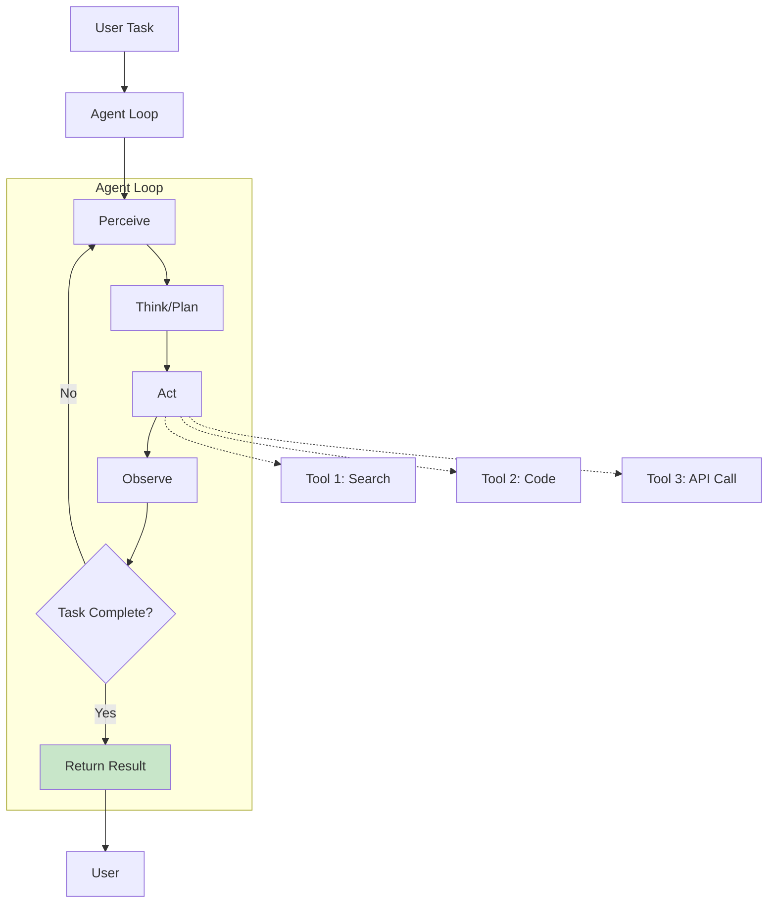
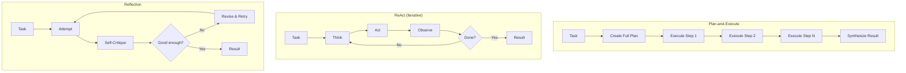

## Learning Objectives

- Understand the core architecture of LLM agents: planning, reasoning, memory, and tool use
- Implement agent loops from scratch using the ReAct pattern
- Design memory systems (short-term, long-term, episodic) for persistent agents
- Build agents using LangChain and LangGraph frameworks
- Diagnose and fix common agent failure modes (loops, hallucinated tools, task drift)

## Prerequisites

- Experience with advanced prompting techniques (CoT, ReAct)
- Familiarity with Python async programming
- Understanding of API integration patterns

## Core Concepts

### What is an LLM Agent?

An LLM agent is a system where a language model autonomously decides what actions to take, observes the results, and iterates until a task is complete. Unlike a simple prompt-response pair, agents operate in a loop.



**Agent vs. Chain vs. Prompt:**

| Approach | Decision Making | # LLM Calls | Autonomy |
|----------|----------------|-------------|----------|
| **Single prompt** | None | 1 | None |
| **Prompt chain** | Pre-defined sequence | Fixed (2-5) | Low |
| **Agent** | Dynamic, model decides | Variable (1-50+) | High |

### Building an Agent from Scratch

Let's build a minimal but complete agent without any frameworks.

```python
from openai import OpenAI
from dataclasses import dataclass, field
from typing import Callable
import json

client = OpenAI()

@dataclass
class Tool:
    name: str
    description: str
    parameters: dict
    function: Callable

@dataclass
class AgentState:
    messages: list[dict] = field(default_factory=list)
    tool_results: list[dict] = field(default_factory=list)
    steps: int = 0
    max_steps: int = 10

class SimpleAgent:
    """A minimal agent implementation from scratch."""
    
    def __init__(self, system_prompt: str, tools: list[Tool], model: str = "gpt-4o"):
        self.system_prompt = system_prompt
        self.tools = {t.name: t for t in tools}
        self.model = model
    
    def _build_tool_schemas(self) -> list[dict]:
        return [
            {
                "type": "function",
                "function": {
                    "name": tool.name,
                    "description": tool.description,
                    "parameters": tool.parameters,
                }
            }
            for tool in self.tools.values()
        ]
    
    def run(self, user_message: str) -> str:
        """Execute the agent loop."""
        state = AgentState()
        state.messages = [
            {"role": "system", "content": self.system_prompt},
            {"role": "user", "content": user_message},
        ]
        
        while state.steps < state.max_steps:
            state.steps += 1
            
            response = client.chat.completions.create(
                model=self.model,
                messages=state.messages,
                tools=self._build_tool_schemas() if self.tools else None,
                tool_choice="auto",
            )
            
            message = response.choices[0].message
            state.messages.append(message.model_dump())
            
            if not message.tool_calls:
                return message.content
            
            for tool_call in message.tool_calls:
                tool_name = tool_call.function.name
                tool_args = json.loads(tool_call.function.arguments)
                
                if tool_name not in self.tools:
                    result = f"Error: Unknown tool '{tool_name}'"
                else:
                    try:
                        result = self.tools[tool_name].function(**tool_args)
                    except Exception as e:
                        result = f"Error: {str(e)}"
                
                state.messages.append({
                    "role": "tool",
                    "tool_call_id": tool_call.id,
                    "content": str(result),
                })
        
        return "Agent reached maximum steps without completing the task."
```

### Defining Tools

```python
import subprocess
import requests

def web_search(query: str) -> str:
    """Search the web and return results."""
    # In production, use a real search API (Brave, Serper, etc.)
    response = requests.get(
        "https://api.search-provider.com/search",
        params={"q": query, "count": 5}
    )
    results = response.json().get("results", [])
    return "\n".join(f"- {r['title']}: {r['snippet']}" for r in results)

def run_python(code: str) -> str:
    """Execute Python code in a sandboxed environment."""
    try:
        result = subprocess.run(
            ["python3", "-c", code],
            capture_output=True,
            text=True,
            timeout=30,
        )
        output = result.stdout
        if result.returncode != 0:
            output += f"\nSTDERR: {result.stderr}"
        return output or "(no output)"
    except subprocess.TimeoutExpired:
        return "Error: Code execution timed out (30s limit)"

def read_file(filepath: str) -> str:
    """Read a file from the filesystem."""
    try:
        with open(filepath) as f:
            return f.read()[:5000]
    except FileNotFoundError:
        return f"Error: File '{filepath}' not found"

tools = [
    Tool(
        name="web_search",
        description="Search the web for current information",
        parameters={
            "type": "object",
            "properties": {"query": {"type": "string", "description": "Search query"}},
            "required": ["query"]
        },
        function=web_search
    ),
    Tool(
        name="run_python",
        description="Execute Python code and return the output",
        parameters={
            "type": "object",
            "properties": {"code": {"type": "string", "description": "Python code to execute"}},
            "required": ["code"]
        },
        function=run_python
    ),
    Tool(
        name="read_file",
        description="Read the contents of a file",
        parameters={
            "type": "object",
            "properties": {"filepath": {"type": "string", "description": "Path to the file"}},
            "required": ["filepath"]
        },
        function=read_file
    ),
]

agent = SimpleAgent(
    system_prompt=(
        "You are a helpful research assistant. Use tools to gather information "
        "and answer questions accurately. Always verify claims with evidence."
    ),
    tools=tools
)

result = agent.run("What is the current population of Tokyo and how does it compare to New York?")
print(result)
```

### Memory Systems

Agents need memory to maintain context across interactions and learn from past experiences.

```python
from datetime import datetime
import numpy as np

class ShortTermMemory:
    """Sliding window of recent conversation turns."""
    
    def __init__(self, max_turns: int = 20):
        self.max_turns = max_turns
        self.messages: list[dict] = []
    
    def add(self, message: dict):
        self.messages.append(message)
        if len(self.messages) > self.max_turns * 2:
            self.messages = self.messages[-self.max_turns * 2:]
    
    def get_context(self) -> list[dict]:
        return self.messages.copy()

class LongTermMemory:
    """Persistent vector-based memory for important facts and experiences."""
    
    def __init__(self):
        self.memories: list[dict] = []
        self.embeddings: list[np.ndarray] = []
    
    def store(self, content: str, metadata: dict | None = None):
        embedding = get_embedding(content)
        self.memories.append({
            "content": content,
            "metadata": metadata or {},
            "timestamp": datetime.now().isoformat(),
        })
        self.embeddings.append(embedding)
    
    def recall(self, query: str, top_k: int = 5) -> list[dict]:
        if not self.memories:
            return []
        
        query_emb = get_embedding(query)
        similarities = [
            np.dot(query_emb, emb) / (np.linalg.norm(query_emb) * np.linalg.norm(emb))
            for emb in self.embeddings
        ]
        
        top_indices = np.argsort(similarities)[::-1][:top_k]
        return [self.memories[i] for i in top_indices]

class EpisodicMemory:
    """Stores summaries of past task executions for learning."""
    
    def __init__(self):
        self.episodes: list[dict] = []
    
    def record_episode(self, task: str, steps: list[str], outcome: str, success: bool):
        self.episodes.append({
            "task": task,
            "steps": steps,
            "outcome": outcome,
            "success": success,
            "timestamp": datetime.now().isoformat(),
        })
    
    def get_relevant_episodes(self, task: str, top_k: int = 3) -> list[dict]:
        # Simple keyword matching; use embeddings in production
        scored = []
        task_words = set(task.lower().split())
        for ep in self.episodes:
            ep_words = set(ep["task"].lower().split())
            overlap = len(task_words & ep_words) / len(task_words | ep_words)
            scored.append((overlap, ep))
        
        scored.sort(key=lambda x: -x[0])
        return [ep for _, ep in scored[:top_k]]
```

### Agent Planning Strategies



```python
class PlanAndExecuteAgent:
    """Agent that creates a plan first, then executes each step."""
    
    def __init__(self, tools: list[Tool], model: str = "gpt-4o"):
        self.tools = tools
        self.model = model
    
    def create_plan(self, task: str) -> list[str]:
        response = client.chat.completions.create(
            model=self.model,
            messages=[
                {
                    "role": "system",
                    "content": (
                        "Create a numbered step-by-step plan to accomplish this task. "
                        "Each step should be a single, concrete action. "
                        "Return ONLY the numbered list, nothing else."
                    )
                },
                {"role": "user", "content": task}
            ],
            temperature=0
        )
        
        plan_text = response.choices[0].message.content
        steps = [
            line.strip().lstrip("0123456789.)")
            for line in plan_text.strip().split("\n")
            if line.strip()
        ]
        return steps
    
    def execute_plan(self, task: str) -> str:
        steps = self.create_plan(task)
        print(f"Plan ({len(steps)} steps):")
        for i, step in enumerate(steps, 1):
            print(f"  {i}. {step}")
        
        results = []
        for step in steps:
            result = self._execute_step(step, results)
            results.append({"step": step, "result": result})
        
        return self._synthesize(task, results)
    
    def _execute_step(self, step: str, prior_results: list[dict]) -> str:
        context = "\n".join(
            f"Step: {r['step']}\nResult: {r['result']}" 
            for r in prior_results[-3:]
        )
        
        inner_agent = SimpleAgent(
            system_prompt=f"Execute this step. Prior context:\n{context}",
            tools=self.tools
        )
        return inner_agent.run(step)
    
    def _synthesize(self, task: str, results: list[dict]) -> str:
        all_results = "\n\n".join(
            f"## Step: {r['step']}\n{r['result']}" for r in results
        )
        
        response = client.chat.completions.create(
            model=self.model,
            messages=[
                {
                    "role": "system",
                    "content": "Synthesize the results of all steps into a final, comprehensive answer."
                },
                {
                    "role": "user",
                    "content": f"Original task: {task}\n\nResults:\n{all_results}"
                }
            ],
            temperature=0
        )
        return response.choices[0].message.content
```

### Common Agent Failure Modes

| Failure | Symptom | Fix |
|---------|---------|-----|
| **Infinite loop** | Agent repeats the same tool call | Add step counter, detect repeated actions |
| **Hallucinated tools** | Agent invents tool names | Use strict tool schemas, validate before execution |
| **Task drift** | Agent wanders from the original goal | Include the original task in every iteration |
| **Over-planning** | Agent plans extensively but never acts | Set max planning steps, force action after N thoughts |
| **Error cascading** | One failed tool call derails everything | Implement retry logic, fallback strategies |

## Hands-On Exercises

### Exercise 1: Research Agent

Build an agent with web search and code execution tools that can research a topic and produce a structured report. Test it with: "Compare the performance of Python, Rust, and Go for web API development."

### Exercise 2: Memory-Enhanced Agent

Implement an agent with both short-term and long-term memory. Have a multi-turn conversation where the agent needs to recall facts from earlier in the conversation and from previous sessions.

### Exercise 3: Plan-and-Execute Pipeline

Build a plan-and-execute agent that breaks down complex tasks. Test with: "Analyze the top 5 Python web frameworks by GitHub stars, recent commit activity, and community size. Create a comparison table."

## Key Takeaways

- **Agents are loops, not prompts** — The core innovation is the think-act-observe cycle that enables autonomous problem solving.
- **Tool design is critical** — Well-defined, focused tools with clear descriptions enable the agent to use them correctly.
- **Memory makes agents useful** — Short-term context, long-term knowledge, and episodic learning transform agents from demos to products.
- **Planning reduces errors** — Creating a plan before execution leads to more systematic and reliable results.
- **Guardrails prevent runaway agents** — Always set step limits, implement timeouts, and monitor for loops and drift.

## External Resources

- [Yao et al. — ReAct (2023)](https://arxiv.org/abs/2210.03629) — Reasoning + Acting framework
- [Shinn et al. — Reflexion (2023)](https://arxiv.org/abs/2303.11366) — Self-reflection for agents
- [LangChain Agents Documentation](https://python.langchain.com/docs/concepts/agents/) — Framework guide
- [LangGraph Documentation](https://langchain-ai.github.io/langgraph/) — Stateful agent graphs
- [Anthropic: Building Effective Agents](https://www.anthropic.com/engineering/building-effective-agents) — Design patterns
