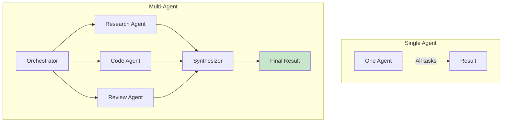
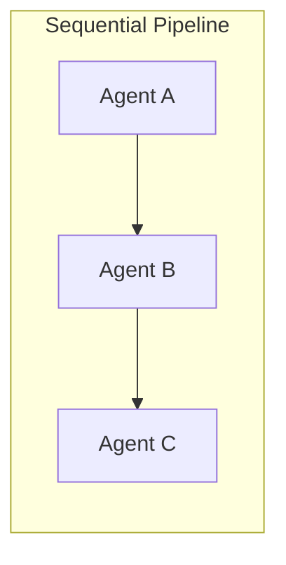
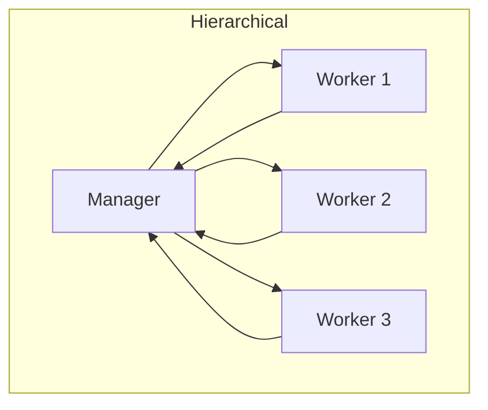
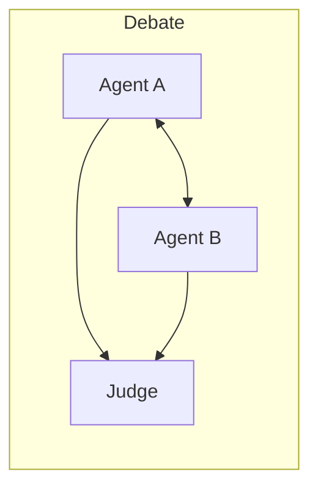

## Learning Objectives

- Design multi-agent architectures with specialized roles and communication protocols
- Implement agent orchestration patterns: sequential, parallel, hierarchical, and debate
- Build multi-agent systems using CrewAI and AutoGen frameworks
- Design human-in-the-loop workflows for critical decision points
- Handle inter-agent state management, conflict resolution, and error recovery

## Prerequisites

- Strong understanding of single-agent architecture and tool use
- Experience with function calling and agent loops
- Familiarity with Python async programming

## Core Concepts

### Why Multi-Agent Systems?

Single agents struggle with complex tasks that require diverse expertise, long planning horizons, or quality assurance. Multi-agent systems decompose work across specialized agents, each with focused capabilities and knowledge.



### Orchestration Patterns







### Building a Multi-Agent System from Scratch

```python
from openai import OpenAI
from dataclasses import dataclass, field
from enum import Enum
import json

client = OpenAI()

class AgentRole(Enum):
    RESEARCHER = "researcher"
    WRITER = "writer"
    REVIEWER = "reviewer"
    ORCHESTRATOR = "orchestrator"

@dataclass
class AgentMessage:
    sender: str
    recipient: str
    content: str
    message_type: str = "task"  # task, result, feedback, question

@dataclass
class Agent:
    name: str
    role: AgentRole
    system_prompt: str
    model: str = "gpt-4o"
    
    def process(self, messages: list[AgentMessage]) -> str:
        formatted = [{"role": "system", "content": self.system_prompt}]
        for msg in messages:
            role = "user" if msg.sender != self.name else "assistant"
            formatted.append({
                "role": role,
                "content": f"[From: {msg.sender}] {msg.content}"
            })
        
        response = client.chat.completions.create(
            model=self.model,
            messages=formatted,
            temperature=0.3
        )
        return response.choices[0].message.content

class MultiAgentOrchestrator:
    """Orchestrate multiple agents to complete complex tasks."""
    
    def __init__(self):
        self.agents: dict[str, Agent] = {}
        self.message_history: list[AgentMessage] = []
    
    def register_agent(self, agent: Agent):
        self.agents[agent.name] = agent
    
    def send_message(
        self, sender: str, recipient: str, content: str, msg_type: str = "task"
    ) -> str:
        msg = AgentMessage(
            sender=sender,
            recipient=recipient,
            content=content,
            message_type=msg_type
        )
        self.message_history.append(msg)
        
        agent = self.agents[recipient]
        relevant_msgs = [
            m for m in self.message_history 
            if m.recipient == recipient or m.sender == recipient
        ]
        
        response = agent.process(relevant_msgs)
        
        reply = AgentMessage(
            sender=recipient,
            recipient=sender,
            content=response,
            message_type="result"
        )
        self.message_history.append(reply)
        
        return response
    
    def run_sequential_pipeline(self, task: str, agent_sequence: list[str]) -> str:
        """Run agents in sequence, each building on the previous output."""
        current_input = task
        
        for agent_name in agent_sequence:
            print(f"\n→ {agent_name} processing...")
            current_input = self.send_message(
                sender="orchestrator",
                recipient=agent_name,
                content=current_input
            )
            print(f"  Output: {current_input[:200]}...")
        
        return current_input
    
    def run_debate(
        self, 
        task: str, 
        debater_a: str, 
        debater_b: str, 
        judge: str, 
        rounds: int = 2
    ) -> str:
        """Two agents debate, a judge decides."""
        response_a = self.send_message("orchestrator", debater_a, task)
        response_b = self.send_message("orchestrator", debater_b, task)
        
        for round_num in range(rounds):
            critique_a = self.send_message(
                debater_b, debater_a,
                f"My colleague's position:\n{response_b}\n\n"
                f"Please critique and refine your position."
            )
            
            critique_b = self.send_message(
                debater_a, debater_b,
                f"My colleague's position:\n{response_a}\n\n"
                f"Please critique and refine your position."
            )
            
            response_a, response_b = critique_a, critique_b
        
        verdict = self.send_message(
            "orchestrator", judge,
            f"Task: {task}\n\n"
            f"Position A ({debater_a}):\n{response_a}\n\n"
            f"Position B ({debater_b}):\n{response_b}\n\n"
            f"Synthesize the best answer from both positions."
        )
        
        return verdict

# Create specialized agents
orchestrator = MultiAgentOrchestrator()

orchestrator.register_agent(Agent(
    name="researcher",
    role=AgentRole.RESEARCHER,
    system_prompt=(
        "You are a research specialist. Given a topic, provide comprehensive, "
        "well-sourced analysis. Focus on facts, data, and evidence. "
        "Structure your findings clearly with headers."
    )
))

orchestrator.register_agent(Agent(
    name="writer",
    role=AgentRole.WRITER,
    system_prompt=(
        "You are a technical writer. Take research findings and transform them "
        "into clear, engaging, well-structured content. Add examples and analogies."
    )
))

orchestrator.register_agent(Agent(
    name="reviewer",
    role=AgentRole.REVIEWER,
    system_prompt=(
        "You are a meticulous editor and fact-checker. Review content for "
        "accuracy, clarity, completeness, and logical coherence. "
        "List specific issues and suggest concrete improvements."
    )
))
```

### CrewAI: Declarative Multi-Agent Framework

CrewAI provides a high-level API for defining agents, tasks, and workflows.

```python
from crewai import Agent, Task, Crew, Process

research_agent = Agent(
    role="Senior Research Analyst",
    goal="Produce thorough, accurate research on any given topic",
    backstory=(
        "You are a veteran research analyst with 15 years of experience "
        "in technology and business analysis. You are known for your "
        "meticulous attention to detail and ability to find non-obvious insights."
    ),
    verbose=True,
    allow_delegation=False,
)

writer_agent = Agent(
    role="Technical Content Writer",
    goal="Transform research into clear, engaging technical content",
    backstory=(
        "You are an award-winning technical writer who specializes in "
        "making complex topics accessible. Your writing is concise, "
        "well-structured, and always includes practical examples."
    ),
    verbose=True,
    allow_delegation=False,
)

editor_agent = Agent(
    role="Senior Editor",
    goal="Ensure content is accurate, well-structured, and publication-ready",
    backstory=(
        "You are a senior editor with expertise in technical content. "
        "You catch factual errors, improve clarity, and ensure consistency."
    ),
    verbose=True,
    allow_delegation=True,
)

# Define tasks
research_task = Task(
    description=(
        "Research the current state of LLM deployment in production. "
        "Cover: popular frameworks (vLLM, TGI, Ollama), "
        "quantization methods, cost optimization strategies. "
        "Include specific metrics and comparisons."
    ),
    expected_output="A detailed research report with data and sources",
    agent=research_agent,
)

writing_task = Task(
    description=(
        "Based on the research, write a comprehensive guide titled "
        "'Deploying LLMs in Production: A Practical Guide'. "
        "Include code examples and architecture diagrams."
    ),
    expected_output="A 2000-word technical guide with code examples",
    agent=writer_agent,
)

editing_task = Task(
    description=(
        "Review the guide for technical accuracy, clarity, and completeness. "
        "Fix any errors, improve structure, and ensure it's ready for publication."
    ),
    expected_output="The final, polished version of the guide",
    agent=editor_agent,
)

crew = Crew(
    agents=[research_agent, writer_agent, editor_agent],
    tasks=[research_task, writing_task, editing_task],
    process=Process.sequential,
    verbose=True,
)

result = crew.kickoff()
print(result)
```

### Human-in-the-Loop Patterns

Production multi-agent systems need human oversight at critical decision points.

```python
from typing import Literal

@dataclass
class HumanReviewPoint:
    stage: str
    content: str
    agent_name: str
    options: list[str]
    
class HumanInTheLoopOrchestrator(MultiAgentOrchestrator):
    """Multi-agent system with human approval gates."""
    
    def __init__(self, review_callback=None):
        super().__init__()
        self.review_callback = review_callback or self._default_review
    
    def _default_review(self, review_point: HumanReviewPoint) -> str:
        print(f"\n{'='*60}")
        print(f"HUMAN REVIEW REQUIRED at stage: {review_point.stage}")
        print(f"Agent: {review_point.agent_name}")
        print(f"Content:\n{review_point.content[:500]}...")
        print(f"Options: {review_point.options}")
        print(f"{'='*60}")
        
        while True:
            choice = input("Your decision: ").strip()
            if choice in review_point.options:
                return choice
            print(f"Invalid choice. Options: {review_point.options}")
    
    def run_with_approval(
        self, 
        task: str, 
        pipeline: list[tuple[str, bool]]  # (agent_name, needs_review)
    ) -> str:
        current_input = task
        
        for agent_name, needs_review in pipeline:
            result = self.send_message(
                "orchestrator", agent_name, current_input
            )
            
            if needs_review:
                decision = self.review_callback(HumanReviewPoint(
                    stage=agent_name,
                    content=result,
                    agent_name=agent_name,
                    options=["approve", "reject", "revise"]
                ))
                
                if decision == "reject":
                    return "Pipeline terminated by human reviewer."
                elif decision == "revise":
                    revision_note = input("Revision instructions: ")
                    result = self.send_message(
                        "orchestrator", agent_name,
                        f"Please revise based on this feedback:\n{revision_note}\n\n"
                        f"Original output:\n{result}"
                    )
            
            current_input = result
        
        return current_input

# Usage
hitl = HumanInTheLoopOrchestrator()
hitl.register_agent(orchestrator.agents["researcher"])
hitl.register_agent(orchestrator.agents["writer"])
hitl.register_agent(orchestrator.agents["reviewer"])

result = hitl.run_with_approval(
    "Write a blog post about vector databases",
    [
        ("researcher", False),       # research runs unsupervised
        ("writer", True),            # human reviews the draft
        ("reviewer", False),         # editing is automated
    ]
)
```

### Inter-Agent Communication Protocols

```python
from pydantic import BaseModel

class TaskHandoff(BaseModel):
    """Structured format for passing work between agents."""
    task_id: str
    from_agent: str
    to_agent: str
    task_description: str
    context: str
    artifacts: list[str] = []
    priority: Literal["low", "medium", "high", "critical"] = "medium"
    constraints: list[str] = []
    deadline_hint: str | None = None

class TaskResult(BaseModel):
    """Structured format for returning completed work."""
    task_id: str
    agent: str
    status: Literal["completed", "partial", "failed", "needs_input"]
    output: str
    confidence: float  # 0-1
    issues: list[str] = []
    suggestions: list[str] = []
```

## Hands-On Exercises

### Exercise 1: Content Creation Crew

Build a 3-agent system (researcher, writer, editor) that produces a blog post on any given topic. Implement the sequential pipeline and evaluate the final output quality compared to a single-agent approach.

### Exercise 2: Debate Architecture

Implement a debate system where two agents argue opposing positions on a technical topic (e.g., "Monolith vs. Microservices"). A judge agent synthesizes the best answer. Test with 3 different topics.

### Exercise 3: Human-in-the-Loop Workflow

Build a multi-agent code generation system with human approval gates:
1. Architect agent designs the solution
2. **Human approves the design**
3. Coder agent implements it
4. Reviewer agent checks for bugs
5. **Human approves the final code**

## Key Takeaways

- **Specialization beats generalization** — Agents with focused roles and clear system prompts outperform a single "do everything" agent.
- **Orchestration pattern matters** — Sequential for pipelines, hierarchical for complex projects, debate for quality-critical decisions.
- **Human-in-the-loop is not optional** — For production systems, human oversight at critical junctions prevents cascading errors.
- **Structured communication reduces errors** — Typed handoff objects between agents prevent misunderstandings and make debugging easier.
- **Start simple, add agents when needed** — Don't build a 10-agent system when 2-3 will do. Each agent adds latency and cost.

## External Resources

- [CrewAI Documentation](https://docs.crewai.com/) — Multi-agent orchestration framework
- [AutoGen Documentation](https://microsoft.github.io/autogen/) — Microsoft's multi-agent framework
- [LangGraph Multi-Agent](https://langchain-ai.github.io/langgraph/concepts/multi_agent/) — Stateful multi-agent graphs
- [Wu et al. — AutoGen (2023)](https://arxiv.org/abs/2308.08155) — Multi-agent conversation framework
- [Anthropic: Multi-Agent Orchestration](https://www.anthropic.com/engineering/building-effective-agents) — Design patterns
