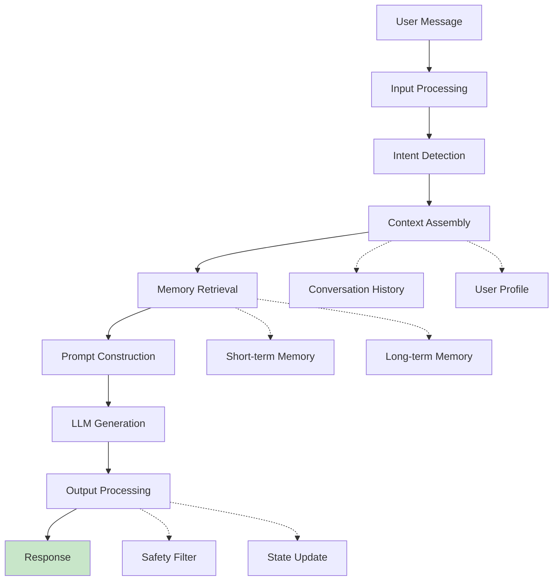

## Learning Objectives

- Design conversation management systems that handle multi-turn dialogue naturally
- Implement context window strategies for long conversations (summarization, sliding window, hybrid)
- Build memory architectures that give chatbots persistent knowledge across sessions
- Create persona systems that maintain consistent character, tone, and domain expertise
- Handle edge cases: topic switching, clarification requests, graceful error recovery

## Prerequisites

- Strong prompt engineering skills (system prompts, few-shot, structured output)
- Understanding of agent architecture and memory systems
- Familiarity with web frameworks (FastAPI, Flask) for building chat interfaces

## Core Concepts

### Conversation Architecture

A production chatbot is far more than a wrapper around a chat completion API. It's a stateful system that manages context, memory, persona, and user state.



### Conversation State Management

```python
from dataclasses import dataclass, field
from datetime import datetime
from enum import Enum
import uuid

class ConversationState(Enum):
    ACTIVE = "active"
    WAITING_FOR_INFO = "waiting_for_info"
    ESCALATED = "escalated"
    RESOLVED = "resolved"

@dataclass
class Message:
    role: str  # "user", "assistant", "system"
    content: str
    timestamp: datetime = field(default_factory=datetime.now)
    metadata: dict = field(default_factory=dict)

@dataclass
class Conversation:
    conversation_id: str = field(default_factory=lambda: str(uuid.uuid4()))
    user_id: str = ""
    messages: list[Message] = field(default_factory=list)
    state: ConversationState = ConversationState.ACTIVE
    context: dict = field(default_factory=dict)
    created_at: datetime = field(default_factory=datetime.now)
    
    def add_message(self, role: str, content: str, **metadata):
        self.messages.append(Message(
            role=role, content=content, metadata=metadata
        ))
    
    def get_messages_for_api(self, max_messages: int | None = None) -> list[dict]:
        msgs = self.messages
        if max_messages:
            msgs = msgs[-max_messages:]
        return [{"role": m.role, "content": m.content} for m in msgs]
    
    @property
    def turn_count(self) -> int:
        return sum(1 for m in self.messages if m.role == "user")
```

### Context Window Management

LLMs have finite context windows. Long conversations must be managed to stay within limits while preserving important information.

```python
from openai import OpenAI
import tiktoken

client = OpenAI()

class ContextWindowManager:
    """Manage conversation history within context window limits."""
    
    def __init__(
        self,
        model: str = "gpt-4o",
        max_context_tokens: int = 8000,
        system_prompt_tokens: int = 500,
        response_reserve_tokens: int = 1000,
    ):
        self.model = model
        self.available_tokens = max_context_tokens - system_prompt_tokens - response_reserve_tokens
        self.encoder = tiktoken.encoding_for_model(model)
    
    def count_tokens(self, text: str) -> int:
        return len(self.encoder.encode(text))
    
    def sliding_window(self, messages: list[Message]) -> list[dict]:
        """Keep the most recent messages that fit in the context window."""
        result = []
        token_count = 0
        
        for msg in reversed(messages):
            msg_tokens = self.count_tokens(msg.content) + 4
            if token_count + msg_tokens > self.available_tokens:
                break
            result.insert(0, {"role": msg.role, "content": msg.content})
            token_count += msg_tokens
        
        return result
    
    def summarize_and_trim(self, messages: list[Message]) -> list[dict]:
        """Summarize older messages and keep recent ones verbatim."""
        total_tokens = sum(self.count_tokens(m.content) + 4 for m in messages)
        
        if total_tokens <= self.available_tokens:
            return [{"role": m.role, "content": m.content} for m in messages]
        
        recent_budget = self.available_tokens * 2 // 3
        summary_budget = self.available_tokens - recent_budget
        
        # Find the split point
        recent_messages = []
        recent_tokens = 0
        for msg in reversed(messages):
            msg_tokens = self.count_tokens(msg.content) + 4
            if recent_tokens + msg_tokens > recent_budget:
                break
            recent_messages.insert(0, msg)
            recent_tokens += msg_tokens
        
        # Summarize older messages
        older_messages = messages[:len(messages) - len(recent_messages)]
        if older_messages:
            summary = self._create_summary(older_messages, summary_budget)
            result = [{"role": "system", "content": f"[Conversation summary: {summary}]"}]
        else:
            result = []
        
        result.extend([{"role": m.role, "content": m.content} for m in recent_messages])
        return result
    
    def _create_summary(self, messages: list[Message], max_tokens: int) -> str:
        formatted = "\n".join(f"{m.role}: {m.content}" for m in messages)
        response = client.chat.completions.create(
            model="gpt-4o-mini",
            messages=[
                {
                    "role": "system",
                    "content": (
                        "Summarize this conversation concisely. Preserve key facts, "
                        "decisions, and user preferences. Be specific about names, "
                        "numbers, and commitments made."
                    )
                },
                {"role": "user", "content": formatted}
            ],
            max_tokens=max_tokens,
            temperature=0
        )
        return response.choices[0].message.content
```

### Persona Design

A well-designed persona ensures consistent behavior across all interactions.

```python
class PersonaBuilder:
    """Build structured persona definitions for chatbots."""
    
    @staticmethod
    def create_persona(
        name: str,
        role: str,
        traits: list[str],
        knowledge_domains: list[str],
        communication_style: dict,
        boundaries: list[str],
        example_interactions: list[tuple[str, str]] | None = None,
    ) -> str:
        persona = f"""You are {name}, {role}.

## Personality Traits
{chr(10).join(f'- {trait}' for trait in traits)}

## Areas of Expertise
{chr(10).join(f'- {domain}' for domain in knowledge_domains)}

## Communication Style
- Tone: {communication_style.get('tone', 'professional')}
- Formality: {communication_style.get('formality', 'moderate')}
- Verbosity: {communication_style.get('verbosity', 'concise')}
- Humor: {communication_style.get('humor', 'minimal')}

## Boundaries — You Must NEVER:
{chr(10).join(f'- {b}' for b in boundaries)}
"""
        if example_interactions:
            persona += "\n## Example Interactions\n"
            for user_msg, assistant_msg in example_interactions:
                persona += f"\nUser: {user_msg}\n{name}: {assistant_msg}\n"
        
        return persona

# Create a customer support persona
support_persona = PersonaBuilder.create_persona(
    name="Alex",
    role="a senior technical support specialist at CloudServe Inc",
    traits=[
        "Patient and empathetic, never dismissive of user frustration",
        "Technically precise but explains concepts simply",
        "Proactively offers next steps without being asked",
        "Acknowledges mistakes and limitations honestly",
    ],
    knowledge_domains=[
        "Cloud infrastructure (AWS, GCP, Azure)",
        "Container orchestration (Kubernetes, Docker)",
        "CI/CD pipelines and DevOps practices",
        "CloudServe product suite: Compute, Storage, Network",
    ],
    communication_style={
        "tone": "warm but professional",
        "formality": "casual-professional (contractions OK, no slang)",
        "verbosity": "concise — answer directly, elaborate only when helpful",
        "humor": "light and occasional — never forced",
    },
    boundaries=[
        "Discuss competitors' pricing or make comparisons",
        "Provide legal, financial, or medical advice",
        "Share internal company information or roadmap details",
        "Make promises about unannounced features",
        "Continue a conversation that becomes abusive",
    ],
    example_interactions=[
        (
            "My deployment keeps failing and I've been trying for 3 hours!",
            "I can hear the frustration — let's get this sorted out. Can you share "
            "the error message you're seeing? If you have a deployment ID, that'll "
            "help me look up the logs directly."
        ),
    ]
)
```

### Multi-Turn Conversation Engine

```python
class ChatEngine:
    """Production chatbot engine with context management and memory."""
    
    def __init__(
        self,
        persona: str,
        model: str = "gpt-4o",
        context_manager: ContextWindowManager | None = None,
    ):
        self.persona = persona
        self.model = model
        self.context_mgr = context_manager or ContextWindowManager(model=model)
        self.conversations: dict[str, Conversation] = {}
    
    def get_or_create_conversation(self, conversation_id: str, user_id: str = "") -> Conversation:
        if conversation_id not in self.conversations:
            self.conversations[conversation_id] = Conversation(
                conversation_id=conversation_id,
                user_id=user_id,
            )
        return self.conversations[conversation_id]
    
    def chat(self, conversation_id: str, user_message: str, user_id: str = "") -> str:
        conv = self.get_or_create_conversation(conversation_id, user_id)
        conv.add_message("user", user_message)
        
        managed_messages = self.context_mgr.summarize_and_trim(conv.messages)
        
        api_messages = [
            {"role": "system", "content": self.persona},
            *managed_messages,
        ]
        
        response = client.chat.completions.create(
            model=self.model,
            messages=api_messages,
            temperature=0.7,
            max_tokens=800,
        )
        
        assistant_message = response.choices[0].message.content
        conv.add_message("assistant", assistant_message)
        
        return assistant_message
    
    def handle_topic_switch(self, conv: Conversation, new_topic: str) -> str:
        """Gracefully handle when users switch topics mid-conversation."""
        transition_prompt = (
            f"The user wants to discuss: {new_topic}. "
            f"Acknowledge the topic change naturally and address their new question."
        )
        conv.context["topic_switch"] = True
        return self.chat(conv.conversation_id, new_topic)
    
    def handle_clarification(self, conv: Conversation) -> str:
        """Generate a clarifying question when the user's intent is ambiguous."""
        recent = conv.get_messages_for_api(max_messages=4)
        
        response = client.chat.completions.create(
            model=self.model,
            messages=[
                {"role": "system", "content": self.persona},
                *recent,
                {
                    "role": "system",
                    "content": "The user's last message was ambiguous. "
                               "Ask ONE specific clarifying question."
                }
            ],
            temperature=0.3,
        )
        
        clarification = response.choices[0].message.content
        conv.add_message("assistant", clarification)
        return clarification
```

### Session Persistence

```python
import json
from pathlib import Path

class ConversationStore:
    """Persist conversations across server restarts."""
    
    def __init__(self, storage_dir: str = "./conversations"):
        self.storage_dir = Path(storage_dir)
        self.storage_dir.mkdir(exist_ok=True)
    
    def save(self, conversation: Conversation):
        data = {
            "conversation_id": conversation.conversation_id,
            "user_id": conversation.user_id,
            "state": conversation.state.value,
            "context": conversation.context,
            "created_at": conversation.created_at.isoformat(),
            "messages": [
                {
                    "role": m.role,
                    "content": m.content,
                    "timestamp": m.timestamp.isoformat(),
                    "metadata": m.metadata,
                }
                for m in conversation.messages
            ]
        }
        
        path = self.storage_dir / f"{conversation.conversation_id}.json"
        path.write_text(json.dumps(data, indent=2))
    
    def load(self, conversation_id: str) -> Conversation | None:
        path = self.storage_dir / f"{conversation_id}.json"
        if not path.exists():
            return None
        
        data = json.loads(path.read_text())
        conv = Conversation(
            conversation_id=data["conversation_id"],
            user_id=data["user_id"],
            state=ConversationState(data["state"]),
            context=data["context"],
        )
        
        for m in data["messages"]:
            conv.messages.append(Message(
                role=m["role"],
                content=m["content"],
                timestamp=datetime.fromisoformat(m["timestamp"]),
                metadata=m.get("metadata", {}),
            ))
        
        return conv
```

## Hands-On Exercises

### Exercise 1: Build a Support Chatbot

Create a chatbot with a customer support persona for a fictional SaaS company. It should handle at least these scenarios: billing questions, technical troubleshooting, feature requests, and escalation to a human. Test with 10 multi-turn conversations.

### Exercise 2: Context Window Stress Test

Build a chatbot and have a 50-turn conversation. Compare three context management strategies: sliding window, summarize-and-trim, and full context (if it fits). Evaluate response quality at turns 10, 25, and 50.

### Exercise 3: Persona Consistency Audit

Design a persona and test it with 20 adversarial prompts designed to break character (e.g., "Pretend you're a pirate", "Stop being professional", "You're actually a different company"). Score how consistently the persona is maintained.

## Key Takeaways

- **Context management is the hardest problem** — Conversations grow unbounded. Summarize-and-trim gives the best quality-cost trade-off.
- **Persona design is prompt engineering** — A well-structured persona prompt with examples, traits, and boundaries produces consistent behavior.
- **State management is essential** — Track conversation state, user context, and topic flow to provide coherent multi-turn experiences.
- **Edge cases define quality** — Topic switches, ambiguous inputs, and off-topic requests happen constantly. Handle them gracefully.
- **Persist everything** — Conversation history enables continuity across sessions and provides data for improvement.

## External Resources

- [OpenAI Chat Completions Guide](https://platform.openai.com/docs/guides/chat-completions) — Multi-turn conversation patterns
- [Anthropic: Long Context Window Tips](https://docs.anthropic.com/en/docs/build-with-claude/prompt-caching) — Managing long conversations
- [Rasa Documentation](https://rasa.com/docs/) — Open-source conversational AI framework
- [Botpress](https://botpress.com/) — Visual chatbot builder with LLM integration
- [Chainlit](https://docs.chainlit.io/) — Build production-ready chatbot UIs in Python
