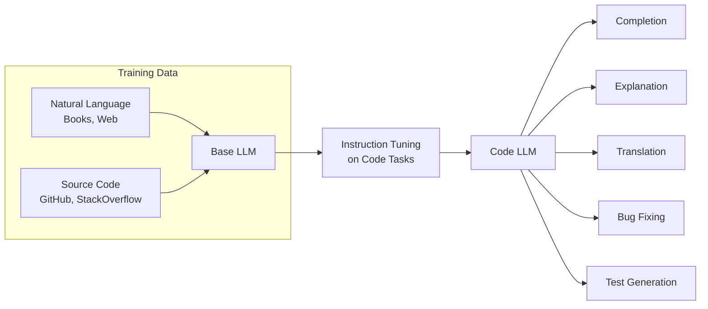

## Learning Objectives

- Understand how code-specialized LLMs (Codex, StarCoder, DeepSeek-Coder) are trained and evaluated
- Build Copilot-style inline code completion systems
- Implement automated code review using LLMs with structured feedback
- Generate unit tests from existing code with coverage-aware prompting
- Create documentation generation pipelines that produce accurate, up-to-date docs

## Prerequisites

- Prompt engineering fundamentals and structured output techniques
- Understanding of function calling and tool use
- Experience writing code in at least one programming language

## Core Concepts

### Code LLMs: How They Differ

Code-specialized LLMs are trained on large corpora of source code alongside natural language. This gives them abilities that general-purpose models lack.



| Model | Parameters | Strengths | License |
|-------|-----------|-----------|---------|
| **GPT-4o** | Unknown | Best overall, multi-language | Proprietary |
| **Claude 3.5 Sonnet** | Unknown | Excellent reasoning, long context | Proprietary |
| **DeepSeek-Coder-V2** | 236B (MoE) | Strong at code, open weights | Open |
| **StarCoder2** | 3B–15B | Permissive license, 600+ languages | Open (BigCode) |
| **CodeLlama** | 7B–70B | Meta's code-specialized Llama | Open (Llama) |
| **Qwen2.5-Coder** | 1.5B–32B | Multi-language, strong benchmarks | Open (Apache) |

### Inline Code Completion

The core of Copilot-style tools: predict the next tokens given the code before (and optionally after) the cursor.

```python
from openai import OpenAI

client = OpenAI()

def complete_code(
    prefix: str,
    suffix: str = "",
    language: str = "python",
    max_tokens: int = 200,
) -> str:
    """Generate code completion given surrounding context."""
    
    prompt = f"""You are a code completion engine. Complete the code between <CURSOR> markers.
Only output the code that goes at the cursor position. No explanations, no markdown.

Language: {language}

```{language}
{prefix}<CURSOR>{suffix}
```"""
    
    response = client.chat.completions.create(
        model="gpt-4o",
        messages=[
            {"role": "system", "content": "You are a code completion engine. Output only code. No markdown fences."},
            {"role": "user", "content": prompt}
        ],
        temperature=0,
        max_tokens=max_tokens,
        stop=["\n\n\n", "```"],
    )
    
    return response.choices[0].message.content.strip()

# Example: Complete a function body
prefix = """def merge_sorted_lists(list1: list[int], list2: list[int]) -> list[int]:
    \"\"\"Merge two sorted lists into one sorted list.\"\"\"
"""
suffix = """

def test_merge():
    assert merge_sorted_lists([1, 3, 5], [2, 4, 6]) == [1, 2, 3, 4, 5, 6]
"""

completion = complete_code(prefix, suffix)
print(completion)
```

### Fill-in-the-Middle (FIM)

Production completion engines use FIM — the model sees both the prefix and suffix of the code and fills the gap.

```python
def fim_complete(prefix: str, suffix: str, model: str = "codellama") -> str:
    """Fill-in-the-middle completion using special tokens.
    
    Many code models support FIM natively with special tokens:
    - CodeLlama: <PRE>, <SUF>, <MID>
    - StarCoder: <fim_prefix>, <fim_suffix>, <fim_middle>
    - DeepSeek: <|fim▁begin|>, <|fim▁hole|>, <|fim▁end|>
    """
    
    # StarCoder2 FIM format
    prompt = f"<fim_prefix>{prefix}<fim_suffix>{suffix}<fim_middle>"
    
    # For API-based models, simulate FIM with instructions
    response = client.chat.completions.create(
        model="gpt-4o",
        messages=[
            {
                "role": "system",
                "content": (
                    "Complete the code at the <FILL_HERE> marker. "
                    "Output ONLY the code that replaces <FILL_HERE>. "
                    "Do not repeat the prefix or suffix. No explanations."
                )
            },
            {
                "role": "user",
                "content": f"{prefix}<FILL_HERE>{suffix}"
            }
        ],
        temperature=0,
        max_tokens=300,
    )
    
    return response.choices[0].message.content.strip()
```

### Automated Code Review

LLMs can perform thorough code reviews, catching bugs, security issues, and style problems.

```python
from pydantic import BaseModel

class ReviewComment(BaseModel):
    line_range: str       # e.g., "15-20"
    severity: str         # "critical", "warning", "suggestion", "nitpick"
    category: str         # "bug", "security", "performance", "style", "readability"
    message: str
    suggested_fix: str | None = None

class CodeReview(BaseModel):
    summary: str
    overall_quality: int  # 1-10
    comments: list[ReviewComment]
    approved: bool

def review_code(code: str, language: str = "python", context: str = "") -> CodeReview:
    """Perform an automated code review."""
    response = client.beta.chat.completions.parse(
        model="gpt-4o",
        messages=[
            {
                "role": "system",
                "content": (
                    "You are a senior software engineer performing a code review. "
                    "Focus on:\n"
                    "1. Bugs and logical errors\n"
                    "2. Security vulnerabilities\n"
                    "3. Performance issues\n"
                    "4. Code readability and maintainability\n"
                    "5. Missing error handling\n"
                    "6. Test coverage gaps\n\n"
                    "Be specific. Reference line numbers. Suggest fixes."
                )
            },
            {
                "role": "user",
                "content": f"Language: {language}\n{f'Context: {context}' if context else ''}\n\n```{language}\n{code}\n```"
            }
        ],
        response_format=CodeReview,
        temperature=0
    )
    return response.choices[0].message.parsed

# Example
code = '''
def get_user_data(user_id):
    conn = sqlite3.connect("users.db")
    cursor = conn.cursor()
    cursor.execute(f"SELECT * FROM users WHERE id = {user_id}")
    result = cursor.fetchone()
    return {"id": result[0], "name": result[1], "email": result[2]}
'''

review = review_code(code, "python")
print(f"Quality: {review.overall_quality}/10")
print(f"Approved: {review.approved}")
for comment in review.comments:
    print(f"[{comment.severity}] {comment.category}: {comment.message}")
```

### Test Generation

```python
def generate_tests(
    source_code: str,
    function_name: str,
    language: str = "python",
    framework: str = "pytest",
    coverage_targets: list[str] | None = None,
) -> str:
    """Generate unit tests for a given function."""
    
    coverage_instruction = ""
    if coverage_targets:
        coverage_instruction = f"\n\nSpecifically cover: {', '.join(coverage_targets)}"
    
    response = client.chat.completions.create(
        model="gpt-4o",
        messages=[
            {
                "role": "system",
                "content": (
                    f"Generate comprehensive {framework} tests for the given code.\n\n"
                    "Requirements:\n"
                    "- Test happy path, edge cases, and error conditions\n"
                    "- Use descriptive test names that explain what's being tested\n"
                    "- Include assertions with clear failure messages\n"
                    "- Use fixtures and parameterized tests where appropriate\n"
                    "- Aim for high branch coverage\n"
                    f"{coverage_instruction}\n\n"
                    "Output only the test code. No explanations."
                )
            },
            {
                "role": "user",
                "content": f"```{language}\n{source_code}\n```\n\nGenerate tests for: `{function_name}`"
            }
        ],
        temperature=0.2,
    )
    
    return response.choices[0].message.content

# Example
source = '''
def calculate_discount(price: float, discount_percent: float, member: bool = False) -> float:
    """Calculate the final price after discount.
    Members get an additional 5% off. Max discount is 50%.
    """
    if price < 0:
        raise ValueError("Price cannot be negative")
    if not 0 <= discount_percent <= 100:
        raise ValueError("Discount must be between 0 and 100")
    
    total_discount = min(discount_percent + (5 if member else 0), 50)
    return round(price * (1 - total_discount / 100), 2)
'''

tests = generate_tests(
    source, 
    "calculate_discount",
    coverage_targets=["negative price", "member bonus", "50% cap", "boundary values"]
)
print(tests)
```

### Documentation Generation

```python
def generate_documentation(
    source_code: str,
    doc_style: str = "google",  # google, numpy, sphinx
    include_examples: bool = True,
) -> str:
    """Generate documentation for source code."""
    response = client.chat.completions.create(
        model="gpt-4o",
        messages=[
            {
                "role": "system",
                "content": (
                    f"Generate {doc_style}-style documentation for the given code.\n\n"
                    f"Include:\n"
                    f"- Module/class docstrings\n"
                    f"- Function/method docstrings with Args, Returns, Raises\n"
                    f"{'- Usage examples for each public function' if include_examples else ''}\n"
                    f"- Type hints if missing\n\n"
                    f"Return the complete code with documentation added."
                )
            },
            {"role": "user", "content": f"```python\n{source_code}\n```"}
        ],
        temperature=0.1,
    )
    return response.choices[0].message.content

def generate_readme(
    project_files: dict[str, str],
    project_name: str = "",
) -> str:
    """Generate a README.md from project source files."""
    files_context = "\n\n".join(
        f"### {path}\n```\n{content[:2000]}\n```" 
        for path, content in project_files.items()
    )
    
    response = client.chat.completions.create(
        model="gpt-4o",
        messages=[
            {
                "role": "system",
                "content": (
                    "Generate a comprehensive README.md for this project. Include:\n"
                    "- Project name and description\n"
                    "- Features list\n"
                    "- Installation instructions\n"
                    "- Quick start / usage examples\n"
                    "- API reference (key functions/classes)\n"
                    "- Configuration options\n"
                    "- Contributing guidelines\n"
                    "Use proper markdown formatting."
                )
            },
            {
                "role": "user",
                "content": f"Project: {project_name}\n\nFiles:\n{files_context}"
            }
        ],
        temperature=0.3,
    )
    return response.choices[0].message.content
```

### Evaluating Code Generation: HumanEval and Beyond

```python
def evaluate_code_generation(
    generated_code: str,
    test_cases: list[dict],
    timeout_seconds: int = 10,
) -> dict:
    """Evaluate generated code against test cases."""
    import subprocess
    import tempfile
    
    results = {"passed": 0, "failed": 0, "errors": 0, "details": []}
    
    for test in test_cases:
        full_code = f"{generated_code}\n\n{test['test_code']}"
        
        with tempfile.NamedTemporaryFile(mode="w", suffix=".py", delete=False) as f:
            f.write(full_code)
            f.flush()
            
            try:
                result = subprocess.run(
                    ["python3", f.name],
                    capture_output=True,
                    text=True,
                    timeout=timeout_seconds
                )
                
                if result.returncode == 0:
                    results["passed"] += 1
                    status = "passed"
                else:
                    results["failed"] += 1
                    status = "failed"
                
                results["details"].append({
                    "test": test["name"],
                    "status": status,
                    "output": result.stdout[:500],
                    "error": result.stderr[:500],
                })
                
            except subprocess.TimeoutExpired:
                results["errors"] += 1
                results["details"].append({
                    "test": test["name"],
                    "status": "timeout",
                })
    
    total = results["passed"] + results["failed"] + results["errors"]
    results["pass_rate"] = results["passed"] / total if total > 0 else 0
    
    return results
```

## Hands-On Exercises

### Exercise 1: Code Completion Engine

Build a code completion system that accepts a file path and cursor position, extracts the prefix and suffix, and generates a completion. Test it on 10 real-world Python functions with the middle removed.

### Exercise 2: Automated PR Reviewer

Create a tool that takes a git diff as input and produces a structured code review with comments referencing specific changed lines, severity levels, and suggested fixes.

### Exercise 3: Test Generation Pipeline

Build a pipeline that reads a Python module, identifies all public functions, generates tests for each, runs the tests, and reports coverage. Iterate on the prompts until pass rate exceeds 80%.

## Key Takeaways

- **Context is everything** — Code completion quality depends heavily on the surrounding code context (imports, types, related functions).
- **Structured output transforms code review** — Pydantic models ensure reviews are actionable, categorized, and parseable.
- **Test generation needs iteration** — First-pass generated tests often fail. Build a feedback loop that fixes failures.
- **Specialize your models** — Code-specific models (DeepSeek-Coder, StarCoder2) outperform general models on completion tasks at lower cost.
- **Always execute generated code** — Never trust LLM-generated code without running it. Sandbox execution is essential for safety.

## External Resources

- [HumanEval Benchmark](https://github.com/openai/human-eval) — Standard code generation evaluation
- [StarCoder2](https://huggingface.co/bigcode/starcoder2-15b) — Open-source code LLM
- [DeepSeek-Coder](https://github.com/deepseek-ai/DeepSeek-Coder) — High-performance code model
- [Aider](https://aider.chat/) — AI pair programming in the terminal
- [Continue.dev](https://continue.dev/) — Open-source AI code assistant
