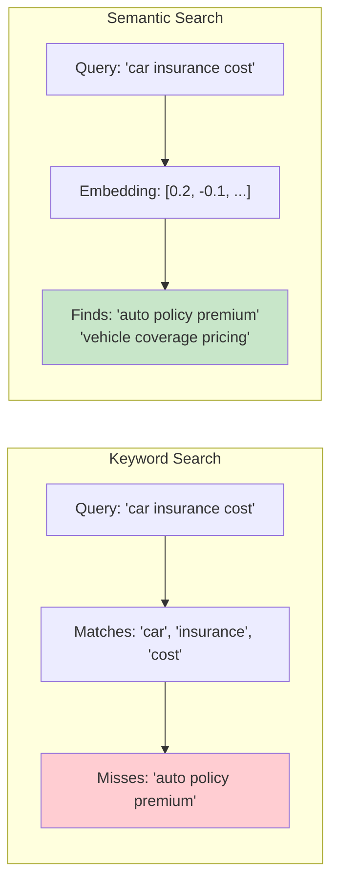
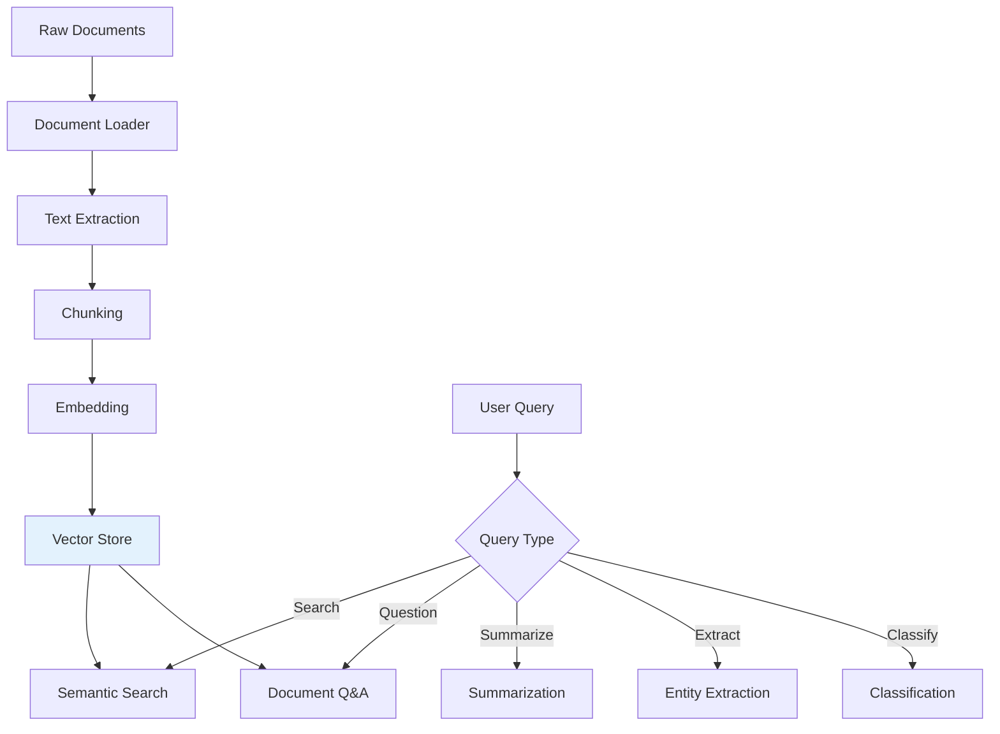

## Learning Objectives

- Build semantic search systems that understand query intent beyond keyword matching
- Implement document Q&A pipelines that answer questions from large document collections
- Apply text summarization techniques (extractive, abstractive, map-reduce) at scale
- Design classification and entity extraction systems with structured LLM outputs
- Extract structured data from unstructured text (invoices, contracts, reports)

## Prerequisites

- Understanding of embeddings and vector similarity
- Experience with RAG architecture and retrieval
- Familiarity with prompt engineering for structured output

## Core Concepts

### Semantic Search vs. Keyword Search

Traditional keyword search finds documents containing the exact query terms. Semantic search finds documents with matching *meaning*, even when the words differ.



```python
from openai import OpenAI
import numpy as np

client = OpenAI()

class SemanticSearchEngine:
    """Semantic search engine using embeddings."""
    
    def __init__(self, model: str = "text-embedding-3-small"):
        self.model = model
        self.documents: list[dict] = []
        self.embeddings: np.ndarray | None = None
    
    def index_documents(self, documents: list[dict]):
        """Index documents with their embeddings.
        
        Each document should have 'content', 'title', and optional 'metadata'.
        """
        self.documents = documents
        
        texts = [
            f"{doc.get('title', '')} {doc['content']}"
            for doc in documents
        ]
        
        response = client.embeddings.create(
            model=self.model,
            input=texts
        )
        
        self.embeddings = np.array([e.embedding for e in response.data])
    
    def search(
        self, 
        query: str, 
        top_k: int = 10, 
        threshold: float = 0.3
    ) -> list[dict]:
        """Search for documents semantically similar to the query."""
        query_response = client.embeddings.create(
            model=self.model,
            input=query
        )
        query_emb = np.array(query_response.data[0].embedding)
        
        similarities = np.dot(self.embeddings, query_emb) / (
            np.linalg.norm(self.embeddings, axis=1) * np.linalg.norm(query_emb)
        )
        
        top_indices = np.argsort(similarities)[::-1][:top_k]
        
        results = []
        for idx in top_indices:
            score = float(similarities[idx])
            if score < threshold:
                break
            results.append({
                **self.documents[idx],
                "score": score,
                "rank": len(results) + 1,
            })
        
        return results
    
    def search_with_reranking(
        self, query: str, top_k: int = 5, initial_k: int = 20
    ) -> list[dict]:
        """Two-stage search: embedding retrieval + LLM reranking."""
        initial_results = self.search(query, top_k=initial_k)
        
        if not initial_results:
            return []
        
        docs_text = "\n\n".join(
            f"[DOC {i+1}] {r['content'][:300]}"
            for i, r in enumerate(initial_results)
        )
        
        response = client.chat.completions.create(
            model="gpt-4o-mini",
            messages=[
                {
                    "role": "system",
                    "content": (
                        f"Given a query and {len(initial_results)} documents, "
                        f"return the indices of the top {top_k} most relevant documents "
                        f"in order. Respond with only comma-separated numbers (e.g., '3,1,7,5,2')."
                    )
                },
                {
                    "role": "user",
                    "content": f"Query: {query}\n\nDocuments:\n{docs_text}"
                }
            ],
            temperature=0
        )
        
        try:
            indices = [int(x.strip()) - 1 for x in response.choices[0].message.content.split(",")]
            return [initial_results[i] for i in indices if 0 <= i < len(initial_results)]
        except (ValueError, IndexError):
            return initial_results[:top_k]
```

### Document Q&A

Document Q&A combines retrieval with generation to answer questions from a knowledge base.

```python
class DocumentQA:
    """Answer questions from a document collection."""
    
    def __init__(self, search_engine: SemanticSearchEngine):
        self.search = search_engine
    
    def answer(
        self, 
        question: str, 
        top_k: int = 5,
        require_citation: bool = True
    ) -> dict:
        results = self.search.search(question, top_k=top_k)
        
        if not results:
            return {
                "answer": "I couldn't find relevant information to answer this question.",
                "sources": [],
                "confidence": 0
            }
        
        context = "\n\n".join(
            f"[Source {i+1}: {r.get('title', 'Unknown')}]\n{r['content']}"
            for i, r in enumerate(results)
        )
        
        citation_instruction = (
            "Cite your sources using [Source N] notation. "
            "If the context doesn't contain enough information, say so."
        ) if require_citation else ""
        
        response = client.chat.completions.create(
            model="gpt-4o",
            messages=[
                {
                    "role": "system",
                    "content": (
                        "Answer the question based ONLY on the provided context. "
                        f"{citation_instruction} "
                        "Be concise and specific."
                    )
                },
                {
                    "role": "user",
                    "content": f"Context:\n{context}\n\nQuestion: {question}"
                }
            ],
            temperature=0
        )
        
        answer_text = response.choices[0].message.content
        
        return {
            "answer": answer_text,
            "sources": [
                {"title": r.get("title", ""), "score": r["score"]}
                for r in results
            ],
            "context_used": len(results),
        }
```

### Text Summarization

```python
class Summarizer:
    """Multi-strategy text summarization."""
    
    def abstractive_summary(
        self, text: str, max_length: int = 200, style: str = "concise"
    ) -> str:
        """Generate a new summary in the model's own words."""
        style_instructions = {
            "concise": "Write a brief, dense summary. Every sentence should convey key information.",
            "executive": "Write for a busy executive. Lead with the conclusion, then key supporting facts.",
            "technical": "Preserve technical details, equations, and specific metrics.",
            "bullet": "Format as bullet points. Each bullet is one key fact or finding.",
        }
        
        response = client.chat.completions.create(
            model="gpt-4o",
            messages=[
                {
                    "role": "system",
                    "content": (
                        f"Summarize the following text in approximately "
                        f"{max_length} words. {style_instructions.get(style, '')}"
                    )
                },
                {"role": "user", "content": text}
            ],
            temperature=0.3
        )
        return response.choices[0].message.content
    
    def map_reduce_summary(
        self, documents: list[str], final_length: int = 300
    ) -> str:
        """Summarize multiple documents using map-reduce."""
        
        # Map: summarize each document independently
        summaries = []
        for doc in documents:
            summary = self.abstractive_summary(doc, max_length=100, style="concise")
            summaries.append(summary)
        
        # Reduce: combine all summaries into one
        combined = "\n\n".join(f"Document {i+1}: {s}" for i, s in enumerate(summaries))
        
        response = client.chat.completions.create(
            model="gpt-4o",
            messages=[
                {
                    "role": "system",
                    "content": (
                        f"Combine these individual document summaries into a single "
                        f"coherent summary of approximately {final_length} words. "
                        f"Eliminate redundancy and highlight the most important themes."
                    )
                },
                {"role": "user", "content": combined}
            ],
            temperature=0.3
        )
        return response.choices[0].message.content
    
    def incremental_summary(self, text_chunks: list[str]) -> str:
        """Process a long document chunk by chunk, maintaining a running summary."""
        running_summary = ""
        
        for i, chunk in enumerate(text_chunks):
            if not running_summary:
                running_summary = self.abstractive_summary(chunk, max_length=200)
                continue
            
            response = client.chat.completions.create(
                model="gpt-4o",
                messages=[
                    {
                        "role": "system",
                        "content": (
                            "You have a running summary of a document and a new section. "
                            "Update the summary to incorporate the new information. "
                            "Keep it under 300 words. Preserve all key facts."
                        )
                    },
                    {
                        "role": "user",
                        "content": (
                            f"Current summary:\n{running_summary}\n\n"
                            f"New section ({i+1}/{len(text_chunks)}):\n{chunk}"
                        )
                    }
                ],
                temperature=0.2
            )
            running_summary = response.choices[0].message.content
        
        return running_summary
```

### Classification and Entity Extraction

```python
from pydantic import BaseModel

class ClassificationResult(BaseModel):
    category: str
    confidence: float
    subcategory: str | None = None
    reasoning: str

class Entity(BaseModel):
    text: str
    entity_type: str
    start_position: int | None = None
    normalized_value: str | None = None

class ExtractionResult(BaseModel):
    entities: list[Entity]
    relationships: list[dict] = []

def classify_text(
    text: str,
    categories: list[str],
    multi_label: bool = False,
) -> ClassificationResult | list[ClassificationResult]:
    """Classify text into predefined categories."""
    
    if multi_label:
        instruction = (
            f"Classify this text into ALL applicable categories from: "
            f"{', '.join(categories)}. Return a list."
        )
    else:
        instruction = (
            f"Classify this text into exactly ONE category from: "
            f"{', '.join(categories)}. Choose the best fit."
        )
    
    response = client.beta.chat.completions.parse(
        model="gpt-4o",
        messages=[
            {
                "role": "system",
                "content": f"{instruction}\nProvide your confidence (0-1) and brief reasoning."
            },
            {"role": "user", "content": text}
        ],
        response_format=ClassificationResult,
        temperature=0
    )
    return response.choices[0].message.parsed

def extract_entities(text: str, entity_types: list[str]) -> ExtractionResult:
    """Extract named entities from text."""
    response = client.beta.chat.completions.parse(
        model="gpt-4o",
        messages=[
            {
                "role": "system",
                "content": (
                    f"Extract all entities of these types from the text: "
                    f"{', '.join(entity_types)}.\n"
                    f"For dates, normalize to ISO format. "
                    f"For monetary amounts, normalize to USD with number only.\n"
                    f"Also identify relationships between entities."
                )
            },
            {"role": "user", "content": text}
        ],
        response_format=ExtractionResult,
        temperature=0
    )
    return response.choices[0].message.parsed
```

### Structured Data Extraction

Extract structured information from unstructured documents like invoices, contracts, and reports.

```python
class InvoiceData(BaseModel):
    vendor_name: str
    vendor_address: str | None = None
    invoice_number: str
    invoice_date: str
    due_date: str | None = None
    line_items: list[dict]  # {"description": str, "quantity": int, "unit_price": float, "total": float}
    subtotal: float
    tax: float | None = None
    total: float
    currency: str = "USD"

def extract_invoice(document_text: str) -> InvoiceData:
    """Extract structured data from an invoice document."""
    response = client.beta.chat.completions.parse(
        model="gpt-4o",
        messages=[
            {
                "role": "system",
                "content": (
                    "Extract all invoice data from this document. "
                    "Parse dates as YYYY-MM-DD. Parse amounts as numbers without currency symbols. "
                    "If a field is not present, use null."
                )
            },
            {"role": "user", "content": document_text}
        ],
        response_format=InvoiceData,
        temperature=0
    )
    return response.choices[0].message.parsed

class ContractClause(BaseModel):
    clause_type: str      # termination, liability, payment, confidentiality, etc.
    section_number: str | None = None
    summary: str
    key_terms: list[str]
    risk_level: str       # low, medium, high

class ContractAnalysis(BaseModel):
    parties: list[str]
    effective_date: str | None = None
    termination_date: str | None = None
    contract_type: str
    key_clauses: list[ContractClause]
    total_value: float | None = None
    risks: list[str]

def analyze_contract(contract_text: str) -> ContractAnalysis:
    """Analyze a contract and extract key information."""
    response = client.beta.chat.completions.parse(
        model="gpt-4o",
        messages=[
            {
                "role": "system",
                "content": (
                    "Analyze this contract and extract structured information. "
                    "Identify all parties, key dates, financial terms, and clauses. "
                    "Rate the risk level of each clause. Highlight any unusual or concerning terms."
                )
            },
            {"role": "user", "content": contract_text}
        ],
        response_format=ContractAnalysis,
        temperature=0
    )
    return response.choices[0].message.parsed
```

### Building a Complete Content Pipeline



## Hands-On Exercises

### Exercise 1: Enterprise Search Engine

Build a semantic search engine that indexes a collection of 100+ documents (PDFs, markdown files, text). Implement search with reranking and evaluate precision@5 on 20 test queries.

### Exercise 2: Multi-Document Summarization

Collect 10 news articles on the same topic. Implement all three summarization strategies (abstractive, map-reduce, incremental). Compare the quality of each summary using LLM-as-judge evaluation.

### Exercise 3: Invoice Processing Pipeline

Create a pipeline that: takes a scanned invoice image (use OCR or a sample text), extracts structured data into a Pydantic model, validates the extracted data (line item totals match subtotal), and outputs a JSON record. Test on 5 different invoice formats.

## Key Takeaways

- **Semantic search unlocks natural queries** — Users can search with natural questions instead of keyword gymnastics.
- **Map-reduce scales summarization** — Process arbitrarily long documents by summarizing chunks and combining results.
- **Structured output makes extraction reliable** — Pydantic models enforce schema compliance, making LLM outputs production-ready.
- **Two-stage retrieval beats one-stage** — Embedding retrieval for recall + LLM reranking for precision is the winning combination.
- **Domain-specific extraction needs examples** — Few-shot prompting with domain examples dramatically improves extraction accuracy for invoices, contracts, and other specialized documents.

## External Resources

- [OpenAI Structured Outputs](https://platform.openai.com/docs/guides/structured-outputs) — Native JSON schema enforcement
- [Unstructured.io](https://unstructured.io/) — Document parsing and preprocessing
- [LangChain Document Loaders](https://python.langchain.com/docs/integrations/document_loaders/) — 100+ document format loaders
- [spaCy NER](https://spacy.io/usage/linguistic-features#named-entities) — Traditional NER for comparison
- [Instructor Library](https://python.useinstructor.com/) — Structured outputs from LLMs using Pydantic
