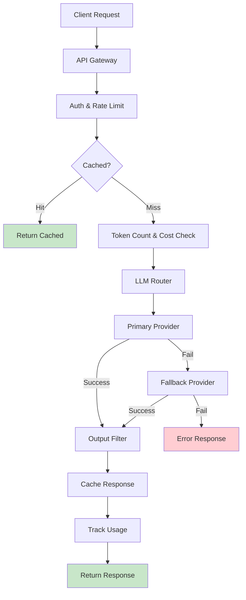

## Learning Objectives

- Design streaming APIs using Server-Sent Events (SSE) for real-time token delivery
- Implement token counting and cost tracking across multiple LLM providers
- Build rate limiting, caching, and fallback strategies for production APIs
- Create provider-agnostic abstraction layers for LLM backends
- Handle error scenarios gracefully with retries, circuit breakers, and degraded modes

## Prerequisites

- Understanding of model serving and inference basics
- Experience building REST APIs (FastAPI or Flask)
- Familiarity with async Python programming

## Core Concepts

### Streaming Responses with SSE

Users expect to see tokens appear in real-time, like ChatGPT. Server-Sent Events (SSE) enable this pattern over HTTP.

```python
from fastapi import FastAPI, Request
from fastapi.responses import StreamingResponse
from openai import OpenAI
import json
import time

app = FastAPI()
client = OpenAI()

async def stream_chat_response(messages: list[dict], model: str = "gpt-4o"):
    """Stream LLM response as SSE events."""
    stream = client.chat.completions.create(
        model=model,
        messages=messages,
        stream=True,
        stream_options={"include_usage": True},
    )
    
    for chunk in stream:
        if chunk.choices and chunk.choices[0].delta.content:
            data = {
                "content": chunk.choices[0].delta.content,
                "finish_reason": chunk.choices[0].finish_reason,
            }
            yield f"data: {json.dumps(data)}\n\n"
        
        if chunk.usage:
            usage_data = {
                "usage": {
                    "prompt_tokens": chunk.usage.prompt_tokens,
                    "completion_tokens": chunk.usage.completion_tokens,
                    "total_tokens": chunk.usage.total_tokens,
                }
            }
            yield f"data: {json.dumps(usage_data)}\n\n"
    
    yield "data: [DONE]\n\n"

@app.post("/v1/chat/stream")
async def chat_stream(request: Request):
    body = await request.json()
    messages = body["messages"]
    model = body.get("model", "gpt-4o")
    
    return StreamingResponse(
        stream_chat_response(messages, model),
        media_type="text/event-stream",
        headers={
            "Cache-Control": "no-cache",
            "Connection": "keep-alive",
            "X-Accel-Buffering": "no",
        }
    )
```

**Client-side consumption:**

```python
import httpx

async def consume_stream(messages: list[dict]):
    """Consume an SSE stream from the API."""
    async with httpx.AsyncClient() as http_client:
        async with http_client.stream(
            "POST",
            "http://localhost:8000/v1/chat/stream",
            json={"messages": messages},
            timeout=60.0
        ) as response:
            full_content = ""
            async for line in response.aiter_lines():
                if line.startswith("data: "):
                    data = line[6:]
                    if data == "[DONE]":
                        break
                    
                    parsed = json.loads(data)
                    if "content" in parsed:
                        full_content += parsed["content"]
                        print(parsed["content"], end="", flush=True)
                    elif "usage" in parsed:
                        print(f"\n\nTokens used: {parsed['usage']}")
            
            return full_content
```

### Token Counting and Cost Tracking

Accurate token counting is essential for budgeting and rate limiting.

```python
import tiktoken
from dataclasses import dataclass, field
from datetime import datetime, timedelta
from collections import defaultdict

PRICING = {
    "gpt-4o": {"input": 2.50 / 1_000_000, "output": 10.00 / 1_000_000},
    "gpt-4o-mini": {"input": 0.15 / 1_000_000, "output": 0.60 / 1_000_000},
    "gpt-3.5-turbo": {"input": 0.50 / 1_000_000, "output": 1.50 / 1_000_000},
    "claude-3-5-sonnet": {"input": 3.00 / 1_000_000, "output": 15.00 / 1_000_000},
}

@dataclass
class UsageRecord:
    model: str
    input_tokens: int
    output_tokens: int
    cost: float
    timestamp: datetime = field(default_factory=datetime.now)
    user_id: str = ""
    request_id: str = ""

class CostTracker:
    """Track LLM API costs per user and model."""
    
    def __init__(self):
        self.records: list[UsageRecord] = []
    
    def count_tokens(self, text: str, model: str = "gpt-4o") -> int:
        try:
            enc = tiktoken.encoding_for_model(model)
        except KeyError:
            enc = tiktoken.get_encoding("cl100k_base")
        return len(enc.encode(text))
    
    def count_messages_tokens(self, messages: list[dict], model: str = "gpt-4o") -> int:
        """Count tokens for a list of chat messages."""
        enc = tiktoken.encoding_for_model(model)
        tokens = 0
        for msg in messages:
            tokens += 4  # message overhead
            for key, value in msg.items():
                tokens += len(enc.encode(str(value)))
        tokens += 2  # assistant reply priming
        return tokens
    
    def record_usage(
        self, model: str, input_tokens: int, output_tokens: int,
        user_id: str = "", request_id: str = ""
    ):
        pricing = PRICING.get(model, {"input": 0, "output": 0})
        cost = (
            input_tokens * pricing["input"] +
            output_tokens * pricing["output"]
        )
        
        self.records.append(UsageRecord(
            model=model,
            input_tokens=input_tokens,
            output_tokens=output_tokens,
            cost=cost,
            user_id=user_id,
            request_id=request_id,
        ))
    
    def get_summary(self, period_hours: int = 24) -> dict:
        cutoff = datetime.now() - timedelta(hours=period_hours)
        recent = [r for r in self.records if r.timestamp > cutoff]
        
        by_model = defaultdict(lambda: {"requests": 0, "input_tokens": 0, "output_tokens": 0, "cost": 0})
        by_user = defaultdict(float)
        
        for r in recent:
            by_model[r.model]["requests"] += 1
            by_model[r.model]["input_tokens"] += r.input_tokens
            by_model[r.model]["output_tokens"] += r.output_tokens
            by_model[r.model]["cost"] += r.cost
            by_user[r.user_id] += r.cost
        
        return {
            "period_hours": period_hours,
            "total_requests": len(recent),
            "total_cost": sum(r.cost for r in recent),
            "by_model": dict(by_model),
            "top_users": dict(sorted(by_user.items(), key=lambda x: -x[1])[:10]),
        }
```

### Rate Limiting

```python
import time
from collections import defaultdict
import asyncio

class TokenBucketRateLimiter:
    """Rate limiter based on both requests and tokens."""
    
    def __init__(
        self,
        requests_per_minute: int = 60,
        tokens_per_minute: int = 100_000,
    ):
        self.rpm_limit = requests_per_minute
        self.tpm_limit = tokens_per_minute
        self.user_buckets: dict[str, dict] = defaultdict(
            lambda: {
                "request_tokens": requests_per_minute,
                "token_tokens": tokens_per_minute,
                "last_refill": time.time()
            }
        )
    
    def _refill(self, user_id: str):
        bucket = self.user_buckets[user_id]
        now = time.time()
        elapsed = now - bucket["last_refill"]
        
        bucket["request_tokens"] = min(
            self.rpm_limit,
            bucket["request_tokens"] + elapsed * self.rpm_limit / 60
        )
        bucket["token_tokens"] = min(
            self.tpm_limit,
            bucket["token_tokens"] + elapsed * self.tpm_limit / 60
        )
        bucket["last_refill"] = now
    
    def check(self, user_id: str, estimated_tokens: int) -> tuple[bool, dict]:
        self._refill(user_id)
        bucket = self.user_buckets[user_id]
        
        if bucket["request_tokens"] < 1:
            return False, {"error": "Rate limit exceeded", "retry_after_seconds": 60 / self.rpm_limit}
        
        if bucket["token_tokens"] < estimated_tokens:
            return False, {"error": "Token limit exceeded", "retry_after_seconds": 60}
        
        bucket["request_tokens"] -= 1
        bucket["token_tokens"] -= estimated_tokens
        return True, {}
```

### Semantic Caching

Cache responses for semantically similar queries to reduce latency and cost.

```python
import hashlib
import numpy as np

class SemanticCache:
    """Cache LLM responses based on semantic similarity."""
    
    def __init__(self, similarity_threshold: float = 0.95, max_size: int = 10000):
        self.threshold = similarity_threshold
        self.max_size = max_size
        self.cache: list[dict] = []
        self.embeddings: list[np.ndarray] = []
    
    def _get_embedding(self, text: str) -> np.ndarray:
        response = client.embeddings.create(
            model="text-embedding-3-small",
            input=text
        )
        return np.array(response.data[0].embedding)
    
    def get(self, query: str) -> str | None:
        if not self.cache:
            return None
        
        query_emb = self._get_embedding(query)
        
        similarities = [
            np.dot(query_emb, emb) / (np.linalg.norm(query_emb) * np.linalg.norm(emb))
            for emb in self.embeddings
        ]
        
        max_sim = max(similarities)
        if max_sim >= self.threshold:
            best_idx = similarities.index(max_sim)
            return self.cache[best_idx]["response"]
        
        return None
    
    def put(self, query: str, response: str):
        query_emb = self._get_embedding(query)
        
        self.cache.append({
            "query": query,
            "response": response,
            "timestamp": time.time(),
        })
        self.embeddings.append(query_emb)
        
        if len(self.cache) > self.max_size:
            self.cache.pop(0)
            self.embeddings.pop(0)
```

### Provider Fallback Strategy

```python
from dataclasses import dataclass

@dataclass
class ProviderConfig:
    name: str
    client: OpenAI
    model: str
    priority: int
    max_retries: int = 2
    timeout_seconds: float = 30.0

class LLMRouter:
    """Route requests across multiple LLM providers with fallback."""
    
    def __init__(self, providers: list[ProviderConfig]):
        self.providers = sorted(providers, key=lambda p: p.priority)
    
    def complete(self, messages: list[dict], **kwargs) -> dict:
        errors = []
        
        for provider in self.providers:
            for attempt in range(provider.max_retries):
                try:
                    response = provider.client.chat.completions.create(
                        model=provider.model,
                        messages=messages,
                        timeout=provider.timeout_seconds,
                        **kwargs
                    )
                    
                    return {
                        "content": response.choices[0].message.content,
                        "provider": provider.name,
                        "model": provider.model,
                        "usage": response.usage.model_dump() if response.usage else None,
                    }
                
                except Exception as e:
                    errors.append(f"{provider.name} (attempt {attempt + 1}): {e}")
                    if attempt < provider.max_retries - 1:
                        time.sleep(2 ** attempt)
        
        raise RuntimeError(f"All providers failed:\n" + "\n".join(errors))

# Configure multi-provider routing
router = LLMRouter([
    ProviderConfig(
        name="openai",
        client=OpenAI(),
        model="gpt-4o",
        priority=1,
    ),
    ProviderConfig(
        name="anthropic-via-openai",
        client=OpenAI(
            base_url="https://api.anthropic.com/v1",
            api_key="sk-ant-..."
        ),
        model="claude-3-5-sonnet-20241022",
        priority=2,
    ),
    ProviderConfig(
        name="local-vllm",
        client=OpenAI(base_url="http://localhost:8000/v1", api_key="none"),
        model="meta-llama/Llama-3.1-8B-Instruct",
        priority=3,
    ),
])
```

### Complete API Architecture



## Hands-On Exercises

### Exercise 1: Build a Streaming API

Implement a FastAPI endpoint that streams LLM responses via SSE. Include token usage in the final event. Test with a JavaScript frontend that renders tokens in real-time.

### Exercise 2: Cost Dashboard

Build a cost tracking system that logs every API call and provides a dashboard showing: total cost by model, top users by spend, and daily cost trends.

### Exercise 3: Multi-Provider Router

Implement an LLM router with three providers, rate limiting per user, and semantic caching. Benchmark the cache hit rate and cost savings over 100 diverse queries.

## Key Takeaways

- **Streaming is mandatory for UX** — Users abandon non-streaming interfaces. SSE is the standard protocol.
- **Track every token** — Token counting and cost tracking prevent budget surprises and enable usage-based billing.
- **Rate limit at multiple levels** — Limit both requests per minute and tokens per minute, per user.
- **Cache semantically, not literally** — Semantic caching catches paraphrased queries that exact caching misses, saving 10-30% of API costs.
- **Always have a fallback** — Provider outages are common. A multi-provider router with automatic failover is essential for production.

## External Resources

- [FastAPI Streaming Responses](https://fastapi.tiangolo.com/advanced/custom-response/#streamingresponse) — SSE implementation
- [OpenAI Streaming Guide](https://platform.openai.com/docs/api-reference/chat/create#chat-create-stream) — Stream parameter documentation
- [tiktoken](https://github.com/openai/tiktoken) — Fast BPE tokenizer for token counting
- [GPTCache](https://github.com/zilliztech/GPTCache) — Semantic caching library
- [LiteLLM](https://docs.litellm.ai/) — Universal LLM API proxy with 100+ providers
