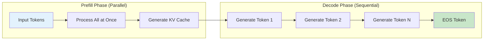
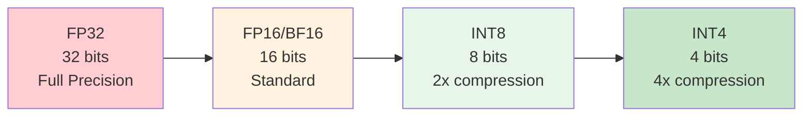

## Learning Objectives

- Deploy models using vLLM, Text Generation Inference (TGI), and Ollama
- Understand and apply quantization methods: GPTQ, AWQ, and GGUF
- Configure batching strategies (continuous, dynamic) for maximum throughput
- Manage GPU memory effectively with KV-cache optimization and tensor parallelism
- Benchmark inference performance and identify bottlenecks

## Prerequisites

- Experience with fine-tuning or working with open-source LLMs
- Understanding of GPU computing basics (VRAM, CUDA)
- Familiarity with Docker and containerized deployments

## Core Concepts

### The Inference Challenge

LLM inference is fundamentally different from traditional ML serving. The autoregressive nature of text generation means the model must run sequentially for each token, and the KV-cache grows linearly with sequence length.



**Key performance metrics:**

| Metric | Definition | Target |
|--------|-----------|--------|
| **Time to First Token (TTFT)** | Latency until the first token is generated | <500ms |
| **Tokens per Second (TPS)** | Generation throughput per request | 30-100 tok/s |
| **Throughput** | Total tokens generated across all concurrent requests | 1000+ tok/s |
| **GPU Utilization** | Percentage of GPU compute used | >80% |

### vLLM: High-Throughput Serving

vLLM uses PagedAttention to manage KV-cache memory efficiently, achieving 2-4x higher throughput than naive serving.

```python
# Starting vLLM as an OpenAI-compatible server
# vllm serve meta-llama/Llama-3.1-8B-Instruct \
#     --tensor-parallel-size 1 \
#     --max-model-len 4096 \
#     --gpu-memory-utilization 0.9 \
#     --port 8000

from openai import OpenAI

vllm_client = OpenAI(
    base_url="http://localhost:8000/v1",
    api_key="not-needed",
)

response = vllm_client.chat.completions.create(
    model="meta-llama/Llama-3.1-8B-Instruct",
    messages=[
        {"role": "system", "content": "You are a helpful assistant."},
        {"role": "user", "content": "Explain PagedAttention in 3 sentences."}
    ],
    temperature=0.7,
    max_tokens=200,
)

print(response.choices[0].message.content)
```

```python
# Programmatic vLLM usage for batch inference
from vllm import LLM, SamplingParams

llm = LLM(
    model="meta-llama/Llama-3.1-8B-Instruct",
    tensor_parallel_size=1,
    gpu_memory_utilization=0.9,
    max_model_len=4096,
)

sampling_params = SamplingParams(
    temperature=0.7,
    top_p=0.9,
    max_tokens=256,
    stop=["<|eot_id|>"],
)

prompts = [
    "What is the capital of France?",
    "Explain quantum computing in simple terms.",
    "Write a haiku about programming.",
]

outputs = llm.generate(prompts, sampling_params)

for output in outputs:
    print(f"Prompt: {output.prompt[:50]}...")
    print(f"Output: {output.outputs[0].text}")
    print(f"Tokens: {len(output.outputs[0].token_ids)}")
    print()
```

### Text Generation Inference (TGI)

Hugging Face TGI is a production-ready inference server with built-in support for continuous batching, quantization, and tensor parallelism.

```bash
# Docker deployment
docker run --gpus all --shm-size 1g -p 8080:80 \
    -v $PWD/data:/data \
    ghcr.io/huggingface/text-generation-inference:latest \
    --model-id meta-llama/Llama-3.1-8B-Instruct \
    --quantize awq \
    --max-input-tokens 2048 \
    --max-total-tokens 4096 \
    --max-batch-prefill-tokens 4096
```

```python
import requests

TGI_URL = "http://localhost:8080"

def tgi_generate(prompt: str, max_tokens: int = 200) -> str:
    response = requests.post(
        f"{TGI_URL}/generate",
        json={
            "inputs": prompt,
            "parameters": {
                "max_new_tokens": max_tokens,
                "temperature": 0.7,
                "top_p": 0.9,
                "do_sample": True,
                "stop": ["</s>"],
            }
        }
    )
    return response.json()["generated_text"]

def tgi_generate_stream(prompt: str, max_tokens: int = 200):
    """Stream tokens as they're generated."""
    response = requests.post(
        f"{TGI_URL}/generate_stream",
        json={
            "inputs": prompt,
            "parameters": {"max_new_tokens": max_tokens, "temperature": 0.7}
        },
        stream=True
    )
    
    for line in response.iter_lines():
        if line:
            data = json.loads(line.decode("utf-8").removeprefix("data:"))
            token = data.get("token", {}).get("text", "")
            yield token
```

### Ollama: Local Model Serving

Ollama simplifies running models locally with automatic quantization and model management.

```python
import ollama

response = ollama.chat(
    model="llama3.1:8b",
    messages=[
        {"role": "system", "content": "You are a helpful coding assistant."},
        {"role": "user", "content": "Write a Python function to merge two sorted lists."}
    ]
)
print(response["message"]["content"])

# Streaming
for chunk in ollama.chat(
    model="llama3.1:8b",
    messages=[{"role": "user", "content": "Explain Docker in 100 words."}],
    stream=True
):
    print(chunk["message"]["content"], end="", flush=True)

# Pull a model
ollama.pull("llama3.1:70b-instruct-q4_K_M")

# List available models
models = ollama.list()
for model in models["models"]:
    print(f"{model['name']}: {model['size'] / 1e9:.1f} GB")
```

### Quantization Methods

Quantization reduces model precision from FP16 (16-bit) to INT8, INT4, or even lower, dramatically reducing memory usage and improving throughput.



**Quantization comparison:**

| Method | Bits | Approach | Quality | Speed | Use Case |
|--------|------|----------|---------|-------|----------|
| **GPTQ** | 4-bit | Post-training, layer-wise | Very good | Fast (GPU) | GPU deployment |
| **AWQ** | 4-bit | Activation-aware weighting | Excellent | Fast (GPU) | Production GPU |
| **GGUF** | 2-8 bit | CPU-optimized format | Good | Moderate | CPU/hybrid |
| **bitsandbytes** | 4/8-bit | On-the-fly quantization | Good | Moderate | Fine-tuning |

```python
# Loading a GPTQ quantized model
from transformers import AutoModelForCausalLM, AutoTokenizer

model = AutoModelForCausalLM.from_pretrained(
    "TheBloke/Llama-2-13B-GPTQ",
    device_map="auto",
    revision="main"
)
tokenizer = AutoTokenizer.from_pretrained("TheBloke/Llama-2-13B-GPTQ")

# AWQ quantization with AutoAWQ
from awq import AutoAWQForCausalLM

model_path = "meta-llama/Llama-3.1-8B-Instruct"
quant_path = "./llama-3.1-8b-awq"

model = AutoAWQForCausalLM.from_pretrained(model_path)
tokenizer = AutoTokenizer.from_pretrained(model_path)

quant_config = {
    "zero_point": True,
    "q_group_size": 128,
    "w_bit": 4,
    "version": "GEMM"
}

model.quantize(tokenizer, quant_config=quant_config)
model.save_quantized(quant_path)
```

### GPU Memory Management

Understanding GPU memory allocation is critical for efficient serving.

```python
def estimate_gpu_memory(
    model_params_billions: float,
    precision_bits: int = 16,
    context_length: int = 4096,
    batch_size: int = 1,
    hidden_size: int = 4096,
    num_layers: int = 32,
    num_kv_heads: int = 8,
    head_dim: int = 128,
) -> dict:
    """Estimate GPU memory requirements for model serving."""
    
    # Model weights
    bytes_per_param = precision_bits / 8
    model_memory_gb = model_params_billions * 1e9 * bytes_per_param / (1024**3)
    
    # KV Cache per request
    kv_cache_per_token = 2 * num_layers * num_kv_heads * head_dim * 2  # 2 for K and V, 2 bytes FP16
    kv_cache_gb = (
        batch_size * context_length * kv_cache_per_token / (1024**3)
    )
    
    # Activation memory (rough estimate)
    activation_gb = batch_size * context_length * hidden_size * 2 / (1024**3)
    
    total_gb = model_memory_gb + kv_cache_gb + activation_gb
    overhead_gb = total_gb * 0.1  # CUDA overhead
    
    return {
        "model_weights_gb": round(model_memory_gb, 2),
        "kv_cache_gb": round(kv_cache_gb, 2),
        "activations_gb": round(activation_gb, 2),
        "cuda_overhead_gb": round(overhead_gb, 2),
        "total_gb": round(total_gb + overhead_gb, 2),
    }

# Llama 3.1 8B at different precisions
for bits in [16, 8, 4]:
    mem = estimate_gpu_memory(8.0, precision_bits=bits)
    print(f"{bits}-bit: {mem['total_gb']} GB total "
          f"(weights: {mem['model_weights_gb']} GB, "
          f"KV cache: {mem['kv_cache_gb']} GB)")
```

### Continuous Batching

Continuous batching (also called iteration-level batching) adds new requests to a running batch as soon as any request finishes, maximizing GPU utilization.

```mermaid
gantt
    title Continuous Batching vs Static Batching
    dateFormat X
    axisFormat %s
    
    section Static Batch
    Request A (200 tokens)    :a1, 0, 200
    Request B (50 tokens)     :a2, 0, 50
    Request C (waits)         :a3, 200, 350
    GPU Idle (B done)         :crit, 50, 200
    
    section Continuous Batch
    Request A (200 tokens)    :b1, 0, 200
    Request B (50 tokens)     :b2, 0, 50
    Request C (fills slot)    :b3, 50, 200
    Request D (fills slot)    :b4, 200, 300
```



### Benchmarking Inference

```python
import time
import statistics
from concurrent.futures import ThreadPoolExecutor

def benchmark_endpoint(
    client,
    model: str,
    prompts: list[str],
    max_tokens: int = 100,
    concurrency: int = 1
) -> dict:
    """Benchmark an LLM inference endpoint."""
    
    def single_request(prompt: str) -> dict:
        start = time.perf_counter()
        
        response = client.chat.completions.create(
            model=model,
            messages=[{"role": "user", "content": prompt}],
            max_tokens=max_tokens,
            temperature=0
        )
        
        elapsed = time.perf_counter() - start
        n_tokens = response.usage.completion_tokens
        
        return {
            "latency_s": elapsed,
            "tokens": n_tokens,
            "tokens_per_second": n_tokens / elapsed if elapsed > 0 else 0,
        }
    
    results = []
    with ThreadPoolExecutor(max_workers=concurrency) as executor:
        futures = [executor.submit(single_request, p) for p in prompts]
        for future in futures:
            results.append(future.result())
    
    latencies = [r["latency_s"] for r in results]
    tps_values = [r["tokens_per_second"] for r in results]
    
    return {
        "n_requests": len(results),
        "concurrency": concurrency,
        "avg_latency_s": statistics.mean(latencies),
        "p50_latency_s": statistics.median(latencies),
        "p99_latency_s": sorted(latencies)[int(len(latencies) * 0.99)],
        "avg_tps": statistics.mean(tps_values),
        "total_throughput_tps": sum(r["tokens"] for r in results) / max(latencies),
    }
```

## Hands-On Exercises

### Exercise 1: Local Model Deployment

Deploy a 7B-parameter model using three methods: vLLM, Ollama, and direct Transformers inference. Benchmark each on 50 identical prompts at concurrency levels of 1, 4, and 8. Compare TTFT, TPS, and total throughput.

### Exercise 2: Quantization Trade-Off Analysis

Take a model and quantize it to FP16, INT8 (GPTQ), and INT4 (AWQ/GGUF). Compare: memory usage, tokens per second, and output quality on a benchmark of 100 questions.

### Exercise 3: Memory Optimization

Given a 24GB GPU, calculate the maximum batch size and context length you can support for Llama 3.1 8B at INT4 precision. Validate your calculation empirically.

## Key Takeaways

- **vLLM is the default choice for GPU serving** — PagedAttention and continuous batching provide the best throughput.
- **Quantization is almost free** — 4-bit AWQ models retain 95%+ of quality with 4x memory savings.
- **KV-cache dominates memory at scale** — Model weights are fixed, but KV-cache grows with batch size × sequence length.
- **Continuous batching is essential** — Static batching wastes GPU cycles; continuous batching keeps utilization high.
- **Always benchmark on your workload** — Published numbers are helpful, but your prompt length distribution and concurrency patterns are unique.

## External Resources

- [vLLM Documentation](https://docs.vllm.ai/) — High-throughput LLM serving
- [TGI Documentation](https://huggingface.co/docs/text-generation-inference) — Hugging Face inference server
- [Ollama Documentation](https://ollama.com/) — Local model management
- [Kwon et al. — PagedAttention (2023)](https://arxiv.org/abs/2309.06180) — vLLM's core innovation
- [GGUF Format Specification](https://github.com/ggerganov/ggml/blob/master/docs/gguf.md) — CPU-optimized model format
