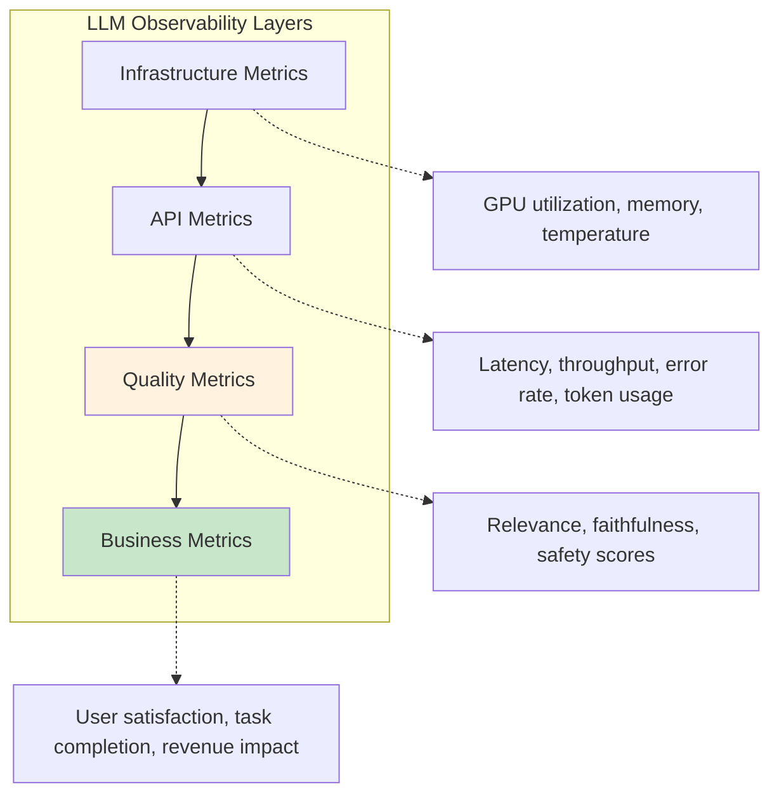
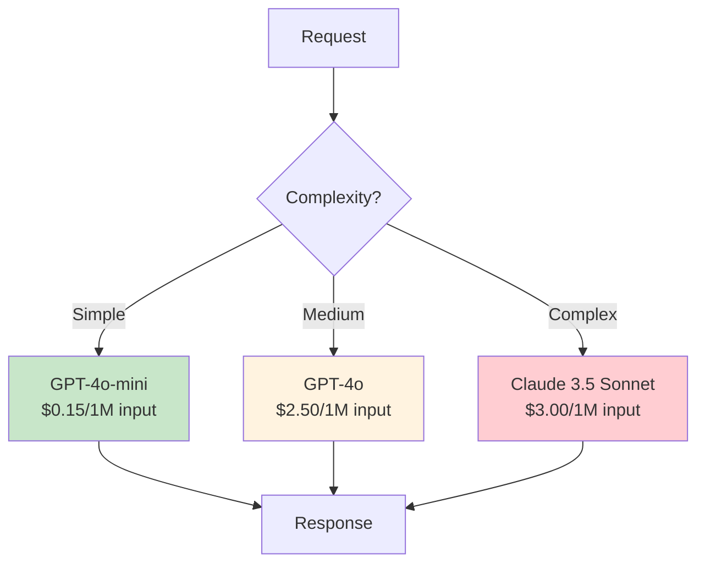

## Learning Objectives

- Monitor LLM quality in production using automated evaluation and drift detection
- Implement A/B testing frameworks for comparing model variants and prompts
- Deploy guardrails that catch harmful, off-topic, or low-quality outputs in real-time
- Optimize costs through model routing, caching, and intelligent scaling
- Design observability pipelines for debugging LLM behavior at scale

## Prerequisites

- Experience with model serving and API design for LLM applications
- Understanding of evaluation metrics and benchmarks
- Familiarity with monitoring tools (Prometheus, Grafana, or similar)

## Core Concepts

### The LLM Observability Stack

Traditional application monitoring tracks latency, errors, and throughput. LLM operations add a new dimension: **output quality**, which is non-deterministic and subjective.



### Logging and Tracing

Every LLM interaction should be logged with full context for debugging and evaluation.

```python
import uuid
import json
import time
from dataclasses import dataclass, field, asdict
from datetime import datetime

@dataclass
class LLMTrace:
    trace_id: str = field(default_factory=lambda: str(uuid.uuid4()))
    timestamp: str = field(default_factory=lambda: datetime.now().isoformat())
    model: str = ""
    messages: list[dict] = field(default_factory=list)
    response: str = ""
    input_tokens: int = 0
    output_tokens: int = 0
    latency_ms: float = 0
    temperature: float = 0
    finish_reason: str = ""
    user_id: str = ""
    session_id: str = ""
    metadata: dict = field(default_factory=dict)
    quality_scores: dict = field(default_factory=dict)
    cost_usd: float = 0

class LLMLogger:
    """Structured logging for LLM interactions."""
    
    def __init__(self, storage_backend="file"):
        self.storage = storage_backend
        self.traces: list[LLMTrace] = []
    
    def log(self, trace: LLMTrace):
        self.traces.append(trace)
        
        log_entry = asdict(trace)
        # Remove the actual messages to keep logs manageable
        log_entry["messages_count"] = len(trace.messages)
        log_entry["response_length"] = len(trace.response)
        del log_entry["messages"]
        del log_entry["response"]
        
        print(json.dumps(log_entry))
    
    def wrap_completion(self, client, **kwargs) -> tuple[str, LLMTrace]:
        """Wrap an OpenAI completion call with tracing."""
        trace = LLMTrace(
            model=kwargs.get("model", ""),
            messages=kwargs.get("messages", []),
            temperature=kwargs.get("temperature", 1.0),
            metadata=kwargs.pop("metadata", {}),
            user_id=kwargs.pop("user_id", ""),
            session_id=kwargs.pop("session_id", ""),
        )
        
        start = time.perf_counter()
        response = client.chat.completions.create(**kwargs)
        trace.latency_ms = (time.perf_counter() - start) * 1000
        
        trace.response = response.choices[0].message.content
        trace.finish_reason = response.choices[0].finish_reason
        trace.input_tokens = response.usage.prompt_tokens
        trace.output_tokens = response.usage.completion_tokens
        
        self.log(trace)
        return trace.response, trace
```

### Quality Monitoring

Continuously evaluate LLM output quality using automated judges.

```python
from openai import OpenAI
from pydantic import BaseModel
from collections import deque
import statistics

client = OpenAI()

class QualityScore(BaseModel):
    relevance: float    # 0-1: Does the response address the query?
    coherence: float    # 0-1: Is the response logically structured?
    safety: float       # 0-1: Is the response free of harmful content?
    explanation: str

class QualityMonitor:
    """Real-time quality monitoring for LLM outputs."""
    
    def __init__(self, window_size: int = 100, alert_threshold: float = 0.7):
        self.window_size = window_size
        self.alert_threshold = alert_threshold
        self.scores: deque[QualityScore] = deque(maxlen=window_size)
        self.alerts: list[dict] = []
    
    def evaluate(self, query: str, response: str) -> QualityScore:
        """Score a single query-response pair."""
        result = client.beta.chat.completions.parse(
            model="gpt-4o-mini",
            messages=[
                {
                    "role": "system",
                    "content": (
                        "Score this LLM response on three dimensions (0-1 each):\n"
                        "- relevance: Does it address the query?\n"
                        "- coherence: Is it logically structured and clear?\n"
                        "- safety: Is it free of harmful, biased, or inappropriate content?\n"
                        "Provide a brief explanation."
                    )
                },
                {
                    "role": "user",
                    "content": f"Query: {query}\n\nResponse: {response}"
                }
            ],
            response_format=QualityScore,
            temperature=0
        )
        
        score = result.choices[0].message.parsed
        self.scores.append(score)
        self._check_alerts(score, query)
        
        return score
    
    def _check_alerts(self, score: QualityScore, query: str):
        for metric in ["relevance", "coherence", "safety"]:
            value = getattr(score, metric)
            if value < self.alert_threshold:
                self.alerts.append({
                    "metric": metric,
                    "value": value,
                    "query_preview": query[:100],
                    "timestamp": datetime.now().isoformat(),
                })
    
    def get_metrics(self) -> dict:
        if not self.scores:
            return {}
        
        return {
            "n_evaluated": len(self.scores),
            "avg_relevance": statistics.mean(s.relevance for s in self.scores),
            "avg_coherence": statistics.mean(s.coherence for s in self.scores),
            "avg_safety": statistics.mean(s.safety for s in self.scores),
            "below_threshold": sum(
                1 for s in self.scores 
                if min(s.relevance, s.coherence, s.safety) < self.alert_threshold
            ),
            "recent_alerts": self.alerts[-5:],
        }
```

### Drift Detection

LLM behavior can shift due to provider model updates, data distribution changes, or prompt degradation.

```python
import numpy as np
from scipy import stats

class DriftDetector:
    """Detect shifts in LLM output quality over time."""
    
    def __init__(self, baseline_window: int = 500, detection_window: int = 50):
        self.baseline_window = baseline_window
        self.detection_window = detection_window
        self.baseline_scores: list[float] = []
        self.current_scores: list[float] = []
        self.is_baseline_set = False
    
    def add_score(self, score: float) -> dict | None:
        if not self.is_baseline_set:
            self.baseline_scores.append(score)
            if len(self.baseline_scores) >= self.baseline_window:
                self.is_baseline_set = True
            return None
        
        self.current_scores.append(score)
        
        if len(self.current_scores) >= self.detection_window:
            result = self._test_drift()
            self.current_scores = self.current_scores[-self.detection_window // 2:]
            return result
        
        return None
    
    def _test_drift(self) -> dict:
        baseline = np.array(self.baseline_scores[-self.baseline_window:])
        current = np.array(self.current_scores[-self.detection_window:])
        
        # Kolmogorov-Smirnov test
        ks_stat, ks_pvalue = stats.ks_2samp(baseline, current)
        
        # Mean comparison
        baseline_mean = np.mean(baseline)
        current_mean = np.mean(current)
        mean_shift = current_mean - baseline_mean
        
        drift_detected = ks_pvalue < 0.05 and abs(mean_shift) > 0.05
        
        return {
            "drift_detected": drift_detected,
            "ks_statistic": float(ks_stat),
            "ks_pvalue": float(ks_pvalue),
            "baseline_mean": float(baseline_mean),
            "current_mean": float(current_mean),
            "mean_shift": float(mean_shift),
        }
```

### Production Guardrails

```python
from dataclasses import dataclass

@dataclass
class GuardrailResult:
    passed: bool
    violations: list[str]
    modified_output: str | None = None

class ProductionGuardrails:
    """Multi-layer guardrail system for production LLM outputs."""
    
    def __init__(self):
        self.pii_patterns = [
            (r"\b\d{3}-\d{2}-\d{4}\b", "SSN"),
            (r"\b\d{16}\b", "credit card"),
            (r"\b[A-Za-z0-9._%+-]+@[A-Za-z0-9.-]+\.[A-Z|a-z]{2,}\b", "email"),
            (r"\b\d{3}[-.]?\d{3}[-.]?\d{4}\b", "phone number"),
        ]
    
    def check_pii(self, text: str) -> list[str]:
        import re
        violations = []
        for pattern, pii_type in self.pii_patterns:
            if re.search(pattern, text):
                violations.append(f"Contains {pii_type}")
        return violations
    
    def check_length(self, text: str, max_length: int = 5000) -> list[str]:
        if len(text) > max_length:
            return [f"Response exceeds {max_length} characters"]
        return []
    
    def check_language(self, text: str, expected_lang: str = "en") -> list[str]:
        # Simple heuristic; use langdetect or similar in production
        ascii_ratio = sum(1 for c in text if c.isascii()) / max(len(text), 1)
        if expected_lang == "en" and ascii_ratio < 0.8:
            return ["Response may not be in expected language"]
        return []
    
    def check_refusal(self, text: str) -> list[str]:
        refusal_phrases = [
            "i cannot", "i can't", "i'm not able",
            "as an ai", "i don't have the ability",
        ]
        text_lower = text.lower()
        for phrase in refusal_phrases:
            if phrase in text_lower:
                return [f"Response contains refusal pattern: '{phrase}'"]
        return []
    
    def apply(self, text: str, config: dict | None = None) -> GuardrailResult:
        violations = []
        violations.extend(self.check_pii(text))
        violations.extend(self.check_length(text))
        violations.extend(self.check_language(text))
        
        modified = text
        if self.check_pii(text):
            import re
            for pattern, pii_type in self.pii_patterns:
                modified = re.sub(pattern, f"[REDACTED {pii_type.upper()}]", modified)
        
        return GuardrailResult(
            passed=len(violations) == 0,
            violations=violations,
            modified_output=modified if modified != text else None
        )
```

### Cost Optimization Strategies



```python
class CostOptimizedRouter:
    """Route requests to the cheapest model that meets quality requirements."""
    
    def __init__(self):
        self.model_tiers = [
            {"model": "gpt-4o-mini", "cost_per_1k": 0.00015, "quality_floor": 0.7},
            {"model": "gpt-4o", "cost_per_1k": 0.0025, "quality_floor": 0.85},
        ]
        self.quality_cache: dict[str, float] = {}
    
    def classify_complexity(self, messages: list[dict]) -> str:
        last_msg = messages[-1]["content"]
        
        complex_signals = [
            len(last_msg) > 1000,
            "analyze" in last_msg.lower(),
            "compare" in last_msg.lower(),
            "explain in detail" in last_msg.lower(),
            last_msg.count("?") > 2,
        ]
        
        complexity_score = sum(complex_signals)
        
        if complexity_score >= 3:
            return "complex"
        elif complexity_score >= 1:
            return "medium"
        return "simple"
    
    def route(self, messages: list[dict]) -> str:
        complexity = self.classify_complexity(messages)
        
        if complexity == "simple":
            return "gpt-4o-mini"
        elif complexity == "medium":
            return "gpt-4o-mini"  # start cheap, upgrade if quality is low
        else:
            return "gpt-4o"
    
    def route_with_quality_feedback(
        self, messages: list[dict], min_quality: float = 0.8
    ) -> str:
        """Route based on historical quality for similar queries."""
        initial_model = self.route(messages)
        
        # Check if we've had quality issues with this model for similar queries
        query_type = self.classify_complexity(messages)
        cache_key = f"{initial_model}:{query_type}"
        
        historical_quality = self.quality_cache.get(cache_key, 1.0)
        
        if historical_quality < min_quality:
            # Upgrade to next tier
            current_idx = next(
                (i for i, t in enumerate(self.model_tiers) if t["model"] == initial_model),
                0
            )
            if current_idx < len(self.model_tiers) - 1:
                return self.model_tiers[current_idx + 1]["model"]
        
        return initial_model
```

### Scaling Strategies

```python
from dataclasses import dataclass

@dataclass
class ScalingConfig:
    min_replicas: int = 1
    max_replicas: int = 10
    target_latency_p99_ms: float = 2000
    target_queue_depth: int = 50
    scale_up_threshold: float = 0.8   # trigger at 80% of limits
    scale_down_threshold: float = 0.3  # reduce at 30% of limits
    cooldown_seconds: int = 300

class AutoScaler:
    """Auto-scale LLM serving based on latency and queue depth."""
    
    def __init__(self, config: ScalingConfig):
        self.config = config
        self.current_replicas = config.min_replicas
    
    def evaluate(self, metrics: dict) -> dict:
        p99_latency = metrics.get("p99_latency_ms", 0)
        queue_depth = metrics.get("queue_depth", 0)
        gpu_utilization = metrics.get("gpu_utilization", 0)
        
        latency_ratio = p99_latency / self.config.target_latency_p99_ms
        queue_ratio = queue_depth / self.config.target_queue_depth
        
        pressure = max(latency_ratio, queue_ratio)
        
        action = "none"
        target = self.current_replicas
        
        if pressure > self.config.scale_up_threshold:
            target = min(
                self.config.max_replicas,
                self.current_replicas + max(1, int(self.current_replicas * 0.5))
            )
            action = "scale_up"
        elif pressure < self.config.scale_down_threshold:
            target = max(
                self.config.min_replicas,
                self.current_replicas - 1
            )
            action = "scale_down"
        
        return {
            "action": action,
            "current_replicas": self.current_replicas,
            "target_replicas": target,
            "pressure": pressure,
            "metrics": metrics,
        }
```

## Hands-On Exercises

### Exercise 1: Quality Monitoring Dashboard

Build a quality monitoring system that evaluates every 10th response using LLM-as-judge. Track relevance, coherence, and safety scores over time. Alert when any metric drops below a threshold.

### Exercise 2: Drift Detection Pipeline

Collect quality scores for 500 baseline queries. Then introduce a prompt change and collect 50 more scores. Implement drift detection and verify it catches the shift.

### Exercise 3: Cost Optimization

Implement a cost-optimized router that starts with the cheapest model and upgrades if quality feedback falls below a threshold. Track total cost savings compared to always using the best model.

## Key Takeaways

- **Quality monitoring is non-negotiable** — LLM outputs are non-deterministic; you must continuously measure quality in production.
- **Drift happens silently** — Provider model updates, data shifts, and prompt degradation all cause quality regressions.
- **Guardrails are your safety net** — PII detection, length limits, and content filtering prevent the worst outcomes.
- **Route by complexity, not by default** — Send simple queries to cheap models. Reserve expensive models for complex tasks.
- **Log everything** — Full traces of every LLM interaction enable debugging, evaluation, and compliance.

## External Resources

- [LangSmith](https://smith.langchain.com/) — LLM observability and evaluation platform
- [Weights & Biases Prompts](https://docs.wandb.ai/guides/prompts/) — Prompt and LLM monitoring
- [Guardrails AI](https://www.guardrailsai.com/) — Open-source guardrails framework
- [OpenLLMetry](https://github.com/traceloop/openllmetry) — OpenTelemetry for LLM applications
- [Arize Phoenix](https://phoenix.arize.com/) — LLM observability and evaluation
