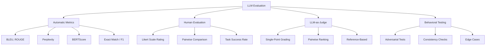

## Learning Objectives

- Implement automated evaluation metrics: BLEU, ROUGE, perplexity, and BERTScore
- Design human evaluation protocols that produce reliable, reproducible results
- Build LLM-as-judge evaluation systems for scalable quality assessment
- Understand benchmark contamination and how to detect it
- Create A/B testing frameworks for comparing model variants in production

## Prerequisites

- Experience with fine-tuning or prompt engineering
- Understanding of probability and basic statistics
- Familiarity with Python scientific computing (NumPy, pandas)

## Core Concepts

### The Evaluation Challenge

LLM evaluation is fundamentally harder than traditional ML evaluation because outputs are open-ended text. There's no single "correct" answer for most generative tasks.



### Automated Metrics

#### BLEU Score

BLEU (Bilingual Evaluation Understudy) measures n-gram overlap between generated text and reference text. Widely used for translation, but has significant limitations.

```python
from collections import Counter
import math

def compute_bleu(reference: str, candidate: str, max_n: int = 4) -> float:
    """Compute BLEU score between a reference and candidate text."""
    ref_tokens = reference.lower().split()
    cand_tokens = candidate.lower().split()
    
    if len(cand_tokens) == 0:
        return 0.0
    
    precisions = []
    for n in range(1, max_n + 1):
        ref_ngrams = Counter(
            tuple(ref_tokens[i:i + n]) for i in range(len(ref_tokens) - n + 1)
        )
        cand_ngrams = Counter(
            tuple(cand_tokens[i:i + n]) for i in range(len(cand_tokens) - n + 1)
        )
        
        clipped = sum(
            min(count, ref_ngrams.get(ngram, 0))
            for ngram, count in cand_ngrams.items()
        )
        total = sum(cand_ngrams.values())
        
        precision = clipped / total if total > 0 else 0
        precisions.append(precision)
    
    if any(p == 0 for p in precisions):
        return 0.0
    
    # Brevity penalty
    bp = min(1.0, math.exp(1 - len(ref_tokens) / len(cand_tokens)))
    
    # Geometric mean of precisions
    log_avg = sum(math.log(p) for p in precisions) / max_n
    return bp * math.exp(log_avg)

# Usage
ref = "The cat sat on the mat"
cand = "The cat is sitting on the mat"
print(f"BLEU: {compute_bleu(ref, cand):.4f}")
```

#### ROUGE Score

ROUGE (Recall-Oriented Understudy for Gisting Evaluation) focuses on recall — how much of the reference is captured in the generated text. Standard for summarization evaluation.

```python
def compute_rouge_l(reference: str, candidate: str) -> dict:
    """Compute ROUGE-L using longest common subsequence."""
    ref_tokens = reference.lower().split()
    cand_tokens = candidate.lower().split()
    
    m, n = len(ref_tokens), len(cand_tokens)
    dp = [[0] * (n + 1) for _ in range(m + 1)]
    
    for i in range(1, m + 1):
        for j in range(1, n + 1):
            if ref_tokens[i - 1] == cand_tokens[j - 1]:
                dp[i][j] = dp[i - 1][j - 1] + 1
            else:
                dp[i][j] = max(dp[i - 1][j], dp[i][j - 1])
    
    lcs_length = dp[m][n]
    
    precision = lcs_length / n if n > 0 else 0
    recall = lcs_length / m if m > 0 else 0
    f1 = 2 * precision * recall / (precision + recall) if (precision + recall) > 0 else 0
    
    return {"precision": precision, "recall": recall, "f1": f1}
```

#### Perplexity

Perplexity measures how well a language model predicts a text sequence. Lower perplexity = better model fit. It's the exponential of the average negative log-likelihood.

```python
import torch
from transformers import AutoModelForCausalLM, AutoTokenizer

def compute_perplexity(model, tokenizer, text: str) -> float:
    """Compute perplexity of a text under a language model."""
    inputs = tokenizer(text, return_tensors="pt").to(model.device)
    
    with torch.no_grad():
        outputs = model(**inputs, labels=inputs["input_ids"])
        loss = outputs.loss
    
    return torch.exp(loss).item()

model = AutoModelForCausalLM.from_pretrained("gpt2")
tokenizer = AutoTokenizer.from_pretrained("gpt2")

texts = [
    "The quick brown fox jumps over the lazy dog.",
    "Colorless green ideas sleep furiously.",
    "asdf jkl qwer uiop zxcv bnm",
]

for text in texts:
    ppl = compute_perplexity(model, tokenizer, text)
    print(f"Perplexity: {ppl:8.1f} | {text}")
```

#### BERTScore

BERTScore computes semantic similarity between generated and reference text using contextual embeddings — much better than n-gram overlap for paraphrases.

```python
from bert_score import score as bert_score

references = [
    "The cat sat on the mat.",
    "Retrieval augmented generation improves accuracy.",
]
candidates = [
    "A feline was resting upon the rug.",
    "RAG enhances the precision of language models.",
]

P, R, F1 = bert_score(candidates, references, lang="en", verbose=True)
for ref, cand, f1 in zip(references, candidates, F1):
    print(f"F1: {f1:.4f} | '{cand}' vs '{ref}'")
```

### Human Evaluation

Automated metrics are cheap and fast but imperfect. For high-stakes evaluations, human judgment remains the gold standard.

```python
from dataclasses import dataclass
from enum import IntEnum

class LikertScale(IntEnum):
    TERRIBLE = 1
    POOR = 2
    ACCEPTABLE = 3
    GOOD = 4
    EXCELLENT = 5

@dataclass
class HumanEvaluation:
    example_id: str
    evaluator_id: str
    fluency: LikertScale
    relevance: LikertScale
    accuracy: LikertScale
    helpfulness: LikertScale
    notes: str = ""
    
    @property
    def overall_score(self) -> float:
        return (self.fluency + self.relevance + self.accuracy + self.helpfulness) / 4

def compute_inter_annotator_agreement(
    evaluations: list[HumanEvaluation]
) -> float:
    """Compute Cohen's Kappa for inter-annotator agreement."""
    from itertools import combinations
    import numpy as np
    
    by_example = {}
    for ev in evaluations:
        by_example.setdefault(ev.example_id, []).append(ev)
    
    agreements = 0
    total = 0
    
    for example_id, evals in by_example.items():
        for e1, e2 in combinations(evals, 2):
            score1 = round(e1.overall_score)
            score2 = round(e2.overall_score)
            if score1 == score2:
                agreements += 1
            total += 1
    
    observed = agreements / total if total > 0 else 0
    expected = 1 / 5  # 5-point scale, random chance
    kappa = (observed - expected) / (1 - expected) if (1 - expected) > 0 else 0
    
    return kappa
```

### LLM-as-Judge

Using a powerful LLM to evaluate another LLM's output provides a scalable middle ground between automated metrics and human evaluation.

```python
from openai import OpenAI
from pydantic import BaseModel

client = OpenAI()

class JudgeScore(BaseModel):
    relevance: int       # 1-5
    accuracy: int        # 1-5
    completeness: int    # 1-5
    reasoning: str

def llm_judge_single(
    question: str,
    answer: str,
    reference: str | None = None
) -> JudgeScore:
    """Score an answer using GPT-4 as a judge."""
    ref_section = f"\nReference Answer: {reference}" if reference else ""
    
    response = client.beta.chat.completions.parse(
        model="gpt-4o",
        messages=[
            {
                "role": "system",
                "content": (
                    "You are an expert evaluator. Score the answer on:\n"
                    "- Relevance (1-5): Does it address the question?\n"
                    "- Accuracy (1-5): Is the information correct?\n"
                    "- Completeness (1-5): Does it cover all important aspects?\n"
                    "Provide brief reasoning for your scores."
                )
            },
            {
                "role": "user",
                "content": f"Question: {question}\nAnswer: {answer}{ref_section}"
            }
        ],
        response_format=JudgeScore,
        temperature=0
    )
    return response.choices[0].message.parsed

def llm_judge_pairwise(
    question: str,
    answer_a: str,
    answer_b: str
) -> dict:
    """Compare two answers head-to-head."""
    response = client.chat.completions.create(
        model="gpt-4o",
        messages=[
            {
                "role": "system",
                "content": (
                    "Compare two answers to the same question. "
                    "Determine which is better and explain why. "
                    "Respond with exactly one of: A_BETTER, B_BETTER, TIE. "
                    "Then provide a brief explanation."
                )
            },
            {
                "role": "user",
                "content": (
                    f"Question: {question}\n\n"
                    f"Answer A:\n{answer_a}\n\n"
                    f"Answer B:\n{answer_b}"
                )
            }
        ],
        temperature=0
    )
    
    text = response.choices[0].message.content
    verdict = text.split("\n")[0].strip()
    explanation = "\n".join(text.split("\n")[1:]).strip()
    
    return {"verdict": verdict, "explanation": explanation}
```

### Benchmark Contamination

A model performing well on a benchmark may have seen the test data during training. Contamination detection is critical for honest evaluation.

```python
import hashlib

def detect_contamination(
    test_examples: list[str],
    training_data: list[str],
    n_gram_size: int = 10
) -> dict:
    """Detect potential contamination between test and training sets."""
    
    def get_ngrams(text: str, n: int) -> set:
        tokens = text.lower().split()
        return {
            tuple(tokens[i:i + n])
            for i in range(len(tokens) - n + 1)
        }
    
    training_ngrams = set()
    for text in training_data:
        training_ngrams.update(get_ngrams(text, n_gram_size))
    
    contaminated = []
    for idx, example in enumerate(test_examples):
        example_ngrams = get_ngrams(example, n_gram_size)
        overlap = example_ngrams & training_ngrams
        
        if len(overlap) > 0:
            overlap_ratio = len(overlap) / len(example_ngrams) if example_ngrams else 0
            if overlap_ratio > 0.3:
                contaminated.append({
                    "index": idx,
                    "overlap_ratio": overlap_ratio,
                    "example_preview": example[:100]
                })
    
    return {
        "total_test_examples": len(test_examples),
        "contaminated_count": len(contaminated),
        "contamination_rate": len(contaminated) / len(test_examples),
        "contaminated_examples": contaminated[:10]
    }
```

### A/B Testing in Production

```python
import random
import time
from dataclasses import dataclass, field

@dataclass
class ABTestResult:
    variant: str
    query: str
    response: str
    latency_ms: float
    user_rating: int | None = None
    timestamp: float = field(default_factory=time.time)

class LLMABTest:
    """A/B testing framework for comparing LLM variants."""
    
    def __init__(self, variants: dict, traffic_split: dict[str, float]):
        self.variants = variants  # name -> model/config
        self.traffic_split = traffic_split
        self.results: list[ABTestResult] = []
    
    def route_request(self, user_id: str) -> str:
        """Deterministically route a user to a variant."""
        hash_val = int(hashlib.md5(user_id.encode()).hexdigest(), 16) % 100
        
        cumulative = 0
        for variant, percentage in self.traffic_split.items():
            cumulative += percentage * 100
            if hash_val < cumulative:
                return variant
        
        return list(self.variants.keys())[0]
    
    def process(self, user_id: str, query: str) -> str:
        variant = self.route_request(user_id)
        config = self.variants[variant]
        
        start = time.perf_counter()
        response = client.chat.completions.create(
            model=config["model"],
            messages=[
                {"role": "system", "content": config.get("system_prompt", "")},
                {"role": "user", "content": query}
            ],
            temperature=config.get("temperature", 0.7)
        )
        latency = (time.perf_counter() - start) * 1000
        
        result = ABTestResult(
            variant=variant,
            query=query,
            response=response.choices[0].message.content,
            latency_ms=latency
        )
        self.results.append(result)
        
        return result.response
    
    def analyze(self) -> dict:
        """Analyze A/B test results."""
        from statistics import mean, stdev
        
        analysis = {}
        for variant in self.variants:
            variant_results = [r for r in self.results if r.variant == variant]
            rated = [r for r in variant_results if r.user_rating is not None]
            
            analysis[variant] = {
                "n_requests": len(variant_results),
                "avg_latency_ms": mean(r.latency_ms for r in variant_results),
                "avg_rating": mean(r.user_rating for r in rated) if rated else None,
                "rating_stdev": stdev(r.user_rating for r in rated) if len(rated) > 1 else None,
            }
        
        return analysis

# Usage
ab_test = LLMABTest(
    variants={
        "control": {"model": "gpt-4o-mini", "temperature": 0.7},
        "treatment": {"model": "ft:gpt-4o-mini:my-org:custom:abc123", "temperature": 0.3},
    },
    traffic_split={"control": 0.5, "treatment": 0.5}
)
```

## Hands-On Exercises

### Exercise 1: Metric Correlation Study

Generate 50 text pairs (reference + candidate) covering different quality levels. Compute BLEU, ROUGE-L, BERTScore, and perplexity for each. Also assign human ratings (1-5). Analyze the correlation between each automatic metric and human judgment.

### Exercise 2: Build an LLM-as-Judge System

Create an evaluation pipeline using LLM-as-judge for a RAG system. Evaluate 30 question-answer pairs using both single-point grading and pairwise comparison. Compare the judge's scores to your own manual assessment.

### Exercise 3: Contamination Audit

Select a popular benchmark (e.g., MMLU, HumanEval). Analyze a model's suspiciously high performance on specific categories. Implement contamination detection and discuss mitigations.

## Key Takeaways

- **No single metric is sufficient** — Combine automated metrics, LLM-as-judge, and human evaluation for a complete picture.
- **BLEU and ROUGE are necessary but insufficient** — They capture surface-level overlap but miss semantic equivalence.
- **LLM-as-judge scales evaluation** — GPT-4 as a judge correlates well with human judgment at a fraction of the cost.
- **Benchmark contamination is widespread** — Always test on held-out data and be skeptical of benchmark leaderboards.
- **A/B testing is the ultimate arbiter** — Real user behavior is the ground truth for production systems.

## External Resources

- [Papineni et al. — BLEU (2002)](https://aclanthology.org/P02-1040/) — Original BLEU paper
- [Lin — ROUGE (2004)](https://aclanthology.org/W04-1013/) — ROUGE metrics paper
- [Zhang et al. — BERTScore (2020)](https://arxiv.org/abs/1904.09675) — Semantic evaluation metric
- [Zheng et al. — MT-Bench and Chatbot Arena (2023)](https://arxiv.org/abs/2306.05685) — LLM-as-judge methodology
- [Chatbot Arena Leaderboard](https://lmarena.ai/) — Live human preference rankings
