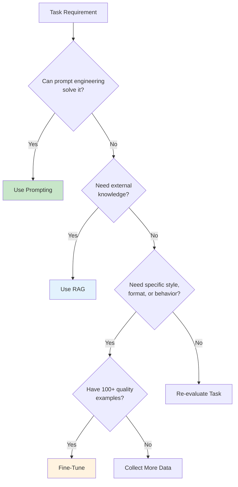
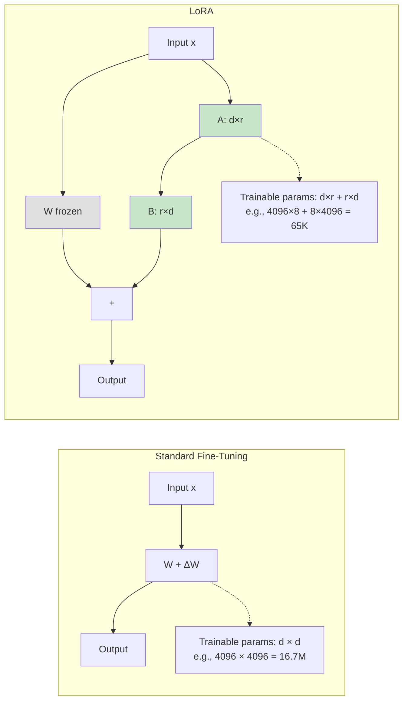

## Learning Objectives

- Decide when fine-tuning is the right approach versus prompting or RAG
- Prepare and validate training datasets in the correct format
- Implement LoRA and QLoRA for parameter-efficient fine-tuning
- Configure training hyperparameters and monitor training runs
- Avoid common pitfalls like catastrophic forgetting and overfitting

## Prerequisites

- Understanding of transformer architecture and attention mechanisms
- Experience with prompt engineering and RAG systems
- Basic familiarity with PyTorch and GPU concepts

## Core Concepts

### When to Fine-Tune

Fine-tuning is expensive and complex. Before committing, evaluate whether simpler approaches can meet your requirements.



**Fine-tune when:**
- You need a specific output style, tone, or format consistently
- Latency/cost matters (smaller fine-tuned models can replace larger general ones)
- The task requires domain-specific reasoning patterns
- You have 100+ high-quality training examples (ideally 1000+)

**Don't fine-tune when:**
- Prompt engineering achieves acceptable quality
- The knowledge is factual and can be retrieved (use RAG instead)
- You have fewer than 50 examples
- The task requirements change frequently

### Data Preparation

Training data quality is the single most important factor in fine-tuning success. The "garbage in, garbage out" principle applies with extreme force.

```python
import json
from pathlib import Path

def create_training_example(
    system_prompt: str,
    user_message: str,
    assistant_response: str
) -> dict:
    """Create a single training example in OpenAI chat format."""
    return {
        "messages": [
            {"role": "system", "content": system_prompt},
            {"role": "user", "content": user_message},
            {"role": "assistant", "content": assistant_response}
        ]
    }

def prepare_dataset(
    examples: list[dict],
    output_path: str,
    val_split: float = 0.1
) -> tuple[str, str]:
    """Prepare and validate a fine-tuning dataset."""
    import random
    random.shuffle(examples)
    
    split_idx = int(len(examples) * (1 - val_split))
    train_set = examples[:split_idx]
    val_set = examples[split_idx:]
    
    train_path = output_path.replace(".jsonl", "_train.jsonl")
    val_path = output_path.replace(".jsonl", "_val.jsonl")
    
    for path, dataset in [(train_path, train_set), (val_path, val_set)]:
        with open(path, "w") as f:
            for example in dataset:
                f.write(json.dumps(example) + "\n")
    
    print(f"Training: {len(train_set)} examples → {train_path}")
    print(f"Validation: {len(val_set)} examples → {val_path}")
    
    return train_path, val_path

def validate_dataset(filepath: str) -> dict:
    """Validate a JSONL dataset for common issues."""
    issues = []
    stats = {"total": 0, "token_counts": [], "roles": set()}
    
    with open(filepath) as f:
        for line_num, line in enumerate(f, 1):
            stats["total"] += 1
            try:
                example = json.loads(line)
            except json.JSONDecodeError:
                issues.append(f"Line {line_num}: Invalid JSON")
                continue
            
            if "messages" not in example:
                issues.append(f"Line {line_num}: Missing 'messages' key")
                continue
            
            messages = example["messages"]
            roles = [m["role"] for m in messages]
            stats["roles"].update(roles)
            
            if roles[-1] != "assistant":
                issues.append(f"Line {line_num}: Last message must be 'assistant'")
            
            total_chars = sum(len(m["content"]) for m in messages)
            stats["token_counts"].append(total_chars // 4)  # rough estimate
    
    if stats["token_counts"]:
        import statistics
        print(f"Dataset: {stats['total']} examples")
        print(f"Avg tokens: {statistics.mean(stats['token_counts']):.0f}")
        print(f"Max tokens: {max(stats['token_counts'])}")
        print(f"Issues: {len(issues)}")
    
    for issue in issues[:10]:
        print(f"  ⚠ {issue}")
    
    return {"issues": issues, "stats": stats}
```

### Fine-Tuning with OpenAI API

The simplest path to fine-tuning uses OpenAI's managed service.

```python
from openai import OpenAI

client = OpenAI()

# Step 1: Upload training file
training_file = client.files.create(
    file=open("training_data_train.jsonl", "rb"),
    purpose="fine-tune"
)

# Step 2: Create fine-tuning job
job = client.fine_tuning.jobs.create(
    training_file=training_file.id,
    model="gpt-4o-mini-2024-07-18",
    hyperparameters={
        "n_epochs": 3,
        "batch_size": "auto",
        "learning_rate_multiplier": "auto"
    },
    suffix="my-custom-model"
)

print(f"Job ID: {job.id}")
print(f"Status: {job.status}")

# Step 3: Monitor progress
import time

while True:
    job = client.fine_tuning.jobs.retrieve(job.id)
    print(f"Status: {job.status}")
    
    if job.status in ("succeeded", "failed", "cancelled"):
        break
    time.sleep(60)

# Step 4: Use the fine-tuned model
if job.status == "succeeded":
    response = client.chat.completions.create(
        model=job.fine_tuned_model,
        messages=[
            {"role": "user", "content": "Test the fine-tuned model"}
        ]
    )
    print(response.choices[0].message.content)
```

### LoRA: Low-Rank Adaptation

LoRA freezes the pre-trained weights and injects small trainable matrices into each transformer layer. Instead of updating a weight matrix W (d×d), LoRA decomposes the update into two small matrices: ΔW = A·B where A is (d×r) and B is (r×d), with r << d.



```python
from peft import LoraConfig, get_peft_model, TaskType
from transformers import AutoModelForCausalLM, AutoTokenizer, TrainingArguments
from trl import SFTTrainer

model_name = "meta-llama/Llama-3.1-8B-Instruct"
tokenizer = AutoTokenizer.from_pretrained(model_name)
model = AutoModelForCausalLM.from_pretrained(
    model_name,
    torch_dtype="auto",
    device_map="auto"
)

# LoRA configuration
lora_config = LoraConfig(
    task_type=TaskType.CAUSAL_LM,
    r=16,                      # rank — higher = more capacity, more params
    lora_alpha=32,             # scaling factor (typically 2× rank)
    lora_dropout=0.05,         # dropout for regularization
    target_modules=[           # which layers to adapt
        "q_proj", "k_proj", "v_proj", "o_proj",
        "gate_proj", "up_proj", "down_proj"
    ],
    bias="none"
)

model = get_peft_model(model, lora_config)
model.print_trainable_parameters()
# trainable params: 13,631,488 || all params: 8,043,663,360 || trainable%: 0.1695
```

### QLoRA: Quantized LoRA

QLoRA loads the base model in 4-bit precision, dramatically reducing GPU memory. This enables fine-tuning 70B models on a single 24GB GPU.

```python
from transformers import BitsAndBytesConfig
import torch

quantization_config = BitsAndBytesConfig(
    load_in_4bit=True,
    bnb_4bit_quant_type="nf4",           # NormalFloat4 quantization
    bnb_4bit_compute_dtype=torch.bfloat16,
    bnb_4bit_use_double_quant=True        # nested quantization
)

model = AutoModelForCausalLM.from_pretrained(
    model_name,
    quantization_config=quantization_config,
    device_map="auto"
)

# Apply LoRA on top of the quantized model
model = get_peft_model(model, lora_config)
```

### Training Loop Configuration

```python
training_args = TrainingArguments(
    output_dir="./results",
    num_train_epochs=3,
    per_device_train_batch_size=4,
    gradient_accumulation_steps=4,    # effective batch = 4 × 4 = 16
    learning_rate=2e-4,
    warmup_ratio=0.03,
    lr_scheduler_type="cosine",
    logging_steps=10,
    save_strategy="steps",
    save_steps=100,
    eval_strategy="steps",
    eval_steps=100,
    bf16=True,
    gradient_checkpointing=True,      # saves memory at cost of speed
    optim="paged_adamw_32bit",
    max_grad_norm=0.3,
    report_to="wandb",
)

trainer = SFTTrainer(
    model=model,
    args=training_args,
    train_dataset=train_dataset,
    eval_dataset=val_dataset,
    tokenizer=tokenizer,
    max_seq_length=2048,
)

trainer.train()
trainer.save_model("./final_model")
```

### Hyperparameter Guide

| Parameter | Typical Range | Notes |
|-----------|--------------|-------|
| **LoRA rank (r)** | 8–64 | Start with 16; increase if underfitting |
| **LoRA alpha** | 2× rank | Scaling factor for LoRA updates |
| **Learning rate** | 1e-5 to 5e-4 | Lower for larger models |
| **Epochs** | 1–5 | More epochs risk overfitting; watch val loss |
| **Batch size** | 4–32 (effective) | Larger = more stable gradients |
| **Warmup** | 3–10% of steps | Prevents early instability |
| **Max seq length** | 512–4096 | Match your data distribution |

### Common Failure Modes

```python
def diagnose_training(train_losses: list[float], val_losses: list[float]) -> str:
    """Diagnose common training issues from loss curves."""
    if len(train_losses) < 10:
        return "Not enough data points for diagnosis"
    
    train_trend = train_losses[-1] - train_losses[0]
    val_trend = val_losses[-1] - val_losses[0]
    gap = val_losses[-1] - train_losses[-1]
    
    if train_trend > 0 and val_trend > 0:
        return (
            "DIVERGING: Both losses increasing. "
            "Likely learning rate too high. Try reducing by 10x."
        )
    
    if train_trend < -0.5 and val_trend > 0:
        return (
            "OVERFITTING: Train loss dropping but val loss increasing. "
            "Try: fewer epochs, more data, higher dropout, lower rank."
        )
    
    if abs(train_trend) < 0.01 and abs(val_trend) < 0.01:
        return (
            "PLATEAU: Both losses flat. "
            "Try: higher learning rate, higher rank, check data quality."
        )
    
    if train_trend < 0 and val_trend < 0 and gap < 0.1:
        return "HEALTHY: Both losses decreasing with small gap. Continue training."
    
    return "MIXED: Check loss curves manually."
```

## Hands-On Exercises

### Exercise 1: Prepare a Fine-Tuning Dataset

Create a dataset of 200+ examples for a specific task (e.g., converting natural language to SQL, generating product descriptions, or classifying support tickets). Validate the dataset using the validation function above. Analyze the distribution of response lengths and identify any quality issues.

### Exercise 2: LoRA Rank Experiment

Fine-tune the same model with LoRA ranks of 4, 16, and 64 on a small dataset. Compare:
- Training time and memory usage
- Final validation loss
- Output quality on 10 test examples

### Exercise 3: QLoRA on Limited Hardware

Using QLoRA, fine-tune a 7B model on a single consumer GPU (≤16GB VRAM). Document the memory usage at each stage and compare the output quality to the base model on your task.

## Key Takeaways

- **Fine-tuning is a last resort, not a first step** — Exhaust prompting and RAG before investing in fine-tuning.
- **Data quality beats data quantity** — 500 perfect examples outperform 5000 mediocre ones. Invest in curation.
- **LoRA makes fine-tuning accessible** — Train 0.1-1% of parameters and get 90%+ of full fine-tuning quality.
- **QLoRA enables large model fine-tuning on consumer hardware** — 4-bit quantization + LoRA is a game-changer.
- **Watch your loss curves** — Overfitting, divergence, and plateaus are all diagnosable from train/val loss.

## External Resources

- [Hu et al. — LoRA: Low-Rank Adaptation (2021)](https://arxiv.org/abs/2106.09685) — Original LoRA paper
- [Dettmers et al. — QLoRA (2023)](https://arxiv.org/abs/2305.14314) — QLoRA paper
- [Hugging Face PEFT Documentation](https://huggingface.co/docs/peft) — Parameter-efficient fine-tuning library
- [OpenAI Fine-Tuning Guide](https://platform.openai.com/docs/guides/fine-tuning) — Managed fine-tuning
- [Weights & Biases: Fine-Tuning LLMs](https://wandb.ai/site/articles/fine-tuning-large-language-models) — Monitoring and best practices
