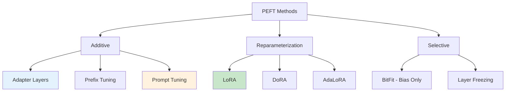

## Learning Objectives

- Compare parameter-efficient fine-tuning methods: LoRA, adapters, prefix tuning, prompt tuning
- Implement adapter layers and understand their placement in transformer architectures
- Apply prefix tuning and prompt tuning for lightweight task specialization
- Merge multiple LoRA adapters for multi-task serving
- Choose the right PEFT method based on task requirements, data availability, and compute budget

## Prerequisites

- Understanding of LoRA and QLoRA from the fine-tuning basics lesson
- Familiarity with transformer layer architecture (attention, FFN)
- Experience running training scripts with Hugging Face Transformers

## Core Concepts

### The PEFT Landscape

Parameter-efficient fine-tuning (PEFT) methods adapt large pre-trained models by modifying only a small fraction of parameters. Each method makes different trade-offs.



### Adapter Layers

Adapters insert small bottleneck modules between existing transformer layers. The original model weights remain frozen; only the adapter parameters are trained.

```python
import torch
import torch.nn as nn

class AdapterLayer(nn.Module):
    """Bottleneck adapter module inserted into a transformer layer."""
    
    def __init__(self, hidden_size: int, bottleneck_size: int = 64):
        super().__init__()
        self.down_project = nn.Linear(hidden_size, bottleneck_size)
        self.activation = nn.GELU()
        self.up_project = nn.Linear(bottleneck_size, hidden_size)
        self.layer_norm = nn.LayerNorm(hidden_size)
        
        nn.init.zeros_(self.up_project.weight)
        nn.init.zeros_(self.up_project.bias)
    
    def forward(self, x: torch.Tensor) -> torch.Tensor:
        residual = x
        x = self.layer_norm(x)
        x = self.down_project(x)
        x = self.activation(x)
        x = self.up_project(x)
        return residual + x  # skip connection preserves base model behavior

class AdaptedTransformerBlock(nn.Module):
    """Transformer block with adapters after attention and FFN."""
    
    def __init__(self, original_block, hidden_size: int, bottleneck: int = 64):
        super().__init__()
        self.original = original_block
        self.attn_adapter = AdapterLayer(hidden_size, bottleneck)
        self.ffn_adapter = AdapterLayer(hidden_size, bottleneck)
        
        for param in self.original.parameters():
            param.requires_grad = False
    
    def forward(self, x, **kwargs):
        attn_output = self.original.self_attn(x, **kwargs)
        x = x + attn_output
        x = self.attn_adapter(x)
        
        ffn_output = self.original.mlp(x)
        x = x + ffn_output
        x = self.ffn_adapter(x)
        
        return x
```

**Adapter placement strategies:**

| Placement | Parameters | Quality | Speed |
|-----------|-----------|---------|-------|
| After attention only | Smallest | Good | Fastest |
| After FFN only | Small | Good | Fast |
| After both (serial) | Medium | Best | Slower |
| Parallel to attention | Medium | Very good | Fast |

### Prefix Tuning

Prefix tuning prepends learnable "virtual tokens" to the key-value pairs in each attention layer. These prefixes steer the model's behavior without modifying its weights.

```python
class PrefixTuning(nn.Module):
    """Learnable prefixes prepended to attention KV pairs."""
    
    def __init__(
        self, 
        n_layers: int, 
        n_heads: int, 
        head_dim: int, 
        prefix_length: int = 20,
        hidden_size: int = 512
    ):
        super().__init__()
        self.prefix_length = prefix_length
        self.n_layers = n_layers
        
        total_dim = n_layers * 2 * n_heads * head_dim  # 2 for K and V
        
        self.prefix_embedding = nn.Embedding(prefix_length, hidden_size)
        self.prefix_transform = nn.Sequential(
            nn.Linear(hidden_size, hidden_size),
            nn.Tanh(),
            nn.Linear(hidden_size, total_dim)
        )
    
    def forward(self, batch_size: int) -> dict:
        """Generate prefix key-value pairs for all layers."""
        prefix_ids = torch.arange(self.prefix_length).unsqueeze(0).expand(batch_size, -1)
        prefix_embeds = self.prefix_embedding(prefix_ids)
        prefix_kv = self.prefix_transform(prefix_embeds)
        
        # Reshape into per-layer K and V tensors
        prefix_kv = prefix_kv.view(
            batch_size, self.prefix_length, self.n_layers, 2, -1
        )
        
        return {
            layer_idx: {
                "key": prefix_kv[:, :, layer_idx, 0, :],
                "value": prefix_kv[:, :, layer_idx, 1, :]
            }
            for layer_idx in range(self.n_layers)
        }
```

```python
from peft import PrefixTuningConfig, get_peft_model

prefix_config = PrefixTuningConfig(
    task_type="CAUSAL_LM",
    num_virtual_tokens=20,
    prefix_projection=True,
    encoder_hidden_size=1024,
)

model = get_peft_model(base_model, prefix_config)
model.print_trainable_parameters()
# trainable params: 9,961,472 || all params: 8,039,993,344 || trainable%: 0.124
```

### Prompt Tuning

Prompt tuning is even simpler than prefix tuning — it prepends learnable embeddings only to the input layer (not every attention layer). It's the most parameter-efficient method.

```python
class SoftPromptTuning(nn.Module):
    """Learnable soft prompts prepended to the input embedding."""
    
    def __init__(self, n_tokens: int, embedding_dim: int):
        super().__init__()
        self.soft_prompt = nn.Parameter(
            torch.randn(n_tokens, embedding_dim) * 0.01
        )
    
    def forward(self, input_embeds: torch.Tensor) -> torch.Tensor:
        batch_size = input_embeds.shape[0]
        soft_prompt_expanded = self.soft_prompt.unsqueeze(0).expand(batch_size, -1, -1)
        return torch.cat([soft_prompt_expanded, input_embeds], dim=1)
```

```python
from peft import PromptTuningConfig, PromptTuningInit, get_peft_model

prompt_config = PromptTuningConfig(
    task_type="CAUSAL_LM",
    num_virtual_tokens=20,
    prompt_tuning_init=PromptTuningInit.TEXT,
    prompt_tuning_init_text="Classify the sentiment of this review:",
    tokenizer_name_or_path=model_name,
)

model = get_peft_model(base_model, prompt_config)
model.print_trainable_parameters()
# trainable params: 81,920 || all params: 8,030,113,792 || trainable%: 0.001
```

### Method Comparison

| Method | Trainable Params | Memory | Quality | Multi-task | Inference Overhead |
|--------|-----------------|--------|---------|------------|-------------------|
| **Full fine-tuning** | 100% | Very high | Best | Poor | None |
| **LoRA** | 0.1–1% | Low | Very good | Excellent | None (after merge) |
| **Adapters** | 0.5–5% | Low | Very good | Good | Small |
| **Prefix tuning** | 0.1–1% | Low | Good | Good | Small |
| **Prompt tuning** | 0.001% | Minimal | Moderate | Excellent | Minimal |
| **BitFit** | 0.05% | Minimal | Moderate | Poor | None |

### LoRA Adapter Merging

A key advantage of LoRA is that multiple adapters can be merged, combined, or swapped at serving time.

```python
from peft import PeftModel, PeftConfig

base_model = AutoModelForCausalLM.from_pretrained(model_name)

# Load and merge a single adapter
model = PeftModel.from_pretrained(base_model, "path/to/lora_adapter")
merged_model = model.merge_and_unload()
merged_model.save_pretrained("./merged_model")

# Multi-adapter serving: switch between tasks without reloading
model = PeftModel.from_pretrained(base_model, "adapters/sentiment", adapter_name="sentiment")
model.load_adapter("adapters/summarization", adapter_name="summarization")
model.load_adapter("adapters/translation", adapter_name="translation")

model.set_adapter("sentiment")
output_sentiment = model.generate(**inputs)

model.set_adapter("summarization")
output_summary = model.generate(**inputs)
```

### Weighted Adapter Merging

```python
def merge_adapters_weighted(
    base_model,
    adapter_paths: list[str],
    weights: list[float]
) -> object:
    """Merge multiple LoRA adapters with custom weights."""
    from peft import PeftModel
    import torch
    
    assert len(adapter_paths) == len(weights)
    assert abs(sum(weights) - 1.0) < 1e-6
    
    merged_state = {}
    
    for path, weight in zip(adapter_paths, weights):
        model = PeftModel.from_pretrained(base_model, path)
        adapter_state = model.state_dict()
        
        for key, value in adapter_state.items():
            if "lora" in key:
                if key not in merged_state:
                    merged_state[key] = torch.zeros_like(value)
                merged_state[key] += weight * value
    
    final_model = PeftModel.from_pretrained(base_model, adapter_paths[0])
    final_model.load_state_dict(merged_state, strict=False)
    
    return final_model.merge_and_unload()

# Merge a general assistant with a code specialist
merged = merge_adapters_weighted(
    base_model,
    ["adapters/general", "adapters/code"],
    [0.6, 0.4]
)
```

### DoRA: Weight-Decomposed Low-Rank Adaptation

DoRA decomposes the weight update into magnitude and direction components, achieving better performance than LoRA with the same rank.

```python
from peft import LoraConfig, get_peft_model

dora_config = LoraConfig(
    task_type="CAUSAL_LM",
    r=16,
    lora_alpha=32,
    target_modules=["q_proj", "k_proj", "v_proj", "o_proj"],
    use_dora=True,  # Enable DoRA
)

model = get_peft_model(base_model, dora_config)
```

## Hands-On Exercises

### Exercise 1: PEFT Method Showdown

Fine-tune the same base model on the same dataset using four methods: LoRA, adapter layers, prefix tuning, and prompt tuning. Compare:
- Training time and GPU memory usage
- Final validation loss
- Output quality on a held-out test set (human evaluation, 1-5 scale)
- Number of trainable parameters

### Exercise 2: Multi-Adapter System

Train three separate LoRA adapters for different tasks (e.g., sentiment analysis, summarization, translation). Build a serving system that dynamically loads the correct adapter based on the user's request.

### Exercise 3: Adapter Merging Experiment

Take two LoRA adapters trained on different tasks. Merge them with varying weight ratios (0.25/0.75, 0.5/0.5, 0.75/0.25). Evaluate each merged model on both tasks and find the optimal ratio.

## Key Takeaways

- **LoRA is the default choice** — Best trade-off of quality, efficiency, and ecosystem support.
- **Prompt tuning is ultralight** — When you have many tasks and minimal compute, 0.001% trainable parameters can still work.
- **Adapter merging is a superpower** — Combine specialized adapters without retraining, enabling compositional capabilities.
- **Match the method to the constraint** — Memory-limited → QLoRA; many tasks → prompt tuning; quality-critical → LoRA or adapters.
- **DoRA improves on LoRA** — Decomposing magnitude and direction gives better results at the same parameter budget.

## External Resources

- [Houlsby et al. — Parameter-Efficient Transfer Learning (2019)](https://arxiv.org/abs/1902.00751) — Original adapters paper
- [Li & Liang — Prefix-Tuning (2021)](https://arxiv.org/abs/2101.00190) — Prefix tuning paper
- [Lester et al. — Prompt Tuning (2021)](https://arxiv.org/abs/2104.08691) — Prompt tuning paper
- [Liu et al. — DoRA (2024)](https://arxiv.org/abs/2402.09353) — Weight-decomposed LoRA
- [Hugging Face PEFT](https://huggingface.co/docs/peft) — Comprehensive library documentation
