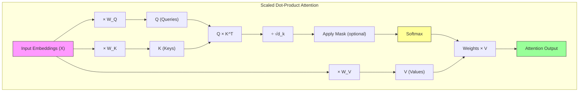
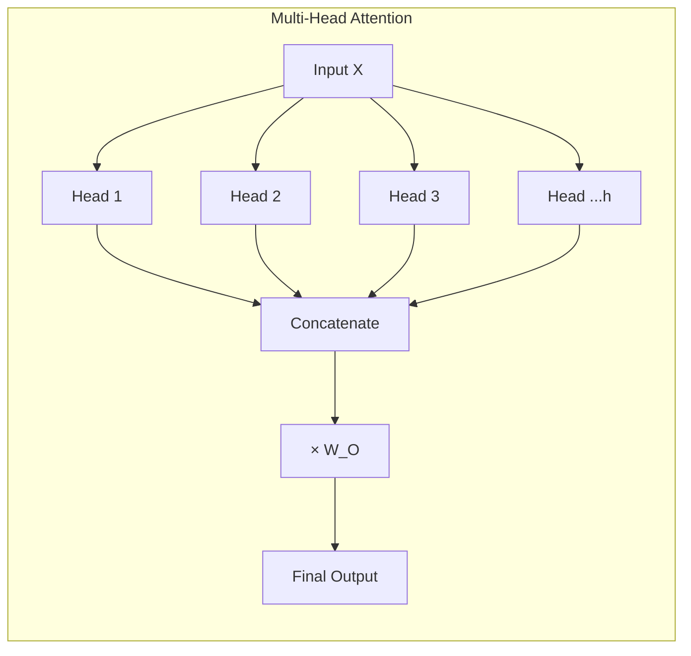

## Learning Objectives

- Understand why attention replaced recurrence as the core mechanism in sequence models
- Derive the scaled dot-product attention formula step by step
- Explain how multi-head attention enables parallel pattern recognition
- Trace through an attention calculation with concrete numbers
- Recognize how positional encoding compensates for attention's lack of order awareness

## Prerequisites

- Understanding of tokenization and embeddings (previous lessons)
- Matrix multiplication basics (a × b matrices)
- Softmax function intuition

## Core Concepts

### The Problem with Recurrence

Before attention, sequence models (RNNs, LSTMs) processed tokens one at a time, maintaining a hidden state that was updated at each step. This had two fundamental problems:

1. **Sequential bottleneck** — Token 100 can't be processed until tokens 1–99 are done. No parallelism.
2. **Long-range forgetting** — Information from early tokens gets diluted through many state updates. Even LSTMs with gating mechanisms struggle with sequences longer than a few hundred tokens.

Attention solves both problems by letting every token directly attend to every other token in a single operation, with no sequential dependency.

### Intuition: Attention as Soft Lookup

Think of attention as a **soft dictionary lookup**. In a regular dictionary, you have an exact key match:

```python
dictionary = {"capital_of_france": "Paris"}
result = dictionary["capital_of_france"]  # Exact match → "Paris"
```

Attention does a **soft** lookup where the query partially matches multiple keys, and the result is a weighted average of the corresponding values:

```python
# Pseudocode for attention
query = "What is the capital?"
keys = ["France is a country", "Paris is a city", "The Eiffel Tower is tall"]
values = [embedding_france, embedding_paris, embedding_eiffel]

scores = [similarity(query, k) for k in keys]  # [0.3, 0.9, 0.5]
weights = softmax(scores)                        # [0.15, 0.52, 0.33]
output = weighted_sum(weights, values)           # Mostly "Paris"
```

### Scaled Dot-Product Attention

The attention mechanism transforms each input token into three vectors by multiplying with learned weight matrices:

- **Query (Q)** — "What am I looking for?"
- **Key (K)** — "What do I contain?"
- **Value (V)** — "What information do I provide?"

The attention formula:

$$
\text{Attention}(Q, K, V) = \text{softmax}\left(\frac{QK^T}{\sqrt{d_k}}\right)V
$$

Let's break this down step by step:

**Step 1: Compute Q, K, V**

```python
import numpy as np

d_model = 4   # embedding dimension (small for illustration)
d_k = 3       # key/query dimension

np.random.seed(42)
W_Q = np.random.randn(d_model, d_k) * 0.1
W_K = np.random.randn(d_model, d_k) * 0.1
W_V = np.random.randn(d_model, d_k) * 0.1

# Input: 3 token embeddings (seq_len=3, d_model=4)
X = np.array([
    [1.0, 0.5, -0.2, 0.8],   # "The"
    [0.3, 0.9,  0.7, -0.1],  # "cat"
    [-0.5, 0.2, 1.0, 0.4],   # "sat"
])

Q = X @ W_Q   # (3, 3)
K = X @ W_K   # (3, 3)
V = X @ W_V   # (3, 3)

print("Q (queries):\n", Q.round(3))
print("K (keys):\n", K.round(3))
print("V (values):\n", V.round(3))
```

**Step 2: Compute attention scores**

```python
scores = Q @ K.T  # (3, 3) — each query compared with each key
print("Raw scores:\n", scores.round(3))

# Scale by sqrt(d_k) to prevent softmax saturation
scaled_scores = scores / np.sqrt(d_k)
print("Scaled scores:\n", scaled_scores.round(3))
```

**Why scale?** Without scaling, when d_k is large, the dot products grow in magnitude, pushing softmax outputs toward 0 and 1 (saturated). This kills gradients during training. Dividing by √d_k keeps the variance of the scores around 1.

**Step 3: Apply softmax to get attention weights**

```python
def softmax(x):
    exp_x = np.exp(x - np.max(x, axis=-1, keepdims=True))
    return exp_x / np.sum(exp_x, axis=-1, keepdims=True)

weights = softmax(scaled_scores)
print("Attention weights:\n", weights.round(3))
# Each row sums to 1.0 — it's a probability distribution
# Row i tells us how much token i attends to each other token
```

**Step 4: Compute weighted sum of values**

```python
output = weights @ V   # (3, 3)
print("Attention output:\n", output.round(3))
# Each output row is a weighted combination of all value vectors
```

### Multi-Head Attention

A single attention head can only focus on one type of relationship at a time. Multi-head attention runs **multiple attention operations in parallel**, each with different learned projections, then concatenates the results.

This lets the model simultaneously attend to:
- Syntactic relationships (head 1: subject ↔ verb)
- Semantic relationships (head 2: adjective ↔ noun)
- Positional relationships (head 3: nearby tokens)

```python
import torch
import torch.nn as nn

class MultiHeadAttention(nn.Module):
    def __init__(self, d_model: int, num_heads: int):
        super().__init__()
        assert d_model % num_heads == 0
        self.d_model = d_model
        self.num_heads = num_heads
        self.d_k = d_model // num_heads

        self.W_Q = nn.Linear(d_model, d_model)
        self.W_K = nn.Linear(d_model, d_model)
        self.W_V = nn.Linear(d_model, d_model)
        self.W_O = nn.Linear(d_model, d_model)

    def forward(self, Q, K, V, mask=None):
        batch_size = Q.size(0)
        seq_len = Q.size(1)

        Q = self.W_Q(Q).view(batch_size, seq_len, self.num_heads, self.d_k).transpose(1, 2)
        K = self.W_K(K).view(batch_size, -1, self.num_heads, self.d_k).transpose(1, 2)
        V = self.W_V(V).view(batch_size, -1, self.num_heads, self.d_k).transpose(1, 2)

        scores = torch.matmul(Q, K.transpose(-2, -1)) / (self.d_k ** 0.5)

        if mask is not None:
            scores = scores.masked_fill(mask == 0, float('-inf'))

        weights = torch.softmax(scores, dim=-1)
        context = torch.matmul(weights, V)

        context = context.transpose(1, 2).contiguous().view(
            batch_size, seq_len, self.d_model
        )
        return self.W_O(context)

mha = MultiHeadAttention(d_model=64, num_heads=8)
x = torch.randn(2, 10, 64)  # (batch=2, seq_len=10, d_model=64)
output = mha(x, x, x)       # Self-attention: Q=K=V=x
print(f"Input shape:  {x.shape}")
print(f"Output shape: {output.shape}")  # Same shape: (2, 10, 64)
```

### Self-Attention vs Cross-Attention

- **Self-attention:** Q, K, and V all come from the same sequence. Used in both encoders and decoders. "Each token attends to all other tokens in the same sequence."
- **Cross-attention:** Q comes from one sequence (e.g., decoder), K and V come from another (e.g., encoder output). Used in encoder-decoder models for tasks like translation. "Each decoder token attends to all encoder tokens."

### Causal (Masked) Attention

In decoder-only models (GPT), each token should only attend to tokens that came **before** it (not the future). This is enforced with a causal mask:

```python
seq_len = 5
causal_mask = torch.tril(torch.ones(seq_len, seq_len))
print("Causal mask:")
print(causal_mask)
# tensor([[1., 0., 0., 0., 0.],
#         [1., 1., 0., 0., 0.],
#         [1., 1., 1., 0., 0.],
#         [1., 1., 1., 1., 0.],
#         [1., 1., 1., 1., 1.]])
```

Positions with 0 get their attention scores set to -∞ before softmax, making the resulting weights exactly 0.

### Positional Encoding

Attention is **permutation-invariant** — shuffling the input tokens gives the same output (with shuffled rows). But word order matters in language! Positional encodings inject order information.

**Sinusoidal encoding** (original Transformer):

$$
PE_{(pos, 2i)} = \sin\left(\frac{pos}{10000^{2i/d_{model}}}\right)
$$

$$
PE_{(pos, 2i+1)} = \cos\left(\frac{pos}{10000^{2i/d_{model}}}\right)
$$

```python
def sinusoidal_encoding(max_len, d_model):
    pe = np.zeros((max_len, d_model))
    position = np.arange(max_len)[:, np.newaxis]
    div_term = np.exp(np.arange(0, d_model, 2) * -(np.log(10000.0) / d_model))

    pe[:, 0::2] = np.sin(position * div_term)
    pe[:, 1::2] = np.cos(position * div_term)
    return pe

pe = sinusoidal_encoding(100, 64)
print(f"Positional encoding shape: {pe.shape}")  # (100, 64)
print(f"Position 0: {pe[0, :8].round(3)}")
print(f"Position 1: {pe[1, :8].round(3)}")
```

Modern models (LLaMA, Mistral) use **Rotary Position Embeddings (RoPE)**, which encode position by rotating the Q and K vectors. RoPE naturally enables length generalization and is more effective for long sequences.

## Diagram





## Hands-On Exercise

### Exercise: Attention Calculation by Hand

Work through this attention computation manually, then verify with code.

**Given:**
- 3 tokens with d_model = 2 (tiny for hand calculation)
- Input embeddings:
  - Token 0 ("I"): [1.0, 0.0]
  - Token 1 ("love"): [0.0, 1.0]
  - Token 2 ("AI"): [1.0, 1.0]

- Weight matrices (d_k = 2):
  - W_Q = [[1, 0], [0, 1]]  (identity for simplicity)
  - W_K = [[1, 0], [0, 1]]
  - W_V = [[1, 0], [0, 1]]

**Step 1:** Compute Q, K, V (since weights are identity, Q=K=V=X)

**Step 2:** Compute QK^T:

```
QK^T = [[1·1 + 0·0,  1·0 + 0·1,  1·1 + 0·1],
        [0·1 + 1·0,  0·0 + 1·1,  0·1 + 1·1],
        [1·1 + 1·0,  1·0 + 1·1,  1·1 + 1·1]]
     = [[1, 0, 1],
        [0, 1, 1],
        [1, 1, 2]]
```

**Step 3:** Scale by √d_k = √2 ≈ 1.414:

```
Scaled = [[0.707, 0.000, 0.707],
          [0.000, 0.707, 0.707],
          [0.707, 0.707, 1.414]]
```

**Step 4:** Apply softmax to each row and compute the output.

Now verify your answer:

```python
import numpy as np

X = np.array([[1.0, 0.0], [0.0, 1.0], [1.0, 1.0]])
W_Q = W_K = W_V = np.eye(2)

Q = X @ W_Q
K = X @ W_K
V = X @ W_V

scores = Q @ K.T
scaled = scores / np.sqrt(2)

def softmax(x):
    exp_x = np.exp(x - np.max(x, axis=-1, keepdims=True))
    return exp_x / exp_x.sum(axis=-1, keepdims=True)

weights = softmax(scaled)
output = weights @ V

print("Attention weights:")
print(weights.round(4))
print("\nOutput:")
print(output.round(4))

print("\nInterpretation:")
for i, token in enumerate(["I", "love", "AI"]):
    top_attend = np.argmax(weights[i])
    tokens = ["I", "love", "AI"]
    print(f"  '{token}' attends most to '{tokens[top_attend]}' "
          f"(weight: {weights[i, top_attend]:.3f})")
```

**Challenge questions:**
1. Which token does "AI" attend to most, and why?
2. What happens if you increase d_k to 100 but don't scale? Compute softmax([70.7, 70.7, 141.4]) to see.
3. Add a causal mask so each token can only attend to itself and previous tokens. How does the output change?

## Key Takeaways

- Attention computes a weighted sum of value vectors, where weights are determined by query-key compatibility
- The scaling factor √d_k prevents dot products from growing too large and saturating softmax
- Multi-head attention runs h parallel attention operations with different projections, enabling the model to capture diverse relationship types simultaneously
- Causal masking prevents future information leakage in autoregressive (decoder-only) models
- Positional encoding is necessary because attention itself is order-agnostic — it treats input as a set, not a sequence
- Self-attention has O(n²) complexity in sequence length, which is the main bottleneck for long-context models

## External Resources

- [Attention Is All You Need (Vaswani et al., 2017)](https://arxiv.org/abs/1706.03762) — The foundational transformer paper
- [The Illustrated Transformer](https://jalammar.github.io/illustrated-transformer/) — Jay Alammar's visual walkthrough (essential reading)
- [The Annotated Transformer](https://nlp.seas.harvard.edu/annotated-transformer/) — Harvard NLP's line-by-line PyTorch implementation
- [3Blue1Brown: Attention in Transformers](https://www.youtube.com/watch?v=eMlx5fFNoYc) — Visual intuition for attention mechanics
- [RoPE Paper](https://arxiv.org/abs/2104.09864) — Rotary Position Embeddings used in modern models

## Quiz

See the quiz.json file for this module's quiz questions.
