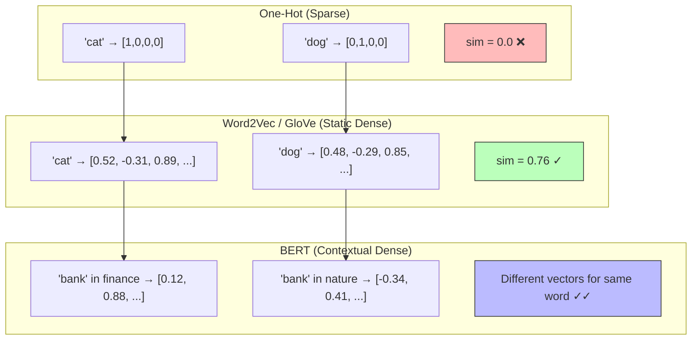

## Learning Objectives

- Understand how words and sentences are represented as dense numerical vectors
- Compare static embeddings (Word2Vec, GloVe) with contextual embeddings (BERT, GPT)
- Compute cosine similarity and Euclidean distance to measure semantic relationships
- Use embedding APIs and libraries to generate and compare vectors
- Recognize how embedding quality drives downstream model performance

## Prerequisites

- Understanding of tokenization (previous lesson)
- Basic linear algebra concepts (vectors, dot products)
- Python programming with NumPy

## Core Concepts

### From Tokens to Vectors

After tokenization converts text into integer IDs, we need a way to represent those IDs as continuous vectors that capture semantic meaning. This is where **embeddings** come in.

An embedding maps a discrete token ID to a dense vector of floating-point numbers:

```
"king"  → [0.52, -0.31, 0.89, 0.14, ..., -0.67]  (d dimensions)
"queen" → [0.49, -0.28, 0.91, 0.12, ..., -0.71]  (d dimensions)
```

The key insight: words with similar meanings should have vectors that are **close together** in this high-dimensional space. This property emerges naturally when embeddings are trained on large corpora.

### One-Hot Encoding: The Baseline

The simplest way to represent tokens is one-hot encoding — a vector of all zeros except for a single 1 at the token's index.

```python
import numpy as np

vocab = {"cat": 0, "dog": 1, "fish": 2, "bird": 3}
vocab_size = len(vocab)

cat_onehot = np.zeros(vocab_size)
cat_onehot[vocab["cat"]] = 1
print(f"cat:  {cat_onehot}")   # [1. 0. 0. 0.]
print(f"dog:  ", end="")
dog_onehot = np.zeros(vocab_size)
dog_onehot[vocab["dog"]] = 1
print(dog_onehot)               # [0. 1. 0. 0.]

similarity = np.dot(cat_onehot, dog_onehot)
print(f"Similarity(cat, dog) = {similarity}")  # 0.0
```

The problem is obvious: every word is equally "different" from every other word. Cat and dog have zero similarity, just like cat and refrigerator. One-hot vectors contain no semantic information.

### Word2Vec

Word2Vec (Mikolov et al., 2013) learns dense embeddings by training a shallow neural network on a simple objective: predict a word from its context (CBOW) or predict context words from a target word (Skip-gram).

**Skip-gram intuition:** If "cat" frequently appears near "pet," "fur," "meow," and "purr," then the model learns to place "cat" near those words in vector space. Since "dog" appears near "pet," "fur," "bark," and "wag," it ends up close to "cat" as well.

**The famous analogy:**

```
vec("king") - vec("man") + vec("woman") ≈ vec("queen")
```

This works because Word2Vec captures relational patterns as geometric directions.

```python
from gensim.models import KeyedVectors

wv = KeyedVectors.load_word2vec_format(
    "GoogleNews-vectors-negative300.bin", binary=True
)

result = wv.most_similar(positive=["king", "woman"], negative=["man"], topn=3)
print(result)
# [('queen', 0.7118), ('monarch', 0.6189), ('princess', 0.5902)]

print(f"Similarity(cat, dog) = {wv.similarity('cat', 'dog'):.4f}")      # ~0.76
print(f"Similarity(cat, car) = {wv.similarity('cat', 'car'):.4f}")      # ~0.20
print(f"Similarity(cat, feline) = {wv.similarity('cat', 'feline'):.4f}")  # ~0.58
```

### GloVe

GloVe (Global Vectors for Word Representation) takes a different approach from Word2Vec. Instead of predicting context from local windows, GloVe constructs a **co-occurrence matrix** for the entire corpus and factorizes it.

The key idea: the ratio of co-occurrence probabilities contains the semantic information.

| Word k   | P(k \| ice)  | P(k \| steam) | Ratio          |
|----------|-------------|--------------|----------------|
| solid    | large       | small        | large (>> 1)   |
| gas      | small       | large        | small (<< 1)   |
| water    | large       | large        | ≈ 1            |
| fashion  | small       | small        | ≈ 1            |

GloVe learns vectors such that the dot product of two word vectors approximates the logarithm of their co-occurrence count.

### Contextual Embeddings

Word2Vec and GloVe assign a **single** vector to each word regardless of context. But words are polysemous — "bank" means something different in "river bank" vs "bank account."

**Contextual embeddings** (ELMo, BERT, GPT) solve this by producing different vectors for the same word depending on its surrounding context.

```python
from transformers import AutoTokenizer, AutoModel
import torch

tokenizer = AutoTokenizer.from_pretrained("bert-base-uncased")
model = AutoModel.from_pretrained("bert-base-uncased")

def get_contextual_embedding(sentence, target_word):
    inputs = tokenizer(sentence, return_tensors="pt")
    with torch.no_grad():
        outputs = model(**inputs)

    tokens = tokenizer.tokenize(sentence)
    target_idx = tokens.index(target_word) + 1  # +1 for [CLS]
    return outputs.last_hidden_state[0, target_idx, :].numpy()

bank_finance = get_contextual_embedding(
    "I deposited money at the bank", "bank"
)
bank_river = get_contextual_embedding(
    "The river bank was covered in mud", "bank"
)

from numpy.linalg import norm
similarity = np.dot(bank_finance, bank_river) / (
    norm(bank_finance) * norm(bank_river)
)
print(f"Same word, different contexts: similarity = {similarity:.4f}")
# Typically around 0.6-0.7, showing the model captures the difference
```

### Similarity Metrics

**Cosine Similarity** is the standard metric for comparing embeddings. It measures the angle between two vectors, ignoring magnitude:

$$
\text{cosine\_similarity}(\vec{a}, \vec{b}) = \frac{\vec{a} \cdot \vec{b}}{||\vec{a}|| \cdot ||\vec{b}||}
$$

Range: -1 (opposite) to +1 (identical direction). In practice, trained embeddings rarely go below 0.

**Euclidean Distance** measures straight-line distance. It's sensitive to vector magnitude, which can be a problem if embeddings aren't normalized.

$$
d(\vec{a}, \vec{b}) = \sqrt{\sum_{i=1}^{n} (a_i - b_i)^2}
$$

```python
import numpy as np
from numpy.linalg import norm

def cosine_similarity(a, b):
    return np.dot(a, b) / (norm(a) * norm(b))

def euclidean_distance(a, b):
    return norm(a - b)

king = np.array([0.52, -0.31, 0.89, 0.14])
queen = np.array([0.49, -0.28, 0.91, 0.12])
apple = np.array([-0.22, 0.67, -0.15, 0.83])

print(f"cosine(king, queen) = {cosine_similarity(king, queen):.4f}")   # ~0.999
print(f"cosine(king, apple) = {cosine_similarity(king, apple):.4f}")   # ~-0.39
print(f"euclid(king, queen) = {euclidean_distance(king, queen):.4f}")  # ~0.05
print(f"euclid(king, apple) = {euclidean_distance(king, apple):.4f}")  # ~1.56
```

### Modern Embedding Models

For production applications, you'll typically use a pre-trained embedding model rather than training your own:

| Model | Dimensions | Context Window | Best For |
|-------|-----------|---------------|----------|
| OpenAI text-embedding-3-small | 1536 | 8191 tokens | General purpose, cost-effective |
| OpenAI text-embedding-3-large | 3072 | 8191 tokens | High-accuracy retrieval |
| sentence-transformers/all-MiniLM-L6-v2 | 384 | 256 tokens | Fast, local, open-source |
| BAAI/bge-large-en-v1.5 | 1024 | 512 tokens | Open-source, high quality |
| Cohere embed-english-v3.0 | 1024 | 512 tokens | Retrieval-optimized |

```python
from sentence_transformers import SentenceTransformer

model = SentenceTransformer("all-MiniLM-L6-v2")

sentences = [
    "The cat sat on the mat.",
    "A kitten was resting on the rug.",
    "Stock prices fell sharply today.",
]

embeddings = model.encode(sentences)
print(f"Shape: {embeddings.shape}")  # (3, 384)

from sklearn.metrics.pairwise import cosine_similarity as cs
sim_matrix = cs(embeddings)
print("Similarity matrix:")
print(sim_matrix.round(3))
# Cat/kitten sentences will have high similarity (~0.8)
# Cat vs stock sentence will have low similarity (~0.1)
```

## Diagram



## Hands-On Exercise

### Exercise: Embedding Similarity Explorer

Build a small tool that lets you explore embedding relationships interactively.

**Step 1: Set up the environment**

```bash
pip install sentence-transformers numpy scikit-learn matplotlib
```

**Step 2: Build the explorer**

```python
import numpy as np
from sentence_transformers import SentenceTransformer
from sklearn.metrics.pairwise import cosine_similarity
import matplotlib.pyplot as plt
from sklearn.decomposition import PCA

model = SentenceTransformer("all-MiniLM-L6-v2")

word_groups = {
    "animals": ["cat", "dog", "fish", "bird", "elephant", "tiger"],
    "tech": ["computer", "software", "algorithm", "database", "server", "cloud"],
    "food": ["pizza", "sushi", "burger", "pasta", "salad", "taco"],
    "emotions": ["happy", "sad", "angry", "excited", "peaceful", "anxious"],
}

all_words = []
labels = []
colors = []
color_map = {"animals": "red", "tech": "blue", "food": "green", "emotions": "purple"}

for group, words in word_groups.items():
    all_words.extend(words)
    labels.extend(words)
    colors.extend([color_map[group]] * len(words))

embeddings = model.encode(all_words)
print(f"Generated {len(embeddings)} embeddings of dimension {embeddings.shape[1]}")

pca = PCA(n_components=2)
coords = pca.fit_transform(embeddings)

plt.figure(figsize=(12, 8))
for i, (x, y) in enumerate(coords):
    plt.scatter(x, y, c=colors[i], s=100, alpha=0.7)
    plt.annotate(labels[i], (x, y), fontsize=9, ha="center", va="bottom")

plt.title("Word Embeddings Projected to 2D (PCA)")
plt.xlabel(f"PC1 ({pca.explained_variance_ratio_[0]:.1%} variance)")
plt.ylabel(f"PC2 ({pca.explained_variance_ratio_[1]:.1%} variance)")
plt.grid(True, alpha=0.3)
plt.tight_layout()
plt.savefig("embedding_clusters.png", dpi=150)
plt.show()
```

**Step 3: Compute pairwise similarities**

```python
sim_matrix = cosine_similarity(embeddings)

print("\nMost similar pairs:")
pairs = []
for i in range(len(all_words)):
    for j in range(i + 1, len(all_words)):
        pairs.append((all_words[i], all_words[j], sim_matrix[i][j]))

pairs.sort(key=lambda x: x[2], reverse=True)
for w1, w2, sim in pairs[:10]:
    print(f"  {w1:>12} ↔ {w2:<12} = {sim:.4f}")

print("\nLeast similar pairs:")
for w1, w2, sim in pairs[-5:]:
    print(f"  {w1:>12} ↔ {w2:<12} = {sim:.4f}")
```

**Step 4: Test sentence-level embeddings**

```python
sentences = [
    "I love programming in Python.",
    "Python is my favorite programming language.",
    "The python snake slithered through the grass.",
    "I enjoy writing code.",
    "The weather is beautiful today.",
]

sent_embeddings = model.encode(sentences)
sent_sim = cosine_similarity(sent_embeddings)

print("\nSentence Similarity Matrix:")
for i, s1 in enumerate(sentences):
    for j, s2 in enumerate(sentences):
        if j > i:
            print(f"  [{i}↔{j}] {sent_sim[i][j]:.3f}: '{s1[:40]}' vs '{s2[:40]}'")
```

**Challenge:** Find two sentences that have high word overlap but low embedding similarity (or vice versa). This demonstrates that embeddings capture meaning, not just word matching.

## Key Takeaways

- Embeddings transform discrete tokens into continuous vector spaces where geometric distance reflects semantic similarity
- Static embeddings (Word2Vec, GloVe) assign one fixed vector per word; contextual embeddings (BERT, GPT) produce different vectors depending on surrounding context
- Cosine similarity is the standard metric for comparing embeddings because it's invariant to vector magnitude
- The famous king − man + woman ≈ queen analogy demonstrates that embeddings capture relational structure
- Modern embedding models (OpenAI, sentence-transformers, BGE) are trained for specific tasks like retrieval and should be chosen based on your use case
- Embedding dimension is a trade-off: higher dimensions capture more nuance but require more storage and compute

## External Resources

- [Word2Vec Paper](https://arxiv.org/abs/1301.3781) — Original paper by Mikolov et al. that introduced distributed word representations
- [GloVe Project Page](https://nlp.stanford.edu/projects/glove/) — Stanford's GloVe implementation with pre-trained vectors
- [Sentence-Transformers Documentation](https://www.sbert.net/) — Comprehensive guide to modern sentence embedding models
- [OpenAI Embeddings Guide](https://platform.openai.com/docs/guides/embeddings) — Best practices for using OpenAI's embedding API
- [MTEB Leaderboard](https://huggingface.co/spaces/mteb/leaderboard) — Benchmark comparing embedding models across tasks

## Quiz

See the quiz.json file for this module's quiz questions.
