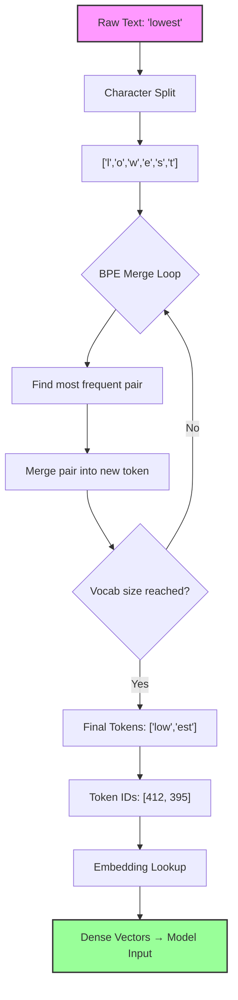

## Learning Objectives

- Understand why tokenization is the critical first step in any NLP pipeline
- Compare BPE, WordPiece, SentencePiece, and Unigram tokenization algorithms
- Use OpenAI's tiktoken library to tokenize and inspect text
- Analyze how vocabulary size and subword strategy affect model behavior
- Recognize tokenization pitfalls that impact multilingual and code-heavy inputs

## Prerequisites

- Basic Python programming (variables, loops, strings)
- Familiarity with what a language model does at a high level

## Core Concepts

### Why Tokenization Matters

Language models don't read text the way humans do. Before a model can process the sentence "The cat sat on the mat," it must convert each piece of text into a numerical ID from a fixed vocabulary. This process is called **tokenization**.

The choice of tokenizer directly affects:

- **Model capacity** — A larger vocabulary means the model can represent more words as single tokens, but the embedding matrix grows proportionally.
- **Sequence length** — Efficient tokenization produces fewer tokens for the same input, letting the model "see" more context within its window.
- **Multilingual ability** — Tokenizers trained primarily on English may split non-English words into many subwords, wasting capacity.
- **Cost** — API pricing is per-token, so tokenization efficiency has real financial impact.

### Byte-Pair Encoding (BPE)

BPE is the most widely used tokenization algorithm in modern LLMs (GPT-2, GPT-3, GPT-4, LLaMA). It was originally a data compression technique adapted for NLP.

**How BPE works:**

1. Start with a vocabulary of individual characters (bytes).
2. Count all adjacent pairs of tokens in the training corpus.
3. Merge the most frequent pair into a new token.
4. Repeat until the desired vocabulary size is reached.

**Example walkthrough:**

Suppose our corpus contains: `"low low low low low lower lower newest newest"`

Initial tokens (characters): `l, o, w, e, r, n, s, t, _`

| Step | Most Frequent Pair | New Token | Vocabulary Size |
|------|-------------------|-----------|----------------|
| 1    | `l` + `o`         | `lo`      | 10             |
| 2    | `lo` + `w`        | `low`     | 11             |
| 3    | `e` + `r`         | `er`      | 12             |
| 4    | `n` + `e`         | `ne`      | 13             |
| 5    | `ne` + `w`        | `new`     | 14             |

After enough merges, common words like "low" become single tokens while rare words are split into subwords.

### WordPiece

WordPiece (used in BERT and DistilBERT) is similar to BPE but uses a different merge criterion. Instead of merging the most frequent pair, WordPiece merges the pair that **maximizes the likelihood** of the training data under a unigram language model.

Key differences from BPE:

- Uses `##` prefix to indicate continuation subwords (e.g., "playing" → `["play", "##ing"]`)
- Optimizes for likelihood rather than frequency
- Tends to produce slightly different vocabularies for the same corpus

```python
from transformers import BertTokenizer

tokenizer = BertTokenizer.from_pretrained("bert-base-uncased")
tokens = tokenizer.tokenize("unbelievable")
print(tokens)  # ['un', '##bel', '##ie', '##va', '##ble']

ids = tokenizer.encode("unbelievable")
print(ids)  # [101, 4895, 12588, 9013, 3567, 3468, 102]
```

### SentencePiece

SentencePiece (used in T5, LLaMA, Mistral) treats the input as a raw byte stream rather than pre-tokenized words. This is critical for languages without clear word boundaries (Japanese, Chinese, Thai).

Key features:

- **Language-agnostic** — No need for language-specific pre-tokenization rules
- **Reversible** — You can always reconstruct the original text from tokens
- **Supports both BPE and Unigram** — SentencePiece is a framework, not an algorithm; it can use BPE or Unigram internally
- Uses `▁` (Unicode U+2581) to represent spaces

```python
import sentencepiece as spm

sp = spm.SentencePieceProcessor()
sp.load("path/to/model.model")

tokens = sp.encode_as_pieces("This is a test.")
print(tokens)  # ['▁This', '▁is', '▁a', '▁test', '.']

ids = sp.encode_as_ids("This is a test.")
print(ids)  # [717, 28, 9, 794, 5]
```

### Unigram Language Model

The Unigram algorithm (often used within SentencePiece) works differently from BPE. Instead of building up a vocabulary through merges, it starts with a large vocabulary and **prunes** it down.

1. Start with all substrings up to a maximum length.
2. Compute the loss (negative log likelihood) of the training corpus under the current vocabulary.
3. For each token, compute how much the loss would increase if it were removed.
4. Remove the tokens that increase the loss the least (keeping a target percentage).
5. Repeat until the desired vocabulary size is reached.

### tiktoken — OpenAI's Tokenizer

tiktoken is the fast, open-source tokenizer used by GPT-3.5 and GPT-4. It uses a BPE variant called **byte-level BPE** where the base vocabulary is all 256 bytes.

```python
import tiktoken

enc = tiktoken.encoding_for_model("gpt-4")

text = "Hello, world! This is a tokenization example."
tokens = enc.encode(text)
print(f"Text: {text}")
print(f"Tokens: {tokens}")
print(f"Token count: {len(tokens)}")
print(f"Decoded tokens: {[enc.decode([t]) for t in tokens]}")

# Compare token counts across different types of text
examples = [
    "The quick brown fox jumps over the lazy dog.",
    "def fibonacci(n): return n if n <= 1 else fibonacci(n-1) + fibonacci(n-2)",
    "これは日本語のテストです。",
    "Pneumonoultramicroscopicsilicovolcanoconiosis",
    "🎉🎊🥳🎈",
]

for ex in examples:
    toks = enc.encode(ex)
    ratio = len(ex) / len(toks)
    print(f"  '{ex[:40]}...' → {len(toks)} tokens (ratio: {ratio:.1f} chars/token)")
```

**Expected output:**

```
Text: Hello, world! This is a tokenization example.
Tokens: [9906, 11, 1917, 0, 1115, 374, 264, 4037, 2065, 3187, 13]
Token count: 11
Decoded tokens: ['Hello', ',', ' world', '!', ' This', ' is', ' a', ' token', 'ization', ' example', '.']
```

### Vocabulary Size Trade-offs

| Vocabulary Size | Pros | Cons |
|----------------|------|------|
| Small (< 10K)  | Smaller embedding matrix, handles unseen words | More tokens per text, longer sequences |
| Medium (32K-50K) | Good balance for most use cases | Standard choice for most models |
| Large (> 100K) | Fewer tokens per text, efficient encoding | Huge embedding matrix, sparse updates |

Real-world vocabulary sizes:

- GPT-2: 50,257 tokens
- GPT-4: ~100,256 tokens
- LLaMA: 32,000 tokens
- LLaMA 2: 32,000 tokens
- Mistral: 32,000 tokens

## Diagram



## Hands-On Exercise

### Exercise: Tokenization Comparison Lab

In this exercise, you'll explore how different tokenizers handle various types of text.

**Step 1: Install the libraries**

```bash
pip install tiktoken transformers sentencepiece
```

**Step 2: Create a comparison script**

```python
import tiktoken
from transformers import AutoTokenizer

gpt4_enc = tiktoken.encoding_for_model("gpt-4")
llama_tok = AutoTokenizer.from_pretrained("meta-llama/Llama-2-7b-hf")
bert_tok = AutoTokenizer.from_pretrained("bert-base-uncased")

test_texts = [
    "Machine learning is a subset of artificial intelligence.",
    "func main() { fmt.Println(\"Hello, Go!\") }",
    "The café served crème brûlée.",
    "Supercalifragilisticexpialidocious",
    "2024-01-15T10:30:00Z",
    "SELECT * FROM users WHERE age > 25 ORDER BY name;",
]

print(f"{'Text':<55} {'GPT-4':>7} {'LLaMA':>7} {'BERT':>7}")
print("-" * 80)

for text in test_texts:
    gpt4_count = len(gpt4_enc.encode(text))
    llama_count = len(llama_tok.encode(text))
    bert_count = len(bert_tok.encode(text))
    display = text[:52] + "..." if len(text) > 52 else text
    print(f"{display:<55} {gpt4_count:>7} {llama_count:>7} {bert_count:>7}")
```

**Step 3: Analyze the results**

Answer these questions:
1. Which tokenizer produces the fewest tokens for English text? Why?
2. Which tokenizer struggles most with code snippets? What explains the difference?
3. How does each tokenizer handle the accented characters in "crème brûlée"?
4. What's the character-to-token ratio for each tokenizer across the test texts?

**Step 4: Explore token boundaries**

```python
text = "Tokenization is fascinating!"
tokens = gpt4_enc.encode(text)

print("Token-by-token breakdown:")
for i, token_id in enumerate(tokens):
    token_text = gpt4_enc.decode([token_id])
    token_bytes = gpt4_enc.decode_single_token_bytes(token_id)
    print(f"  [{i}] ID={token_id:>6} | text='{token_text}' | bytes={token_bytes}")
```

**Challenge:** Find a word that all three tokenizers split differently. Explain why.

## Key Takeaways

- Tokenization converts raw text into numerical IDs from a fixed vocabulary — it's the bridge between human language and model computation
- BPE builds vocabulary bottom-up through iterative merging of frequent byte pairs; it's used in GPT models
- WordPiece optimizes for likelihood and uses `##` continuation markers; it's used in BERT
- SentencePiece operates on raw bytes without language-specific rules, making it ideal for multilingual models
- Vocabulary size is a fundamental trade-off: larger vocabularies mean shorter sequences but bigger embedding matrices
- Token count directly affects API costs, context window utilization, and model performance on different languages

## External Resources

- [Hugging Face Tokenizer Summary](https://huggingface.co/docs/transformers/tokenizer_summary) — Comprehensive overview of all tokenization algorithms with interactive examples
- [tiktoken GitHub Repository](https://github.com/openai/tiktoken) — OpenAI's official tokenizer with benchmarks and usage patterns
- [SentencePiece Paper](https://arxiv.org/abs/1808.06226) — The original paper describing the language-agnostic approach
- [OpenAI Tokenizer Tool](https://platform.openai.com/tokenizer) — Interactive web tool to visualize GPT tokenization in real time
- [BPE Original Paper by Sennrich et al.](https://arxiv.org/abs/1508.07909) — The paper that introduced BPE for neural machine translation

## Quiz

See the quiz.json file for this module's quiz questions.
