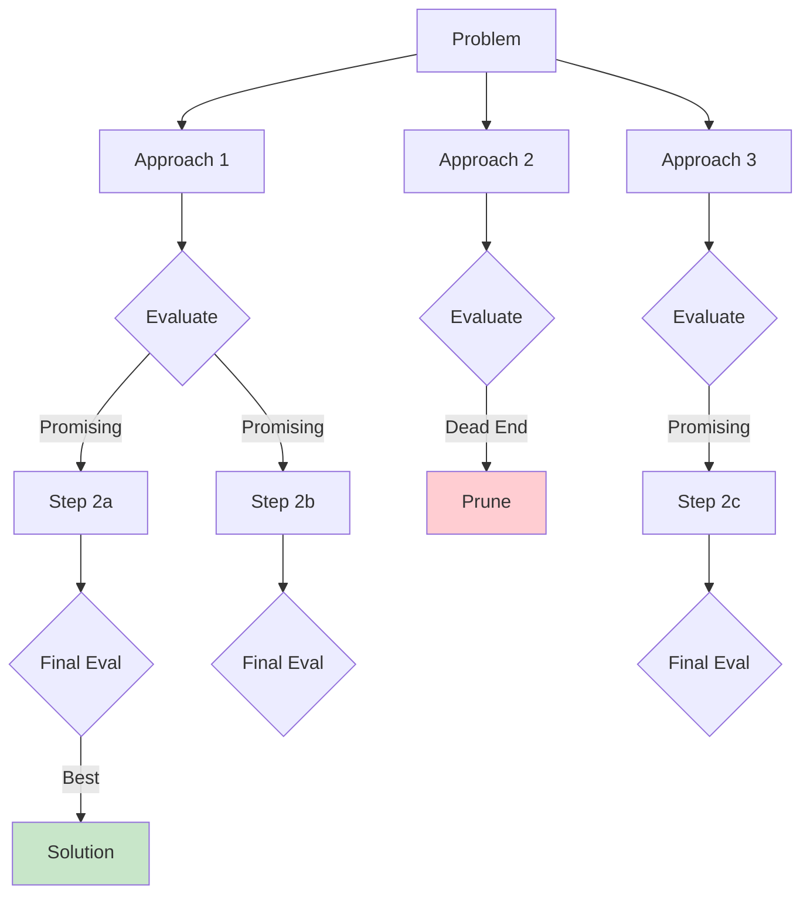
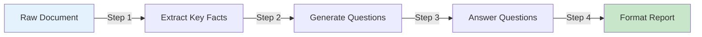

## Learning Objectives

- Implement chain-of-thought (CoT) prompting to improve reasoning accuracy
- Apply tree-of-thought and self-consistency for complex problem solving
- Design ReAct-style prompts that interleave reasoning with tool use
- Build prompt chains that decompose complex tasks into reliable subtasks
- Understand constitutional AI principles for self-correcting outputs

## Prerequisites

- Solid understanding of prompt fundamentals (system prompts, few-shot, parameters)
- Experience making API calls to LLMs
- Familiarity with basic Python data structures and control flow

## Core Concepts

### Chain-of-Thought Prompting

Chain-of-thought (CoT) prompting forces the model to show its reasoning step-by-step before arriving at an answer. This dramatically improves accuracy on math, logic, and multi-step reasoning tasks.

**Why it works:** LLMs generate tokens sequentially. By producing intermediate reasoning tokens, the model effectively uses its own output as a "scratchpad" — each step conditions the next, making the final answer more likely to be correct.

```python
from openai import OpenAI

client = OpenAI()

def solve_with_cot(problem: str) -> str:
    """Solve a problem using chain-of-thought prompting."""
    response = client.chat.completions.create(
        model="gpt-4o",
        messages=[
            {
                "role": "system",
                "content": (
                    "You are a precise math tutor. For every problem:\n"
                    "1. Identify what is being asked\n"
                    "2. List the known values\n"
                    "3. Show each calculation step\n"
                    "4. Verify the answer\n"
                    "5. State the final answer clearly\n"
                    "Think step by step."
                )
            },
            {"role": "user", "content": problem}
        ],
        temperature=0
    )
    return response.choices[0].message.content

problem = (
    "A store offers a 20% discount on a $150 jacket. "
    "Sales tax is 8.5%. What is the final price?"
)
print(solve_with_cot(problem))
```

**Zero-shot CoT** is even simpler — just append "Let's think step by step" to your prompt:

```python
def zero_shot_cot(question: str) -> str:
    response = client.chat.completions.create(
        model="gpt-4o",
        messages=[
            {
                "role": "user",
                "content": f"{question}\n\nLet's think step by step."
            }
        ],
        temperature=0
    )
    return response.choices[0].message.content
```

### Self-Consistency

Self-consistency samples multiple reasoning paths and takes the majority answer. It's a simple but powerful technique for problems where a single CoT chain might go astray.

```python
from collections import Counter
import re

def solve_with_self_consistency(
    problem: str, 
    n_samples: int = 5, 
    temperature: float = 0.7
) -> dict:
    """Sample multiple CoT paths and return the majority answer."""
    responses = client.chat.completions.create(
        model="gpt-4o",
        messages=[
            {
                "role": "system",
                "content": "Solve step by step. End with 'ANSWER: <number>'"
            },
            {"role": "user", "content": problem}
        ],
        temperature=temperature,
        n=n_samples
    )
    
    answers = []
    for choice in responses.choices:
        text = choice.message.content
        match = re.search(r"ANSWER:\s*(.+)", text)
        if match:
            answers.append(match.group(1).strip())
    
    counts = Counter(answers)
    majority_answer, majority_count = counts.most_common(1)[0]
    
    return {
        "answer": majority_answer,
        "confidence": majority_count / len(answers),
        "all_answers": dict(counts),
        "n_valid": len(answers)
    }

result = solve_with_self_consistency(
    "If 3 machines can produce 15 widgets in 4 hours, "
    "how many widgets can 7 machines produce in 6 hours?"
)
print(f"Answer: {result['answer']} (confidence: {result['confidence']:.0%})")
```

### Tree-of-Thought

Tree-of-thought (ToT) extends CoT by exploring multiple reasoning branches at each step, evaluating them, and pruning unpromising paths — similar to a search algorithm.



```python
def tree_of_thought(problem: str, n_branches: int = 3) -> str:
    """Implement tree-of-thought reasoning."""
    
    # Step 1: Generate multiple initial approaches
    branch_response = client.chat.completions.create(
        model="gpt-4o",
        messages=[
            {
                "role": "system",
                "content": (
                    f"Generate exactly {n_branches} different approaches to solve "
                    f"this problem. For each approach, write 2-3 sentences explaining "
                    f"the strategy. Label them Approach 1, Approach 2, etc."
                )
            },
            {"role": "user", "content": problem}
        ],
        temperature=0.8
    )
    approaches = branch_response.choices[0].message.content
    
    # Step 2: Evaluate and rank approaches
    eval_response = client.chat.completions.create(
        model="gpt-4o",
        messages=[
            {
                "role": "system",
                "content": (
                    "Evaluate each approach for correctness and feasibility. "
                    "Score each 1-10. Select the best approach and explain why."
                )
            },
            {"role": "user", "content": f"Problem: {problem}\n\nApproaches:\n{approaches}"}
        ],
        temperature=0
    )
    evaluation = eval_response.choices[0].message.content
    
    # Step 3: Execute the best approach in detail
    final_response = client.chat.completions.create(
        model="gpt-4o",
        messages=[
            {
                "role": "system",
                "content": "Execute the selected approach step by step to produce the final answer."
            },
            {
                "role": "user",
                "content": f"Problem: {problem}\n\nEvaluation:\n{evaluation}\n\n"
                           f"Now solve using the best approach."
            }
        ],
        temperature=0
    )
    return final_response.choices[0].message.content
```

### ReAct Prompting (Reasoning + Acting)

ReAct interleaves reasoning steps with actions (tool calls), enabling the model to gather information, reflect on it, and decide what to do next. This is the foundation of modern LLM agents.

```python
REACT_SYSTEM_PROMPT = """You are a research assistant with access to tools.

For each step, use this format:
Thought: [your reasoning about what to do next]
Action: [tool_name(parameters)]
Observation: [result from the tool — this will be provided]
... (repeat as needed)
Thought: I now have enough information to answer.
Answer: [your final answer]

Available tools:
- search(query) — Search the web for information
- calculate(expression) — Evaluate a math expression
- lookup(term) — Look up a term in the knowledge base
"""

def react_loop(question: str, max_steps: int = 5) -> str:
    """Simulate a ReAct loop with tool execution."""
    messages = [
        {"role": "system", "content": REACT_SYSTEM_PROMPT},
        {"role": "user", "content": question}
    ]
    
    tools = {
        "calculate": lambda expr: str(eval(expr)),
        "search": lambda query: f"[Simulated search result for: {query}]",
        "lookup": lambda term: f"[Simulated lookup for: {term}]",
    }
    
    for step in range(max_steps):
        response = client.chat.completions.create(
            model="gpt-4o",
            messages=messages,
            temperature=0,
            stop=["Observation:"]
        )
        
        assistant_text = response.choices[0].message.content
        messages.append({"role": "assistant", "content": assistant_text})
        
        if "Answer:" in assistant_text:
            return assistant_text.split("Answer:")[-1].strip()
        
        # Parse and execute the action
        if "Action:" in assistant_text:
            action_line = [
                l for l in assistant_text.split("\n") if l.startswith("Action:")
            ][0]
            tool_call = action_line.replace("Action:", "").strip()
            tool_name = tool_call.split("(")[0]
            tool_arg = tool_call.split("(")[1].rstrip(")")
            
            if tool_name in tools:
                result = tools[tool_name](tool_arg)
            else:
                result = f"Error: Unknown tool {tool_name}"
            
            messages.append({
                "role": "user",
                "content": f"Observation: {result}"
            })
    
    return "Max steps reached without a final answer."
```

### Prompt Chaining

Prompt chaining breaks a complex task into a pipeline of simpler, focused prompts. Each step's output feeds into the next step's input.



```python
def chained_document_analysis(document: str) -> dict:
    """Analyze a document using a chain of focused prompts."""
    
    # Step 1: Extract key facts
    facts_response = client.chat.completions.create(
        model="gpt-4o",
        messages=[
            {
                "role": "system",
                "content": "Extract the 5-10 most important facts from this document. "
                           "Return as a numbered list. Be specific and include numbers/dates."
            },
            {"role": "user", "content": document}
        ],
        temperature=0
    )
    facts = facts_response.choices[0].message.content
    
    # Step 2: Identify gaps and generate questions
    questions_response = client.chat.completions.create(
        model="gpt-4o",
        messages=[
            {
                "role": "system",
                "content": "Given these facts, identify 3 important questions that "
                           "remain unanswered or ambiguous. Focus on business impact."
            },
            {"role": "user", "content": f"Facts:\n{facts}\n\nOriginal document:\n{document}"}
        ],
        temperature=0.3
    )
    questions = questions_response.choices[0].message.content
    
    # Step 3: Generate executive summary
    summary_response = client.chat.completions.create(
        model="gpt-4o",
        messages=[
            {
                "role": "system",
                "content": "Write a 3-sentence executive summary based on the key facts. "
                           "Then list the open questions. Use bullet points."
            },
            {
                "role": "user",
                "content": f"Key Facts:\n{facts}\n\nOpen Questions:\n{questions}"
            }
        ],
        temperature=0.2
    )
    
    return {
        "facts": facts,
        "questions": questions,
        "summary": summary_response.choices[0].message.content
    }
```

### Constitutional AI and Self-Critique

Constitutional AI (CAI) gives the model a set of principles and asks it to critique and revise its own output. This creates a self-correcting loop.

```python
CONSTITUTION = [
    "Be helpful, harmless, and honest.",
    "Do not generate content that could be used to harm others.",
    "If uncertain, express uncertainty rather than guessing.",
    "Provide balanced perspectives on controversial topics.",
    "Respect user privacy — do not ask for personal information.",
]

def constitutional_generate(prompt: str) -> dict:
    """Generate a response, then self-critique and revise."""
    
    # Step 1: Initial response
    initial = client.chat.completions.create(
        model="gpt-4o",
        messages=[{"role": "user", "content": prompt}],
        temperature=0.7
    )
    initial_text = initial.choices[0].message.content
    
    # Step 2: Self-critique
    principles_text = "\n".join(f"- {p}" for p in CONSTITUTION)
    critique = client.chat.completions.create(
        model="gpt-4o",
        messages=[
            {
                "role": "system",
                "content": f"Review this response against these principles:\n{principles_text}\n\n"
                           f"List any violations or areas for improvement. "
                           f"If the response is fine, say 'No issues found.'"
            },
            {
                "role": "user",
                "content": f"Prompt: {prompt}\n\nResponse: {initial_text}"
            }
        ],
        temperature=0
    )
    critique_text = critique.choices[0].message.content
    
    # Step 3: Revise if needed
    if "no issues found" not in critique_text.lower():
        revision = client.chat.completions.create(
            model="gpt-4o",
            messages=[
                {
                    "role": "system",
                    "content": "Revise the response to address the critique while "
                               "remaining helpful and complete."
                },
                {
                    "role": "user",
                    "content": f"Original response:\n{initial_text}\n\n"
                               f"Critique:\n{critique_text}\n\nPlease revise."
                }
            ],
            temperature=0.3
        )
        return {
            "final": revision.choices[0].message.content,
            "critique": critique_text,
            "revised": True
        }
    
    return {"final": initial_text, "critique": critique_text, "revised": False}
```

## Hands-On Exercises

### Exercise 1: CoT vs Direct Comparison

Take 10 word problems from a math dataset (e.g., GSM8K). Solve each with:
- Direct prompting (no CoT)
- Zero-shot CoT ("Let's think step by step")
- Few-shot CoT (provide 2 worked examples)

Record accuracy for each method and analyze where CoT helps most.

### Exercise 2: Build a ReAct Agent

Implement a ReAct agent with these real tools:
- Wikipedia API for lookups
- A calculator for math
- A date/time utility

Test it on questions like: "What was the population of Tokyo when the last Olympics were held there, and what percentage of Japan's total population was that?"

### Exercise 3: Prompt Chain Pipeline

Build a 4-step prompt chain that:
1. Takes a raw customer support email
2. Classifies the issue type and urgency
3. Drafts a response
4. Reviews the response for tone and completeness

Evaluate on 5 different email types (complaint, question, feature request, bug report, praise).

## Key Takeaways

- **Chain-of-thought is your most reliable tool** — Adding "think step by step" can boost accuracy 20-40% on reasoning tasks with zero additional cost.
- **Self-consistency trades compute for accuracy** — Sample multiple paths when correctness matters more than latency.
- **Prompt chaining beats mega-prompts** — Breaking complex tasks into focused steps produces more reliable and debuggable systems.
- **ReAct bridges reasoning and action** — The think-act-observe loop is the conceptual foundation of every LLM agent framework.
- **Constitutional AI enables self-correction** — Models can critique and improve their own output when given clear principles.

## External Resources

- [Wei et al. — Chain-of-Thought Prompting (2022)](https://arxiv.org/abs/2201.11903) — Original CoT paper
- [Yao et al. — Tree of Thoughts (2023)](https://arxiv.org/abs/2305.10601) — ToT framework
- [Yao et al. — ReAct: Synergizing Reasoning and Acting (2023)](https://arxiv.org/abs/2210.03629) — ReAct paper
- [Wang et al. — Self-Consistency (2023)](https://arxiv.org/abs/2203.11171) — Self-consistency decoding
- [Bai et al. — Constitutional AI (2022)](https://arxiv.org/abs/2212.08073) — Anthropic's CAI paper
