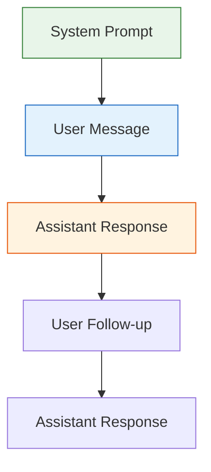
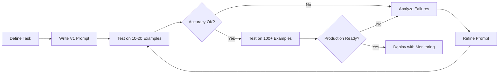

## Learning Objectives

- Understand the anatomy of a prompt and how LLMs interpret instructions
- Apply zero-shot, one-shot, and few-shot prompting techniques effectively
- Configure system prompts, temperature, top-p, and other generation parameters
- Design prompts that produce structured, reliable output (JSON, YAML, tables)
- Debug common prompt failures and iterate toward production-quality prompts

## Prerequisites

- Familiarity with transformer-based language models at a conceptual level
- Basic Python programming and comfort with API calls
- An OpenAI or equivalent API key for hands-on exercises

## Core Concepts

### Anatomy of a Prompt

Every interaction with an LLM is shaped by the prompt — the text you send to the model. Understanding prompt structure is the single highest-leverage skill in applied AI engineering.

A modern chat-based prompt has three distinct components:



| Component | Purpose | Who controls it |
|-----------|---------|-----------------|
| **System prompt** | Sets persona, constraints, output format | Developer |
| **User message** | The actual request or question | End user / developer |
| **Assistant message** | Model's response, can be pre-filled | Model / developer |

```python
from openai import OpenAI

client = OpenAI()

response = client.chat.completions.create(
    model="gpt-4o",
    messages=[
        {
            "role": "system",
            "content": "You are a senior Python engineer. Respond only with code. No explanations."
        },
        {
            "role": "user",
            "content": "Write a function that validates an email address using regex."
        }
    ]
)

print(response.choices[0].message.content)
```

### Zero-Shot Prompting

Zero-shot prompting provides no examples — you rely entirely on the model's pre-trained knowledge and clear instructions.

```python
def zero_shot_classify(text: str, categories: list[str]) -> str:
    """Classify text into one of the given categories with no examples."""
    category_list = ", ".join(categories)
    response = client.chat.completions.create(
        model="gpt-4o",
        messages=[
            {
                "role": "system",
                "content": f"Classify the following text into exactly one category: {category_list}. "
                           f"Respond with only the category name, nothing else."
            },
            {"role": "user", "content": text}
        ],
        temperature=0
    )
    return response.choices[0].message.content.strip()

result = zero_shot_classify(
    "The quarterly earnings exceeded analyst expectations by 15%",
    ["Sports", "Finance", "Technology", "Politics"]
)
print(result)  # Finance
```

**When zero-shot works well:** The task is well-understood by the model (classification, summarization, translation), instructions are unambiguous, and the expected output format is simple.

**When zero-shot fails:** Niche domains, unusual output formats, or tasks requiring specific reasoning patterns the model hasn't seen enough of during pre-training.

### Few-Shot Prompting

Few-shot prompting provides 2–8 examples in the prompt to demonstrate the expected input-output pattern. This is often the single most effective technique for improving output quality.

```python
def few_shot_sentiment(text: str) -> str:
    """Sentiment analysis using few-shot examples."""
    response = client.chat.completions.create(
        model="gpt-4o",
        messages=[
            {
                "role": "system",
                "content": "Analyze the sentiment of product reviews. "
                           "Respond with: POSITIVE, NEGATIVE, or MIXED."
            },
            {"role": "user", "content": "Great battery life but the screen is too dim."},
            {"role": "assistant", "content": "MIXED"},
            {"role": "user", "content": "Absolutely love this product! Best purchase ever."},
            {"role": "assistant", "content": "POSITIVE"},
            {"role": "user", "content": "Broke after two days. Complete waste of money."},
            {"role": "assistant", "content": "NEGATIVE"},
            {"role": "user", "content": text}
        ],
        temperature=0
    )
    return response.choices[0].message.content.strip()
```

**Few-shot design principles:**

1. **Diversity** — Examples should cover edge cases and boundary conditions, not just the happy path.
2. **Ordering** — Place the most representative examples first and the most complex last.
3. **Consistency** — Use identical formatting across all examples.
4. **Relevance** — Examples similar to the expected input perform better than generic ones.

### System Prompts and Instruction Tuning

System prompts are the developer's primary lever for shaping model behavior. A well-crafted system prompt acts like a job description for the AI.

```python
SYSTEM_PROMPT = """You are a medical triage assistant for a hospital emergency department.

RULES:
1. Never diagnose conditions — only suggest triage priority levels (1-5).
2. Always recommend the patient seek professional medical evaluation.
3. If symptoms suggest a life-threatening emergency, respond with PRIORITY 1 immediately.
4. Ask clarifying questions if the symptom description is vague.
5. Respond in the patient's language.

TRIAGE LEVELS:
- 1: Immediate (life-threatening)
- 2: Emergent (potentially life-threatening)
- 3: Urgent (serious but not life-threatening)
- 4: Less urgent (minor conditions)
- 5: Non-urgent (minor issues)

OUTPUT FORMAT:
Priority: [1-5]
Reasoning: [brief explanation]
Recommendation: [next steps]
"""
```

### Generation Parameters

The parameters you pass to the API fundamentally change the model's behavior. Understanding them is essential.

```python
def demonstrate_temperature(prompt: str):
    """Show how temperature affects output diversity."""
    for temp in [0.0, 0.5, 1.0, 1.5]:
        responses = []
        for _ in range(3):
            r = client.chat.completions.create(
                model="gpt-4o",
                messages=[{"role": "user", "content": prompt}],
                temperature=temp,
                max_tokens=50
            )
            responses.append(r.choices[0].message.content.strip())
        
        unique = len(set(responses))
        print(f"Temperature {temp}: {unique}/3 unique responses")
        for resp in responses:
            print(f"  → {resp[:80]}...")

demonstrate_temperature("Name a color.")
```

**Parameter reference:**

| Parameter | Range | Effect |
|-----------|-------|--------|
| `temperature` | 0.0–2.0 | Controls randomness. 0 = deterministic, higher = more creative/random |
| `top_p` | 0.0–1.0 | Nucleus sampling — considers tokens whose cumulative probability reaches top_p |
| `max_tokens` | 1–context limit | Hard cap on response length |
| `frequency_penalty` | -2.0–2.0 | Penalizes tokens based on frequency in the response so far |
| `presence_penalty` | -2.0–2.0 | Penalizes tokens that have appeared at all in the response |
| `stop` | list of strings | Sequences that halt generation |

**Guidelines for parameter selection:**

- **Factual / deterministic tasks** (extraction, classification, code): `temperature=0`, `top_p=1`
- **Creative tasks** (writing, brainstorming): `temperature=0.7–1.0`, `top_p=0.9`
- **Exploration / diversity**: `temperature=1.2+`, `top_p=0.95`

> Never set both `temperature` and `top_p` to non-default values simultaneously — pick one axis of control.

### Structured Output

Production systems need predictable output formats. Modern APIs support structured output natively.

```python
from pydantic import BaseModel

class ExtractedEntity(BaseModel):
    name: str
    entity_type: str  # PERSON, ORG, LOCATION, DATE
    confidence: float

class ExtractionResult(BaseModel):
    entities: list[ExtractedEntity]
    summary: str

response = client.beta.chat.completions.parse(
    model="gpt-4o",
    messages=[
        {
            "role": "system",
            "content": "Extract named entities from the text. "
                       "Assign a confidence score between 0 and 1."
        },
        {
            "role": "user",
            "content": "Apple CEO Tim Cook announced the new iPhone 16 "
                       "at the Steve Jobs Theater in Cupertino on September 9, 2024."
        }
    ],
    response_format=ExtractionResult,
)

result = response.choices[0].message.parsed
for entity in result.entities:
    print(f"{entity.name} ({entity.entity_type}) — {entity.confidence:.0%}")
```

For APIs that don't support native structured output, use explicit format instructions:

```python
FORMAT_INSTRUCTION = """
Respond ONLY with valid JSON matching this schema:
{
  "intent": "one of: question, command, feedback, other",
  "confidence": 0.0 to 1.0,
  "entities": ["list", "of", "key", "entities"],
  "requires_followup": true or false
}
Do not include any text before or after the JSON.
"""
```

### Prompt Iteration Workflow

Prompt engineering is an empirical discipline. Follow this systematic workflow:



**Debugging checklist when a prompt fails:**

1. **Ambiguity** — Is the instruction open to multiple interpretations?
2. **Missing context** — Does the model have all the information it needs?
3. **Conflicting instructions** — Do your rules contradict each other?
4. **Output format** — Is the expected format clearly specified and demonstrated?
5. **Edge cases** — Did you handle nulls, empty inputs, and unusual inputs?

## Hands-On Exercises

### Exercise 1: Build a Multi-Format Extractor

Create a prompt that extracts the following from a job posting:
- Job title, company name, location (city/state/remote)
- Required years of experience
- Top 5 required skills
- Salary range (if mentioned)

Output as structured JSON. Test with at least 3 different job postings.

### Exercise 2: Temperature Experimentation

Write a script that generates product names for a fictional AI startup using temperatures 0.0, 0.5, 1.0, and 1.5. Run each 10 times and analyze:
- How many unique names were generated at each temperature?
- At what temperature do names start becoming nonsensical?
- Which temperature gives the best creativity-quality trade-off?

### Exercise 3: System Prompt A/B Test

Design two different system prompts for a customer support chatbot:
- Version A: Friendly, conversational, emoji-using
- Version B: Professional, concise, formal

Test both with 5 identical customer queries and evaluate:
- Response quality
- Response length
- Tone appropriateness

## Key Takeaways

- **Prompt structure matters** — System prompts, user messages, and few-shot examples each serve distinct roles. Master all three.
- **Zero-shot first, few-shot when needed** — Start simple. Add examples only when zero-shot accuracy is insufficient.
- **Parameters are not magic** — Temperature and top_p have precise mathematical effects on token sampling. Understand them.
- **Structured output is non-negotiable in production** — Use native structured output or rigorous format instructions to ensure parseable responses.
- **Iterate empirically** — Prompt engineering is closer to experimental science than programming. Test, measure, refine.

## External Resources

- [OpenAI Prompt Engineering Guide](https://platform.openai.com/docs/guides/prompt-engineering) — Official best practices
- [Anthropic Prompt Engineering Guide](https://docs.anthropic.com/en/docs/build-with-claude/prompt-engineering/overview) — Detailed techniques for Claude models
- [DAIR.ai Prompt Engineering Guide](https://www.promptingguide.ai/) — Comprehensive open-source reference
- [Lilian Weng: Prompt Engineering](https://lilianweng.github.io/posts/2023-03-15-prompt-engineering/) — In-depth technical blog post
- [Microsoft Prompt Engineering Techniques](https://learn.microsoft.com/en-us/azure/ai-services/openai/concepts/prompt-engineering) — Enterprise-focused patterns
