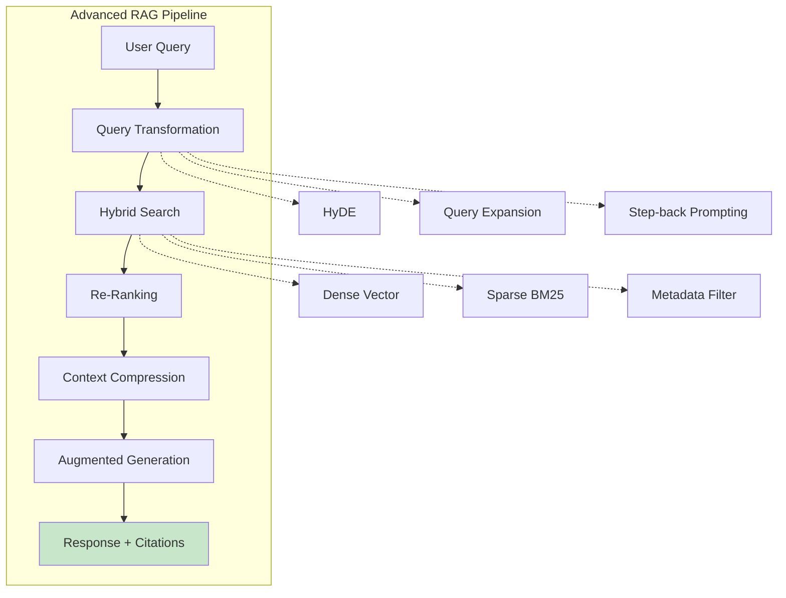
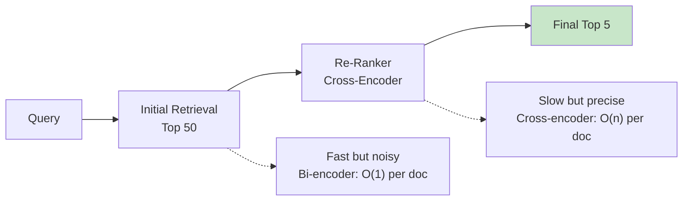

## Learning Objectives

- Implement hybrid search combining dense vectors with sparse keyword matching
- Apply re-ranking models to improve retrieval precision after initial recall
- Build HyDE (Hypothetical Document Embeddings) for improved query representation
- Design parent-child chunking strategies that preserve document context
- Evaluate RAG systems using RAGAS metrics (faithfulness, relevancy, context precision)

## Prerequisites

- Working knowledge of RAG architecture and vector databases
- Experience building basic RAG pipelines
- Familiarity with embedding models and similarity search

## Core Concepts

### Why Basic RAG Falls Short

A naive RAG pipeline — embed query, retrieve top-K, generate — fails in predictable ways:

| Failure Mode | Cause | Solution |
|-------------|-------|----------|
| Missed relevant docs | Query/document vocabulary mismatch | Hybrid search, HyDE |
| Noisy context | Top-K includes irrelevant chunks | Re-ranking |
| Lost context | Chunks too small, missing surrounding info | Parent-child chunking |
| Wrong granularity | Entire section retrieved when only a sentence matters | Multi-granularity indexing |
| No quality signal | No way to measure if RAG is working | RAGAS evaluation |



### Hybrid Search: Dense + Sparse

Dense (vector) search captures semantic meaning but misses exact keyword matches. Sparse (BM25/TF-IDF) search finds exact terms but misses paraphrases. Hybrid search combines both.

```python
import numpy as np
from rank_bm25 import BM25Okapi
from dataclasses import dataclass

@dataclass
class SearchResult:
    chunk_id: str
    content: str
    dense_score: float
    sparse_score: float
    combined_score: float

class HybridSearcher:
    """Combines dense vector search with BM25 sparse search."""
    
    def __init__(self, chunks: list, embeddings: np.ndarray, alpha: float = 0.7):
        self.chunks = chunks
        self.embeddings = embeddings
        self.alpha = alpha  # weight for dense search (1-alpha for sparse)
        
        tokenized = [c.content.lower().split() for c in chunks]
        self.bm25 = BM25Okapi(tokenized)
    
    def search(
        self, 
        query: str, 
        query_embedding: np.ndarray, 
        top_k: int = 10
    ) -> list[SearchResult]:
        """Perform hybrid search with reciprocal rank fusion."""
        # Dense search
        dense_scores = np.dot(self.embeddings, query_embedding)
        dense_ranks = np.argsort(-dense_scores)
        
        # Sparse search
        sparse_scores = self.bm25.get_scores(query.lower().split())
        sparse_ranks = np.argsort(-sparse_scores)
        
        # Reciprocal Rank Fusion (RRF)
        k = 60  # RRF constant
        combined = {}
        
        for rank, idx in enumerate(dense_ranks):
            combined[idx] = combined.get(idx, 0) + self.alpha / (k + rank + 1)
        
        for rank, idx in enumerate(sparse_ranks):
            combined[idx] = combined.get(idx, 0) + (1 - self.alpha) / (k + rank + 1)
        
        sorted_results = sorted(combined.items(), key=lambda x: -x[1])[:top_k]
        
        return [
            SearchResult(
                chunk_id=self.chunks[idx].chunk_id,
                content=self.chunks[idx].content,
                dense_score=float(dense_scores[idx]),
                sparse_score=float(sparse_scores[idx]),
                combined_score=score
            )
            for idx, score in sorted_results
        ]
```

### Re-Ranking

Re-ranking uses a cross-encoder model to re-score the initial retrieval results. Cross-encoders are much more accurate than bi-encoders (embedding models) because they process the query and document together, enabling full attention between them.

```python
from sentence_transformers import CrossEncoder

class Reranker:
    """Re-rank retrieval results using a cross-encoder."""
    
    def __init__(self, model_name: str = "cross-encoder/ms-marco-MiniLM-L-6-v2"):
        self.model = CrossEncoder(model_name)
    
    def rerank(
        self, 
        query: str, 
        results: list[SearchResult], 
        top_k: int = 5
    ) -> list[SearchResult]:
        pairs = [(query, r.content) for r in results]
        scores = self.model.predict(pairs)
        
        scored_results = list(zip(results, scores))
        scored_results.sort(key=lambda x: -x[1])
        
        return [
            SearchResult(
                chunk_id=r.chunk_id,
                content=r.content,
                dense_score=r.dense_score,
                sparse_score=r.sparse_score,
                combined_score=float(score)
            )
            for r, score in scored_results[:top_k]
        ]
```



### HyDE: Hypothetical Document Embeddings

HyDE tackles the query-document asymmetry problem. User queries are short and may use different vocabulary than the documents. HyDE asks the LLM to generate a *hypothetical* answer, then uses that answer's embedding for retrieval.

```python
from openai import OpenAI

client = OpenAI()

class HyDERetriever:
    """Hypothetical Document Embeddings for improved retrieval."""
    
    def __init__(self, index, model: str = "gpt-4o-mini"):
        self.index = index
        self.model = model
    
    def generate_hypothetical_document(self, query: str) -> str:
        """Generate a hypothetical answer to use as the search query."""
        response = client.chat.completions.create(
            model=self.model,
            messages=[
                {
                    "role": "system",
                    "content": (
                        "Write a short, detailed passage that would answer the "
                        "following question. Write as if this passage exists in a "
                        "technical document. Do not say 'I don't know'. Just write "
                        "the passage."
                    )
                },
                {"role": "user", "content": query}
            ],
            temperature=0.3,
            max_tokens=200
        )
        return response.choices[0].message.content
    
    def search(self, query: str, top_k: int = 5) -> list:
        hypothetical_doc = self.generate_hypothetical_document(query)
        
        # Embed the hypothetical document instead of the raw query
        results = self.index.query(hypothetical_doc, top_k=top_k)
        
        return results
```

### Parent-Child Chunking

Standard chunking forces a trade-off: small chunks are precise for retrieval but lack context for generation; large chunks have context but hurt retrieval precision. Parent-child chunking solves this by indexing small chunks but returning the parent (larger) chunk for context.

```python
@dataclass
class HierarchicalChunk:
    child_content: str
    parent_content: str
    metadata: dict
    child_id: str
    parent_id: str

class ParentChildChunker:
    """Index small chunks, retrieve large parent chunks."""
    
    def __init__(
        self, 
        parent_chunk_size: int = 2000, 
        child_chunk_size: int = 400,
        child_overlap: int = 50
    ):
        self.parent_chunk_size = parent_chunk_size
        self.child_chunk_size = child_chunk_size
        self.child_overlap = child_overlap
    
    def chunk(self, document) -> list[HierarchicalChunk]:
        text = document.content
        hierarchical_chunks = []
        
        # Create parent chunks
        parent_chunks = []
        for i in range(0, len(text), self.parent_chunk_size):
            parent_chunks.append(text[i:i + self.parent_chunk_size])
        
        # Create child chunks within each parent
        for parent_idx, parent_text in enumerate(parent_chunks):
            parent_id = f"{document.doc_id}_parent_{parent_idx}"
            
            start = 0
            child_idx = 0
            while start < len(parent_text):
                end = start + self.child_chunk_size
                child_text = parent_text[start:end]
                
                hierarchical_chunks.append(HierarchicalChunk(
                    child_content=child_text,
                    parent_content=parent_text,
                    metadata={
                        **document.metadata,
                        "parent_index": parent_idx,
                        "child_index": child_idx,
                    },
                    child_id=f"{parent_id}_child_{child_idx}",
                    parent_id=parent_id,
                ))
                
                start = end - self.child_overlap
                child_idx += 1
        
        return hierarchical_chunks

class ParentChildRAG:
    """RAG pipeline that indexes child chunks but generates from parents."""
    
    def __init__(self):
        self.child_index = {}      # child_id -> embedding
        self.parent_store = {}     # child_id -> parent_content
        self.child_store = {}      # child_id -> child_content
    
    def ingest(self, hierarchical_chunks: list[HierarchicalChunk]):
        for hc in hierarchical_chunks:
            embedding = get_embedding(hc.child_content)
            self.child_index[hc.child_id] = embedding
            self.parent_store[hc.child_id] = hc.parent_content
            self.child_store[hc.child_id] = hc.child_content
    
    def query(self, question: str, top_k: int = 3) -> str:
        query_emb = get_embedding(question)
        
        # Search using child embeddings
        scores = {
            cid: cosine_similarity(query_emb, emb)
            for cid, emb in self.child_index.items()
        }
        top_children = sorted(scores.items(), key=lambda x: -x[1])[:top_k]
        
        # Retrieve unique parent chunks
        seen_parents = set()
        context_chunks = []
        for child_id, score in top_children:
            parent = self.parent_store[child_id]
            if parent not in seen_parents:
                context_chunks.append(parent)
                seen_parents.add(parent)
        
        context = "\n\n---\n\n".join(context_chunks)
        
        return generate_answer(question, context)
```

### RAG Evaluation with RAGAS

RAGAS (Retrieval Augmented Generation Assessment) provides standardized metrics for evaluating RAG systems.

```python
from ragas import evaluate
from ragas.metrics import (
    faithfulness,
    answer_relevancy,
    context_precision,
    context_recall,
)
from datasets import Dataset

eval_data = {
    "question": [
        "What is our refund policy?",
        "How do I reset my password?",
    ],
    "answer": [
        "Our refund policy allows returns within 30 days of purchase.",
        "You can reset your password by clicking 'Forgot Password' on the login page.",
    ],
    "contexts": [
        ["Refund Policy: Customers may return products within 30 days for a full refund."],
        ["Password Reset: Navigate to login, click 'Forgot Password', enter your email."],
    ],
    "ground_truth": [
        "Products can be returned within 30 days for a full refund.",
        "Click 'Forgot Password' on the login page and follow the email instructions.",
    ],
}

dataset = Dataset.from_dict(eval_data)

results = evaluate(
    dataset=dataset,
    metrics=[faithfulness, answer_relevancy, context_precision, context_recall],
)

print(results)
# {'faithfulness': 0.95, 'answer_relevancy': 0.88, 
#  'context_precision': 0.92, 'context_recall': 0.90}
```

**RAGAS metrics explained:**

| Metric | What it measures | Range | Ideal |
|--------|-----------------|-------|-------|
| **Faithfulness** | Is the answer supported by the retrieved context? | 0–1 | >0.9 |
| **Answer Relevancy** | Does the answer address the question? | 0–1 | >0.85 |
| **Context Precision** | Are the retrieved chunks relevant to the question? | 0–1 | >0.85 |
| **Context Recall** | Does the retrieved context cover the ground truth? | 0–1 | >0.8 |

### Multi-Modal RAG

Modern RAG systems process images, tables, and diagrams alongside text.

```python
import base64

def encode_image(image_path: str) -> str:
    with open(image_path, "rb") as f:
        return base64.b64encode(f.read()).decode("utf-8")

def multimodal_rag_query(question: str, text_context: str, image_paths: list[str]) -> str:
    """RAG query that includes both text and image context."""
    messages = [
        {
            "role": "system",
            "content": "Answer based on the provided text and images. Cite sources."
        },
        {
            "role": "user",
            "content": [
                {"type": "text", "text": f"Context:\n{text_context}\n\nQuestion: {question}"},
                *[
                    {
                        "type": "image_url",
                        "image_url": {
                            "url": f"data:image/png;base64,{encode_image(path)}"
                        }
                    }
                    for path in image_paths
                ]
            ]
        }
    ]
    
    response = client.chat.completions.create(
        model="gpt-4o",
        messages=messages,
        temperature=0
    )
    return response.choices[0].message.content
```

## Hands-On Exercises

### Exercise 1: Hybrid Search Implementation

Build a hybrid search system using BM25 + dense embeddings with RRF fusion. Compare retrieval quality (precision@5, recall@5) against dense-only and sparse-only search on a dataset of 1000 documents.

### Exercise 2: Re-Ranking Pipeline

Implement a two-stage retrieval pipeline: retrieve top-50 with a bi-encoder, then re-rank to top-5 with a cross-encoder. Measure latency and quality trade-offs.

### Exercise 3: RAGAS Evaluation Suite

Build an evaluation harness for a RAG system with at least 20 question-answer pairs. Run RAGAS evaluation and identify the weakest metric. Implement one improvement and re-evaluate.

## Key Takeaways

- **Hybrid search is almost always better** than dense-only search — combine BM25 with vector search using reciprocal rank fusion.
- **Re-ranking is the highest-ROI improvement** for retrieval quality — a small cross-encoder dramatically improves precision.
- **HyDE bridges the query-document gap** — generating a hypothetical answer before embedding often retrieves better results.
- **Parent-child chunking preserves context** — index small chunks for precision, return large chunks for generation.
- **RAGAS gives you a quality scorecard** — Measure faithfulness, relevancy, context precision, and recall to guide improvements systematically.

## External Resources

- [RAGAS Documentation](https://docs.ragas.io/) — RAG evaluation framework
- [Gao et al. — HyDE Paper (2023)](https://arxiv.org/abs/2212.10496) — Hypothetical Document Embeddings
- [Sentence Transformers: Cross-Encoders](https://www.sbert.net/docs/cross_encoder/usage/usage.html) — Re-ranking models
- [LlamaIndex: Advanced RAG](https://docs.llamaindex.ai/en/stable/optimizing/production_rag/) — Production optimization techniques
- [Cohere Reranker](https://cohere.com/rerank) — Production reranking API
