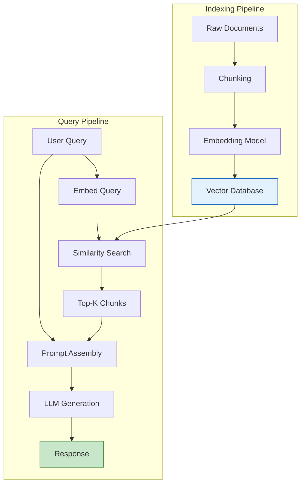

## Learning Objectives

- Understand the end-to-end architecture of Retrieval-Augmented Generation systems
- Implement document ingestion, chunking, embedding, and retrieval pipelines
- Choose appropriate chunking strategies for different content types
- Build a working RAG system from scratch using Python
- Evaluate retrieval quality and diagnose common failure modes

## Prerequisites

- Understanding of embeddings and vector similarity
- Experience with prompt engineering basics
- Familiarity with Python file I/O and basic data structures

## Core Concepts

### What is Retrieval-Augmented Generation?

RAG solves a fundamental limitation of LLMs: their knowledge is frozen at training time and limited to what fits in the context window. Instead of relying solely on parametric knowledge (weights), RAG retrieves relevant information from an external knowledge base at query time and injects it into the prompt.



**Why RAG matters:**

| Approach | Pros | Cons |
|----------|------|------|
| **Fine-tuning** | Fast inference, internalized knowledge | Expensive, stale data, hallucination risk |
| **Long context** | Simple, no infrastructure | Costly per query, slow, attention degradation |
| **RAG** | Fresh data, verifiable sources, cost-efficient | Retrieval latency, chunking complexity |

### Document Ingestion

The first step is loading documents from various sources into a consistent format.

```python
from dataclasses import dataclass, field
from pathlib import Path
import hashlib
from datetime import datetime

@dataclass
class Document:
    content: str
    metadata: dict = field(default_factory=dict)
    doc_id: str = ""
    
    def __post_init__(self):
        if not self.doc_id:
            self.doc_id = hashlib.sha256(
                self.content.encode()
            ).hexdigest()[:16]

class DocumentLoader:
    """Load documents from multiple sources."""
    
    @staticmethod
    def from_text_files(directory: str) -> list[Document]:
        docs = []
        for path in Path(directory).rglob("*.txt"):
            content = path.read_text(encoding="utf-8")
            docs.append(Document(
                content=content,
                metadata={
                    "source": str(path),
                    "filename": path.name,
                    "loaded_at": datetime.now().isoformat()
                }
            ))
        return docs
    
    @staticmethod
    def from_markdown(filepath: str) -> Document:
        content = Path(filepath).read_text(encoding="utf-8")
        return Document(
            content=content,
            metadata={"source": filepath, "type": "markdown"}
        )
    
    @staticmethod
    def from_pdf(filepath: str) -> Document:
        import fitz  # PyMuPDF
        doc = fitz.open(filepath)
        pages = []
        for page_num, page in enumerate(doc):
            pages.append(page.get_text())
        
        return Document(
            content="\n\n".join(pages),
            metadata={
                "source": filepath,
                "type": "pdf",
                "num_pages": len(pages)
            }
        )
```

### Chunking Strategies

Chunking is the most critical and underappreciated step in RAG. Poor chunking leads to poor retrieval, which leads to poor generation — no amount of prompt engineering can fix it.

```python
from dataclasses import dataclass

@dataclass
class Chunk:
    content: str
    metadata: dict
    chunk_id: str
    doc_id: str

class ChunkingStrategy:
    """Multiple chunking strategies for different content types."""
    
    @staticmethod
    def fixed_size(
        document: Document,
        chunk_size: int = 512,
        overlap: int = 50
    ) -> list[Chunk]:
        """Simple fixed-size chunking with overlap."""
        text = document.content
        chunks = []
        start = 0
        idx = 0
        
        while start < len(text):
            end = start + chunk_size
            chunk_text = text[start:end]
            
            chunks.append(Chunk(
                content=chunk_text,
                metadata={**document.metadata, "chunk_index": idx},
                chunk_id=f"{document.doc_id}_{idx}",
                doc_id=document.doc_id
            ))
            start = end - overlap
            idx += 1
        
        return chunks
    
    @staticmethod
    def recursive_character(
        document: Document,
        chunk_size: int = 1000,
        overlap: int = 200,
        separators: list[str] | None = None
    ) -> list[Chunk]:
        """Split on hierarchical separators, falling back to smaller ones."""
        if separators is None:
            separators = ["\n\n", "\n", ". ", " ", ""]
        
        def split_text(text: str, seps: list[str]) -> list[str]:
            if not seps:
                return [text]
            
            sep = seps[0]
            remaining_seps = seps[1:]
            
            if sep == "":
                parts = list(text)
            else:
                parts = text.split(sep)
            
            result = []
            current = ""
            
            for part in parts:
                candidate = current + sep + part if current else part
                if len(candidate) <= chunk_size:
                    current = candidate
                else:
                    if current:
                        result.append(current)
                    if len(part) > chunk_size:
                        result.extend(split_text(part, remaining_seps))
                    else:
                        current = part
            
            if current:
                result.append(current)
            
            return result
        
        texts = split_text(document.content, separators)
        
        return [
            Chunk(
                content=t,
                metadata={**document.metadata, "chunk_index": i},
                chunk_id=f"{document.doc_id}_{i}",
                doc_id=document.doc_id
            )
            for i, t in enumerate(texts)
        ]
    
    @staticmethod
    def semantic_chunking(
        document: Document,
        embedding_model,
        similarity_threshold: float = 0.75
    ) -> list[Chunk]:
        """Split based on semantic similarity between sentences."""
        import numpy as np
        
        sentences = document.content.split(". ")
        if len(sentences) <= 1:
            return [Chunk(
                content=document.content,
                metadata=document.metadata,
                chunk_id=f"{document.doc_id}_0",
                doc_id=document.doc_id
            )]
        
        embeddings = embedding_model.encode(sentences)
        
        chunks = []
        current_sentences = [sentences[0]]
        chunk_idx = 0
        
        for i in range(1, len(sentences)):
            sim = np.dot(embeddings[i], embeddings[i - 1]) / (
                np.linalg.norm(embeddings[i]) * np.linalg.norm(embeddings[i - 1])
            )
            
            if sim >= similarity_threshold:
                current_sentences.append(sentences[i])
            else:
                chunks.append(Chunk(
                    content=". ".join(current_sentences) + ".",
                    metadata={**document.metadata, "chunk_index": chunk_idx},
                    chunk_id=f"{document.doc_id}_{chunk_idx}",
                    doc_id=document.doc_id
                ))
                current_sentences = [sentences[i]]
                chunk_idx += 1
        
        if current_sentences:
            chunks.append(Chunk(
                content=". ".join(current_sentences) + ".",
                metadata={**document.metadata, "chunk_index": chunk_idx},
                chunk_id=f"{document.doc_id}_{chunk_idx}",
                doc_id=document.doc_id
            ))
        
        return chunks
```

**Chunking strategy selection guide:**

| Strategy | Best For | Chunk Size |
|----------|----------|------------|
| Fixed-size | Homogeneous text, quick prototyping | 256–1024 tokens |
| Recursive character | Mixed-format documents, general purpose | 500–1500 chars |
| Semantic | Technical docs, research papers | Dynamic |
| Markdown headers | Structured documentation | Per-section |
| Sentence window | Conversational / narrative text | 3–5 sentences |

### Embedding and Indexing

Once documents are chunked, each chunk is embedded into a vector and stored for similarity search.

```python
from openai import OpenAI
import numpy as np

client = OpenAI()

class EmbeddingIndex:
    """Simple in-memory vector index for prototyping."""
    
    def __init__(self, model: str = "text-embedding-3-small"):
        self.model = model
        self.chunks: list[Chunk] = []
        self.embeddings: np.ndarray | None = None
    
    def add_chunks(self, chunks: list[Chunk], batch_size: int = 100):
        """Embed and index chunks in batches."""
        all_embeddings = []
        
        for i in range(0, len(chunks), batch_size):
            batch = chunks[i:i + batch_size]
            response = client.embeddings.create(
                model=self.model,
                input=[c.content for c in batch]
            )
            batch_embeddings = [e.embedding for e in response.data]
            all_embeddings.extend(batch_embeddings)
        
        new_embeddings = np.array(all_embeddings)
        
        if self.embeddings is None:
            self.embeddings = new_embeddings
        else:
            self.embeddings = np.vstack([self.embeddings, new_embeddings])
        
        self.chunks.extend(chunks)
    
    def query(self, query_text: str, top_k: int = 5) -> list[tuple[Chunk, float]]:
        """Retrieve most similar chunks to a query."""
        response = client.embeddings.create(
            model=self.model,
            input=query_text
        )
        query_embedding = np.array(response.data[0].embedding)
        
        similarities = np.dot(self.embeddings, query_embedding) / (
            np.linalg.norm(self.embeddings, axis=1) * np.linalg.norm(query_embedding)
        )
        
        top_indices = np.argsort(similarities)[::-1][:top_k]
        
        return [
            (self.chunks[i], float(similarities[i]))
            for i in top_indices
        ]
```

### Putting It All Together: A Complete RAG Pipeline

```python
class RAGPipeline:
    """Complete RAG pipeline from documents to answers."""
    
    def __init__(self, model: str = "gpt-4o"):
        self.index = EmbeddingIndex()
        self.model = model
    
    def ingest(self, documents: list[Document], chunk_size: int = 1000):
        """Ingest documents: chunk, embed, and index."""
        all_chunks = []
        for doc in documents:
            chunks = ChunkingStrategy.recursive_character(
                doc, chunk_size=chunk_size
            )
            all_chunks.extend(chunks)
        
        self.index.add_chunks(all_chunks)
        print(f"Indexed {len(all_chunks)} chunks from {len(documents)} documents")
    
    def query(self, question: str, top_k: int = 5) -> str:
        """Answer a question using retrieved context."""
        results = self.index.query(question, top_k=top_k)
        
        context = "\n\n---\n\n".join([
            f"[Source: {chunk.metadata.get('source', 'unknown')}]\n{chunk.content}"
            for chunk, score in results
        ])
        
        response = client.chat.completions.create(
            model=self.model,
            messages=[
                {
                    "role": "system",
                    "content": (
                        "Answer the user's question based ONLY on the provided context. "
                        "If the context doesn't contain enough information, say so. "
                        "Cite your sources using [Source: filename] notation."
                    )
                },
                {
                    "role": "user",
                    "content": f"Context:\n{context}\n\nQuestion: {question}"
                }
            ],
            temperature=0
        )
        
        return response.choices[0].message.content

# Usage
rag = RAGPipeline()
docs = DocumentLoader.from_text_files("./knowledge_base/")
rag.ingest(docs)
answer = rag.query("What is our refund policy for enterprise customers?")
print(answer)
```

### Evaluating Retrieval Quality

Retrieval quality directly determines RAG output quality. Measure it separately from generation.

```python
def evaluate_retrieval(
    questions: list[str],
    expected_doc_ids: list[list[str]],
    index: EmbeddingIndex,
    top_k: int = 5
) -> dict:
    """Evaluate retrieval using precision, recall, and MRR."""
    total_precision = 0
    total_recall = 0
    total_mrr = 0
    
    for question, expected_ids in zip(questions, expected_doc_ids):
        results = index.query(question, top_k=top_k)
        retrieved_ids = [chunk.doc_id for chunk, _ in results]
        
        relevant_retrieved = set(retrieved_ids) & set(expected_ids)
        precision = len(relevant_retrieved) / len(retrieved_ids) if retrieved_ids else 0
        recall = len(relevant_retrieved) / len(expected_ids) if expected_ids else 0
        
        rr = 0
        for rank, doc_id in enumerate(retrieved_ids, 1):
            if doc_id in expected_ids:
                rr = 1 / rank
                break
        
        total_precision += precision
        total_recall += recall
        total_mrr += rr
    
    n = len(questions)
    return {
        "precision@k": total_precision / n,
        "recall@k": total_recall / n,
        "mrr": total_mrr / n,
    }
```

## Hands-On Exercises

### Exercise 1: Build a Documentation Q&A System

Index a set of markdown documentation files (e.g., a project's README, API docs, contributing guide). Build a RAG system that answers questions about the project. Test with 10 questions and evaluate retrieval quality.

### Exercise 2: Chunking Strategy Comparison

Take a 10-page technical document. Chunk it using three different strategies (fixed-size, recursive, semantic). For each strategy, run 5 test queries and compare:
- Number of chunks produced
- Retrieval relevance (manual scoring 1-5)
- Answer quality from the full RAG pipeline

### Exercise 3: Failure Analysis

Intentionally create scenarios that break your RAG system:
- Questions that span multiple chunks
- Questions about topics not in the knowledge base
- Ambiguous questions with multiple valid interpretations

Document each failure and propose a mitigation strategy.

## Key Takeaways

- **RAG is a system, not a model** — Success depends on every component: ingestion, chunking, embedding, retrieval, and generation.
- **Chunking is the highest-leverage optimization** — Before tuning prompts or models, ensure your chunks capture coherent, useful information units.
- **Evaluate retrieval independently** — Measure precision, recall, and MRR on retrieval alone before evaluating end-to-end answer quality.
- **Start simple, iterate** — Begin with recursive character splitting and cosine similarity. Add complexity only when metrics demand it.
- **Metadata is essential** — Store source information, timestamps, and section headers. They enable filtering and citation.

## External Resources

- [Lewis et al. — Retrieval-Augmented Generation (2020)](https://arxiv.org/abs/2005.11401) — Original RAG paper
- [LangChain RAG Tutorial](https://python.langchain.com/docs/tutorials/rag/) — Practical implementation guide
- [LlamaIndex Documentation](https://docs.llamaindex.ai/) — Comprehensive RAG framework
- [Pinecone Learning Center: RAG](https://www.pinecone.io/learn/retrieval-augmented-generation/) — Industry perspective
- [Anthropic: Contextual Retrieval](https://www.anthropic.com/news/contextual-retrieval) — Advanced contextualization techniques
