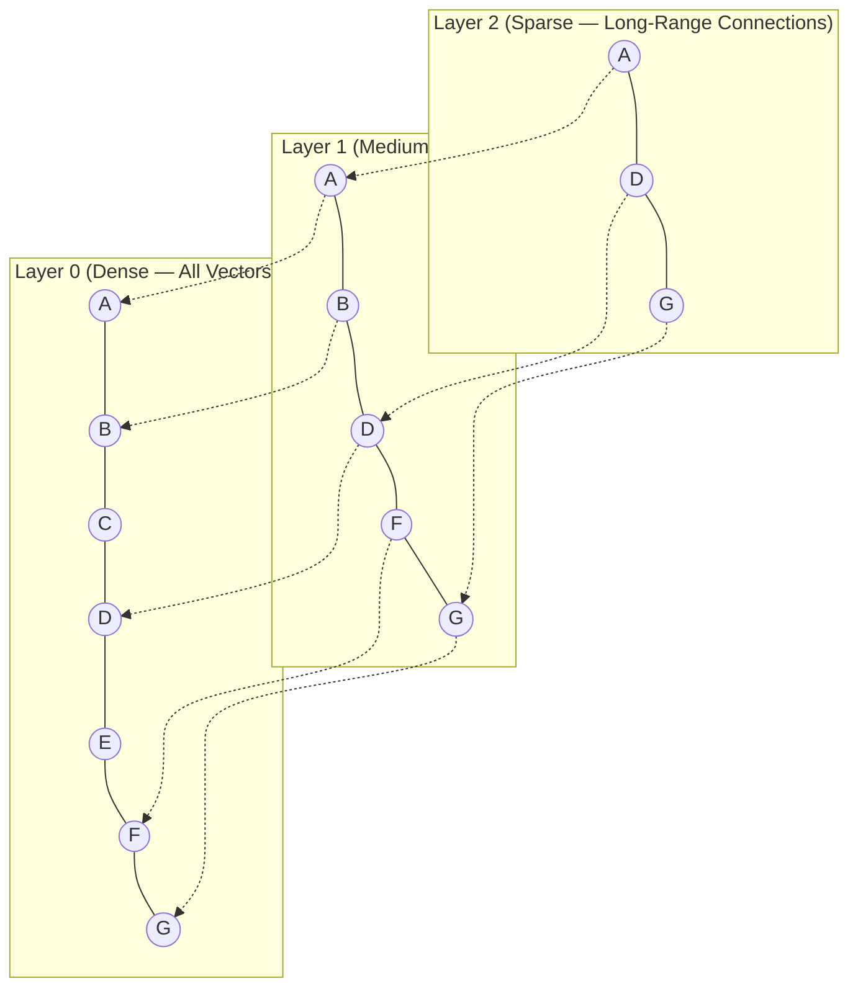
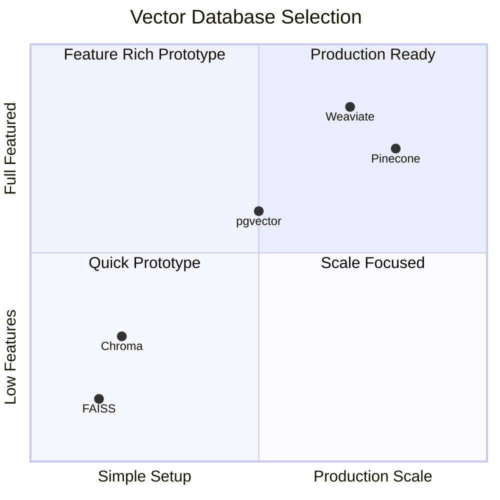

## Learning Objectives

- Understand vector database internals: indexing algorithms, similarity metrics, and storage engines
- Compare FAISS, Chroma, Pinecone, Weaviate, and pgvector for different use cases
- Implement HNSW index configuration and understand its trade-offs
- Design metadata filtering strategies for hybrid vector + keyword search
- Benchmark and optimize vector search performance for production workloads

## Prerequisites

- Understanding of embeddings and cosine similarity
- Familiarity with RAG architecture concepts
- Basic database knowledge (SQL or NoSQL)

## Core Concepts

### Why Specialized Vector Storage?

Traditional databases index data by exact values — B-trees for equality/range queries, inverted indices for text search. Vector search is fundamentally different: you need to find the K vectors most *similar* to a query vector in high-dimensional space (768–3072 dimensions). Brute-force search is O(n·d) and doesn't scale. Vector databases use approximate nearest neighbor (ANN) algorithms to make this tractable.


### Similarity Metrics

The choice of distance metric affects both accuracy and performance.

```python
import numpy as np

def cosine_similarity(a: np.ndarray, b: np.ndarray) -> float:
    """Most common for text embeddings. Range: [-1, 1]."""
    return np.dot(a, b) / (np.linalg.norm(a) * np.linalg.norm(b))

def euclidean_distance(a: np.ndarray, b: np.ndarray) -> float:
    """L2 distance. Range: [0, ∞). Lower is more similar."""
    return np.linalg.norm(a - b)

def dot_product(a: np.ndarray, b: np.ndarray) -> float:
    """Inner product. Faster than cosine when vectors are normalized."""
    return np.dot(a, b)

# For normalized vectors, cosine similarity == dot product
a = np.random.randn(768)
a_norm = a / np.linalg.norm(a)
b = np.random.randn(768)
b_norm = b / np.linalg.norm(b)

print(f"Cosine sim: {cosine_similarity(a_norm, b_norm):.6f}")
print(f"Dot product: {dot_product(a_norm, b_norm):.6f}")  # Same value
```

| Metric | Best For | Notes |
|--------|----------|-------|
| **Cosine similarity** | Text embeddings (OpenAI, Cohere) | Magnitude-invariant |
| **Dot product** | Pre-normalized embeddings | Fastest computation |
| **Euclidean (L2)** | Image embeddings, spatial data | Sensitive to magnitude |
| **Manhattan (L1)** | Sparse, high-dimensional spaces | More robust to outliers |

### HNSW: The Dominant Indexing Algorithm

Hierarchical Navigable Small World (HNSW) is the most widely used ANN algorithm. It builds a multi-layer graph where each node is a vector and edges connect nearby vectors.



**HNSW parameters:**

| Parameter | What it controls | Trade-off |
|-----------|-----------------|-----------|
| `M` | Max connections per node | Higher = better recall, more memory |
| `ef_construction` | Beam width during index building | Higher = better index quality, slower build |
| `ef_search` | Beam width during query | Higher = better recall, slower query |

### FAISS: Meta's Vector Library

FAISS is a library, not a database — it provides blazing-fast ANN search in memory but has no persistence, no metadata filtering, and no API server.

```python
import faiss
import numpy as np

dimension = 768
n_vectors = 100_000

# Generate sample data
vectors = np.random.randn(n_vectors, dimension).astype("float32")
faiss.normalize_L2(vectors)

# Flat index (brute-force, exact, baseline)
index_flat = faiss.IndexFlatIP(dimension)
index_flat.add(vectors)

# HNSW index (approximate, fast)
index_hnsw = faiss.IndexHNSWFlat(dimension, 32)  # M=32
index_hnsw.hnsw.efConstruction = 200
index_hnsw.hnsw.efSearch = 64
index_hnsw.add(vectors)

# IVF index (partition-based, good for large datasets)
n_clusters = 256
quantizer = faiss.IndexFlatIP(dimension)
index_ivf = faiss.IndexIVFFlat(quantizer, dimension, n_clusters)
index_ivf.train(vectors)
index_ivf.add(vectors)
index_ivf.nprobe = 16  # search 16 of 256 clusters

# Benchmark
query = np.random.randn(1, dimension).astype("float32")
faiss.normalize_L2(query)

import time

for name, index in [("Flat", index_flat), ("HNSW", index_hnsw), ("IVF", index_ivf)]:
    start = time.perf_counter()
    for _ in range(100):
        distances, indices = index.search(query, 10)
    elapsed = (time.perf_counter() - start) / 100
    print(f"{name:6s}: {elapsed*1000:.2f}ms per query")
```

### ChromaDB: Developer-Friendly Embedded Store

Chroma is designed for prototyping and small-to-medium RAG applications. It runs embedded in your Python process with zero configuration.

```python
import chromadb
from chromadb.utils import embedding_functions

# Initialize with persistence
chroma_client = chromadb.PersistentClient(path="./chroma_db")

openai_ef = embedding_functions.OpenAIEmbeddingFunction(
    model_name="text-embedding-3-small"
)

collection = chroma_client.get_or_create_collection(
    name="knowledge_base",
    embedding_function=openai_ef,
    metadata={"hnsw:space": "cosine"}
)

# Add documents with metadata
collection.add(
    documents=[
        "RAG combines retrieval with generation for accurate responses.",
        "HNSW builds a navigable small-world graph for ANN search.",
        "Fine-tuning adapts a pre-trained model to a specific task.",
    ],
    metadatas=[
        {"topic": "rag", "difficulty": "beginner"},
        {"topic": "vector-db", "difficulty": "intermediate"},
        {"topic": "fine-tuning", "difficulty": "intermediate"},
    ],
    ids=["doc1", "doc2", "doc3"]
)

# Query with metadata filtering
results = collection.query(
    query_texts=["How does vector search work?"],
    n_results=2,
    where={"difficulty": "intermediate"}
)

for doc, dist in zip(results["documents"][0], results["distances"][0]):
    print(f"[{dist:.4f}] {doc}")
```

### Pinecone: Managed Cloud Vector Database

Pinecone is a fully managed service optimized for production workloads at scale.

```python
from pinecone import Pinecone, ServerlessSpec

pc = Pinecone(api_key="YOUR_API_KEY")

pc.create_index(
    name="rag-knowledge-base",
    dimension=1536,
    metric="cosine",
    spec=ServerlessSpec(cloud="aws", region="us-east-1")
)

index = pc.Index("rag-knowledge-base")

# Upsert vectors with metadata
index.upsert(vectors=[
    {
        "id": "doc-001",
        "values": [0.1] * 1536,  # your embedding here
        "metadata": {
            "source": "handbook.pdf",
            "section": "refund-policy",
            "last_updated": "2024-09-15"
        }
    },
])

# Query with metadata filter
results = index.query(
    vector=[0.1] * 1536,
    top_k=5,
    include_metadata=True,
    filter={
        "source": {"$eq": "handbook.pdf"},
        "last_updated": {"$gte": "2024-01-01"}
    }
)

for match in results.matches:
    print(f"Score: {match.score:.4f} | {match.metadata}")
```

### pgvector: Postgres-Native Vector Search

pgvector adds vector similarity search to PostgreSQL — ideal when your data already lives in Postgres.

```python
import psycopg2

conn = psycopg2.connect("postgresql://localhost/mydb")
cur = conn.cursor()

# Enable extension and create table
cur.execute("CREATE EXTENSION IF NOT EXISTS vector;")
cur.execute("""
    CREATE TABLE IF NOT EXISTS documents (
        id SERIAL PRIMARY KEY,
        content TEXT NOT NULL,
        metadata JSONB DEFAULT '{}',
        embedding vector(1536),
        created_at TIMESTAMP DEFAULT NOW()
    );
""")

# Create HNSW index for fast search
cur.execute("""
    CREATE INDEX IF NOT EXISTS documents_embedding_idx 
    ON documents 
    USING hnsw (embedding vector_cosine_ops)
    WITH (m = 16, ef_construction = 64);
""")

# Insert with embedding
cur.execute(
    "INSERT INTO documents (content, metadata, embedding) VALUES (%s, %s, %s)",
    ("RAG architecture overview", '{"topic": "rag"}', "[0.1, 0.2, ...]")
)

# Similarity search with metadata filter
cur.execute("""
    SELECT content, metadata, 1 - (embedding <=> %s::vector) AS similarity
    FROM documents
    WHERE metadata->>'topic' = 'rag'
    ORDER BY embedding <=> %s::vector
    LIMIT 5;
""", (query_embedding, query_embedding))

results = cur.fetchall()
```

### Comparison Matrix



| Feature | FAISS | Chroma | Pinecone | Weaviate | pgvector |
|---------|-------|--------|----------|----------|----------|
| **Type** | Library | Embedded/Server | Managed cloud | Self-host/Cloud | Postgres extension |
| **Metadata filter** | No | Yes | Yes | Yes (GraphQL) | Yes (SQL) |
| **Persistence** | Manual | Built-in | Managed | Built-in | Postgres |
| **Max scale** | Billions | Millions | Billions | Billions | ~10M practical |
| **Latency** | <1ms | 5-20ms | 10-50ms | 5-30ms | 10-50ms |
| **Best for** | Research, benchmarks | Prototyping, small apps | Production SaaS | Multi-modal, hybrid | Existing Postgres stack |

## Hands-On Exercises

### Exercise 1: Benchmark Indexing Algorithms

Using FAISS, compare Flat, HNSW, and IVF indices on 100K vectors:
- Build time, query latency, memory usage
- Recall@10 compared to exact search
- How do HNSW parameters (M, efSearch) affect the recall/speed trade-off?

### Exercise 2: Build a Filtered RAG System with Chroma

Create a RAG system using Chroma where documents have metadata (department, date, access_level). Implement queries that combine semantic similarity with metadata filters.

### Exercise 3: pgvector Migration

Take an existing PostgreSQL application and add vector search capability. Design a migration that adds an embedding column, creates an HNSW index, and implements a search endpoint.

## Key Takeaways

- **HNSW dominates ANN search** — Understand its M and ef parameters; they directly control the recall-speed trade-off.
- **Choose based on your stack** — FAISS for research, Chroma for prototypes, Pinecone/Weaviate for production, pgvector if you already use Postgres.
- **Metadata filtering is essential** — Pure vector search is rarely enough; combine it with structured filters for production quality.
- **Normalize your embeddings** — If using cosine similarity, normalize once at insertion time and use dot product for faster search.
- **Benchmark on your data** — Published benchmarks are useful but your data distribution, query patterns, and scale requirements are unique.

## External Resources

- [FAISS Wiki](https://github.com/facebookresearch/faiss/wiki) — Comprehensive guide to FAISS indices
- [Pinecone Learning Center](https://www.pinecone.io/learn/) — Vector database concepts and tutorials
- [Weaviate Documentation](https://weaviate.io/developers/weaviate) — Multi-modal vector database
- [pgvector GitHub](https://github.com/pgvector/pgvector) — Postgres vector extension
- [ANN Benchmarks](http://ann-benchmarks.com/) — Standardized ANN algorithm comparisons
