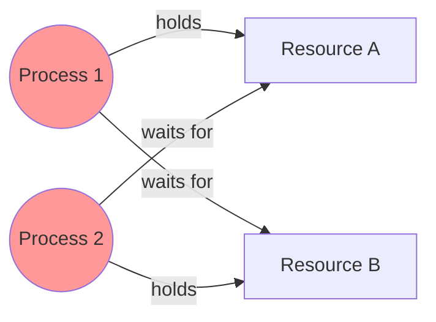
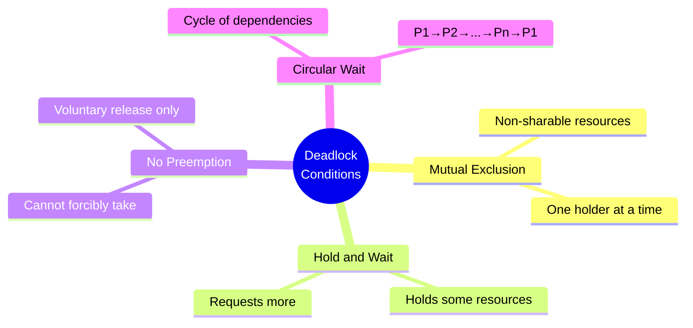
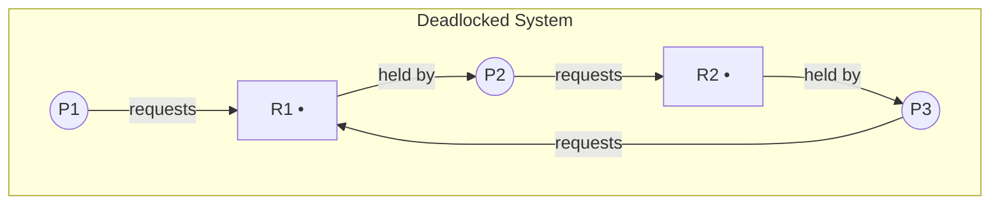
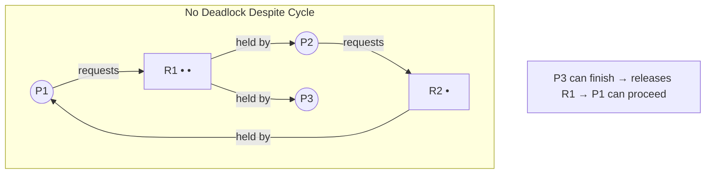
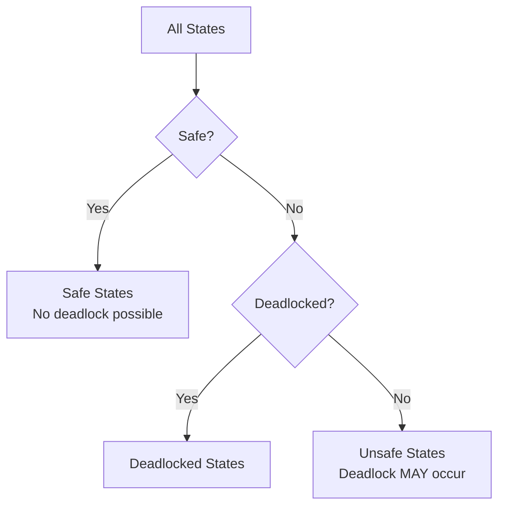
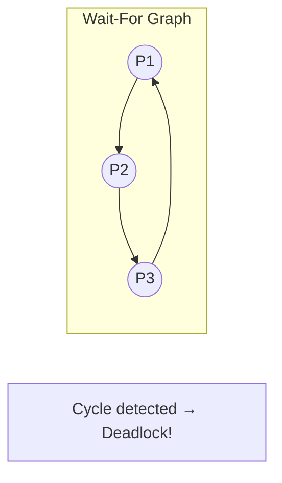
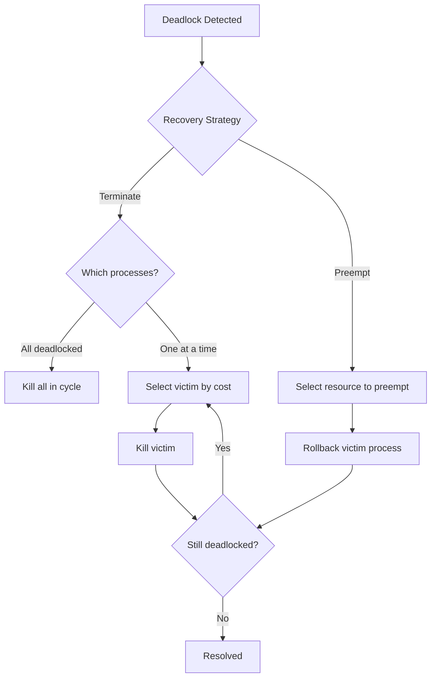

## Learning Objectives

By the end of this lesson, you will be able to:

- Identify the four necessary conditions for deadlock
- Model resource allocation using directed graphs
- Apply deadlock prevention strategies by negating necessary conditions
- Implement the Banker's algorithm for deadlock avoidance
- Design deadlock detection algorithms for single and multi-instance resources
- Choose appropriate recovery strategies when deadlock occurs

## Prerequisites

- Understanding of mutexes and semaphores
- Process and thread lifecycle concepts
- Basic graph theory (nodes, edges, cycles)

---

## What Is Deadlock?

A **deadlock** is a state where a set of processes are each waiting for a resource held by another process in the set, forming a circular dependency. No process can proceed — they are all permanently blocked.



### Real-World Analogy

Imagine two cars approaching a narrow bridge from opposite sides. Neither can cross because each is blocking the other. Neither will back up — deadlock.

### Code Example: Classic Deadlock

```c
#include <pthread.h>
#include <stdio.h>
#include <unistd.h>

pthread_mutex_t lock_a = PTHREAD_MUTEX_INITIALIZER;
pthread_mutex_t lock_b = PTHREAD_MUTEX_INITIALIZER;

void *thread1(void *arg) {
    pthread_mutex_lock(&lock_a);
    printf("Thread 1: holding lock A, waiting for B...\n");
    usleep(100000);  // Increase chance of interleaving
    pthread_mutex_lock(&lock_b);  // DEADLOCK: Thread 2 holds B
    printf("Thread 1: got both locks\n");
    pthread_mutex_unlock(&lock_b);
    pthread_mutex_unlock(&lock_a);
    return NULL;
}

void *thread2(void *arg) {
    pthread_mutex_lock(&lock_b);
    printf("Thread 2: holding lock B, waiting for A...\n");
    usleep(100000);
    pthread_mutex_lock(&lock_a);  // DEADLOCK: Thread 1 holds A
    printf("Thread 2: got both locks\n");
    pthread_mutex_unlock(&lock_a);
    pthread_mutex_unlock(&lock_b);
    return NULL;
}

int main() {
    pthread_t t1, t2;
    pthread_create(&t1, NULL, thread1, NULL);
    pthread_create(&t2, NULL, thread2, NULL);
    pthread_join(t1, NULL);  // Hangs forever
    pthread_join(t2, NULL);
    return 0;
}
```

Detect this at runtime:

```bash
gcc -g -pthread deadlock.c -o deadlock
valgrind --tool=helgrind ./deadlock
# Reports potential lock ordering violation
```

---

## The Four Necessary Conditions

Deadlock can occur **if and only if** all four Coffman conditions hold simultaneously:

| Condition | Description |
|-----------|-------------|
| **Mutual Exclusion** | At least one resource is non-sharable — only one process can use it at a time |
| **Hold and Wait** | A process holds at least one resource while waiting to acquire additional resources |
| **No Preemption** | Resources cannot be forcibly taken away — a process must release them voluntarily |
| **Circular Wait** | A circular chain of processes exists where each holds a resource the next one needs |



**Remove ANY ONE** of these conditions and deadlock becomes impossible.

---

## Resource Allocation Graph (RAG)

A **resource allocation graph** is a directed graph that models the current state of resource allocation:

- **Process nodes** (circles): Represent processes
- **Resource nodes** (rectangles): Represent resource types, with dots for instances
- **Request edge** (P → R): Process P is waiting for resource R
- **Assignment edge** (R → P): An instance of resource R is assigned to process P

### Deadlock Detection via RAG



**Theorem**: If each resource type has exactly one instance, a cycle in the RAG is both necessary and sufficient for deadlock.

**With multiple instances**: A cycle is necessary but not sufficient. The system might still be able to resolve the cycle if another instance becomes available.

### Example: Cycle Without Deadlock



P3 holds an instance of R1 but doesn't need anything else. When P3 finishes, it releases R1, allowing P1 to acquire it.

---

## Deadlock Prevention

Prevent deadlock by structurally ensuring at least one of the four conditions cannot hold.

### Negate Mutual Exclusion

Make resources sharable where possible:

- Use **read-only data** or **immutable objects**
- Use **spooling** (e.g., print jobs go to a spooler queue, not directly to the printer)
- Use **lock-free data structures** (CAS-based algorithms)

**Limitation**: Some resources are inherently non-sharable (printers, tape drives, write access).

### Negate Hold and Wait

Require processes to request **all** resources at once before starting:

```c
void safe_work() {
    // Request all locks atomically
    pthread_mutex_lock(&global_lock);
    pthread_mutex_lock(&lock_a);
    pthread_mutex_lock(&lock_b);
    pthread_mutex_unlock(&global_lock);

    // Do work with both resources
    do_work();

    pthread_mutex_unlock(&lock_b);
    pthread_mutex_unlock(&lock_a);
}
```

**Problems**:
- Low resource utilization — process holds resources it might not need yet
- Possible starvation if a process needs many popular resources
- Requires knowing all needed resources in advance

### Negate No Preemption

If a process holding resources requests another it can't get, release all held resources:

```c
void preemptive_lock() {
    pthread_mutex_lock(&lock_a);
    if (pthread_mutex_trylock(&lock_b) != 0) {
        pthread_mutex_unlock(&lock_a);  // Release and retry
        // Resources are implicitly preempted
        usleep(1000);                    // Backoff
        return preemptive_lock();        // Retry
    }
    // Got both locks
}
```

**Limitation**: Only works for resources whose state can be saved and restored (CPU registers, memory pages). Not for printers or database locks.

### Negate Circular Wait (Most Practical)

Impose a **total ordering** on resource types and require processes to acquire resources in increasing order:

```c
// Assign numeric IDs to locks
#define LOCK_ACCOUNT  1
#define LOCK_LEDGER   2
#define LOCK_AUDIT    3

// Always acquire in order: ACCOUNT < LEDGER < AUDIT
void transfer_and_audit() {
    pthread_mutex_lock(&account_lock);  // Order 1
    pthread_mutex_lock(&ledger_lock);   // Order 2
    pthread_mutex_lock(&audit_lock);    // Order 3

    // ... do work ...

    pthread_mutex_unlock(&audit_lock);
    pthread_mutex_unlock(&ledger_lock);
    pthread_mutex_unlock(&account_lock);
}
```

This is the **most widely used** prevention strategy in practice.

### Prevention Summary

| Strategy | Condition Negated | Practicality | Overhead |
|----------|-------------------|-------------|----------|
| Make sharable | Mutual Exclusion | Limited | Low |
| Request all at once | Hold and Wait | Moderate | Resource waste |
| Allow preemption | No Preemption | Limited | State save/restore |
| Lock ordering | Circular Wait | **High** | Discipline required |

---

## Deadlock Avoidance: The Banker's Algorithm

Unlike prevention (which restricts how resources are requested), **avoidance** dynamically examines the resource-allocation state before granting requests to ensure the system stays in a **safe state**.

### Safe State

A state is **safe** if there exists a sequence of processes \(\langle P_1, P_2, \ldots, P_n \rangle\) such that each process P_i can be satisfied by the currently available resources plus those held by all P_j (j < i).



An **unsafe** state doesn't guarantee deadlock — it means deadlock is *possible* depending on future requests.

### Banker's Algorithm Data Structures

For n processes and m resource types:

| Structure | Size | Description |
|-----------|------|-------------|
| `Available[m]` | m | Available instances of each resource type |
| `Max[n][m]` | n×m | Maximum demand of each process |
| `Allocation[n][m]` | n×m | Resources currently allocated to each process |
| `Need[n][m]` | n×m | Remaining need = Max - Allocation |

### Safety Algorithm

```c
#define N_PROC 5
#define N_RES  3

int available[N_RES];
int max_demand[N_PROC][N_RES];
int allocation[N_PROC][N_RES];
int need[N_PROC][N_RES];  // need[i][j] = max_demand[i][j] - allocation[i][j]

bool is_safe() {
    int work[N_RES];
    bool finish[N_PROC] = {false};

    // Initialize work = available
    for (int j = 0; j < N_RES; j++)
        work[j] = available[j];

    // Find a process that can finish
    bool found;
    do {
        found = false;
        for (int i = 0; i < N_PROC; i++) {
            if (finish[i]) continue;

            // Can process i be satisfied?
            bool can_finish = true;
            for (int j = 0; j < N_RES; j++) {
                if (need[i][j] > work[j]) {
                    can_finish = false;
                    break;
                }
            }

            if (can_finish) {
                // Process i can finish — reclaim its resources
                for (int j = 0; j < N_RES; j++)
                    work[j] += allocation[i][j];
                finish[i] = true;
                found = true;
            }
        }
    } while (found);

    // Safe if all processes can finish
    for (int i = 0; i < N_PROC; i++)
        if (!finish[i]) return false;
    return true;
}
```

### Resource-Request Algorithm

When process P_i requests resources:

```c
bool request_resources(int process_id, int request[N_RES]) {
    // Step 1: Verify request doesn't exceed need
    for (int j = 0; j < N_RES; j++) {
        if (request[j] > need[process_id][j])
            return false;  // Error: exceeded max claim
    }

    // Step 2: Check if resources are available
    for (int j = 0; j < N_RES; j++) {
        if (request[j] > available[j])
            return false;  // Must wait
    }

    // Step 3: Tentatively allocate
    for (int j = 0; j < N_RES; j++) {
        available[j] -= request[j];
        allocation[process_id][j] += request[j];
        need[process_id][j] -= request[j];
    }

    // Step 4: Check if resulting state is safe
    if (is_safe()) {
        return true;   // Grant request
    } else {
        // Rollback — deny request, process must wait
        for (int j = 0; j < N_RES; j++) {
            available[j] += request[j];
            allocation[process_id][j] -= request[j];
            need[process_id][j] += request[j];
        }
        return false;
    }
}
```

### Worked Example

Given 3 resource types (A, B, C) with total instances (10, 5, 7):

| Process | Allocation (A,B,C) | Max (A,B,C) | Need (A,B,C) |
|---------|-------------------|-------------|---------------|
| P0 | 0, 1, 0 | 7, 5, 3 | 7, 4, 3 |
| P1 | 2, 0, 0 | 3, 2, 2 | 1, 2, 2 |
| P2 | 3, 0, 2 | 9, 0, 2 | 6, 0, 0 |
| P3 | 2, 1, 1 | 2, 2, 2 | 0, 1, 1 |
| P4 | 0, 0, 2 | 4, 3, 3 | 4, 3, 1 |

**Available** = (10-7, 5-2, 7-5) = (3, 3, 2)

**Safe sequence**: ⟨P1, P3, P4, P2, P0⟩

```
Step 1: P1 needs (1,2,2) ≤ Available (3,3,2) → finish P1 → Available = (5,3,2)
Step 2: P3 needs (0,1,1) ≤ Available (5,3,2) → finish P3 → Available = (7,4,3)
Step 3: P4 needs (4,3,1) ≤ Available (7,4,3) → finish P4 → Available = (7,4,5)
Step 4: P2 needs (6,0,0) ≤ Available (7,4,5) → finish P2 → Available = (10,4,7)
Step 5: P0 needs (7,4,3) ≤ Available (10,4,7) → finish P0 → All done ✓
```

---

## Deadlock Detection

If prevention and avoidance are too restrictive or expensive, allow deadlocks to occur but **detect and recover** from them.

### Wait-For Graph (Single Instance Resources)

Collapse the resource allocation graph by removing resource nodes — an edge from P_i to P_j means P_i waits for a resource held by P_j:



**Algorithm**: Periodically run cycle detection (DFS) on the wait-for graph. Time complexity: O(V + E).

### Detection Algorithm (Multiple Instances)

Similar to the Banker's safety algorithm but uses actual requests instead of maximum claims:

```c
bool detect_deadlock() {
    int work[N_RES];
    bool finish[N_PROC];

    for (int j = 0; j < N_RES; j++)
        work[j] = available[j];

    // Mark processes with zero allocation as finished
    for (int i = 0; i < N_PROC; i++)
        finish[i] = is_zero_allocation(i);

    bool found;
    do {
        found = false;
        for (int i = 0; i < N_PROC; i++) {
            if (finish[i]) continue;

            bool can_complete = true;
            for (int j = 0; j < N_RES; j++) {
                if (request[i][j] > work[j]) {
                    can_complete = false;
                    break;
                }
            }

            if (can_complete) {
                for (int j = 0; j < N_RES; j++)
                    work[j] += allocation[i][j];
                finish[i] = true;
                found = true;
            }
        }
    } while (found);

    // Any process with finish[i] == false is deadlocked
    for (int i = 0; i < N_PROC; i++)
        if (!finish[i]) return true;
    return false;
}
```

### When to Run Detection?

| Frequency | Cost | Detection Delay |
|-----------|------|-----------------|
| Every request | O(m × n²) each time | Immediate |
| Periodically (timer) | Amortized | Up to period |
| When CPU utilization drops | Low overhead | Variable |

---

## Deadlock Recovery

Once deadlock is detected, the system must break the cycle:

### Process Termination

| Strategy | Description | Impact |
|----------|-------------|--------|
| Abort all | Kill all deadlocked processes | Maximum disruption |
| Abort one at a time | Kill processes until cycle breaks | Re-run detection each time |

**Victim selection criteria**: Process priority, computation time already used, resources held, resources needed, number of processes to terminate, interactive vs batch.

### Resource Preemption

Forcibly take resources from a process:

1. **Select a victim**: Choose the process whose resources will be preempted
2. **Rollback**: Roll back the victim to a safe state (if checkpoint exists) or restart it
3. **Prevent starvation**: Ensure the same process isn't always chosen as victim (include rollback count in cost factor)



---

## Deadlock in Practice

### The Dining Philosophers Problem

Five philosophers sit at a round table with five forks. Each needs two forks to eat:

```c
#define N 5
pthread_mutex_t forks[N];

void *philosopher(void *arg) {
    int id = *(int *)arg;
    int left = id;
    int right = (id + 1) % N;

    while (1) {
        think(id);

        // DEADLOCK-PRONE: All pick up left fork simultaneously
        // pthread_mutex_lock(&forks[left]);
        // pthread_mutex_lock(&forks[right]);

        // FIX: Use resource ordering
        int first = (left < right) ? left : right;
        int second = (left < right) ? right : left;
        pthread_mutex_lock(&forks[first]);
        pthread_mutex_lock(&forks[second]);

        eat(id);

        pthread_mutex_unlock(&forks[second]);
        pthread_mutex_unlock(&forks[first]);
    }
}
```

### Linux Kernel Lockdep

The Linux kernel includes a lock dependency validator called **lockdep** that detects potential deadlocks at runtime:

```bash
# Enable in kernel config
CONFIG_PROVE_LOCKING=y
CONFIG_LOCKDEP=y

# Check for violations in kernel log
dmesg | grep "possible circular locking dependency"
```

Lockdep tracks lock ordering across all kernel code paths and reports violations even before an actual deadlock occurs.

### Database Deadlocks

Databases handle deadlocks automatically:

```sql
-- Transaction 1
BEGIN;
UPDATE accounts SET balance = balance - 100 WHERE id = 1;  -- Locks row 1
UPDATE accounts SET balance = balance + 100 WHERE id = 2;  -- Waits for row 2

-- Transaction 2 (concurrent)
BEGIN;
UPDATE accounts SET balance = balance - 50 WHERE id = 2;   -- Locks row 2
UPDATE accounts SET balance = balance + 50 WHERE id = 1;   -- Waits for row 1
-- DEADLOCK DETECTED: one transaction is rolled back
```

```bash
# PostgreSQL deadlock detection
SHOW deadlock_timeout;  -- Default: 1s
# After timeout, PostgreSQL checks for cycles and aborts one transaction
```

---

## Approaches Comparison

| Approach | Strategy | Overhead | Concurrency | Use Case |
|----------|----------|----------|-------------|----------|
| Prevention | Structural constraints | Low runtime | Reduced | Embedded, safety-critical |
| Avoidance | Dynamic safety checks | O(m×n²) per request | Moderate | Known max demands |
| Detection + Recovery | Periodic checking | O(m×n²) periodic | High | Databases, general-purpose |
| Ignore (Ostrich) | Do nothing | Zero | Maximum | Desktop OS (Linux, Windows) |

Most general-purpose operating systems use the **ostrich algorithm** — they ignore deadlocks because the overhead of prevention/detection is deemed worse than occasional manual intervention (reboot or kill).

---

## Key Takeaways

1. **Deadlock** requires all four Coffman conditions: mutual exclusion, hold-and-wait, no preemption, and circular wait. Eliminating any one prevents deadlock.

2. The **resource allocation graph** provides a visual model for reasoning about deadlock. With single-instance resources, a cycle means deadlock. With multiple instances, further analysis is needed.

3. **Lock ordering** (negating circular wait) is the most practical prevention technique and is widely used in production systems and the Linux kernel.

4. The **Banker's algorithm** provides deadlock avoidance by checking if granting a request would leave the system in a safe state, but it requires advance knowledge of maximum resource needs.

5. **Detection and recovery** is the most flexible approach — allow deadlocks but detect them via cycle detection in wait-for graphs and recover by terminating processes or preempting resources.

6. In practice, most operating systems use the **ostrich algorithm** because deadlocks are rare and the cost of prevention mechanisms outweighs the occasional deadlock.

7. Use tools like **Helgrind**, **lockdep**, and **ThreadSanitizer** to detect potential deadlocks during development before they occur in production.
