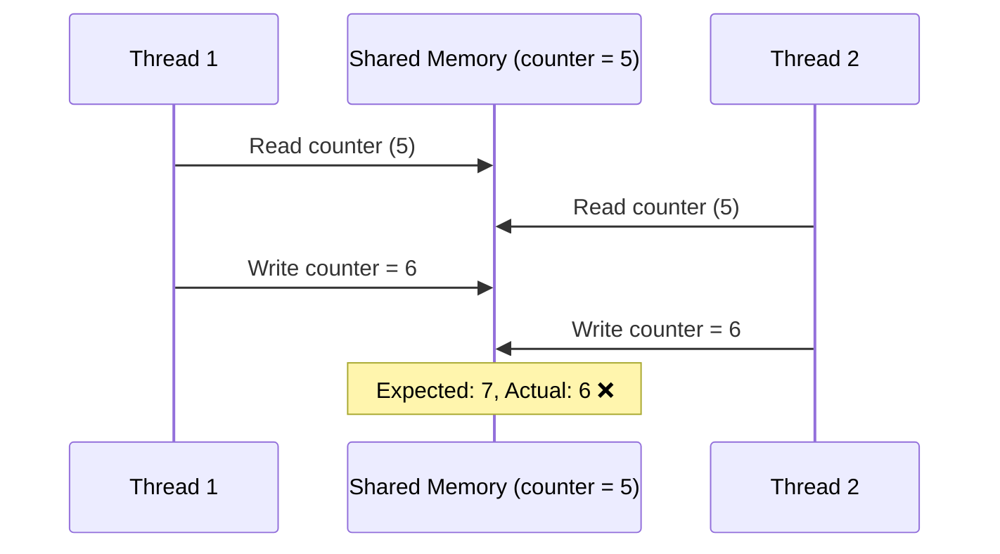
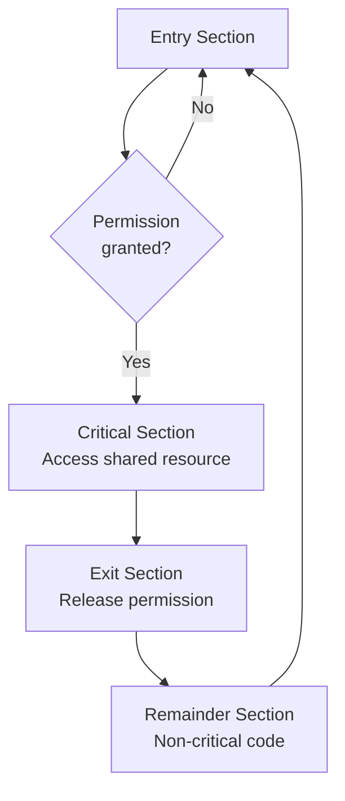
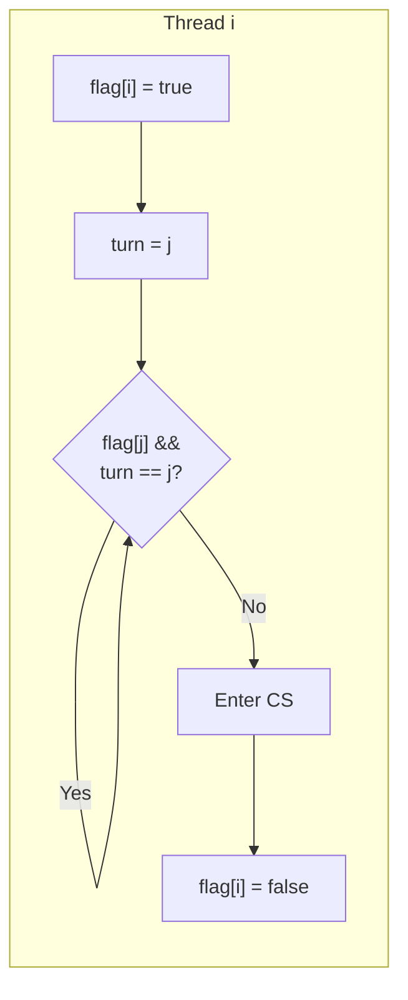
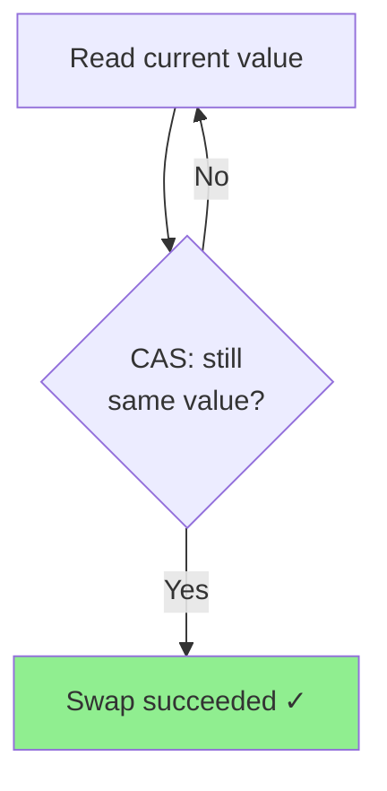
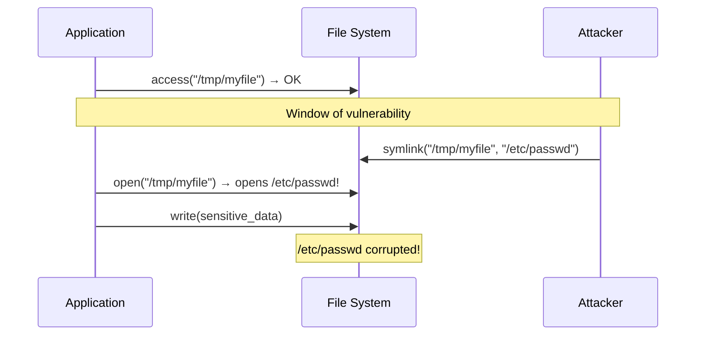

## Learning Objectives

By the end of this lesson, you will be able to:

- Define race conditions and explain why they occur in concurrent programs
- Identify the critical section problem and its three requirements
- Implement Peterson's solution for two-process mutual exclusion
- Understand hardware-level atomic operations (test-and-set, compare-and-swap)
- Write correct concurrent code using atomic primitives
- Reason about memory ordering and visibility in shared-memory systems

## Prerequisites

- Familiarity with processes and threads (Module 3)
- Basic C programming knowledge
- Understanding of how the CPU executes instructions

---

## What Is a Race Condition?

A **race condition** occurs when the behavior of a program depends on the relative timing or interleaving of multiple threads or processes accessing shared data. The outcome is non-deterministic — it varies depending on who "wins the race."



### A Classic Example: The Lost Update

Consider two threads incrementing a shared counter:

```c
#include <stdio.h>
#include <pthread.h>

volatile int counter = 0;

void *increment(void *arg) {
    for (int i = 0; i < 1000000; i++) {
        counter++;  // NOT atomic: load, add, store
    }
    return NULL;
}

int main() {
    pthread_t t1, t2;
    pthread_create(&t1, NULL, increment, NULL);
    pthread_create(&t2, NULL, increment, NULL);
    pthread_join(t1, NULL);
    pthread_join(t2, NULL);

    // Expected: 2000000, Actual: some value < 2000000
    printf("Counter: %d\n", counter);
    return 0;
}
```

Compile and run multiple times to observe different results:

```bash
gcc -pthread -O0 race.c -o race
for i in $(seq 1 5); do ./race; done
# Counter: 1247832
# Counter: 1389201
# Counter: 1102447
# Counter: 1523890
# Counter: 1298103
```

### Why Does This Happen?

The statement `counter++` compiles to multiple machine instructions:

```
mov eax, [counter]    ; Load current value
add eax, 1            ; Increment in register
mov [counter], eax    ; Store back
```

When two threads execute these interleaved, updates can be lost:

| Step | Thread 1          | Thread 2          | counter (memory) |
|------|-------------------|-------------------|-------------------|
| 1    | load eax = 5      |                   | 5                |
| 2    |                   | load eax = 5      | 5                |
| 3    | eax = 6           |                   | 5                |
| 4    |                   | eax = 6           | 5                |
| 5    | store 6           |                   | 6                |
| 6    |                   | store 6           | 6                |

Thread 2's increment is completely lost.

---

## The Critical Section Problem

A **critical section** is a code segment where a thread accesses shared resources. The critical section problem asks: how do we ensure that when one thread is executing in its critical section, no other thread is allowed to execute in its critical section?



### Three Requirements for a Correct Solution

Any solution to the critical section problem must satisfy **all three** properties:

| Requirement | Description |
|-------------|-------------|
| **Mutual Exclusion** | If thread T_i is executing in its critical section, no other thread T_j can be executing in its critical section |
| **Progress** | If no thread is in the critical section and some threads wish to enter, the selection of the next thread cannot be postponed indefinitely. Only threads not in their remainder section participate in the decision |
| **Bounded Waiting** | There exists a bound on the number of times other threads are allowed to enter their critical sections after a thread has made a request to enter and before that request is granted |

### Why Each Requirement Matters

- **Without mutual exclusion**: Data corruption, lost updates, inconsistent state
- **Without progress**: Deadlock — everyone waits, nobody enters
- **Without bounded waiting**: Starvation — a thread may wait forever while others repeatedly enter

---

## Naive Attempts (and Why They Fail)

### Attempt 1: Simple Flag

```c
int flag = 0;

void thread_function() {
    while (flag == 1) { /* busy wait */ }  // Entry
    flag = 1;                               // Enter critical section
    // ... critical section ...
    flag = 0;                               // Exit
}
```

**Problem**: Both threads can read `flag == 0` simultaneously, then both set `flag = 1`. Mutual exclusion violated.

### Attempt 2: Turn Variable

```c
int turn = 0;  // Whose turn it is

// Thread 0
while (turn != 0) { /* wait */ }
// critical section
turn = 1;

// Thread 1
while (turn != 1) { /* wait */ }
// critical section
turn = 0;
```

**Problem**: Strict alternation. If Thread 0 doesn't need the critical section, Thread 1 is still blocked. Progress violated.

---

## Peterson's Solution

Peterson's algorithm correctly solves the critical section problem for **two processes**. It combines both the flag and turn approaches:

```c
#include <stdbool.h>

volatile bool flag[2] = {false, false};
volatile int turn;

void lock(int self) {
    int other = 1 - self;
    flag[self] = true;      // I want to enter
    turn = other;            // But I'll let you go first
    while (flag[other] && turn == other) {
        // Busy wait — the other process wants in AND it's their turn
    }
}

void unlock(int self) {
    flag[self] = false;      // I no longer need the critical section
}
```

### Why Peterson's Solution Works



**Mutual Exclusion**: If both threads are in the critical section, both `flag[0]` and `flag[1]` are true. But `turn` can only be 0 or 1 — one thread must be blocked in the while loop. Contradiction.

**Progress**: If Thread j doesn't want to enter (`flag[j] == false`), Thread i immediately enters. No unnecessary blocking.

**Bounded Waiting**: After Thread i sets `turn = j`, if Thread j enters and exits, it sets `turn = i`, allowing Thread i to proceed. Maximum wait: one entry by the other thread.

### Limitation on Modern Hardware

Peterson's solution requires **sequential consistency** — memory operations appear in program order. Modern CPUs and compilers reorder memory accesses for performance. On x86-64:

```c
// Compiler might reorder these:
flag[self] = true;   // Store
turn = other;        // Store
// The CPU might also reorder stores with subsequent loads

// Fix with memory barriers:
__atomic_store_n(&flag[self], true, __ATOMIC_SEQ_CST);
__atomic_store_n(&turn, other, __ATOMIC_SEQ_CST);
while (__atomic_load_n(&flag[other], __ATOMIC_SEQ_CST) &&
       __atomic_load_n(&turn, __ATOMIC_SEQ_CST) == other) {
    // spin
}
```

---

## Hardware Solutions

Modern processors provide atomic instructions that execute indivisibly — no other instruction can intervene.

### Test-and-Set (TAS)

The **test-and-set** instruction atomically reads a value and sets it to `true`:

```c
// Hardware-level atomic operation (pseudocode)
bool test_and_set(bool *target) {
    bool old = *target;
    *target = true;
    return old;          // Returns the PREVIOUS value
}
```

Using TAS for mutual exclusion:

```c
#include <stdatomic.h>
#include <stdbool.h>

atomic_bool lock_var = false;

void lock() {
    while (atomic_exchange(&lock_var, true)) {
        // Spin while lock was already held (returned true)
    }
}

void unlock() {
    atomic_store(&lock_var, false);
}
```

**Satisfies mutual exclusion** ✅ but **not bounded waiting** ❌ — a thread can be unlucky and starve.

### Compare-and-Swap (CAS)

**Compare-and-swap** is more powerful: it atomically compares a value with an expected value and, only if they match, replaces it with a new value:

```c
// Hardware-level atomic operation (pseudocode)
bool compare_and_swap(int *ptr, int expected, int new_val) {
    if (*ptr == expected) {
        *ptr = new_val;
        return true;   // Swap succeeded
    }
    return false;       // Value was different, no swap
}
```

CAS is the foundation of **lock-free data structures**:

```c
#include <stdatomic.h>

atomic_int counter = 0;

void atomic_increment() {
    int old;
    do {
        old = atomic_load(&counter);
    } while (!atomic_compare_exchange_weak(&counter, &old, old + 1));
}
```



### Bounded-Waiting Test-and-Set

To satisfy all three requirements with TAS:

```c
#include <stdatomic.h>
#include <stdbool.h>

#define N 4  // Number of threads

atomic_bool lock_var = false;
bool waiting[N] = {false};

void lock(int i) {
    waiting[i] = true;
    bool key = true;
    while (waiting[i] && key) {
        key = atomic_exchange(&lock_var, true);
    }
    waiting[i] = false;
}

void unlock(int i) {
    int j = (i + 1) % N;
    while (j != i && !waiting[j]) {
        j = (j + 1) % N;
    }
    if (j == i) {
        atomic_store(&lock_var, false);
    } else {
        waiting[j] = false;  // Hand off to next waiting thread
    }
}
```

This cycles through waiting threads in order, guaranteeing each thread waits at most `N - 1` turns.

---

## Atomic Operations in Practice

### GCC/Clang Built-in Atomics

```c
#include <stdatomic.h>

atomic_int shared = 0;

// Atomic fetch-and-add
int old = atomic_fetch_add(&shared, 1);

// Atomic compare-and-swap
int expected = 5;
bool success = atomic_compare_exchange_strong(&shared, &expected, 10);

// Memory ordering options
atomic_store_explicit(&shared, 42, memory_order_release);
int val = atomic_load_explicit(&shared, memory_order_acquire);
```

### Memory Ordering Levels

| Order | Guarantee | Use Case |
|-------|-----------|----------|
| `memory_order_relaxed` | Atomicity only, no ordering | Simple counters |
| `memory_order_acquire` | Subsequent reads/writes not reordered before | Lock acquisition |
| `memory_order_release` | Previous reads/writes not reordered after | Lock release |
| `memory_order_acq_rel` | Both acquire and release | Read-modify-write |
| `memory_order_seq_cst` | Total global order (strongest, default) | When in doubt |

### x86-64 Atomic Instructions

On x86-64, the `LOCK` prefix makes instructions atomic:

```asm
; Atomic increment
lock inc dword [counter]

; Atomic compare-and-swap (CMPXCHG)
mov eax, expected
lock cmpxchg [ptr], new_val
; If [ptr] == EAX: [ptr] = new_val, ZF = 1
; Else: EAX = [ptr], ZF = 0

; Atomic exchange (XCHG is always atomic on x86)
xchg eax, [lock_var]
```

Inspect atomics in compiled code:

```bash
gcc -O2 -S atomic_example.c -o - | grep -A5 "lock"
```

---

## Real-World Race Condition: TOCTOU

**Time-of-check to time-of-use (TOCTOU)** is a race condition class common in file system operations:

```c
// VULNERABLE CODE
if (access("/tmp/myfile", W_OK) == 0) {
    // Window of vulnerability: attacker swaps the file
    int fd = open("/tmp/myfile", O_WRONLY);
    write(fd, data, len);
    close(fd);
}
```



**Mitigation**: Use `openat()` with `O_NOFOLLOW`, or operate on file descriptors instead of paths:

```c
int fd = open("/tmp/myfile", O_WRONLY | O_NOFOLLOW | O_CREAT, 0600);
if (fd >= 0) {
    // fstat to verify, then write
    struct stat st;
    fstat(fd, &st);
    if (S_ISREG(st.st_mode)) {
        write(fd, data, len);
    }
    close(fd);
}
```

---

## Detecting Race Conditions

### ThreadSanitizer (TSan)

GCC and Clang include a powerful race detector:

```bash
gcc -fsanitize=thread -g race.c -o race_tsan
./race_tsan
```

Output:

```
WARNING: ThreadSanitizer: data race (pid=12345)
  Write of size 4 at 0x... by thread T2:
    #0 increment race.c:8
  Previous write of size 4 at 0x... by thread T1:
    #0 increment race.c:8
  Location is global 'counter' of size 4
```

### Helgrind (Valgrind Tool)

```bash
gcc -g -pthread race.c -o race
valgrind --tool=helgrind ./race
```

### Static Analysis

```bash
# Clang thread safety analysis (compile-time)
gcc -Wthread-safety race.c
```

---

## Summary: Approaches Comparison

| Approach | Mutual Exclusion | Progress | Bounded Waiting | Scalability |
|----------|:---:|:---:|:---:|:---:|
| Simple flag | ❌ | ✅ | ✅ | N/A |
| Turn variable | ✅ | ❌ | ✅ | 2 processes |
| Peterson's | ✅ | ✅ | ✅ | 2 processes |
| Test-and-Set | ✅ | ✅ | ❌ | N processes |
| Bounded TAS | ✅ | ✅ | ✅ | N processes |
| CAS-based | ✅ | ✅ | ❌* | N processes |

*CAS loops can be made bounded-waiting with careful design.

---

## Key Takeaways

1. **Race conditions** arise when multiple threads access shared data without proper synchronization, leading to non-deterministic behavior and data corruption.

2. The **critical section problem** requires three properties: **mutual exclusion**, **progress**, and **bounded waiting**. Missing any one leads to bugs, deadlock, or starvation.

3. **Peterson's solution** elegantly solves the two-process case but requires memory barriers on modern hardware due to instruction reordering.

4. **Hardware atomic instructions** (test-and-set, compare-and-swap) provide the building blocks for all higher-level synchronization primitives.

5. **Memory ordering** matters — using `memory_order_seq_cst` is safe but slower; relaxed orderings improve performance when the algorithm allows it.

6. **TOCTOU races** are a major security concern in file system operations — always use file descriptors over path-based checks.

7. **Tools like ThreadSanitizer** can detect races automatically — use them during development and testing.
