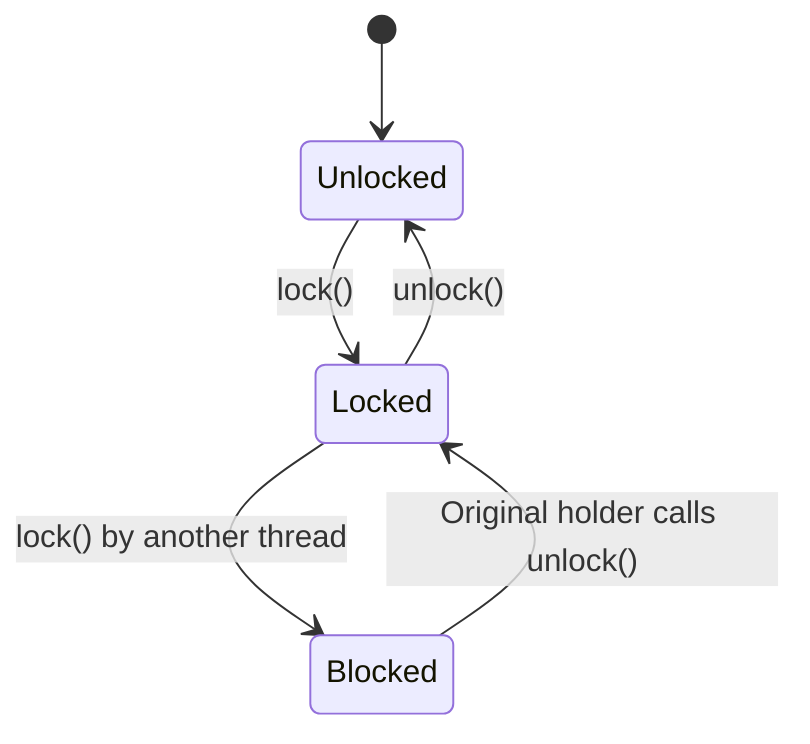
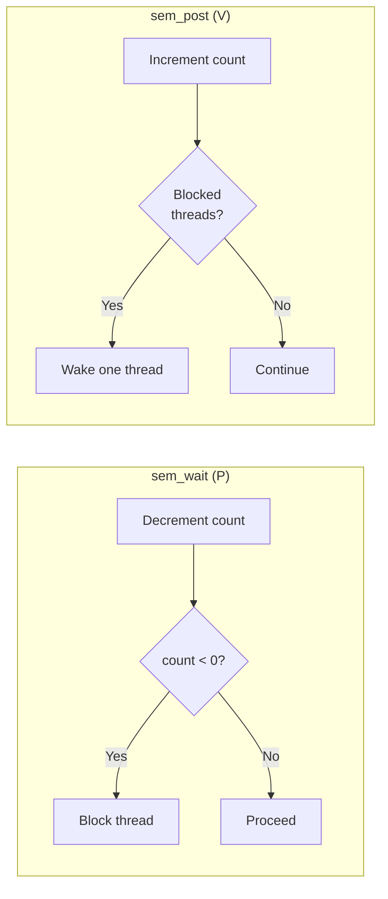
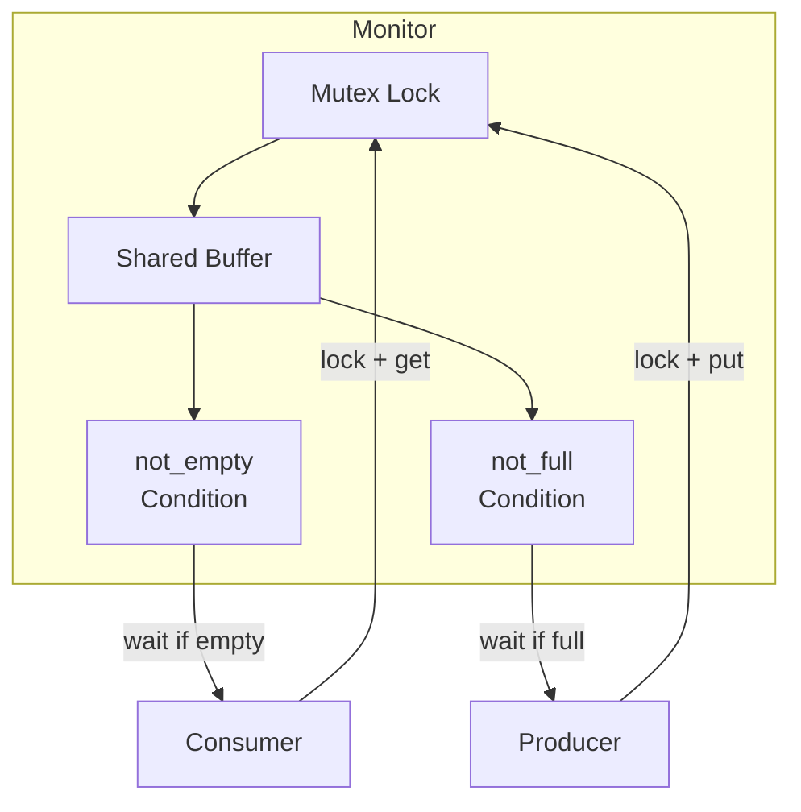
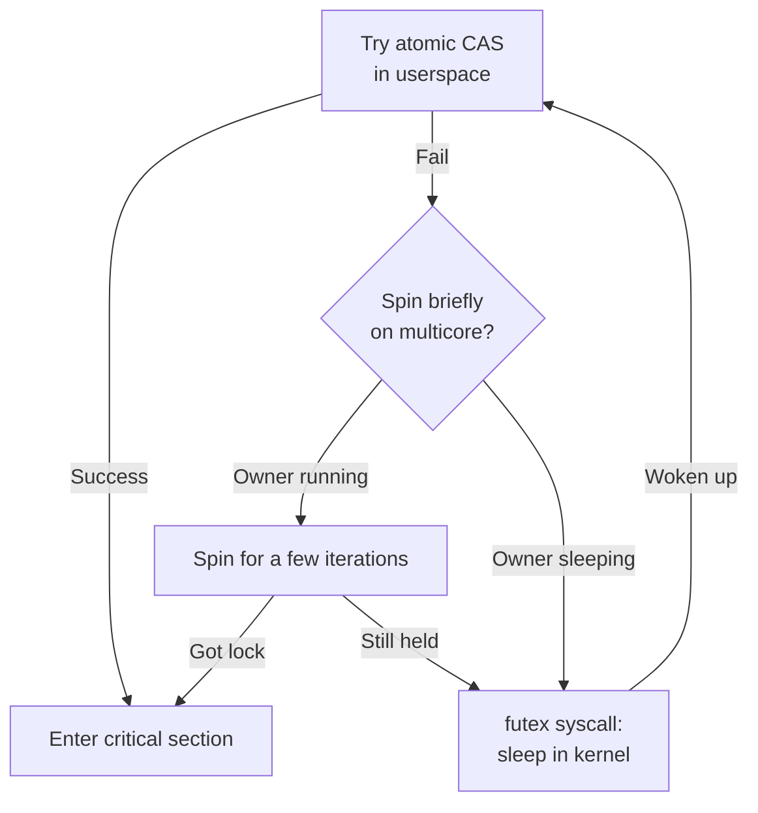
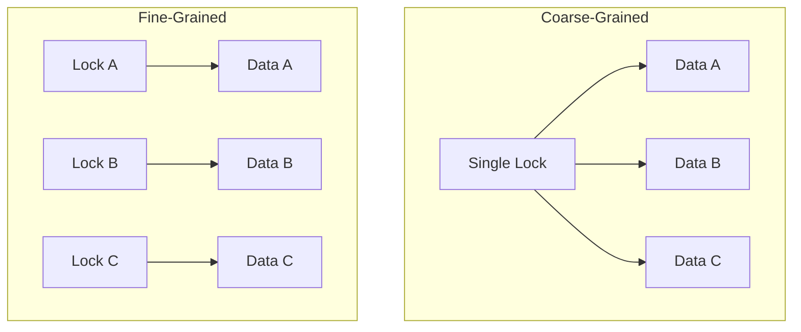

```mermaid
gantt
    title Barrier Synchronization
    dateFormat X
    axisFormat %s

    section Thread 0
    Phase 1    :a1, 0, 3
    Waiting    :crit, w1, 3, 5
    Phase 2    :a2, 5, 8

    section Thread 1
    Phase 1    :b1, 0, 4
    Waiting    :crit, w2, 4, 5
    Phase 2    :b2, 5, 8

    section Thread 2
    Phase 1    :c1, 0, 5
    Phase 2    :c2, 5, 8

    section Thread 3
    Phase 1    :d1, 0, 2
    Waiting    :crit, w3, 2, 5
    Phase 2    :d2, 5, 8
```

## Learning Objectives

By the end of this lesson, you will be able to:

- Implement and use mutexes for mutual exclusion
- Distinguish between binary and counting semaphores and apply them correctly
- Use monitors and condition variables for structured synchronization
- Choose between reader-writer locks, barriers, and spinlocks for different scenarios
- Design deadlock-free synchronization patterns
- Understand the performance trade-offs between spinning and sleeping locks

## Prerequisites

- Understanding of race conditions and the critical section problem
- Familiarity with POSIX threads (pthreads)
- Basic C programming with shared memory concepts

---

## Mutexes (Mutual Exclusion Locks)

A **mutex** is the most fundamental synchronization primitive. It provides exclusive access to a shared resource: only one thread can hold the mutex at a time.



### POSIX Mutex API

```c
#include <pthread.h>
#include <stdio.h>

pthread_mutex_t mutex = PTHREAD_MUTEX_INITIALIZER;
int shared_counter = 0;

void *safe_increment(void *arg) {
    for (int i = 0; i < 1000000; i++) {
        pthread_mutex_lock(&mutex);
        shared_counter++;
        pthread_mutex_unlock(&mutex);
    }
    return NULL;
}

int main() {
    pthread_t t1, t2;
    pthread_create(&t1, NULL, safe_increment, NULL);
    pthread_create(&t2, NULL, safe_increment, NULL);
    pthread_join(t1, NULL);
    pthread_join(t2, NULL);
    printf("Counter: %d\n", shared_counter);  // Always 2000000
    pthread_mutex_destroy(&mutex);
    return 0;
}
```

### Mutex Attributes

```c
pthread_mutexattr_t attr;
pthread_mutexattr_init(&attr);

// Normal: undefined behavior on double-lock (default)
pthread_mutexattr_settype(&attr, PTHREAD_MUTEX_NORMAL);

// Error-checking: returns error on double-lock
pthread_mutexattr_settype(&attr, PTHREAD_MUTEX_ERRORCHECK);

// Recursive: allows same thread to lock multiple times
pthread_mutexattr_settype(&attr, PTHREAD_MUTEX_RECURSIVE);

pthread_mutex_t mutex;
pthread_mutex_init(&mutex, &attr);
pthread_mutexattr_destroy(&attr);
```

| Mutex Type | Double Lock | Unlock by Non-Owner | Use Case |
|------------|-------------|---------------------|----------|
| Normal | Deadlock (UB) | UB | Performance-critical code |
| Error-checking | Returns `EDEADLK` | Returns `EPERM` | Debugging |
| Recursive | Increments count | Returns `EPERM` | Recursive algorithms |

### Try-Lock Pattern

```c
if (pthread_mutex_trylock(&mutex) == 0) {
    // Got the lock — do critical section work
    pthread_mutex_unlock(&mutex);
} else {
    // Lock was held — do something else or retry later
}
```

---

## Semaphores

A **semaphore** is a signaling mechanism with an integer counter. Unlike mutexes, semaphores can be used for more general synchronization patterns.

### Operations

- **wait (P / down)**: Decrement the counter. If counter becomes negative, block.
- **signal (V / up)**: Increment the counter. If threads are waiting, wake one.



### Binary Semaphore (Acts Like a Mutex)

```c
#include <semaphore.h>
#include <pthread.h>
#include <stdio.h>

sem_t binary_sem;

void *worker(void *arg) {
    sem_wait(&binary_sem);    // P: decrement (1 → 0)
    printf("Thread %ld in critical section\n", (long)arg);
    // ... critical section ...
    sem_post(&binary_sem);    // V: increment (0 → 1)
    return NULL;
}

int main() {
    sem_init(&binary_sem, 0, 1);  // Initial value = 1

    pthread_t threads[5];
    for (long i = 0; i < 5; i++)
        pthread_create(&threads[i], NULL, worker, (void *)i);
    for (int i = 0; i < 5; i++)
        pthread_join(threads[i], NULL);

    sem_destroy(&binary_sem);
    return 0;
}
```

### Counting Semaphore (Resource Pool)

Control access to a pool of N identical resources:

```c
#define POOL_SIZE 3
sem_t pool;

void *use_resource(void *arg) {
    int id = *(int *)arg;
    printf("Thread %d waiting for resource...\n", id);

    sem_wait(&pool);  // Acquire one resource from pool
    printf("Thread %d acquired resource\n", id);
    sleep(2);         // Use the resource
    printf("Thread %d releasing resource\n", id);
    sem_post(&pool);  // Return resource to pool

    return NULL;
}

int main() {
    sem_init(&pool, 0, POOL_SIZE);  // 3 resources available
    // ... create 10 threads — only 3 run at once ...
}
```

### Producer-Consumer with Semaphores

The classic bounded-buffer problem:

```c
#include <semaphore.h>
#include <pthread.h>

#define BUFFER_SIZE 10

int buffer[BUFFER_SIZE];
int in = 0, out = 0;

sem_t empty;    // Counts empty slots
sem_t full;     // Counts filled slots
sem_t mutex;    // Mutual exclusion for buffer access

void *producer(void *arg) {
    for (int i = 0; i < 100; i++) {
        int item = produce_item();
        sem_wait(&empty);        // Wait for an empty slot
        sem_wait(&mutex);        // Lock buffer
        buffer[in] = item;
        in = (in + 1) % BUFFER_SIZE;
        sem_post(&mutex);        // Unlock buffer
        sem_post(&full);         // Signal: one more item
    }
    return NULL;
}

void *consumer(void *arg) {
    for (int i = 0; i < 100; i++) {
        sem_wait(&full);         // Wait for an item
        sem_wait(&mutex);        // Lock buffer
        int item = buffer[out];
        out = (out + 1) % BUFFER_SIZE;
        sem_post(&mutex);        // Unlock buffer
        sem_post(&empty);        // Signal: one more empty slot
        consume_item(item);
    }
    return NULL;
}

int main() {
    sem_init(&empty, 0, BUFFER_SIZE);
    sem_init(&full, 0, 0);
    sem_init(&mutex, 0, 1);
    // ... create producer and consumer threads ...
}
```


### Mutex vs Semaphore

| Feature | Mutex | Semaphore |
|---------|-------|-----------|
| Ownership | Yes — only owner can unlock | No — any thread can signal |
| Count | Binary (0 or 1) | Integer (0 to N) |
| Use case | Mutual exclusion | Signaling, resource counting |
| Priority inheritance | Supported | Not supported |
| Recursive locking | Possible | Not applicable |

---

## Monitors and Condition Variables

A **monitor** is a high-level synchronization construct that encapsulates shared data, operations, and synchronization into a single unit. In C/pthreads, we build monitors using a mutex + condition variables.

### Condition Variables

A condition variable allows a thread to **wait** for a condition to become true and another thread to **signal** when it changes:

```c
pthread_mutex_t lock = PTHREAD_MUTEX_INITIALIZER;
pthread_cond_t cond = PTHREAD_COND_INITIALIZER;

int ready = 0;

void *waiter(void *arg) {
    pthread_mutex_lock(&lock);
    while (!ready) {                     // Always use a while loop
        pthread_cond_wait(&cond, &lock); // Atomically release lock + sleep
    }
    printf("Condition met! Proceeding.\n");
    pthread_mutex_unlock(&lock);
    return NULL;
}

void *signaler(void *arg) {
    sleep(1);
    pthread_mutex_lock(&lock);
    ready = 1;
    pthread_cond_signal(&cond);   // Wake one waiting thread
    pthread_mutex_unlock(&lock);
    return NULL;
}
```

### Why `while` Instead of `if`?

**Spurious wakeups** can occur — the thread may wake without being signaled. The `while` loop re-checks the condition:

```c
// WRONG — may proceed without condition being true
if (!ready)
    pthread_cond_wait(&cond, &lock);

// CORRECT — re-checks after wakeup
while (!ready)
    pthread_cond_wait(&cond, &lock);
```

### Bounded Buffer with Monitor Pattern

```c
typedef struct {
    int buffer[BUFFER_SIZE];
    int count, in, out;
    pthread_mutex_t lock;
    pthread_cond_t not_full;
    pthread_cond_t not_empty;
} BoundedBuffer;

void buffer_init(BoundedBuffer *bb) {
    bb->count = bb->in = bb->out = 0;
    pthread_mutex_init(&bb->lock, NULL);
    pthread_cond_init(&bb->not_full, NULL);
    pthread_cond_init(&bb->not_empty, NULL);
}

void buffer_put(BoundedBuffer *bb, int item) {
    pthread_mutex_lock(&bb->lock);
    while (bb->count == BUFFER_SIZE)
        pthread_cond_wait(&bb->not_full, &bb->lock);

    bb->buffer[bb->in] = item;
    bb->in = (bb->in + 1) % BUFFER_SIZE;
    bb->count++;

    pthread_cond_signal(&bb->not_empty);
    pthread_mutex_unlock(&bb->lock);
}

int buffer_get(BoundedBuffer *bb) {
    pthread_mutex_lock(&bb->lock);
    while (bb->count == 0)
        pthread_cond_wait(&bb->not_empty, &bb->lock);

    int item = bb->buffer[bb->out];
    bb->out = (bb->out + 1) % BUFFER_SIZE;
    bb->count--;

    pthread_cond_signal(&bb->not_full);
    pthread_mutex_unlock(&bb->lock);
    return item;
}
```



---

## Reader-Writer Locks

When reads vastly outnumber writes, allowing concurrent readers improves throughput:

```c
#include <pthread.h>

pthread_rwlock_t rwlock = PTHREAD_RWLOCK_INITIALIZER;
int shared_data = 0;

void *reader(void *arg) {
    pthread_rwlock_rdlock(&rwlock);    // Multiple readers OK
    printf("Read: %d\n", shared_data);
    pthread_rwlock_unlock(&rwlock);
    return NULL;
}

void *writer(void *arg) {
    pthread_rwlock_wrlock(&rwlock);    // Exclusive access
    shared_data++;
    printf("Wrote: %d\n", shared_data);
    pthread_rwlock_unlock(&rwlock);
    return NULL;
}
```

### Reader-Writer Lock Semantics

| State | New Reader | New Writer |
|-------|-----------|-----------|
| Unlocked | ✅ Granted | ✅ Granted |
| Read-locked (N readers) | ✅ Granted | ❌ Blocked |
| Write-locked | ❌ Blocked | ❌ Blocked |

### Starvation Problem

- **Reader-preference**: Writers can starve if readers arrive continuously
- **Writer-preference**: Readers can starve if writers arrive continuously
- **Fair**: FIFO ordering prevents starvation for both

```c
// Writer-preference rwlock
pthread_rwlockattr_t attr;
pthread_rwlockattr_init(&attr);
pthread_rwlockattr_setkind_np(&attr, PTHREAD_RWLOCK_PREFER_WRITER_NONRECURSIVE_NP);
pthread_rwlock_init(&rwlock, &attr);
```

---

## Barriers

A **barrier** forces all threads to reach a synchronization point before any can proceed. Useful for phased computation:

```c
#include <pthread.h>
#include <stdio.h>

pthread_barrier_t barrier;

void *phase_worker(void *arg) {
    int id = *(int *)arg;

    // Phase 1: Each thread computes independently
    printf("Thread %d: Phase 1 complete\n", id);

    pthread_barrier_wait(&barrier);  // Wait for all threads

    // Phase 2: All threads proceed together
    printf("Thread %d: Phase 2 starting\n", id);
    return NULL;
}

int main() {
    int n = 4;
    pthread_barrier_init(&barrier, NULL, n);

    pthread_t threads[4];
    int ids[4] = {0, 1, 2, 3};
    for (int i = 0; i < n; i++)
        pthread_create(&threads[i], NULL, phase_worker, &ids[i]);
    for (int i = 0; i < n; i++)
        pthread_join(threads[i], NULL);

    pthread_barrier_destroy(&barrier);
    return 0;
}
```



---

## Spinlocks vs Sleeping Locks

### Spinlocks

A spinlock **busy-waits** in a tight loop, consuming CPU cycles:

```c
#include <pthread.h>

pthread_spinlock_t spinlock;

void init() {
    pthread_spin_init(&spinlock, PTHREAD_PROCESS_PRIVATE);
}

void critical_section() {
    pthread_spin_lock(&spinlock);
    // Very short critical section (nanoseconds)
    pthread_spin_unlock(&spinlock);
}
```

### When to Use Spinlocks vs Mutexes

| Criteria | Spinlock | Mutex (Sleeping) |
|----------|----------|-------------------|
| Critical section duration | Very short (< ~1μs) | Longer |
| Context switch cost | Higher than spin time | Lower than spin time |
| CPU cores | Multi-core | Any |
| Interrupt context | Safe (kernel) | Not safe |
| CPU utilization while waiting | 100% (wastes cycles) | 0% (thread sleeps) |
| Latency to acquire | Very low | Higher (wake-up cost) |

### Adaptive Mutexes

Linux's `futex` (fast userspace mutex) combines both approaches:



This hybrid approach avoids system calls in the uncontended case (common path) while sleeping under contention.

---

## Deadlock-Free Synchronization Patterns

### Lock Ordering

Always acquire locks in a consistent global order:

```c
pthread_mutex_t lock_a, lock_b;

// ALWAYS acquire A before B
void safe_transfer(Account *from, Account *to, int amount) {
    pthread_mutex_t *first = (from < to) ? &from->lock : &to->lock;
    pthread_mutex_t *second = (from < to) ? &to->lock : &from->lock;

    pthread_mutex_lock(first);
    pthread_mutex_lock(second);
    from->balance -= amount;
    to->balance += amount;
    pthread_mutex_unlock(second);
    pthread_mutex_unlock(first);
}
```

### Try-Lock with Backoff

```c
void safe_operation() {
    while (1) {
        pthread_mutex_lock(&lock_a);
        if (pthread_mutex_trylock(&lock_b) == 0) {
            break;  // Got both locks
        }
        pthread_mutex_unlock(&lock_a);  // Release and retry
        usleep(rand() % 1000);          // Random backoff
    }
    // ... critical section with both locks ...
    pthread_mutex_unlock(&lock_b);
    pthread_mutex_unlock(&lock_a);
}
```

### Coarse vs Fine-Grained Locking



| Approach | Pros | Cons |
|----------|------|------|
| Coarse-grained | Simple, no deadlock risk | Low concurrency, bottleneck |
| Fine-grained | High concurrency | Complex, deadlock risk |
| Lock-free | Highest concurrency | Very complex, hard to debug |

---

## Synchronization in the Linux Kernel

The kernel provides its own synchronization primitives:

| Primitive | User Space | Kernel |
|-----------|-----------|--------|
| Mutex | `pthread_mutex_t` | `struct mutex` |
| Spinlock | `pthread_spinlock_t` | `spinlock_t` |
| RW Lock | `pthread_rwlock_t` | `rwlock_t` |
| Semaphore | `sem_t` | `struct semaphore` |
| RCU | — | `rcu_read_lock()` |
| Seqlock | — | `seqlock_t` |

### Read-Copy-Update (RCU)

RCU is a kernel-level pattern optimized for read-heavy workloads with rare updates:

```c
// Reader: zero overhead, no locking
rcu_read_lock();
struct data *p = rcu_dereference(shared_ptr);
use(p);
rcu_read_unlock();

// Writer: copy, modify, publish, reclaim
struct data *new = kmalloc(sizeof(*new), GFP_KERNEL);
*new = *old;
new->field = new_value;
rcu_assign_pointer(shared_ptr, new);
synchronize_rcu();  // Wait for all readers to finish
kfree(old);
```

---

## Key Takeaways

1. **Mutexes** provide mutual exclusion with ownership semantics — use them as the default synchronization tool for protecting shared data.

2. **Semaphores** are signaling primitives without ownership — use counting semaphores for resource pools, binary semaphores for event signaling between threads.

3. **Condition variables** let threads efficiently wait for complex conditions — always check conditions in a `while` loop to handle spurious wakeups.

4. **Reader-writer locks** improve throughput when reads dominate, but beware of starvation — choose the right preference policy.

5. **Spinlocks** are ideal for very short critical sections on multi-core systems; **sleeping locks** (mutexes) are better for longer sections or single-core.

6. **Lock ordering** and **try-lock with backoff** are proven patterns to prevent deadlocks when acquiring multiple locks.

7. Choose the **right granularity**: coarse-grained locking for simplicity, fine-grained for performance, but only add complexity when profiling proves it necessary.
