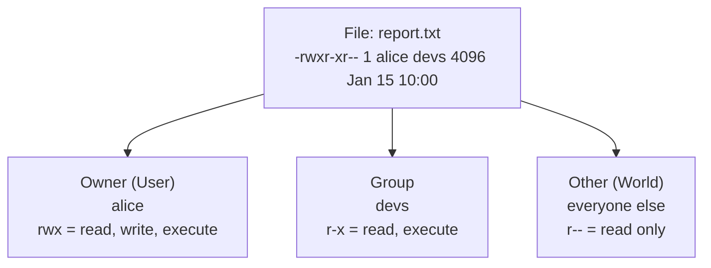
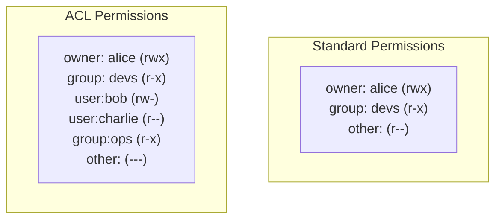
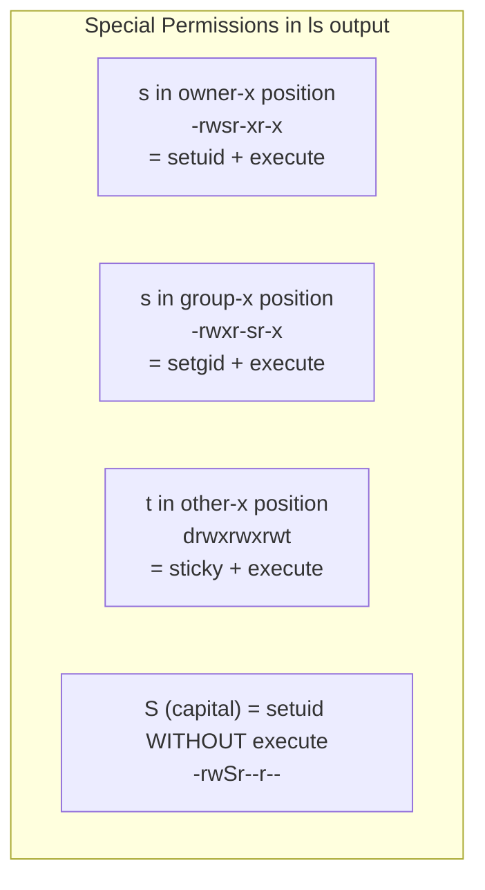
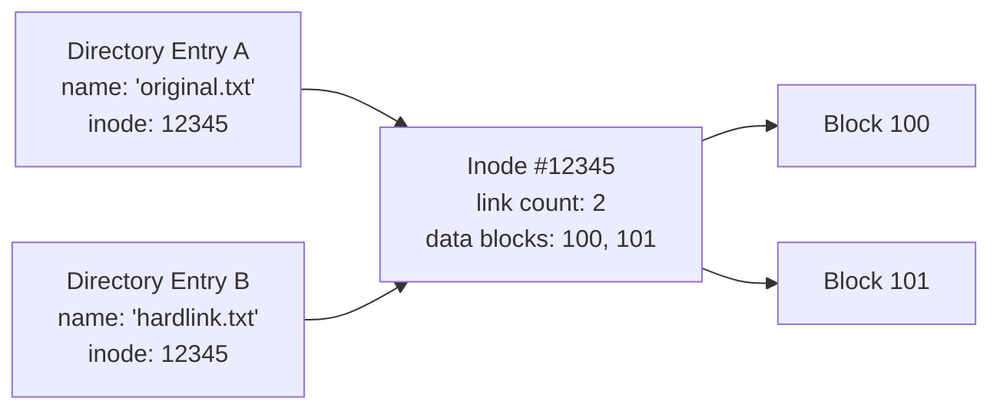
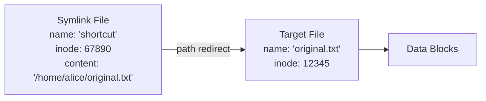
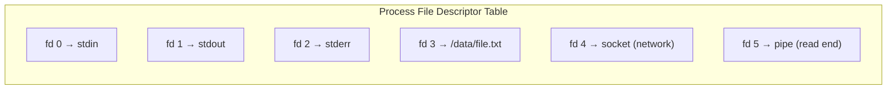

## Learning Objectives

By the end of this lesson, you will be able to:

- Understand the Unix permission model (rwx, owner/group/other)
- Use chmod, chown, and chgrp to manage permissions
- Explain Access Control Lists (ACLs) for fine-grained access
- Understand special permissions: setuid, setgid, and sticky bit
- Differentiate between hard links and symbolic links
- Explain file descriptors and their role in I/O
- Navigate special filesystems: /dev, /proc, and /sys

## Prerequisites

- Understanding of file system concepts: inodes, directories, VFS
- Familiarity with Linux command-line operations
- Basic knowledge of users and groups in Linux

---

## The Unix Permission Model

Every file and directory in Unix/Linux has three sets of permissions for three categories of users.

### Permission Categories



### Permission Bits

```
-rwxr-xr-- 1 alice devs 4096 Jan 15 10:00 report.txt
│├─┤├─┤├─┤
│ │  │  └── Other permissions  (r-- = 4)
│ │  └───── Group permissions  (r-x = 5)
│ └──────── Owner permissions  (rwx = 7)
└────────── File type (- = regular, d = directory, l = symlink)
```

### Permission Values

| Permission | Symbol | Octal | Effect on Files | Effect on Directories |
|-----------|--------|-------|----------------|----------------------|
| Read | `r` | 4 | View file contents | List directory contents |
| Write | `w` | 2 | Modify file contents | Create/delete files in directory |
| Execute | `x` | 1 | Run as program | Enter directory (cd) |
| None | `-` | 0 | No access | No access |

### Octal Notation

Permissions are commonly expressed as a 3-digit octal number:

| Octal | Binary | Permissions | Meaning |
|-------|--------|-------------|---------|
| 7 | 111 | rwx | Full access |
| 6 | 110 | rw- | Read and write |
| 5 | 101 | r-x | Read and execute |
| 4 | 100 | r-- | Read only |
| 3 | 011 | -wx | Write and execute |
| 2 | 010 | -w- | Write only |
| 1 | 001 | --x | Execute only |
| 0 | 000 | --- | No access |

Common permission patterns:

| Octal | Symbolic | Use Case |
|-------|----------|----------|
| 755 | rwxr-xr-x | Executable programs, public directories |
| 644 | rw-r--r-- | Regular files (owner writes, others read) |
| 700 | rwx------ | Private directories/scripts |
| 600 | rw------- | Private files (SSH keys, configs) |
| 777 | rwxrwxrwx | Full access for everyone (avoid!) |
| 750 | rwxr-x--- | Group-shared programs |
| 640 | rw-r----- | Group-readable files |

---

## chmod, chown, and chgrp

### chmod — Change Permissions

```bash
# Octal mode
chmod 755 script.sh        # rwxr-xr-x
chmod 644 config.yml       # rw-r--r--
chmod 600 id_rsa           # rw------- (SSH key)

# Symbolic mode
chmod u+x script.sh        # Add execute for owner
chmod g-w file.txt          # Remove write for group
chmod o=r file.txt          # Set other to read-only
chmod a+r file.txt          # Add read for all (a = all)
chmod u=rwx,g=rx,o= dir/   # Owner: rwx, Group: rx, Other: none

# Recursive (apply to directory and contents)
chmod -R 755 /var/www/html/

# Common patterns
chmod +x script.sh          # Make executable (shorthand)
chmod -x script.sh          # Remove executable
```

### chown — Change Ownership

```bash
# Change owner
sudo chown alice file.txt

# Change owner and group
sudo chown alice:devs file.txt

# Change group only
sudo chown :devs file.txt

# Recursive
sudo chown -R www-data:www-data /var/www/

# View current ownership
ls -la file.txt
# -rw-r--r-- 1 alice devs 4096 Jan 15 10:00 file.txt
```

### chgrp — Change Group

```bash
# Change group
sudo chgrp devs project/

# Recursive
sudo chgrp -R devs project/

# View user's groups
groups alice
# alice : alice devs sudo docker

# Add user to a group
sudo usermod -aG devs bob
```

---

## Access Control Lists (ACLs)

Standard Unix permissions are limited — you can only set permissions for one owner, one group, and "others." **ACLs** provide fine-grained access control for individual users and groups.



```bash
# View ACL
getfacl file.txt
# # file: file.txt
# # owner: alice
# # group: devs
# user::rw-
# user:bob:rw-
# group::r--
# group:ops:r-x
# mask::rwx
# other::---

# Set ACL for a specific user
setfacl -m u:bob:rw file.txt

# Set ACL for a specific group
setfacl -m g:ops:rx directory/

# Set default ACL (inherited by new files in directory)
setfacl -d -m u:bob:rw directory/

# Remove specific ACL entry
setfacl -x u:bob file.txt

# Remove all ACLs
setfacl -b file.txt

# A '+' in ls output indicates ACL presence
ls -la file.txt
# -rw-rw-r--+ 1 alice devs 4096 Jan 15 10:00 file.txt
#           ^ ACL present
```

### The ACL Mask

The **mask** entry limits the maximum permissions for named users, named groups, and the owning group:

```
Effective permissions = Entry permissions AND mask

User bob ACL: rw-
Mask:         r--
Effective:    r-- (write is masked out!)
```

---

## Special Permissions

### setuid (Set User ID)

When a **setuid** program is executed, it runs with the **file owner's** privileges instead of the executing user's. This is how normal users can change their passwords.

```bash
# setuid is shown as 's' in the owner execute position
ls -la /usr/bin/passwd
# -rwsr-xr-x 1 root root 68208 Jan 15 /usr/bin/passwd
#    ^
#    setuid: runs as root regardless of who executes it

# Set setuid
chmod u+s program
chmod 4755 program    # 4 = setuid
```

### setgid (Set Group ID)

When set on a **file**, the program runs with the file's group. When set on a **directory**, new files inherit the directory's group.

```bash
# setgid on file
ls -la /usr/bin/write
# -rwxr-sr-x 1 root tty 19024 Jan 15 /usr/bin/write
#       ^
#       setgid: runs with group 'tty'

# setgid on directory — new files inherit directory's group
chmod g+s /shared/project/
chmod 2775 /shared/project/

# Create a shared project directory
sudo mkdir /shared/project
sudo chown :devs /shared/project
sudo chmod 2775 /shared/project
# Now any file created here belongs to group 'devs'
```

### Sticky Bit

The **sticky bit** on a directory means only the file owner (or root) can delete or rename files within it, even if others have write permission. `/tmp` is the classic example.

```bash
# Sticky bit shown as 't' in other execute position
ls -ld /tmp
# drwxrwxrwt 15 root root 4096 Jan 15 10:00 /tmp
#          ^
#          sticky bit: only owner can delete their own files

# Set sticky bit
chmod +t directory/
chmod 1777 directory/   # 1 = sticky bit
```

### Special Permission Summary

| Permission | Octal | On File | On Directory |
|-----------|-------|---------|-------------|
| setuid | 4000 | Runs as file owner | (No effect) |
| setgid | 2000 | Runs with file group | New files inherit group |
| Sticky | 1000 | (Legacy: keep in memory) | Only owner can delete |



---

## Hard Links vs Symbolic Links

### Hard Links

A **hard link** is an additional directory entry pointing to the same inode. The file has multiple names but is stored only once.



```bash
# Create a hard link
ln original.txt hardlink.txt

# Both point to the same inode
ls -li original.txt hardlink.txt
# 12345 -rw-r--r-- 2 alice alice 100 Jan 15 original.txt
# 12345 -rw-r--r-- 2 alice alice 100 Jan 15 hardlink.txt
# ↑                ↑
# same inode       link count = 2

# Deleting one doesn't affect the other
rm original.txt
cat hardlink.txt   # Still works — data persists until link count = 0
```

### Symbolic (Soft) Links

A **symbolic link** is a special file that contains the path to another file. It's an indirect reference — like a shortcut.



```bash
# Create a symbolic link
ln -s /home/alice/original.txt shortcut

# View symlink
ls -la shortcut
# lrwxrwxrwx 1 alice alice 28 Jan 15 shortcut -> /home/alice/original.txt

# Symlink has its own inode
ls -li shortcut original.txt
# 67890 lrwxrwxrwx 1 alice alice  28 Jan 15 shortcut -> original.txt
# 12345 -rw-r--r-- 1 alice alice 100 Jan 15 original.txt

# If target is deleted, symlink breaks (dangling link)
rm original.txt
cat shortcut   # ERROR: No such file or directory

# Find broken symlinks
find /home -xtype l
```

### Hard Links vs Symbolic Links

| Feature | Hard Link | Symbolic Link |
|---------|-----------|---------------|
| Points to | Inode directly | Path string |
| Cross filesystem | No (same FS only) | Yes |
| Link to directory | No (usually forbidden) | Yes |
| Survives target deletion | Yes (independent name for same data) | No (becomes dangling) |
| Own inode | No (shares target's inode) | Yes (separate inode) |
| Storage | No extra space | Small (stores path string) |
| Permission | Same as target (shared inode) | Always lrwxrwxrwx (target permissions apply) |
| Relative paths | N/A | Supported |

---

## File Descriptors

A **file descriptor (fd)** is a small non-negative integer that the kernel uses to identify an open file within a process. It's the handle returned by `open()`.

### Standard File Descriptors

| fd | Name | C Constant | Default |
|----|------|-----------|---------|
| 0 | Standard Input | `STDIN_FILENO` | Terminal (keyboard) |
| 1 | Standard Output | `STDOUT_FILENO` | Terminal (screen) |
| 2 | Standard Error | `STDERR_FILENO` | Terminal (screen) |
| 3+ | User files | — | Returned by `open()` |



### Shell Redirection and File Descriptors

```bash
# Redirect stdout to file
ls > output.txt          # fd 1 → file

# Redirect stderr to file
ls /nonexistent 2> errors.txt    # fd 2 → file

# Redirect both stdout and stderr
ls /tmp /nonexistent &> all.txt  # fd 1 + fd 2 → file

# Redirect stderr to stdout
ls /nonexistent 2>&1             # fd 2 → fd 1

# Append instead of overwrite
echo "line" >> output.txt

# Input redirection
sort < unsorted.txt              # fd 0 ← file

# Here document
cat <<EOF
Hello, this is
a here document
EOF
```

### Viewing File Descriptors

```bash
# View open file descriptors of current shell
ls -la /proc/$$/fd/
# lrwx------ 1 alice alice 64 Jan 15 0 -> /dev/pts/0
# lrwx------ 1 alice alice 64 Jan 15 1 -> /dev/pts/0
# lrwx------ 1 alice alice 64 Jan 15 2 -> /dev/pts/0
# lr-x------ 1 alice alice 64 Jan 15 255 -> /dev/pts/0

# View fd limits
ulimit -n         # Per-process limit (soft)
# 1024

ulimit -Hn        # Hard limit
# 1048576

# System-wide limit
cat /proc/sys/fs/file-max
# 9223372036854775807

# Count open fds system-wide
cat /proc/sys/fs/file-nr
# 5632  0  9223372036854775807
# allocated  unused  maximum

# View fds for any process
ls -la /proc/$(pidof nginx)/fd/ | head -10

# More detailed: lsof
lsof -p $$ | head -20
```

---

## Special Files: /dev, /proc, /sys

### /dev — Device Files

`/dev` contains **device files** — special files representing hardware devices and pseudo-devices.

| Device | Type | Description |
|--------|------|-------------|
| `/dev/sda` | Block | First SCSI/SATA disk |
| `/dev/sda1` | Block | First partition of sda |
| `/dev/nvme0n1` | Block | First NVMe drive |
| `/dev/null` | Char | Discards all input |
| `/dev/zero` | Char | Infinite stream of zeros |
| `/dev/random` | Char | Cryptographic random data |
| `/dev/urandom` | Char | Pseudo-random data (non-blocking) |
| `/dev/tty` | Char | Current terminal |
| `/dev/loop0` | Block | Loopback device |

```bash
# Discard output
command > /dev/null 2>&1

# Generate zero-filled file
dd if=/dev/zero of=empty.img bs=1M count=100

# Generate random data
dd if=/dev/urandom of=random.bin bs=1M count=1

# View device numbers
ls -la /dev/sda
# brw-rw---- 1 root disk 8, 0 Jan 15 /dev/sda
#                         ↑  ↑
#                   major  minor (device numbers)
```

### /proc — Process Information

`/proc` is a **pseudo-filesystem** exposing kernel and process information as files.

```bash
# Process-specific information
cat /proc/$$/status      # Process status
cat /proc/$$/maps        # Memory map
cat /proc/$$/cmdline     # Command that started the process
ls /proc/$$/fd/          # Open file descriptors
cat /proc/$$/io          # I/O statistics

# System-wide information
cat /proc/cpuinfo        # CPU details
cat /proc/meminfo        # Memory statistics
cat /proc/version        # Kernel version
cat /proc/uptime         # System uptime
cat /proc/loadavg        # Load averages
cat /proc/filesystems    # Supported filesystems
cat /proc/mounts         # Mounted filesystems

# Tunable kernel parameters
cat /proc/sys/vm/swappiness
echo 10 | sudo tee /proc/sys/vm/swappiness
```

### /sys — Sysfs Device Model

`/sys` exposes the kernel's **device model** — hardware topology, drivers, and device attributes.

```bash
# View block devices
ls /sys/block/
# sda  sdb  nvme0n1

# Disk scheduler
cat /sys/block/sda/queue/scheduler
# [mq-deadline] kyber bfq none

# Network device info
cat /sys/class/net/eth0/speed      # Link speed
cat /sys/class/net/eth0/address    # MAC address
cat /sys/class/net/eth0/operstate  # up/down

# CPU information
ls /sys/devices/system/cpu/
cat /sys/devices/system/cpu/cpu0/cpufreq/scaling_cur_freq

# Power management
cat /sys/class/power_supply/BAT0/capacity  # Battery percentage

# Thermal sensors
cat /sys/class/thermal/thermal_zone0/temp  # CPU temperature (millidegrees)
```

---

## Key Takeaways

1. The Unix permission model uses **three permission sets** (owner, group, other) with **three permission types** (read, write, execute), commonly expressed in octal notation (e.g., 755).

2. **chmod** changes permissions, **chown** changes ownership, and **chgrp** changes group. **ACLs** extend the model with fine-grained per-user and per-group access control.

3. **Special permissions** — setuid (run as file owner), setgid (run with file group or inherit directory group), and sticky bit (only owner can delete) — handle security scenarios beyond basic rwx.

4. **Hard links** are additional directory entries pointing to the same inode (same filesystem only, persist after original deletion), while **symbolic links** store a path string and can cross filesystems but break if the target is deleted.

5. **File descriptors** are integer handles (0=stdin, 1=stdout, 2=stderr, 3+=user files) that the kernel uses to track open files per process, managed through the per-process FD table, system-wide open file table, and inode table.

6. **Special filesystems** — `/dev` (device files for hardware access), `/proc` (process and kernel information), and `/sys` (device model and attributes) — use the VFS interface to expose kernel data as regular files.
