## Learning Objectives

By the end of this lesson, you will be able to:

- Define files and directories and their role in the OS
- Explain file metadata and inodes
- Describe core file operations (open, read, write, close)
- Compare directory structures: single-level, two-level, tree, and acyclic graph
- Understand filesystem mounting and mount points
- Explain the Virtual File System (VFS) abstraction layer

## Prerequisites

- Understanding of operating system fundamentals
- Familiarity with Linux command line for file operations
- Basic knowledge of storage concepts

---

## What Are Files?

A **file** is a named collection of related data stored on persistent media. From the user's perspective, a file is the smallest logical unit of storage. From the OS perspective, it's a sequence of bytes mapped to physical storage locations.

### File Attributes

Every file has associated **metadata** (data about data):

| Attribute | Description | Example |
|-----------|-------------|---------|
| **Name** | Human-readable identifier | `report.pdf` |
| **Type** | File format/extension | `.txt`, `.c`, `.jpg` |
| **Size** | Number of bytes | 4096 bytes |
| **Location** | Pointer to data blocks on disk | Block 1024, 1025, 1030 |
| **Timestamps** | Created, modified, accessed times | `2024-01-15 10:30:00` |
| **Owner** | User who owns the file | `uid=1000 (alice)` |
| **Permissions** | Access rights | `rwxr-xr-x` |
| **Link count** | Number of directory entries pointing here | 2 |

### File Types in Unix

| Type | Symbol | Description | Example |
|------|--------|-------------|---------|
| Regular file | `-` | Data (text, binary, etc.) | `file.txt` |
| Directory | `d` | Contains directory entries | `/home/user/` |
| Symbolic link | `l` | Pointer to another file | `link → target` |
| Block device | `b` | Block-oriented I/O device | `/dev/sda` |
| Character device | `c` | Character-oriented I/O device | `/dev/tty` |
| Named pipe (FIFO) | `p` | IPC mechanism | `/tmp/myfifo` |
| Socket | `s` | IPC endpoint | `/var/run/docker.sock` |

```bash
# View file types
ls -la /dev/ | head -15
# crw-rw-rw-  1 root root  1,  3 Jan  1 00:00 null
# crw-rw-rw-  1 root root  1,  5 Jan  1 00:00 zero
# brw-rw----  1 root disk  8,  0 Jan  1 00:00 sda
# lrwxrwxrwx  1 root root       3 Jan  1 00:00 cdrom -> sr0

# Identify file type
file /bin/bash
# /bin/bash: ELF 64-bit LSB pie executable, x86-64

file /etc/hostname
# /etc/hostname: ASCII text
```

---

## Inodes: The Heart of File Metadata

An **inode** (index node) is a data structure on disk that stores all metadata about a file except its name. Every file and directory has exactly one inode.

```mermaid
graph TD
    subgraph "Inode (example: inode #12345)"
        META["Metadata:<br/>Type: regular file<br/>Permissions: 0644<br/>Owner: UID 1000<br/>Group: GID 1000<br/>Size: 8192 bytes<br/>Link count: 1<br/>Timestamps:<br/>  atime, mtime, ctime"]
        DIRECT["Direct pointers (12):<br/>Block 100, 101, ...]
        SINGLE["Single indirect pointer:<br/>→ Block of pointers"]
        DOUBLE["Double indirect pointer:<br/>→ Block of pointer blocks"]
        TRIPLE["Triple indirect pointer:<br/>→ Block of pointer-pointer blocks"]
    end

    DIRECT --> D1["Data Block 100"]
    DIRECT --> D2["Data Block 101"]
    SINGLE --> SI["Indirect Block"]
    SI --> D3["Data Block 200"]
    SI --> D4["Data Block 201"]
```

### Inode Structure

| Field | Size (typical) | Description |
|-------|---------------|-------------|
| Mode | 2 bytes | File type + permissions |
| Owner (UID) | 4 bytes | User ID |
| Group (GID) | 4 bytes | Group ID |
| Size | 8 bytes | File size in bytes |
| Timestamps | 3 × 4 bytes | atime, mtime, ctime |
| Link count | 2 bytes | Number of hard links |
| Block count | 4 bytes | Number of 512-byte blocks |
| Direct pointers | 12 × 4 bytes | Point directly to data blocks |
| Single indirect | 4 bytes | Points to block of pointers |
| Double indirect | 4 bytes | Two levels of indirection |
| Triple indirect | 4 bytes | Three levels of indirection |

### Inode Pointer Structure

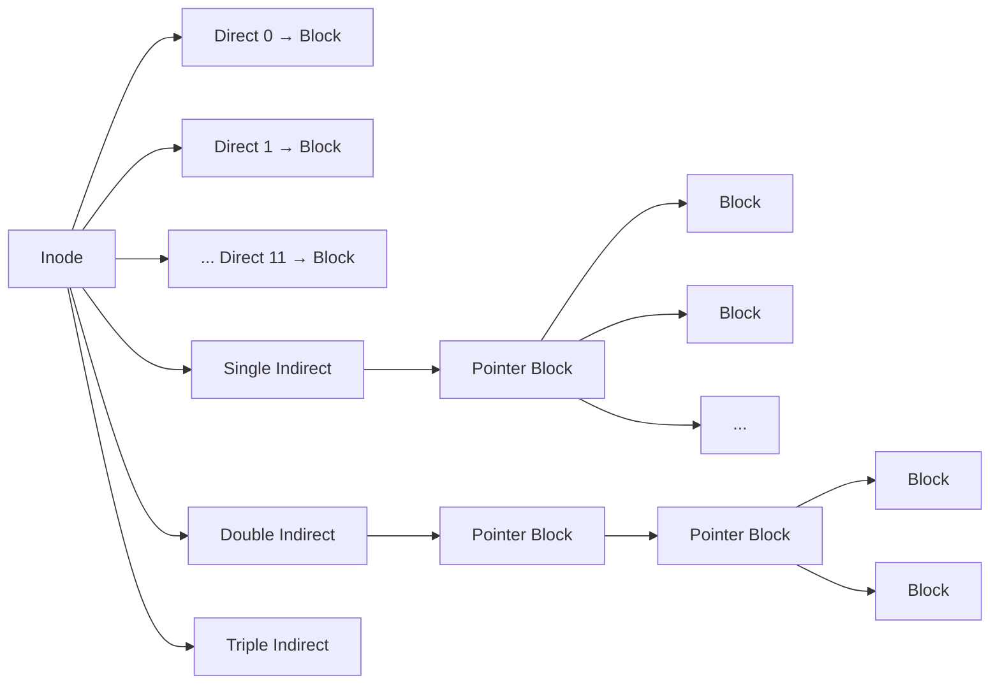

With 4 KB blocks and 4-byte pointers:
- 12 direct pointers: 12 × 4 KB = **48 KB**
- Single indirect: 1024 × 4 KB = **4 MB**
- Double indirect: 1024² × 4 KB = **4 GB**
- Triple indirect: 1024³ × 4 KB = **4 TB**

### Examining Inodes

```bash
# View inode number
ls -i file.txt
# 12345 file.txt

# Detailed inode information
stat file.txt
# Output:
#   File: file.txt
#   Size: 4096       Blocks: 8        IO Block: 4096   regular file
# Device: 802h/2050d Inode: 12345     Links: 1
# Access: (0644/-rw-r--r--)  Uid: (1000/alice)  Gid: (1000/alice)
# Access: 2024-01-15 10:30:00.000000000 +0000
# Modify: 2024-01-14 09:15:00.000000000 +0000
# Change: 2024-01-14 09:15:00.000000000 +0000
#  Birth: 2024-01-10 08:00:00.000000000 +0000

# View inode usage on filesystem
df -i
# Filesystem      Inodes   IUsed   IFree IUse% Mounted on
# /dev/sda2      6553600  234567 6319033    4% /

# Find files by inode number
find / -inum 12345
```

---

## File Operations

The OS provides a set of **system calls** for file manipulation. Applications use these through library wrappers.

### Core File Operations

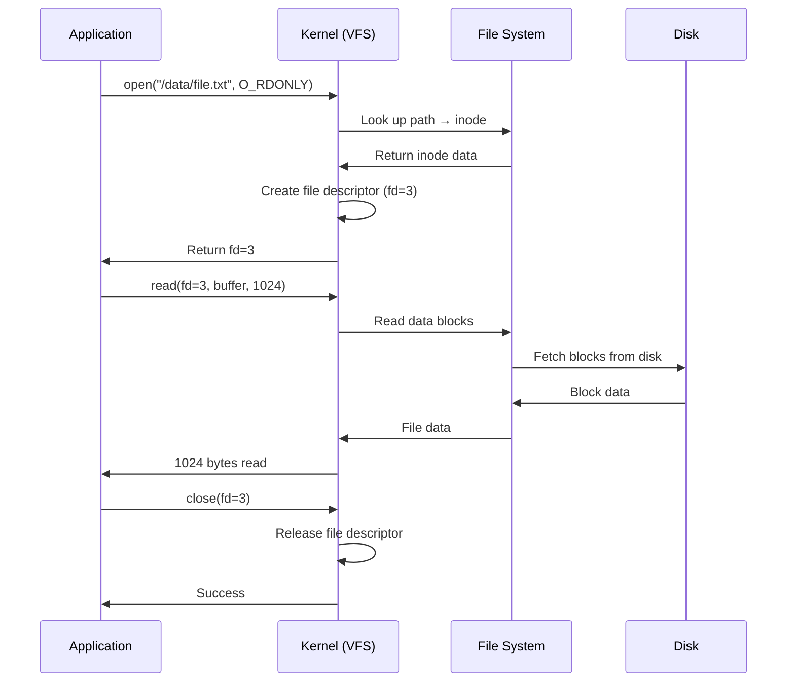

### The File Descriptor Table

When a process opens a file, the kernel creates entries in three layers:

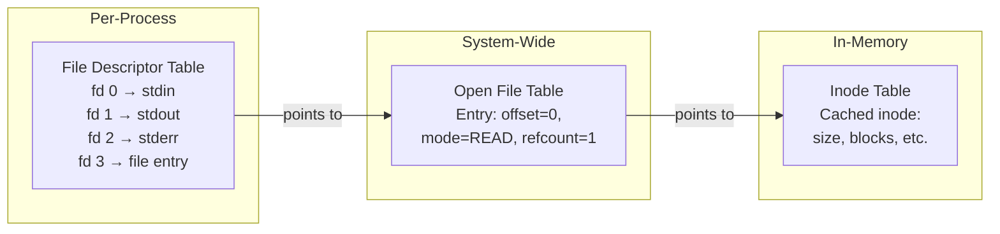

| Layer | Scope | Contents |
|-------|-------|----------|
| **File Descriptor Table** | Per-process | Array of pointers to open file table entries |
| **Open File Table** | System-wide | Current offset, access mode, reference count |
| **Inode Table** | System-wide | Cached inode data (on-disk metadata) |

### File Operations in C

```c
#include <stdio.h>
#include <fcntl.h>
#include <unistd.h>
#include <string.h>

int main() {
    // Create and write
    int fd = open("example.txt", O_CREAT | O_WRONLY | O_TRUNC, 0644);
    const char *data = "Hello, File System!\n";
    write(fd, data, strlen(data));
    close(fd);

    // Read back
    char buffer[256];
    fd = open("example.txt", O_RDONLY);
    ssize_t bytes = read(fd, buffer, sizeof(buffer) - 1);
    buffer[bytes] = '\0';
    printf("Read: %s", buffer);

    // Seek to beginning
    lseek(fd, 0, SEEK_SET);

    // Get file info via fd
    struct stat st;
    fstat(fd, &st);
    printf("Size: %ld bytes\n", st.st_size);

    close(fd);
    return 0;
}
```

### Common open() Flags

| Flag | Purpose |
|------|---------|
| `O_RDONLY` | Open for reading only |
| `O_WRONLY` | Open for writing only |
| `O_RDWR` | Open for reading and writing |
| `O_CREAT` | Create if doesn't exist |
| `O_TRUNC` | Truncate to zero length |
| `O_APPEND` | Append writes to end |
| `O_EXCL` | Fail if file exists (with O_CREAT) |
| `O_SYNC` | Synchronous writes (flush to disk) |

---

## Directory Structures

Directories organize files into a hierarchical namespace. A directory is itself a special file containing a list of **(name, inode number)** pairs.

### Single-Level Directory

All files in one directory. Simple but impractical — name collisions are inevitable.

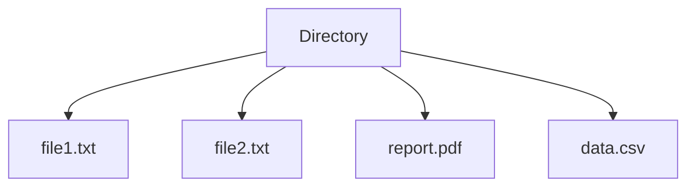

### Two-Level Directory

Each user gets their own directory. Solves name collisions between users but not within a user's files.

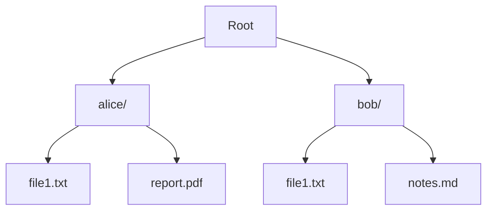

### Tree-Structured Directory

The standard hierarchical structure used by all modern file systems.

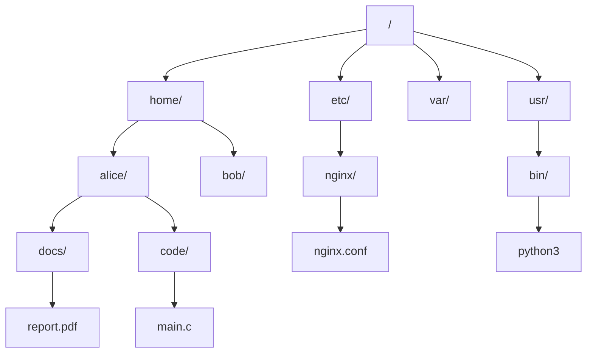

### Acyclic-Graph Directory

Allows **shared files/directories** through links (hard links or symbolic links), but prohibits cycles.

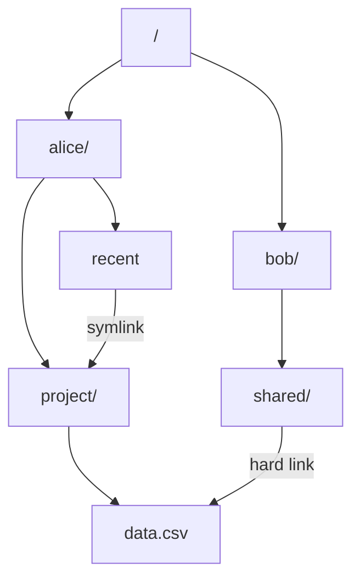

### Directory Operations

```bash
# View directory as a file (list entries)
ls -la /home/alice/

# View directory entry details (name → inode mapping)
ls -lai /home/alice/
# 12345 drwxr-xr-x 2 alice alice 4096 Jan 15 10:00 .
# 12340 drwxr-xr-x 5 root  root  4096 Jan 10 08:00 ..
# 12346 -rw-r--r-- 1 alice alice  100 Jan 15 10:00 file.txt

# What does a directory actually contain? (name, inode pairs)
# Each entry is: (inode_number, name_length, name_string)

# Create directories
mkdir -p /home/alice/projects/myapp/src

# Remove empty directory
rmdir /home/alice/old

# Remove directory tree
rm -rf /home/alice/old_project
```

---

## Mounting File Systems

**Mounting** is the process of attaching a file system (from a partition, disk, or network) to a specific directory (the **mount point**) in the existing directory tree.

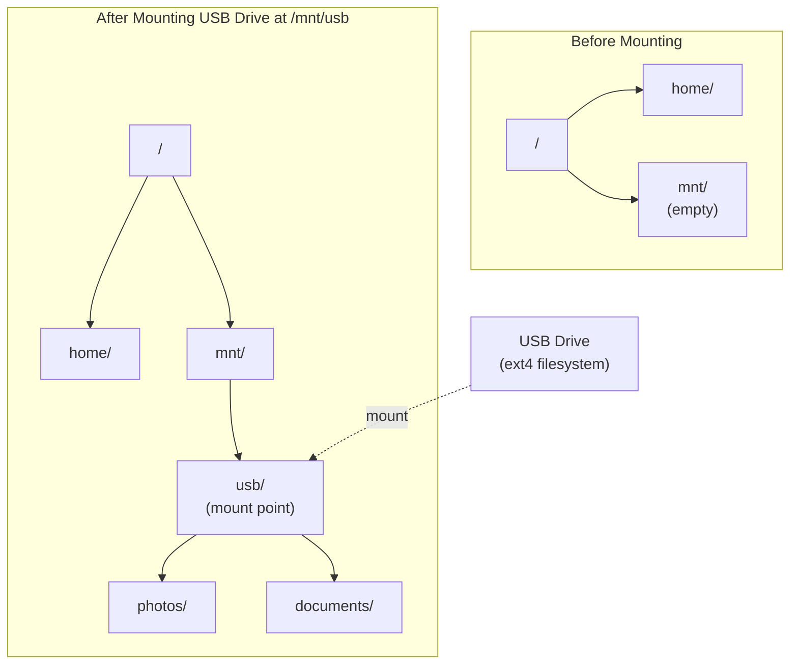

### Mount Operations

```bash
# View all mounted filesystems
mount | column -t

# View with types and sizes
df -hT
# Filesystem     Type   Size  Used Avail Use% Mounted on
# /dev/sda2      ext4   100G   30G   65G  32% /
# /dev/sda1      vfat   512M   50M  462M  10% /boot/efi
# tmpfs          tmpfs  7.8G   50M  7.7G   1% /dev/shm
# /dev/sdb1      ext4   500G  200G  275G  42% /data

# Mount a partition
sudo mount /dev/sdb1 /mnt/data

# Mount with specific options
sudo mount -t ext4 -o ro,noexec /dev/sdb1 /mnt/data

# Mount an ISO image
sudo mount -o loop image.iso /mnt/iso

# Mount an NFS share
sudo mount -t nfs server:/export /mnt/nfs

# Unmount
sudo umount /mnt/data

# View /etc/fstab (persistent mount configuration)
cat /etc/fstab
# /dev/sda2  /      ext4  defaults        0 1
# /dev/sda1  /boot/efi  vfat  umask=0077  0 1
# /dev/sdb1  /data  ext4  defaults,noatime  0 2
```

### Mount Options

| Option | Description |
|--------|-------------|
| `ro` / `rw` | Read-only / read-write |
| `noexec` | Prevent execution of binaries |
| `nosuid` | Ignore setuid/setgid bits |
| `nodev` | Ignore device files |
| `noatime` | Don't update access time (performance) |
| `sync` | Synchronous I/O |
| `loop` | Mount a file as a block device |

---

## Virtual File System (VFS)

The **VFS** is an abstraction layer in the kernel that provides a **uniform interface** to different file system implementations. Applications use the same system calls (`open`, `read`, `write`) regardless of whether the underlying file system is ext4, XFS, NFS, or procfs.

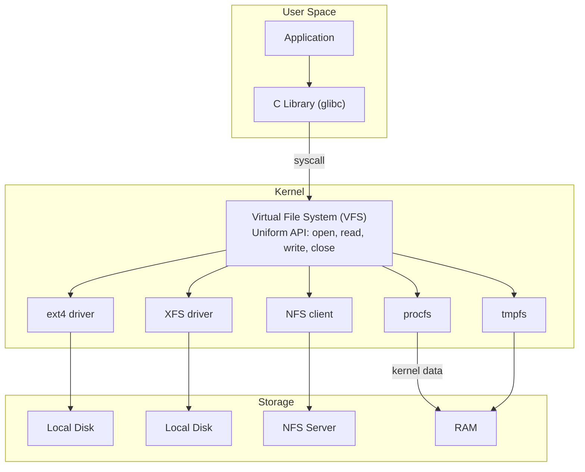

### VFS Objects

The VFS defines four primary objects that every file system must implement:

| VFS Object | Represents | Key Operations |
|------------|-----------|----------------|
| **Superblock** | A mounted filesystem | `statfs`, `sync_fs` |
| **Inode** | A file (metadata) | `lookup`, `create`, `link`, `unlink` |
| **Dentry** | A directory entry (name → inode) | `compare`, `delete`, `release` |
| **File** | An open file (per-process) | `read`, `write`, `llseek`, `mmap` |

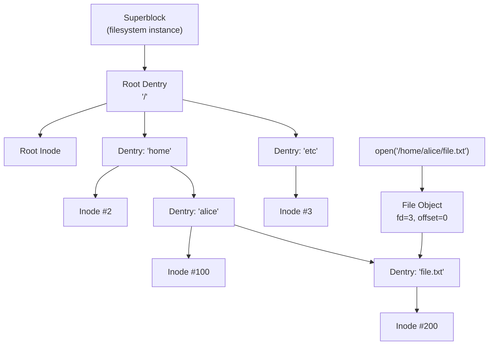

### How VFS Path Resolution Works

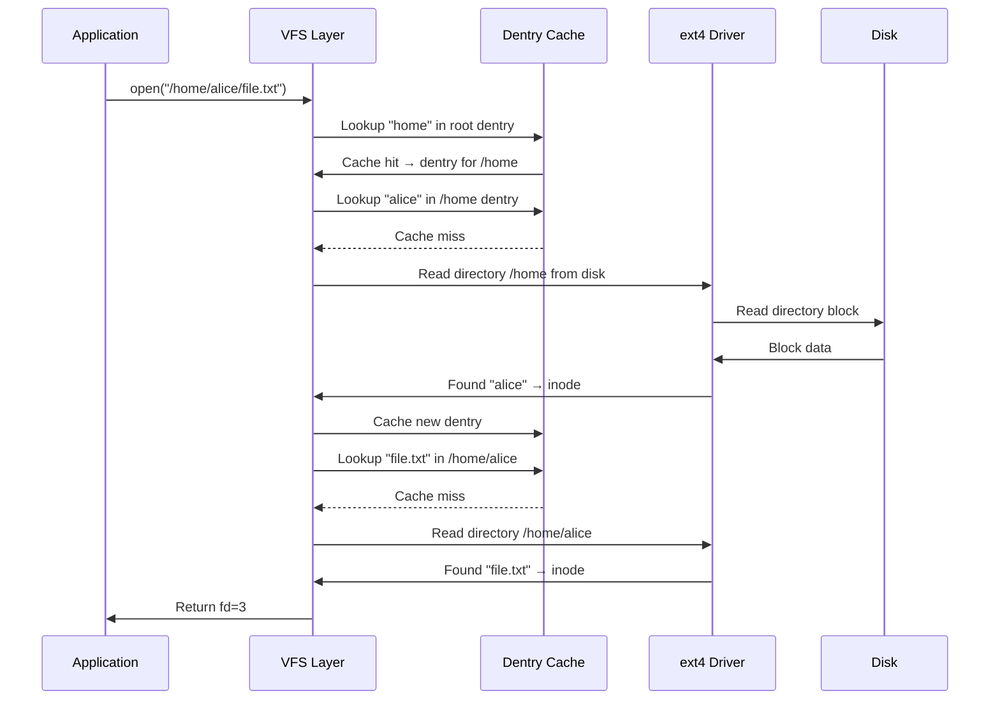

### Pseudo Filesystems

Linux uses VFS to expose kernel data through filesystem interfaces:

| Filesystem | Mount Point | Purpose |
|-----------|-------------|---------|
| `procfs` | `/proc` | Process and kernel information |
| `sysfs` | `/sys` | Device and driver information |
| `devtmpfs` | `/dev` | Device files |
| `tmpfs` | `/tmp`, `/dev/shm` | RAM-backed temporary files |
| `cgroup2fs` | `/sys/fs/cgroup` | Resource control groups |
| `debugfs` | `/sys/kernel/debug` | Kernel debugging interface |

```bash
# These are all VFS-based — no physical disk
mount -t proc proc /proc
mount -t sysfs sysfs /sys
mount -t tmpfs tmpfs /tmp

# Read kernel data through VFS
cat /proc/version
cat /proc/cpuinfo
cat /sys/class/net/eth0/speed
```

---

## Key Takeaways

1. **Files** are named collections of data with metadata stored in **inodes** containing ownership, permissions, timestamps, size, and pointers to data blocks on disk.

2. **Inodes** use a multi-level pointer structure (direct, single/double/triple indirect) to map file contents to disk blocks, supporting files from a few bytes to terabytes.

3. The four core file operations — **open** (returns a file descriptor), **read/write** (transfer data), and **close** (release resources) — work through a three-layer table structure: per-process FD table, system-wide open file table, and inode table.

4. **Directory structures** evolved from flat single-level to hierarchical trees and acyclic graphs with links. A directory is a special file mapping names to inode numbers.

5. **Mounting** attaches a file system to a mount point in the directory tree, making its contents accessible. Configuration persists through `/etc/fstab`.

6. The **VFS (Virtual File System)** layer provides a uniform interface so applications use the same system calls regardless of the underlying file system (ext4, XFS, NFS, procfs, tmpfs).
