## Learning Objectives

By the end of this lesson, you will be able to:

- Describe the on-disk layout of a file system (superblock, inode table, data blocks)
- Compare file allocation methods: contiguous, linked, and indexed
- Explain free space management using bitmaps and linked lists
- Understand journaling and how it prevents filesystem corruption
- Compare copy-on-write filesystems (ZFS, Btrfs) with traditional designs
- Evaluate trade-offs between different filesystem implementations

## Prerequisites

- Understanding of file system concepts: files, directories, inodes, VFS
- Basic knowledge of disk storage (blocks, sectors)
- Familiarity with Linux filesystem commands

---

## Disk Layout

A file system must organize its on-disk structure to efficiently store and retrieve files. Here's how a typical Unix-like file system (e.g., ext4) lays out data on a partition.

### High-Level Disk Layout

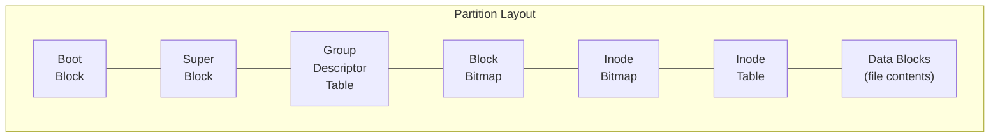

### ext4 Block Group Structure

ext4 divides the partition into **block groups** (typically 128 MB each), and each group has its own metadata:

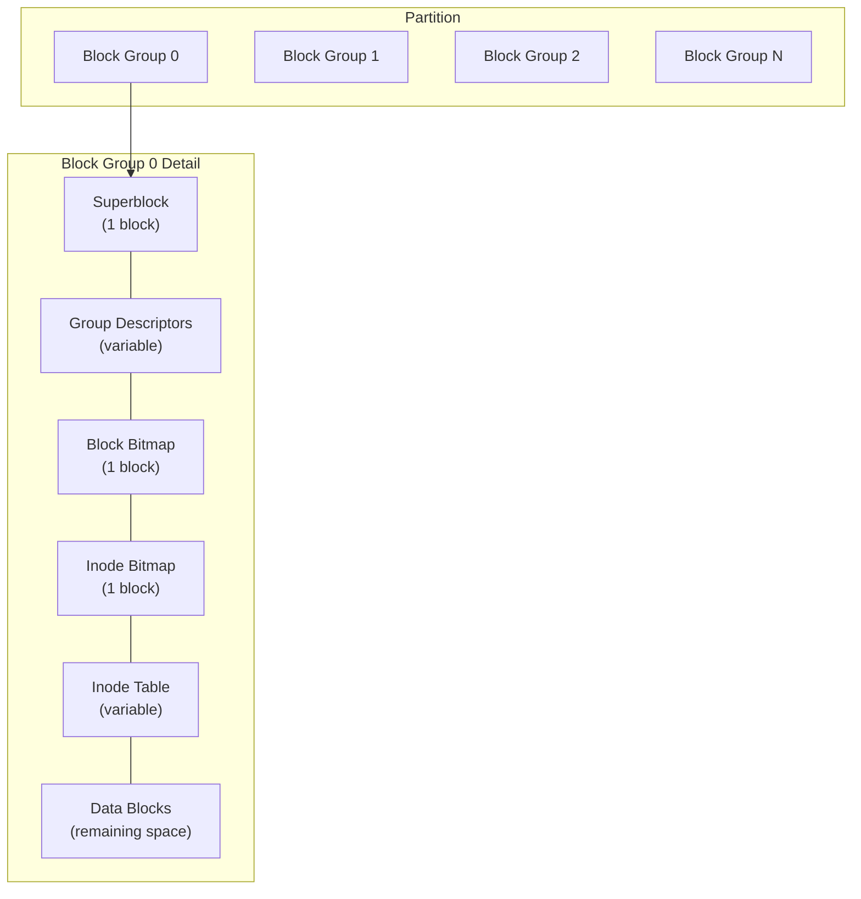

### Key On-Disk Structures

| Structure | Purpose | Size |
|-----------|---------|------|
| **Superblock** | Filesystem metadata (block size, inode count, free blocks, FS state) | 1 block |
| **Group Descriptor Table** | Locations of bitmaps and inode tables for all block groups | Variable |
| **Block Bitmap** | One bit per block — 1 = used, 0 = free | 1 block (tracks 32K blocks with 4KB blocks) |
| **Inode Bitmap** | One bit per inode — 1 = used, 0 = free | 1 block |
| **Inode Table** | Array of inode structures (256 bytes each in ext4) | Variable |
| **Data Blocks** | Actual file and directory content | Remaining space |

### The Superblock

```bash
# View superblock information
sudo dumpe2fs /dev/sda2 | head -40
# Filesystem volume name:   <none>
# Filesystem UUID:          a1b2c3d4-...
# Filesystem magic number:  0xEF53
# Filesystem state:         clean
# Block count:              26214400
# Free blocks:              18000000
# Block size:               4096
# Inode count:              6553600
# Free inodes:              6400000
# Inode size:               256
# Journal size:             128M
# First inode:              11

# View superblock with tune2fs
sudo tune2fs -l /dev/sda2
```

---

## File Allocation Methods

How does the filesystem decide where to place a file's data blocks on disk? There are three main strategies.

### 1. Contiguous Allocation

Each file occupies a set of **contiguous blocks** on disk. The directory entry stores the starting block and length.

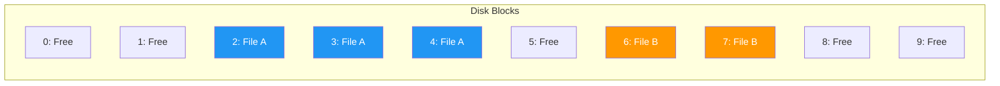

**Directory entry:** `File A: start=2, length=3`

| Advantage | Disadvantage |
|-----------|-------------|
| Fast sequential access (no seeking) | **External fragmentation** (gaps between files) |
| Simple implementation | File size must be known at creation |
| Random access is easy (start + offset) | Growing files is difficult |

**Used by:** ISO 9660 (CD-ROMs), some embedded systems

### 2. Linked Allocation

Each block contains a pointer to the next block, forming a **linked list**. No external fragmentation.

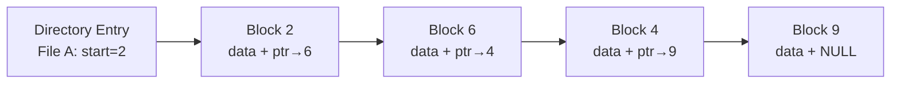

| Advantage | Disadvantage |
|-----------|-------------|
| No external fragmentation | **Slow random access** (must traverse list) |
| Files can grow easily | Pointer overhead in each block |
| Simple allocation | Unreliable (one bad pointer breaks the chain) |

### FAT (File Allocation Table)

**FAT** improves linked allocation by moving all pointers into a separate table (the FAT):

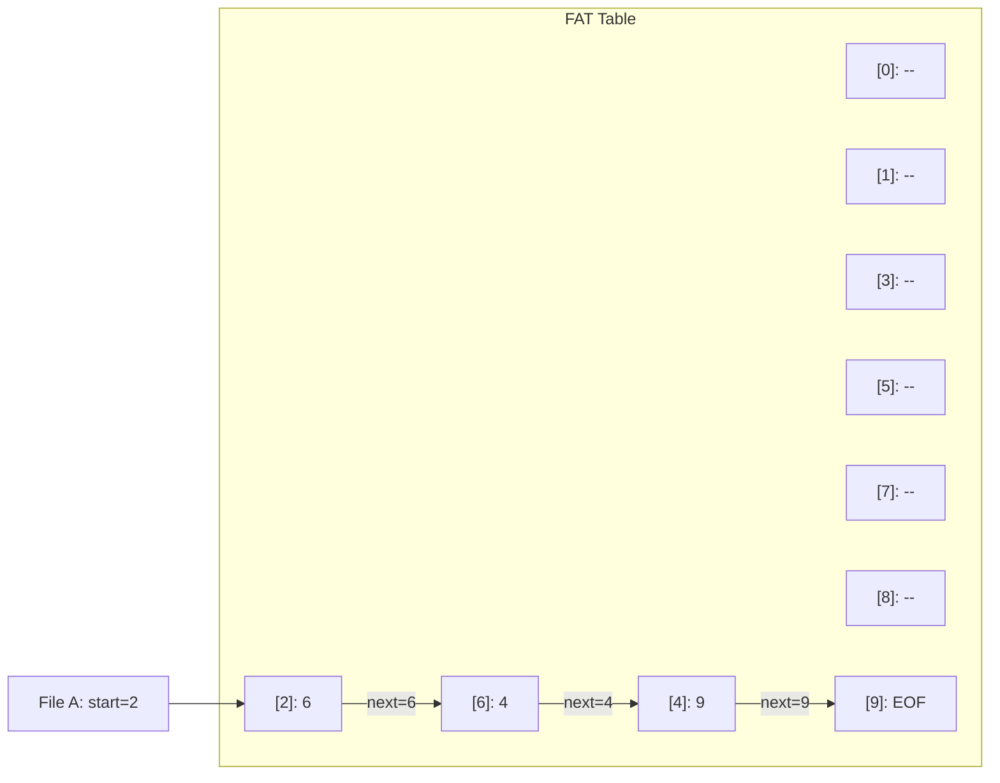

The FAT can be cached in memory for fast lookup. Used by FAT12/16/32 and exFAT (USB drives, SD cards).

### 3. Indexed Allocation

Each file has an **index block** (an array of pointers to data blocks). This is what inodes use.

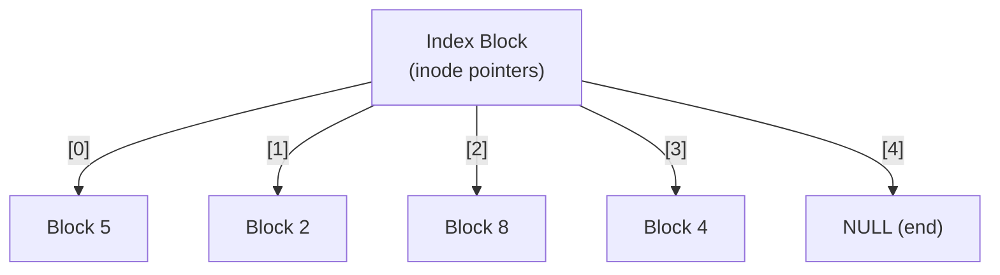

| Advantage | Disadvantage |
|-----------|-------------|
| Fast random access | Index block overhead |
| No external fragmentation | Max file size limited by index block |
| Files can grow | Multi-level indirection for large files |

**Used by:** ext2/3/4, UFS, NTFS (via MFT), HFS+

### Allocation Method Comparison

| Feature | Contiguous | Linked | FAT | Indexed (inode) |
|---------|-----------|--------|-----|-----------------|
| Sequential access | Excellent | Good | Good | Good |
| Random access | Excellent | Poor | Moderate | Excellent |
| External fragmentation | Yes | No | No | No |
| Overhead | Minimal | Pointer per block | FAT table | Index block |
| File growth | Hard | Easy | Easy | Easy |
| Reliability | Good | Poor (chain) | Moderate | Good |
| Modern usage | CD-ROMs | Legacy | USB/SD cards | **Most OS filesystems** |

---

## Free Space Management

The filesystem must track which blocks are free and which are in use.

### Bitmap (Bit Vector)

A bitmap uses one bit per block: 1 = allocated, 0 = free.

```
Block bitmap: 1 1 1 0 1 0 0 1 1 0 0 0 1 1 0 0
Block:        0 1 2 3 4 5 6 7 8 9 ...

Free blocks: 3, 5, 6, 9, 10, 11, 14, 15
```

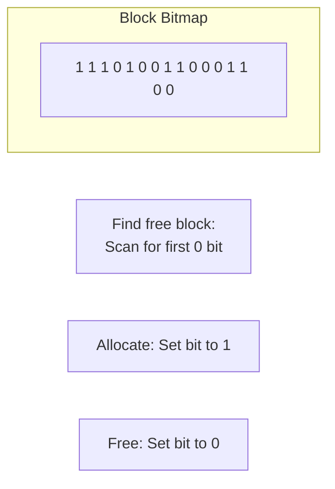

| Advantage | Disadvantage |
|-----------|-------------|
| Fast to find contiguous free blocks | Requires space proportional to disk size |
| Simple bit operations | Entire bitmap ideally in memory |
| Good locality | — |

**Space needed:** 1 TB disk with 4 KB blocks = 256M blocks = 32 MB bitmap

### Linked List

Free blocks form a linked list. Each free block points to the next free block.


| Advantage | Disadvantage |
|-----------|-------------|
| No extra space needed (pointers in free blocks) | Slow to find contiguous blocks |
| Simple to allocate/free | Must traverse list |

### What ext4 Uses

ext4 uses **extent-based** allocation (replacing the old bitmap approach for file layout) combined with block group bitmaps for free space:

```bash
# View extent information for a file
filefrag -v largefile.dat
# Filesystem type is: ef53
# File size of largefile.dat is 10485760 (2560 blocks of 4096 bytes)
#  ext:     logical_offset:        physical_offset: length:   expected: flags:
#    0:        0..    2559:      34816..     37375:   2560:             last,eof

# View filesystem block group allocation
sudo dumpe2fs /dev/sda2 | grep -A 5 "Group 0"
```

---

## Journaling

A power failure during a write operation can leave the filesystem in an **inconsistent state** — metadata might be updated but data blocks not written, or vice versa. **Journaling** prevents corruption by logging changes before applying them.

### The Problem

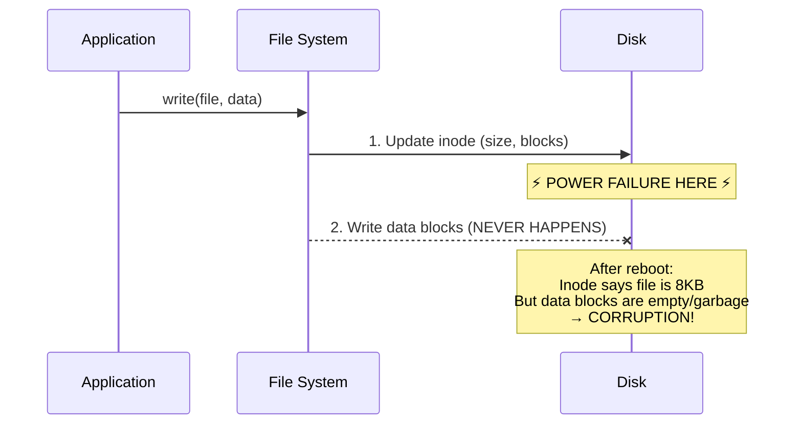

### How Journaling Works

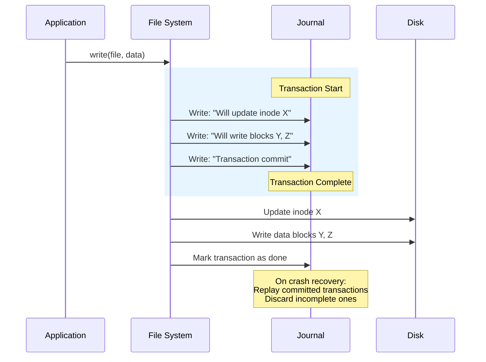

### Journaling Modes

| Mode | What's Journaled | Performance | Safety |
|------|-----------------|-------------|--------|
| **Journal** | Metadata + data | Slowest | Safest (no data loss) |
| **Ordered** (default) | Metadata only; data written before metadata | Moderate | Good (data consistent before metadata) |
| **Writeback** | Metadata only; data written in any order | Fastest | Weakest (data may be stale) |

```bash
# View current journaling mode
sudo tune2fs -l /dev/sda2 | grep "Journal"
# Journal inode:            8
# Journal backup:           inode blocks
# Journal features:         journal_64bit journal_checksum_v3
# Journal size:             128M

# Change journaling mode (requires remount)
sudo mount -o remount,data=journal /dev/sda2
sudo mount -o remount,data=ordered /dev/sda2

# Check journal status
sudo debugfs -R "stat <8>" /dev/sda2
```

### ext4 Journaling

ext4 uses a **circular log** journal (typically 128 MB) stored as a special file (inode 8):

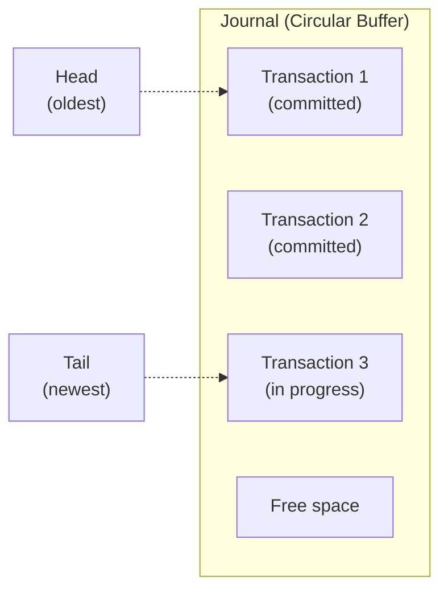

### Recovery After Crash

```bash
# Filesystem check (runs automatically on unclean mount)
sudo fsck -y /dev/sda2

# ext4 specifically
sudo e2fsck -f /dev/sda2

# View filesystem state
sudo tune2fs -l /dev/sda2 | grep state
# Filesystem state:         clean
# (or "not clean" after crash)

# Force a check on next boot
sudo tune2fs -C 100 /dev/sda2
```

### XFS Journaling

XFS uses a more advanced journaling approach with **delayed allocation** and **extent-based** logging:

```bash
# View XFS filesystem information
xfs_info /dev/sda2

# XFS repair
sudo xfs_repair /dev/sda2

# XFS specific tools
xfs_db /dev/sda2     # Debug/examine
xfs_admin /dev/sda2  # Administration
```

---

## Copy-On-Write File Systems

**Copy-on-Write (COW)** file systems never overwrite existing data. Instead, they write new data to a new location and then update the pointer. This fundamentally changes how consistency is maintained.

### How COW Works

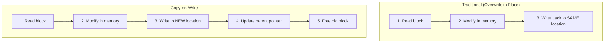

### COW Tree Updates

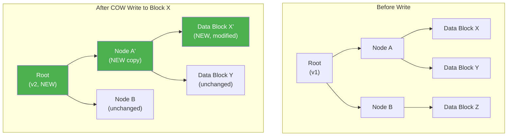

### ZFS

**ZFS** (originally by Sun Microsystems) is a combined volume manager and file system known for data integrity:

| Feature | Description |
|---------|-------------|
| **Checksumming** | Every block has a checksum; corruption is detected and self-healed |
| **Snapshots** | Instant, space-efficient point-in-time copies |
| **Clones** | Writable snapshots |
| **RAID-Z** | Software RAID with better parity than traditional RAID |
| **Deduplication** | Eliminates duplicate data blocks |
| **Compression** | Transparent LZ4/ZSTD/GZIP compression |
| **Copy-on-write** | Never overwrites data; atomic writes |

```bash
# ZFS commands
zpool status              # View pool health
zfs list                  # List datasets
zfs create pool/dataset   # Create dataset
zfs snapshot pool/data@snap1   # Create snapshot
zfs rollback pool/data@snap1   # Rollback to snapshot
zfs send pool/data@snap1 | zfs recv backup/data  # Replicate
```

### Btrfs

**Btrfs** (B-tree File System) is Linux's native COW filesystem:

| Feature | Description |
|---------|-------------|
| **Subvolumes** | Independent filesystem trees within the same partition |
| **Snapshots** | COW snapshots of subvolumes |
| **Checksumming** | Data and metadata integrity verification |
| **RAID** | Built-in RAID 0, 1, 10, 5, 6 |
| **Compression** | Transparent zstd, lzo, zlib |
| **Online defrag** | Defragment while mounted |
| **Send/receive** | Incremental replication |

```bash
# Btrfs commands
sudo btrfs filesystem show          # Show filesystems
sudo btrfs subvolume list /         # List subvolumes
sudo btrfs subvolume snapshot / /snapshots/root-$(date +%F)  # Snapshot
sudo btrfs filesystem df /          # Usage by type
sudo btrfs scrub start /            # Verify data integrity
sudo btrfs balance start /          # Rebalance data across devices
```

### Traditional vs COW Comparison

| Feature | Traditional (ext4, XFS) | Copy-on-Write (ZFS, Btrfs) |
|---------|------------------------|---------------------------|
| Write method | Overwrite in place + journal | Write to new location |
| Consistency | Journal-based recovery | Always consistent (COW) |
| Snapshots | Not native | Instant, free (COW) |
| Checksumming | Metadata only (or none) | All data and metadata |
| Self-healing | No (detects but can't fix) | Yes (with redundancy) |
| Performance | Generally faster writes | Better for reads, snapshots |
| Fragmentation | Lower | Can be higher (COW scatter) |
| Maturity | Very mature (decades) | Maturing (ZFS mature, Btrfs improving) |

---

## Filesystem Comparison Summary

| Filesystem | Type | Max File Size | Max Volume | Journaling | COW | Best For |
|-----------|------|---------------|-----------|------------|-----|----------|
| **ext4** | Traditional | 16 TB | 1 EB | Yes | No | General Linux use |
| **XFS** | Traditional | 8 EB | 8 EB | Yes | No | Large files, high performance |
| **Btrfs** | COW | 16 EB | 16 EB | No (COW) | Yes | Snapshots, data integrity |
| **ZFS** | COW | 16 EB | 256 ZB | No (COW) | Yes | Enterprise storage, NAS |
| **NTFS** | Traditional | 16 EB | 256 TB | Yes | No | Windows |
| **APFS** | COW | 8 EB | 8 EB | No (COW) | Yes | macOS, iOS |
| **FAT32** | Traditional | 4 GB | 2 TB | No | No | USB drives, SD cards |
| **exFAT** | Traditional | 16 EB | 128 PB | No | No | Large USB drives, cross-platform |

---

## Key Takeaways

1. **Disk layout** organizes data into a superblock (filesystem metadata), bitmaps (allocation tracking), inode table (file metadata), and data blocks (file contents), often divided into block groups for locality.

2. **Indexed allocation** (used by ext4, XFS, NTFS) provides the best balance of random access performance and flexibility, with inode pointers mapping files to non-contiguous disk blocks.

3. **Free space management** primarily uses bitmaps — one bit per block — for fast allocation and contiguous block discovery, while ext4 adds extent-based tracking for efficiency.

4. **Journaling** (ext4, XFS) logs metadata changes before applying them, enabling quick crash recovery by replaying or discarding incomplete transactions.

5. **Copy-on-write** filesystems (ZFS, Btrfs) never overwrite data in place, providing inherent consistency, instant snapshots, and checksumming at the cost of potential fragmentation.

6. Choose your filesystem based on needs: **ext4** for general use, **XFS** for large files and high throughput, **ZFS/Btrfs** for data integrity and snapshots, **FAT32/exFAT** for cross-platform portable media.
