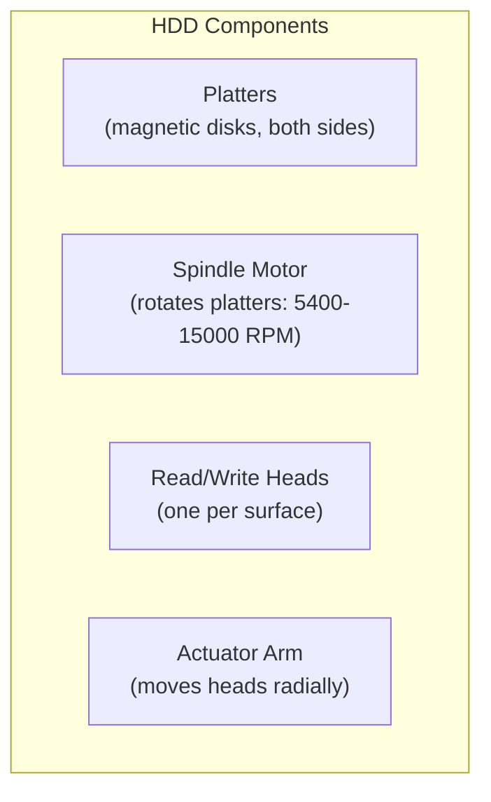
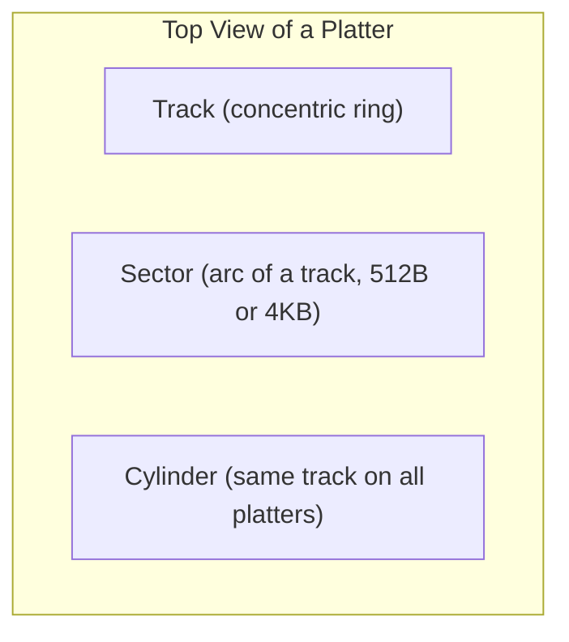
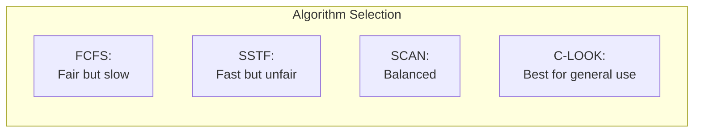
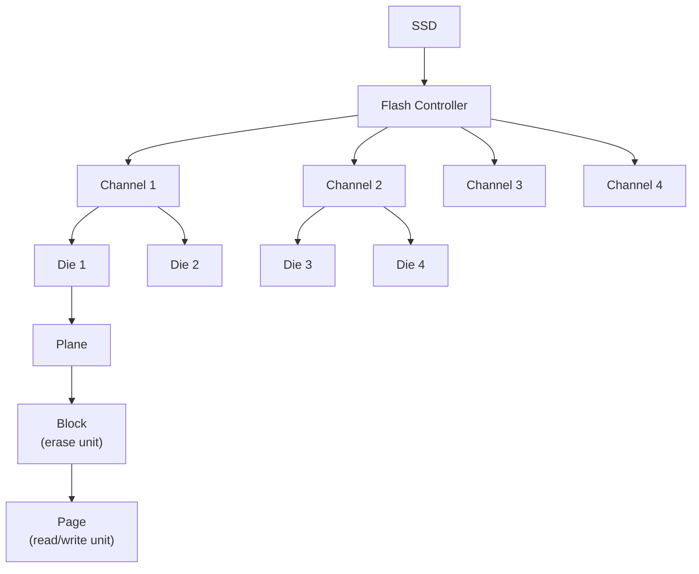
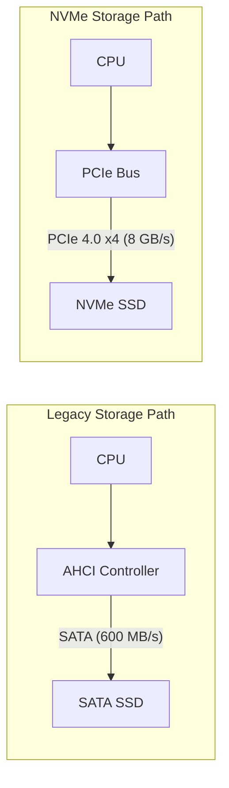
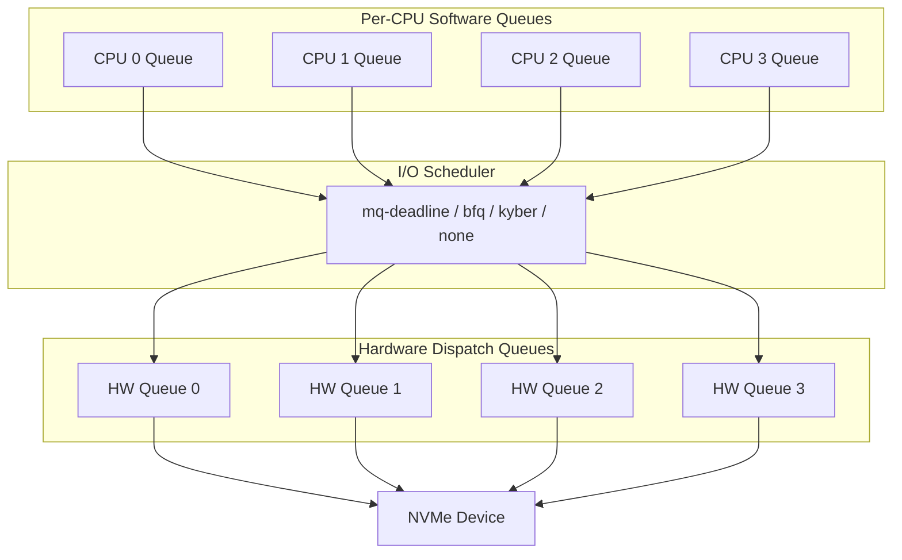
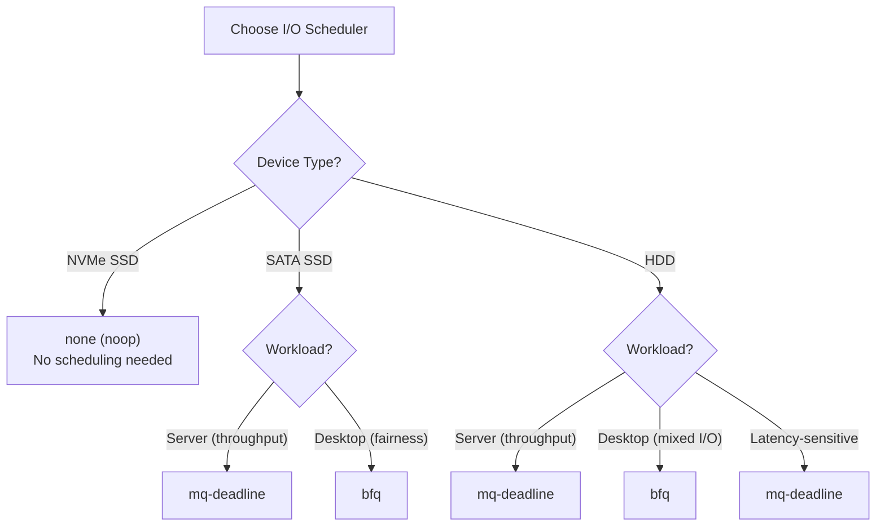

## Learning Objectives

By the end of this lesson, you will be able to:

- Describe the physical structure of hard disk drives (platters, tracks, sectors)
- Compare disk scheduling algorithms: FCFS, SSTF, SCAN, C-SCAN, LOOK, C-LOOK
- Calculate seek distance for each scheduling algorithm
- Contrast SSD vs HDD I/O characteristics
- Understand NVMe and its advantages
- Identify and configure I/O schedulers in Linux

## Prerequisites

- Understanding of the I/O subsystem and its software layers
- Basic knowledge of storage hardware concepts
- Familiarity with Linux system administration commands

---

## Hard Disk Drive (HDD) Structure

Understanding disk scheduling requires knowing how HDDs are physically organized. HDDs are electromechanical devices with moving parts.

### Physical Components



### Disk Geometry



```
Platter (Top View):
    ┌─────────────────────────────┐
    │     ╭─────────────────╮     │
    │     │  ╭───────────╮  │     │  ← Track 0 (outermost)
    │     │  │  ╭─────╮  │  │     │  ← Track 1
    │     │  │  │  ○  │  │  │     │  ← Track N (innermost)
    │     │  │  ╰─────╯  │  │     │     ○ = Spindle
    │     │  ╰───────────╯  │     │
    │     ╰─────────────────╯     │
    └─────────────────────────────┘

Each track is divided into sectors (the smallest addressable unit).
```

### Key Terms

| Term | Definition |
|------|-----------|
| **Platter** | Circular disk coated with magnetic material (data stored on both surfaces) |
| **Track** | Concentric ring on one surface of a platter |
| **Sector** | Smallest addressable unit on a track (traditionally 512 bytes, modern: 4 KB) |
| **Cylinder** | All tracks at the same radial position across all platters |
| **Head** | Reads/writes magnetic data; one per platter surface |
| **Actuator arm** | Moves all heads together to the desired track |

### Access Time Components

| Component | Time | Description |
|-----------|------|-------------|
| **Seek time** | 3–15 ms | Move head to correct track (the biggest cost!) |
| **Rotational latency** | 2–6 ms | Wait for sector to rotate under head (avg: half rotation) |
| **Transfer time** | ~0.05 ms | Time to read/write the data (very fast) |
| **Controller overhead** | ~0.1 ms | Command processing |

**Total access time ≈ seek time + rotational latency + transfer time**

At 7200 RPM:
- One rotation = 60/7200 = 8.33 ms
- Average rotational latency = 4.17 ms

---

## Disk Scheduling Algorithms

The goal of disk scheduling is to **minimize total seek time** by choosing the order in which pending I/O requests are serviced.

### Setup for Examples

For all algorithm examples below:
- **Disk tracks:** 0 to 199
- **Head starting position:** Track 53
- **Request queue:** 98, 183, 37, 122, 14, 124, 65, 67

### FCFS (First-Come, First-Served)

Service requests in the order they arrive. No optimization.

```
Head movement: 53 → 98 → 183 → 37 → 122 → 14 → 124 → 65 → 67

Track:  0    14   37  53  65 67   98    122 124         183    199
        |    |    |   |   || |    |     |   |           |      |
        |    ←────←───⇒───→→─→───→─────→───→───────────→      |
        |    |    |   ↑   || |    |     |   |           |      |
        |    |    |  start|| |    |     |   |           |      |

Seek distances: |53-98| + |98-183| + |183-37| + |37-122| +
                |122-14| + |14-124| + |124-65| + |65-67|
              = 45 + 85 + 146 + 85 + 108 + 110 + 59 + 2 = 640
```

**Total seek distance: 640 tracks**

### SSTF (Shortest Seek Time First)

Always service the request **closest** to the current head position.

```
Head at 53: Closest is 65 (distance 12)
Head at 65: Closest is 67 (distance 2)
Head at 67: Closest is 37 (distance 30)
Head at 37: Closest is 14 (distance 23)
Head at 14: Closest is 98 (distance 84)
Head at 98: Closest is 122 (distance 24)
Head at 122: Closest is 124 (distance 2)
Head at 124: Closest is 183 (distance 59)

Movement: 53 → 65 → 67 → 37 → 14 → 98 → 122 → 124 → 183
Seek distances: 12 + 2 + 30 + 23 + 84 + 24 + 2 + 59 = 236
```

**Total seek distance: 236 tracks**

**Pros:** Much better than FCFS
**Cons:** Can cause **starvation** — requests at the far end may wait indefinitely

### SCAN (Elevator Algorithm)

The head moves in one direction, servicing requests along the way, then reverses direction at the end. Like an elevator.

```
Starting at 53, moving toward 0:

53 → 37 → 14 → 0 (end) → 65 → 67 → 98 → 122 → 124 → 183

Track:  0    14   37  53  65 67   98    122 124         183    199
        |    |    |   |   || |    |     |   |           |      |
        ←────←────←───⇒                                        |
        →────→────→───→───→→─→────→─────→───→───────────→      |
```

```
Seek distances: |53-37| + |37-14| + |14-0| + |0-65| + |65-67| +
                |67-98| + |98-122| + |122-124| + |124-183|
              = 16 + 23 + 14 + 65 + 2 + 31 + 24 + 2 + 59 = 236
```

**Total seek distance: 236 tracks**

### C-SCAN (Circular SCAN)

Like SCAN, but instead of reversing at the end, the head **jumps back to the beginning** and scans in the same direction. This provides more uniform wait times.

```
Starting at 53, moving toward 199:

53 → 65 → 67 → 98 → 122 → 124 → 183 → 199 (end) → 0 (jump back) → 14 → 37

Track:  0    14   37  53  65 67   98    122 124         183    199
        |    |    |   |   || |    |     |   |           |      |
        |    |    |   ⇒───→→─→────→─────→───→───────────→──────→
        ←────←────←───←───←←─←────←─────←───←───────────←──────←
        →────→────→                                             |

Seek: 12 + 2 + 31 + 24 + 2 + 59 + 16 + 199 + 14 + 23 = 382
(The 199 jump is repositioning — often not counted as useful seek)
```

### LOOK / C-LOOK

Like SCAN/C-SCAN but the head **reverses at the last request** instead of going to the physical end of the disk.

```
C-LOOK starting at 53:

53 → 65 → 67 → 98 → 122 → 124 → 183 → (jump to 14) → 14 → 37

Track:  0    14   37  53  65 67   98    122 124         183    199
        |    |    |   |   || |    |     |   |           |      |
        |    |    |   ⇒───→→─→────→─────→───→───────────→      |
        |    ←────←                                     |      |
        |    →────→                                            |

Seek: 12 + 2 + 31 + 24 + 2 + 59 + 169 + 23 = 322
```

**Total seek distance: 322 tracks** (better than C-SCAN's trip to end)

### Algorithm Comparison

| Algorithm | Total Seek (example) | Starvation | Uniformity | Complexity |
|-----------|---------------------|------------|------------|------------|
| **FCFS** | 640 | No | Fair order | Simple |
| **SSTF** | 236 | Yes (far requests) | Poor | Moderate |
| **SCAN** | 236 | Low | Moderate | Moderate |
| **C-SCAN** | 382 (with jump) | No | **Best** | Moderate |
| **LOOK** | ~220 | Low | Moderate | Moderate |
| **C-LOOK** | 322 (with jump) | No | Good | Moderate |



---

## SSD vs HDD I/O Patterns

**Solid-State Drives (SSDs)** have no moving parts — they use NAND flash memory. This fundamentally changes I/O characteristics.

### Physical Structure of an SSD



### SSD vs HDD Comparison

| Characteristic | HDD | SSD |
|---------------|-----|-----|
| **Random read latency** | 5–15 ms | 0.05–0.1 ms (50–100 μs) |
| **Sequential read** | 100–200 MB/s | 500–7000 MB/s |
| **Random write latency** | 5–15 ms | 0.1–0.5 ms |
| **IOPS (random 4K)** | 100–200 | 50,000–1,000,000 |
| **Seek time** | 3–15 ms | **0 ms (no seeking!)** |
| **Power** | 5–15 W | 2–5 W |
| **Moving parts** | Yes (platters, heads) | None |
| **Durability** | Mechanical failure | Wear leveling (limited writes) |
| **Cost per GB** | $0.02–0.05 | $0.05–0.20 |
| **Scheduling value** | Critical (minimize seeks) | Minimal (no seek penalty) |

### SSD-Specific Concerns

| Concern | Description |
|---------|-------------|
| **Write amplification** | SSD must erase entire block before writing; controller manages via garbage collection |
| **Wear leveling** | Controller distributes writes evenly across cells to prevent early failure |
| **TRIM** | Informs SSD which blocks are no longer in use, improving garbage collection |
| **Over-provisioning** | Extra capacity for wear leveling and performance |

```bash
# Check SSD TRIM support
lsblk --discard
# NAME   DISC-ALN DISC-GRAN DISC-MAX DISC-ZERO
# sda           0       512B      2G         0
# nvme0n1       0       512B      2G         0  ← supports TRIM

# Enable continuous TRIM (not always recommended)
# mount -o discard /dev/sda1 /mnt

# Periodic TRIM (preferred)
sudo fstrim -v /
# /: 15.3 GiB (16448073728 bytes) trimmed

# Schedule weekly TRIM
sudo systemctl enable fstrim.timer

# View SSD health (SMART data)
sudo smartctl -a /dev/nvme0n1
```

---

## NVMe (Non-Volatile Memory Express)

**NVMe** is a modern storage protocol designed specifically for SSDs, replacing the legacy AHCI/SATA interface that was designed for spinning disks.



### NVMe vs AHCI/SATA

| Feature | AHCI (SATA) | NVMe |
|---------|-------------|------|
| **Interface** | SATA (serial) | PCIe (direct) |
| **Max bandwidth** | 600 MB/s | 8,000+ MB/s (PCIe 4.0 x4) |
| **Command queues** | 1 queue, 32 commands | 65,535 queues, 65,536 commands each |
| **Latency** | ~6 μs (controller overhead) | ~2.5 μs |
| **CPU cores** | Single queue bottleneck | Per-CPU queues (no locking) |
| **Protocol overhead** | High (legacy translation) | Minimal (designed for flash) |
| **IOPS** | ~100,000 | ~1,000,000+ |

```bash
# View NVMe devices
nvme list
# Node             SN                  Model                   Size
# /dev/nvme0n1     S123456789         Samsung 990 PRO 2TB     2.00 TB

# NVMe device information
nvme id-ctrl /dev/nvme0n1

# View NVMe namespace details
nvme id-ns /dev/nvme0n1 -n 1

# NVMe SMART health information
nvme smart-log /dev/nvme0n1
# temperature                         : 38°C
# available_spare                     : 100%
# data_units_read                     : 12345678
# data_units_written                  : 9876543
# power_on_hours                      : 5000

# View NVMe queue configuration
ls /sys/block/nvme0n1/device/
```

---

## I/O Schedulers in Linux

Linux provides several I/O schedulers in the **block layer** that determine how requests are ordered before being sent to the device.

### Available Schedulers

| Scheduler | Type | Best For | Description |
|-----------|------|----------|-------------|
| **none** (noop) | No scheduling | NVMe SSDs | Pass-through — no reordering |
| **mq-deadline** | Deadline-based | SSDs, general | Prevents starvation with deadlines |
| **bfq** (Budget Fair Queuing) | Fair | Desktops, mixed workloads | Per-process I/O fairness |
| **kyber** | Latency-targeted | Fast SSDs | Targets latency rather than throughput |

### Legacy Schedulers (single-queue, older kernels)

| Scheduler | Description |
|-----------|-------------|
| **noop** | No reordering (for SSDs) |
| **deadline** | Deadline prevents starvation |
| **cfq** (Completely Fair Queuing) | Fair scheduling per process |

### Multi-Queue Architecture

Modern Linux uses the **multi-queue block layer** (blk-mq), which aligns with NVMe's multiple hardware queues:



### Managing I/O Schedulers

```bash
# View current scheduler for a device
cat /sys/block/sda/queue/scheduler
# [mq-deadline] kyber bfq none

cat /sys/block/nvme0n1/queue/scheduler
# [none] mq-deadline kyber bfq

# Change scheduler (runtime)
echo "bfq" | sudo tee /sys/block/sda/queue/scheduler

# For NVMe, 'none' is usually best
echo "none" | sudo tee /sys/block/nvme0n1/queue/scheduler

# View queue properties
cat /sys/block/sda/queue/nr_requests       # Queue depth
cat /sys/block/sda/queue/read_ahead_kb     # Read-ahead size
cat /sys/block/sda/queue/rotational        # 1=HDD, 0=SSD
cat /sys/block/sda/queue/hw_sector_size    # Sector size

# Make scheduler permanent via udev rule
# /etc/udev/rules.d/60-io-scheduler.rules
# ACTION=="add|change", KERNEL=="sd*", ATTR{queue/scheduler}="mq-deadline"
# ACTION=="add|change", KERNEL=="nvme*", ATTR{queue/scheduler}="none"
```

### Scheduler Selection Guide



---

## Practical: I/O Performance Testing

```bash
# Sequential read performance
dd if=/dev/sda of=/dev/null bs=1M count=1024 iflag=direct
# 1073741824 bytes (1.1 GB) copied, 5.2 s, 206 MB/s

# Sequential write performance
dd if=/dev/zero of=/tmp/testfile bs=1M count=1024 oflag=direct
# 1073741824 bytes (1.1 GB) copied, 4.8 s, 224 MB/s

# Random I/O performance (requires fio)
fio --name=randread --ioengine=libaio --iodepth=32 \
    --rw=randread --bs=4k --direct=1 --size=1G \
    --numjobs=4 --runtime=30 --filename=/dev/sda

# Monitor I/O in real-time
iostat -xz 1

# Watch for scheduler decisions
sudo blktrace -d /dev/sda -o - | blkparse -i -
```

---

## Key Takeaways

1. **HDD structure** consists of platters, tracks, sectors, and cylinders. Access time is dominated by **seek time** (moving the head to the correct track), making request ordering critical.

2. **Disk scheduling algorithms** minimize total seek distance: **FCFS** is fair but slow; **SSTF** minimizes seek but causes starvation; **SCAN/LOOK** provide a balanced approach; **C-LOOK** offers the best overall combination.

3. **SSDs** eliminate seek time entirely, making traditional disk scheduling unnecessary. Instead, SSD concerns include write amplification, wear leveling, and TRIM support.

4. **NVMe** replaces AHCI/SATA with a PCIe-native protocol designed for flash, offering 65K queues, sub-3μs latency, and 8+ GB/s bandwidth — orders of magnitude better than legacy interfaces.

5. Linux I/O schedulers include **none** (pass-through for NVMe), **mq-deadline** (deadline-based for general use), **bfq** (fair queuing for desktops), and **kyber** (latency-targeted for fast SSDs).

6. The **multi-queue block layer** (blk-mq) maps per-CPU software queues to hardware queues, eliminating lock contention and enabling full utilization of modern NVMe devices with millions of IOPS.
