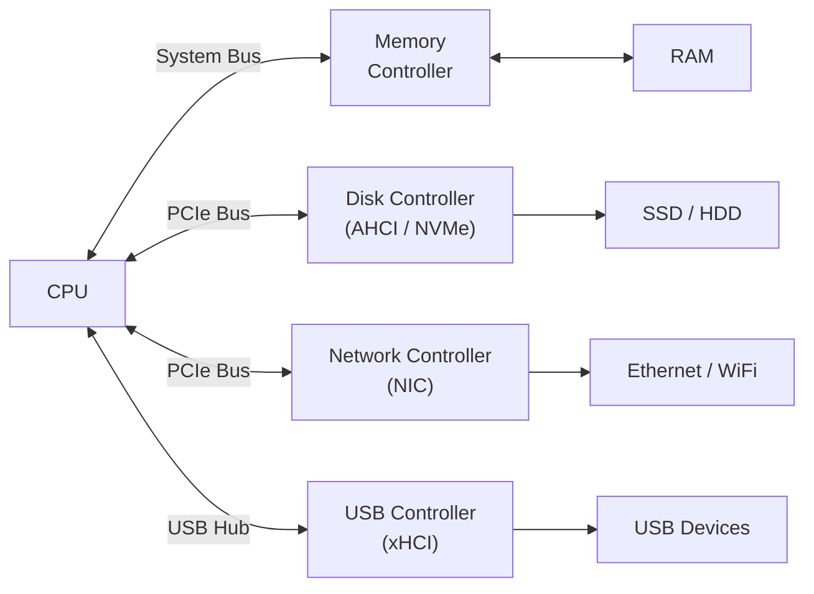
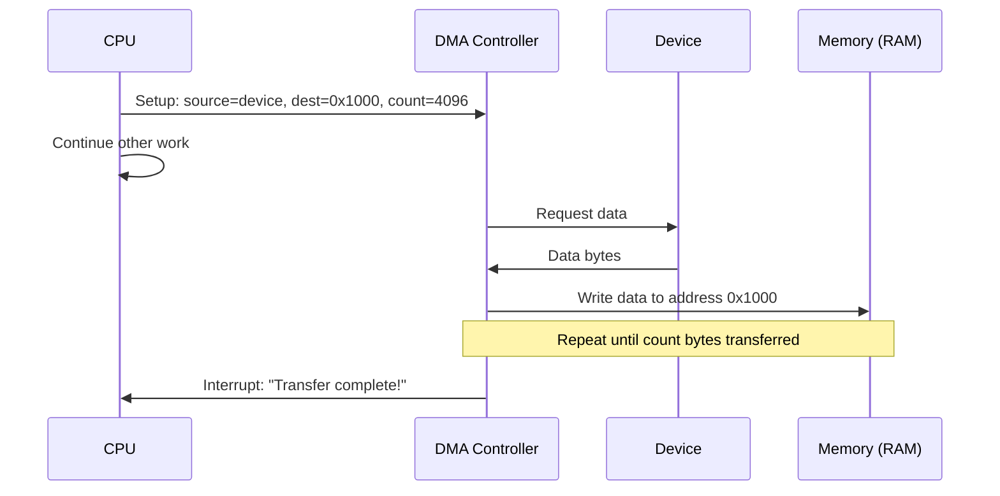
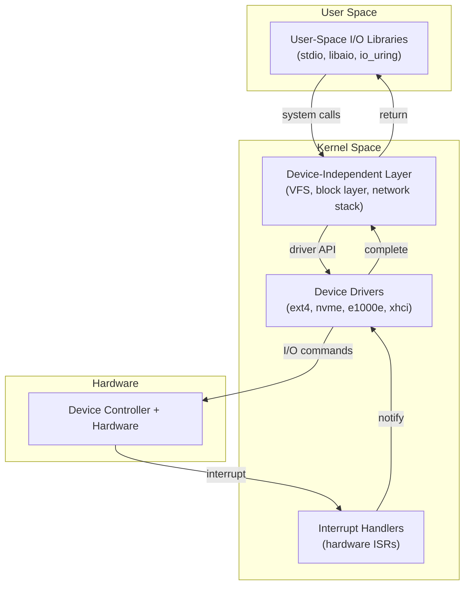
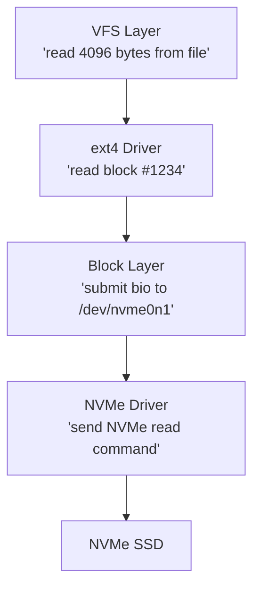
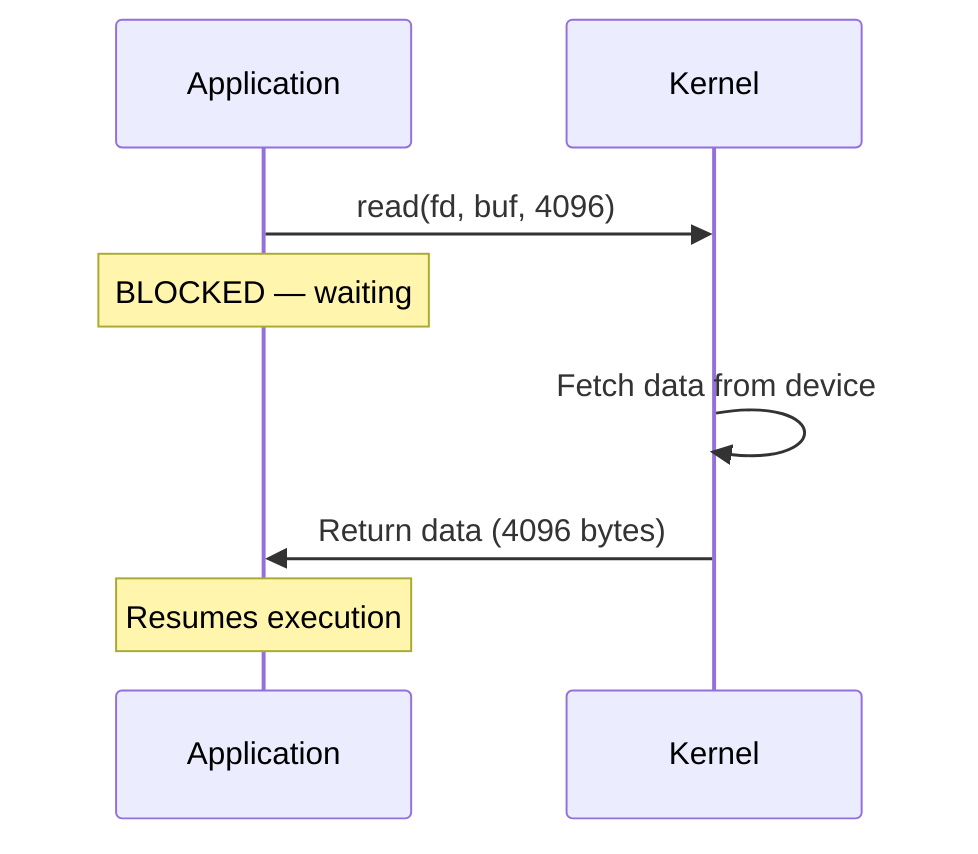
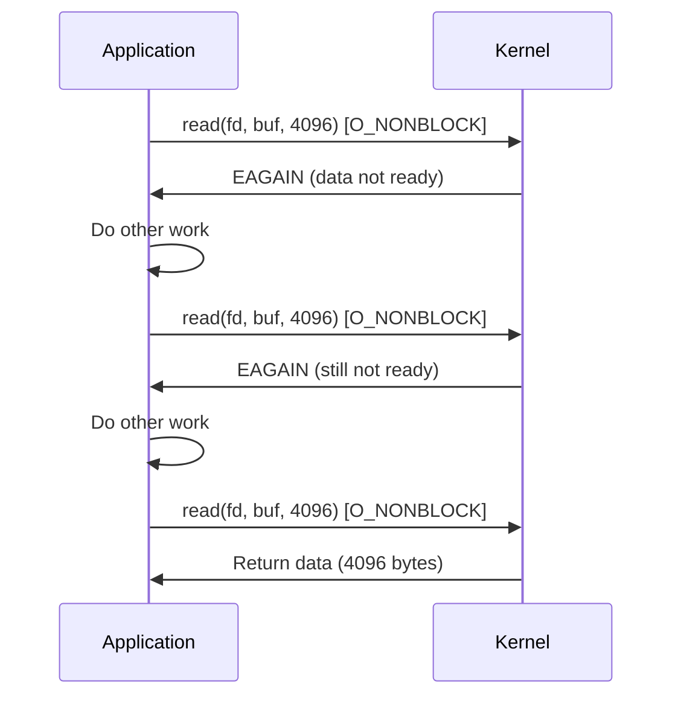
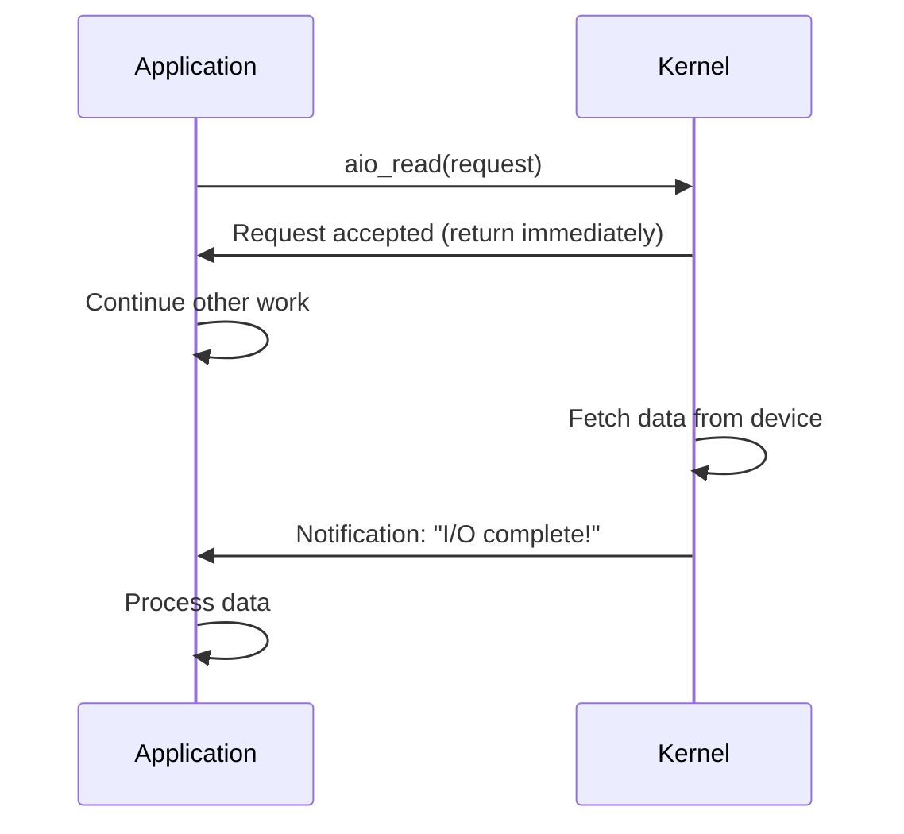
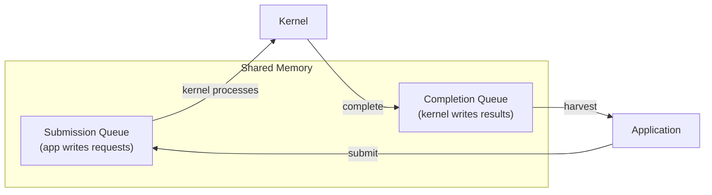
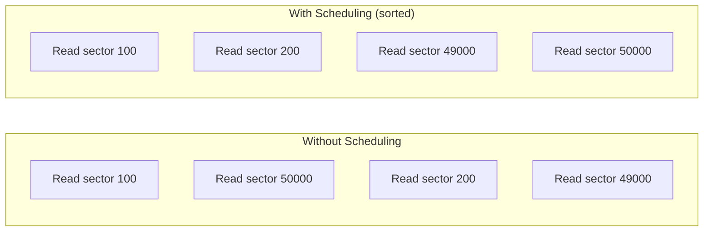
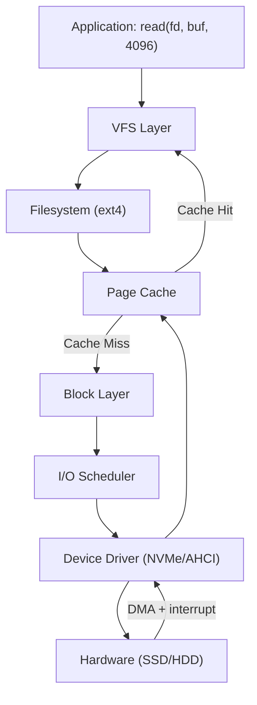

## Learning Objectives

By the end of this lesson, you will be able to:

- Describe I/O hardware components: device controllers, ports, and DMA
- Explain the layers of I/O software: interrupt handlers, drivers, and device-independent layer
- Differentiate between blocking, non-blocking, and asynchronous I/O
- Understand I/O scheduling and its impact on performance
- Trace the path of an I/O request through the software stack
- Use Linux tools to inspect and monitor I/O activity

## Prerequisites

- Understanding of system architecture (CPU, memory, buses, interrupts)
- Knowledge of processes, system calls, and kernel space
- Familiarity with Linux command-line basics

---

## I/O Hardware

The I/O subsystem connects the CPU to external devices — disks, networks, keyboards, displays, and more. Understanding the hardware is essential to understanding how the OS manages I/O.

### Device Controllers

Every I/O device connects to the system through a **device controller** — a small processor on the device or adapter card that handles the low-level details.



Each controller has a set of **registers** the CPU uses to communicate:

| Register | Purpose |
|----------|---------|
| **Status** | Reports device state (ready, busy, error) |
| **Command** | Receives commands from the CPU (read, write, seek) |
| **Data** | Transfers data between CPU and device |

### Communication Methods

The CPU communicates with device controllers in two ways:

| Method | How It Works | Example |
|--------|-------------|---------|
| **Port-mapped I/O** | Special CPU instructions (`IN`/`OUT`) access device registers at I/O port addresses | x86 legacy devices (keyboard: port 0x60) |
| **Memory-mapped I/O** | Device registers are mapped to memory addresses; accessed like normal memory | Most modern devices (PCIe) |

```bash
# View I/O port assignments
sudo cat /proc/ioports | head -20
# 0000-0cf7 : PCI Bus 0000:00
#   0000-001f : dma1
#   0020-0021 : pic1
#   0040-0043 : timer0
#   0060-0060 : keyboard
#   0064-0064 : keyboard

# View memory-mapped I/O regions
sudo cat /proc/iomem | head -20
# 00000000-00000fff : Reserved
# 00001000-0009fbff : System RAM
# 000f0000-000fffff : Reserved
# 00100000-3fffffff : System RAM
# e0000000-efffffff : PCI Bus 0000:00
```

### Direct Memory Access (DMA)

**DMA** allows devices to transfer data directly to/from RAM without CPU involvement. Without DMA, the CPU must read each byte from the device and write it to memory — wasting CPU cycles.



### Without DMA vs With DMA

| Aspect | Programmed I/O (No DMA) | DMA |
|--------|------------------------|-----|
| CPU involvement | Copies every byte | Sets up transfer, then free |
| CPU utilization | 100% during I/O | Near 0% during transfer |
| Latency | Higher (CPU bottleneck) | Lower (parallel transfer) |
| Complexity | Simple | DMA controller needed |
| Use case | Small, slow transfers | Disk, network, high-speed I/O |

---

## I/O Software Layers

The I/O software stack is organized in layers, each handling a specific level of abstraction.



### Layer 1: Interrupt Handlers

The lowest software layer. When a device completes an operation, it triggers a hardware interrupt. The **interrupt handler** (ISR):

1. Acknowledges the interrupt to the device
2. Reads status from device registers
3. Wakes up the waiting driver/process
4. Returns control to the interrupted code

```bash
# View interrupt assignments and counts
cat /proc/interrupts | head -15
#            CPU0       CPU1       CPU2       CPU3
#   0:         48          0          0          0  IO-APIC   2-edge      timer
#   1:          0          0          3          0  IO-APIC   1-edge      i8042
#   8:          0          0          0          1  IO-APIC   8-edge      rtc0
#  16:          0          0          0          0  IO-APIC  16-fasteoi   ehci_hcd
#  24:          0     125000          0          0  PCI-MSI  524288-edge  nvme0q0
#  25:          0          0      98000          0  PCI-MSI  524289-edge  nvme0q1
```

### Layer 2: Device Drivers

A **device driver** is kernel code that knows how to communicate with a specific device or device family. It translates generic I/O requests into device-specific commands.



```bash
# List loaded kernel modules (drivers)
lsmod | head -15

# View driver for a device
ethtool -i eth0
# driver: e1000e
# version: 6.5.0-44
# firmware-version: 1.4-0

# View block device driver
lsblk -o NAME,TYPE,SIZE,FSTYPE,MOUNTPOINT
# NAME     TYPE  SIZE FSTYPE MOUNTPOINT
# sda      disk  100G
# ├─sda1   part  512M vfat   /boot/efi
# └─sda2   part   99G ext4   /
# nvme0n1  disk  500G
# └─nvme0n1p1 part 500G xfs  /data

# View driver binding
ls -la /sys/block/sda/device/driver
# lrwxrwxrwx 1 root root 0 Jan 15 /sys/block/sda/device/driver -> ../../../../bus/scsi/drivers/sd
```

### Layer 3: Device-Independent Layer

This layer provides uniform interfaces regardless of the underlying device:

| Service | Description |
|---------|-------------|
| **Naming** | Map device names to drivers (/dev/sda → SCSI driver) |
| **Buffering** | Buffer I/O data for efficiency |
| **Caching** | Page cache for recently accessed disk blocks |
| **Error handling** | Translate device errors to errno values |
| **Block scheduling** | Reorder and merge I/O requests |
| **Access control** | Check file permissions |

### Layer 4: User-Space I/O

Applications access I/O through system calls and library functions:

```c
#include <stdio.h>
#include <fcntl.h>
#include <unistd.h>

int main() {
    // C library (buffered I/O)
    FILE *fp = fopen("/tmp/test.txt", "w");
    fprintf(fp, "Hello via stdio\n");   // Buffered in userspace
    fflush(fp);                          // Flush to kernel
    fclose(fp);

    // System call (unbuffered I/O)
    int fd = open("/tmp/test2.txt", O_WRONLY | O_CREAT, 0644);
    write(fd, "Hello via syscall\n", 18); // Direct to kernel
    close(fd);

    return 0;
}
```

---

## Blocking vs Non-Blocking vs Asynchronous I/O

### Blocking I/O (Synchronous)

The calling process is **suspended** until the I/O operation completes.



### Non-Blocking I/O

The system call returns **immediately**, even if data isn't ready yet. The application must poll.



### I/O Multiplexing

Watch multiple file descriptors and block until **any** of them is ready:

```c
#include <sys/select.h>
#include <sys/poll.h>
#include <sys/epoll.h>

// select() — oldest, limited to 1024 fds
fd_set readfds;
FD_ZERO(&readfds);
FD_SET(sockfd, &readfds);
select(sockfd + 1, &readfds, NULL, NULL, &timeout);

// poll() — no fd limit
struct pollfd fds[2];
fds[0].fd = sockfd;
fds[0].events = POLLIN;
poll(fds, 2, timeout_ms);

// epoll — Linux-specific, O(1) for large fd sets
int epfd = epoll_create1(0);
struct epoll_event ev = {.events = EPOLLIN, .data.fd = sockfd};
epoll_ctl(epfd, EPOLL_CTL_ADD, sockfd, &ev);
epoll_wait(epfd, events, MAX_EVENTS, timeout_ms);
```

### Asynchronous I/O (AIO)

The application submits an I/O request and is **notified** when it completes (via signal, callback, or event).



### io_uring — Modern Linux Async I/O

**io_uring** (Linux 5.1+) is the modern high-performance async I/O interface:



Benefits over traditional AIO:
- Zero system call overhead for submission/completion (shared memory rings)
- Supports all I/O types (not just direct I/O)
- Batching multiple operations
- Linked operations (chains of I/O)

### I/O Model Comparison

| Model | Blocks? | Notification | CPU Usage | Scalability | Use Case |
|-------|---------|-------------|-----------|-------------|----------|
| **Blocking** | Yes | Return | Low (sleeping) | Poor | Simple apps |
| **Non-blocking** | No | Polling | High (busy-wait) | Moderate | Rare in practice |
| **select/poll** | Until ready | Return | Low | Moderate | Cross-platform |
| **epoll** | Until ready | Return | Low | **Excellent** | Linux servers |
| **io_uring** | No | Completion ring | Minimal | **Best** | High-perf Linux |

---

## I/O Scheduling

When multiple processes issue I/O requests simultaneously, the OS must decide the order of execution. The **I/O scheduler** reorders and merges requests for efficiency.

### Why Schedule I/O?

For spinning disks (HDDs), the physical position of the read/write head matters enormously. Seeking between distant tracks is expensive (~10ms). Serving requests in sequential order reduces seek time.



### I/O Path in Linux



### The Page Cache

Linux caches disk data in **page cache** (unused RAM). Most reads are served from cache:

```bash
# View cache usage
free -h
#               total   used   free  shared  buff/cache  available
# Mem:          16Gi   8.0Gi   1.0Gi   500Mi    7.0Gi     7.5Gi
#                                               ↑
#                                        Page cache + buffers

# Drop caches (for testing — NOT for production)
echo 3 | sudo tee /proc/sys/vm/drop_caches

# View cache hit rates
cat /proc/vmstat | grep pgpg
# pgpgin 1234567     (pages read from disk)
# pgpgout 2345678    (pages written to disk)
```

---

## Monitoring I/O

```bash
# Real-time I/O statistics
iostat -x 1
# Device  r/s   w/s   rkB/s   wkB/s  await  %util
# sda     50    100   200     400    2.5    15.0
# nvme0n1 500   1000  2000    4000   0.1     5.0

# Per-process I/O
iotop -o
# PID   USER      DISK READ  DISK WRITE  COMMAND
# 1234  alice     10.00 M/s   5.00 M/s   rsync
# 5678  bob        0.00 B/s   2.00 M/s   cp

# I/O statistics from /proc
cat /proc/diskstats | head -5

# Block device queue depth
cat /sys/block/nvme0n1/queue/nr_requests
# 1023

# I/O latency tracing
sudo biolatency-bpfcc 10 1

# File-level I/O stats
cat /proc/$$/io
# rchar: 1234567
# wchar: 2345678
# syscr: 1000
# syscw: 500
# read_bytes: 500000
# write_bytes: 200000
```

---

## Key Takeaways

1. **I/O hardware** uses device controllers with status, command, and data registers, communicating with the CPU via port-mapped or memory-mapped I/O. **DMA** offloads bulk data transfers from the CPU.

2. The **I/O software stack** has four layers: interrupt handlers (hardware), device drivers (device-specific), device-independent layer (buffering, caching, scheduling), and user-space libraries (stdio, io_uring).

3. **Blocking I/O** suspends the process until complete; **non-blocking** returns immediately with EAGAIN; **I/O multiplexing** (epoll) monitors many descriptors efficiently; **asynchronous I/O** (io_uring) submits requests and receives completions via shared-memory rings.

4. The **I/O scheduler** reorders and merges disk requests to minimize seek time (critical for HDDs, less so for SSDs), while the **page cache** eliminates many disk reads entirely by caching data in RAM.

5. Linux provides rich I/O monitoring through `iostat`, `iotop`, `/proc/diskstats`, and `/proc/[pid]/io` for observing throughput, latency, and per-process I/O behavior.

6. Modern high-performance I/O uses **io_uring** for zero-overhead async operations via submission and completion rings in shared memory, replacing older select/poll/epoll models for demanding workloads.
