## Learning Objectives

By the end of this lesson, you will be able to:

- Explain RAID levels 0, 1, 5, 6, and 10 with their trade-offs
- Understand how RAID parity works and is calculated
- Compare hardware RAID vs software RAID
- Use LVM for flexible volume management on Linux
- Differentiate between SAN and NAS storage architectures
- Describe modern storage technologies: NVMe-oF and persistent memory

## Prerequisites

- Understanding of I/O subsystem concepts (device drivers, DMA)
- Knowledge of disk scheduling and SSD vs HDD characteristics
- Familiarity with Linux administration commands

---

## Introduction to RAID

**RAID (Redundant Array of Independent Disks)** combines multiple physical disks into a single logical unit to improve performance, reliability, or both.

### Why RAID?

Single disks have limitations:

| Limitation | RAID Solution |
|-----------|---------------|
| Single point of failure | Redundancy (mirrors, parity) |
| Limited throughput | Striping across multiple disks |
| Limited capacity | Aggregating multiple disks |
| Slow rebuilds | Hot spares, distributed parity |

---

## RAID Levels

### RAID 0 — Striping

Data is split evenly across all disks with **no redundancy**. Maximum performance, zero fault tolerance.

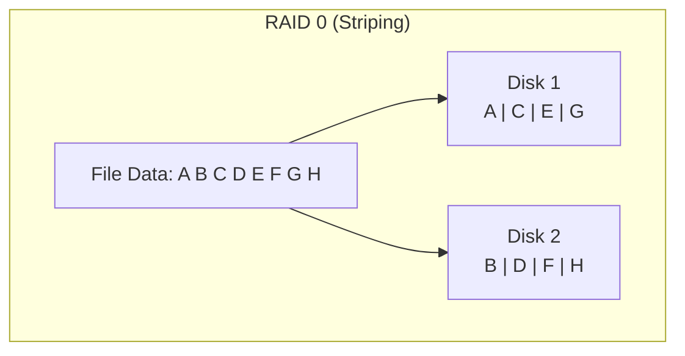

| Property | Value |
|----------|-------|
| **Min disks** | 2 |
| **Capacity** | N × disk size |
| **Read speed** | N × single disk |
| **Write speed** | N × single disk |
| **Fault tolerance** | None — one disk failure = total data loss |
| **Use case** | Temporary data, caches, scratch space |

### RAID 1 — Mirroring

Data is duplicated on every disk. Perfect redundancy but half the capacity.

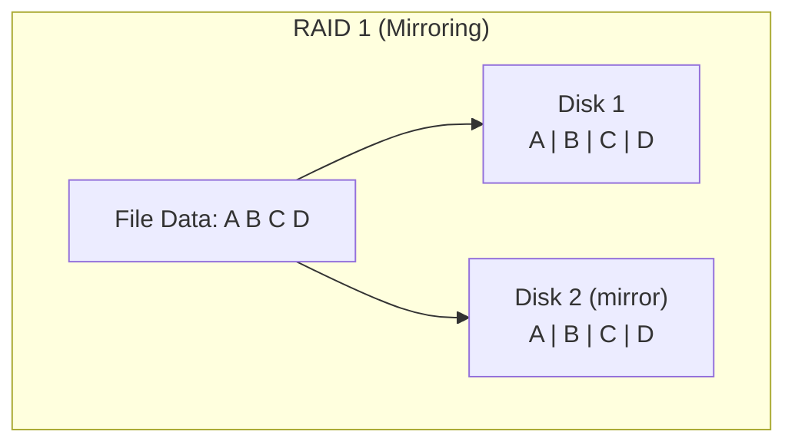

| Property | Value |
|----------|-------|
| **Min disks** | 2 |
| **Capacity** | 1 × disk size (50% efficiency) |
| **Read speed** | Up to N × single disk (reads from any mirror) |
| **Write speed** | 1 × single disk (must write all copies) |
| **Fault tolerance** | Survives N-1 disk failures |
| **Use case** | OS drives, critical databases |

### RAID 5 — Striping with Distributed Parity

Data and **parity** (error-correction information) are distributed across all disks. Can survive one disk failure.

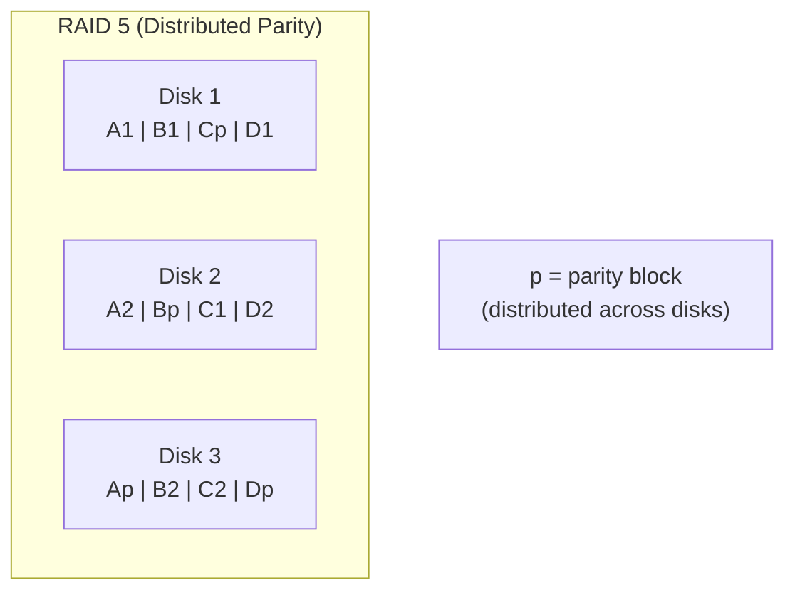

| Property | Value |
|----------|-------|
| **Min disks** | 3 |
| **Capacity** | (N-1) × disk size |
| **Read speed** | (N-1) × single disk |
| **Write speed** | Lower (parity calculation) |
| **Fault tolerance** | 1 disk failure |
| **Use case** | General-purpose storage, file servers |

### RAID 6 — Striping with Double Parity

Like RAID 5 but with **two** parity blocks per stripe. Survives two simultaneous disk failures.

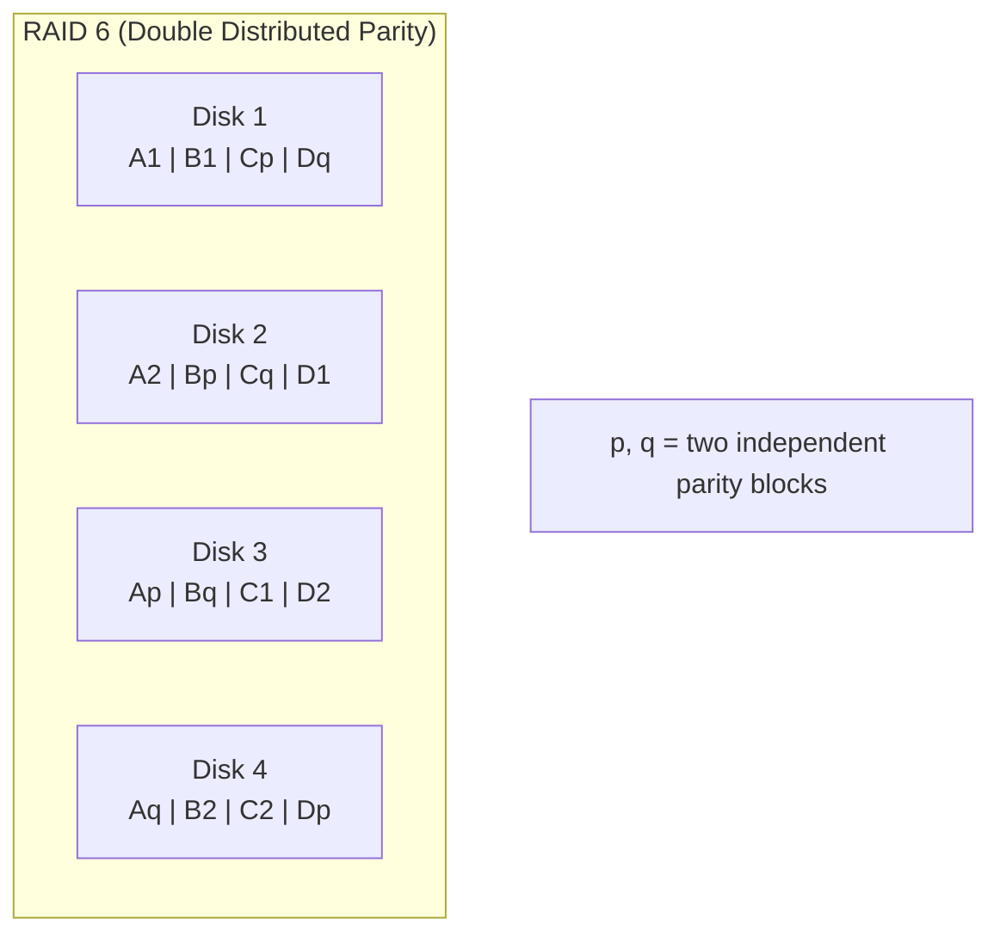

| Property | Value |
|----------|-------|
| **Min disks** | 4 |
| **Capacity** | (N-2) × disk size |
| **Fault tolerance** | 2 disk failures |
| **Use case** | Large arrays, enterprise storage |

### RAID 10 (1+0) — Mirrored Stripes

A **stripe of mirrors**: data is first mirrored (RAID 1), then striped (RAID 0) across mirror pairs. Best performance with redundancy.

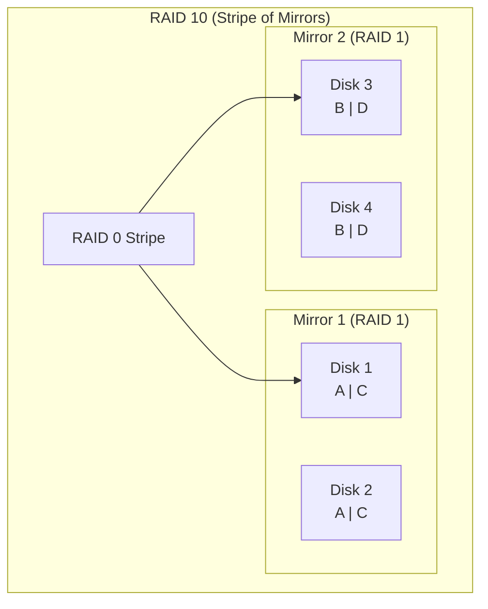

| Property | Value |
|----------|-------|
| **Min disks** | 4 |
| **Capacity** | N/2 × disk size (50% efficiency) |
| **Read speed** | N × single disk |
| **Write speed** | N/2 × single disk |
| **Fault tolerance** | 1 disk per mirror pair |
| **Use case** | Databases, high-performance applications |

### RAID Level Comparison

| RAID | Min Disks | Capacity | Read Speed | Write Speed | Fault Tolerance | Cost |
|------|-----------|----------|-----------|-------------|-----------------|------|
| **0** | 2 | 100% | Best | Best | None | Lowest |
| **1** | 2 | 50% | Good | Normal | N-1 disks | High |
| **5** | 3 | (N-1)/N | Good | Lower | 1 disk | Moderate |
| **6** | 4 | (N-2)/N | Good | Lowest | 2 disks | Higher |
| **10** | 4 | 50% | Best | Good | 1 per pair | Highest |

---

## RAID Parity Calculation

RAID 5 and 6 use **parity** — a calculated value that allows reconstruction of data if a disk fails. The simplest parity is **XOR** (exclusive OR).

### XOR Parity Example

```
Data on Disk 1: 1 0 1 1 0 1 0 0
Data on Disk 2: 0 1 1 0 1 1 0 1
─────────────────────────────────
Parity (XOR):   1 1 0 1 1 0 0 1  ← stored on Disk 3

If Disk 2 fails, recover with: Disk 1 XOR Parity
  1 0 1 1 0 1 0 0
  1 1 0 1 1 0 0 1
  ─────────────────
  0 1 1 0 1 1 0 1  ← Disk 2 data recovered!
```

### Parity Calculation for a RAID 5 Write

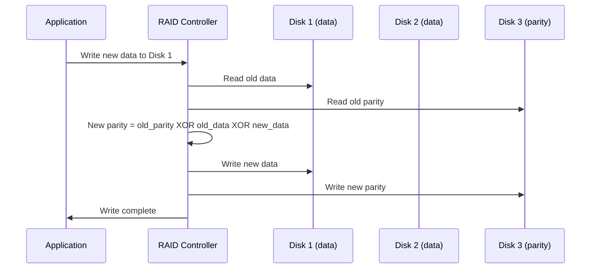

This is the **RAID 5 write penalty** — every write requires 4 I/O operations (2 reads + 2 writes), also called the "write hole."

---

## Hardware RAID vs Software RAID

| Feature | Hardware RAID | Software RAID |
|---------|-------------|---------------|
| **Controller** | Dedicated RAID card (battery-backed cache) | OS kernel (mdadm on Linux) |
| **CPU usage** | Zero (dedicated processor) | Uses host CPU |
| **Cost** | $200–$2000+ | Free |
| **Performance** | Excellent (dedicated cache) | Good (but CPU overhead) |
| **Portability** | Vendor-specific (card required to read) | Universal (any Linux system) |
| **Flexibility** | Limited to card features | Full OS control |
| **Battery backup** | Yes (protects write cache) | No (but journaling helps) |

### Linux Software RAID (mdadm)

```bash
# Create RAID 1 (mirror)
sudo mdadm --create /dev/md0 --level=1 --raid-devices=2 /dev/sdb1 /dev/sdc1

# Create RAID 5 (3 disks + 1 spare)
sudo mdadm --create /dev/md1 --level=5 --raid-devices=3 \
    --spare-devices=1 /dev/sdb /dev/sdc /dev/sdd /dev/sde

# View RAID status
cat /proc/mdstat
# Personalities : [raid1] [raid6] [raid5] [raid4]
# md0 : active raid1 sdc1[1] sdb1[0]
#       104320 blocks [2/2] [UU]
#
# md1 : active raid5 sdd[2] sdc[1] sdb[0]
#       209664 blocks level 5, 64k chunk, algorithm 2 [3/3] [UUU]

# Detailed RAID information
sudo mdadm --detail /dev/md0

# Simulate a disk failure
sudo mdadm --manage /dev/md1 --fail /dev/sdc

# Replace a failed disk
sudo mdadm --manage /dev/md1 --remove /dev/sdc
sudo mdadm --manage /dev/md1 --add /dev/sdf

# Save configuration
sudo mdadm --detail --scan >> /etc/mdadm/mdadm.conf

# Monitor RAID health
sudo mdadm --monitor --scan --daemonize
```

---

## LVM (Logical Volume Manager)

**LVM** adds a flexible abstraction layer between physical disks and file systems, allowing dynamic resizing, snapshots, and spanning across disks.

### LVM Architecture

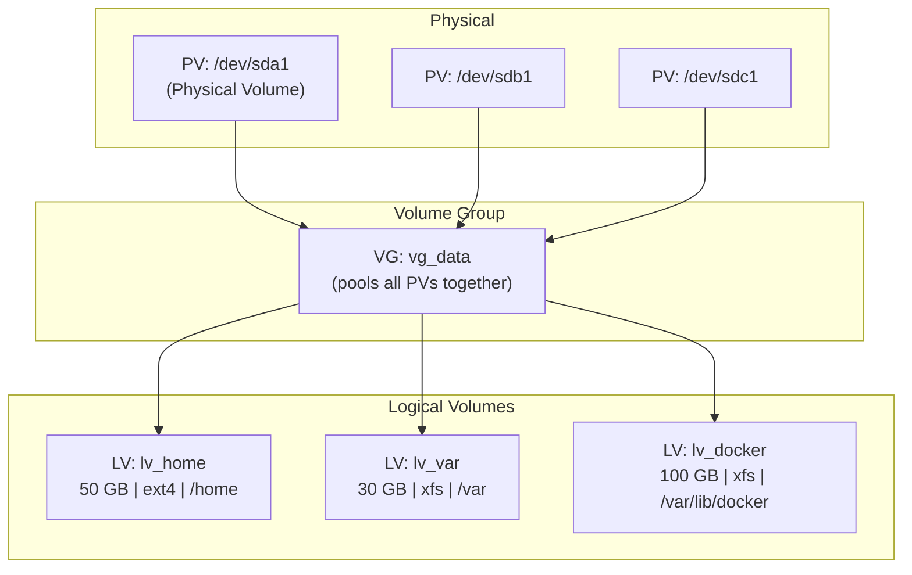

### LVM Concepts

| Concept | Abbreviation | Description |
|---------|-------------|-------------|
| **Physical Volume** | PV | A disk or partition initialized for LVM |
| **Volume Group** | VG | Pool of one or more PVs |
| **Logical Volume** | LV | Virtual partition carved from a VG |
| **Physical Extent** | PE | Small fixed-size chunk (default 4 MB) |

### LVM Commands

```bash
# Create Physical Volumes
sudo pvcreate /dev/sdb1 /dev/sdc1

# View PVs
sudo pvs
# PV         VG      Fmt  Attr PSize   PFree
# /dev/sdb1  vg_data lvm2 a--  100.00g  50.00g
# /dev/sdc1  vg_data lvm2 a--  100.00g 100.00g

# Create Volume Group
sudo vgcreate vg_data /dev/sdb1 /dev/sdc1

# View VGs
sudo vgs
# VG      #PV #LV #SN Attr   VSize   VFree
# vg_data   2   0   0 wz--n- 199.99g 199.99g

# Create Logical Volumes
sudo lvcreate -L 50G -n lv_home vg_data
sudo lvcreate -L 30G -n lv_var vg_data

# Format and mount
sudo mkfs.ext4 /dev/vg_data/lv_home
sudo mount /dev/vg_data/lv_home /home

# Extend a logical volume (online!)
sudo lvextend -L +20G /dev/vg_data/lv_home
sudo resize2fs /dev/vg_data/lv_home      # For ext4
# or
sudo xfs_growfs /home                     # For XFS

# Add a new disk to the VG
sudo pvcreate /dev/sdd1
sudo vgextend vg_data /dev/sdd1

# LVM snapshots
sudo lvcreate -s -L 10G -n snap_home /dev/vg_data/lv_home
# Now you have a point-in-time snapshot for backup
```

### LVM Thin Provisioning

**Thin provisioning** allocates storage on demand rather than upfront, allowing over-commitment:

```bash
# Create a thin pool
sudo lvcreate -T -L 100G vg_data/thin_pool

# Create thin volumes (can exceed pool size!)
sudo lvcreate -V 200G -T vg_data/thin_pool -n thin_vol1
sudo lvcreate -V 200G -T vg_data/thin_pool -n thin_vol2
# Total virtual: 400 GB, actual pool: 100 GB
# Space allocated only when data is written
```

---

## SAN vs NAS

### Storage Area Network (SAN)

A **SAN** provides **block-level** storage over a dedicated high-speed network. The server sees SAN storage as local disks.

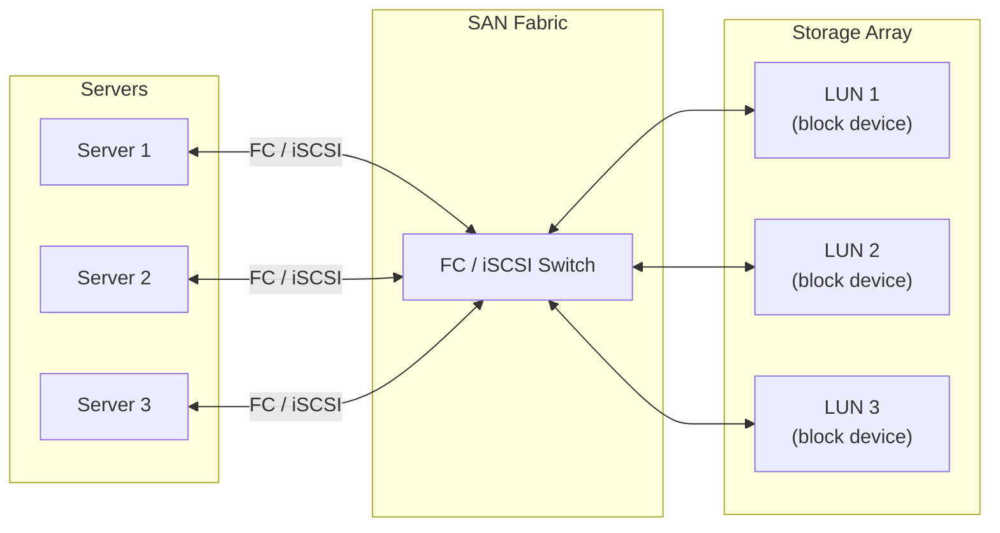

### Network-Attached Storage (NAS)

A **NAS** provides **file-level** storage over the regular network using file-sharing protocols (NFS, SMB/CIFS).

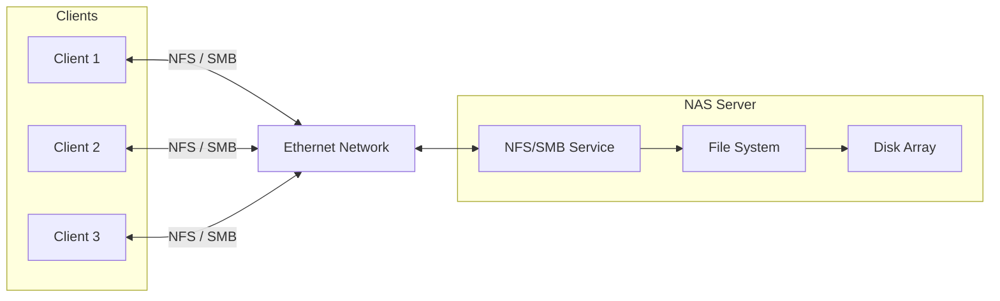

### SAN vs NAS Comparison

| Feature | SAN | NAS |
|---------|-----|-----|
| **Access level** | Block (raw disk) | File (shared filesystem) |
| **Protocol** | FC, iSCSI, FCoE | NFS, SMB/CIFS |
| **Network** | Dedicated (FC) or IP | Standard Ethernet |
| **Performance** | Highest (dedicated network) | Good (but shared network) |
| **Cost** | Expensive | Moderate |
| **Complexity** | High | Low |
| **Best for** | Databases, VMs, high-IOPS | File sharing, backups, home dirs |
| **Server sees** | Block device (/dev/sdX) | Mounted filesystem (/mnt/share) |

```bash
# Mount NFS share (NAS)
sudo mount -t nfs nas-server:/export/data /mnt/data

# Connect iSCSI target (SAN)
sudo iscsiadm -m discovery -t st -p san-server:3260
sudo iscsiadm -m node -T iqn.2024.com.example:target -p san-server --login
# New block device appears: /dev/sdc
```

---

## Modern Storage Technologies

### NVMe over Fabrics (NVMe-oF)

**NVMe-oF** extends the NVMe protocol over a network, providing near-local NVMe performance for remote storage.

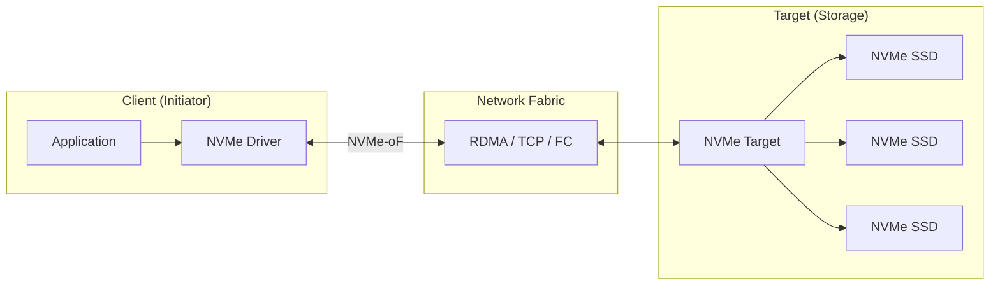

| NVMe-oF Transport | Network | Latency | Bandwidth |
|-------------------|---------|---------|-----------|
| **RDMA (RoCE)** | Ethernet | ~10 μs | 100+ Gbps |
| **TCP** | Standard Ethernet | ~100 μs | 25–100 Gbps |
| **Fibre Channel** | FC | ~20 μs | 32–64 Gbps |

```bash
# Connect to NVMe-oF target over TCP
sudo nvme connect -t tcp -a 192.168.1.100 -s 4420 -n nqn.example.com:subsys

# List connected NVMe-oF devices
sudo nvme list-subsys

# Disconnect
sudo nvme disconnect -n nqn.example.com:subsys
```

### Persistent Memory (PMEM)

**Persistent memory** (e.g., Intel Optane) sits between DRAM and SSD in the storage hierarchy — byte-addressable like RAM but persistent like storage.

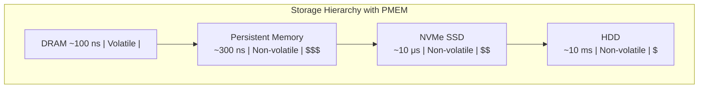

| Property | DRAM | PMEM | NVMe SSD |
|----------|------|------|----------|
| **Latency** | ~100 ns | ~300 ns | ~10,000 ns |
| **Persistence** | Volatile | **Persistent** | Persistent |
| **Addressing** | Byte | Byte | Block |
| **Interface** | DIMM slot | DIMM slot | PCIe |
| **Capacity** | 16–256 GB | 128–512 GB | 256 GB–30 TB |

```bash
# View PMEM devices
ndctl list

# Create a namespace in fsdax mode (filesystem DAX)
sudo ndctl create-namespace -m fsdax -s 128G

# Format and mount with DAX (direct access, bypass page cache)
sudo mkfs.xfs /dev/pmem0
sudo mount -o dax /dev/pmem0 /mnt/pmem

# Applications can mmap the file for direct persistent memory access
# (bypass the entire I/O stack!)
```

### DAX (Direct Access)

**DAX** allows applications to directly access persistent memory without going through the page cache, using `mmap()` for load/store operations:

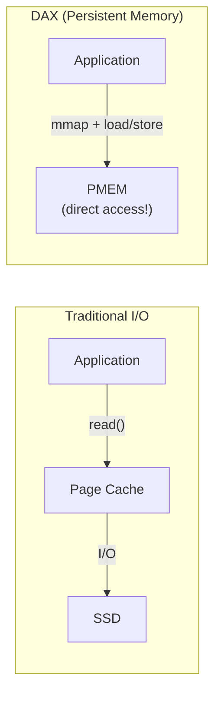

---

## Storage Architecture Decision Guide

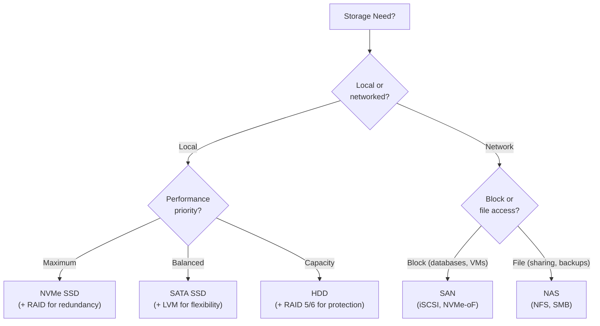

---

## Key Takeaways

1. **RAID** combines multiple disks for performance and/or redundancy: **RAID 0** (striping, no protection), **RAID 1** (mirroring), **RAID 5** (distributed parity, 1 disk tolerance), **RAID 6** (double parity, 2 disk tolerance), **RAID 10** (mirrored stripes, best performance).

2. **RAID parity** uses XOR to calculate error-correction data, allowing reconstruction of a failed disk's contents. The RAID 5 write penalty requires 4 I/O operations per write.

3. **Software RAID** (Linux `mdadm`) is free and portable; **hardware RAID** offers dedicated processing and battery-backed cache but adds vendor lock-in and cost.

4. **LVM** provides a flexible abstraction layer enabling dynamic volume resizing, disk spanning, snapshots, and thin provisioning without downtime.

5. **SAN** provides block-level storage over dedicated networks (FC, iSCSI) for databases and VMs; **NAS** provides file-level storage over Ethernet (NFS, SMB) for file sharing and backups.

6. **NVMe-oF** extends NVMe over network fabrics for near-local SSD performance, while **persistent memory** (PMEM with DAX) provides byte-addressable, non-volatile storage at near-DRAM speeds — blurring the line between memory and storage.
