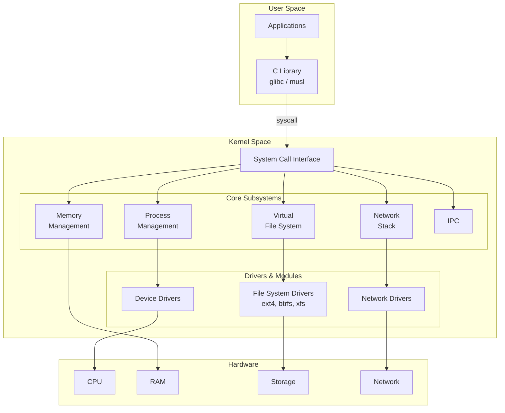
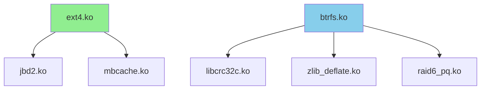
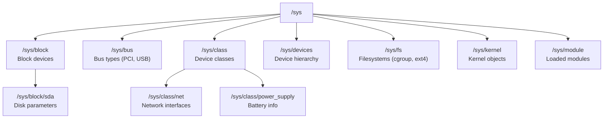
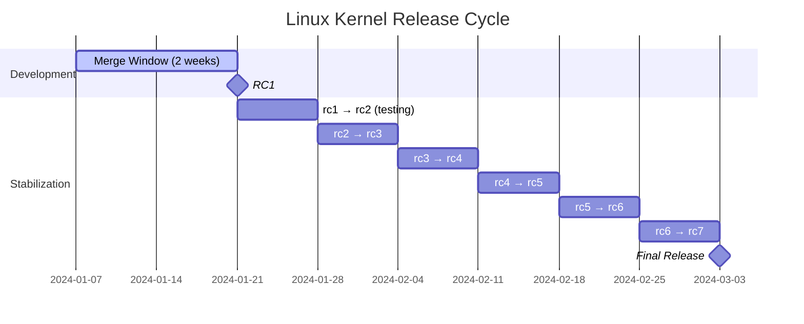

## Learning Objectives

By the end of this lesson, you will be able to:

- Describe the Linux kernel's monolithic architecture and its subsystems
- Load, unload, and inspect kernel modules using lsmod, modprobe, and insmod
- Navigate and extract information from the /proc and /sys virtual filesystems
- Tune kernel parameters at runtime using sysctl
- Understand the basics of kernel compilation and configuration
- Interpret Linux kernel version numbers and release cycles

## Prerequisites

- Familiarity with the Linux command line
- Understanding of OS kernel concepts (user mode, kernel mode, system calls)
- Basic knowledge of C programming

---

## Linux Kernel Architecture

The Linux kernel is a **monolithic kernel** — all core OS services (process management, memory management, file systems, networking, device drivers) run in a single address space in kernel mode. However, it supports **loadable kernel modules** for extensibility.



### Monolithic vs Microkernel

| Aspect | Monolithic (Linux) | Microkernel (Minix, QNX) |
|--------|-------------------|--------------------------|
| Address space | Single (all in kernel) | Multiple (services in user space) |
| Performance | Fast (no IPC overhead) | Slower (message passing) |
| Reliability | Bug in any part can crash kernel | Isolated failures |
| Complexity | Large codebase | Smaller kernel, more servers |
| Code size | ~30M+ lines | ~10K-100K lines (kernel only) |

### Core Subsystems

| Subsystem | Responsibility | Key Files |
|-----------|---------------|-----------|
| **Process Management** | Scheduling, creation, signals | `kernel/sched/`, `kernel/fork.c` |
| **Memory Management** | Virtual memory, paging, allocation | `mm/` |
| **Virtual File System** | Unified file interface | `fs/` |
| **Network Stack** | TCP/IP, sockets | `net/` |
| **Device Drivers** | Hardware abstraction | `drivers/` |
| **IPC** | Pipes, signals, shared memory | `ipc/` |
| **Security** | SELinux, capabilities | `security/` |

```bash
# View kernel subsystem sizes (from source tree)
cd linux-source
find kernel/ -name '*.c' | xargs wc -l | tail -1    # Process management
find mm/ -name '*.c' | xargs wc -l | tail -1         # Memory management
find net/ -name '*.c' | xargs wc -l | tail -1        # Networking
find drivers/ -name '*.c' | xargs wc -l | tail -1    # Drivers (~60% of code)
```

---

## Kernel Modules

**Loadable Kernel Modules (LKMs)** extend the kernel at runtime without recompiling or rebooting. Most device drivers are implemented as modules.

### Module Management Commands

```bash
# List loaded modules
lsmod
# Module                  Size  Used by
# nvidia               2345678  42
# snd_hda_intel          54321  3 snd_hda_codec_hdmi
# ext4                  987654  2
# btrfs                1234567  0

# Detailed module info
modinfo ext4
# filename:       /lib/modules/6.1.0/kernel/fs/ext4/ext4.ko
# license:        GPL
# description:    Fourth Extended Filesystem
# author:         ...
# depends:        mbcache,jbd2
# alias:          fs-ext4

# Load a module (resolves dependencies automatically)
sudo modprobe vfat

# Load with parameters
sudo modprobe loop max_loop=64

# Unload a module
sudo modprobe -r vfat

# Force load (bypasses version checks — dangerous)
sudo insmod /path/to/module.ko

# View module parameters
cat /sys/module/loop/parameters/max_loop

# List available modules
find /lib/modules/$(uname -r) -name '*.ko*' | head -20
```

### Writing a Simple Kernel Module

```c
// hello.c — A minimal kernel module
#include <linux/module.h>
#include <linux/kernel.h>
#include <linux/init.h>

MODULE_LICENSE("GPL");
MODULE_AUTHOR("Student");
MODULE_DESCRIPTION("Hello World Kernel Module");
MODULE_VERSION("1.0");

static char *name = "World";
module_param(name, charp, 0644);
MODULE_PARM_DESC(name, "The name to greet");

static int __init hello_init(void) {
    printk(KERN_INFO "Hello, %s! Module loaded.\n", name);
    return 0;  // 0 = success
}

static void __exit hello_exit(void) {
    printk(KERN_INFO "Goodbye, %s! Module unloaded.\n", name);
}

module_init(hello_init);
module_exit(hello_exit);
```

```makefile
# Makefile
obj-m += hello.o

KDIR := /lib/modules/$(shell uname -r)/build

all:
	make -C $(KDIR) M=$(PWD) modules

clean:
	make -C $(KDIR) M=$(PWD) clean
```

```bash
# Build and test
make
sudo insmod hello.ko name="Linux"
dmesg | tail -1
# [12345.678] Hello, Linux! Module loaded.

sudo rmmod hello
dmesg | tail -1
# [12350.123] Goodbye, Linux! Module unloaded.
```

### Module Dependencies



```bash
# View module dependency tree
modprobe --show-depends ext4
# insmod /lib/modules/.../mbcache.ko
# insmod /lib/modules/.../jbd2.ko
# insmod /lib/modules/.../ext4.ko

# Auto-load modules at boot
echo "vfat" | sudo tee /etc/modules-load.d/vfat.conf

# Blacklist a module
echo "blacklist nouveau" | sudo tee /etc/modprobe.d/blacklist-nouveau.conf
```

---

## The /proc Filesystem

**/proc** is a virtual filesystem that provides a window into the kernel's view of the system. Files are generated on-the-fly — nothing is stored on disk.

### Process Information

```bash
# Process details for PID 1
ls /proc/1/
# cmdline  cwd  environ  exe  fd  maps  mem  stat  status ...

# Command line
cat /proc/1/cmdline | tr '\0' ' '
# /sbin/init splash

# Memory maps
cat /proc/1/maps | head -5
# 5555a0000000-5555a0020000 r--p 00000000 08:01 1234  /sbin/init

# File descriptors
ls -la /proc/1/fd/
# lrwx------ 0 -> /dev/null
# lr-x------ 1 -> /dev/null
# lrwx------ 3 -> socket:[12345]

# Process status
cat /proc/1/status
# Name:   systemd
# State:  S (sleeping)
# Pid:    1
# VmRSS:  12456 kB
# Threads: 1
```

### System-Wide Information

| File | Information |
|------|-------------|
| `/proc/cpuinfo` | CPU model, cores, features, cache |
| `/proc/meminfo` | Memory usage (total, free, buffers, cache) |
| `/proc/loadavg` | Load averages (1, 5, 15 min) |
| `/proc/uptime` | System uptime in seconds |
| `/proc/version` | Kernel version string |
| `/proc/stat` | CPU time breakdown |
| `/proc/net/dev` | Network interface statistics |
| `/proc/filesystems` | Supported filesystem types |
| `/proc/mounts` | Currently mounted filesystems |
| `/proc/interrupts` | IRQ counts per CPU |
| `/proc/vmstat` | Virtual memory statistics |

```bash
# CPU information
grep "model name" /proc/cpuinfo | head -1
# model name : Intel(R) Core(TM) i7-12700K

# Memory overview
grep -E "MemTotal|MemFree|MemAvailable|Buffers|Cached" /proc/meminfo
# MemTotal:       32768000 kB
# MemFree:         4567890 kB
# MemAvailable:   24567890 kB
# Buffers:          234567 kB
# Cached:         18765432 kB

# System load
cat /proc/loadavg
# 0.52 0.48 0.45 2/1234 5678

# Context switches and interrupts
grep -E "ctxt|processes|procs" /proc/stat
# ctxt 123456789
# processes 98765
# procs_running 2
# procs_blocked 0
```

---

## The /sys Filesystem (sysfs)

**/sys** exposes the kernel's device model in a structured hierarchy. Unlike /proc, it follows strict organization rules.



```bash
# Network interface details
cat /sys/class/net/eth0/speed        # Link speed (Mbps)
cat /sys/class/net/eth0/address      # MAC address
cat /sys/class/net/eth0/operstate    # up/down

# Block device info
cat /sys/block/sda/queue/scheduler   # I/O scheduler
cat /sys/block/sda/queue/nr_requests # Queue depth
cat /sys/block/sda/size              # Size in 512-byte sectors

# CPU information
ls /sys/devices/system/cpu/
cat /sys/devices/system/cpu/cpu0/cpufreq/scaling_cur_freq  # Current freq (kHz)

# Loaded module parameters
cat /sys/module/tcp_cubic/parameters/*

# Kernel settings
cat /sys/kernel/mm/transparent_hugepage/enabled
# [always] madvise never
```

---

## Kernel Parameters with sysctl

**sysctl** reads and modifies kernel parameters at runtime via the `/proc/sys/` interface:

```bash
# View all parameters
sysctl -a | wc -l    # Thousands of tunable parameters

# View specific parameter
sysctl net.ipv4.ip_forward
# net.ipv4.ip_forward = 0

# Set parameter (runtime, non-persistent)
sudo sysctl -w net.ipv4.ip_forward=1

# Equivalent:
echo 1 | sudo tee /proc/sys/net/ipv4/ip_forward
```

### Essential Tunable Parameters

| Parameter | Default | Description |
|-----------|---------|-------------|
| `net.ipv4.ip_forward` | 0 | Enable IP forwarding (routing) |
| `net.core.somaxconn` | 4096 | Max socket listen backlog |
| `vm.swappiness` | 60 | How aggressively to swap (0-100) |
| `vm.overcommit_memory` | 0 | Memory overcommit policy |
| `kernel.pid_max` | 32768 | Maximum PID value |
| `fs.file-max` | 1048576 | System-wide open file limit |
| `net.ipv4.tcp_max_syn_backlog` | 1024 | TCP SYN queue size |
| `kernel.panic` | 0 | Seconds before reboot on panic (0 = no reboot) |

### Persistent Configuration

```bash
# Add to /etc/sysctl.conf or /etc/sysctl.d/*.conf
sudo tee /etc/sysctl.d/99-custom.conf <<'CONFIG'
# Enable IP forwarding
net.ipv4.ip_forward = 1

# Reduce swappiness for database servers
vm.swappiness = 10

# Increase file descriptor limits
fs.file-max = 2097152

# Network performance tuning
net.core.rmem_max = 16777216
net.core.wmem_max = 16777216
net.ipv4.tcp_rmem = 4096 87380 16777216
net.ipv4.tcp_wmem = 4096 65536 16777216
CONFIG

# Apply changes
sudo sysctl --system
```

---

## Kernel Compilation

Building a custom kernel allows you to enable/disable features, apply patches, and optimize for your hardware.


### Step-by-Step

```bash
# 1. Get the source
wget https://cdn.kernel.org/pub/linux/kernel/v6.x/linux-6.8.tar.xz
tar xf linux-6.8.tar.xz
cd linux-6.8

# 2. Copy current config as starting point
cp /boot/config-$(uname -r) .config

# 3. Configure
make menuconfig     # Terminal-based GUI
# or
make nconfig        # Newer terminal UI
# or
make olddefconfig   # Use defaults for new options

# 4. Compile (use all CPU cores)
make -j$(nproc)

# 5. Install modules
sudo make modules_install

# 6. Install kernel
sudo make install
# Copies vmlinuz, System.map, .config to /boot/

# 7. Update bootloader
sudo update-grub     # Debian/Ubuntu
# or
sudo grub2-mkconfig -o /boot/grub2/grub.cfg  # Fedora/RHEL

# 8. Reboot
sudo reboot
```

### Configuration Options

```bash
# Search for a config option
grep CONFIG_EXT4 .config
# CONFIG_EXT4_FS=y       ← Built into kernel
# CONFIG_EXT4_FS_POSIX_ACL=y

# Common options:
# =y   Built into kernel image (always available)
# =m   Build as loadable module (loaded on demand)
# =n   Not built (disabled)

# Check what your running kernel supports
zcat /proc/config.gz | grep CONFIG_CGROUPS
# CONFIG_CGROUPS=y
# CONFIG_CGROUP_BPF=y
```

---

## Kernel Versioning

### Version Scheme

```
6.8.1
│ │ │
│ │ └── Patch version (bug fixes)
│ └──── Minor version (new features)
└────── Major version (incremented when Linus decides)
```

```bash
# Check kernel version
uname -r
# 6.8.0-45-generic

# Detailed version info
uname -a
# Linux hostname 6.8.0-45-generic #45~22.04.1-Ubuntu SMP x86_64 GNU/Linux

# Version from /proc
cat /proc/version
# Linux version 6.8.0-45-generic (buildd@...) (gcc-12 ...) #45~22.04.1-Ubuntu ...
```

### Release Cycle



- **Merge window**: ~2 weeks where new features are accepted
- **RC phase**: ~6-8 weeks of bug fixes only, no new features
- New release every ~9-10 weeks
- **LTS kernels**: Maintained for 2-6 years (e.g., 6.1, 6.6)

```bash
# Check available kernels
dpkg --list | grep linux-image     # Debian/Ubuntu
rpm -qa | grep kernel              # Fedora/RHEL

# Installed kernel locations
ls /boot/vmlinuz-*
```

---

## Interacting with the Kernel at Runtime

```bash
# Kernel ring buffer (boot and runtime messages)
dmesg | tail -20
dmesg --level=err        # Only errors
dmesg -T                 # Human-readable timestamps
journalctl -k            # systemd journal kernel messages

# Kernel log levels
# 0: KERN_EMERG    — System is unusable
# 1: KERN_ALERT    — Immediate action required
# 2: KERN_CRIT     — Critical conditions
# 3: KERN_ERR      — Error conditions
# 4: KERN_WARNING  — Warning conditions
# 5: KERN_NOTICE   — Normal but significant
# 6: KERN_INFO     — Informational
# 7: KERN_DEBUG    — Debug-level messages

# Change console log level
echo 4 | sudo tee /proc/sys/kernel/printk
# Only WARN and above shown on console

# Kernel crash analysis
cat /proc/sys/kernel/panic    # Seconds before reboot on panic
cat /var/crash/               # Crash dumps (if configured)
```

---

## Key Takeaways

1. The **Linux kernel** is monolithic — all core services run in kernel space for performance — but supports **loadable modules** for flexibility without recompilation.

2. **Kernel modules** (`.ko` files) can be loaded/unloaded at runtime using `modprobe`. Use `lsmod` to list, `modinfo` for details, and `/etc/modprobe.d/` for configuration.

3. **/proc** is a virtual filesystem exposing kernel and process information. Per-process data lives in `/proc/[pid]/` while system-wide data is in `/proc/meminfo`, `/proc/cpuinfo`, etc.

4. **/sys** (sysfs) exposes the kernel's device model in a structured hierarchy — use it to inspect and configure hardware parameters, module settings, and device attributes.

5. **sysctl** provides runtime kernel parameter tuning through `/proc/sys/`. Make changes persistent in `/etc/sysctl.d/*.conf`.

6. Kernel compilation follows: source → `make menuconfig` → `make -j$(nproc)` → `make modules_install` → `make install` → update bootloader.

7. Linux follows a time-based release cycle (~9-10 weeks), with LTS kernels receiving extended maintenance. The kernel version is `major.minor.patch`.
