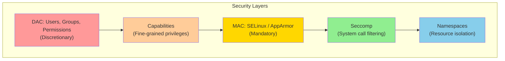
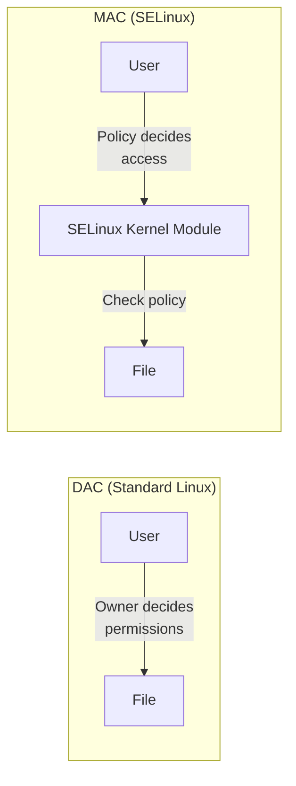
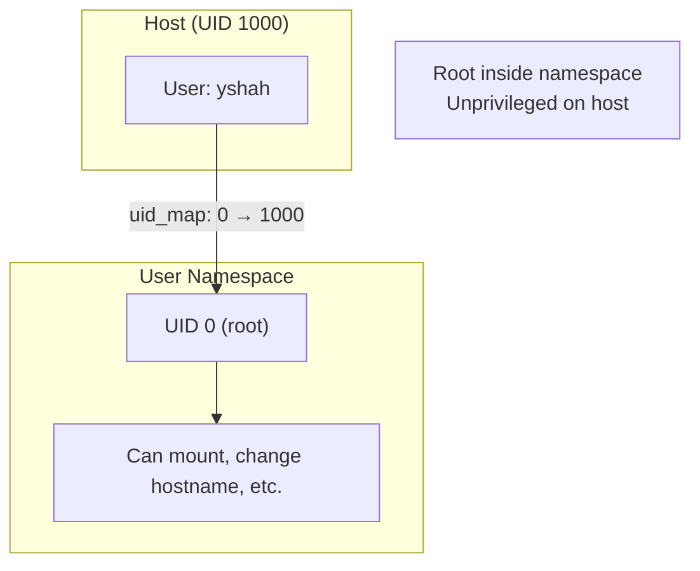
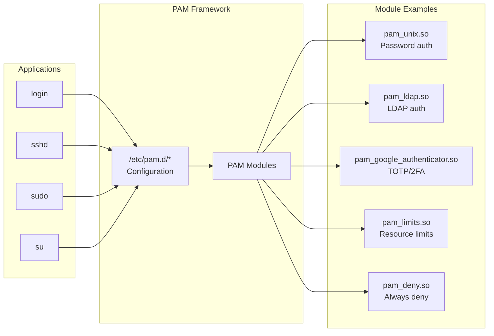
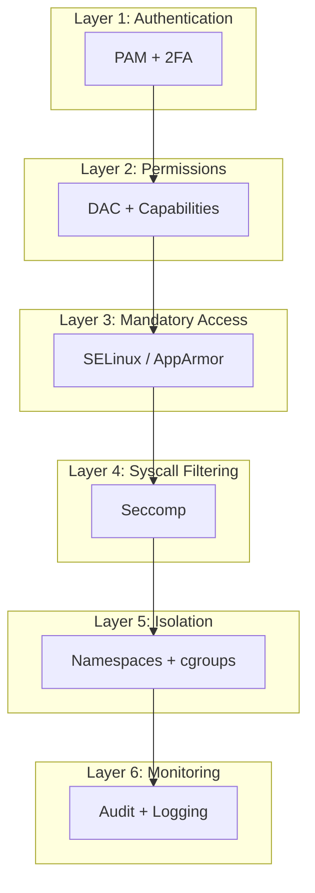

## Learning Objectives

By the end of this lesson, you will be able to:

- Explain the Linux security model based on users, groups, and permissions
- Understand and manage Linux capabilities as fine-grained alternatives to root
- Compare mandatory access control systems (SELinux and AppArmor)
- Write and apply seccomp filters to restrict system calls
- Use user namespaces for rootless isolation
- Configure the Linux audit subsystem for security monitoring
- Understand PAM (Pluggable Authentication Modules) architecture

## Prerequisites

- Linux kernel architecture and system call concepts
- User and permission management basics
- Understanding of namespaces and containers

---

## Linux Security Model

Linux security is built on the **Discretionary Access Control (DAC)** model: resource owners decide who can access their resources.



### The Root Problem

Traditionally, processes run as either:
- **Unprivileged (UID > 0)**: Limited capabilities
- **Root (UID 0)**: ALL capabilities — can do anything

This all-or-nothing model is dangerous. A compromised root process has unrestricted access to the entire system.

---

## Linux Capabilities

**Capabilities** split the monolithic root privilege into distinct units. A process can have just the capabilities it needs — nothing more.

### Key Capabilities

| Capability | Allows | Example Use |
|-----------|--------|-------------|
| `CAP_NET_BIND_SERVICE` | Bind to ports < 1024 | Web server on port 80 |
| `CAP_NET_ADMIN` | Network configuration | iptables, routes, interfaces |
| `CAP_NET_RAW` | Raw sockets | ping, tcpdump |
| `CAP_SYS_ADMIN` | Broad sysadmin operations | mount, swapon, sethostname |
| `CAP_SYS_PTRACE` | Trace other processes | strace, gdb |
| `CAP_DAC_OVERRIDE` | Bypass file permission checks | Access any file |
| `CAP_CHOWN` | Change file ownership | chown any file |
| `CAP_SETUID` | Change UID | setuid, setreuid |
| `CAP_SYS_MODULE` | Load/unload kernel modules | insmod, rmmod |
| `CAP_SYS_TIME` | Set system clock | NTP adjustments |
| `CAP_KILL` | Send signals to any process | Kill any process |

### Capability Sets

Each process has multiple capability sets:

| Set | Purpose |
|-----|---------|
| **Effective** | Capabilities actually used for permission checks |
| **Permitted** | Maximum capabilities the process can have |
| **Inheritable** | Capabilities preserved across execve() |
| **Bounding** | Upper limit — capabilities that can never be gained |
| **Ambient** | Capabilities automatically given to non-SUID programs |

### Managing Capabilities

```bash
# View capabilities of a process
getpcaps $$
# pid 1234: cap_sys_admin,cap_net_admin=ep

# View capabilities of a file
getcap /usr/bin/ping
# /usr/bin/ping cap_net_raw=ep

# Set capabilities on a file (instead of SUID)
sudo setcap cap_net_bind_service=+ep /usr/bin/my_server
# Now my_server can bind port 80 without being root

# Remove capabilities
sudo setcap -r /usr/bin/my_server

# Run a process with specific capabilities
capsh --caps="cap_net_bind_service+eip" -- -c "./my_server"

# Drop all capabilities except what's needed
capsh --drop=all --addamb=cap_net_bind_service -- -c "./my_server"
```

### Capability-Aware Programs

```c
#include <sys/capability.h>
#include <stdio.h>

int main() {
    // Get current capabilities
    cap_t caps = cap_get_proc();
    printf("Capabilities: %s\n", cap_to_text(caps, NULL));

    // Drop unnecessary capabilities
    cap_value_t drop_caps[] = {CAP_SYS_ADMIN, CAP_SYS_MODULE};
    cap_set_flag(caps, CAP_EFFECTIVE, 2, drop_caps, CAP_CLEAR);
    cap_set_flag(caps, CAP_PERMITTED, 2, drop_caps, CAP_CLEAR);
    cap_set_proc(caps);

    printf("After drop: %s\n", cap_to_text(cap_get_proc(), NULL));
    cap_free(caps);
    return 0;
}
```

```bash
gcc -lcap cap_demo.c -o cap_demo
sudo ./cap_demo
```

---

## SELinux (Security-Enhanced Linux)

**SELinux** implements **Mandatory Access Control (MAC)** — the kernel enforces security policies regardless of file permissions or user identity.

### DAC vs MAC



| Feature | DAC | MAC (SELinux) |
|---------|-----|---------------|
| Who sets policy | Resource owner | System administrator |
| Root bypass | Root can override all | Root is still constrained |
| Granularity | User/group/other | Process type, file label, role |
| Default | Allow unless denied | Deny unless allowed |

### SELinux Concepts

Everything has a **security context** (label):

```bash
# View file contexts
ls -Z /etc/passwd
# system_u:object_r:passwd_file_t:s0 /etc/passwd

# View process contexts
ps -eZ | grep httpd
# system_u:system_r:httpd_t:s0  1234 ?  00:00:01 httpd
```

```
system_u:system_r:httpd_t:s0
   │         │       │     │
   user     role    type  level
```

The **type** field is most important — SELinux policy defines which types can access which other types:

```bash
# httpd_t can read httpd_sys_content_t
# httpd_t CANNOT read user_home_t
# Even if file permissions say 777!
```

### SELinux Modes

```bash
# Check current mode
getenforce
# Enforcing / Permissive / Disabled

# Temporarily change mode
sudo setenforce 0    # Permissive (log but don't block)
sudo setenforce 1    # Enforcing (log and block)

# Permanent change in /etc/selinux/config
# SELINUX=enforcing
```

### Common SELinux Operations

```bash
# View and manage file contexts
semanage fcontext -l | grep httpd
restorecon -Rv /var/www/html/        # Reset to default context

# Allow httpd to connect to network
setsebool -P httpd_can_network_connect on

# Troubleshoot denials
ausearch -m avc -ts recent           # Recent denials
sealert -a /var/log/audit/audit.log  # Friendly analysis

# Generate custom policy from denials
audit2allow -a -M my_policy
semodule -i my_policy.pp
```

---

## AppArmor

**AppArmor** is an alternative MAC system (used by Ubuntu, SUSE). It uses **path-based** policies instead of SELinux's label-based approach.

### AppArmor vs SELinux

| Feature | SELinux | AppArmor |
|---------|---------|----------|
| Policy model | Label-based (type enforcement) | Path-based (file paths in rules) |
| Complexity | Steep learning curve | Easier to understand |
| Granularity | Very fine-grained | Moderate |
| Default in | RHEL, Fedora, CentOS | Ubuntu, SUSE, Debian |
| Performance | Minimal overhead | Minimal overhead |

### AppArmor Profile Example

```bash
# /etc/apparmor.d/usr.sbin.nginx
#include <tunables/global>

/usr/sbin/nginx {
  #include <abstractions/base>
  #include <abstractions/nameservice>

  # Allow reading web content
  /var/www/** r,
  /etc/nginx/** r,

  # Allow writing logs and pid
  /var/log/nginx/** w,
  /run/nginx.pid rw,

  # Network access
  network inet stream,
  network inet6 stream,

  # Deny everything else (implicit)
  deny /etc/shadow r,
  deny /root/** rw,
}
```

### Managing AppArmor

```bash
# Status
sudo aa-status
# 42 profiles loaded
# 38 in enforce mode
# 4 in complain mode

# Put a profile in complain mode (log but don't block)
sudo aa-complain /usr/sbin/nginx

# Put a profile in enforce mode
sudo aa-enforce /usr/sbin/nginx

# Generate a profile from program behavior
sudo aa-genprof /usr/sbin/my_app
# Run the app, exercise all features
# Answer the prompts to build the profile

# Reload profiles
sudo apparmor_parser -r /etc/apparmor.d/usr.sbin.nginx
```

---

## Seccomp (Secure Computing)

**Seccomp** restricts which system calls a process can make. If a disallowed syscall is attempted, the process is killed or an error is returned.

### Seccomp Modes

| Mode | Description |
|------|-------------|
| **Strict** | Only read, write, exit, sigreturn allowed |
| **Filter (BPF)** | Custom rules using BPF programs |

### Seccomp-BPF Filter

```c
#include <linux/seccomp.h>
#include <linux/filter.h>
#include <linux/audit.h>
#include <sys/prctl.h>
#include <stddef.h>
#include <stdio.h>
#include <unistd.h>

void install_filter() {
    struct sock_filter filter[] = {
        // Load syscall number
        BPF_STMT(BPF_LD | BPF_W | BPF_ABS,
                 offsetof(struct seccomp_data, nr)),

        // Allow write
        BPF_JUMP(BPF_JMP | BPF_JEQ | BPF_K, __NR_write, 0, 1),
        BPF_STMT(BPF_RET | BPF_K, SECCOMP_RET_ALLOW),

        // Allow exit_group
        BPF_JUMP(BPF_JMP | BPF_JEQ | BPF_K, __NR_exit_group, 0, 1),
        BPF_STMT(BPF_RET | BPF_K, SECCOMP_RET_ALLOW),

        // Allow read
        BPF_JUMP(BPF_JMP | BPF_JEQ | BPF_K, __NR_read, 0, 1),
        BPF_STMT(BPF_RET | BPF_K, SECCOMP_RET_ALLOW),

        // Kill on any other syscall
        BPF_STMT(BPF_RET | BPF_K, SECCOMP_RET_KILL),
    };

    struct sock_fprog prog = {
        .len = sizeof(filter) / sizeof(filter[0]),
        .filter = filter,
    };

    prctl(PR_SET_NO_NEW_PRIVS, 1, 0, 0, 0);
    prctl(PR_SET_SECCOMP, SECCOMP_MODE_FILTER, &prog);
}

int main() {
    install_filter();
    write(1, "Allowed!\n", 9);      // OK

    // open("/etc/passwd", 0);       // Would be killed!
    return 0;
}
```

### Seccomp with libseccomp (Easier API)

```c
#include <seccomp.h>
#include <stdio.h>
#include <unistd.h>

int main() {
    // Default: kill on any syscall
    scmp_filter_ctx ctx = seccomp_init(SCMP_ACT_KILL);

    // Whitelist specific syscalls
    seccomp_rule_add(ctx, SCMP_ACT_ALLOW, SCMP_SYS(read), 0);
    seccomp_rule_add(ctx, SCMP_ACT_ALLOW, SCMP_SYS(write), 0);
    seccomp_rule_add(ctx, SCMP_ACT_ALLOW, SCMP_SYS(exit), 0);
    seccomp_rule_add(ctx, SCMP_ACT_ALLOW, SCMP_SYS(exit_group), 0);

    // Only allow write to stdout (fd 1)
    seccomp_rule_add(ctx, SCMP_ACT_ALLOW, SCMP_SYS(write), 1,
                     SCMP_A0(SCMP_CMP_EQ, STDOUT_FILENO));

    seccomp_load(ctx);

    printf("This works (stdout)!\n");
    // fprintf(stderr, "This would kill us!\n");

    seccomp_release(ctx);
    return 0;
}
```

### Docker's Seccomp Profile

Docker applies a default seccomp profile blocking ~44 dangerous syscalls:

```bash
# View Docker's default seccomp profile
docker info --format '{{.SecurityOptions}}'
# [name=seccomp,profile=default]

# Run with custom profile
docker run --security-opt seccomp=my_profile.json nginx

# Run without seccomp (dangerous!)
docker run --security-opt seccomp=unconfined nginx
```

Blocked by default: `kexec_load`, `mount`, `reboot`, `setns`, `unshare`, `ptrace`, `syslog`, etc.

---

## User Namespaces for Isolation

**User namespaces** allow unprivileged users to create isolated environments where they appear as root:

```bash
# Create a user namespace (no root required!)
unshare --user --map-root-user bash

# Inside: appears as root
id
# uid=0(root) gid=0(root)

# But on the host: still unprivileged
# The namespace UID 0 maps to host UID 1000
cat /proc/self/uid_map
# 0  1000  1

# Combine with other namespaces for rootless containers
unshare --user --map-root-user --pid --fork --mount-proc bash
ps aux
# PID 1: bash (we're init!)
```



### Rootless Containers

```bash
# Podman runs containers without root
podman run --rm alpine id
# uid=0(root) gid=0(root)

# But the container process runs as your UID on the host
ps aux | grep conmon
# yshah  12345  ...  conmon  ...
```

---

## Linux Audit Subsystem

The **audit subsystem** provides detailed logging of security-relevant events for compliance and forensics.

```mermaid
graph TD
    KERNEL[Kernel Audit Framework] -->|"Audit events"| AUDITD[auditd daemon]
    AUDITD --> LOG[/var/log/audit/audit.log]
    LOG --> TOOLS[ausearch / aureport / auditctl]

    APP[Applications] -->|"Monitored syscalls"| KERNEL
    SELINUX[SELinux Denials] -->|"AVC events"| KERNEL
```

### Configuring Audit Rules

```bash
# Watch a file for changes
sudo auditctl -w /etc/passwd -p wa -k passwd_changes
# -w: watch path
# -p: permissions (r=read, w=write, x=execute, a=attribute change)
# -k: key (tag for searching)

# Watch a directory
sudo auditctl -w /etc/ssh/ -p wa -k ssh_config

# Monitor specific syscalls
sudo auditctl -a always,exit -F arch=b64 -S execve -k program_exec
# Log every program execution

# Monitor for privilege escalation
sudo auditctl -a always,exit -F arch=b64 -S setuid -S setgid -k priv_change

# List active rules
sudo auditctl -l

# Delete all rules
sudo auditctl -D
```

### Searching and Reporting

```bash
# Search for events
sudo ausearch -k passwd_changes -ts today
# type=SYSCALL msg=audit(1234567890.123:456): arch=c000003e syscall=257
# a0=ffffff9c a1=7ffc... success=yes exit=4 ...
# type=PATH msg=audit(...): name="/etc/passwd" ...

# Generate reports
sudo aureport --summary               # Overall summary
sudo aureport --auth                   # Authentication events
sudo aureport --login                  # Login attempts
sudo aureport -f                       # File access events
sudo aureport --syscall                # Syscall events

# Failed login attempts
sudo ausearch -m USER_LOGIN --success no
```

### Persistent Rules

```bash
# /etc/audit/rules.d/99-custom.rules
-w /etc/passwd -p wa -k identity
-w /etc/shadow -p wa -k identity
-w /etc/sudoers -p wa -k sudoers_changes
-w /var/log/audit/ -p wa -k audit_log_access
-a always,exit -F arch=b64 -S execve -F euid=0 -k root_commands
-a always,exit -F arch=b64 -S mount -S umount2 -k mount_operations

# Reload rules
sudo augenrules --load
```

---

## PAM (Pluggable Authentication Modules)

**PAM** provides a flexible framework for authentication. Instead of each program implementing its own auth, they all use PAM:



### PAM Configuration

```bash
# /etc/pam.d/sudo
# type      control    module             arguments
auth        required   pam_env.so
auth        required   pam_unix.so        try_first_pass
auth        sufficient pam_google_authenticator.so
account     required   pam_unix.so
session     required   pam_limits.so
session     required   pam_unix.so
```

### PAM Module Types

| Type | Purpose |
|------|---------|
| **auth** | Verify user identity (password, biometric, 2FA) |
| **account** | Check if account is valid (expired? locked? time-of-day?) |
| **password** | Handle password changes |
| **session** | Setup/teardown after auth (set env vars, mount home, logging) |

### Control Flags

| Flag | Behavior on Failure |
|------|-------------------|
| **required** | Must succeed, but continue checking other modules |
| **requisite** | Must succeed, fail immediately if not |
| **sufficient** | If succeeds, skip remaining modules (overall success) |
| **optional** | Result only matters if it's the only module |

### Setting Resource Limits via PAM

```bash
# /etc/security/limits.conf
# <domain>  <type>  <item>    <value>
*           soft    nofile    65536
*           hard    nofile    131072
@developers soft    nproc     4096
@developers hard    nproc     8192
root        soft    core      unlimited
```

```bash
# Verify limits
ulimit -a
# open files (-n) 65536
# max user processes (-u) 4096
```

---

## Defense in Depth

The ideal Linux security configuration uses multiple layers:



| Layer | Tool | What It Prevents |
|-------|------|-----------------|
| Authentication | PAM, 2FA | Unauthorized access |
| Permissions | Capabilities | Excessive privilege |
| MAC | SELinux/AppArmor | Lateral movement, data exfil |
| Seccomp | BPF filters | Kernel exploitation via syscalls |
| Namespaces | User, PID, net ns | Visibility of other processes/network |
| Audit | auditd | Undetected intrusion |

---

## Key Takeaways

1. **Linux capabilities** replace the all-or-nothing root model with fine-grained privileges — use `setcap` to give binaries only the capabilities they need instead of running as root.

2. **SELinux** (label-based) and **AppArmor** (path-based) implement mandatory access control — the kernel enforces security policy even against root processes, containing breaches.

3. **Seccomp-BPF** filters restrict which system calls a process can make — Docker uses this by default to block ~44 dangerous syscalls, and you can create custom profiles for tighter sandboxing.

4. **User namespaces** enable rootless containers and sandboxing — a process appears as root inside the namespace but maps to an unprivileged user on the host.

5. The **Linux audit subsystem** provides comprehensive security event logging — configure `auditctl` rules to monitor file access, syscalls, authentication events, and privilege changes.

6. **PAM** provides pluggable authentication — applications delegate auth to configurable module chains, enabling features like LDAP, 2FA, and resource limits without code changes.

7. **Defense in depth** is the principle: no single security mechanism is sufficient. Combine DAC, capabilities, MAC, seccomp, namespaces, and auditing for robust security posture.
