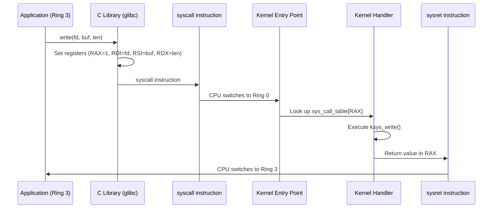
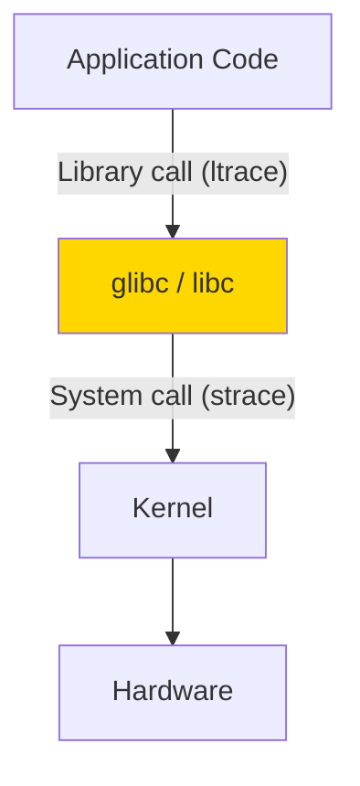
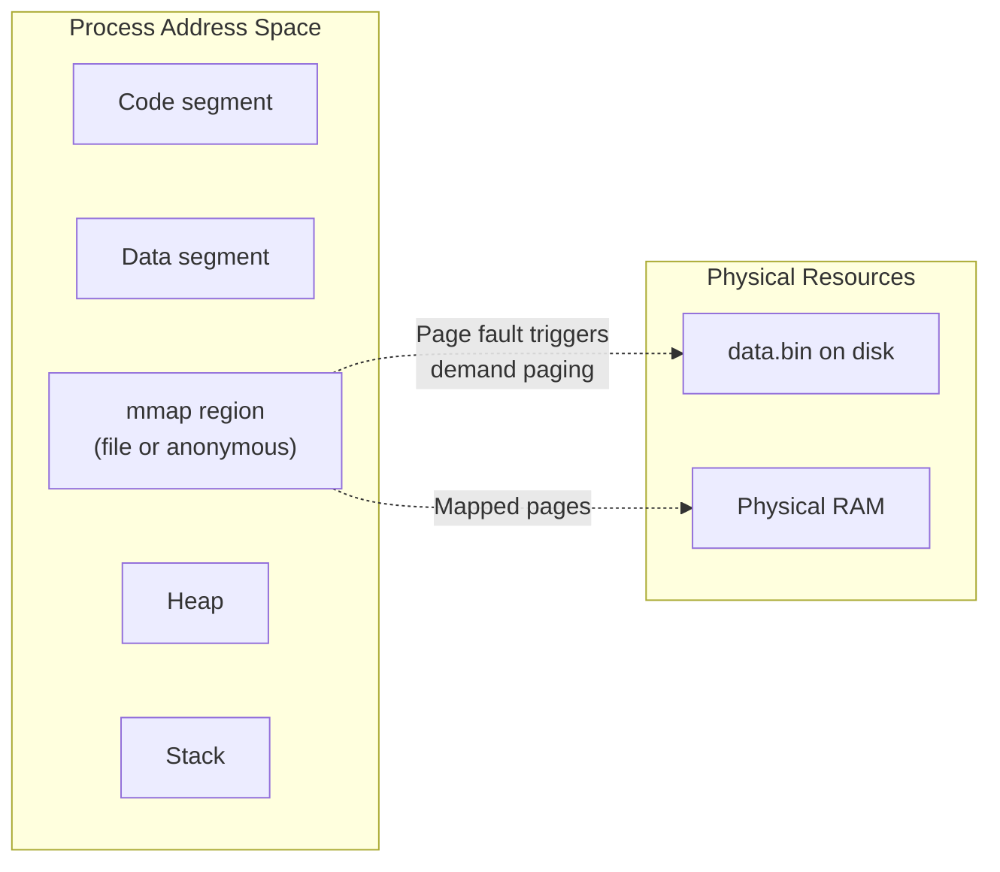
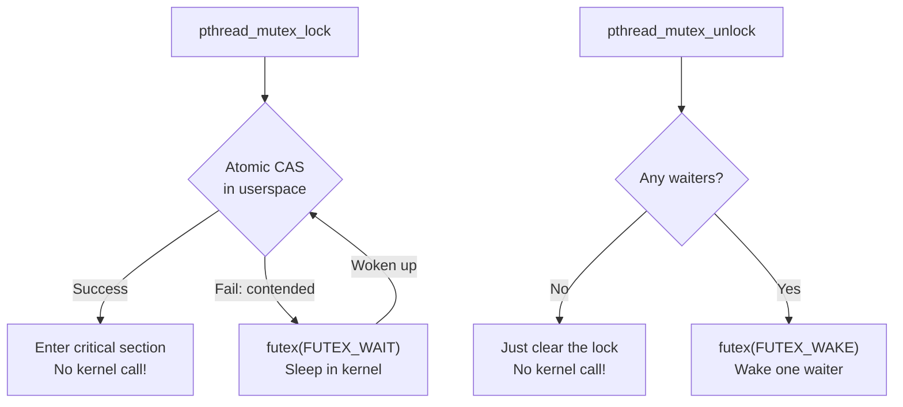
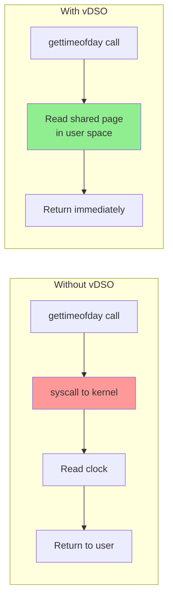

## Learning Objectives

By the end of this lesson, you will be able to:

- Trace the full path of a system call from user space to kernel and back on x86-64
- Distinguish between legacy int 0x80 and modern syscall instruction mechanisms
- Use strace and ltrace to debug and analyze program behavior
- Identify and explain key Linux system calls (open, read, write, mmap, ioctl, clone, futex)
- Understand the virtual dynamic shared object (vDSO) optimization
- Outline the process of adding a new system call to the Linux kernel

## Prerequisites

- Linux kernel architecture fundamentals
- x86-64 assembly basics (registers, instructions)
- C programming and POSIX API familiarity

---

## System Call Mechanism on x86-64

System calls are the interface between user-space programs and the kernel. When a program needs OS services (file I/O, process creation, networking), it triggers a controlled transition from user mode (ring 3) to kernel mode (ring 0).



### Register Conventions (x86-64 Linux ABI)

| Register | Purpose |
|----------|---------|
| RAX | System call number (input) / Return value (output) |
| RDI | First argument |
| RSI | Second argument |
| RDX | Third argument |
| R10 | Fourth argument |
| R8 | Fifth argument |
| R9 | Sixth argument |
| RCX | Clobbered (used by syscall instruction for return address) |
| R11 | Clobbered (used by syscall instruction for RFLAGS) |

### Modern: syscall Instruction (Fast Path)

```asm
; write(1, "Hello\n", 6) — write to stdout
section .data
    msg db "Hello", 10    ; "Hello\n"

section .text
    global _start
_start:
    mov rax, 1            ; syscall number for write
    mov rdi, 1            ; fd = stdout
    lea rsi, [msg]        ; buffer address
    mov rdx, 6            ; byte count
    syscall               ; Transition to kernel
    ; Return value now in RAX (6 on success)

    ; exit(0)
    mov rax, 60           ; syscall number for exit
    xor rdi, rdi          ; status = 0
    syscall
```

```bash
nasm -f elf64 hello.asm -o hello.o
ld hello.o -o hello
./hello
# Hello
```

### The syscall Instruction Details

When `syscall` executes, the CPU:

1. Saves RIP (return address) in RCX
2. Saves RFLAGS in R11
3. Loads the kernel entry point from the MSR (Model-Specific Register) `IA32_LSTAR`
4. Sets CS to kernel code segment
5. Masks RFLAGS using `IA32_FMASK`
6. Begins execution at the kernel entry point

```c
// Kernel entry point (simplified from arch/x86/entry/entry_64.S)
SYM_CODE_START(entry_SYSCALL_64)
    swapgs                          // Switch to kernel GS base
    mov [rsp_scratch], rsp          // Save user stack pointer
    mov rsp, [kernel_stack]         // Switch to kernel stack
    push rcx                        // Save user RIP
    push r11                        // Save user RFLAGS

    // Save all user registers to pt_regs on stack
    push rdi
    push rsi
    push rdx
    // ...

    mov rdi, rsp                    // pt_regs pointer as argument
    call do_syscall_64              // Dispatch to handler
```

### Legacy: int 0x80 (Slow Path)

The old 32-bit mechanism still works but is significantly slower:

```asm
; Legacy interrupt-based syscall
mov eax, 4             ; write (32-bit syscall number)
mov ebx, 1             ; fd
mov ecx, msg           ; buffer
mov edx, 6             ; count
int 0x80               ; Software interrupt → kernel
```

### syscall vs int 0x80 Performance

| Mechanism | Kernel Entry Time | Notes |
|-----------|------------------|-------|
| `syscall` | ~50-100 ns | Direct ring transition, no IDT lookup |
| `int 0x80` | ~200-500 ns | Interrupt gate, save full state, IDT lookup |
| vDSO | ~5-20 ns | No kernel transition at all |

---

## Tracing with strace and ltrace

### strace: System Call Tracer

**strace** intercepts and logs all system calls made by a process:

```bash
# Trace a command
strace ls /tmp
# execve("/usr/bin/ls", ["ls", "/tmp"], ...) = 0
# brk(NULL)                          = 0x55a123456000
# openat(AT_FDCWD, "/etc/ld.so.cache", O_RDONLY|O_CLOEXEC) = 3
# ...
# openat(AT_FDCWD, "/tmp", O_RDONLY|O_NONBLOCK|O_DIRECTORY) = 3
# getdents64(3, ..., 32768)          = 240
# write(1, "file1.txt\nfile2.txt\n", 20) = 20
# close(3)                           = 0
# exit_group(0)                      = ?

# Trace specific syscalls only
strace -e trace=open,read,write ls /tmp

# Trace by category
strace -e trace=network curl example.com     # Network syscalls
strace -e trace=memory ./program             # Memory syscalls (mmap, brk, etc.)
strace -e trace=file ls /tmp                 # File-related syscalls
strace -e trace=process bash                 # Process-related (fork, exec, wait)

# Count syscalls (profiling)
strace -c ls /tmp
# % time     seconds  usecs/call     calls    errors syscall
# ------ ----------- ----------- --------- --------- --------
#  45.23    0.000123           8        15           openat
#  23.45    0.000064           5        12           mmap
#  12.34    0.000034           3        10           close
#   8.76    0.000024           3         8           fstat

# Attach to running process
strace -p $PID

# Follow child processes (fork/clone)
strace -f -p $PID

# Timestamp each syscall
strace -t ls             # Wall clock time
strace -T ls             # Time spent in each syscall
strace -r ls             # Relative timestamps between syscalls

# Output to file
strace -o trace.log ls /tmp
```

### ltrace: Library Call Tracer

**ltrace** traces calls to shared library functions:

```bash
ltrace ls /tmp
# __libc_start_main(0x55a123, 2, 0x7ffd...)
# setlocale(LC_ALL, "")              = "en_US.UTF-8"
# opendir("/tmp")                    = 0x55a456789
# readdir(0x55a456789)               = 0x55a456800
# strlen("file1.txt")                = 9
# strcmp("file1.txt", "file2.txt")   = -1
# puts("file1.txt")                  = 10

# Trace specific libraries
ltrace -e malloc+free ./program      # Memory allocations
ltrace -l libpthread.so.0 ./program  # pthread calls
```

### Combining strace and ltrace



---

## Key System Calls

### File Operations: open, read, write

```c
#include <fcntl.h>
#include <unistd.h>

// open — returns file descriptor
int fd = open("/etc/hostname", O_RDONLY);
// syscall: openat(AT_FDCWD, "/etc/hostname", O_RDONLY) = 3

// read — reads bytes into buffer
char buf[256];
ssize_t n = read(fd, buf, sizeof(buf));
// syscall: read(3, "myhostname\n", 256) = 11

// write — writes bytes from buffer
write(STDOUT_FILENO, buf, n);
// syscall: write(1, "myhostname\n", 11) = 11

close(fd);
```

### Memory Mapping: mmap

**mmap** maps files or anonymous memory into the process address space:

```c
#include <sys/mman.h>
#include <fcntl.h>

// Map a file into memory
int fd = open("data.bin", O_RDONLY);
struct stat st;
fstat(fd, &st);
void *mapped = mmap(NULL, st.st_size, PROT_READ, MAP_PRIVATE, fd, 0);
// Now access file contents via pointer — no read() calls needed!

// Anonymous mapping (like malloc for large allocations)
void *mem = mmap(NULL, 4096, PROT_READ | PROT_WRITE,
                 MAP_PRIVATE | MAP_ANONYMOUS, -1, 0);

munmap(mapped, st.st_size);
```



### Device Control: ioctl

**ioctl** is the "escape hatch" for operations that don't fit the read/write model:

```c
#include <sys/ioctl.h>
#include <linux/fs.h>

// Get terminal window size
struct winsize ws;
ioctl(STDOUT_FILENO, TIOCGWINSZ, &ws);
printf("Terminal: %d rows x %d cols\n", ws.ws_row, ws.ws_col);

// Get block device size
int fd = open("/dev/sda", O_RDONLY);
unsigned long long size;
ioctl(fd, BLKGETSIZE64, &size);
printf("Disk size: %llu bytes\n", size);
```

### Process Creation: clone

**clone** is the system call behind `fork()`, `vfork()`, and `pthread_create()`:

```c
#include <sched.h>

// fork() is equivalent to:
clone(child_func, stack, SIGCHLD, arg);

// pthread_create() is equivalent to:
clone(thread_func, stack,
      CLONE_VM | CLONE_FS | CLONE_FILES | CLONE_SIGHAND |
      CLONE_THREAD | CLONE_SYSVSEM,
      arg);

// Creating a new namespace (for containers):
clone(container_func, stack,
      CLONE_NEWPID | CLONE_NEWNS | CLONE_NEWNET | SIGCHLD,
      arg);
```

| Flag | Effect |
|------|--------|
| `CLONE_VM` | Share memory space (thread behavior) |
| `CLONE_FILES` | Share file descriptor table |
| `CLONE_FS` | Share filesystem info (cwd, root) |
| `CLONE_NEWPID` | New PID namespace |
| `CLONE_NEWNS` | New mount namespace |
| `CLONE_NEWNET` | New network namespace |

### Fast Userspace Mutexes: futex

**futex** is the building block for all userspace synchronization (pthreads mutexes, condition variables, semaphores):

```c
#include <linux/futex.h>
#include <sys/syscall.h>

// Low-level futex operations
// FUTEX_WAIT: sleep if *addr == expected
syscall(SYS_futex, addr, FUTEX_WAIT, expected, timeout, NULL, 0);

// FUTEX_WAKE: wake up to N waiters
syscall(SYS_futex, addr, FUTEX_WAKE, n_wake, NULL, NULL, 0);
```



The key insight: in the **uncontended case** (most common), no system call is needed — it's pure userspace atomic operations. The kernel is only involved when threads need to sleep/wake.

---

## The vDSO (Virtual Dynamic Shared Object)

The **vDSO** is a small shared library mapped into every process by the kernel. It allows certain system calls to execute entirely in user space:

```bash
# See the vDSO mapping
cat /proc/self/maps | grep vdso
# 7ffff7fc0000-7ffff7fc4000 r-xp 00000000 00:00 0  [vdso]

# List vDSO functions
objdump -T /proc/self/mem 2>/dev/null | grep vdso
# Or more reliably:
LD_SHOW_AUXV=1 /bin/true | grep SYSINFO
```

### vDSO-Accelerated Syscalls

| System Call | vDSO Function | How It Works |
|-------------|---------------|--------------|
| `gettimeofday()` | `__vdso_gettimeofday` | Reads shared kernel memory page |
| `clock_gettime()` | `__vdso_clock_gettime` | Reads TSC + kernel offset |
| `time()` | `__vdso_time` | Reads shared second counter |
| `getcpu()` | `__vdso_getcpu` | Reads CPU-local data |



The kernel maintains a shared memory page with time data, updated on every timer interrupt. User-space code reads this directly — no mode switch needed.

```c
#include <time.h>
#include <stdio.h>

int main() {
    struct timespec ts;
    for (int i = 0; i < 10000000; i++) {
        clock_gettime(CLOCK_MONOTONIC, &ts);  // vDSO — no syscall!
    }
    return 0;
}
```

```bash
# Verify: no syscall is made
strace -e trace=clock_gettime ./benchmark
# (no output — clock_gettime handled in vDSO!)

strace -c ./benchmark
# clock_gettime: 0 calls  ← confirmed: all in userspace
```

---

## Adding a System Call (Educational)

The process of adding a new system call to the Linux kernel:

### Step 1: Define the Syscall

```c
// kernel/my_syscall.c
#include <linux/kernel.h>
#include <linux/syscalls.h>

SYSCALL_DEFINE1(hello, const char __user *, name)
{
    char kname[64];
    if (copy_from_user(kname, name, sizeof(kname)))
        return -EFAULT;
    kname[sizeof(kname) - 1] = '\0';
    printk(KERN_INFO "Hello from syscall: %s\n", kname);
    return 0;
}
```

### Step 2: Assign a Syscall Number

```c
// arch/x86/entry/syscalls/syscall_64.tbl
// Add at the end:
// 451  common  hello    sys_hello
```

### Step 3: Declare the Prototype

```c
// include/linux/syscalls.h
asmlinkage long sys_hello(const char __user *name);
```

### Step 4: Add to Build System

```makefile
# kernel/Makefile
obj-y += my_syscall.o
```

### Step 5: Use from Userspace

```c
#include <unistd.h>
#include <sys/syscall.h>

#define SYS_hello 451

int main() {
    long ret = syscall(SYS_hello, "World");
    return ret;
}
```

```bash
gcc test_syscall.c -o test_syscall
./test_syscall
dmesg | tail -1
# Hello from syscall: World
```

---

## System Call Table

Common Linux system calls organized by category:

| Category | Syscalls | Purpose |
|----------|----------|---------|
| **File I/O** | open, read, write, close, lseek, pread, pwrite | Basic file operations |
| **File Management** | stat, fstat, chmod, chown, link, unlink, rename | File metadata |
| **Directory** | mkdir, rmdir, getdents, chdir, getcwd | Directory operations |
| **Process** | fork, clone, execve, wait4, exit, getpid | Process lifecycle |
| **Memory** | mmap, munmap, mprotect, brk, madvise | Memory management |
| **Signal** | kill, sigaction, sigprocmask, sigreturn | Signal handling |
| **Network** | socket, bind, listen, accept, connect, send, recv | Networking |
| **IPC** | pipe, shmget, semget, msgget, futex | Inter-process communication |
| **Time** | gettimeofday, clock_gettime, nanosleep, timer_create | Timing |
| **System** | ioctl, sysinfo, uname, reboot | System management |

```bash
# View all syscall numbers for your architecture
ausyscall --dump | head -20
# 0    read
# 1    write
# 2    open
# 3    close
# ...

# Count syscalls available
ausyscall --dump | wc -l
# ~450+ on modern Linux
```

---

## Key Takeaways

1. On x86-64, the **`syscall` instruction** provides fast user-to-kernel transitions by using MSRs for the entry point and registers for arguments, avoiding the overhead of interrupt gates.

2. **strace** is indispensable for debugging — it reveals every kernel interaction a program makes. Use `strace -c` for profiling, `-e trace=...` for filtering, and `-f` for following forks.

3. **mmap** unifies file I/O and memory allocation — it's used for loading shared libraries, memory-mapped files, and large memory allocations (malloc uses it for allocations >128KB).

4. **clone** is the universal process/thread creation syscall — different flag combinations produce `fork()`, `vfork()`, `pthread_create()`, or container namespace creation.

5. **futex** is the foundation of all userspace synchronization — it avoids system calls in the uncontended case (common path), making mutexes and condition variables fast.

6. The **vDSO** eliminates kernel transitions for frequently-called read-only operations like `gettimeofday()` and `clock_gettime()`, reducing their cost from ~100ns to ~5-20ns.

7. Linux has **~450+ system calls**, but most programs use only ~20-30 regularly. Understanding the key ones (open, read, write, mmap, clone, futex, ioctl) covers the vast majority of kernel interactions.
