## Learning Objectives

By the end of this lesson, you will be able to:

- Explain why page replacement is necessary
- Compare page replacement algorithms: FIFO, LRU, Optimal, and Clock
- Understand thrashing and how to detect it
- Describe the working set model and its importance
- Explain memory-mapped files and their benefits
- Understand swap space management and the Linux OOM killer

## Prerequisites

- Understanding of virtual memory, page tables, and demand paging
- Knowledge of page faults and how they are handled
- Familiarity with paging concepts (pages, frames, TLB)

---

## Why Page Replacement?

Physical memory (RAM) is finite. When all frames are occupied and a new page needs to be loaded (a **page fault**), the OS must **evict** an existing page to make room. The evicted page is the **victim**.

The choice of victim dramatically affects performance — pick a page that will be needed soon, and you'll cause another page fault almost immediately.

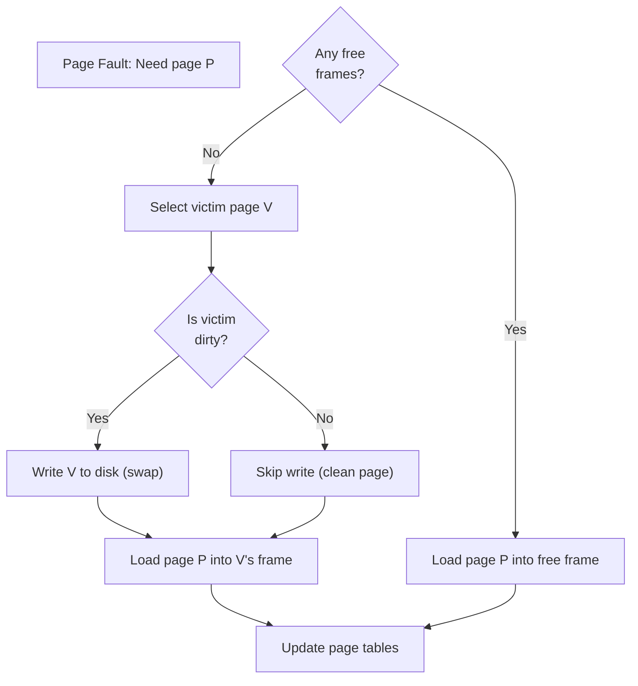

### The Dirty Bit

If a page has been **modified** (written to) since it was loaded, it must be written back to disk before being replaced. The **dirty bit** in the page table entry tracks this:

| Dirty Bit | Page State | On Eviction |
|-----------|-----------|-------------|
| 0 (clean) | Not modified since load | Just discard (disk copy is current) |
| 1 (dirty) | Modified since load | Must write to disk first |

---

## Page Replacement Algorithms

### Reference String

To compare algorithms, we use a **reference string** — the sequence of page numbers accessed by a process:

```
Reference String: 7, 0, 1, 2, 0, 3, 0, 4, 2, 3, 0, 3, 2, 1, 2, 0, 1, 7, 0, 1
Frames available: 3
```

### FIFO (First-In, First-Out)

Replace the **oldest** page in memory — the one that's been resident the longest.

```
Reference: 7  0  1  2  0  3  0  4  2  3  0  3  2  1  2  0  1  7  0  1
           ─────────────────────────────────────────────────────────────
Frame 1:   7  7  7  2  2  2  2  4  4  4  0  0  0  0  0  0  0  7  7  7
Frame 2:      0  0  0  0  3  3  3  2  2  2  2  2  1  1  1  1  1  0  0
Frame 3:         1  1  1  1  0  0  0  3  3  3  3  3  2  2  2  2  2  1
           ─────────────────────────────────────────────────────────────
Fault?     F  F  F  F     F  F  F  F  F  F        F  F     F  F  F  F
```

**Total page faults: 15**

**Pros:** Simple to implement (just a queue)
**Cons:** Doesn't consider page usage — may evict frequently-used pages

#### Bélády's Anomaly

FIFO can exhibit a counterintuitive behavior: **increasing the number of frames can increase page faults**. This is called Bélády's anomaly.

```
Reference: 1, 2, 3, 4, 1, 2, 5, 1, 2, 3, 4, 5

3 frames: 9 page faults
4 frames: 10 page faults (MORE with MORE frames!)
```

### Optimal (OPT / Bélády's Algorithm)

Replace the page that **won't be used for the longest time** in the future.

```
Reference: 7  0  1  2  0  3  0  4  2  3  0  3  2  1  2  0  1  7  0  1
           ─────────────────────────────────────────────────────────────
Frame 1:   7  7  7  2  2  2  2  2  2  2  2  2  2  2  2  2  2  7  7  7
Frame 2:      0  0  0  0  0  0  4  4  4  0  0  0  0  0  0  0  0  0  0
Frame 3:         1  1  1  3  3  3  3  3  3  3  3  1  1  1  1  1  1  1
           ─────────────────────────────────────────────────────────────
Fault?     F  F  F  F     F     F           F        F           F
```

**Total page faults: 9** (the theoretical minimum)

**Pros:** Provably optimal (minimum possible faults)
**Cons:** Requires future knowledge — impossible to implement in practice! Used only as a benchmark.

### LRU (Least Recently Used)

Replace the page that **hasn't been used for the longest time** — using past behavior to predict future access.

```
Reference: 7  0  1  2  0  3  0  4  2  3  0  3  2  1  2  0  1  7  0  1
           ─────────────────────────────────────────────────────────────
Frame 1:   7  7  7  2  2  2  2  4  4  4  0  0  0  1  1  1  1  1  1  1
Frame 2:      0  0  0  0  0  0  0  0  3  3  3  3  3  3  0  0  0  0  0
Frame 3:         1  1  1  3  3  3  2  2  2  2  2  2  2  2  2  7  7  7
           ─────────────────────────────────────────────────────────────
Fault?     F  F  F  F     F     F  F  F  F        F        F  F
```

**Total page faults: 12**

**LRU Implementation Options:**

| Method | How It Works | Overhead |
|--------|-------------|----------|
| **Counter** | Each PTE has a timestamp; on eviction, find min | High (compare all entries) |
| **Stack** | Maintain a stack of pages; on access, move to top | Moderate (update on every access) |
| **Approximation** | Use reference bits (see Clock algorithm) | Low |

### Clock (Second-Chance) Algorithm

A practical approximation of LRU using a **reference bit** and a circular buffer (the "clock hand").

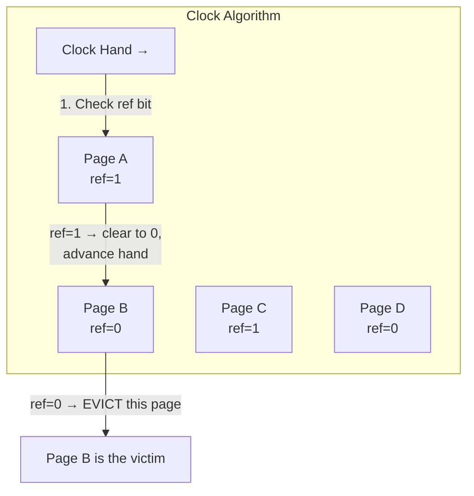

**Algorithm:**
1. Keep pages in a circular list with a "clock hand" pointer
2. When a page is accessed, set its **reference bit** to 1
3. On page fault, advance the hand:
   - If reference bit = 1: clear it to 0, advance (give it a "second chance")
   - If reference bit = 0: evict this page
4. This approximates LRU — recently used pages have ref=1 and survive

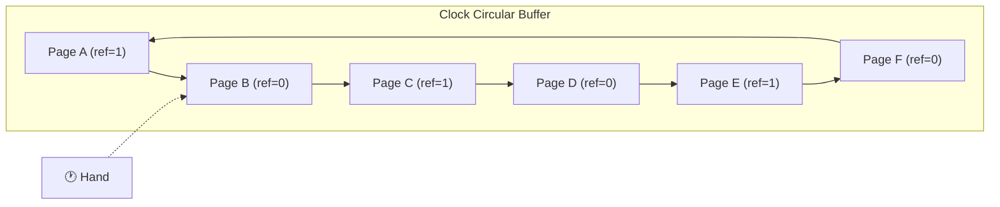

### Enhanced Clock (NRU — Not Recently Used)

Uses both reference and dirty bits for better decisions:

| Reference | Dirty | Class | Eviction Priority |
|-----------|-------|-------|-------------------|
| 0 | 0 | 0 | Best victim (not used, not modified) |
| 0 | 1 | 1 | Good victim (not used, but needs write) |
| 1 | 0 | 2 | Poor victim (recently used) |
| 1 | 1 | 3 | Worst victim (recently used and modified) |

### Algorithm Comparison

| Algorithm | Page Faults (example) | Implementation | Bélády's Anomaly | Notes |
|-----------|----------------------|----------------|-------------------|-------|
| **FIFO** | 15 | Simple queue | Yes | Worst performance |
| **Optimal** | 9 | Impossible (future knowledge) | No | Theoretical benchmark |
| **LRU** | 12 | Complex (exact) or approximate | No | Good but expensive |
| **Clock** | ~12–13 | Simple (circular + ref bit) | No | **Best practical choice** |

---

## Thrashing

**Thrashing** occurs when the system spends more time swapping pages in and out of memory than executing actual work. It happens when processes' combined memory demands far exceed available physical RAM.

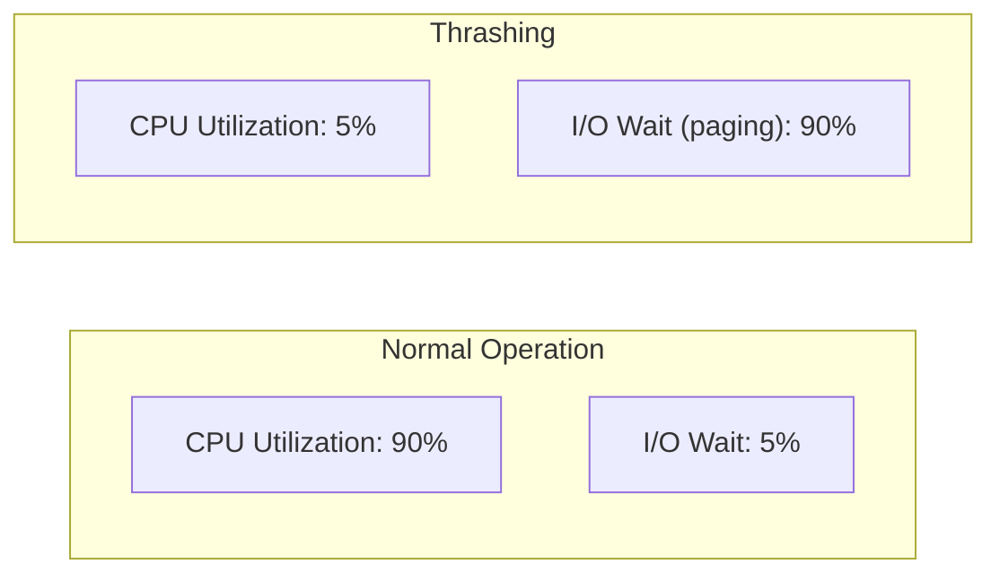

### Thrashing Cascade

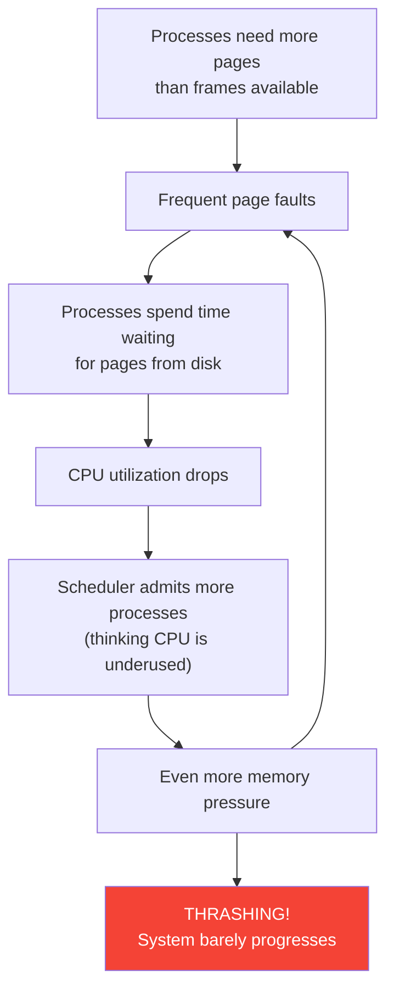

### Detecting Thrashing

```bash
# Watch for high swap activity (si/so columns)
vmstat 1
#  procs ---memory--- ---swap-- ---io--- -system-- ---cpu---
#  r  b   swpd  free   si   so   bi   bo   in   cs us sy id wa
# 15  8 400000 1234  5000 6000 5000 6000  200  400  5 10  5 80
#                         ↑    ↑                              ↑
#                    high swap in/out                    high I/O wait

# Check swap usage
swapon --show
free -h

# Monitor page fault rates
sar -B 1 10
# pgpgin/s  pgpgout/s  fault/s  majflt/s
#  50000.00   60000.00  100000    5000.00  ← thrashing!
```

### Solutions to Thrashing

| Solution | Description |
|----------|-------------|
| Add RAM | Most straightforward fix |
| Reduce processes | Kill or suspend low-priority processes |
| Working set model | Only admit processes if their working sets fit |
| Page fault frequency | Monitor per-process fault rates; adjust frame allocation |
| Swap to SSD | Reduce swap latency (doesn't solve the root cause) |

---

## Working Set Model

The **working set** of a process is the set of pages it actively uses during a window of time (Δ). If every process has enough frames for its working set, thrashing is avoided.

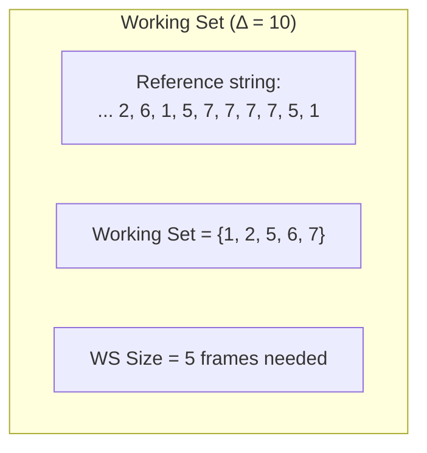

### Working Set Principle

```
Total frames needed = Σ (working set size of each process)

If total frames needed > available physical frames:
    → Suspend a process to prevent thrashing

If total frames needed < available physical frames:
    → Can admit more processes (increase multiprogramming)
```

### Page Fault Frequency (PFF) Approach

A simpler approach: monitor each process's page fault rate directly.

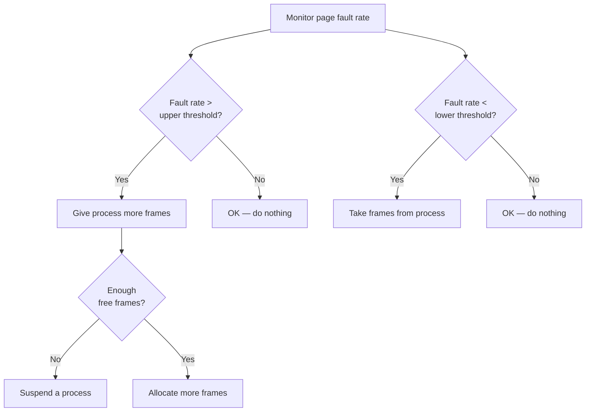

---

## Memory-Mapped Files

**Memory-mapped files** map a file's contents directly into a process's virtual address space. Instead of using `read()`/`write()` system calls, the process accesses the file as if it were an array in memory.

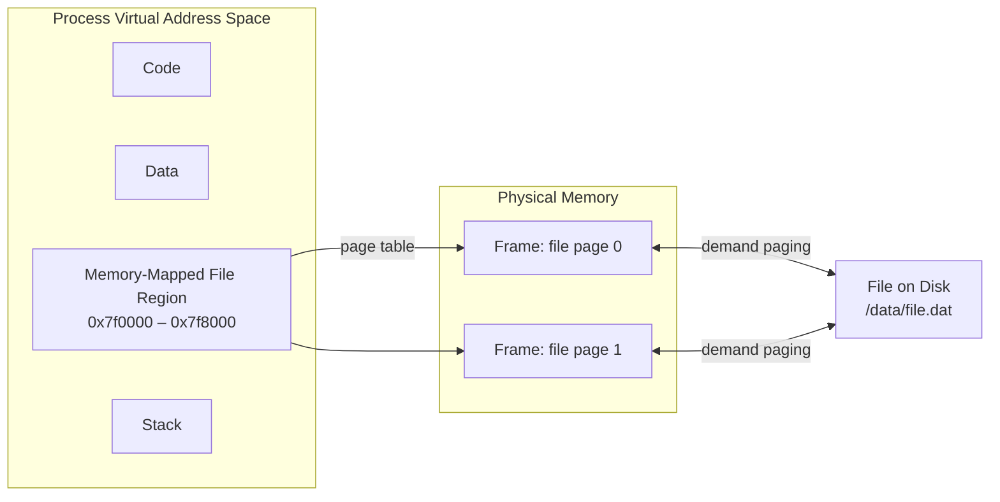

### Using mmap in C

```c
#include <stdio.h>
#include <stdlib.h>
#include <fcntl.h>
#include <sys/mman.h>
#include <sys/stat.h>
#include <unistd.h>

int main() {
    int fd = open("/etc/hostname", O_RDONLY);
    if (fd < 0) { perror("open"); return 1; }

    struct stat sb;
    fstat(fd, &sb);

    char *mapped = mmap(NULL, sb.st_size, PROT_READ, MAP_PRIVATE, fd, 0);
    if (mapped == MAP_FAILED) { perror("mmap"); return 1; }
    close(fd);

    // Access file contents as memory
    printf("File contents: %.*s", (int)sb.st_size, mapped);

    munmap(mapped, sb.st_size);
    return 0;
}
```

### mmap Benefits

| Benefit | Description |
|---------|-------------|
| **Zero-copy** | No data copying between kernel and user buffers |
| **Demand paging** | Only pages actually accessed are loaded |
| **Shared mapping** | Multiple processes can share the same physical pages |
| **Lazy loading** | Large files don't need to be fully read upfront |
| **Kernel cache** | Uses the page cache, integrating with the OS buffer management |

### mmap Flags

| Flag | Purpose |
|------|---------|
| `MAP_SHARED` | Changes are visible to other processes and written to file |
| `MAP_PRIVATE` | Copy-on-write; changes are private to this process |
| `MAP_ANONYMOUS` | Not backed by a file (used for memory allocation) |
| `MAP_HUGETLB` | Use huge pages |
| `MAP_FIXED` | Map at a specific address |

---

## Swap Space Management

**Swap space** is disk storage used as an extension of physical RAM. When the OS evicts a page from RAM, it writes it to swap; when that page is needed again, it's read back.

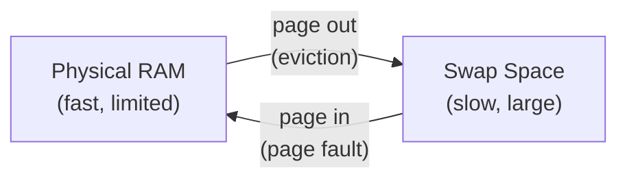

### Swap Configuration on Linux

```bash
# View swap status
swapon --show
# NAME       TYPE  SIZE  USED  PRIO
# /dev/sda3  partition  8G  500M   -2
# /swapfile  file       4G    0B   -3

# View swap usage
free -h
#               total   used   free  shared  buff/cache  available
# Mem:          16Gi   8.0Gi   2.0Gi   500Mi    6.0Gi     7.5Gi
# Swap:         12Gi   500Mi   11.5Gi

# Create a swap file
sudo fallocate -l 4G /swapfile
sudo chmod 600 /swapfile
sudo mkswap /swapfile
sudo swapon /swapfile

# Make permanent (add to /etc/fstab)
echo '/swapfile none swap sw 0 0' | sudo tee -a /etc/fstab

# Control swap aggressiveness (0-100, lower = prefer RAM)
cat /proc/sys/vm/swappiness
# 60 (default)
sudo sysctl vm.swappiness=10
```

### Swap Space Allocation Strategies

| Strategy | Description | Used By |
|----------|-------------|---------|
| **Dedicated partition** | Entire partition for swap | Traditional Linux |
| **Swap file** | Regular file used as swap | Modern Linux, Windows (pagefile.sys) |
| **zswap / zram** | Compressed RAM before swapping to disk | Memory-constrained systems |
| **No swap** | Rely on OOM killer instead | Some servers, containers |

---

## OOM Killer in Linux

When the system runs out of both physical memory and swap, the Linux **OOM (Out of Memory) Killer** selects and kills processes to free memory.

### OOM Scoring

The kernel assigns each process an **OOM score** (0–1000). Higher score = more likely to be killed.

```bash
# View OOM score of a process
cat /proc/$$/oom_score
# 667

# View adjustable OOM score (-1000 to 1000)
cat /proc/$$/oom_score_adj
# 0

# Protect a critical process from OOM killer
echo -1000 | sudo tee /proc/$(pidof sshd)/oom_score_adj

# Make a process more likely to be killed
echo 500 | sudo tee /proc/$PID/oom_score_adj
```

### OOM Score Factors

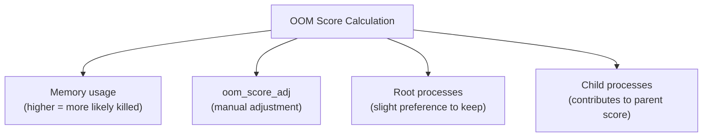

| Factor | Effect on Score |
|--------|----------------|
| High memory usage | Increases score |
| `oom_score_adj = -1000` | Process is immune to OOM |
| `oom_score_adj = 1000` | Process is killed first |
| Root-owned process | Slightly lower score |
| Many child processes | Higher score |

### OOM Events

```bash
# Check for OOM kills in system log
dmesg | grep -i "out of memory"
journalctl -k | grep -i oom

# Example OOM kill message:
# [  123.456789] Out of memory: Killed process 5678 (chrome)
#   total-vm:4500000kB, anon-rss:2000000kB, file-rss:100000kB

# Monitor OOM events in real time
sudo dmesg -w | grep -i oom
```

### Overcommit Settings

Linux can **overcommit** memory — allowing processes to request more virtual memory than is physically available, betting that not all of it will be used simultaneously.

```bash
# View overcommit policy
cat /proc/sys/vm/overcommit_memory
# 0 = Heuristic overcommit (default)
# 1 = Always overcommit (never refuse malloc)
# 2 = Strict — commit <= swap + ratio × RAM

# Overcommit ratio (used when overcommit_memory = 2)
cat /proc/sys/vm/overcommit_ratio
# 50 (meaning 50% of RAM)

# View committed memory
grep -i commit /proc/meminfo
# CommitLimit:    12345678 kB
# Committed_AS:    8765432 kB
```

---

## Summary: Complete Memory Management Flow

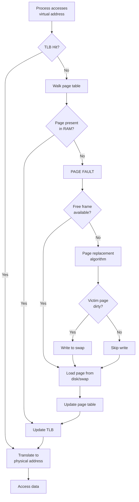

---

## Key Takeaways

1. **Page replacement** is necessary when physical memory is full and a page fault occurs. The OS must choose a **victim page** to evict, writing it to swap if it's dirty.

2. **FIFO** is simple but poor; **Optimal** is theoretically best but impractical; **LRU** approximates optimal well; the **Clock algorithm** provides a practical, efficient LRU approximation using reference bits.

3. **Thrashing** occurs when processes' memory demands exceed available RAM, causing constant page faults. The **working set model** and **page fault frequency** monitoring help prevent it.

4. **Memory-mapped files** (`mmap`) map file contents into virtual address space for zero-copy access, enabling demand paging and sharing of file data between processes.

5. **Swap space** extends physical memory to disk. Linux controls swap aggressiveness via the `swappiness` parameter and supports both swap partitions and swap files.

6. The **OOM killer** is Linux's last resort when memory is exhausted — it selects and kills processes based on their OOM score, which can be tuned via `oom_score_adj` to protect critical services.
