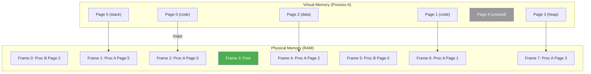
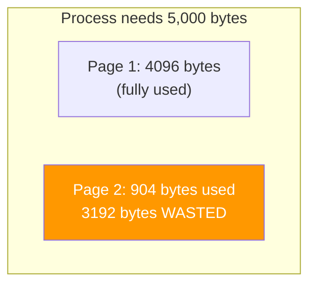
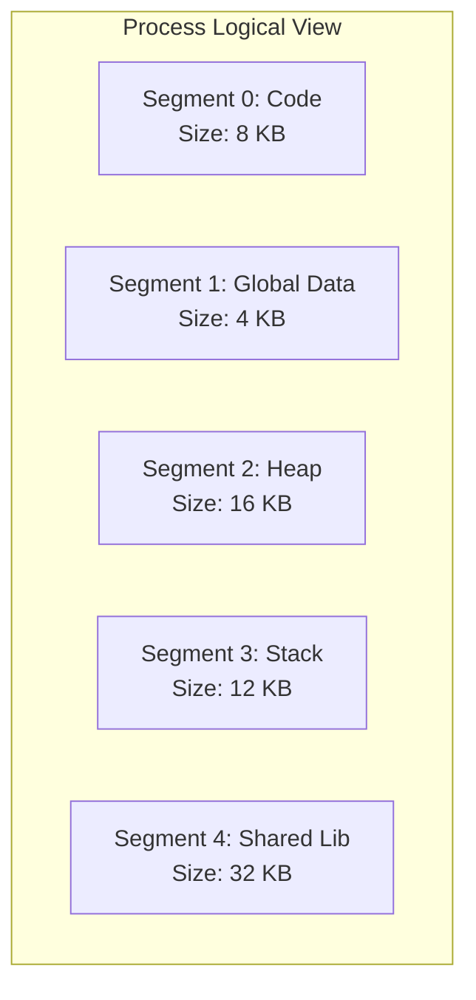
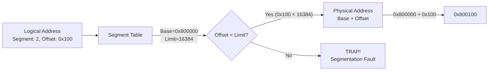
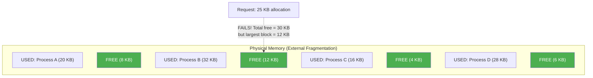
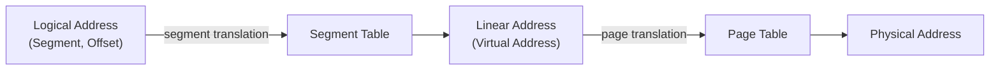
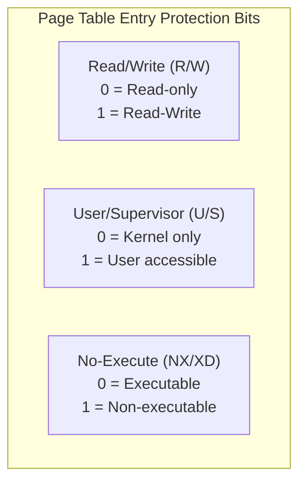
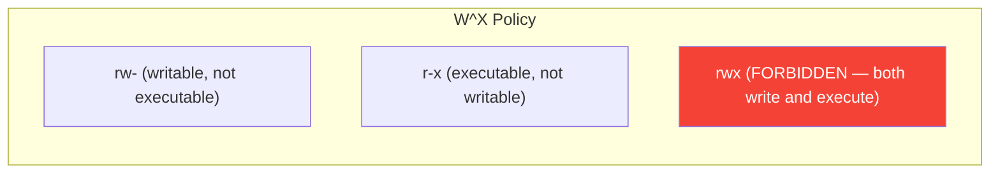

## Learning Objectives

By the end of this lesson, you will be able to:

- Explain paging in depth and how page tables map virtual to physical memory
- Understand page sizes and their trade-offs
- Differentiate between internal and external fragmentation
- Describe segmentation and how it divides memory by logical purpose
- Explain how segmentation and paging can work together
- Understand memory protection mechanisms at the page and segment level

## Prerequisites

- Understanding of virtual memory, address translation, and page tables
- Familiarity with process memory layout (text, data, heap, stack)

---

## Paging in Depth

**Paging** divides both virtual and physical memory into fixed-size blocks. Virtual blocks are called **pages** and physical blocks are called **frames**. The OS maps pages to frames using a page table.

### The Paging Model



Key observation: pages don't need to be contiguous in physical memory. The page table handles the mapping, so the process sees a contiguous address space while the OS can place frames anywhere.

### Address Translation Step-by-Step

Given: page size = 4 KB (2¹² bytes), 32-bit virtual address

```
Virtual address: 0x00004A3C

Step 1: Calculate page number and offset
  Page number = address / page_size = 0x4A3C / 0x1000 = 4
  Offset = address % page_size = 0x4A3C % 0x1000 = 0xA3C

  Binary: 0000 0000 0000 0000 0100 1010 0011 1100
          └── page number (20 bits) ──┘└ offset (12) ┘
          VPN = 0x00004                 Offset = 0xA3C

Step 2: Look up page table
  Page Table[4] = Frame 7, Valid=1, RW=1

Step 3: Form physical address
  Physical address = (Frame 7 × 4096) + 0xA3C
                   = 0x7000 + 0xA3C
                   = 0x00007A3C
```

```c
// Simulating address translation in code
#include <stdio.h>

#define PAGE_SIZE 4096  // 4 KB
#define OFFSET_BITS 12  // log2(4096)

unsigned int page_table[] = {5, 2, 8, 1, 7, 0, 3, 6};

unsigned int translate(unsigned int virtual_addr) {
    unsigned int vpn = virtual_addr >> OFFSET_BITS;
    unsigned int offset = virtual_addr & (PAGE_SIZE - 1);
    unsigned int frame = page_table[vpn];
    unsigned int physical_addr = (frame << OFFSET_BITS) | offset;

    printf("Virtual: 0x%08X → VPN: %u, Offset: 0x%03X → "
           "Frame: %u → Physical: 0x%08X\n",
           virtual_addr, vpn, offset, frame, physical_addr);

    return physical_addr;
}

int main() {
    translate(0x00004A3C);  // Page 4, Frame 7
    translate(0x00001234);  // Page 1, Frame 2
    translate(0x00000010);  // Page 0, Frame 5
    return 0;
}
```

---

## Page Sizes

The page size is a critical design parameter. Most systems use 4 KB as the default, but larger pages (huge pages) are available.

### Common Page Sizes

| Architecture | Standard | Large | Huge/Giant |
|-------------|----------|-------|------------|
| x86-64 | 4 KB | 2 MB | 1 GB |
| ARM (AArch64) | 4 KB, 16 KB, 64 KB | 2 MB, 32 MB | 1 GB |
| RISC-V | 4 KB | 2 MB | 1 GB |

### Small Pages vs Large Pages

| Factor | Small Pages (4 KB) | Huge Pages (2 MB) |
|--------|-------------------|-------------------|
| **Internal fragmentation** | Low (avg 2 KB waste) | High (avg 1 MB waste) |
| **Page table size** | Large (many entries) | Small (fewer entries) |
| **TLB coverage** | Low (4 KB × 1024 = 4 MB) | High (2 MB × 1024 = 2 GB) |
| **TLB misses** | More frequent | Less frequent |
| **Disk I/O granularity** | Small reads | Large reads |
| **Memory utilization** | Better for small allocations | Better for large allocations |

### Using Huge Pages on Linux

```bash
# Check current huge page configuration
cat /proc/meminfo | grep -i huge
# HugePages_Total:       0
# HugePages_Free:        0
# HugePages_Rsvd:        0
# Hugepagesize:       2048 kB

# Allocate huge pages
echo 100 | sudo tee /proc/sys/vm/nr_hugepages

# Transparent Huge Pages (THP) — automatic
cat /sys/kernel/mm/transparent_hugepage/enabled
# [always] madvise never

# Use huge pages in a program
#include <sys/mman.h>
void *ptr = mmap(NULL, 2 * 1024 * 1024,
                 PROT_READ | PROT_WRITE,
                 MAP_PRIVATE | MAP_ANONYMOUS | MAP_HUGETLB,
                 -1, 0);
```

---

## Internal Fragmentation

**Internal fragmentation** occurs when the allocated memory block is larger than what's actually needed. With paging, the last page of a process is rarely completely full.



**Average internal fragmentation per process:** half a page

| Page Size | Avg Waste per Process | Impact |
|-----------|----------------------|--------|
| 4 KB | ~2 KB | Negligible |
| 2 MB | ~1 MB | Significant for small processes |
| 1 GB | ~512 MB | Only for massive memory consumers |

This is why huge pages are only beneficial for applications with large memory footprints (databases, VMs, scientific computing).

---

## Segmentation

**Segmentation** divides a process's memory into variable-sized logical units called **segments**, each representing a meaningful part of the program.

### Logical Segments



### Segment Table

Each process has a **segment table** with entries specifying the base address and length of each segment:

| Segment | Base | Limit (Length) | Permissions |
|---------|------|----------------|-------------|
| 0 (Code) | 0x00400000 | 8192 | Read, Execute |
| 1 (Data) | 0x00600000 | 4096 | Read, Write |
| 2 (Heap) | 0x00800000 | 16384 | Read, Write |
| 3 (Stack) | 0x7FFF0000 | 12288 | Read, Write |
| 4 (Shared) | 0x7F000000 | 32768 | Read, Execute |

### Segment Address Translation

A segmented address has two parts: **segment number** and **offset**.



### Segmentation vs Paging

| Feature | Segmentation | Paging |
|---------|-------------|--------|
| **Unit size** | Variable (logical) | Fixed (e.g., 4 KB) |
| **Visible to programmer** | Yes (code, data, stack) | No (transparent) |
| **Internal fragmentation** | None | Yes (last page) |
| **External fragmentation** | Yes (variable sizes) | None |
| **Memory protection** | Per segment (logical) | Per page |
| **Sharing** | Share entire segments | Share individual pages |
| **Address format** | (segment, offset) | (page, offset) |

---

## External Fragmentation

**External fragmentation** is a problem specific to segmentation (and early memory allocation). It occurs when free memory is split into small, non-contiguous blocks that can't satisfy a large allocation request, even though total free memory is sufficient.



### Solutions to External Fragmentation

| Solution | Description | Drawback |
|----------|-------------|----------|
| **Compaction** | Move segments to create contiguous free space | Expensive, requires relocation |
| **Best Fit** | Allocate smallest sufficient block | Leaves tiny fragments |
| **First Fit** | Use first sufficient block | Fast but moderate fragmentation |
| **Buddy System** | Split memory in powers of 2 | Some internal fragmentation |
| **Paging** | Use fixed-size pages (eliminates the problem entirely) | Internal fragmentation instead |

### Why Paging Won

Paging eliminates external fragmentation entirely because every frame is the same size and interchangeable. This is the primary reason modern systems use paging (not segmentation) as the primary memory management scheme.

---

## Segmentation with Paging

Some architectures combine both: use **segmentation** for logical structure and **paging** within each segment. This was the approach in Intel's IA-32 (x86 32-bit) architecture.

### Two-Level Translation



### x86 Segmentation (Historical)

In x86 protected mode, segment registers (CS, DS, SS, ES, FS, GS) point to entries in the **Global Descriptor Table (GDT)** or **Local Descriptor Table (LDT)**.

```
Segment Descriptor (8 bytes):
┌──────────┬──────┬───────┬──────┬──────────┬─────────┐
│ Base Addr│Limit │ Type  │ DPL  │ Granularity │ Present │
│ (32 bits)│(20b) │(4 bits)│(2b) │  (1 bit)   │ (1 bit) │
└──────────┴──────┴───────┴──────┴──────────┴─────────┘
```

### Modern x86-64: Flat Segmentation

In x86-64 (long mode), segmentation is **essentially disabled**. All segment bases are forced to 0 and limits to maximum, creating a flat address space. Only paging is used for memory management.

```bash
# On Linux x86-64, segments are flat (base=0, limit=max)
# Segmentation is vestigial — only FS and GS segments are used
# (for thread-local storage and per-CPU data)

# View GDT entries (requires kernel debug tools)
# FS is used for thread-local storage (TLS)
# GS is used for per-CPU kernel data

# Check segment registers
# (In GDB)
# (gdb) info registers
# cs  0x33  51
# ss  0x2b  43
# ds  0x0   0
# es  0x0   0
# fs  0x0   0    (base set via arch_prctl)
# gs  0x0   0
```

---

## Memory Protection

Both paging and segmentation provide mechanisms for **memory protection** — controlling what operations processes can perform on memory regions.

### Page-Level Protection

Each page table entry includes protection bits:



### Protection in Practice

```bash
# View memory permissions for a process
cat /proc/self/maps
# Address range          Perms  Offset   Dev   Inode  Pathname
# 5555555000-5555557000  r--p   00000000 08:02 12345  /usr/bin/bash
# 5555557000-5555620000  r-xp   00002000 08:02 12345  /usr/bin/bash
# 5555620000-5555660000  r--p   000cb000 08:02 12345  /usr/bin/bash
# 5555660000-5555664000  rw-p   00000000 00:00 0      [heap]
# 7fffffffde000-7ffffffff000  rw-p 00000000 00:00 0   [stack]

# Permission flags:
# r = readable
# w = writable
# x = executable
# p = private (copy-on-write)
# s = shared
```

| Memory Region | Read | Write | Execute | Why |
|--------------|------|-------|---------|-----|
| Code (.text) | Yes | No | Yes | Prevent code modification |
| Read-only data (.rodata) | Yes | No | No | Constants shouldn't change |
| Data (.data, .bss) | Yes | Yes | No | W^X: writable OR executable, not both |
| Heap | Yes | Yes | No | Prevent code injection |
| Stack | Yes | Yes | No | Prevent stack-based exploits |

### W^X (Write XOR Execute)

Modern security requires that memory is either **writable** or **executable**, never both. This prevents attackers from injecting executable code into writable memory.



### DEP / NX Bit

**Data Execution Prevention (DEP)** uses the NX (No-Execute) bit in page table entries to mark data pages as non-executable:

```bash
# Check if NX bit is supported and enabled
grep -o 'nx' /proc/cpuinfo | head -1
# nx

# Check DEP status
dmesg | grep -i "NX"
# NX (Execute Disable) protection: active
```

### Address Space Layout Randomization (ASLR)

**ASLR** randomizes the base addresses of code, stack, heap, and libraries each time a program runs, making it harder for attackers to predict addresses:

```bash
# Check ASLR status
cat /proc/sys/kernel/randomize_va_space
# 0 = disabled
# 1 = stack, mmap, VDSO randomized
# 2 = full randomization (stack, mmap, VDSO, heap)

# Demonstrate ASLR — run twice and compare addresses
cat /proc/self/maps | grep stack
# First run:  7ffc12340000-7ffc12361000
# Second run: 7ffd98760000-7ffd98781000  (different!)
```

---

## Practical: Memory Layout Exploration

```bash
# Examine a process's full memory map
pmap -x $$ | head -30

# Output:
# Address           Kbytes   RSS   Dirty Mode  Mapping
# 000055b7a0000000      12    12       0 r--   bash
# 000055b7a0003000     800   800       0 r-x   bash
# 000055b7a00ca000     200   160       0 r--   bash
# 000055b7a00fb000      16    16      16 rw-   bash
# 000055b7a1200000    1600  1200    1200 rw-   [heap]
# 00007f8bc0000000     132    16      16 rw-   [anon]
# 00007ffca8000000     132    32      32 rw-   [stack]

# Total memory usage
pmap -x $$ | tail -1
# total          12345  5678    1234

# View memory statistics
cat /proc/meminfo | head -10

# Check page size
getconf PAGESIZE

# View transparent huge pages usage for a process
grep -i huge /proc/$$/smaps_rollup 2>/dev/null
```

---

## Key Takeaways

1. **Paging** divides memory into fixed-size pages and frames, providing a clean mapping between virtual and physical memory without external fragmentation.

2. **Page sizes** involve trade-offs: smaller pages (4 KB) minimize internal fragmentation but require larger page tables and more TLB entries, while huge pages (2 MB, 1 GB) improve TLB coverage for large-memory workloads.

3. **Internal fragmentation** (wasted space within the last page) is paging's cost — averaging half a page per process. **External fragmentation** (scattered free blocks) is segmentation's cost.

4. **Segmentation** organizes memory by logical purpose (code, data, stack) with variable-sized segments. Modern x86-64 uses a flat segmentation model where paging handles all memory management.

5. **Memory protection** is enforced through page table entry bits (R/W, User/Supervisor, NX) implementing policies like W^X and DEP to prevent code injection attacks.

6. **ASLR** randomizes memory layout addresses at each program execution, complementing page-level protection to defend against memory exploitation attacks.
