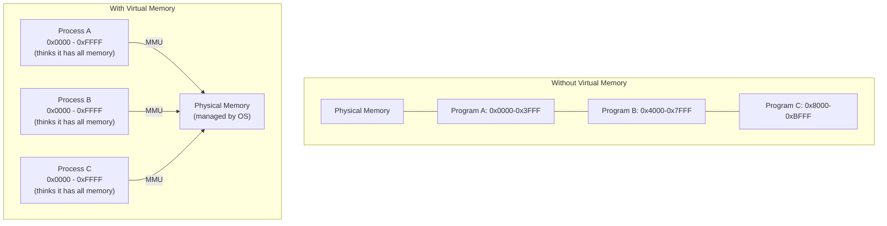
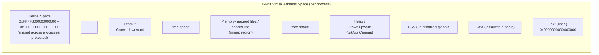
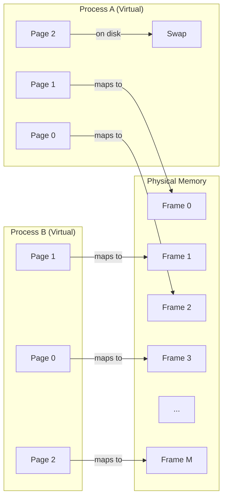
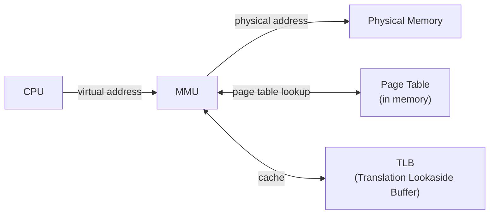
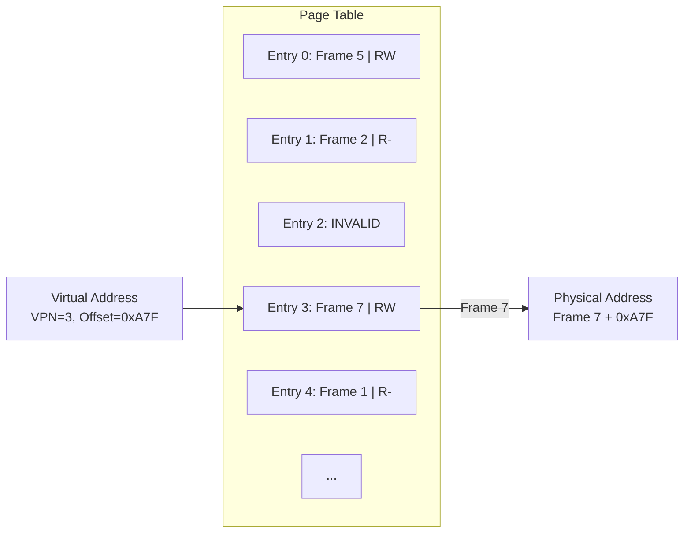
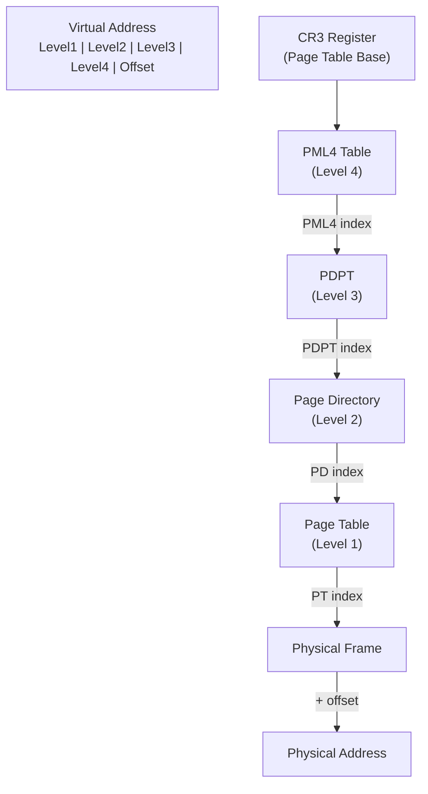
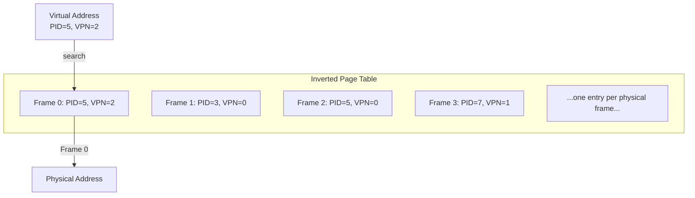
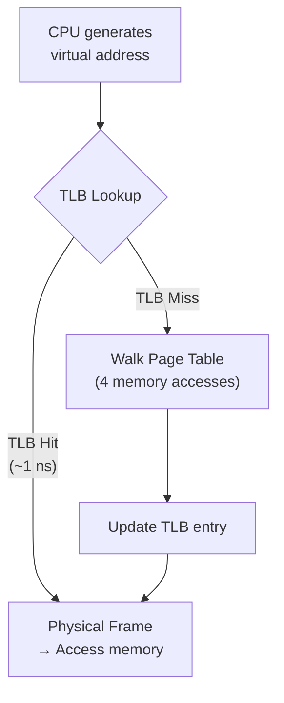
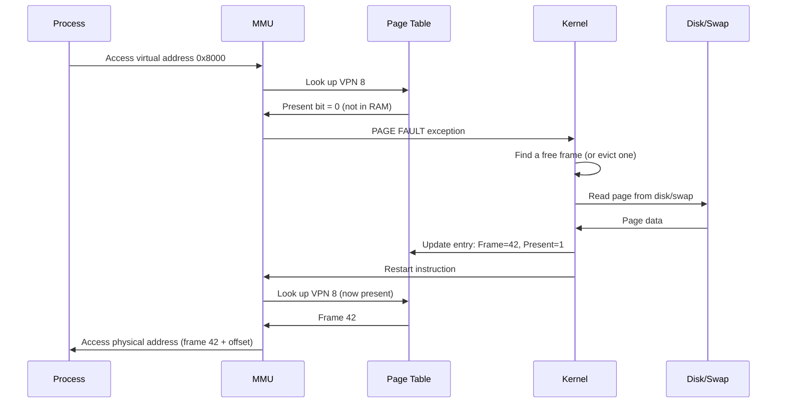

## Learning Objectives

By the end of this lesson, you will be able to:

- Explain the concept of virtual memory and why it's necessary
- Distinguish between virtual and physical address spaces
- Describe how the MMU translates virtual addresses to physical addresses
- Understand page table structures: single-level, multi-level, and inverted
- Explain the role of the TLB in speeding up address translation
- Describe demand paging and page fault handling

## Prerequisites

- Understanding of processes and their memory layout
- Basic knowledge of computer architecture (CPU, memory hierarchy)
- Familiarity with binary and hexadecimal notation

---

## Why Virtual Memory?

In early computers, programs accessed **physical memory** directly. This created severe problems:

1. **No isolation** — One program could overwrite another's data
2. **Limited size** — Programs were limited to physical RAM
3. **No relocation** — Programs had to be compiled for specific memory addresses
4. **Fragmentation** — Memory became fragmented as programs loaded and unloaded

**Virtual memory** solves all of these by giving each process its own private, contiguous address space that's independent of physical memory.



### Benefits of Virtual Memory

| Benefit | Description |
|---------|-------------|
| **Isolation** | Each process has its own address space; cannot access others' memory |
| **Larger than RAM** | Programs can use more memory than physically available (swap to disk) |
| **Simplicity** | Every process sees a contiguous address space starting at 0 |
| **Sharing** | Multiple processes can share the same physical pages (libraries, COW) |
| **Protection** | Pages can be marked read-only, no-execute, etc. |

---

## Address Spaces

### Virtual Address Space

Each process has its own **virtual address space** — a contiguous range of addresses from 0 to some maximum (e.g., 0 to 2⁴⁸-1 on x86-64).



### Physical Address Space

The **physical address space** corresponds to actual RAM chips. Its size depends on installed memory and the CPU's address bus width.



### Address Translation Overview

| Concept | Virtual | Physical |
|---------|---------|----------|
| Basic unit | **Page** (e.g., 4 KB) | **Frame** (same size as page) |
| Numbering | Virtual Page Number (VPN) | Physical Frame Number (PFN) |
| Address | VPN + offset | PFN + offset |
| Size | Fixed per process (e.g., 48-bit = 256 TB) | Actual installed RAM |

---

## The Memory Management Unit (MMU)

The **MMU** is a hardware component (integrated into the CPU) that translates virtual addresses to physical addresses on every memory access.



### How Address Translation Works

A virtual address is split into two parts:

```
Virtual Address (e.g., 32-bit with 4KB pages):
┌────────────────────┬──────────────┐
│  Virtual Page Number│    Offset    │
│      (20 bits)      │  (12 bits)  │
└────────────────────┴──────────────┘

Physical Address:
┌────────────────────┬──────────────┐
│ Physical Frame Num  │    Offset    │
│      (20 bits)      │  (12 bits)  │
└────────────────────┴──────────────┘
```

The **offset** stays the same — only the page/frame number changes.

### Translation Example

```
Page size: 4 KB = 4096 bytes = 2^12
Virtual address: 0x00003A7F

Step 1: Split into VPN and offset
  Binary: 0000 0000 0000 0000 0011 1010 0111 1111
  VPN:    0000 0000 0000 0000 0011 = 0x3 (page 3)
  Offset: 1010 0111 1111                = 0xA7F

Step 2: Look up VPN 3 in page table → Frame 7

Step 3: Physical address = Frame 7 + offset 0xA7F
  Physical: 0x00007A7F
```

---

## Page Tables

The **page table** is a per-process data structure mapping virtual page numbers to physical frame numbers. It's stored in main memory and managed by the OS.

### Single-Level Page Table

The simplest design: one entry per virtual page.



### Page Table Entry (PTE) Format

| Field | Bits | Purpose |
|-------|------|---------|
| **Present/Valid** | 1 | Is this page in physical memory? |
| **Frame Number** | 20+ | Physical frame address |
| **Read/Write** | 1 | Write permission |
| **User/Supervisor** | 1 | User-mode access allowed? |
| **Accessed** | 1 | Has this page been read? (set by hardware) |
| **Dirty** | 1 | Has this page been written to? |
| **No-Execute (NX)** | 1 | Prevent code execution from this page |
| **Cache Disable** | 1 | Disable caching for this page |

### Problem: Page Table Size

For a 32-bit address space with 4 KB pages:
- Number of pages: 2³² / 2¹² = 2²⁰ = 1,048,576 entries
- Each entry: ~4 bytes
- **Total: 4 MB per process** — manageable

For a 64-bit address space (48 usable bits) with 4 KB pages:
- Number of pages: 2⁴⁸ / 2¹² = 2³⁶ = ~68 billion entries
- **Total: 256 TB per process** — impossible!

### Multi-Level Page Tables

The solution is to **hierarchically** organize the page table. Only allocate table entries for the address ranges actually used by the process.



### x86-64 Four-Level Page Table

On x86-64, Linux uses a 4-level (or 5-level with LA57) page table:

```
48-bit Virtual Address breakdown:
┌────────┬────────┬────────┬────────┬──────────┐
│ PML4   │ PDPT   │  PD    │  PT    │  Offset  │
│ 9 bits │ 9 bits │ 9 bits │ 9 bits │ 12 bits  │
└────────┴────────┴────────┴────────┴──────────┘
 Bits     Bits     Bits     Bits     Bits
 47-39    38-30    29-21    20-12    11-0
```

Each level has 2⁹ = 512 entries, and each entry is 8 bytes.

| Level | Name | Entries | Purpose |
|-------|------|---------|---------|
| 4 | PML4 (Page Map Level 4) | 512 | Top-level directory |
| 3 | PDPT (Page Directory Pointer Table) | 512 per PML4 entry | Second-level |
| 2 | PD (Page Directory) | 512 per PDPT entry | Third-level |
| 1 | PT (Page Table) | 512 per PD entry | Points to physical frames |

### Inverted Page Table

Instead of one entry per virtual page, an **inverted page table** has one entry per physical frame. It stores which process and virtual page maps to each frame.



**Advantage:** Fixed size regardless of virtual address space size
**Disadvantage:** Searching is slow (hash table needed), no easy sharing

---

## Translation Lookaside Buffer (TLB)

Walking a 4-level page table requires **four memory accesses** before reaching the data — a huge performance penalty. The **TLB** is a small, fast hardware cache of recent page table translations.



### TLB Characteristics

| Property | Typical Value |
|----------|--------------|
| Size | 64–1024 entries |
| Access time | ~1 ns (1 cycle) |
| Hit rate | 95–99% |
| Associativity | Fully or set-associative |
| Miss penalty | ~100 ns (page table walk) |

### TLB in Action

```
Address translation timeline:

TLB Hit (common case):
  CPU → TLB → Physical address → Memory
  Total: ~1 ns + memory access

TLB Miss:
  CPU → TLB (miss) → PML4 → PDPT → PD → PT → Physical address
  Total: ~100 ns + memory access

Page Fault (page not in RAM):
  CPU → TLB (miss) → PT → Not present! → Trap to kernel → Load from disk
  Total: ~10 ms (disk) or ~100 μs (SSD)
```

### TLB Management

```bash
# View TLB statistics (via perf)
sudo perf stat -e dTLB-loads,dTLB-load-misses,iTLB-loads,iTLB-load-misses \
    ls /usr/bin

# Example output:
#    1,234,567  dTLB-loads
#        5,678  dTLB-load-misses  # 0.46% of all dTLB loads
#      234,567  iTLB-loads
#          123  iTLB-load-misses  # 0.05% of all iTLB loads
```

Context switches are expensive partly because they often flush the TLB (since each process has different page tables). Modern CPUs support **ASID/PCID** (Address Space ID / Process Context ID) to tag TLB entries by process, avoiding full flushes.

---

## Demand Paging

**Demand paging** means pages are loaded into physical memory only when they're actually accessed — not when the program starts. This reduces memory usage and speeds up program startup.



### Page Fault Types

| Type | Description | Cost |
|------|-------------|------|
| **Minor (soft) fault** | Page is in memory but not mapped (e.g., shared library already loaded by another process) | ~μs |
| **Major (hard) fault** | Page must be read from disk | ~ms (HDD) or ~100 μs (SSD) |
| **Invalid fault** | Access to unmapped/illegal address | SIGSEGV (process killed) |

```bash
# View page fault statistics for a command
/usr/bin/time -v ls /tmp 2>&1 | grep "page faults"
# Minor (reclaiming a frame): 150
# Major (requiring I/O): 0

# View page faults for a running process
cat /proc/$$/stat | awk '{print "Minor faults:", $10, "Major faults:", $12}'

# System-wide page fault rate
vmstat 1 5
#  procs ---memory--- ---swap-- ---io--- -system-- ---cpu---
#  r  b   si   so    bi    bo   in   cs   us sy id wa
#  0  0    0    0     0     0   100  200   1  1 98  0
#                     ↑    ↑
#               pages in  pages out (swap)
```

---

## Viewing Virtual Memory on Linux

```bash
# Virtual memory statistics
vmstat -s

# Process address space
cat /proc/$$/maps | head -20
# 5600a0000000-5600a0002000 r--p 00000000 08:02 1234  /usr/bin/bash
# 5600a0002000-5600a0100000 r-xp 00002000 08:02 1234  /usr/bin/bash
# 5600a0100000-5600a0140000 r--p 00100000 08:02 1234  /usr/bin/bash
# 7f0c80000000-7f0c80200000 rw-p 00000000 00:00 0
# 7ffd3c000000-7ffd3c021000 rw-p 00000000 00:00 0     [stack]

# Detailed memory map
pmap -x $$

# Huge pages info
cat /proc/meminfo | grep -i huge

# Page size
getconf PAGESIZE
# 4096

# Total virtual and physical memory
free -h
```

---

## Key Takeaways

1. **Virtual memory** gives each process its own private, contiguous address space, solving the problems of isolation, limited RAM, fragmentation, and relocation that plagued direct physical memory access.

2. The **MMU** translates virtual addresses to physical addresses in hardware. A virtual address is split into a **Virtual Page Number** (VPN) and an **offset**, with the VPN looked up in the page table to find the corresponding physical frame.

3. **Multi-level page tables** (4 levels on x86-64) solve the space problem of flat page tables by only allocating table entries for address ranges actually in use.

4. The **TLB** is a fast hardware cache of recent translations with 95-99% hit rates, avoiding the costly 4-level page table walk on most memory accesses.

5. **Demand paging** loads pages into physical memory only when accessed, triggering page faults that the kernel handles by reading from disk and updating page tables.

6. Page faults are categorized as **minor** (page already in memory, just needs mapping), **major** (page must be read from disk), or **invalid** (illegal access causing SIGSEGV).
