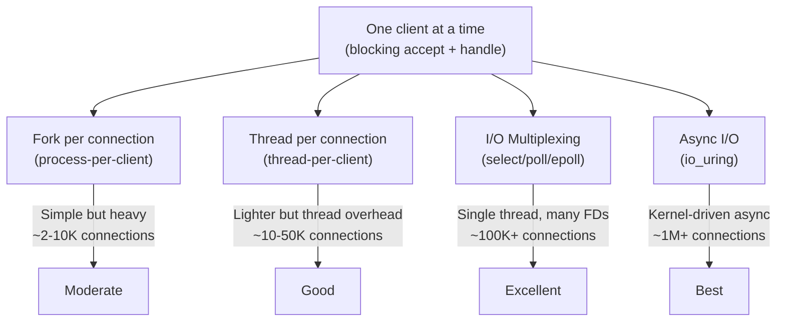
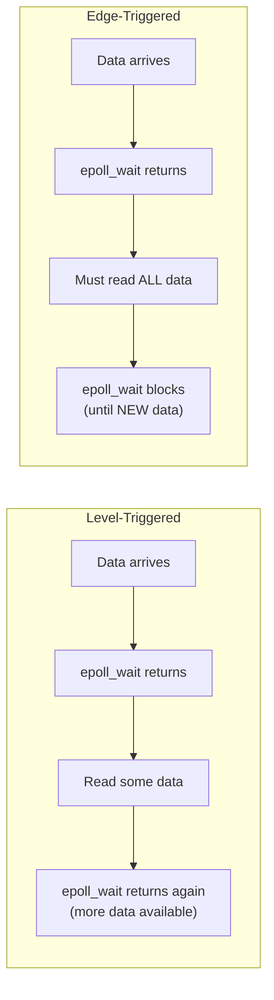
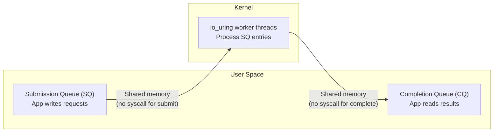
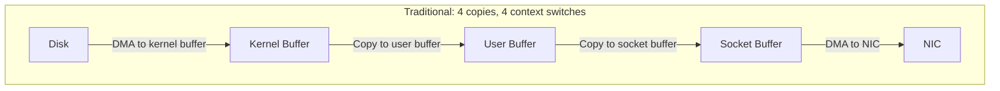
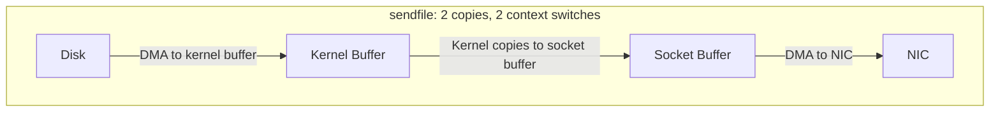
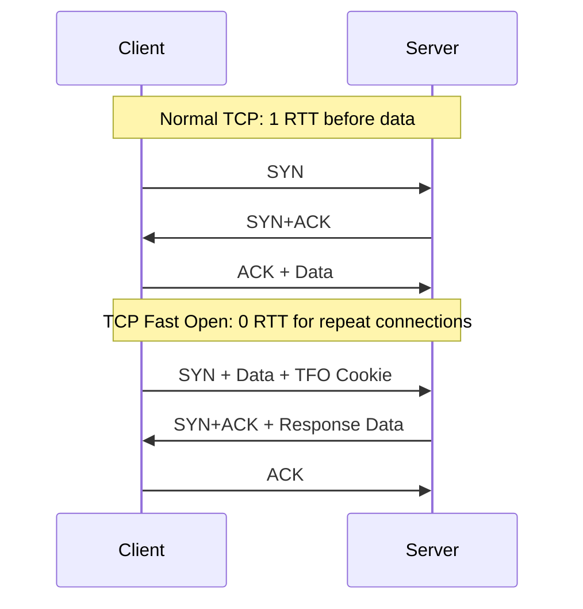
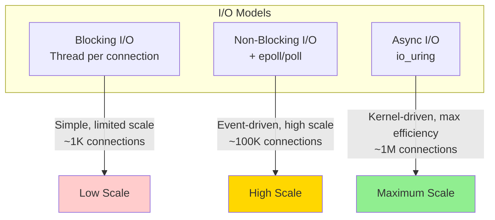

## Learning Objectives

By the end of this lesson, you will be able to:

- Design client-server applications using the Berkeley sockets API
- Implement I/O multiplexing with select, poll, and epoll
- Compare blocking, non-blocking, and asynchronous I/O models
- Use io_uring for modern high-performance async I/O
- Apply zero-copy techniques (sendfile, splice) to reduce data copying overhead
- Tune network performance through buffer sizes and TCP parameter tuning

## Prerequisites

- Socket programming basics (socket, bind, listen, accept, connect)
- TCP/IP protocols and Linux network stack
- C programming with system call usage

---

## Berkeley Sockets API

The **Berkeley sockets API** (BSD sockets) is the standard POSIX interface for network programming. Virtually all network applications use it, either directly or through higher-level wrappers.

### Complete TCP Server Pattern

```c
#include <stdio.h>
#include <stdlib.h>
#include <string.h>
#include <unistd.h>
#include <errno.h>
#include <sys/socket.h>
#include <netinet/in.h>
#include <signal.h>

#define PORT 8080
#define MAX_EVENTS 1024

volatile sig_atomic_t running = 1;
void handle_signal(int sig) { running = 0; }

int create_server(int port) {
    int fd = socket(AF_INET, SOCK_STREAM, 0);
    if (fd < 0) { perror("socket"); exit(1); }

    int opt = 1;
    setsockopt(fd, SOL_SOCKET, SO_REUSEADDR, &opt, sizeof(opt));
    setsockopt(fd, SOL_SOCKET, SO_REUSEPORT, &opt, sizeof(opt));

    struct sockaddr_in addr = {
        .sin_family = AF_INET,
        .sin_addr.s_addr = INADDR_ANY,
        .sin_port = htons(port)
    };

    if (bind(fd, (struct sockaddr *)&addr, sizeof(addr)) < 0) {
        perror("bind"); exit(1);
    }
    if (listen(fd, SOMAXCONN) < 0) {
        perror("listen"); exit(1);
    }

    return fd;
}

void handle_client(int client_fd) {
    char buf[4096];
    ssize_t n;
    while ((n = read(client_fd, buf, sizeof(buf))) > 0) {
        write(client_fd, buf, n);  // Echo back
    }
    close(client_fd);
}

int main() {
    signal(SIGINT, handle_signal);
    int server_fd = create_server(PORT);
    printf("Echo server on port %d\n", PORT);

    while (running) {
        int client_fd = accept(server_fd, NULL, NULL);
        if (client_fd < 0) {
            if (errno == EINTR) continue;
            perror("accept");
            break;
        }
        handle_client(client_fd);  // Blocking: one client at a time
    }

    close(server_fd);
    return 0;
}
```

### The Concurrency Problem

The server above handles **one client at a time**. While serving one client, all others wait. Solutions:



### Fork-per-Connection

```c
while (running) {
    int client_fd = accept(server_fd, NULL, NULL);
    pid_t pid = fork();
    if (pid == 0) {
        close(server_fd);        // Child doesn't need listener
        handle_client(client_fd);
        exit(0);
    }
    close(client_fd);            // Parent doesn't need client
}
```

### Thread-per-Connection

```c
#include <pthread.h>

void *thread_handler(void *arg) {
    int client_fd = *(int *)arg;
    free(arg);
    handle_client(client_fd);
    return NULL;
}

while (running) {
    int client_fd = accept(server_fd, NULL, NULL);
    int *fd_ptr = malloc(sizeof(int));
    *fd_ptr = client_fd;

    pthread_t tid;
    pthread_create(&tid, NULL, thread_handler, fd_ptr);
    pthread_detach(tid);  // Auto-cleanup
}
```

---

## I/O Multiplexing

I/O multiplexing lets a **single thread** monitor multiple file descriptors and react when any becomes ready.

### select()

The oldest multiplexing API. Uses bitmap sets:

```c
#include <sys/select.h>

fd_set read_fds;
FD_ZERO(&read_fds);
FD_SET(server_fd, &read_fds);
int max_fd = server_fd;

// Also add all client fds
for (int i = 0; i < num_clients; i++) {
    FD_SET(clients[i], &read_fds);
    if (clients[i] > max_fd) max_fd = clients[i];
}

struct timeval timeout = {.tv_sec = 5, .tv_usec = 0};

int ready = select(max_fd + 1, &read_fds, NULL, NULL, &timeout);
if (ready > 0) {
    if (FD_ISSET(server_fd, &read_fds)) {
        // New connection
        int client = accept(server_fd, NULL, NULL);
    }
    for (int i = 0; i < num_clients; i++) {
        if (FD_ISSET(clients[i], &read_fds)) {
            // Data available on client
            handle_data(clients[i]);
        }
    }
}
```

**Limitations of select**:
- FD_SETSIZE limit (typically 1024)
- O(n) scan of all file descriptors on every call
- Must rebuild fd_set every time

### poll()

Removes the fd limit and uses a cleaner API:

```c
#include <poll.h>

#define MAX_FDS 10000

struct pollfd fds[MAX_FDS];
int nfds = 0;

// Add server socket
fds[nfds].fd = server_fd;
fds[nfds].events = POLLIN;
nfds++;

while (running) {
    int ready = poll(fds, nfds, 5000);  // 5s timeout

    for (int i = 0; i < nfds && ready > 0; i++) {
        if (fds[i].revents == 0) continue;
        ready--;

        if (fds[i].fd == server_fd) {
            // Accept new connection
            int client = accept(server_fd, NULL, NULL);
            fds[nfds].fd = client;
            fds[nfds].events = POLLIN;
            nfds++;
        } else if (fds[i].revents & POLLIN) {
            // Handle client data
            char buf[4096];
            ssize_t n = read(fds[i].fd, buf, sizeof(buf));
            if (n <= 0) {
                close(fds[i].fd);
                fds[i] = fds[--nfds];  // Remove from array
            } else {
                write(fds[i].fd, buf, n);  // Echo
            }
        }
    }
}
```

**Still O(n)** — the kernel scans all fds on every call.

### epoll (Linux-Specific, O(1) for Ready Events)

**epoll** is the most efficient multiplexing API on Linux. It uses a kernel-side interest list and returns only the ready file descriptors:

```c
#include <sys/epoll.h>
#include <fcntl.h>

void set_nonblocking(int fd) {
    int flags = fcntl(fd, F_GETFL, 0);
    fcntl(fd, F_SETFL, flags | O_NONBLOCK);
}

int main() {
    int server_fd = create_server(PORT);
    set_nonblocking(server_fd);

    int epfd = epoll_create1(0);

    struct epoll_event ev = {
        .events = EPOLLIN,
        .data.fd = server_fd
    };
    epoll_ctl(epfd, EPOLL_CTL_ADD, server_fd, &ev);

    struct epoll_event events[MAX_EVENTS];

    while (running) {
        int nready = epoll_wait(epfd, events, MAX_EVENTS, -1);

        for (int i = 0; i < nready; i++) {
            if (events[i].data.fd == server_fd) {
                // Accept all pending connections
                while (1) {
                    int client = accept(server_fd, NULL, NULL);
                    if (client < 0) break;
                    set_nonblocking(client);

                    struct epoll_event cev = {
                        .events = EPOLLIN | EPOLLET,  // Edge-triggered
                        .data.fd = client
                    };
                    epoll_ctl(epfd, EPOLL_CTL_ADD, client, &cev);
                }
            } else {
                // Handle client data
                char buf[4096];
                ssize_t n = read(events[i].data.fd, buf, sizeof(buf));
                if (n <= 0) {
                    epoll_ctl(epfd, EPOLL_CTL_DEL,
                              events[i].data.fd, NULL);
                    close(events[i].data.fd);
                } else {
                    write(events[i].data.fd, buf, n);
                }
            }
        }
    }

    close(epfd);
    close(server_fd);
    return 0;
}
```

### Level-Triggered vs Edge-Triggered

| Mode | Behavior | Use Pattern |
|------|----------|-------------|
| **Level-triggered** (default) | Notifies as long as fd is ready | Can read/write in chunks |
| **Edge-triggered** (`EPOLLET`) | Notifies only on state change | Must drain all data per notification |



### Multiplexing API Comparison

| Feature | select | poll | epoll |
|---------|--------|------|-------|
| Max FDs | 1024 (FD_SETSIZE) | No limit | No limit |
| Per-call overhead | O(n) | O(n) | O(ready) |
| Kernel implementation | Scan all FDs | Scan all FDs | Callback-based |
| Thread-safe | ❌ | ❌ | ✅ |
| Edge-triggered | ❌ | ❌ | ✅ |
| Portability | All POSIX | All POSIX | Linux only |
| Typical scale | < 100 FDs | < 10K FDs | > 100K FDs |

---

## Non-Blocking I/O

Non-blocking I/O returns immediately even if the operation can't complete:

```c
#include <fcntl.h>
#include <errno.h>

// Set socket to non-blocking
int flags = fcntl(sock, F_GETFL, 0);
fcntl(sock, F_SETFL, flags | O_NONBLOCK);

// Non-blocking read
ssize_t n = read(sock, buf, sizeof(buf));
if (n > 0) {
    // Data available
} else if (n == 0) {
    // Connection closed
} else if (errno == EAGAIN || errno == EWOULDBLOCK) {
    // No data available right now — try again later
} else {
    // Actual error
    perror("read");
}

// Non-blocking connect
int ret = connect(sock, addr, addrlen);
if (ret < 0 && errno == EINPROGRESS) {
    // Connection in progress — use epoll to wait for completion
    struct epoll_event ev = {.events = EPOLLOUT, .data.fd = sock};
    epoll_ctl(epfd, EPOLL_CTL_ADD, sock, &ev);
}
```

---

## io_uring: Modern Async I/O

**io_uring** (Linux 5.1+) is a high-performance async I/O interface that avoids system call overhead using shared ring buffers between user space and kernel:



### io_uring Advantages Over epoll

| Feature | epoll + read/write | io_uring |
|---------|-------------------|----------|
| Syscalls per I/O | 2 (epoll_wait + read) | 0 (batched, polled) |
| Data copying | Kernel ↔ user buffer | Can use fixed buffers |
| Completion model | Readiness (you check) | Completion (kernel tells you) |
| File I/O | Separate API (AIO) | Unified (files + sockets) |

### Using liburing (Helper Library)

```c
#include <liburing.h>
#include <stdio.h>
#include <string.h>
#include <unistd.h>
#include <fcntl.h>

#define QUEUE_DEPTH 256
#define BUF_SIZE 4096

int main() {
    struct io_uring ring;
    io_uring_queue_init(QUEUE_DEPTH, &ring, 0);

    // Read a file asynchronously
    int fd = open("data.txt", O_RDONLY);
    char buf[BUF_SIZE];

    // Submit a read request
    struct io_uring_sqe *sqe = io_uring_get_sqe(&ring);
    io_uring_prep_read(sqe, fd, buf, BUF_SIZE, 0);
    sqe->user_data = 42;  // Tag for identification

    io_uring_submit(&ring);

    // Wait for completion
    struct io_uring_cqe *cqe;
    io_uring_wait_cqe(&ring, &cqe);

    if (cqe->res > 0) {
        printf("Read %d bytes (tag=%lld)\n", cqe->res, cqe->user_data);
        write(STDOUT_FILENO, buf, cqe->res);
    }

    io_uring_cqe_seen(&ring, cqe);
    io_uring_queue_exit(&ring);
    close(fd);
    return 0;
}
```

### io_uring for Networking

```c
// Accept connections via io_uring
struct io_uring_sqe *sqe = io_uring_get_sqe(&ring);
io_uring_prep_accept(sqe, server_fd, NULL, NULL, 0);
sqe->user_data = ACCEPT_EVENT;
io_uring_submit(&ring);

// Send data via io_uring
sqe = io_uring_get_sqe(&ring);
io_uring_prep_send(sqe, client_fd, buf, len, 0);
sqe->user_data = SEND_EVENT;
io_uring_submit(&ring);

// Receive data via io_uring
sqe = io_uring_get_sqe(&ring);
io_uring_prep_recv(sqe, client_fd, buf, BUF_SIZE, 0);
sqe->user_data = RECV_EVENT;
io_uring_submit(&ring);
```

---

## Zero-Copy Networking

Traditional data transfer copies data multiple times:



### sendfile(): 2 Copies

```c
#include <sys/sendfile.h>

// Serve a static file over a socket — zero copy to user space
int file_fd = open("index.html", O_RDONLY);
struct stat st;
fstat(file_fd, &st);

// Data goes directly from kernel file buffer to socket buffer
sendfile(client_fd, file_fd, NULL, st.st_size);
close(file_fd);
```



### splice(): Zero Copies with DMA Gather

```c
#include <fcntl.h>

int pipe_fds[2];
pipe(pipe_fds);

// Move data from file to pipe (no copy)
splice(file_fd, NULL, pipe_fds[1], NULL, 65536,
       SPLICE_F_MOVE | SPLICE_F_MORE);

// Move data from pipe to socket (no copy)
splice(pipe_fds[0], NULL, client_fd, NULL, 65536,
       SPLICE_F_MOVE | SPLICE_F_MORE);
```

### Zero-Copy Comparison

| Method | User↔Kernel Copies | Kernel Copies | Context Switches | Syscalls |
|--------|:-:|:-:|:-:|:-:|
| read() + write() | 2 | 2 | 4 | 2 |
| mmap() + write() | 1 | 1 | 4 | 2 |
| sendfile() | 0 | 1 | 2 | 1 |
| splice() | 0 | 0* | 2 | 2 |
| io_uring + fixed buffers | 0 | 0* | 0 | 0 |

*With DMA scatter-gather support on the NIC.

---

## Network Performance Tuning

### TCP Buffer Sizes

```bash
# View current buffer settings
sysctl net.ipv4.tcp_rmem
# 4096  87380  6291456  (min, default, max)
sysctl net.ipv4.tcp_wmem
# 4096  16384  4194304

# Increase for high-bandwidth links
sudo sysctl -w net.ipv4.tcp_rmem="4096 131072 16777216"
sudo sysctl -w net.ipv4.tcp_wmem="4096 65536 16777216"
sudo sysctl -w net.core.rmem_max=16777216
sudo sysctl -w net.core.wmem_max=16777216

# Enable TCP autotuning (default on)
sysctl net.ipv4.tcp_moderate_rcvbuf
# 1
```

### Connection Tuning

```bash
# Increase connection backlog
sudo sysctl -w net.core.somaxconn=65535
sudo sysctl -w net.ipv4.tcp_max_syn_backlog=65535

# Enable TCP Fast Open (skip handshake on repeat connections)
sudo sysctl -w net.ipv4.tcp_fastopen=3  # Enable for both client and server

# Reduce TIME_WAIT accumulation
sudo sysctl -w net.ipv4.tcp_tw_reuse=1

# Enable TCP timestamps (for PAWS and RTT measurement)
sudo sysctl -w net.ipv4.tcp_timestamps=1
```

### TCP Fast Open

```c
// Server: enable TFO
int qlen = 5;
setsockopt(server_fd, IPPROTO_TCP, TCP_FASTOPEN, &qlen, sizeof(qlen));

// Client: send data with SYN
sendto(sock, data, len, MSG_FASTOPEN,
       (struct sockaddr *)&server_addr, sizeof(server_addr));
```



### Monitoring Network Performance

```bash
# Socket statistics
ss -s
# Total: 234
# TCP:   45 (estab 12, closed 5, orphaned 0, timewait 3)
# UDP:   8

# Detailed TCP info
ss -ti dst 10.0.0.1
# cwnd:10 rtt:1.2/0.3 retrans:0/0 send 97.2Mbps

# Network interface statistics
ip -s link show eth0
# RX: bytes 123456789  packets 987654  errors 0  dropped 12
# TX: bytes 987654321  packets 654321  errors 0  dropped 0

# nstat for kernel network counters
nstat -z | grep -i retrans
# TcpRetransSegs        0
# TcpExtTCPSlowStartRetrans  0

# Measure throughput
iperf3 -s                  # Server
iperf3 -c server_ip -t 30  # Client: 30-second test

# Measure latency
ping -c 100 server_ip
# rtt min/avg/max/mdev = 0.5/1.2/3.4/0.5 ms
```

---

## I/O Model Summary



| Model | Complexity | Connections | CPU per I/O | Latency |
|-------|-----------|-------------|-------------|---------|
| Blocking + threads | Low | ~1-10K | High (context switch) | Medium |
| epoll (level-triggered) | Medium | ~100K | Low | Low |
| epoll (edge-triggered) | High | ~100K+ | Very low | Very low |
| io_uring | High | ~1M+ | Minimal | Lowest |

---

## Key Takeaways

1. The **Berkeley sockets API** is the universal network programming interface — `socket()`, `bind()`, `listen()`, `accept()`, `connect()`, `read()`, `write()` are the fundamental building blocks.

2. **Thread-per-connection** is simple but doesn't scale beyond ~10K connections. **I/O multiplexing** (epoll) handles 100K+ connections in a single thread.

3. **epoll** is the gold standard for Linux network servers — it uses O(ready) notification instead of O(all) scanning, with edge-triggered mode for maximum efficiency.

4. **io_uring** is the future of Linux I/O — it eliminates syscall overhead using shared ring buffers, supports both file and network I/O, and can batch operations for massive throughput.

5. **Zero-copy techniques** (`sendfile`, `splice`) eliminate unnecessary data copies between kernel and user space, dramatically improving throughput for file-serving workloads.

6. **TCP tuning** (buffer sizes, `tcp_fastopen`, `tcp_tw_reuse`, congestion algorithm selection) can significantly improve network performance — always profile before and after changes.

7. Choose the right I/O model for your scale: blocking for prototypes, epoll for production servers, io_uring for maximum performance at millions of connections.
