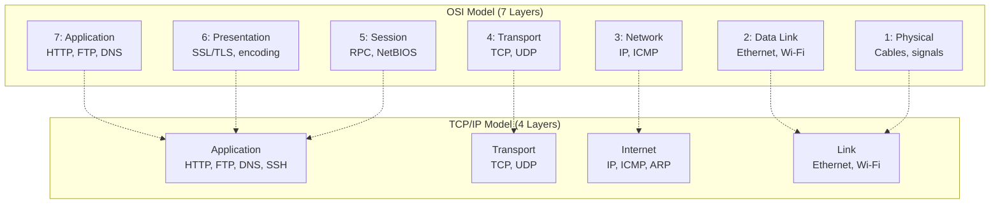
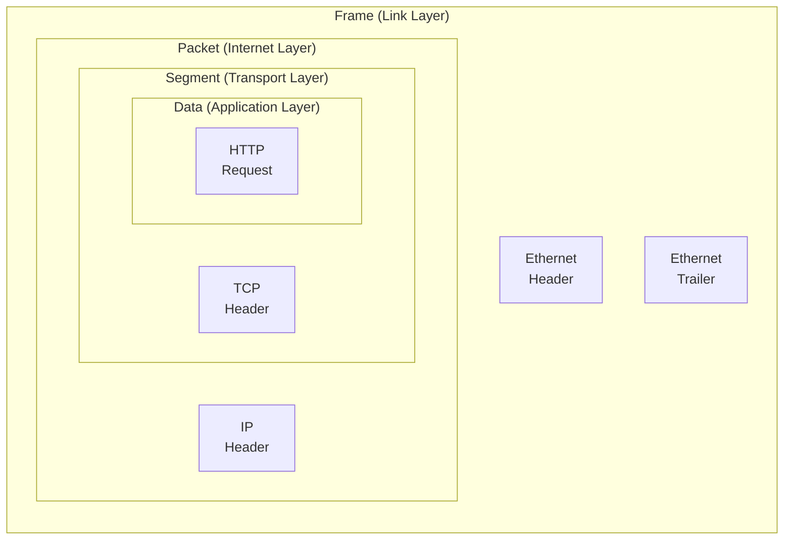
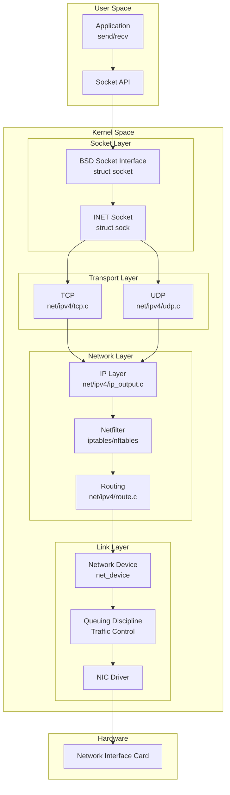
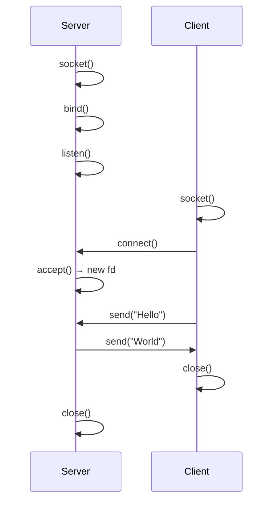

## Learning Objectives

By the end of this lesson, you will be able to:

- Compare the OSI model and TCP/IP model and map protocols to layers
- Trace a packet's journey through the Linux network stack
- Implement basic socket programming in C (TCP and UDP)
- Use core network system calls (socket, bind, listen, accept, connect)
- Understand raw sockets and their use in network tools
- Identify the kernel subsystems responsible for each layer

## Prerequisites

- Linux system call mechanism and kernel architecture
- Basic understanding of IP addresses and ports
- C programming fundamentals

---

## Network Models

### OSI Model vs TCP/IP Model



### Protocol Map

| Layer (TCP/IP) | Protocols | PDU | Address Type |
|---------------|-----------|-----|-------------|
| Application | HTTP, HTTPS, DNS, SSH, FTP, SMTP | Data | Hostname/URL |
| Transport | TCP, UDP, SCTP | Segment/Datagram | Port number |
| Internet | IPv4, IPv6, ICMP, ARP | Packet | IP address |
| Link | Ethernet, Wi-Fi (802.11), PPP | Frame | MAC address |

### Encapsulation

Each layer wraps the data from the layer above with its own header:



---

## Linux Network Stack

The Linux kernel implements the full TCP/IP stack. Here's how a packet flows through it:



### Kernel Source Organization

| Directory | Purpose |
|-----------|---------|
| `net/socket.c` | BSD socket interface |
| `net/ipv4/` | IPv4 implementation |
| `net/ipv6/` | IPv6 implementation |
| `net/ipv4/tcp.c` | TCP protocol |
| `net/ipv4/udp.c` | UDP protocol |
| `net/ipv4/ip_output.c` | IP output path |
| `net/ipv4/ip_input.c` | IP input path |
| `net/core/dev.c` | Network device handling |
| `net/netfilter/` | Packet filtering (iptables) |
| `drivers/net/` | NIC drivers |

---

## Socket Programming Basics

A **socket** is an endpoint for network communication. The Berkeley Sockets API is the standard interface:

### Socket System Calls



### TCP Server

```c
#include <stdio.h>
#include <stdlib.h>
#include <string.h>
#include <unistd.h>
#include <sys/socket.h>
#include <netinet/in.h>
#include <arpa/inet.h>

#define PORT 8080
#define BACKLOG 10
#define BUF_SIZE 1024

int main() {
    // 1. Create socket
    int server_fd = socket(AF_INET, SOCK_STREAM, 0);
    if (server_fd < 0) { perror("socket"); exit(1); }

    // Allow port reuse (avoid "Address already in use")
    int opt = 1;
    setsockopt(server_fd, SOL_SOCKET, SO_REUSEADDR, &opt, sizeof(opt));

    // 2. Bind to address and port
    struct sockaddr_in addr = {
        .sin_family = AF_INET,
        .sin_addr.s_addr = INADDR_ANY,  // Listen on all interfaces
        .sin_port = htons(PORT)
    };
    if (bind(server_fd, (struct sockaddr *)&addr, sizeof(addr)) < 0) {
        perror("bind"); exit(1);
    }

    // 3. Start listening
    if (listen(server_fd, BACKLOG) < 0) {
        perror("listen"); exit(1);
    }
    printf("Server listening on port %d\n", PORT);

    // 4. Accept connections
    while (1) {
        struct sockaddr_in client_addr;
        socklen_t client_len = sizeof(client_addr);
        int client_fd = accept(server_fd,
                               (struct sockaddr *)&client_addr,
                               &client_len);
        if (client_fd < 0) { perror("accept"); continue; }

        printf("Client connected: %s:%d\n",
               inet_ntoa(client_addr.sin_addr),
               ntohs(client_addr.sin_port));

        // 5. Read and respond
        char buf[BUF_SIZE];
        ssize_t n = read(client_fd, buf, sizeof(buf) - 1);
        if (n > 0) {
            buf[n] = '\0';
            printf("Received: %s\n", buf);

            const char *response = "HTTP/1.1 200 OK\r\n"
                                   "Content-Length: 13\r\n\r\n"
                                   "Hello, World!";
            write(client_fd, response, strlen(response));
        }

        close(client_fd);
    }

    close(server_fd);
    return 0;
}
```

### TCP Client

```c
#include <stdio.h>
#include <stdlib.h>
#include <string.h>
#include <unistd.h>
#include <sys/socket.h>
#include <netinet/in.h>
#include <arpa/inet.h>

int main() {
    // 1. Create socket
    int sock = socket(AF_INET, SOCK_STREAM, 0);
    if (sock < 0) { perror("socket"); exit(1); }

    // 2. Connect to server
    struct sockaddr_in server_addr = {
        .sin_family = AF_INET,
        .sin_port = htons(8080)
    };
    inet_pton(AF_INET, "127.0.0.1", &server_addr.sin_addr);

    if (connect(sock, (struct sockaddr *)&server_addr,
                sizeof(server_addr)) < 0) {
        perror("connect"); exit(1);
    }

    // 3. Send data
    const char *msg = "GET / HTTP/1.1\r\nHost: localhost\r\n\r\n";
    write(sock, msg, strlen(msg));

    // 4. Receive response
    char buf[4096];
    ssize_t n = read(sock, buf, sizeof(buf) - 1);
    if (n > 0) {
        buf[n] = '\0';
        printf("Response:\n%s\n", buf);
    }

    close(sock);
    return 0;
}
```

### UDP Communication

UDP is connectionless — no handshake, no guarantees:

```c
// UDP Server
int sock = socket(AF_INET, SOCK_DGRAM, 0);  // SOCK_DGRAM for UDP

struct sockaddr_in addr = {
    .sin_family = AF_INET,
    .sin_addr.s_addr = INADDR_ANY,
    .sin_port = htons(9090)
};
bind(sock, (struct sockaddr *)&addr, sizeof(addr));

char buf[1024];
struct sockaddr_in client;
socklen_t client_len = sizeof(client);

// No listen/accept needed — just receive
ssize_t n = recvfrom(sock, buf, sizeof(buf), 0,
                     (struct sockaddr *)&client, &client_len);
buf[n] = '\0';
printf("From %s: %s\n", inet_ntoa(client.sin_addr), buf);

// Send response back
sendto(sock, "ACK", 3, 0,
       (struct sockaddr *)&client, client_len);
```

```c
// UDP Client
int sock = socket(AF_INET, SOCK_DGRAM, 0);

struct sockaddr_in server = {
    .sin_family = AF_INET,
    .sin_port = htons(9090)
};
inet_pton(AF_INET, "127.0.0.1", &server.sin_addr);

sendto(sock, "Hello UDP!", 10, 0,
       (struct sockaddr *)&server, sizeof(server));

char buf[1024];
ssize_t n = recvfrom(sock, buf, sizeof(buf), 0, NULL, NULL);
buf[n] = '\0';
printf("Response: %s\n", buf);
```

---

## Network System Calls Reference

| System Call | Purpose | TCP | UDP |
|-------------|---------|:---:|:---:|
| `socket()` | Create a socket | ✅ | ✅ |
| `bind()` | Assign address/port | ✅ | ✅ |
| `listen()` | Mark as passive (server) | ✅ | ❌ |
| `accept()` | Accept incoming connection | ✅ | ❌ |
| `connect()` | Initiate connection | ✅ | Optional |
| `send()/write()` | Send data | ✅ | ❌ |
| `recv()/read()` | Receive data | ✅ | ❌ |
| `sendto()` | Send to specific address | ❌ | ✅ |
| `recvfrom()` | Receive with sender info | ❌ | ✅ |
| `close()` | Close socket | ✅ | ✅ |
| `shutdown()` | Half-close connection | ✅ | ❌ |
| `setsockopt()` | Configure socket options | ✅ | ✅ |
| `getsockopt()` | Read socket options | ✅ | ✅ |

### Important Socket Options

```c
// Reuse address (avoid bind errors after restart)
int opt = 1;
setsockopt(fd, SOL_SOCKET, SO_REUSEADDR, &opt, sizeof(opt));

// Reuse port (multiple processes bind to same port)
setsockopt(fd, SOL_SOCKET, SO_REUSEPORT, &opt, sizeof(opt));

// Set receive buffer size
int bufsize = 1048576;  // 1MB
setsockopt(fd, SOL_SOCKET, SO_RCVBUF, &bufsize, sizeof(bufsize));

// Set send timeout
struct timeval tv = {.tv_sec = 5, .tv_usec = 0};
setsockopt(fd, SOL_SOCKET, SO_SNDTIMEO, &tv, sizeof(tv));

// TCP_NODELAY (disable Nagle's algorithm)
setsockopt(fd, IPPROTO_TCP, TCP_NODELAY, &opt, sizeof(opt));

// TCP keepalive
setsockopt(fd, SOL_SOCKET, SO_KEEPALIVE, &opt, sizeof(opt));
```

---

## Raw Sockets

**Raw sockets** bypass the transport layer, giving direct access to IP packets. Used by network tools like `ping`, `traceroute`, and `tcpdump`.

```c
#include <stdio.h>
#include <string.h>
#include <sys/socket.h>
#include <netinet/ip.h>
#include <netinet/ip_icmp.h>
#include <arpa/inet.h>
#include <unistd.h>

// Calculate ICMP checksum
unsigned short checksum(void *b, int len) {
    unsigned short *buf = b;
    unsigned int sum = 0;
    for (; len > 1; len -= 2)
        sum += *buf++;
    if (len == 1)
        sum += *(unsigned char *)buf;
    sum = (sum >> 16) + (sum & 0xFFFF);
    return ~sum;
}

int main() {
    // Raw socket for ICMP (requires CAP_NET_RAW or root)
    int sock = socket(AF_INET, SOCK_RAW, IPPROTO_ICMP);
    if (sock < 0) { perror("socket (need root or CAP_NET_RAW)"); return 1; }

    struct sockaddr_in dest = {
        .sin_family = AF_INET
    };
    inet_pton(AF_INET, "8.8.8.8", &dest.sin_addr);

    // Build ICMP echo request
    struct icmphdr icmp = {
        .type = ICMP_ECHO,
        .code = 0,
        .un.echo.id = getpid(),
        .un.echo.sequence = 1
    };
    icmp.checksum = checksum(&icmp, sizeof(icmp));

    // Send
    sendto(sock, &icmp, sizeof(icmp), 0,
           (struct sockaddr *)&dest, sizeof(dest));
    printf("Sent ICMP echo request to 8.8.8.8\n");

    // Receive reply
    char buf[1024];
    ssize_t n = recv(sock, buf, sizeof(buf), 0);
    if (n > 0) {
        struct iphdr *ip = (struct iphdr *)buf;
        struct icmphdr *reply = (struct icmphdr *)(buf + (ip->ihl * 4));
        if (reply->type == ICMP_ECHOREPLY) {
            printf("Received ICMP echo reply! TTL=%d\n", ip->ttl);
        }
    }

    close(sock);
    return 0;
}
```

```bash
# Compile and run (needs capabilities or root)
gcc raw_ping.c -o raw_ping
sudo setcap cap_net_raw=ep raw_ping
./raw_ping
# Sent ICMP echo request to 8.8.8.8
# Received ICMP echo reply! TTL=117
```

### Raw Socket Types

| Socket Type | Level | Use Case |
|-------------|-------|----------|
| `SOCK_RAW + IPPROTO_ICMP` | IP + ICMP | ping, traceroute |
| `SOCK_RAW + IPPROTO_TCP` | IP + TCP | Custom TCP tools |
| `SOCK_RAW + IPPROTO_RAW` | Full IP control | Packet crafting |
| `AF_PACKET + SOCK_RAW` | Link layer | tcpdump, packet sniffing |

---

## Observing the Network Stack

```bash
# View socket statistics
ss -tuln
# State  Recv-Q  Send-Q  Local Address:Port  Peer Address:Port
# LISTEN 0       128     0.0.0.0:22          0.0.0.0:*
# LISTEN 0       511     0.0.0.0:80          0.0.0.0:*

# Detailed socket info with kernel internals
ss -i
# Shows TCP info: cwnd, rtt, mss, ssthresh

# Network interface statistics
ip -s link show eth0
# RX: bytes  packets  errors  dropped  missed
# TX: bytes  packets  errors  dropped  carrier

# Routing table
ip route show
# default via 192.168.1.1 dev eth0 proto dhcp
# 192.168.1.0/24 dev eth0 proto kernel scope link src 192.168.1.100

# ARP cache
ip neigh show
# 192.168.1.1 dev eth0 lladdr aa:bb:cc:dd:ee:ff REACHABLE

# Trace packet path through the kernel
sudo perf trace -e 'net:*' -- curl -s http://example.com > /dev/null
```

---

## Key Takeaways

1. The **TCP/IP model** has four layers (Link, Internet, Transport, Application) that map to the Linux kernel's network subsystem — each layer adds its header during encapsulation and removes it during decapsulation.

2. The **Linux network stack** processes packets through socket layer → transport (TCP/UDP) → IP → netfilter → routing → device driver → NIC, with each layer implemented in separate kernel modules.

3. **Socket programming** follows a clear pattern: `socket()` → `bind()` → `listen()` → `accept()` for TCP servers, and `socket()` → `connect()` for clients. UDP uses `sendto()`/`recvfrom()` without connection setup.

4. **TCP sockets** (`SOCK_STREAM`) provide reliable, ordered byte streams with connection management; **UDP sockets** (`SOCK_DGRAM`) provide unreliable datagrams with lower overhead.

5. **Socket options** like `SO_REUSEADDR`, `TCP_NODELAY`, `SO_KEEPALIVE`, and buffer sizes are critical for production network applications.

6. **Raw sockets** bypass the transport layer for direct IP/ICMP access — they're the foundation of tools like ping, traceroute, and tcpdump, requiring `CAP_NET_RAW` capability.

7. Use `ss` for socket statistics, `ip` for interface/routing info, and `perf trace` for kernel-level network debugging.
