## Learning Objectives

By the end of this lesson, you will be able to:

- Compare TCP and UDP in depth, including their header formats and use cases
- Trace the TCP connection lifecycle (three-way handshake, data transfer, teardown)
- Explain TCP flow control (sliding window) and congestion control (slow start, AIMD)
- Calculate IP subnets and understand CIDR notation
- Describe how ARP resolves IP addresses to MAC addresses
- Configure routing tables, NAT, and packet filtering with iptables/nftables

## Prerequisites

- Network stack fundamentals (OSI/TCP model, socket programming)
- Basic understanding of IP addresses and ports
- Linux command-line networking tools

---

## TCP vs UDP Deep Dive

### Header Comparison

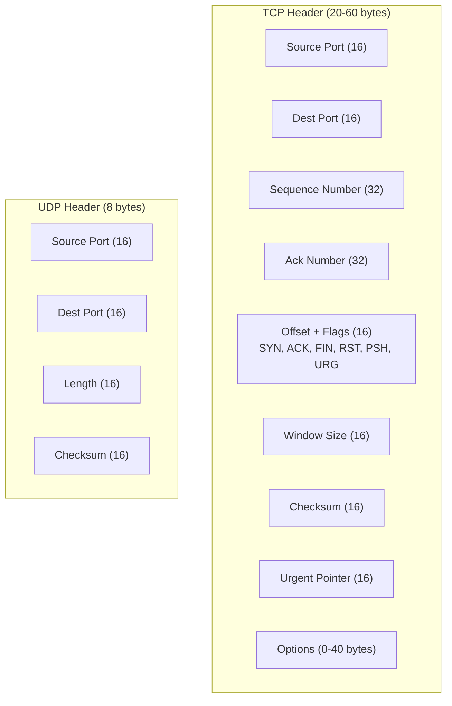

### Feature Comparison

| Feature | TCP | UDP |
|---------|-----|-----|
| Connection | Connection-oriented | Connectionless |
| Reliability | Guaranteed delivery (ACKs, retransmission) | Best-effort (no guarantees) |
| Ordering | In-order delivery | No ordering |
| Flow control | Sliding window | None |
| Congestion control | Slow start, AIMD, etc. | None |
| Header size | 20-60 bytes | 8 bytes |
| Speed | Slower (overhead) | Faster (minimal overhead) |
| Broadcast/Multicast | No | Yes |
| Use cases | HTTP, SSH, FTP, SMTP, databases | DNS, DHCP, video streaming, gaming, VoIP |

---

## TCP Connection Lifecycle

### Three-Way Handshake

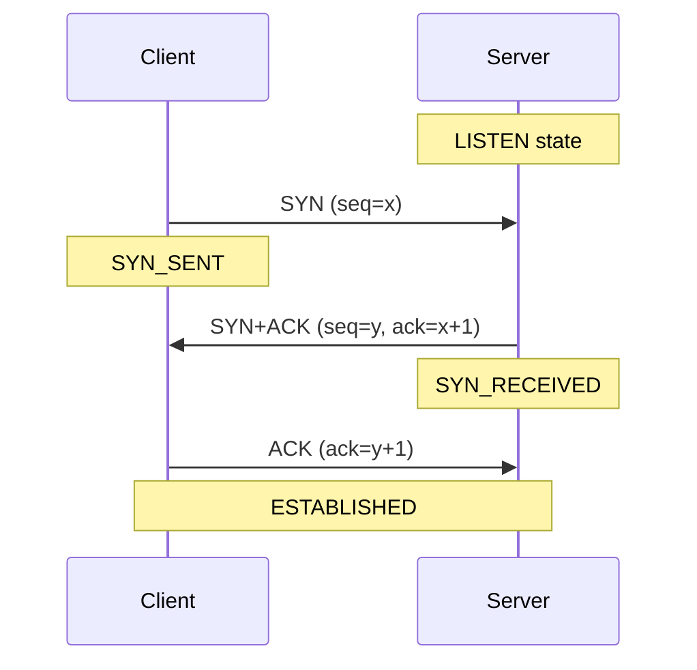

```bash
# Watch handshake with tcpdump
sudo tcpdump -i eth0 -nn 'tcp[tcpflags] & (tcp-syn|tcp-fin) != 0' port 80

# Output:
# 10:00:00.001 IP 10.0.0.1.54321 > 93.184.216.34.80: Flags [S], seq 1000
# 10:00:00.020 IP 93.184.216.34.80 > 10.0.0.1.54321: Flags [S.], seq 2000, ack 1001
# 10:00:00.021 IP 10.0.0.1.54321 > 93.184.216.34.80: Flags [.], ack 2001
```

### TCP State Machine

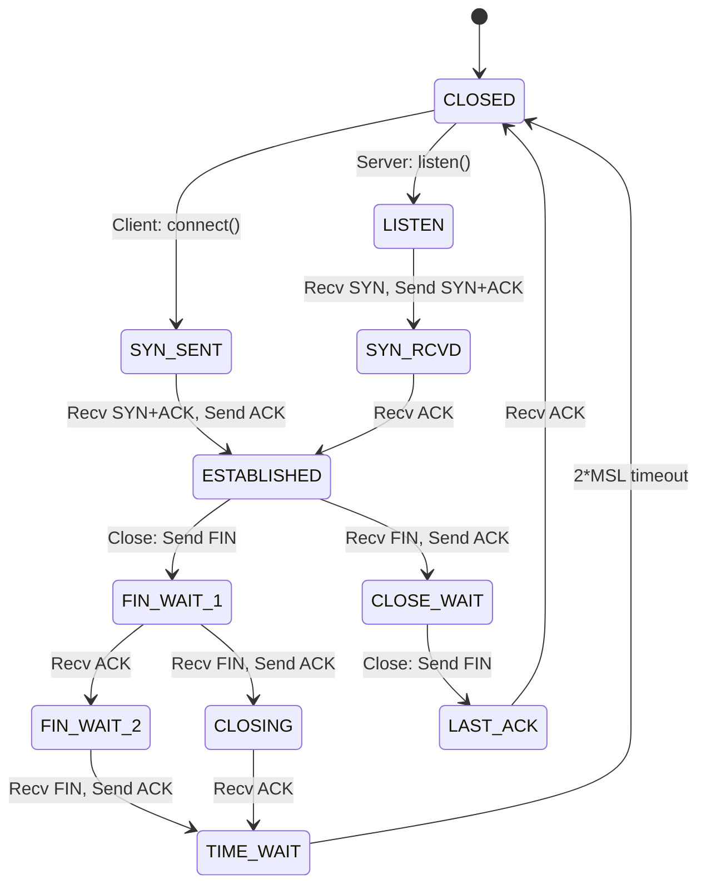

### Connection Teardown (Four-Way)

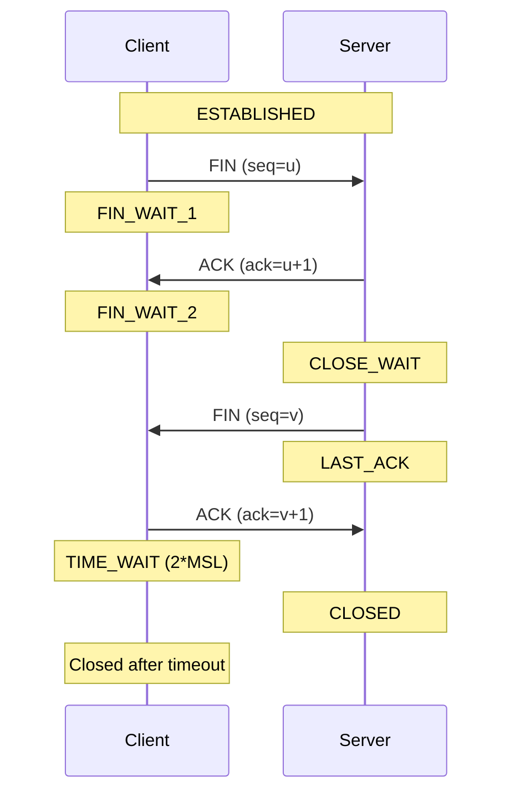

**TIME_WAIT** lasts 2×MSL (Maximum Segment Lifetime, typically 60 seconds) to ensure late packets don't interfere with new connections on the same port.

```bash
# Check TIME_WAIT connections
ss -tn state time-wait | wc -l

# Reduce TIME_WAIT duration (for high-traffic servers)
sudo sysctl -w net.ipv4.tcp_fin_timeout=15
```

---

## TCP Flow Control

**Flow control** prevents a fast sender from overwhelming a slow receiver using a **sliding window** mechanism.

### Sliding Window

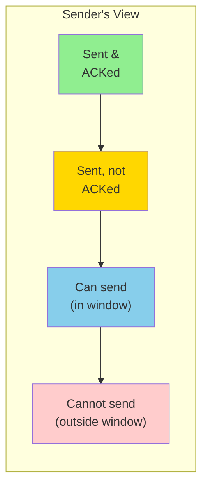

The receiver advertises its **receive window** (rwnd) in every ACK — the sender never has more than rwnd bytes of unacknowledged data in flight.

```c
// Simplified flow control
int send_data(int sock, char *data, size_t len) {
    size_t sent = 0;
    while (sent < len) {
        // Kernel handles window management internally
        ssize_t n = send(sock, data + sent, len - sent, 0);
        if (n <= 0) break;
        sent += n;
    }
    return sent;
}
```

### Window Scaling (RFC 7323)

The 16-bit window field limits rwnd to 64KB. **Window scaling** uses a TCP option to multiply the window size:

```bash
# Check if window scaling is enabled
sysctl net.ipv4.tcp_window_scaling
# net.ipv4.tcp_window_scaling = 1

# View current window sizes
ss -ti
# cwnd:10 rwnd:64240 ... wscale:7,7
# Window = 64240 * 2^7 = 8,222,720 bytes
```

---

## TCP Congestion Control

**Congestion control** prevents the sender from overwhelming the **network** (not the receiver). The sender maintains a **congestion window** (cwnd):

Effective window = min(cwnd, rwnd)

### Slow Start

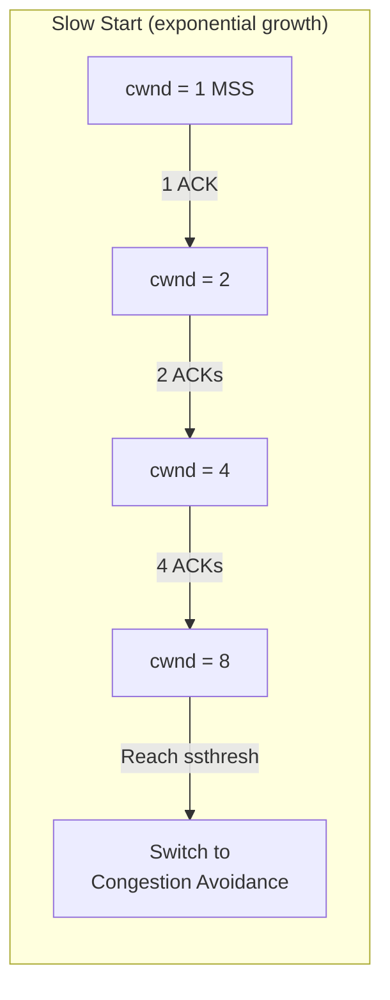

### Congestion Avoidance (AIMD)

After reaching ssthresh, switch to **Additive Increase, Multiplicative Decrease**:

- **Additive Increase**: cwnd += 1 MSS per RTT
- **Multiplicative Decrease**: On loss detection, cwnd = cwnd / 2

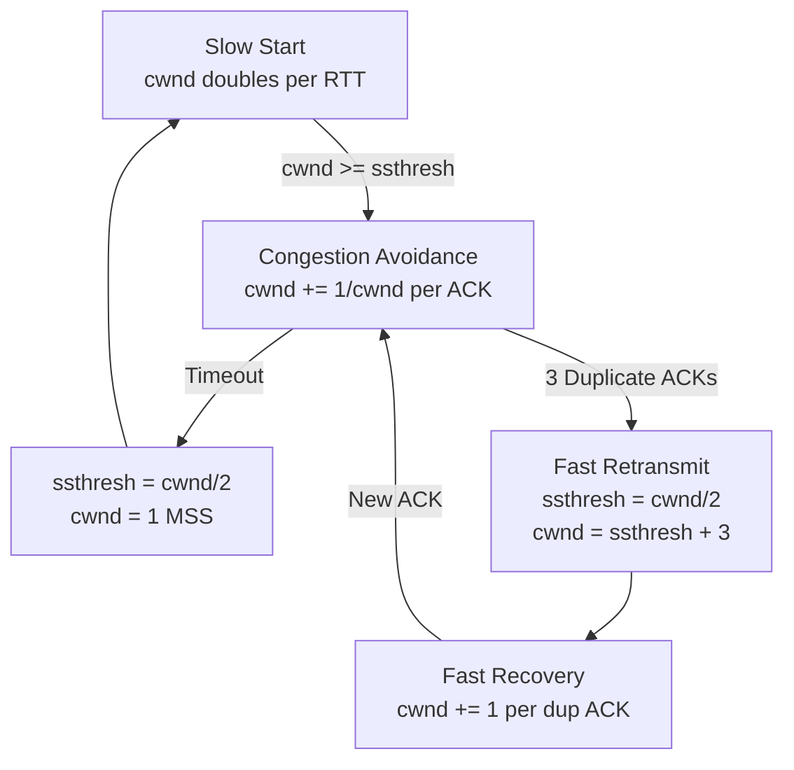

### Modern Congestion Control Algorithms

| Algorithm | Type | Key Feature | Default In |
|-----------|------|-------------|-----------|
| **Reno** | Loss-based | Classic AIMD | Legacy |
| **CUBIC** | Loss-based | Cubic function for window growth | Linux (default) |
| **BBR** | Model-based | Estimates bottleneck bandwidth | Google servers |
| **BBRv2** | Model-based | Improved fairness | Testing |
| **DCTCP** | ECN-based | Data center optimized | Data centers |

```bash
# View available congestion control algorithms
sysctl net.ipv4.tcp_available_congestion_control
# cubic reno bbr

# View current algorithm
sysctl net.ipv4.tcp_congestion_control
# net.ipv4.tcp_congestion_control = cubic

# Switch to BBR
sudo sysctl -w net.ipv4.tcp_congestion_control=bbr

# Per-socket (programmatic)
```

```c
char *algo = "bbr";
setsockopt(sock, IPPROTO_TCP, TCP_CONGESTION, algo, strlen(algo));
```

---

## IP Addressing and Subnetting

### IPv4 Address Structure

An IPv4 address is 32 bits, divided into a **network** portion and **host** portion:

```
IP Address: 192.168.1.100
Subnet Mask: 255.255.255.0  (/24 in CIDR)

Network:     192.168.1.0     (first 24 bits)
Host:        .100            (last 8 bits)
Broadcast:   192.168.1.255   (all host bits = 1)
Usable:      192.168.1.1 - 192.168.1.254  (254 hosts)
```

### CIDR Notation

| CIDR | Subnet Mask | Hosts | Example |
|------|-------------|-------|---------|
| /8 | 255.0.0.0 | 16,777,214 | 10.0.0.0/8 (Class A) |
| /16 | 255.255.0.0 | 65,534 | 172.16.0.0/16 (Class B) |
| /24 | 255.255.255.0 | 254 | 192.168.1.0/24 (Class C) |
| /25 | 255.255.255.128 | 126 | Split a /24 in half |
| /26 | 255.255.255.192 | 62 | Quarter of a /24 |
| /27 | 255.255.255.224 | 30 | Small subnet |
| /28 | 255.255.255.240 | 14 | Very small subnet |
| /30 | 255.255.255.252 | 2 | Point-to-point link |
| /32 | 255.255.255.255 | 1 | Single host |

### Private Address Ranges

| Range | CIDR | Typical Use |
|-------|------|-------------|
| 10.0.0.0 – 10.255.255.255 | 10.0.0.0/8 | Large enterprises, cloud VPCs |
| 172.16.0.0 – 172.31.255.255 | 172.16.0.0/12 | Medium networks |
| 192.168.0.0 – 192.168.255.255 | 192.168.0.0/16 | Home/small office |

### Subnetting Example

Divide 192.168.1.0/24 into 4 subnets:

| Subnet | Range | Broadcast | Usable Hosts |
|--------|-------|-----------|-------------|
| 192.168.1.0/26 | .0 – .63 | .63 | .1 – .62 (62) |
| 192.168.1.64/26 | .64 – .127 | .127 | .65 – .126 (62) |
| 192.168.1.128/26 | .128 – .191 | .191 | .129 – .190 (62) |
| 192.168.1.192/26 | .192 – .255 | .255 | .193 – .254 (62) |

```bash
# Calculate subnets
ipcalc 192.168.1.0/26
# Network:   192.168.1.0/26
# Broadcast: 192.168.1.63
# HostMin:   192.168.1.1
# HostMax:   192.168.1.62
# Hosts/Net: 62
```

---

## ARP (Address Resolution Protocol)

**ARP** maps IP addresses to MAC addresses on the local network:

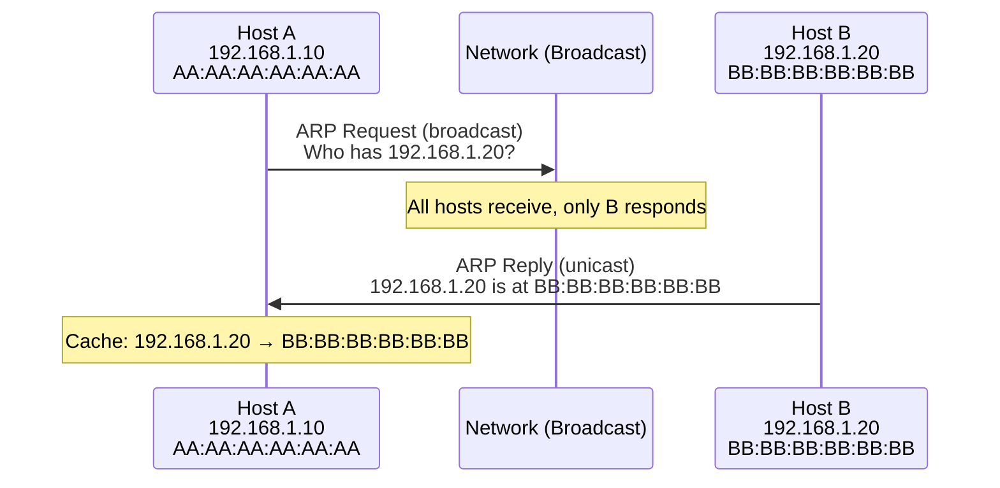

```bash
# View ARP cache
ip neigh show
# 192.168.1.1 dev eth0 lladdr aa:bb:cc:dd:ee:ff REACHABLE
# 192.168.1.20 dev eth0 lladdr 11:22:33:44:55:66 STALE

# Add static ARP entry
sudo ip neigh add 192.168.1.50 lladdr 00:11:22:33:44:55 dev eth0

# Clear ARP cache
sudo ip neigh flush dev eth0

# Watch ARP traffic
sudo tcpdump -i eth0 arp
```

---

## ICMP (Internet Control Message Protocol)

ICMP provides network diagnostics and error reporting:

| Type | Code | Description | Tool |
|------|------|-------------|------|
| 0 | 0 | Echo Reply | ping response |
| 3 | 0 | Destination Network Unreachable | - |
| 3 | 1 | Destination Host Unreachable | - |
| 3 | 3 | Destination Port Unreachable | - |
| 8 | 0 | Echo Request | ping |
| 11 | 0 | TTL Exceeded | traceroute |

```bash
# Ping (ICMP Echo Request/Reply)
ping -c 4 8.8.8.8
# 64 bytes from 8.8.8.8: icmp_seq=1 ttl=117 time=12.3 ms

# Traceroute (uses TTL-exceeded ICMP messages)
traceroute 8.8.8.8
# 1  192.168.1.1    1.2 ms
# 2  10.0.0.1       5.3 ms
# ...
# 9  8.8.8.8        12.1 ms

# MTU Path Discovery
ping -M do -s 1472 192.168.1.1
# If MTU < 1500: "Frag needed and DF set (mtu = 1400)"
```

---

## Routing

### Routing Table

```bash
# View routing table
ip route show
# default via 192.168.1.1 dev eth0 proto dhcp metric 100
# 10.0.0.0/8 via 10.0.0.1 dev tun0
# 172.17.0.0/16 dev docker0 proto kernel scope link src 172.17.0.1
# 192.168.1.0/24 dev eth0 proto kernel scope link src 192.168.1.100

# Add a route
sudo ip route add 10.10.0.0/24 via 192.168.1.1 dev eth0

# Delete a route
sudo ip route del 10.10.0.0/24

# Change default gateway
sudo ip route replace default via 192.168.1.1 dev eth0

# Policy routing (multiple tables)
sudo ip rule add from 10.0.0.0/8 table 100
sudo ip route add default via 10.0.0.1 table 100
```

### Routing Decision

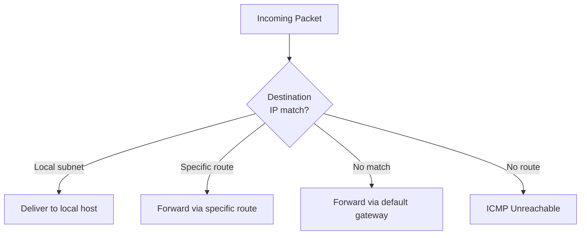

---

## NAT (Network Address Translation)

NAT translates private IP addresses to public addresses, allowing multiple devices to share one public IP:

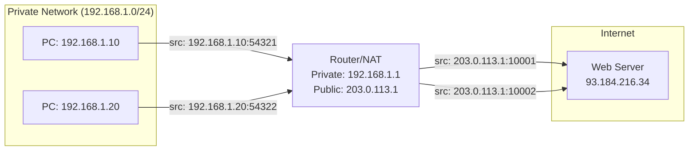

```bash
# Enable IP forwarding
sudo sysctl -w net.ipv4.ip_forward=1

# Source NAT (masquerade — for dynamic public IP)
sudo iptables -t nat -A POSTROUTING -o eth0 -j MASQUERADE

# Destination NAT (port forwarding)
sudo iptables -t nat -A PREROUTING -i eth0 -p tcp --dport 80 \
    -j DNAT --to-destination 192.168.1.10:8080
```

---

## Packet Filtering: iptables and nftables

### iptables Chains

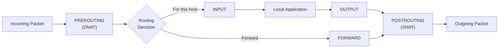

### iptables Rules

```bash
# View current rules
sudo iptables -L -n -v

# Allow incoming SSH
sudo iptables -A INPUT -p tcp --dport 22 -j ACCEPT

# Allow established connections
sudo iptables -A INPUT -m conntrack --ctstate ESTABLISHED,RELATED -j ACCEPT

# Drop all other incoming
sudo iptables -A INPUT -j DROP

# Allow forwarding between interfaces
sudo iptables -A FORWARD -i eth0 -o eth1 -j ACCEPT

# Rate limiting (prevent SYN flood)
sudo iptables -A INPUT -p tcp --syn -m limit --limit 1/s --limit-burst 3 -j ACCEPT
sudo iptables -A INPUT -p tcp --syn -j DROP

# Log dropped packets
sudo iptables -A INPUT -j LOG --log-prefix "IPT-DROP: " --log-level 4
sudo iptables -A INPUT -j DROP
```

### nftables (Modern Replacement)

```bash
# nftables rule set
sudo nft add table inet filter
sudo nft add chain inet filter input { type filter hook input priority 0 \; policy drop \; }
sudo nft add rule inet filter input ct state established,related accept
sudo nft add rule inet filter input tcp dport 22 accept
sudo nft add rule inet filter input tcp dport {80, 443} accept
sudo nft add rule inet filter input iif lo accept
sudo nft add rule inet filter input counter drop

# List rules
sudo nft list ruleset
```

### iptables vs nftables

| Feature | iptables | nftables |
|---------|----------|----------|
| Syntax | Command-per-rule | Single ruleset language |
| Performance | Linear rule matching | Optimized (sets, maps) |
| IPv4/IPv6 | Separate tools (iptables, ip6tables) | Unified (inet family) |
| Atomic updates | No (per-rule) | Yes (whole ruleset) |
| Status | Legacy (maintenance) | Active development |

---

## Key Takeaways

1. **TCP** provides reliable, ordered, connection-oriented communication with flow and congestion control; **UDP** provides fast, unreliable datagrams — choose based on whether you need reliability or speed.

2. The **TCP three-way handshake** (SYN → SYN+ACK → ACK) establishes connections, and four-way teardown (FIN → ACK → FIN → ACK) closes them, with TIME_WAIT preventing port reuse conflicts.

3. **TCP congestion control** (slow start → congestion avoidance → fast retransmit/recovery) prevents network collapse. **CUBIC** is Linux's default; **BBR** is Google's model-based alternative.

4. **CIDR subnetting** divides networks efficiently — understand the relationship between prefix length, subnet mask, and the number of usable hosts.

5. **ARP** bridges the gap between IP addresses (Layer 3) and MAC addresses (Layer 2). **ICMP** provides diagnostic tools (ping, traceroute) and error reporting.

6. **Routing tables** determine where packets go — the kernel checks specific routes first, then falls back to the default gateway. Policy routing enables multi-path configurations.

7. **iptables/nftables** implement packet filtering, NAT, and traffic shaping. nftables is the modern replacement with better performance and a unified IPv4/IPv6 syntax.
