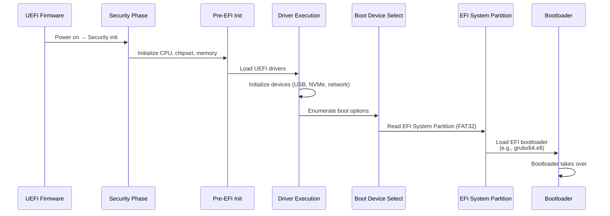
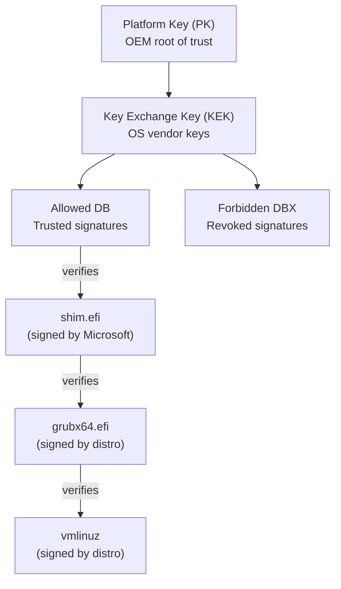
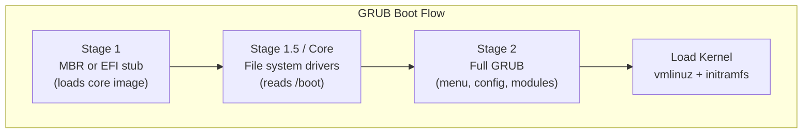
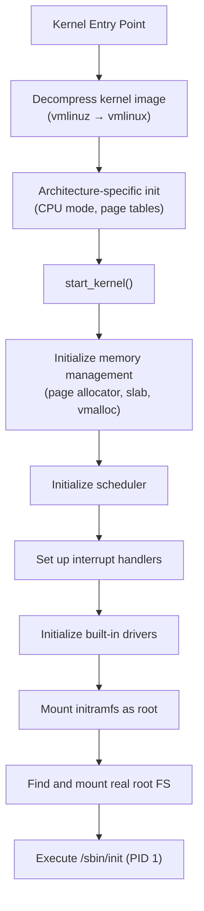
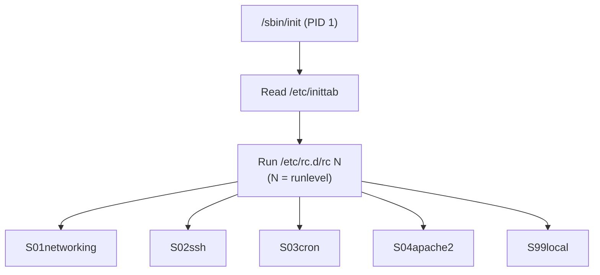
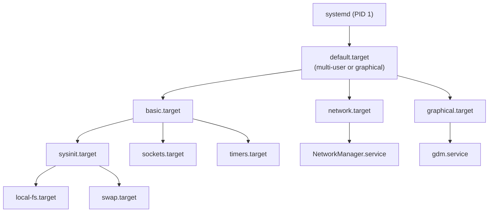
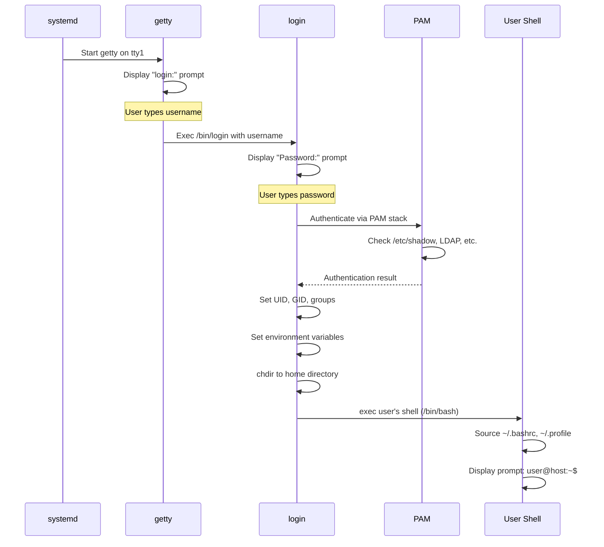
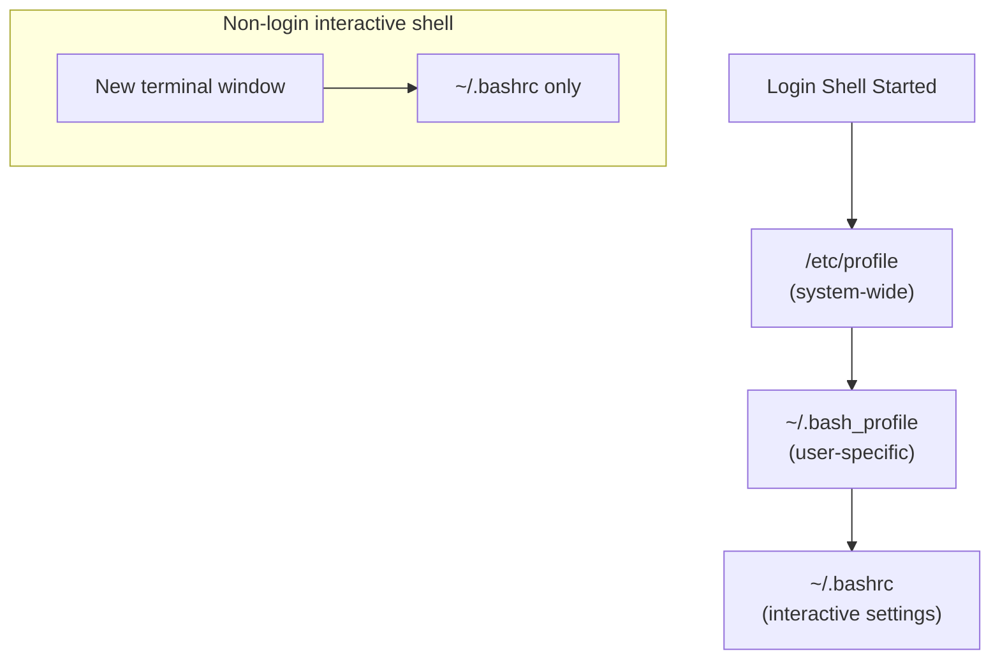

## Learning Objectives

By the end of this lesson, you will be able to:

- Explain the role of BIOS and UEFI firmware in system startup
- Describe how bootloaders like GRUB work
- Trace the kernel loading and initialization process
- Compare init systems: SysVinit, systemd, and launchd
- Understand runlevels and systemd targets
- Describe the login process from boot to shell prompt

## Prerequisites

- Understanding of kernel space vs user space
- Basic knowledge of system architecture (CPU, memory, interrupts)
- Familiarity with Linux command-line basics

---

## Overview: From Power Button to Login Prompt

When you press the power button, an intricate chain of events transforms a lifeless circuit board into a fully operational system. Each stage hands control to the next in a carefully orchestrated sequence.


---

## Stage 1: Firmware — BIOS and UEFI

The very first code that runs after power-on is stored in firmware — a chip on the motherboard. Its job is to initialize hardware and find something bootable.

### BIOS (Basic Input/Output System)

**BIOS** has been the standard firmware since the 1980s. It operates in 16-bit real mode and uses the **Master Boot Record (MBR)** partitioning scheme.

**BIOS Boot Sequence:**
1. **POST (Power-On Self-Test)** — Tests CPU, RAM, and essential hardware
2. **Hardware initialization** — Configures basic I/O devices
3. **Boot device search** — Checks configured boot order (HDD, CD, USB, Network)
4. **Load MBR** — Reads the first 512 bytes of the boot device
5. **Transfer control** — Jumps to the bootloader code in the MBR

### UEFI (Unified Extensible Firmware Interface)

**UEFI** is the modern replacement for BIOS, offering significant improvements:

| Feature | BIOS | UEFI |
|---------|------|------|
| Introduced | 1981 | 2005+ |
| Mode | 16-bit real mode | 32/64-bit protected mode |
| Partition table | MBR (4 primary, 2 TB max) | GPT (128 partitions, 9.4 ZB max) |
| Boot code size | 446 bytes (MBR) | Megabytes (ESP partition) |
| UI | Text-only | Graphical (mouse support) |
| Secure Boot | No | Yes (cryptographic verification) |
| Network boot | PXE only | HTTP boot, PXE |
| Driver model | None | UEFI drivers (architecture-independent) |

### UEFI Boot Flow



### The EFI System Partition (ESP)

The ESP is a small FAT32 partition containing bootloader files:

```bash
# View ESP contents (typically mounted at /boot/efi)
ls -la /boot/efi/EFI/
# Output:
# BOOT/         — fallback bootloader
# ubuntu/       — Ubuntu's GRUB files
# Microsoft/    — Windows Boot Manager

# View UEFI boot entries
efibootmgr -v
# Output:
# BootCurrent: 0001
# BootOrder: 0001,0002,0003
# Boot0001* ubuntu  HD(1,GPT,...)/File(\EFI\ubuntu\shimx64.efi)
# Boot0002* Windows Boot Manager
# Boot0003* USB Drive
```

### Secure Boot

UEFI **Secure Boot** verifies cryptographic signatures of boot components to prevent rootkits:



---

## Stage 2: The Bootloader

The bootloader's job is to load the OS kernel into memory and transfer control to it. It bridges the gap between firmware and the operating system.

### GRUB (GRand Unified Bootloader)

**GRUB 2** is the standard bootloader for most Linux distributions. It's a two-stage bootloader:

**Stage 1:** A tiny piece of code in the MBR (BIOS) or EFI application (UEFI) that loads Stage 2.

**Stage 2:** A full-featured program that can read file systems, display menus, and load kernels.



### GRUB Configuration

```bash
# Main GRUB config file (auto-generated — do NOT edit directly)
cat /boot/grub/grub.cfg

# Custom settings go here
cat /etc/default/grub
# GRUB_TIMEOUT=5
# GRUB_CMDLINE_LINUX_DEFAULT="quiet splash"
# GRUB_CMDLINE_LINUX=""

# Regenerate grub.cfg after changes
sudo update-grub
# or
sudo grub-mkconfig -o /boot/grub/grub.cfg
```

A simplified GRUB menu entry:

```bash
menuentry 'Ubuntu 24.04 LTS' {
    set root='hd0,gpt2'
    linux /vmlinuz-6.5.0-44-generic root=/dev/sda2 ro quiet splash
    initrd /initrd.img-6.5.0-44-generic
}
```

Key components:
- `linux` — Path to the kernel image
- `root=` — The root filesystem device
- `initrd` — The initial ramdisk image
- `ro` — Mount root filesystem read-only initially
- `quiet splash` — Suppress boot messages, show splash screen

### Other Bootloaders

| Bootloader | Platform | Notes |
|------------|----------|-------|
| **GRUB 2** | Linux, multiboot | Most popular, feature-rich |
| **systemd-boot** | Linux (UEFI only) | Simpler, faster, UEFI-native |
| **rEFInd** | Multi-OS (UEFI) | Beautiful UI, auto-detects OSes |
| **Windows Boot Manager** | Windows | `bootmgr` + BCD store |
| **U-Boot** | Embedded / ARM | Standard for ARM boards, Raspberry Pi |

---

## Stage 3: Kernel Loading and Initialization

Once GRUB loads the kernel image (`vmlinuz`) and initial ramdisk (`initramfs`) into memory, the kernel takes over.

### Kernel Boot Steps



### The initramfs (Initial RAM Filesystem)

The kernel can't mount the real root filesystem without drivers — but those drivers might be on the root filesystem. This chicken-and-egg problem is solved by **initramfs**: a temporary root filesystem loaded into RAM containing essential drivers and scripts.

```bash
# View initramfs contents
lsinitramfs /boot/initrd.img-$(uname -r) | head -20

# Rebuild initramfs (Debian/Ubuntu)
sudo update-initramfs -u

# Rebuild initramfs (RHEL/Fedora)
sudo dracut --force

# Check initramfs size
ls -lh /boot/initrd.img-$(uname -r)
```

### Kernel Command Line

The kernel accepts parameters that control its behavior:

```bash
# View current kernel command line
cat /proc/cmdline
# Output: BOOT_IMAGE=/vmlinuz-6.5.0-44-generic root=UUID=abc123 ro quiet splash

# Common kernel parameters:
# root=         — Root filesystem device
# ro / rw       — Mount root read-only or read-write
# quiet         — Suppress most boot messages
# debug         — Enable debug output
# init=         — Path to init program (default: /sbin/init)
# single / 1    — Boot into single-user mode
# mem=          — Limit usable memory (e.g., mem=4G)
# nomodeset     — Disable kernel mode-setting (GPU troubleshooting)
```

### Kernel Messages

```bash
# View kernel boot messages
dmesg | head -50

# Example output:
# [    0.000000] Linux version 6.5.0-44-generic (buildd@lcy02-amd64-...)
# [    0.000000] Command line: BOOT_IMAGE=/vmlinuz-6.5.0-44-generic root=...
# [    0.000000] BIOS-provided physical RAM map:
# [    0.000000]  BIOS-e820: [mem 0x0000000000000000-0x000000000009fbff] usable
# [    0.012345] CPU: Intel(R) Core(TM) i7-10700K CPU @ 3.80GHz
# [    0.023456] Memory: 16384MB available
# [    0.034567] ACPI: RSDP 0x00000000000F0490
# [    0.100000] smpboot: Allowing 8 CPUs, 0 hotplug CPUs
# [    1.234567] EXT4-fs (sda2): mounted filesystem with ordered data mode

# Follow kernel messages in real time
dmesg -w
```

---

## Stage 4: Init Systems

After the kernel finishes initialization, it starts **PID 1** — the init process. This is the ancestor of all user-space processes and is responsible for bringing the system to a usable state.

### SysVinit (Traditional)

The original Unix init system uses **runlevels** and sequential startup scripts.



**Runlevels:**

| Runlevel | Description |
|----------|-------------|
| 0 | Halt (shutdown) |
| 1 / S | Single-user mode (maintenance) |
| 2 | Multi-user without networking (Debian: with networking) |
| 3 | Multi-user with networking (text mode) |
| 4 | Unused (user-defined) |
| 5 | Multi-user with networking and GUI |
| 6 | Reboot |

**Limitations of SysVinit:**
- Scripts run **sequentially** — slow boot times
- No dependency tracking between services
- No automatic restart of crashed services
- No resource control (cgroups)

### systemd (Modern Linux)

**systemd** is the dominant init system on modern Linux. It starts services in parallel, manages dependencies, and provides much more than just init.



### systemd Unit Files

```ini
# Example: /etc/systemd/system/myapp.service
[Unit]
Description=My Application Server
After=network.target postgresql.service
Requires=postgresql.service

[Service]
Type=simple
User=myapp
Group=myapp
WorkingDirectory=/opt/myapp
ExecStart=/opt/myapp/bin/server --port 8080
ExecReload=/bin/kill -HUP $MAINPID
Restart=on-failure
RestartSec=5
LimitNOFILE=65535

[Install]
WantedBy=multi-user.target
```

### systemd Commands

```bash
# View system boot target
systemctl get-default

# List all running services
systemctl list-units --type=service --state=running

# Start/stop/restart a service
sudo systemctl start nginx
sudo systemctl stop nginx
sudo systemctl restart nginx

# Enable/disable service at boot
sudo systemctl enable nginx
sudo systemctl disable nginx

# View service status and recent logs
systemctl status nginx

# View boot time analysis
systemd-analyze
systemd-analyze blame | head -10
systemd-analyze critical-chain

# View dependency tree
systemctl list-dependencies multi-user.target
```

### systemd-analyze Output

```bash
$ systemd-analyze
Startup finished in 2.345s (firmware) + 1.234s (loader) + 
    3.456s (kernel) + 8.789s (userspace) = 15.824s

$ systemd-analyze blame | head -5
    4.123s NetworkManager-wait-online.service
    2.345s snapd.service
    1.234s udisks2.service
    0.987s accounts-daemon.service
    0.876s systemd-journal-flush.service
```

### launchd (macOS)

**launchd** is Apple's init system and service manager, combining the roles of init, cron, inetd, and more.

```bash
# List loaded services (macOS)
launchctl list | head -20

# Load/unload a service plist
sudo launchctl load /Library/LaunchDaemons/com.example.myapp.plist
sudo launchctl unload /Library/LaunchDaemons/com.example.myapp.plist

# View service info
launchctl print system/com.apple.syslogd
```

### Init System Comparison

| Feature | SysVinit | systemd | launchd |
|---------|----------|---------|---------|
| Platform | Traditional Linux | Modern Linux | macOS |
| Startup | Sequential | Parallel | Parallel |
| Config format | Shell scripts | INI-like unit files | XML plists |
| Dependencies | Manual ordering | Declarative | Declarative |
| Process supervision | None | Built-in | Built-in |
| Socket activation | inetd (separate) | Built-in | Built-in |
| Logging | syslog (separate) | journald (built-in) | Unified logging |
| cgroups | No | Yes | No (uses sandbox) |

---

## Stage 5: Runlevels and Targets

### systemd Targets vs SysVinit Runlevels

systemd uses **targets** instead of runlevels, but provides compatibility:

| SysVinit Runlevel | systemd Target | Description |
|-------------------|---------------|-------------|
| 0 | `poweroff.target` | Shutdown |
| 1 | `rescue.target` | Single-user / rescue mode |
| 2, 3, 4 | `multi-user.target` | Multi-user, text mode |
| 5 | `graphical.target` | Multi-user with GUI |
| 6 | `reboot.target` | Reboot |

```bash
# View current target
systemctl get-default
# Output: graphical.target

# Change default target
sudo systemctl set-default multi-user.target

# Switch to a different target immediately
sudo systemctl isolate rescue.target

# View all available targets
systemctl list-units --type=target
```

---

## Stage 6: Startup Services and Daemons

Once the init system reaches the default target, it starts background services called **daemons**.

### Common System Daemons

| Daemon | Purpose |
|--------|---------|
| `sshd` | Secure Shell server |
| `NetworkManager` | Network connection management |
| `cron` / `systemd-timerd` | Scheduled task execution |
| `rsyslogd` / `journald` | System logging |
| `udevd` | Dynamic device management |
| `dbus-daemon` | Inter-process message bus |
| `cups` | Print service |
| `dockerd` | Container runtime |

```bash
# View all enabled services (will start at boot)
systemctl list-unit-files --type=service --state=enabled

# View the boot log for this boot
journalctl -b

# View logs for a specific service
journalctl -u nginx --since "1 hour ago"
```

---

## Stage 7: The Login Process

After all services are running, the system presents a login interface.

### Text Console Login



### Graphical Login (Display Manager)

For graphical systems, a **display manager** (GDM, SDDM, LightDM) replaces getty:

```bash
# Check which display manager is active
systemctl status display-manager

# Common display managers
# GDM  — GNOME Display Manager
# SDDM — Simple Desktop Display Manager (KDE)
# LightDM — Lightweight cross-desktop display manager
```

### Login Files and Shell Initialization

When a login shell starts, it reads configuration files in a specific order:



```bash
# View login-related files
cat /etc/passwd | grep $USER
# user:x:1000:1000:User Name:/home/user:/bin/bash

# View PAM configuration for login
cat /etc/pam.d/login

# View last logins
last | head -10

# View failed login attempts
sudo lastb | head -10

# View system uptime and logged-in users
w
who
```

---

## Complete Boot Timeline

Here's the entire process visualized as a timeline:

```mermaid
gantt
    title System Boot Timeline
    dateFormat X
    axisFormat %s

    section Firmware
    POST & Hardware Init        :0, 2
    UEFI Driver Loading        :2, 3

    section Bootloader
    GRUB Stage 1               :3, 4
    GRUB Menu & Kernel Load    :4, 5

    section Kernel
    Decompress & Arch Init     :5, 6
    Memory & Scheduler Init    :6, 7
    Driver Initialization      :7, 8
    Mount initramfs            :8, 9
    Mount real root FS         :9, 10

    section Init System
    systemd PID 1 starts       :10, 11
    Parallel service startup   :11, 14
    Network ready              :13, 14

    section User
    Display Manager / getty    :14, 15
    Login prompt ready         :15, 16
```



---

## Troubleshooting Boot Issues

```bash
# Boot into rescue mode (at GRUB menu, press 'e' to edit, add):
# systemd.unit=rescue.target

# Boot to a root shell (add to kernel command line):
# init=/bin/bash

# View boot logs from previous boots
journalctl --list-boots
journalctl -b -1    # previous boot

# Check for failed services
systemctl --failed

# Regenerate GRUB config
sudo update-grub

# Rebuild initramfs
sudo update-initramfs -u -k all

# Check filesystem integrity (from rescue mode)
fsck -y /dev/sda2
```

---

## Key Takeaways

1. **BIOS/UEFI firmware** is the first code that runs after power-on. UEFI has largely replaced BIOS, offering GPT support, Secure Boot, faster initialization, and a richer driver model.

2. **GRUB** is the standard Linux bootloader that provides a menu, loads the kernel image and initramfs into memory, and transfers control to the kernel.

3. **Kernel initialization** decompresses the kernel, sets up memory management and the scheduler, loads drivers, mounts the root filesystem (via initramfs first), and launches PID 1.

4. **systemd** is the modern init system that starts services in parallel using declarative unit files with dependency tracking, replacing SysVinit's sequential shell scripts.

5. **Targets** (systemd) replace **runlevels** (SysVinit) to define system states like multi-user, graphical, or rescue mode.

6. The **login process** involves getty (or a display manager), authentication via PAM, setting up the user environment, and launching the user's shell with proper initialization files.
