## Learning Objectives

By the end of this lesson, you will be able to:

- Describe the key components of computer architecture (CPU, memory hierarchy, I/O bus)
- Explain the instruction cycle: fetch, decode, execute
- Understand how interrupts work and why they are essential
- Trace the path of a system call from user space to kernel space
- Distinguish between privileged and unprivileged processor modes
- Explain the purpose of the Hardware Abstraction Layer (HAL)

## Prerequisites

- Basic understanding of what an operating system is (see *What is an Operating System*)
- Familiarity with binary/hexadecimal number representations is helpful

---

## Computer Architecture Basics

Before diving into how the OS works, you need to understand the hardware it manages. Modern computers follow a model derived from the **von Neumann architecture**, where a single memory holds both instructions and data.

### The Big Picture

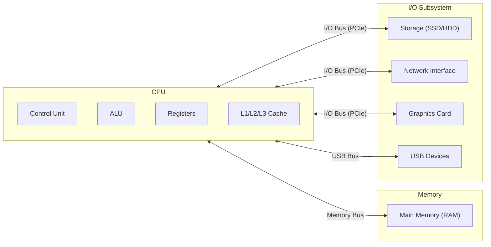

### The CPU

The **Central Processing Unit** is the brain of the computer. Key components:

| Component | Role |
|-----------|------|
| **Control Unit (CU)** | Fetches and decodes instructions, coordinates execution |
| **Arithmetic Logic Unit (ALU)** | Performs mathematical and logical operations |
| **Registers** | Ultra-fast storage (nanoseconds) for immediate data |
| **Program Counter (PC)** | Holds the address of the next instruction to execute |
| **Stack Pointer (SP)** | Points to the top of the current call stack |
| **Status Register (FLAGS)** | Tracks conditions like zero, carry, overflow |

### The Memory Hierarchy

Memory is organized in a hierarchy trading off speed, size, and cost:

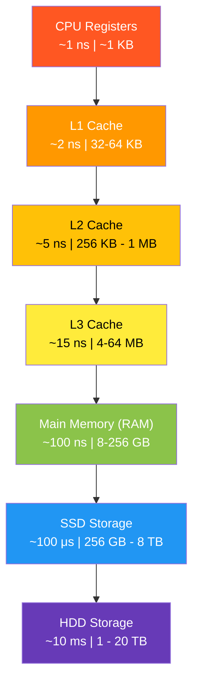

| Level | Typical Latency | Typical Size | Managed By |
|-------|----------------|--------------|------------|
| Registers | < 1 ns | ~1 KB | Compiler / CPU |
| L1 Cache | ~2 ns | 32–64 KB per core | Hardware (CPU) |
| L2 Cache | ~5 ns | 256 KB–1 MB per core | Hardware (CPU) |
| L3 Cache | ~15 ns | 4–64 MB shared | Hardware (CPU) |
| RAM | ~100 ns | 8–256 GB | **Operating System** |
| SSD | ~100 μs | 256 GB–8 TB | **Operating System** |
| HDD | ~10 ms | 1–20 TB | **Operating System** |

The OS manages RAM and below — everything from physical memory allocation to disk I/O scheduling.

### The I/O Bus Architecture

Modern systems use multiple bus types connecting the CPU to peripherals:

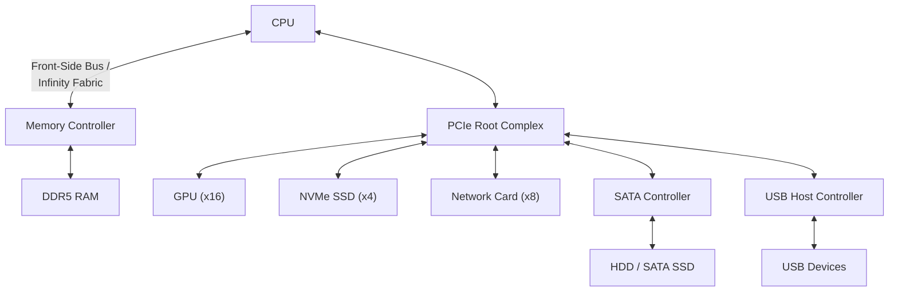

**PCIe (Peripheral Component Interconnect Express)** is the dominant I/O bus in modern systems, providing high-bandwidth, low-latency connections with lane-based scaling (x1, x4, x8, x16).

---

## The Instruction Cycle

The CPU executes instructions in a continuous loop called the **instruction cycle** (also called the fetch-decode-execute cycle).

### The Three Phases

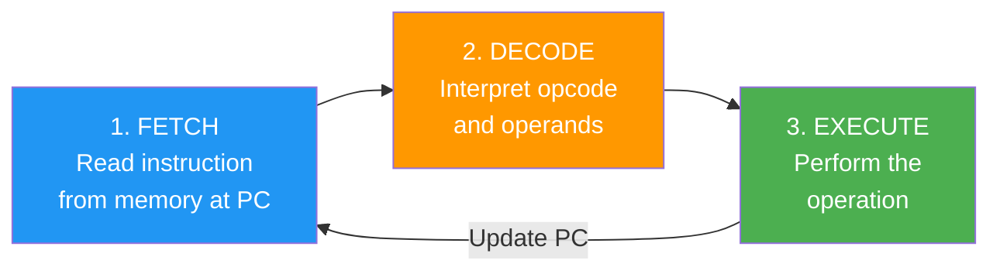

**Step 1: Fetch**
- The CPU reads the instruction at the address stored in the **Program Counter (PC)**
- The instruction is loaded into the **Instruction Register (IR)**
- The PC is incremented to point to the next instruction

**Step 2: Decode**
- The control unit interprets the binary instruction
- It determines the **opcode** (what operation) and **operands** (what data)
- It signals the appropriate functional units

**Step 3: Execute**
- The ALU, memory unit, or I/O unit performs the operation
- Results are written to registers or memory
- Status flags are updated

### Example: Adding Two Numbers

```nasm
; x86 Assembly: add two numbers
; Assume: EAX = 5, EBX = 3

ADD EAX, EBX    ; Fetch: read this instruction
                ; Decode: ADD operation, operands EAX and EBX
                ; Execute: EAX = EAX + EBX = 8
```

### Pipelining

Modern CPUs don't execute one instruction at a time — they use **pipelining** to overlap stages:

```
Time:    T1    T2    T3    T4    T5    T6
Inst 1:  [F]   [D]   [E]
Inst 2:        [F]   [D]   [E]
Inst 3:              [F]   [D]   [E]
Inst 4:                    [F]   [D]   [E]
```

This means multiple instructions are in-flight simultaneously, dramatically improving throughput.

---

## Interrupts and Interrupt Handling

**Interrupts** are signals that cause the CPU to temporarily stop its current work and handle an urgent event. They are the foundation of responsive, multitasking operating systems.

### Why Interrupts Exist

Without interrupts, the CPU would need to **poll** (repeatedly check) every device to see if it needs attention. This wastes enormous amounts of CPU time. Interrupts let devices say "I need attention NOW" and the CPU responds immediately.

### Types of Interrupts

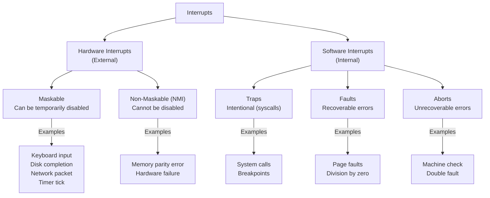

### The Interrupt Handling Process

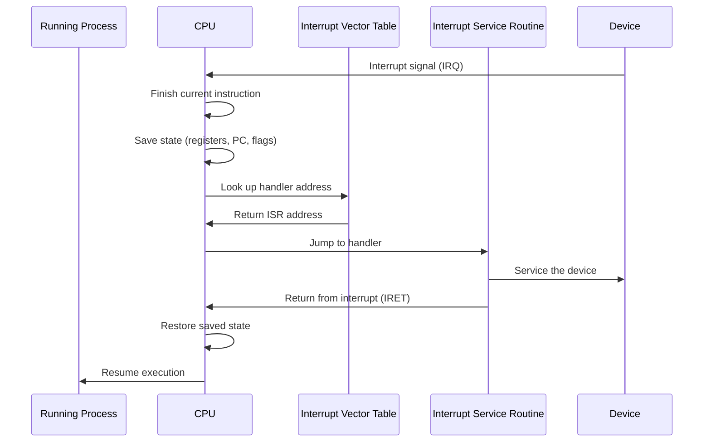

### Interrupt Vector Table (IVT)

The **Interrupt Vector Table** (or **Interrupt Descriptor Table** on x86-64) maps interrupt numbers to handler addresses:

| Vector | Interrupt | Description |
|--------|-----------|-------------|
| 0 | #DE | Division Error |
| 6 | #UD | Invalid Opcode |
| 8 | #DF | Double Fault |
| 13 | #GP | General Protection Fault |
| 14 | #PF | Page Fault |
| 32–255 | IRQ 0–223 | Hardware interrupts (timer, keyboard, disk…) |
| 128 (0x80) | Syscall | Linux legacy system call entry |

### Viewing Interrupts on Linux

```bash
# View interrupt counters per CPU
cat /proc/interrupts

# Example output:
#            CPU0       CPU1
#   0:         45          0   IO-APIC   2-edge      timer
#   1:       1423          0   IO-APIC   1-edge      i8042
#   8:          0          0   IO-APIC   8-edge      rtc0
#   9:          0          3   IO-APIC   9-fasteoi   acpi
#  12:       2156          0   IO-APIC  12-edge      i8042

# Watch interrupts in real time
watch -n 1 cat /proc/interrupts
```

---

## System Calls and the Syscall Interface

A **system call (syscall)** is the mechanism by which user-space programs request services from the kernel. It's the controlled gateway between unprivileged and privileged code.

### How a System Call Works

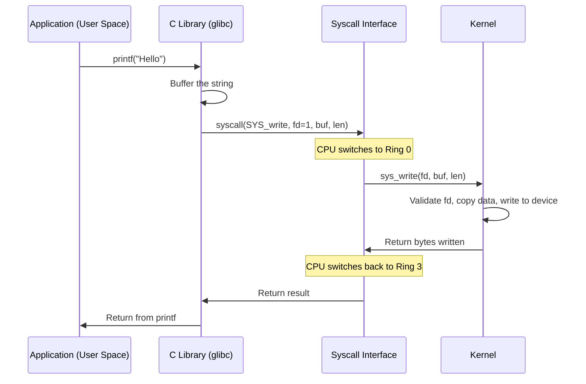

### System Call Categories

| Category | Examples | Description |
|----------|----------|-------------|
| **Process** | `fork()`, `exec()`, `exit()`, `wait()` | Create, run, and manage processes |
| **File** | `open()`, `read()`, `write()`, `close()` | File I/O operations |
| **Device** | `ioctl()`, `mmap()` | Device control and memory mapping |
| **Information** | `getpid()`, `uname()`, `time()` | Query system/process info |
| **Communication** | `pipe()`, `socket()`, `shmget()` | Inter-process communication |
| **Protection** | `chmod()`, `chown()`, `setuid()` | Security and permissions |

### Tracing System Calls

The `strace` tool lets you observe every system call a program makes:

```bash
# Trace all syscalls of the ls command
strace ls /tmp

# Count syscalls by type
strace -c ls /tmp

# Example output:
# % time     seconds  usecs/call     calls    errors syscall
# ------ ----------- ----------- --------- --------- --------
#  32.14    0.000045           3        13           read
#  24.29    0.000034           2        15           close
#  15.00    0.000021           1        15           openat
#  10.71    0.000015           1        15           fstat
#   7.14    0.000010           5         2           getdents64
#   5.71    0.000008           2         4           mmap
#   5.00    0.000007           7         1           write

# Trace a specific syscall
strace -e trace=open,read,write ls /tmp

# Trace a running process by PID
strace -p 1234
```

### The Syscall Mechanism on x86-64 Linux

On modern x86-64 Linux, system calls use the `syscall` instruction:

```nasm
; x86-64 Linux: write "Hello\n" to stdout
section .data
    msg db "Hello", 10      ; 10 = newline
    len equ $ - msg

section .text
    global _start

_start:
    mov rax, 1              ; syscall number: sys_write
    mov rdi, 1              ; file descriptor: stdout
    mov rsi, msg            ; pointer to buffer
    mov rdx, len            ; number of bytes
    syscall                 ; trigger the syscall

    mov rax, 60             ; syscall number: sys_exit
    xor rdi, rdi            ; exit code: 0
    syscall
```

---

## Privileged vs Unprivileged Mode

### Mode Switching

The CPU has a **mode bit** in its status register that determines the current privilege level:

- **Privileged mode (kernel mode, Ring 0):** All instructions are available, including I/O, interrupt control, and memory management instructions
- **Unprivileged mode (user mode, Ring 3):** Privileged instructions are forbidden; attempting them triggers a trap

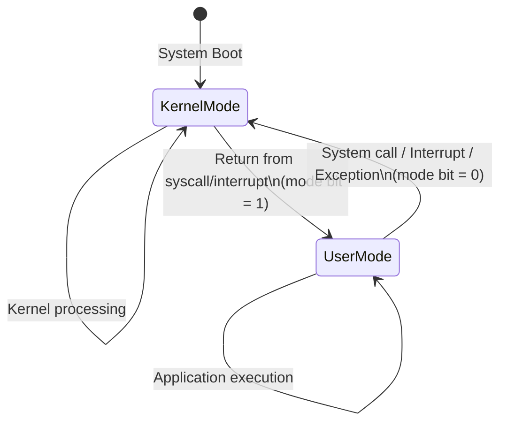

### Privileged Instructions

Only kernel-mode code can execute these instructions:

| Instruction Type | Examples | Why Privileged |
|-----------------|----------|----------------|
| I/O instructions | `IN`, `OUT` | Direct hardware access |
| Interrupt control | `CLI` (disable), `STI` (enable) | Could block system response |
| Memory management | Load page table base register | Could access other processes' memory |
| Mode switching | `IRET`, `SYSRET` | Controls privilege level |
| Halt | `HLT` | Stops the CPU |

### What Happens When User Code Tries a Privileged Instruction

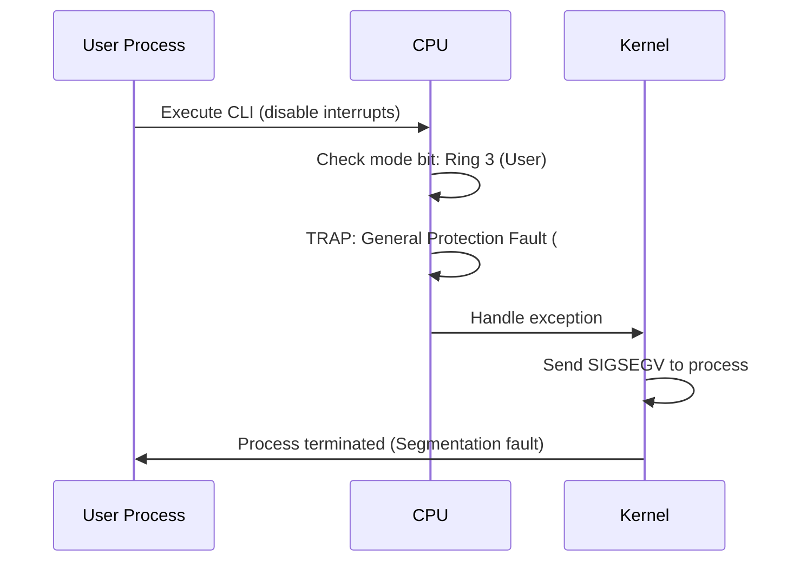

---

## Hardware Abstraction Layer (HAL)

The **Hardware Abstraction Layer** is a software layer that presents a uniform interface to the rest of the OS, regardless of the specific hardware underneath.

### Why HAL Exists

Different hardware vendors implement things differently — interrupt controllers, timers, bus protocols, and power management all vary. The HAL hides these differences so the kernel doesn't need hardware-specific code paths everywhere.

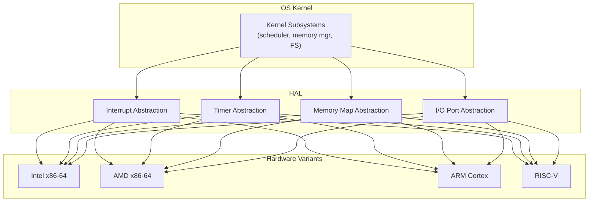

### HAL in Different Operating Systems

| OS | HAL Implementation |
|----|-------------------|
| **Windows NT** | Explicit `hal.dll` — separate DLL loaded at boot for each hardware platform |
| **Linux** | No formal HAL layer; uses architecture-specific code in `arch/` directories |
| **macOS** | IOKit framework provides hardware abstraction for device drivers |

### Linux Architecture Directories

```bash
# View architecture-specific kernel code
ls /usr/src/linux/arch/
# Output: arm  arm64  mips  powerpc  riscv  x86  ...

# The x86 directory contains x86-specific HAL-like code
ls /usr/src/linux/arch/x86/kernel/
# Output: apic/  cpu/  irq.c  setup.c  time.c  ...
```

---

## Putting It All Together

Here's how all these components interact when you type a key on your keyboard:

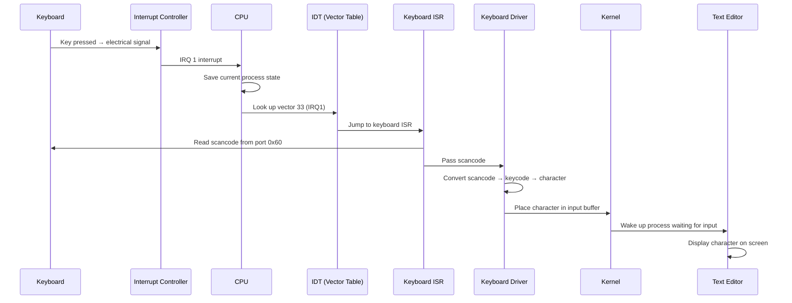

### Exploring System Architecture on Linux

```bash
# CPU information
lscpu

# Memory map
cat /proc/iomem | head -20

# I/O ports
sudo cat /proc/ioports | head -20

# PCI devices (I/O bus)
lspci

# Interrupt assignments
cat /proc/interrupts | head -20

# System call table (number of defined syscalls)
ausyscall --dump | wc -l

# DMA channels
cat /proc/dma
```

---

## Key Takeaways

1. **Computer architecture** centers on the CPU (control unit, ALU, registers), a memory hierarchy (registers → caches → RAM → disk), and an I/O bus connecting peripherals.

2. The **instruction cycle** (fetch-decode-execute) is the fundamental operation loop of the CPU. Modern CPUs pipeline this to execute multiple instructions simultaneously.

3. **Interrupts** allow hardware and software to signal the CPU for immediate attention, replacing wasteful polling. The Interrupt Vector Table maps interrupt numbers to handler routines.

4. **System calls** are the controlled gateway between user space and kernel space. Applications use them to request OS services like file I/O, process creation, and networking.

5. **Privileged mode** (Ring 0) gives full hardware access while **unprivileged mode** (Ring 3) restricts dangerous operations. The CPU enforces this boundary in hardware.

6. The **Hardware Abstraction Layer** provides a uniform interface over varying hardware, allowing the same OS kernel to run on different processor architectures and hardware configurations.
