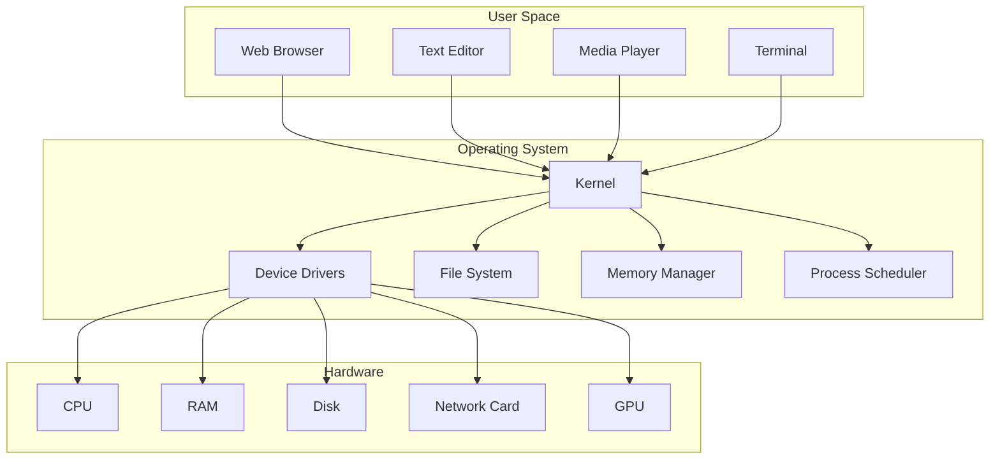
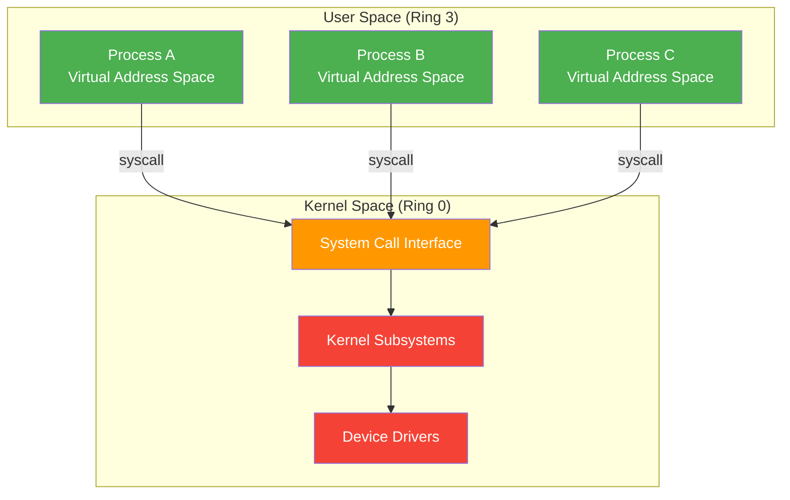
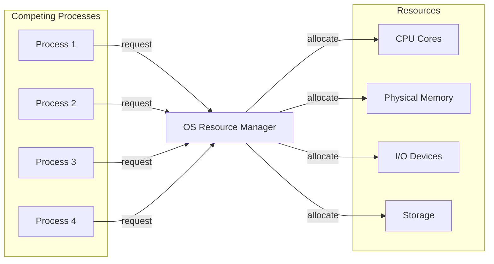
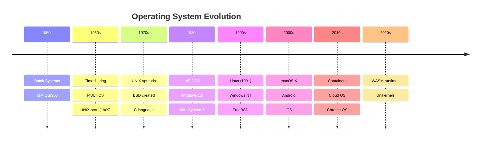
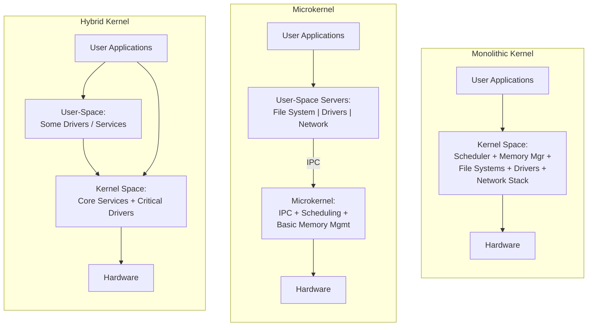
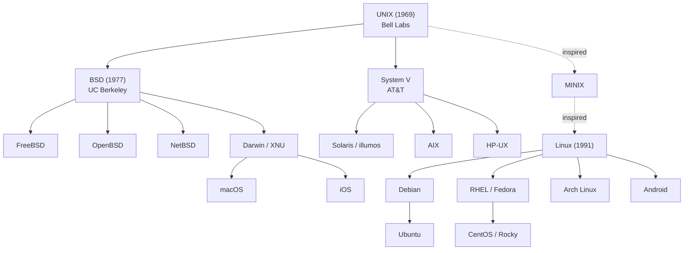
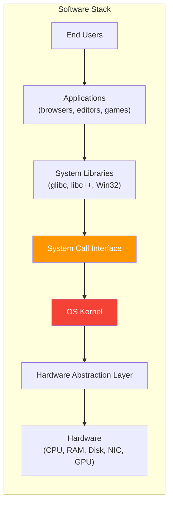

## Learning Objectives

By the end of this lesson, you will be able to:

- Define what an operating system is and why it exists
- Distinguish between kernel space and user space
- Explain the three core roles of an OS: resource management, abstraction, and isolation
- Trace the historical evolution of operating systems
- Compare monolithic, microkernel, and hybrid kernel architectures
- Identify the major OS families and their lineage

## Prerequisites

No prior operating systems knowledge is required. A basic understanding of how computers work (CPU, memory, storage) is helpful but not mandatory.

---

## What Exactly Is an Operating System?

An **operating system (OS)** is system software that acts as an intermediary between computer hardware and the applications you run. Without an OS, every program would need to manage hardware directly — dealing with memory chips, disk controllers, network cards, and display adapters on its own.

Think of the OS as the **manager of a building**. Tenants (applications) don't negotiate directly with the power company or plumbing — the building manager handles all of that infrastructure, provides a clean interface (light switches, faucets), and ensures tenants don't interfere with each other.



### A Formal Definition

An operating system is a collection of software that:

1. **Manages hardware resources** (CPU time, memory, I/O devices)
2. **Provides abstractions** so programs don't need to know hardware details
3. **Enforces isolation** so programs can't crash each other or the system
4. **Offers services** like file systems, networking, and security

---

## Kernel Space vs User Space

Modern operating systems divide memory into two distinct regions with different privilege levels. This separation is fundamental to system stability and security.

### Kernel Space

**Kernel space** is a protected area of memory where the OS kernel executes. Code running here has unrestricted access to all hardware and memory. A bug in kernel space can crash the entire system.

### User Space

**User space** is where all application programs run. Code here cannot directly access hardware or other processes' memory. When a user-space program needs to perform a privileged operation (like reading a file), it must ask the kernel through a **system call**.



### Protection Rings

x86 processors implement four privilege levels called **protection rings**:

| Ring | Name | Purpose | Example |
|------|------|---------|---------|
| Ring 0 | Kernel Mode | Full hardware access | OS kernel, drivers |
| Ring 1 | — | Device drivers (rarely used) | Some hypervisors |
| Ring 2 | — | Device drivers (rarely used) | Rarely used |
| Ring 3 | User Mode | Restricted access | All applications |

Most modern OSes use only Ring 0 (kernel) and Ring 3 (user), ignoring Rings 1 and 2.

### Why This Matters

```c
// This code running in USER SPACE would cause a segfault
// because user-space programs cannot access hardware directly
#include <stdio.h>

int main() {
    // Attempting to write directly to video memory (privileged)
    char *video_memory = (char *)0xB8000;
    *video_memory = 'H';  // SEGFAULT — access denied!
    return 0;
}
```

Instead, programs use system calls:

```c
#include <stdio.h>
#include <unistd.h>

int main() {
    // Correct approach: use a system call (write) to output text
    write(STDOUT_FILENO, "Hello, OS!\n", 11);
    return 0;
}
```

---

## The Three Core Roles of an Operating System

### 1. Resource Management

The OS acts as a **resource manager**, deciding which process gets CPU time, how memory is allocated, and which I/O requests are serviced first.

Key resources managed:

- **CPU time** — The scheduler decides which process runs and for how long
- **Memory** — The memory manager allocates/deallocates RAM and handles virtual memory
- **I/O devices** — The I/O subsystem manages access to disks, network, peripherals
- **Files** — The file system organizes persistent data



### 2. Abstraction

The OS provides **clean abstractions** over messy hardware details. Instead of programming disk controllers directly, you open files. Instead of managing network packets, you use sockets.

| Hardware Reality | OS Abstraction |
|-----------------|----------------|
| Disk sectors, cylinders, platters | Files and directories |
| Physical RAM addresses | Virtual address spaces |
| Network packets, MAC addresses | Sockets and connections |
| CPU instruction cycles | Processes and threads |
| Pixel framebuffers | Windows and graphics contexts |

### 3. Isolation and Protection

The OS ensures that programs are **isolated** from each other:

- **Memory protection** — Process A cannot read or write Process B's memory
- **File permissions** — Users can only access files they're authorized for
- **CPU fairness** — No single process can monopolize the CPU indefinitely
- **Device access control** — Only authorized processes can access devices

---

## History and Evolution of Operating Systems

### First Generation (1940s–1950s): No OS

Early computers had no operating system. Programmers physically wired instructions using patch panels or submitted punch cards. One program ran at a time, and the machine sat idle between jobs.

### Second Generation (1950s–1960s): Batch Systems

**Batch processing** systems collected jobs on tape, ran them sequentially, and printed results. An operator loaded batches and the **resident monitor** program managed job transitions.

### Third Generation (1960s–1980s): Multiprogramming and Timesharing

Key innovations of this era:

- **Multiprogramming** — Multiple jobs loaded in memory simultaneously; while one waits for I/O, another runs
- **Timesharing** — CPU time sliced among interactive users (e.g., UNIX on PDP-11)
- **UNIX** — Born at Bell Labs in 1969, it introduced many concepts still used today

### Fourth Generation (1980s–Present): Personal Computers and Beyond

- **MS-DOS** (1981) — Single-user, single-tasking
- **Windows** (1985+) — Evolved from DOS overlay to full NT kernel
- **Linux** (1991) — Linus Torvalds created a free Unix-like kernel
- **macOS** (2001) — Built on Darwin (Mach microkernel + BSD)
- **Mobile OSes** — Android (Linux-based), iOS (XNU kernel)



---

## Kernel Architectures

The kernel is the core of the operating system. How it's structured has profound implications for performance, reliability, and extensibility.

### Monolithic Kernel

In a **monolithic kernel**, the entire OS runs in a single address space in kernel mode. All subsystems — file systems, device drivers, networking, memory management — share the same space.

**Examples:** Linux, FreeBSD, traditional UNIX

**Advantages:**
- High performance (no context switching between modules)
- Direct function calls between subsystems

**Disadvantages:**
- A bug in any driver can crash the entire kernel
- Harder to maintain as codebase grows

### Microkernel

A **microkernel** runs only essential services in kernel space (IPC, basic scheduling, memory management). Everything else — file systems, drivers, networking — runs as user-space servers.

**Examples:** MINIX 3, QNX, seL4, GNU Hurd

**Advantages:**
- Better fault isolation (a crashed driver doesn't crash the kernel)
- Easier to verify and secure (smaller trusted codebase)

**Disadvantages:**
- Performance overhead from frequent context switches and IPC
- More complex communication between components

### Hybrid Kernel

A **hybrid kernel** combines aspects of both. It keeps performance-critical services in kernel space but modularizes others.

**Examples:** Windows NT, macOS (XNU), DragonFly BSD



### Comparison Table

| Feature | Monolithic | Microkernel | Hybrid |
|---------|-----------|-------------|--------|
| Performance | Excellent | Moderate | Good |
| Reliability | Lower (one bug can crash all) | High (fault isolation) | Moderate |
| Security | Larger attack surface | Smaller attack surface | Medium |
| Complexity | Simpler IPC | Complex IPC | Medium |
| Modularity | Limited (but loadable modules help) | Excellent | Good |
| Examples | Linux, FreeBSD | MINIX 3, QNX, seL4 | Windows NT, macOS XNU |

### Linux: Modular Monolithic

Linux is technically monolithic but supports **loadable kernel modules (LKMs)** that can be inserted and removed at runtime:

```bash
# List currently loaded kernel modules
lsmod

# Get information about a module
modinfo ext4

# Load a kernel module
sudo modprobe vfat

# Remove a kernel module
sudo modprobe -r vfat

# View kernel messages about modules loading
dmesg | tail -20
```

---

## Popular Operating System Families

### The UNIX Family Tree



### Major OS Families

| Family | Kernel | Usage | Key Characteristics |
|--------|--------|-------|-------------------|
| **Linux** | Linux (monolithic) | Servers, cloud, embedded, Android | Open source, POSIX-compliant, dominant in servers |
| **Windows** | NT (hybrid) | Desktops, enterprise, gaming | Win32/WinRT API, NTFS, Active Directory |
| **macOS / iOS** | XNU (hybrid) | Apple devices | Mach + BSD, Metal graphics, tight hardware integration |
| **BSD** | BSD variants | Servers, firewalls, embedded | Permissive license, rock-solid networking |
| **RTOS** | Various | Embedded, automotive, aerospace | Real-time guarantees, deterministic scheduling |

### Checking Your OS Details

```bash
# Linux: kernel version and OS info
uname -a
cat /etc/os-release

# Linux: detailed kernel config
cat /proc/version

# macOS: system version
sw_vers
uname -a

# Any UNIX-like: POSIX info
getconf _POSIX_VERSION
```

Example output on Ubuntu:

```
$ uname -a
Linux server01 6.5.0-44-generic #44-Ubuntu SMP x86_64 GNU/Linux

$ cat /etc/os-release
NAME="Ubuntu"
VERSION="24.04 LTS (Noble Numbat)"
ID=ubuntu
ID_LIKE=debian
```

---

## The OS in Context: Where Does It Sit?



The **system call interface** is the boundary between user space and kernel space. Every interaction between applications and hardware crosses this boundary.

---

## Hands-On: Exploring Your OS

Try these commands to explore your operating system:

```bash
# What kernel are you running?
uname -r

# How long has the system been up?
uptime

# How many CPUs/cores?
nproc
lscpu | head -20

# How much memory?
free -h

# What processes are running?
ps aux | head -20

# What file systems are mounted?
df -hT

# Kernel ring buffer (boot messages, driver info)
dmesg | head -30
```

---

## Key Takeaways

1. **An operating system** is the software layer between hardware and applications that manages resources, provides abstractions, and enforces isolation.

2. **Kernel space vs user space** is a fundamental security boundary — the kernel has full hardware access while user programs must request services through system calls.

3. The three core roles of an OS are **resource management** (CPU, memory, I/O), **abstraction** (files, processes, sockets), and **isolation** (memory protection, permissions).

4. Operating systems evolved from **no OS** (1940s) through **batch systems**, **multiprogramming**, and **timesharing** to today's sophisticated multi-user, multi-tasking systems.

5. **Monolithic kernels** (Linux) put everything in kernel space for performance; **microkernels** (QNX) move services to user space for reliability; **hybrid kernels** (Windows NT, macOS) blend both approaches.

6. The major OS families — **Linux**, **Windows**, **macOS/BSD**, and **RTOS** — each serve different use cases but share many fundamental concepts rooted in UNIX heritage.
